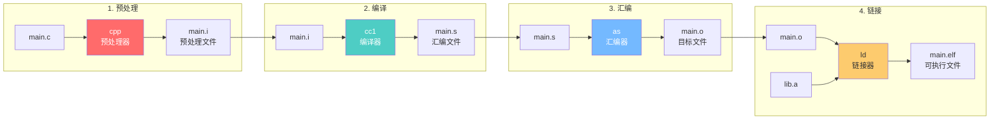
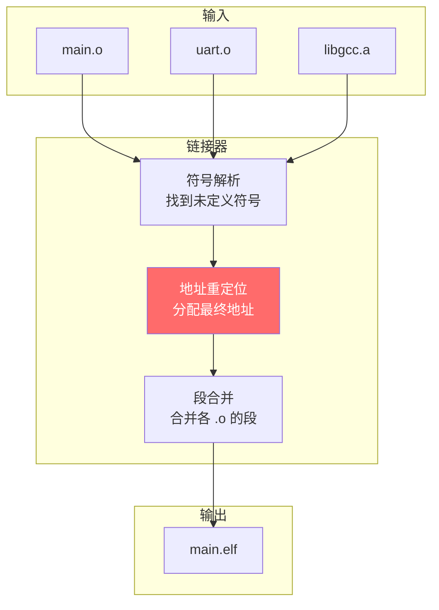
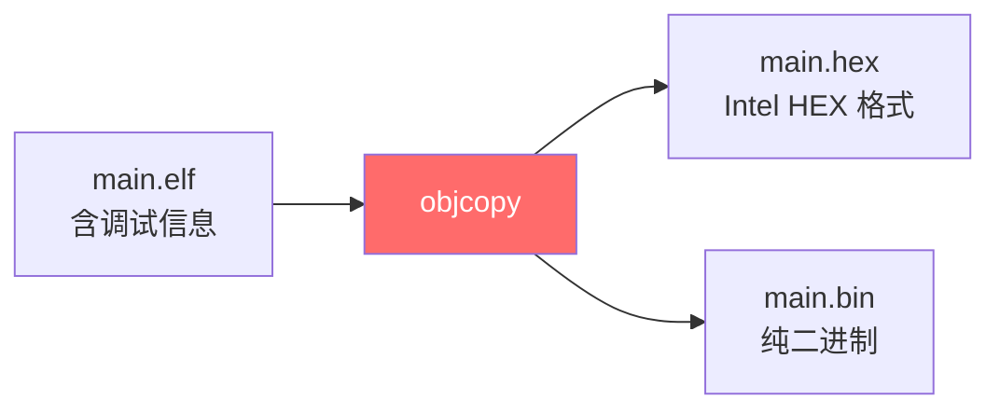

> [!abstract] C 语言编译的完整五阶段流程：预处理（宏展开）→ 编译（生成汇编）→ 汇编（生成 ELF 目标文件）→ 链接（符号解析 + 地址重定位）→ 格式转换（ELF → HEX/BIN）。包含嵌入式交叉编译工具链（arm-none-eabi-gcc）的实战命令。

[Core Dumped:How Real Projects Mix Compiled and Interpreted Languages](https://www.youtube.com/watch?v=RnBOOF502p0&t=229s)

还是推荐看这个Core Dumped的视频，这边深入的解释了不同语言的文件是怎么链接的(多语言程序)，这也与编译过程有关


## 【问题诊断】

你的笔记已经覆盖了四个阶段的基本概念，但缺少：
1. **每个阶段的输入输出文件**
2. **实际命令行工具的使用**
3. **嵌入式交叉编译的特殊性**
4. **目标文件格式（ELF）的结构**
5. **链接脚本的作用**

---

## 【编译过程全景图】



---

## 【第一阶段：预处理】

### 输入输出

```
输入：main.c（源文件）
输出：main.i（预处理文件）
工具：cpp（C Preprocessor）
```

### GCC 命令

```bash
gcc -E main.c -o main.i
```

### 预处理做了什么

```c
/* ========== main.c（预处理前）========== */
#include <stdio.h>
#define MAX_SIZE 100

#ifdef DEBUG
#define LOG(msg) printf("[DEBUG] %s\n", msg)
#else
#define LOG(msg)
#endif

int main(void) {
    int arr[MAX_SIZE];  // 宏展开
    LOG("start");       // 条件编译
    return 0;
}
```

```c
/* ========== main.i（预处理后）========== */
/* 800+ 行，#include <stdio.h> 被展开 */
typedef unsigned int size_t;
typedef unsigned short wchar_t;
/* ... stdio.h 的所有内容 ... */

int main(void) {
    int arr[100];       /* 宏已展开 */
    ;                   /* LOG 宏被替换为空 */
    return 0;
}

# 5 "main.c"            /* 行号标记，用于调试 */
```

### 预处理的核心操作

| 操作 | 处理方式 |
|------|---------|
| `#include` | 递归展开，把文件内容插入 |
| `#define` | 文本替换，宏展开 |
| `#ifdef`/`#endif` | 条件保留或删除 |
| `//`、`/* */` | 删除 |
| `#pragma` | 保留，传递给编译器 |
| `#line` | 添加行号和文件名标记 |

---

## 【第二阶段：编译】

### 输入输出

```
输入：main.i（预处理文件）
输出：main.s（汇编文件）
工具：cc1（GCC 编译器核心）
```

### GCC 命令

```bash
gcc -S main.i -o main.s
# 或一步到位
gcc -S main.c -o main.s
```

### 编译的六个子阶段


### 编译产物示例

```c
/* main.c */
int add(int a, int b) {
    return a + b;
}

int main(void) {
    int result = add(1, 2);
    return result;
}
```

```asm
/* main.s（ARM Thumb 汇编） */
    .cpu arm7tdmi
    .arch armv4t
    .text
    .global add
    .type   add, %function
add:
    @ args = 0, pretend = 0, frame = 8
    @ frame_needed = 1, uses_anonymous_args = 0
    push    {r7, lr}
    sub     sp, sp, #8
    add     r7, sp, #0
    str     r0, [r7, #4]      @ 保存参数 a
    str     r1, [r7]          @ 保存参数 b
    ldr     r3, [r7, #4]      @ 取 a
    ldr     r2, [r7]          @ 取 b
    add     r3, r3, r2        @ a + b
    mov     r0, r3            @ 返回值
    add     sp, r7, #0
    pop     {r7, pc}
    .size   add, .-add

    .global main
    .type   main, %function
main:
    push    {r7, lr}
    sub     sp, sp, #8
    add     r7, sp, #0
    movs    r0, #1            @ 参数 a = 1
    movs    r1, #2            @ 参数 b = 2
    bl      add               @ 调用 add
    str     r0, [r7, #4]      @ 保存 result
    ldr     r3, [r7, #4]
    mov     r0, r3
    add     sp, r7, #0
    pop     {r7, pc}
    .size   main, .-main
```

### 编译优化级别

```bash
gcc -O0 main.c -S -o main_O0.s   # 不优化，方便调试
gcc -O1 main.c -S -o main_O1.s   # 基本优化
gcc -O2 main.c -S -o main_O2.s   # 推荐级别
gcc -O3 main.c -S -o main_O3.s   # 激进优化
gcc -Os main.c -S -o main_Os.s   # 优化体积（嵌入式常用）
```

| 级别 | 特点 | 适用场景 |
|------|------|---------|
| `-O0` | 不优化，保留所有变量 | 调试 |
| `-O1` | 基本优化，删除无用代码 | 日常开发 |
| `-O2` | 激进优化，循环展开、内联 | 发布版本 |
| `-O3` | 最激进，可能增大体积 | 性能敏感场景 |
| `-Os` | 优化体积 | 嵌入式 Flash 受限 |

---

## 【第三阶段：汇编】

### 输入输出

```
输入：main.s（汇编文件）
输出：main.o（目标文件）
工具：as（GNU 汇编器）
```

### GCC 命令

```bash
gcc -c main.s -o main.o
# 或一步到位
gcc -c main.c -o main.o
```

### 目标文件结构（ELF 格式）

```
main.o 结构：

┌─────────────────────────────┐
│        ELF Header           │  ← 文件类型、架构信息
├─────────────────────────────┤
│     Section Header Table    │  ← 段表（描述各段位置）
├─────────────────────────────┤
│         .text               │  ← 代码段（机器码）
│   add: 00 68 01 68 ...      │
│   main: f0 b5 83 b0 ...     │
├─────────────────────────────┤
│         .data               │  ← 已初始化全局变量
├─────────────────────────────┤
│         .bss                │  ← 未初始化全局变量（占位）
├─────────────────────────────┤
│         .rodata             │  ← 只读数据（字符串常量）
├─────────────────────────────┤
│         .symtab             │  ← 符号表
│   add    FUNC  0x0000  28   │
│   main   FUNC  0x001c  36   │
├─────────────────────────────┤
│         .strtab             │  ← 字符串表（符号名）
├─────────────────────────────┤
│         .rel.text           │  ← 重定位表
│   call add → 需要重定位      │
└─────────────────────────────┘
```

### 查看目标文件内容

```bash
# 查看段信息
arm-none-eabi-objdump -h main.o

# 查看符号表
arm-none-eabi-nm main.o

# 查看反汇编
arm-none-eabi-objdump -d main.o

# 查看所有信息
arm-none-eabi-readelf -a main.o
```

### 目标文件的关键问题

```
问题：main.o 中的地址是什么？

答案：相对地址（从 0 开始）

main.o 中的符号：
  add  → 0x00000000
  main → 0x0000001c

问题：call add 的目标地址？
答案：暂时填 0，等链接时重定位
```

---

## 【第四阶段：链接】

### 输入输出

```
输入：main.o、其他 .o 文件、库文件
输出：main.elf（可执行文件）
工具：ld（链接器）
```

### GCC 命令

```bash
# 直接链接
gcc main.o -o main.elf

# 嵌入式交叉编译链接
arm-none-eabi-gcc main.o startup.o -T STM32F407.ld -o main.elf
```

### 链接的核心任务



### 符号解析

```c
/* main.c */
extern int uart_init(void);  // 声明，定义在 uart.c

int main(void) {
    uart_init();             // 调用
    return 0;
}
```

```
链接前：
  main.o:   uart_init → UNDEFINED（未定义）
  uart.o:   uart_init → 0x0000（定义）

链接后：
  main.elf: uart_init → 0x08002000（解析成功）
```

### 地址重定位

```
重定位前（main.o）：

地址        指令
0x0000:     BL   0x0000      @ 调用 uart_init，地址暂填 0
0x0004:     MOV  R0, #0

重定位后：

地址        指令
0x08001000: BL   0x08002000  @ uart_init 的真实地址
0x08001004: MOV  R0, #0
```

### 链接脚本的作用

```ld
/* STM32F407.ld */

/* 内存布局 */
MEMORY {
    FLASH (rx)  : ORIGIN = 0x08000000, LENGTH = 512K
    RAM (rwx)   : ORIGIN = 0x20000000, LENGTH = 128K
}

/* 段布局 */
SECTIONS {
    /* 中断向量表（必须放在 Flash 起始） */
    .isr_vector : {
        . = ALIGN(4);
        KEEP(*(.isr_vector))
        . = ALIGN(4);
    } > FLASH
    
    /* 代码段 */
    .text : {
        *(.text)
        *(.text*)
        *(.rodata)
    } > FLASH
    
    /* 已初始化数据 */
    .data : {
        _sdata = .;
        *(.data)
        _edata = .;
    } > RAM AT > FLASH
    
    _sidata = LOADADDR(.data);
    
    /* 未初始化数据 */
    .bss : {
        _sbss = .;
        *(.bss)
        _ebss = .;
    } > RAM
}
```

---

## 【第五阶段：嵌入式特有——格式转换】

### ELF → HEX/BIN



### 命令

```bash
# 生成 HEX 文件（含地址信息）
arm-none-eabi-objcopy -O ihex main.elf main.hex

# 生成 BIN 文件（纯二进制）
arm-none-eabi-objcopy -O binary main.elf main.bin
```

### 三种格式对比

| 格式 | 内容 | 用途 |
|------|------|------|
| `.elf` | 代码 + 数据 + 符号表 + 调试信息 | 调试、分析 |
| `.hex` | 带地址的二进制（ASCII 格式） | 烧录器下载 |
| `.bin` | 纯二进制（无地址信息） | OTA 升级、直接烧录 |

### HEX 文件格式

```
:10000000 0048006801440020C5010008D9010008 84
││││││││││ └──────────────────────────────┘ └─ 校验和
││││││││││              └─ 数据（16 字节）
│││││││││└─ 数据长度（16 字节 = 0x10）
││││││││└─ 记录类型（00 = 数据）
│││││││└─ 起始地址（0x0000）
││││││└─ 冒号起始符
```

---

## 【完整编译流程示例】

### 项目结构

```
project/
├── Src/
│   ├── main.c
│   ├── uart.c
│   └── stm32f4xx_it.c
├── Inc/
│   ├── main.h
│   └── uart.h
├── Drivers/
│   └── stm32f4xx_hal.c
├── startup_stm32f407xx.s
└── STM32F407.ld
```

### Makefile

```makefile
CC = arm-none-eabi-gcc
OBJCOPY = arm-none-eabi-objcopy
LD = arm-none-eabi-gcc

CFLAGS = -mcpu=cortex-m4 -mthumb -Wall -O2
CFLAGS += -I./Inc
LDFLAGS = -T STM32F407.ld -specs=nosys.specs

SRCS = Src/main.c Src/uart.c Drivers/stm32f4xx_hal.c
OBJS = $(SRCS:.c=.o) startup_stm32f407xx.o

all: main.elf main.hex main.bin

# 编译 C 文件
%.o: %.c
	$(CC) $(CFLAGS) -c $< -o $@

# 汇编启动文件
%.o: %.s
	$(CC) -c $< -o $@

# 链接
main.elf: $(OBJS)
	$(LD) $(LDFLAGS) $(OBJS) -o $@

# 格式转换
main.hex: main.elf
	$(OBJCOPY) -O ihex $< $@

main.bin: main.elf
	$(OBJCOPY) -O binary $< $@

clean:
	rm -f $(OBJS) main.elf main.hex main.bin
```

### 编译过程详解

```bash
# 1. 预处理
arm-none-eabi-gcc -E main.c -I./Inc -o main.i

# 2. 编译
arm-none-eabi-gcc -S main.i -o main.s

# 3. 汇编
arm-none-eabi-gcc -c main.s -o main.o

# 4. 链接
arm-none-eabi-gcc main.o uart.o startup.o -T STM32F407.ld -o main.elf

# 5. 格式转换
arm-none-eabi-objcopy -O ihex main.elf main.hex
arm-none-eabi-objcopy -O binary main.elf main.bin
```

---

## 【静态链接 vs 动态链接】

### 嵌入式视角

```
嵌入式开发：
  - 几乎只用静态链接
  - 动态链接需要操作系统支持
  - 静态链接：所有代码打包进一个 ELF/BIN

Linux 开发：
  - 动态链接常见
  - 共享库节省内存
  - 更新库无需重新编译程序
```

### 静态链接示例

```bash
# 编译静态库
arm-none-eabi-gcc -c uart.c -o uart.o
arm-none-eabi-ar rcs libuart.a uart.o

# 使用静态库
arm-none-eabi-gcc main.c -L. -luart -o main.elf
```

---

## 【调试信息】

### 生成调试信息

```bash
# 添加 -g 选项
arm-none-eabi-gcc -g -O0 main.c -c -o main.o
```

### 调试信息的作用

```
ELF 中的调试段：
  .debug_info     → 变量、函数、类型信息
  .debug_line     → 源码行号与地址映射
  .debug_abbrev   → 缩写表
  .debug_str      → 字符串表

GDB 调试时：
  → 通过 .debug_line 把 PC 地址映射到源码行号
  → 通过 .debug_info 显示变量名和类型
```

### 查看 ELF 大小

```bash
arm-none-eabi-size main.elf

# 输出：
#    text    data     bss     dec     hex filename
#   12345     256    1024   13625    3539 main.elf

# text: 代码段大小（Flash）
# data: 已初始化数据（Flash + RAM）
# bss:  未初始化数据（RAM）
```

---

## 【大师的工程建议】

### 记忆口诀

```
预处理：展开宏和头文件（.c → .i）
编译：  源码变汇编（.i → .s）
汇编：  汇编变机器码（.s → .o）
链接：  多文件合并重定位（.o → .elf）
```

### 常用分析命令

| 命令 | 用途 |
|------|------|
| `gcc -E` | 查看预处理结果 |
| `gcc -S` | 查看编译生成的汇编 |
| `objdump -d` | 反汇编目标文件 |
| `nm` | 查看符号表 |
| `readelf -a` | 查看 ELF 所有信息 |
| `size` | 查看段大小 |
| `objcopy -O binary` | 提取纯二进制 |

### 避坑指南

| 陷阱 | 后果 | 解决 |
|------|------|------|
| 头文件循环包含 | 编译错误 | 用 `#ifndef` 或 `#pragma once` |
| 链接顺序错误 | 未定义符号 | 库放在最后，依赖库放更后 |
| 忘记 `-g` | 无法调试 | Debug 版本加 `-g` |
| 优化级别太高 | 调试时变量被优化 | 调试用 `-O0`，发布用 `-O2` |

---

**一句话总结**：C 语言编译 = **预处理（展开）→ 编译（生成汇编）→ 汇编（生成目标文件）→ 链接（合并重定位）**。嵌入式还需 **objcopy 转换格式**，最终生成 `.hex`/`.bin` 烧录文件。