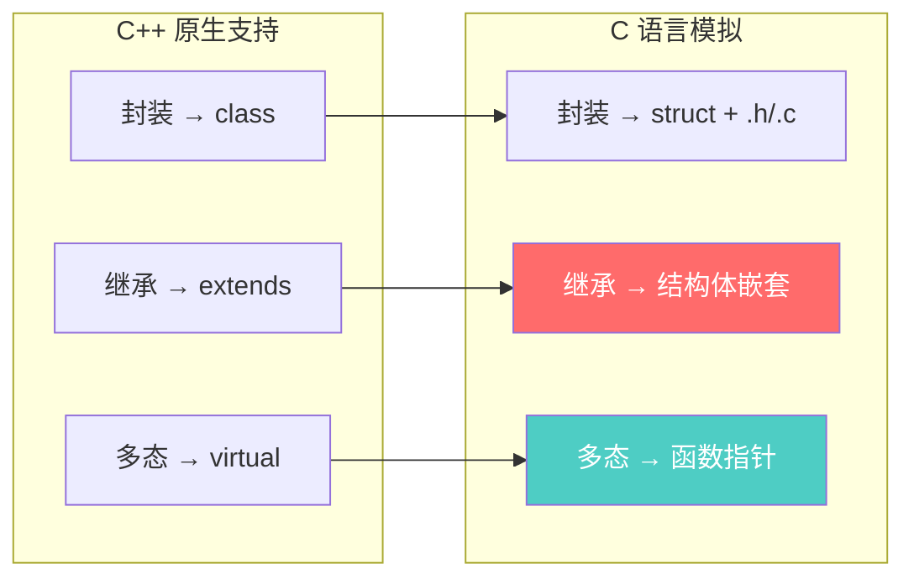
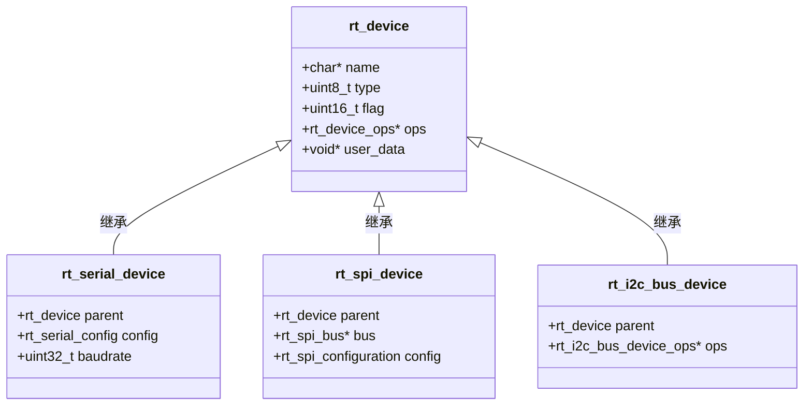
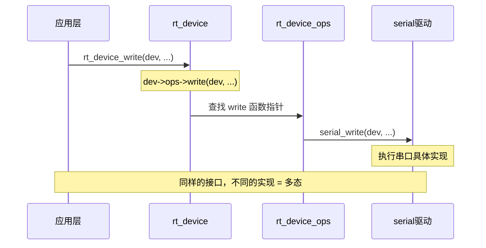
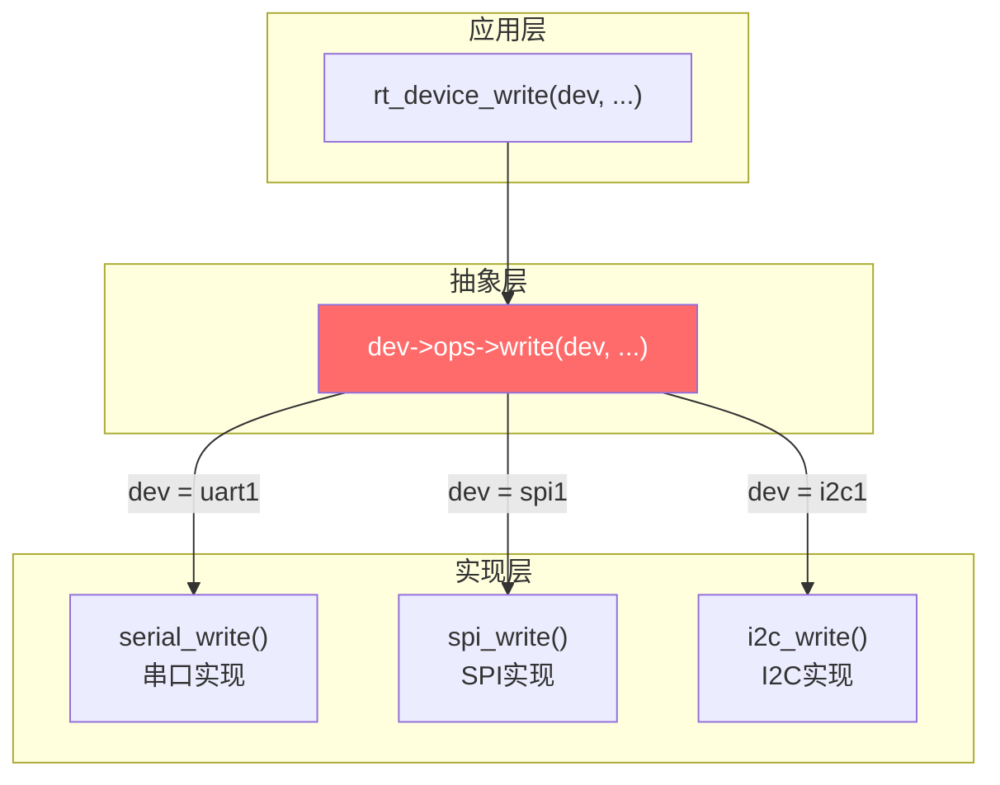
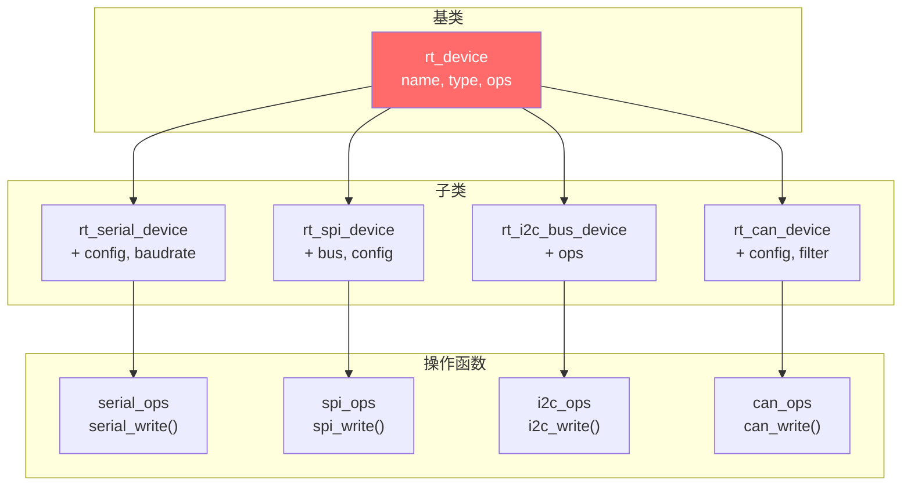

> [!abstract] C 语言通过结构体嵌套实现继承、通过函数指针表（ops）实现多态。以 RT-Thread 设备驱动框架（rt_device + rt_device_ops）为教科书级范例，展示如何在纯 C 中构建面向对象的设备抽象层。

## 【问题诊断】

C 语言没有 `class`、`extends`、`virtual` 关键字，但可以通过**结构体嵌套 + 函数指针**实现继承和多态。RT-Thread 的设备驱动框架是**教科书级别的实现**。

---

## 【根本原因分析】

### 面向对象三要素在 C 中的实现



---

## 【第一步：继承的实现】

### 1.1 结构体嵌套原理

```c
/* 父类：设备基类 */
struct rt_device {
    char *name;                     /* 设备名称 */
    rt_uint8_t type;                /* 设备类型 */
    rt_uint16_t flag;               /* 设备标志 */
    const struct rt_device_ops *ops;/* 操作方法（多态关键） */
    void *user_data;                /* 用户数据 */
};

/* 子类：串口设备（继承自 rt_device） */
struct rt_serial_device {
    struct rt_device parent;        /* ★ 嵌套父类，实现继承 */
    
    /* 子类特有属性 */
    struct rt_serial_config config; /* 串口配置 */
    rt_uint32_t baudrate;           /* 波特率 */
    /* ... */
};
```

### 1.2 继承关系图



### 1.3 继承的使用

```c
/* 创建串口设备实例 */
struct rt_serial_device serial1;

/* 访问父类成员 */
serial1.parent.name = "uart1";
serial1.parent.type = RT_Device_Class_Char;

/* 访问子类成员 */
serial1.baudrate = 115200;

/* 父类指针指向子类对象（多态基础） */
struct rt_device *dev = (struct rt_device *)&serial1;
```

---

## 【第二步：多态的实现】

### 2.1 函数指针实现虚函数

```c
/* 设备操作函数指针表（虚函数表） */
struct rt_device_ops {
    rt_err_t  (*init)   (rt_device_t dev);
    rt_err_t  (*open)   (rt_device_t dev, rt_uint16_t oflag);
    rt_err_t  (*close)  (rt_device_t dev);
    rt_size_t (*read)   (rt_device_t dev, rt_off_t pos, void *buffer, rt_size_t size);
    rt_size_t (*write)  (rt_device_t dev, rt_off_t pos, const void *buffer, rt_size_t size);
    rt_err_t  (*control)(rt_device_t dev, int cmd, void *args);
};
```

### 2.2 多态调用流程



### 2.3 串口驱动的多态实现

```c
/* ========== 串口驱动的操作函数实现 ========== */
static rt_err_t  serial_init(rt_device_t dev) {
    struct rt_serial_device *serial = (struct rt_serial_device *)dev;
    /* 串口初始化具体实现 */
    return RT_EOK;
}

static rt_size_t serial_write(rt_device_t dev, rt_off_t pos, 
                               const void *buffer, rt_size_t size) {
    struct rt_serial_device *serial = (struct rt_serial_device *)dev;
    /* 串口发送具体实现 */
    return size;
}

/* ========== 函数指针表（虚函数表实例） ========== */
static const struct rt_device_ops serial_ops = {
    .init    = serial_init,
    .open    = serial_open,
    .close   = serial_close,
    .read    = serial_read,
    .write   = serial_write,
    .control = serial_control,
};

/* ========== 注册串口设备 ========== */
int rt_hw_serial_init(void) {
    static struct rt_serial_device serial1;
    
    /* 设置父类成员 */
    serial1.parent.type = RT_Device_Class_Char;
    serial1.parent.ops  = &serial_ops;  /* ★ 绑定操作函数表 */
    
    /* 注册到设备框架 */
    rt_device_register(&serial1.parent, "uart1", RT_DEVICE_FLAG_RDWR);
    
    return 0;
}
INIT_DEVICE_EXPORT(rt_hw_serial_init);
```

---

## 【第三步：统一接口调用】

### 3.1 设备框架的统一 API

```c
/* 应用层统一使用 rt_device_xxx 接口 */
rt_device_t dev = rt_device_find("uart1");
rt_device_open(dev, RT_DEVICE_FLAG_RDWR);

/* 写数据 —— 不用关心底层是串口还是 SPI */
rt_device_write(dev, 0, data, len);

/* 读数据 */
rt_device_read(dev, 0, buffer, sizeof(buffer));

rt_device_close(dev);
```

### 3.2 多态的本质

```c
/* rt_device_write 的实现 */
rt_size_t rt_device_write(rt_device_t dev, rt_off_t pos, 
                           const void *buffer, rt_size_t size) {
    /* 调用函数指针 —— 具体执行哪个函数由 dev->ops 决定 */
    if (dev->ops->write != RT_NULL) {
        return dev->ops->write(dev, pos, buffer, size);
    }
    return 0;
}
```



---

## 【第四步：完整示例——模拟 RT-Thread 设备框架】

### 4.1 定义基类和虚函数表

```c
/* ========== device.h ========== */
#ifndef __DEVICE_H__
#define __DEVICE_H__

#include <stdint.h>
#include <stddef.h>

/* 前向声明 */
typedef struct device device_t;

/* 虚函数表（操作函数指针） */
typedef struct {
    int  (*init)(device_t *dev);
    int  (*open)(device_t *dev, int flags);
    int  (*close)(device_t *dev);
    int  (*read)(device_t *dev, void *buf, size_t len);
    int  (*write)(device_t *dev, const void *buf, size_t len);
} device_ops_t;

/* 设备基类 */
struct device {
    const char *name;           /* 设备名称 */
    uint8_t     type;           /* 设备类型 */
    uint8_t     flags;          /* 标志 */
    const device_ops_t *ops;    /* 操作函数表 */
    void       *user_data;      /* 用户数据 */
};

/* 统一 API */
device_t *device_find(const char *name);
int       device_register(device_t *dev, const char *name);
int       device_open(device_t *dev, int flags);
int       device_close(device_t *dev);
int       device_read(device_t *dev, void *buf, size_t len);
int       device_write(device_t *dev, const void *buf, size_t len);

#endif
```

### 4.2 实现框架层

```c
/* ========== device.c ========== */
#include "device.h"
#include <string.h>

#define MAX_DEVICES  10

static device_t *s_devices[MAX_DEVICES];
static int s_device_count = 0;

/* 注册设备 */
int device_register(device_t *dev, const char *name) {
    if (s_device_count >= MAX_DEVICES) {
        return -1;
    }
    dev->name = name;
    s_devices[s_device_count++] = dev;
    return 0;
}

/* 查找设备 */
device_t *device_find(const char *name) {
    for (int i = 0; i < s_device_count; i++) {
        if (strcmp(s_devices[i]->name, name) == 0) {
            return s_devices[i];
        }
    }
    return NULL;
}

/* 打开设备 */
int device_open(device_t *dev, int flags) {
    if (dev && dev->ops && dev->ops->open) {
        dev->flags = flags;
        return dev->ops->open(dev, flags);
    }
    return -1;
}

/* 读设备 */
int device_read(device_t *dev, void *buf, size_t len) {
    if (dev && dev->ops && dev->ops->read) {
        return dev->ops->read(dev, buf, len);
    }
    return -1;
}

/* 写设备 */
int device_write(device_t *dev, const void *buf, size_t len) {
    if (dev && dev->ops && dev->ops->write) {
        return dev->ops->write(dev, buf, len);
    }
    return -1;
}

/* 关闭设备 */
int device_close(device_t *dev) {
    if (dev && dev->ops && dev->ops->close) {
        return dev->ops->close(dev);
    }
    return -1;
}
```

### 4.3 实现串口驱动（子类）

```c
/* ========== drv_uart.h ========== */
#include "device.h"

/* 串口设备（继承 device） */
typedef struct {
    device_t parent;        /* 父类 */
    
    /* 子类特有属性 */
    uint32_t baudrate;
    uint8_t  tx_pin;
    uint8_t  rx_pin;
} uart_device_t;

/* 初始化串口驱动 */
int uart_driver_init(void);
```

```c
/* ========== drv_uart.c ========== */
#include "drv_uart.h"
#include <stdio.h>

/* 串口操作函数实现 */
static int uart_open(device_t *dev, int flags) {
    uart_device_t *uart = (uart_device_t *)dev;  /* 父类指针转子类 */
    printf("UART open: %s, baud=%d\n", dev->name, uart->baudrate);
    return 0;
}

static int uart_write(device_t *dev, const void *buf, size_t len) {
    printf("UART write %zu bytes: %.*s\n", len, (int)len, (const char *)buf);
    return len;
}

static int uart_read(device_t *dev, void *buf, size_t len) {
    printf("UART read %zu bytes\n", len);
    return len;
}

static int uart_close(device_t *dev) {
    printf("UART close: %s\n", dev->name);
    return 0;
}

/* 虚函数表 */
static const device_ops_t uart_ops = {
    .open  = uart_open,
    .close = uart_close,
    .read  = uart_read,
    .write = uart_write,
};

/* 串口设备实例 */
static uart_device_t uart1 = {
    .parent = {
        .name = "uart1",
        .type = 1,  /* 字符设备 */
        .ops  = &uart_ops,
    },
    .baudrate = 115200,
    .tx_pin   = 9,
    .rx_pin   = 10,
};

/* 初始化并注册 */
int uart_driver_init(void) {
    return device_register(&uart1.parent, "uart1");
}
```

### 4.4 实现 SPI 驱动（另一个子类）

```c
/* ========== drv_spi.c ========== */
#include "device.h"
#include <stdio.h>

typedef struct {
    device_t parent;
    uint32_t speed;
    uint8_t  cs_pin;
} spi_device_t;

static int spi_open(device_t *dev, int flags) {
    spi_device_t *spi = (spi_device_t *)dev;
    printf("SPI open: %s, speed=%d\n", dev->name, spi->speed);
    return 0;
}

static int spi_write(device_t *dev, const void *buf, size_t len) {
    printf("SPI write %zu bytes\n", len);
    return len;
}

static int spi_read(device_t *dev, void *buf, size_t len) {
    printf("SPI read %zu bytes\n", len);
    return len;
}

static int spi_close(device_t *dev) {
    printf("SPI close: %s\n", dev->name);
    return 0;
}

static const device_ops_t spi_ops = {
    .open  = spi_open,
    .close = spi_close,
    .read  = spi_read,
    .write = spi_write,
};

static spi_device_t spi1 = {
    .parent = {
        .name = "spi1",
        .type = 2,
        .ops  = &spi_ops,
    },
    .speed  = 1000000,
    .cs_pin = 5,
};

int spi_driver_init(void) {
    return device_register(&spi1.parent, "spi1");
}
```

### 4.5 应用层使用

```c
/* ========== main.c ========== */
#include "device.h"
#include "drv_uart.h"
#include <stdio.h>

extern int spi_driver_init(void);

int main(void) {
    /* 注册所有设备 */
    uart_driver_init();
    spi_driver_init();
    
    /* ========== 多态调用 ========== */
    device_t *dev;
    
    /* 使用串口 */
    dev = device_find("uart1");
    device_open(dev, 0);
    device_write(dev, "Hello", 5);
    device_close(dev);
    
    /* 使用 SPI —— 同样的 API，不同的实现 */
    dev = device_find("spi1");
    device_open(dev, 0);
    device_write(dev, "\x55\xAA", 2);
    device_close(dev);
    
    return 0;
}

/* 输出：
 * UART open: uart1, baud=115200
 * UART write 5 bytes: Hello
 * UART close: uart1
 * SPI open: spi1, speed=1000000
 * SPI write 2 bytes
 * SPI close: spi1
 */
```

---

## 【第五步：RT-Thread 实际例子】

### 5.1 设备类型枚举

```c
/* RT-Thread 设备类型 */
enum rt_device_class_type {
    RT_Device_Class_Char = 0,     /* 字符设备 */
    RT_Device_Class_Block,        /* 块设备 */
    RT_Device_Class_NetIf,        /* 网络接口 */
    RT_Device_Class_MTD,          /* 内存技术设备 */
    RT_Device_Class_CAN,          /* CAN 设备 */
    RT_Device_Class_RTC,          /* RTC 设备 */
    RT_Device_Class_Sound,        /* 音频设备 */
    RT_Device_Class_Graphic,      /* 图形设备 */
    RT_Device_Class_I2CBUS,       /* I2C 总线 */
    RT_Device_Class_USBDevice,    /* USB 设备 */
    RT_Device_Class_USBHost,      /* USB 主机 */
    RT_Device_Class_SPIBUS,       /* SPI 总线 */
    RT_Device_Class_SPIDevice,    /* SPI 设备 */
    RT_Device_Class_SDIO,         /* SDIO 设备 */
};
```

### 5.2 继承层次



---

## 【大师的工程建议】

### 记忆口诀

```
继承 = 结构体嵌套父类
多态 = 函数指针 + 虚函数表
统一接口 = 父类指针调用 ops->xxx()
```

### 设计模式总结

| 概念 | C++ 实现 | C 语言实现 |
|------|---------|-----------|
| 类 | `class` | `struct` |
| 继承 | `class B : public A` | `struct B { struct A parent; }` |
| 虚函数 | `virtual void foo()` | 函数指针 `void (*foo)(...)` |
| 虚函数表 | 编译器自动生成 | 手动定义 `xxx_ops` 结构体 |
| 多态调用 | `obj->foo()` | `obj->ops->foo(obj)` |

### 避坑指南

| 陷阱 | 后果 | 解决 |
|------|------|------|
| 父类成员不在首位 | 指针转换错误 | 父类成员放结构体开头 |
| 忘记绑定 ops | 调用空指针崩溃 | 注册时检查 ops 非空 |
| 子类指针直接当父类用 | 内存布局错误 | 用 `&sub.parent` 或强制转换 |
| 函数指针签名不匹配 | 栈破坏 | 严格匹配参数类型 |

### 为什么 RT-Thread 这样设计？

```
优势：
1. 统一 API：应用层只需学 rt_device_xxx()
2. 可扩展：新增设备类型不影响框架代码
3. 解耦：驱动和应用通过 ops 表解耦
4. 可移植：驱动开发者只需实现 ops 函数
```

---

**一句话总结**：C 语言实现继承靠**结构体嵌套**（子类包含父类成员），实现多态靠**函数指针表**（ops 结构体）。RT-Thread 的 `rt_device` + `rt_device_ops` 是最佳实践范例。