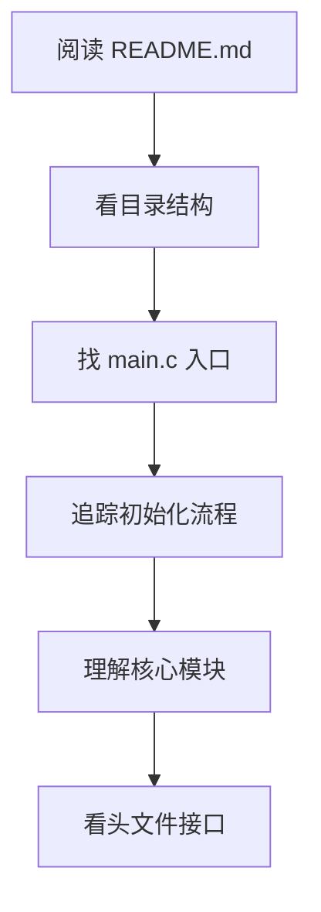

> [!abstract] 嵌入式 C 语言工程的通用规范速查手册，涵盖 Doxygen 注释风格、命名规范（蛇形/驼峰）、常见缩写词典、代码风格（K&R/Allman）、文件组织模板（.h/.c 分工）、宏定义规范和工程目录结构。

## 【问题诊断】

阅读开源项目时，主要会遇到这些"工程语言"障碍：

| 障碍类型 | 典型问题 |
|---------|---------|
| 注释风格 | `@brief`、`@param`、`@return` 是什么？ |
| 命名规范 | 驼峰还是下划线？宏为什么全大写？ |
| 常见缩写 | `buf`、`cnt`、`ptr`、`cfg` 是什么意思？ |
| 代码风格 | 大括号换行还是不换行？ |
| 文件组织 | `.h` 和 `.c` 怎么分工？ |

---

## 【一、注释风格】

### 1.1 Doxygen 风格（最常见）

```c
/**
 * @brief  简要描述
 * @note   详细说明、注意事项
 * @param  arg1 参数1说明
 * @param  arg2 参数2说明
 * @retval 返回值说明
 * @return 返回值说明（另一种写法）
 */
int uart_send(uint8_t *buf, uint32_t len);

/**
 * @brief  初始化串口
 * @note   必须在使用前调用，波特率默认 115200
 * @param  baud 波特率设置
 * @retval 0: 成功
 * @retval -1: 参数错误
 * @retval -2: 硬件故障
 */
int uart_init(uint32_t baud);
```

### 1.2 常见注释标签

| 标签 | 含义 | 示例 |
|------|------|------|
| `@brief` | 简要描述 | `@brief 发送数据` |
| `@param` | 参数说明 | `@param len 数据长度` |
| `@return` | 返回值 | `@return 实际发送字节数` |
| `@retval` | 返回值（枚举式） | `@retval 0 成功` |
| `@note` | 注意事项 | `@note 中断中调用需谨慎` |
| `@warning` | 警告 | `@warning 非线程安全` |
| `@see` | 参见 | `@see uart_recv()` |
| `@todo` | 待办 | `@todo 增加超时处理` |
| `@bug` | 已知问题 | `@bug 高波特率可能丢数据` |

### 1.3 行内注释风格

```c
/* C 风格注释（推荐用于块注释） */
int x = 0;

// C++ 风格注释（推荐用于行尾注释）
int y = 0;  // 初始化计数器

/* TODO: 后续优化 */
/* FIXME: 这里有 bug */
/* HACK: 临时方案 */
/* NOTE: 重要说明 */
```

### 1.4 注释标签含义

| 标签 | 含义 | 使用场景 |
|------|------|---------|
| `TODO` | 待实现 | 功能还没写完 |
| `FIXME` | 需修复 | 已知问题待解决 |
| `HACK` | 临时方案 | 不优雅但能用的代码 |
| `NOTE` | 重要说明 | 需要特别注意的地方 |
| `XXX` | 危险代码 | 可能有问题的地方 |

---

## 【二、命名规范】

### 2.1 三大主流风格

```c
/* 1. 蛇形命名法（Snake Case）—— Linux/嵌入式常用 */
int uart_buffer_size;
void send_data_packet(void);
#define MAX_BUFFER_SIZE  256

/* 2. 驼峰命名法—— C++/Java 风格 */
int uartBufferSize;
void sendDataPacket(void);

/* 3. 帕斯卡命名法—— 类型/模块名 */
typedef struct UartConfig UartConfig_t;
```

### 2.2 命名约定速查表

| 类型 | 风格 | 示例 | 说明 |
|------|------|------|------|
| 宏/枚举值 | 全大写+下划线 | `MAX_SIZE`、`UART_1` | 一眼识别常量 |
| 变量 | 小写+下划线 | `rx_buffer`、`cnt` | Linux 风格 |
| 函数 | 小写+下划线 | `uart_init()` | 动词开头 |
| 类型 | 首字母大写或 `_t` 后缀 | `UartConfig`、`Status_t` | 区分类型 |
| 结构体 | 首字母大写 | `struct UartConfig` | 或 `_s` 后缀 |
| 静态变量 | `s_` 前缀 | `s_instance` | 模块内部 |
| 全局变量 | `g_` 前缀 | `g_systemTick` | 跨文件可见 |

### 2.3 函数命名动词表

| 动词 | 含义 | 示例 |
|------|------|------|
| `init` | 初始化 | `uart_init()` |
| `deinit` | 反初始化 | `uart_deinit()` |
| `open` / `close` | 打开/关闭 | `file_open()` |
| `read` / `write` | 读写 | `eeprom_read()` |
| `send` / `recv` | 发送/接收 | `can_send()` |
| `start` / `stop` | 启动/停止 | `timer_start()` |
| `enable` / `disable` | 使能/禁用 | `irq_enable()` |
| `get` / `set` | 获取/设置 | `get_baudrate()` |
| `is` / `has` | 判断状态 | `is_ready()`、`has_data()` |
| `on` / `on_xxx` | 回调函数 | `on_receive()` |
| `handle` | 处理函数 | `handle_error()` |

---

## 【三、常见缩写词典】

### 3.1 通用缩写

| 缩写 | 全称 | 含义 |
|------|------|------|
| `buf` | buffer | 缓冲区 |
| `cnt` | count | 计数 |
| `len` | length | 长度 |
| `ptr` | pointer | 指针 |
| `addr` | address | 地址 |
| `cfg` | config | 配置 |
| `init` | initialize | 初始化 |
| `deinit` | deinitialize | 反初始化 |
| `tmp` / `temp` | temporary | 临时变量 |
| `ret` | return / result | 返回值 |
| `err` | error | 错误 |
| `idx` | index | 索引 |
| `val` | value | 值 |
| `prev` | previous | 前一个 |
| `cur` | current | 当前 |
| `next` | next | 下一个 |
| `msg` | message | 消息 |
| `evt` | event | 事件 |
| `cb` | callback | 回调 |
| `isr` | interrupt service routine | 中断服务程序 |
| `irq` | interrupt request | 中断请求 |
| `dma` | direct memory access | 直接内存访问 |
| `sem` | semaphore | 信号量 |
| `mux` | mutex | 互斥锁 |
| `tbl` | table | 表 |
| `desc` | descriptor | 描述符 |
| `hdr` | header | 头部 |
| `pkt` | packet | 数据包 |
| `seq` | sequence | 序列 |
| `ack` | acknowledge | 确认 |
| `nack` | not acknowledge | 不确认 |
| `sync` / `async` | synchronize / asynchronous | 同步/异步 |
| `rx` / `tx` | receive / transmit | 接收/发送 |
| `rd` / `wr` | read / write | 读/写 |
| `en` / `dis` | enable / disable | 使能/禁用 |

### 3.2 嵌入式专用缩写

| 缩写 | 全称 | 含义 |
|------|------|------|
| `GPIO` | General Purpose I/O | 通用输入输出 |
| `UART` | Universal Async Receiver Transmitter | 串口 |
| `SPI` | Serial Peripheral Interface | 串行外设接口 |
| `I2C` | Inter-Integrated Circuit | I2C 总线 |
| `TIM` | Timer | 定时器 |
| `ADC` | Analog to Digital Converter | 模数转换 |
| `DAC` | Digital to Analog Converter | 数模转换 |
| `PWM` | Pulse Width Modulation | 脉宽调制 |
| `NVIC` | Nested Vectored Interrupt Controller | 嵌套向量中断控制器 |
| `RCC` | Reset and Clock Control | 复位时钟控制 |
| `AFIO` | Alternate Function I/O | 复用功能 I/O |
| `DMA` | Direct Memory Access | 直接内存访问 |
| `EXTI` | External Interrupt | 外部中断 |
| `PVD` | Programmable Voltage Detector | 可编程电压检测 |
| `WDT` | Watchdog Timer | 看门狗定时器 |

---

## 【四、代码风格】

### 4.1 大括号风格

```c
/* K&R 风格（Linux 内核风格）—— 左大括号不换行 */
if (x > 0) {
    do_something();
} else {
    do_other();
}

/* Allman 风格—— 左大括号换行 */
if (x > 0)
{
    do_something();
}
else
{
    do_other();
}
```

### 4.2 缩进与空格

```c
/* 推荐：4 空格缩进（不用 Tab） */
void func(void) {
    if (condition) {
        statement;
    }
}

/* 运算符两侧加空格 */
x = a + b * c;

/* 逗号后加空格 */
func(a, b, c);

/* 关键字后加空格 */
if (x) { }
for (i = 0; i < 10; i++) { }
while (x) { }
```

### 4.3 一行一条语句

```c
/* ✅ 推荐 */
x = 1;
y = 2;

/* ❌ 不推荐 */
x = 1; y = 2;
```

---

## 【五、文件组织规范】

### 5.1 头文件模板

```c
/**
 * @file    uart.h
 * @brief   UART 驱动模块
 * @author  Your Name
 * @date    2026-04-26
 * @version 1.0
 */

#ifndef __UART_H__
#define __UART_H__

#ifdef __cplusplus
extern "C" {
#endif

/* ========== Includes ========== */
#include <stdint.h>

/* ========== Defines ========== */
#define UART_BUFFER_SIZE    256

/* ========== Typedefs ========== */
typedef struct {
    uint32_t baudrate;
    uint8_t  tx_pin;
    uint8_t  rx_pin;
} UartConfig_t;

/* ========== Function Declarations ========== */
int  uart_init(const UartConfig_t *cfg);
int  uart_send(const uint8_t *buf, uint32_t len);
int  uart_recv(uint8_t *buf, uint32_t len);
void uart_deinit(void);

#ifdef __cplusplus
}
#endif

#endif /* __UART_H__ */
```

### 5.2 源文件模板

```c
/**
 * @file    uart.c
 * @brief   UART 驱动实现
 */

#include "uart.h"

/* ========== Private Defines ========== */
#define UART_TIMEOUT_MS    1000

/* ========== Private Types ========== */

/* ========== Private Variables ========== */
static uint8_t s_rx_buffer[UART_BUFFER_SIZE];
static uint32_t s_rx_count = 0;

/* ========== Private Function Prototypes ========== */
static void uart_gpio_init(void);

/* ========== Public Functions ========== */
int uart_init(const UartConfig_t *cfg) {
    /* 实现 */
    return 0;
}

/* ========== Private Functions ========== */
static void uart_gpio_init(void) {
    /* 实现 */
}
```

### 5.3 文件结构分区

```
.h 文件结构：
┌─────────────────────────────┐
│ 文件头注释                   │
│ 防重复包含宏                 │
│ extern "C" 块               │
│ ├── Includes               │
│ ├── Defines / Macros       │
│ ├── Typedefs               │
│ ├── Global Variables       │
│ └── Function Declarations  │
└─────────────────────────────┘

.c 文件结构：
┌─────────────────────────────┐
│ 文件头注释                   │
│ Includes                    │
│ Private Defines             │
│ Private Types               │
│ Private Variables           │
│ Private Function Prototypes │
│ Public Functions            │
│ Private Functions           │
└─────────────────────────────┘
```

---

## 【六、宏定义规范】

### 6.1 宏命名与写法

```c
/* 全大写 + 下划线 */
#define MAX_BUFFER_SIZE     256
#define MIN(a, b)           ((a) < (b) ? (a) : (b))

/* 多行宏用 do-while(0) 包装 */
#define SAFE_FREE(ptr)      do { \
    if ((ptr) != NULL) {         \
        free(ptr);               \
        (ptr) = NULL;            \
    }                            \
} while(0)

/* 条件编译宏 */
#ifdef DEBUG
#define LOG(fmt, ...)  printf(fmt, ##__VA_ARGS__)
#else
#define LOG(fmt, ...)  ((void)0)
#endif
```

### 6.2 常见宏技巧

```c
/* 字符串化 */
#define STRINGIFY(x)    #x
// STRINGIFY(hello) → "hello"

/* 连接 */
#define CONCAT(a, b)    a##b
// CONCAT(var, 1) → var1

/* 可变参数 */
#define DEBUG_PRINT(fmt, ...)  printf("[DEBUG] " fmt "\n", ##__VA_ARGS__)

/* 编译时断言 */
#define STATIC_ASSERT(cond)  typedef char static_assert_##__LINE__[(cond) ? 1 : -1]

/* 数组元素个数 */
#define ARRAY_SIZE(arr)   (sizeof(arr) / sizeof((arr)[0]))

/* 位操作 */
#define BIT(x)            (1U << (x))
#define SET_BIT(x, bit)   ((x) |= BIT(bit))
#define CLR_BIT(x, bit)   ((x) &= ~BIT(bit))
#define GET_BIT(x, bit)   (((x) >> (bit)) & 1U)
```

---

## 【七、工程目录结构】

### 7.1 典型嵌入式项目结构

```
project/
├── Core/                   /* 核心代码 */
│   ├── Inc/               /* 头文件 */
│   │   ├── main.h
│   │   └── stm32f4xx_hal_conf.h
│   └── Src/               /* 源文件 */
│       ├── main.c
│       ├── stm32f4xx_it.c /* 中断处理 */
│       └── system_stm32f4xx.c
│
├── Drivers/               /* 驱动层 */
│   ├── BSP/              /* 板级支持包 */
│   │   ├── uart.c
│   │   └── spi.c
│   └── HAL/              /* HAL 库 */
│
├── Middlewares/           /* 中间件 */
│   ├── RTOS/
│   ├── USB_Device/
│   └── FatFS/
│
├── App/                   /* 应用层 */
│   ├── task_sensor.c
│   └── task_comm.c
│
├── Build/                 /* 编译输出 */
│   ├── obj/
│   └── bin/
│
├── Docs/                  /* 文档 */
│
├── Makefile              /* 构建脚本 */
└── README.md             /* 项目说明 */
```

---

## 【八、阅读代码的技巧】

### 8.1 快速理解项目



### 8.2 遇到不懂的命名

```
步骤：
1. 看上下文：变量在哪里定义、怎么使用
2. 看类型：int/ptr/struct 能提示用途
3. 查缩写表：常见缩写有固定含义
4. 看注释：好的代码会有说明
5. 搜索：在项目中搜索相关用法
```

### 8.3 遇到奇怪的宏

```c
/* 看到奇怪的宏，展开它 */
#define __IO    volatile

/* 展开后 */
__IO uint32_t SR;
→ volatile uint32_t SR;  /* 告诉编译器不要优化 */

/* 常见修饰宏 */
#define __I     volatile const   /* 只读 */
#define __O     volatile         /* 只写 */
#define __IO    volatile         /* 读写 */
```

---

## 【大师的工程建议】

### 记忆口诀

```
宏全大写，变量小写。
函数动词开头，类型后缀 _t。
注释用 Doxygen，风格要统一。
```

### 阅读代码优先级

| 优先级 | 内容 | 原因 |
|--------|------|------|
| 1 | README.md | 了解项目目的 |
| 2 | 目录结构 | 理解模块划分 |
| 3 | 头文件 `.h` | 看接口定义 |
| 4 | main.c | 看程序入口和流程 |
| 5 | 核心模块 `.c` | 理解实现细节 |

### 避坑指南

| 陷阱 | 解决 |
|------|------|
| 缩写看不懂 | 查本文缩写表，或看上下文 |
| 宏太复杂 | 手动展开，或用 IDE 预处理功能 |
| 命名风格混乱 | 项目可能有多种风格混用，看主要风格 |
| 注释太少 | 看函数名和参数类型推断用途 |

---

**一句话总结**：阅读开源项目 = 理解**命名规范**（蛇形/驼峰）+ 熟悉**常见缩写**（buf/cnt/ptr）+ 看懂**Doxygen 注释**（@brief/@param）+ 掌握**文件组织**（头文件声明、源文件实现）。

还有什么具体想深入了解的吗？比如某个开源项目的代码风格分析？