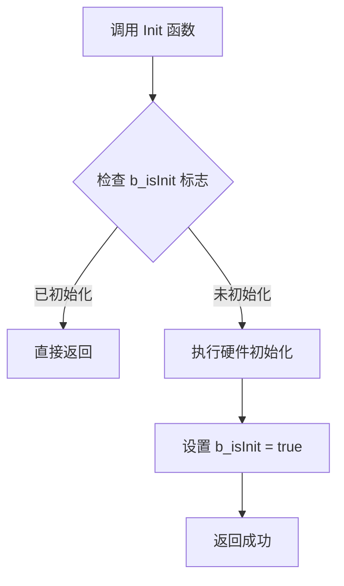
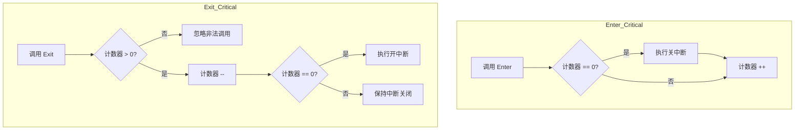
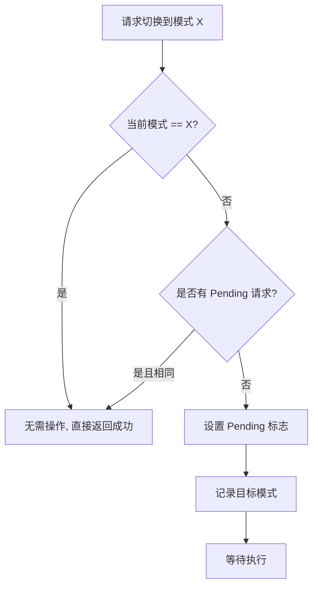

> [!abstract] 幂等保护确保同一操作执行一次和多次产生相同结果，防止嵌入式系统中重复初始化、重复申请内存、重复进入临界区等副作用。核心模式包括标志位保护、计数器保护和状态比对。

# 幂等保护

**幂等性**：同一个操作执行一次和执行多次，对系统状态产生的影响是相同的。

在嵌入式系统中，幂等保护的核心目的是：**防止重复操作带来的副作用**——比如重复初始化、重复申请内存、重复发送命令、重复进入临界区。

---

## 一、为什么需要幂等保护？

| 场景 | 非幂等的风险 |
| --- | --- |
| 外设初始化 | 重复配置寄存器导致时序错乱、时钟树异常 |
| 内存申请 | 重复 `malloc` 导致内存泄漏 |
| 中断使能/禁用 | 嵌套调用导致中断状态不一致 |
| 状态机切换 | 重复触发进入/退出动作 |
| 通信协议 | 重复发送命令导致对端状态异常 |
| `RTOS` 资源 | 重复获取信号量导致死锁 |

---

## 二、核心设计模式

### 模式一：标志位保护

**适用场景**：初始化、去初始化、一次性动作。



**代码实现**：

```c
typedef struct {
    bool b_isInitialized;
    /* ... 其他状态 ... */
} UartDriver_t;

static UartDriver_t s_uart1 = { .b_isInitialized = false };

void UART1_Init(void)
{
    /* 幂等保护：防止重复初始化 */
    if (s_uart1.b_isInitialized)
    {
        return;  /* 已初始化，直接返回 */
    }
    
    /* 真正的初始化代码 */
    __HAL_RCC_USART1_CLK_ENABLE();
    /* ... 配置寄存器 ... */
    
    s_uart1.b_isInitialized = true;
}
```

---

### 模式二：计数器保护

**适用场景**：临界区嵌套、资源引用计数。



**代码实现**：

```c
static volatile uint8_t s_criticalNesting = 0;

void Enter_Critical(void)
{
    if (s_criticalNesting == 0)
    {
        __disable_irq();  /* 只在第一次真正关中断 */
    }
    s_criticalNesting++;
}

void Exit_Critical(void)
{
    if (s_criticalNesting > 0)
    {
        s_criticalNesting--;
        if (s_criticalNesting == 0)
        {
            __enable_irq();  /* 只在最后一次真正开中断 */
        }
    }
}
```

---

### 模式三：状态比对

**适用场景**：模式切换、状态机跳转。



**代码实现**：

```c
typedef struct {
    e_ModeType pendingMode;      /* 待执行模式 */
    e_ModeType activeMode;       /* 当前生效模式 */
    bool       b_requestPending; /* 是否有待处理请求 */
} ModeManager_t;

bool Mode_Request(e_ModeType newMode)
{
    /* Case 1: 已在目标模式 */
    if (!s_modeMgr.b_requestPending && 
        s_modeMgr.activeMode == newMode)
    {
        return true;  /* 已在此模式，OK no-op */
    }
    
    /* Case 2: 已有相同请求在等待 */
    if (s_modeMgr.b_requestPending && 
        s_modeMgr.pendingMode == newMode)
    {
        return true;  /* 重复请求，直接OK */
    }
    
    /* 真正的模式切换请求 */
    s_modeMgr.pendingMode      = newMode;
    s_modeMgr.b_requestPending = true;
    
    return true;
}
```

---

## 三、工程实践建议

### 1. 设计策略选择

| 设计策略 | 适用场景 | 风险 |
| --- | --- | --- |
| **幂等保护** | 初始化、状态切换、资源申请 | 可能隐藏逻辑错误 |
| **断言报错** | 调试阶段、关键路径 | 发布版本需移除 |
| **返回错误码** | 需要调用者感知的场景 | 增加调用复杂度 |

**推荐做法**：调试阶段用断言，发布版本用幂等保护 + 日志记录。

```c
void Peripheral_Init(void)
{
    if (s_isInitialized)
    {
        DEBUG_LOG("WARN: Duplicate init detected");  /* 调试时可见 */
        return;  /* 发布时安全 */
    }
    /* ... */
}
```

### 2. 幂等保护的代价

- **状态变量开销**：每个需要保护的模块需要一个 `bool` 或计数器
- **逻辑复杂度**：增加代码分支，需要覆盖测试
- **隐藏 `Bug`**：如果重复调用本身就是逻辑错误，幂等保护会掩盖问题

### 3. 什么时候不需要幂等？

```c
/* 不需要幂等：每次调用都有意义 */
void LED_Toggle(void) { /* ... */ }

/* 不需要幂等：数据操作 */
void UART_SendByte(uint8_t data) { /* ... */ }
```

---

## 四、总结

| 核心原则                    | 说明                  |
| ----------------------- | ------------------- |
| **Last-Command-Wins**   | 重复请求时，最后一次生效        |
| **No-Op on Same State** | 已在目标状态时，跳过执行        |
| **Reference Counting**  | 嵌套调用时用计数器保护         |
| **Guard Flag**          | 用 `bool` 标志位保护一次性动作 |