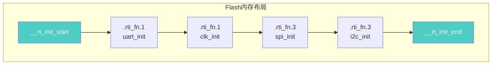

> [!abstract] 利用编译器段属性（section）和链接脚本（.ld），实现模块自注册初始化机制。模块通过 `INIT_xxx_EXPORT(fn)` 宏将初始化函数指针放入特定段，启动代码遍历段自动调用，main 函数无需手动添加初始化调用。

# 自动初始化机制

## 一、核心价值

> **解耦**：模块自己注册，`main` 函数无需手动调用初始化。

```c
// ========== 传统方式 ==========
int main(void) {
    uart_init();    // 手动添加，易遗漏
    spi_init();
    i2c_init();
    // ...
}

// ========== 自动初始化 ==========
INIT_BOARD_EXPORT(uart_init);  // 模块内注册
INIT_DEVICE_EXPORT(spi_init);

int main(void) {
    // 启动时已自动完成所有初始化
}
```

---

## 二、三阶段原理


---

## 三、关键实现

### 1. 编译期：宏定义

```c
/* 核心宏 */
#define INIT_EXPORT(fn, level)                                          \
    __attribute__((used, section(".rti_fn." level)))                    \
    static const init_fn_t __rt_init_##fn = fn

/* 使用示例 */
INIT_BOARD_EXPORT(uart_init);

/* 展开结果 */
__attribute__((used, section(".rti_fn.1")))
static const init_fn_t __rt_init_uart_init = uart_init;
```

| 关键字 | 作用 |
| --- | --- |
| `used` | 防止编译器优化掉未引用的变量 |
| `section(".rti_fn.1")` | 强制放入指定段，按优先级排序 |
| `static const` | 放入 Flash，不占 RAM |

### 2. 链接期：段收集

```ld
/* 链接脚本 */
SECTIONS {
    .rti_fn : {
        . = ALIGN(4);
        __rt_init_start = .;
        KEEP(*(SORT(.rti_fn*)))  /* 收集并排序 */
        __rt_init_end = .;
        . = ALIGN(4);
    } > FLASH
}
```

### 3. 运行期：遍历调用

```c
extern const init_fn_t __rt_init_start;
extern const init_fn_t __rt_init_end;

void rt_auto_init(void) {
    const init_fn_t *fn;
    for (fn = &__rt_init_start; fn < &__rt_init_end; fn++) {
        (*fn)();
    }
}
```

---

## 四、内存布局



---

## 五、优先级机制

| 宏 | 级别 | 用途 |
| --- | --- | --- |
| `INIT_BOARD_EXPORT` | 1 | 板级早期初始化（时钟、GPIO） |
| `INIT_PREV_EXPORT` | 2 | 纯软件初始化 |
| `INIT_DEVICE_EXPORT` | 3 | 设备驱动注册 |
| `INIT_COMPONENT_EXPORT` | 4 | 组件初始化 |
| `INIT_APP_EXPORT` | 6 | 应用层初始化 |

---

## 六、工程避坑

| 陷阱 | 后果 | 解决方案 |
| --- | --- | --- |
| 忘记 `KEEP()` | 段被优化掉 | 链接脚本必须加 `KEEP` |
| 初始化函数阻塞 | 启动卡死 | 初始化函数要快，不能阻塞 |
| 循环依赖 | 初始化失败 | 合理设计依赖顺序 |
| 优先级错误 | 依赖未就绪 | 按依赖关系选择正确级别 |

---

## 七、一句话总结

**编译器放指针，链接器排座位，启动代码点名。**