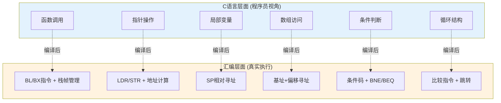
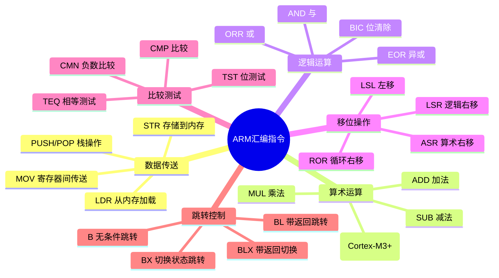
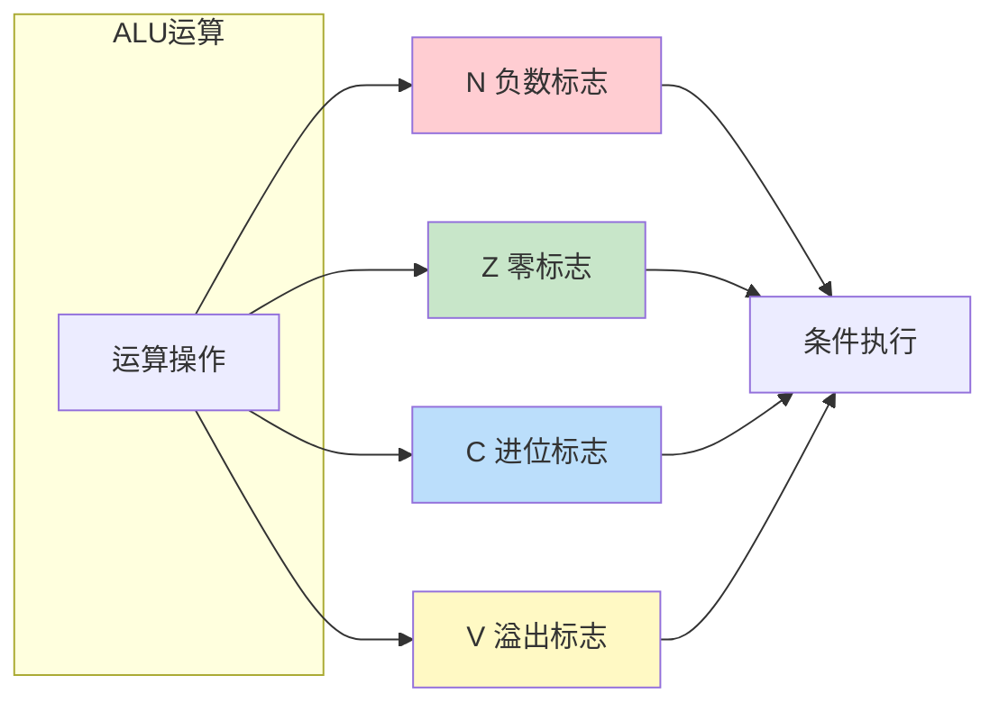
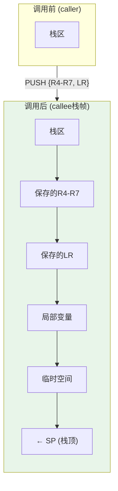
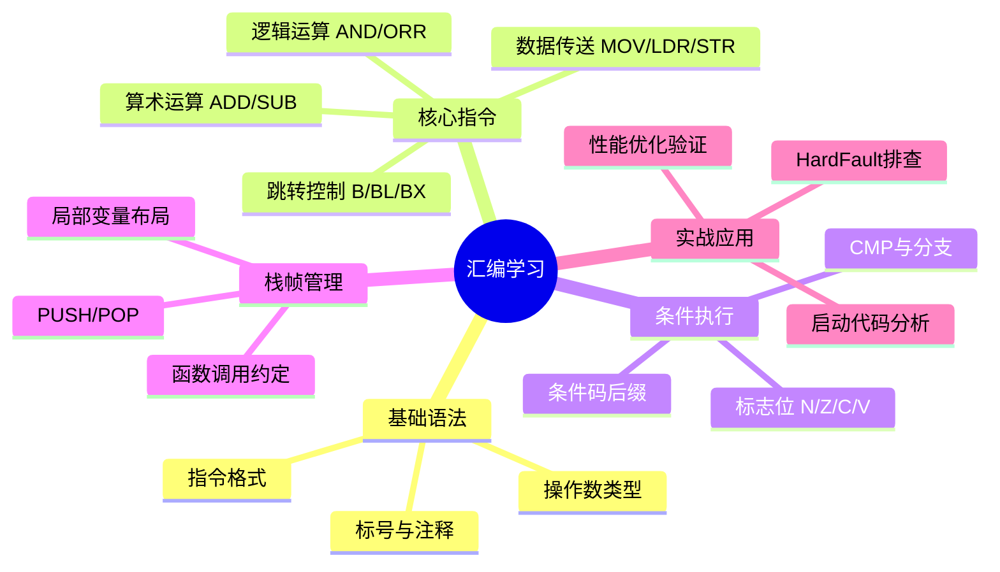

工程师你好，这个学习路径非常正确。**汇编是C语言的"X光机"**——很多C语言的"魔法"（函数调用、指针、数组越界）在汇编层面都一览无余。

让我从嵌入式工程师的视角，帮你构建汇编的核心认知框架。

---

## 一、先回答：为什么要学汇编？



**核心价值**：
1. **调试HardFault**：没有汇编知识，栈回溯就是天书
2. **理解性能瓶颈**：为什么这段C代码慢？看汇编才知道
3. **启动代码修改**：`startup_xxx.s`需要能看懂
4. **编译器优化验证**：`volatile`真的生效了吗？看汇编

---

## 二、汇编的基本语法结构

### 2.1 汇编指令的通用格式

```
[标号:] 操作码 操作数1, 操作数2, ... [; 注释]
```

```asm
loop:           ; 标号（地址标记）
    MOV  R0, #10    ; 操作码 MOV，操作数 R0 和 #10
    ADD  R0, R0, #1 ; R0 = R0 + 1
    B    loop       ; 跳转到loop标号
```

### 2.2 ARM Cortex-M 常见操作数类型

| 操作数类型 | 示例 | 含义 |
|-----------|------|------|
| 立即数 | `#10`, `#0xFF` | 直接给出的常数 |
| 寄存器 | `R0`, `R1`, `SP` | 寄存器中的值 |
| 寄存器间接 | `[R0]` | R0指向的内存地址的值 |
| 寄存器偏移 | `[R0, #4]` | R0+4地址处的值 |
| 寄存器变址 | `[R0, R1]` | R0+R1地址处的值 |

---

## 三、核心指令分类（嵌入式必知必会）



### 3.1 数据传送指令

```asm
MOV  R0, #10         ; R0 = 10 (立即数传送)
MOV  R1, R0          ; R1 = R0 (寄存器传送)

LDR  R0, [R1]        ; R0 = *R1 (从内存加载)
LDR  R0, [R1, #4]    ; R0 = *(R1+4) (带偏移加载)
LDR  R0, =0x12345678 ; 伪指令，加载32位立即数

STR  R0, [R1]        ; *R1 = R0 (存储到内存)
STR  R0, [R1, #4]!   ; R1=R1+4, *R1=R0 (预索引)
STR  R0, [R1], #4    ; *R1=R0, R1=R1+4 (后索引)

PUSH {R4-R7, LR}     ; 压栈，SP自动减
POP  {R4-R7, PC}     ; 出栈，SP自动增
```

### 3.2 算术与逻辑指令

```asm
ADD  R0, R1, R2      ; R0 = R1 + R2
ADD  R0, R0, #1      ; R0 = R0 + 1
SUB  R0, R1, R2      ; R0 = R1 - R2

AND  R0, R1, R2      ; R0 = R1 & R2
ORR  R0, R1, R2      ; R0 = R1 | R2
EOR  R0, R1, R2      ; R0 = R1 ^ R2
BIC  R0, R1, R2      ; R0 = R1 & (~R2) 位清除

LSL  R0, R1, #2      ; R0 = R1 << 2 (左移)
LSR  R0, R1, #2      ; R0 = R1 >> 2 (逻辑右移)
```

### 3.3 比较与跳转指令

```asm
CMP  R0, #10         ; 比较 R0 和 10，设置标志位
BEQ  equal           ; 如果相等(Z=1)，跳转到equal
BNE  not_equal       ; 如果不等(Z=0)，跳转到not_equal
BLT  less_than       ; 如果小于(N!=V)，跳转
BGT  greater         ; 如果大于(Z=0且N=V)，跳转

B    loop            ; 无条件跳转
BL   function        ; 带链接跳转 (LR = 返回地址)
BX   LR              ; 跳转到LR (函数返回)
```

---

## 四、条件码（标志位）：汇编的"灵魂"



| 标志 | 名称 | 含义 | 典型用途 |
|------|------|------|----------|
| **N** | Negative | 结果最高位为1 | 判断有符号数正负 |
| **Z** | Zero | 结果为0 | 判断相等/循环结束 |
| **C** | Carry | 无符号溢出/借位 | 大数运算、移位 |
| **V** | Overflow | 有符号溢出 | 有符号数运算判断 |

### 常见条件码后缀

| 后缀 | 条件 | 含义 |
|------|------|------|
| EQ | Z=1 | Equal (相等) |
| NE | Z=0 | Not Equal (不等) |
| LT | N≠V | Less Than (有符号小于) |
| GT | Z=0且N=V | Greater Than (有符号大于) |
| LE | Z=1或N≠V | Less or Equal |
| GE | N=V | Greater or Equal |
| HI | C=1且Z=0 | Higher (无符号大于) |
| LO | C=0 | Lower (无符号小于) |

---

## 五、C语言与汇编的对应关系

### 5.1 函数调用

**C代码**：
```c
int add(int a, int b) {
    return a + b;
}

int main(void) {
    int result = add(1, 2);
    return 0;
}
```

**对应汇编**：
```asm
; main函数
main:
    PUSH {LR}           ; 保存返回地址
    MOV  R0, #1         ; 参数1 → R0
    MOV  R1, #2         ; 参数2 → R1
    BL   add            ; 调用add，LR = 返回地址
    ; R0现在包含返回值
    MOV  R0, #0         ; return 0
    POP  {PC}           ; 返回

; add函数
add:
    ADD  R0, R0, R1     ; R0 = R0 + R1
    BX   LR             ; 返回
```

### 5.2 循环结构

**C代码**：
```c
for (int i = 0; i < 10; i++) {
    sum += i;
}
```

**对应汇编**：
```asm
    MOV  R0, #0         ; sum = 0
    MOV  R1, #0         ; i = 0
loop:
    CMP  R1, #10        ; i < 10 ?
    BGE  end_loop       ; 如果 i >= 10，退出
    ADD  R0, R0, R1     ; sum += i
    ADD  R1, R1, #1     ; i++
    B    loop           ; 继续循环
end_loop:
```

### 5.3 条件判断

**C代码**：
```c
if (x > 0) {
    y = 1;
} else {
    y = -1;
}
```

**对应汇编**：
```asm
    CMP  R0, #0         ; x > 0 ?
    BLE  else_branch    ; 如果 x <= 0，跳转
    MOV  R1, #1         ; y = 1
    B    end_if
else_branch:
    MOV  R1, #-1        ; y = -1
end_if:
```

### 5.4 指针与数组

**C代码**：
```c
int arr[5] = {1, 2, 3, 4, 5};
int *p = arr;
int x = *p;      // x = arr[0]
int y = p[2];    // y = arr[2]
```

**对应汇编**：
```asm
    LDR  R0, =arr       ; R0 = arr的地址
    LDR  R1, [R0]       ; R1 = *R0 = arr[0]
    LDR  R2, [R0, #8]   ; R2 = *(R0+8) = arr[2]
                        ; 偏移8是因为int是4字节
```

---

## 六、函数调用栈帧详解



**完整栈帧示例**：
```asm
function:
    PUSH {R4-R7, LR}    ; 保存寄存器和返回地址
    SUB  SP, SP, #16    ; 分配16字节局部变量空间
    
    ; 函数体...
    STR  R0, [SP, #0]   ; 局部变量访问
    LDR  R1, [SP, #4]
    
    ADD  SP, SP, #16    ; 释放局部变量空间
    POP  {R4-R7, PC}    ; 恢复寄存器并返回
```

---

## 七、嵌入式常见汇编场景

### 7.1 启动代码

```asm
; 复位处理程序
Reset_Handler:
    LDR  SP, =_estack       ; 初始化栈指针
    
    ; 复制.data段从Flash到SRAM
    LDR  R0, =_sdata
    LDR  R1, =_edata
    LDR  R2, =_sidata
copy_loop:
    CMP  R0, R1
    BGE  copy_done
    LDR  R3, [R2], #4
    STR  R3, [R0], #4
    B    copy_loop
copy_done:
    
    ; 清零.bss段
    LDR  R0, =_sbss
    LDR  R1, =_ebss
    MOV  R2, #0
zero_loop:
    CMP  R0, R1
    BGE  zero_done
    STR  R2, [R0], #4
    B    zero_loop
zero_done:
    
    BL   SystemInit
    BL   main
    B    .
```

### 7.2 临界区保护

```asm
; 进入临界区
CPSID I              ; 关闭中断

; 退出临界区
CPSIE I              ; 开启中断
```

### 7.3 空操作延时

```asm
NOP                  ; 空操作，消耗1个周期
```

---

## 八、调试技巧：如何查看C代码对应的汇编

### 8.1 使用objdump反汇编

```bash
# 生成汇编列表
arm-none-eabi-objdump -d -S firmware.elf > firmware.asm

# -d: 反汇编
# -S: 交错显示C源码和汇编
```

### 8.2 使用GDB查看

```gdb
(gdb) disassemble main
(gdb) set disassembly-flavor intel  ; Intel语法
(gdb) x/10i $pc                     ; 查看PC处10条指令
```

### 8.3 编译时生成汇编

```bash
# 生成汇编文件
arm-none-eabi-gcc -S -fverbose-asm main.c -o main.s
```

---

## 九、总结：汇编学习路线图



---

## 十、大师的工程建议

1. **不要死记硬背**：汇编指令很多，记住常用的20%即可覆盖80%场景
2. **从C到汇编**：写一段简单C代码，用`-S`编译看汇编，理解对应关系
3. **重点掌握**：
   - 函数调用过程（参数传递、栈帧、返回）
   - 指针的本质（地址计算、间接访问）
   - 条件与循环的实现
4. **推荐工具**：
   - [Compiler Explorer](https://godbolt.org/)：在线查看C→汇编
   - Keil/IAR的仿真器：单步执行看寄存器变化

---

需要我进一步展开哪个部分？比如：
- AAPCS函数调用约定详解？
- 中断现场保护的汇编实现？
- 内联汇编的使用方法？