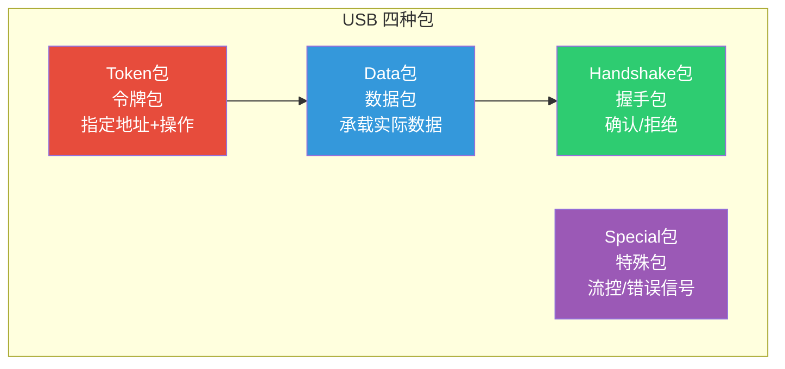
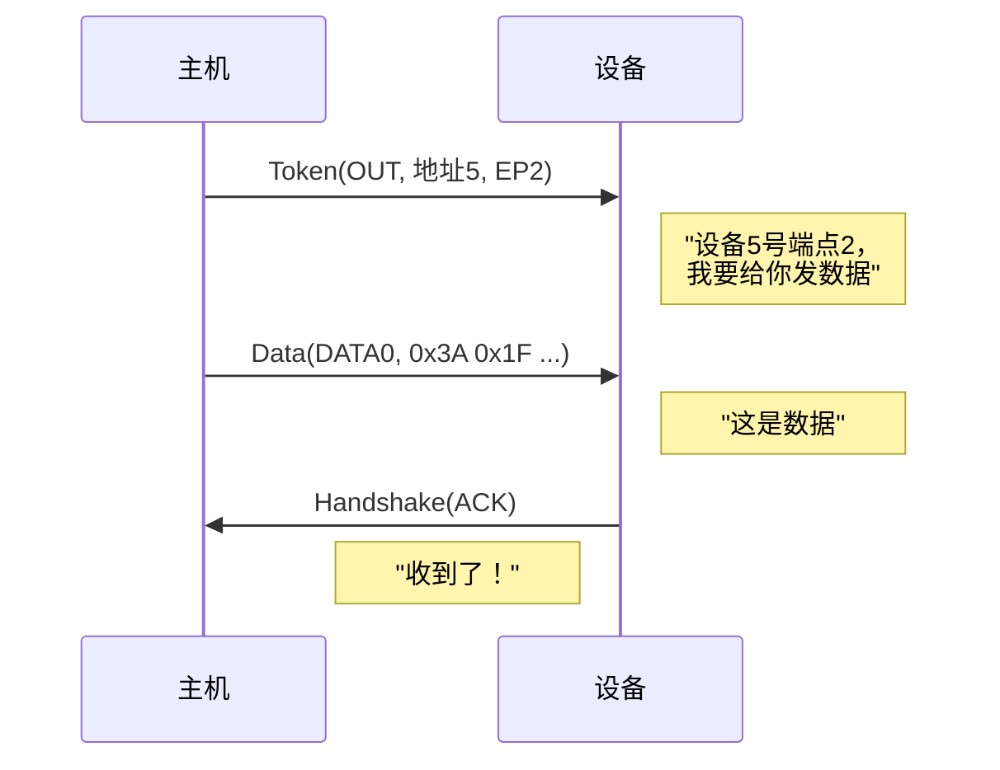
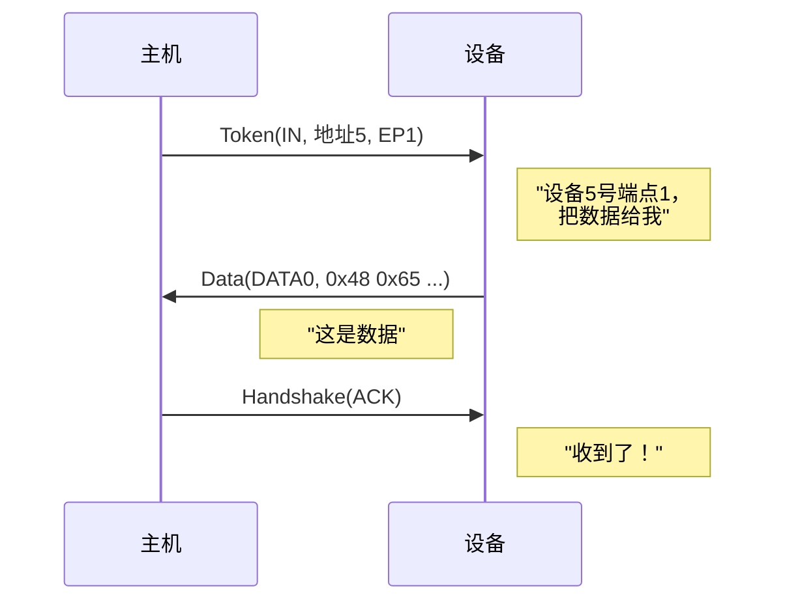
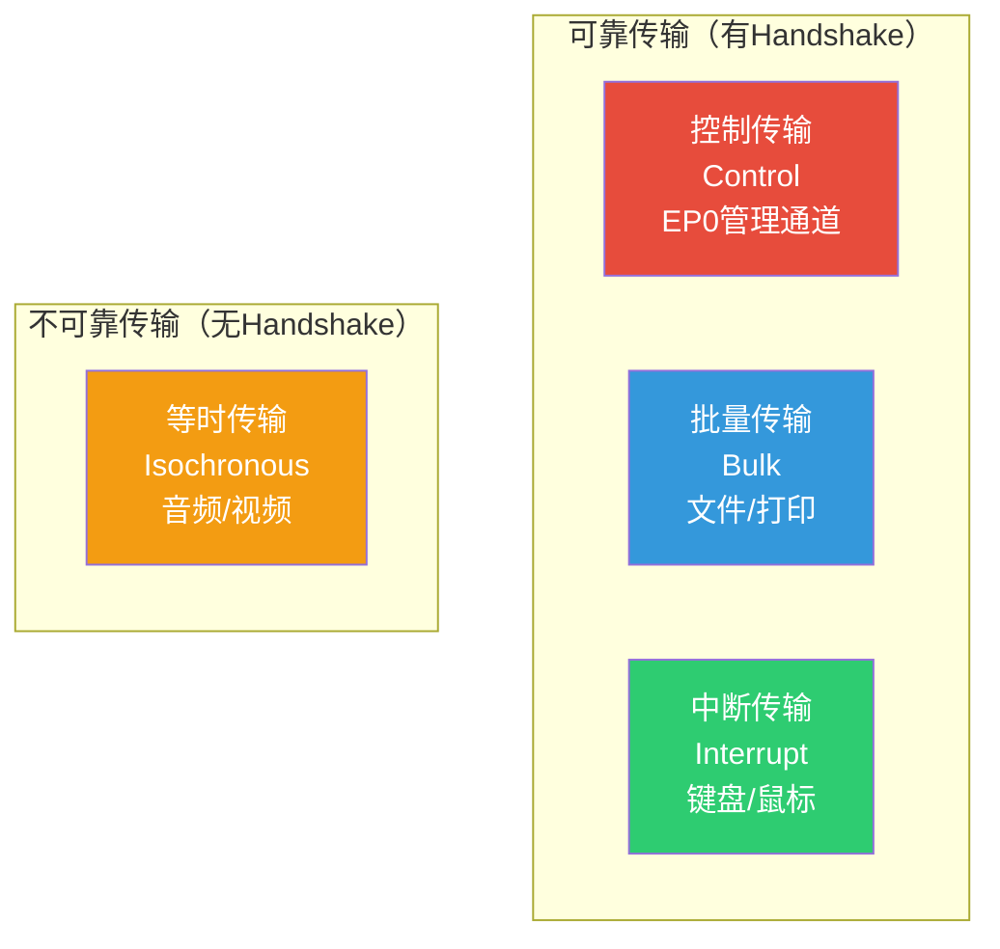
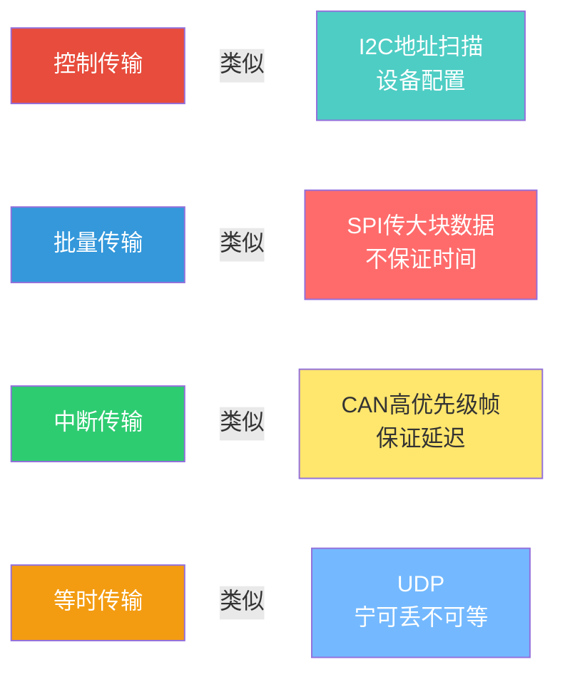
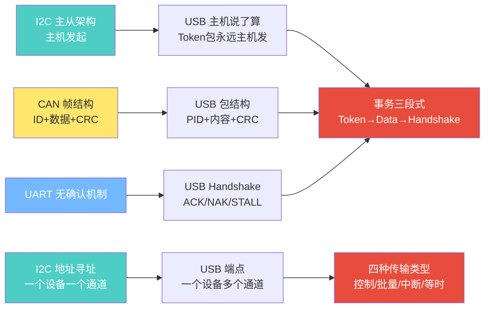

---
tags:
  - 嵌入式
  - 通信协议
  - USB
  - 协议层
aliases:
  - USB协议逻辑
  - USB Protocol Layer
related:
  - "[[硬件层]]"
  - "[[枚举与描述符]]"
  - "[[../传输层/4. CAN的基础理解]]"
  - "[[../传输层/I2C的基础理解]]"
date: 2026-05-29
---

# USB 协议逻辑层

> [!abstract] 核心思想
> 硬件层解决了"0和1怎么可靠传输"，协议逻辑层解决"这些0和1怎么组成有意义的信息"。
> USB的通信模型是：**主机发Token → 某一方发Data → 另一方回Handshake**，三段式事务，永远主机先开口。

---

## 一、包（Packet）：USB最小传输单位

### 包的通用结构

```
┌────────┬──────┬──────────┬───────┬─────┐
│  SYNC  │ PID  │  内容     │  CRC  │ EOP │
│ 同步头  │包标识 │ 载荷数据  │ 校验  │结束  │
└────────┴──────┴──────────┴───────┴─────┘
```

| 字段 | 说明 |
|------|------|
| **SYNC** | 同步头，8位（高速为32位），固定 `KJKJKJKK`，接收方借此对齐时钟 |
| **PID** | 包标识（4位+4位取反校验），定义包的类型和功能 |
| **内容** | 具体载荷，不同类型的包内容不同 |
| **CRC** | 校验（Token用5位CRC，Data用16位CRC） |
| **EOP** | 包结束，SE0信号（D+和D-同时拉低2位时间） |

### 四种包类型



| 包类型 | PID示例 | 发送方 | 内容 | 比喻 |
|--------|---------|--------|------|------|
| **Token** | OUT / IN / SETUP | **总是主机** | 地址+端点+操作 | 快递单 |
| **Data** | DATA0 / DATA1 | 主机或设备 | 实际数据载荷 | 包裹 |
| **Handshake** | ACK / NAK / STALL | 主机或设备 | 无（PID即全部信息） | 签收回执 |
| **Special** | PRE / ERR / SPLIT | 主机或Hub | 特殊控制 | 特殊信号 |

> [!important] 核心原则
> **Token包永远由主机发出**。这体现了USB"主机说了算"的根本架构。
> 无论IN还是OUT，第一步都是主机发Token告诉设备"我要做什么"。

---

## 二、事务（Transaction）：三段式对话

### 什么是事务？

一个**事务 = Token包 + Data包 + Handshake包**，是USB通信的基本对话单元。

```
类比寄快递：
  1. Token = 敲门："张三，有你的快递"（指定谁+什么操作）
  2. Data  = 递包裹："这是你的东西"（具体内容）
  3. Handshake = 签收："收到了 / 不在家 / 拒收"
```

### OUT事务（主机 → 设备）



### IN事务（设备 → 主机）



### 对比记忆

```
OUT:  主机发Token → 主机发Data → 设备回Handshake
IN:   主机发Token → 设备发Data → 主机回Handshake

永远不变：主机先发Token
Data由"被要求方"发出
Handshake由"接收方"回
```

### Handshake详解

| 握手信号 | 含义 | 主机收到后的行为 |
|---------|------|----------------|
| **ACK** | 数据正确收到 | 事务成功，继续下一个 |
| **NAK** | 我在忙，没空处理 | **稍后重试**（正常，非错误） |
| **STALL** | 端点出错/不支持该操作 | 需要主机软件介入恢复 |
| **NYET** | （高速专用）收到了，还没准备好接下一个 | 等一下再发下一个 |

> [!tip] NAK是USB中**最常见**的握手
> 设备可能正在忙（如U盘在写Flash），来不及处理新请求。主机收到NAK后重试，这是正常流程。
> 对比CAN：CAN没有NAK概念，要么成功要么错误帧。

---

## 三、端点（Endpoint）：设备内部的数据通道

### 为什么需要端点？

```
一个USB摄像头（地址5）同时需要传：
├── 控制命令（设置分辨率、亮度）  → 性质：可靠、偶尔
├── 视频画面（大数据流）          → 性质：持续、可丢帧
├── 麦克风音频（实时数据）        → 性质：小数据、要实时
└── 状态反馈（温度等）            → 性质：偶尔、小数据

地址只找到设备，端点区分设备内部不同功能通道
```

### 类比理解

```
设备地址 = 写字楼门牌号（找到哪栋楼）
端点号   = 楼里分机号（找到哪个部门）

I2C：地址找到设备 → 所有数据混在一起
CAN：消息ID标识内容 → ID本身就是分类
USB：地址找设备 → 端点分功能 → 井井有条
```

### 端点的属性

| 属性 | 说明 |
|------|------|
| **端点号** | 0~15（0x00~0x0F），方向由Token的PID（IN/OUT）决定 |
| **方向** | IN端点（设备→主机）或 OUT端点（主机→设备） |
| **传输类型** | 控制/批量/中断/等时 |
| **最大包大小** | 每次事务能承载的最大字节数 |
| **轮询间隔** | 中断/等时传输中，主机多久访问一次 |

### EP0：特殊的管理通道

> **每个USB设备必须有EP0**，它专用于控制传输，是设备初始化、枚举、配置的"管理通道"。

```
设备插入后的第一步通信，永远是主机通过EP0和设备对话
→ 就像新员工入职，先去HR办公室（EP0）办手续
```

---

## 四、传输类型（Transfer Type）

### 全景对比



### 详细对比

| 维度 | 控制传输 | 批量传输 | 中断传输 | 等时传输 |
|------|---------|---------|---------|---------|
| **可靠性** | CRC + 重传 | CRC + 重传 | CRC + 重传 | CRC，**不重传** |
| **带宽保证** | 保留10%总线带宽 | **无保证**（有剩余就用） | 有保证 | 有保证 |
| **延迟保证** | 无 | 无 | **有**（≤轮询间隔） | **有**（固定间隔） |
| **Handshake** | ACK/NAK/STALL | ACK/NAK/STALL/NYET | ACK/NAK/STALL | **无** |
| **DATA翻转** | DATA0↔DATA1交替 | DATA0↔DATA1交替 | DATA0↔DATA1交替 | **DATA0固定** |
| **最大包大小** | 8B(LS) / 64B(FS/HS) | 64B(FS) / 512B(HS) | ≤64B(FS) / ≤1024B(HS) | ≤1023B(FS) / ≤1024B(HS) |
| **端点限制** | 仅EP0 | 任意非0端点 | 任意非0端点 | 任意非0端点 |
| **比喻** | 行政窗口（必须办） | 包裹快递（不急但得送到） | 定时巡检（不能太晚） | 直播频道（宁可丢不可等） |

### 与已知协议类比



---

## 五、四种传输类型详解

### 控制传输（Control Transfer）

```
用途：设备初始化、枚举、配置（EP0专用）
特点：必须成功，总线保留10%带宽给它

结构：2~3个阶段
  Stage 1: SETUP阶段（主机发SETUP Token + Data）
  Stage 2: DATA阶段（可选，0或多轮IN/OUT事务）
  Stage 3: STATUS阶段（方向与DATA阶段相反，0长度包确认）
```

### 批量传输（Bulk Transfer）

```
用途：U盘、打印机、扫描仪
特点：利用剩余带宽，没有保证但很可靠

行为：
  总线空闲时 → 传得飞快
  总线繁忙时 → 等其他传输用完才能传
  像快递：不保证几点到，但一定送到
```

### 中断传输（Interrupt Transfer）

```
用途：键盘、鼠标、游戏手柄
特点：保证最大延迟，主机定期轮询

"中断"的名字容易误导：
  实际实现 = 主机定期Polling（如每1ms问一次键盘）
  不是真中断！设备无法主动通知主机（D+/D-没有中断线）
  
从主机软件角度：效果 ≈ 被中断通知，所以叫"中断传输"
```

| 对比 | 硬件中断（GPIO） | USB中断传输 |
|------|----------------|------------|
| 谁主动 | 设备主动拉引脚 | **主机主动轮询** |
| 响应时间 | 即时 | **有上限（轮询间隔）** |
| 本质 | 真中断 | **轮询模拟"伪中断"** |

### 等时传输（Isochronous Transfer）

```
用途：音频流、视频流、实时数据
特点：保证带宽和时间，但不重传

哲学：宁可丢，不可等
  视频丢一帧 → 画面闪一下，用户几乎注意不到
  视频等重传 → 画面卡住，延迟越来越大，体验极差

事务结构：只有 Token + Data，没有 Handshake
  → 发了就算，不管你收没收到
```

---

## 六、DATA翻转机制

### 为什么需要DATA0/DATA1交替？

```
场景：主机发数据给设备
  事务1: 主机发DATA0 → 设备回ACK
  事务2: 主机发DATA1 → 设备回ACK

如果ACK丢了怎么办？
  事务1: 主机发DATA0 → 设备收到并回ACK → ACK在总线上丢了！
  主机以为设备没收到 → 重发DATA0
  设备看到又是DATA0 → "我已经收过DATA0了，这是重复的！"
  设备直接丢弃 → 主机和设备状态一致，不会重复处理

这就是DATA翻转的作用：检测重复包
```

| 包序号 | PID | 说明 |
|--------|-----|------|
| 事务1 | DATA0 | 第一个包 |
| 事务2 | DATA1 | 第二个包（翻转） |
| 事务3 | DATA0 | 第三个包（再翻转） |
| 重试 | DATA0 | 和上次一样 → 接收方知道是重传 |

> [!note] 等时传输不用DATA翻转
> 因为等时传输不重传，所以不需要检测重复包，固定用DATA0。

---

## 七、总结：协议逻辑层全貌

```
┌─────────────────────────────────────────────────────┐
│                  USB协议逻辑层                        │
│                                                     │
│  包(Packet)                                         │
│    SYNC + PID + 内容 + CRC + EOP                    │
│    四种：Token / Data / Handshake / Special          │
│                                                     │
│  事务(Transaction) = Token + Data + Handshake        │
│    OUT: 主机Token → 主机Data → 设备ACK               │
│    IN:  主机Token → 设备Data → 主机ACK               │
│                                                     │
│  传输(Transfer) = 多个事务组成                        │
│    四种：控制 / 批量 / 中断 / 等时                    │
│    每种对应不同的端点配置                              │
│                                                     │
│  端点(Endpoint)                                      │
│    设备内部数据通道，不同端点不同属性                   │
│    EP0 = 控制端点（管理通道）                         │
│                                                     │
│  核心：主机发起一切 → Token先行 → 三段式事务           │
└─────────────────────────────────────────────────────┘
```

---

## 知识脉络



**从已知到未知的关联：**
- **I2C 主从** → USB也是主机发起一切，但更严格（设备完全不能主动）
- **CAN 帧结构** → USB包结构类似（标识+数据+校验），但多了Handshake确认
- **I2C 地址** → USB地址+端点，更细粒度的通道管理
- **CAN 高优先级帧** → 中断传输保证延迟，等时传输保证带宽

---

## 相关链接

- [[硬件层]] - D+/D-上的电平如何变成0和1
- [[枚举与描述符]] - 主机如何通过控制传输（EP0）了解设备
- [[设备类协议与开源软件栈]] - 不同设备类如何选择传输类型
- "[[../传输层/4. CAN的基础理解]]" - CAN帧结构对比
- "[[../传输层/I2C的基础理解]]" - I2C主从架构对比
