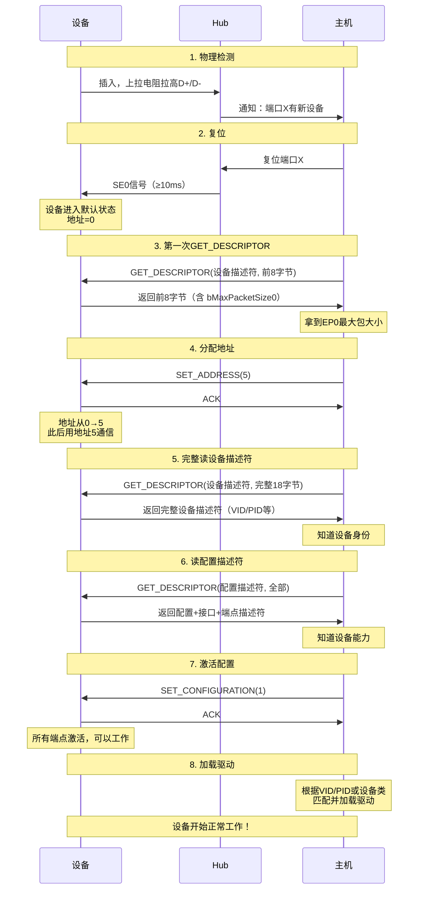
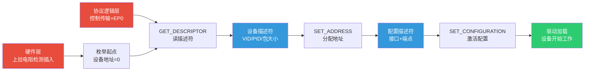

---
tags:
  - 嵌入式
  - 通信协议
  - USB
  - 枚举
  - 描述符
aliases:
  - USB Enumeration
  - USB Descriptor
related:
  - "[[硬件层]]"
  - "[[协议逻辑层]]"
  - "[[设备类协议与开源软件栈]]"
  - "[[../传输层/I2C的基础理解]]"
date: 2026-05-29
---

# USB 枚举与描述符

> [!abstract] 核心思想
> 设备插入后，主机对它"一无所知"。枚举就是主机通过EP0控制传输，**逐层读取描述符、分配地址、激活配置**，最终完全了解设备并加载驱动。
> 描述符是设备自带的"简历"，层级清晰：设备 → 配置 → 接口 → 端点。

---

## 一、描述符层级

### 层级结构

```
设备描述符（Device Descriptor）
  "我是谁、哪个厂出的、USB版本"
  │
  └── 配置描述符（Configuration Descriptor）× 1~N个
        "工作模式、需要多少电、有几个接口"
        │
        ├── 接口描述符（Interface Descriptor）× 1~N个
        │     "功能模块、用什么设备类"
        │     │
        │     ├── 端点描述符（Endpoint Descriptor）× 0~N个
        │     │     "用哪个端点、传输类型、最大包大小、方向"
        │     │
        │     └── 类描述符（Class Descriptor，可选）
        │           "设备类特有的额外信息"
        │
        └── 接口描述符（另一个功能）...
```

### 生活类比

```
设备描述符 = 身份证（姓名、籍贯、出生日期）
配置描述符 = 岗位选择（一个公司多个部门，你选一个）
接口描述符 = 部门内的岗位（一个部门多个岗位）
端点描述符 = 每个岗位的具体职责（用什么工具、怎么汇报）
```

### 层级关系总结

| 层级 | 数量关系 | 说明 |
|------|---------|------|
| 设备描述符 | **1个**（必须） | 整个设备只有一张"身份证" |
| 配置描述符 | 1~N个 | 多种工作模式可选 |
| 接口描述符 | 每个配置下1~N个 | 每个功能模块一个 |
| 端点描述符 | 每个接口下0~N个 | 每个数据通道一个（EP0不需要描述符） |

> [!important] 核心约束
> - **一次只能激活一个配置**（SET_CONFIGURATION选定一个）
> - 一个配置内的**所有接口可以同时工作**
> - EP0不需要端点描述符，它是默认存在的管理通道

---

## 二、设备描述符（Device Descriptor）

### 结构（18字节）

| 偏移 | 字段 | 大小 | 说明 |
|------|------|------|------|
| 0 | bLength | 1 | 描述符长度（18） |
| 1 | bDescriptorType | 1 | 描述符类型（0x01） |
| 2 | bcdUSB | 2 | USB版本（0x0200 = USB 2.0） |
| 4 | bDeviceClass | 1 | 设备类（0=在接口描述符指定） |
| 5 | bDeviceSubClass | 1 | 子类 |
| 6 | bDeviceProtocol | 1 | 协议 |
| 7 | **bMaxPacketSize0** | 1 | **EP0最大包大小**（8/16/32/64） |
| 8 | **idVendor (VID)** | 2 | **厂商标识**（USB-IF分配） |
| 10 | **idProduct (PID)** | 2 | **产品标识**（厂商自定） |
| 12 | bcdDevice | 2 | 设备版本号 |
| 14 | iManufacturer | 1 | 厂商名字符串索引 |
| 15 | iProduct | 1 | 产品名字符串索引 |
| 16 | iSerialNumber | 1 | 序列号字符串索引 |
| 17 | bNumConfigurations | 1 | 配置数量 |

### 关键字段解读

**VID + PID = 设备身份证号**

```
主机拿到 VID=0x046D PID=0x0825
→ 查驱动数据库："这是 Logitech HD Webcam C270"
→ 加载对应的 USB视频类（UVC）驱动

类比：
  VID = 身份证前6位（地区码）→ 哪个厂商
  PID = 身份证后几位 → 哪个产品
```

| 字段 | 类比 | 来源 |
|------|------|------|
| VID | 厂商编号 | USB-IF官方分配（付费） |
| PID | 产品编号 | 厂商自己分配 |
| 组合 | 全球唯一标识 | 主机靠此匹配驱动 |

**bMaxPacketSize0 = EP0的通信能力**

```
主机第一次读设备描述符时，还不知道这个值
→ 只能用最小包大小（低速8B，全速64B）读前8字节
→ 从字节7拿到 bMaxPacketSize0
→ 之后用正确的包大小通信
```

---

## 三、配置描述符（Configuration Descriptor）

### 结构（9字节 + 后续）

| 偏移 | 字段 | 大小 | 说明 |
|------|------|------|------|
| 0 | bLength | 1 | 本描述符长度（9） |
| 1 | bDescriptorType | 1 | 类型（0x02） |
| 2 | wTotalLength | 2 | **整个配置的总长度**（含所有接口+端点描述符） |
| 4 | bNumInterfaces | 1 | 接口数量 |
| 5 | bConfigurationValue | 1 | 配置编号（SET_CONFIGURATION用这个值） |
| 6 | iConfiguration | 1 | 配置名字符串索引 |
| 7 | bmAttributes | 1 | 属性（供电方式、远程唤醒） |
| 8 | bMaxPower | 1 | 最大电流（单位2mA，如50=100mA） |

### 一次读取全部描述符

```
主机请求配置描述符时，设备会返回：
  配置描述符（9字节）
  + 所有接口描述符
  + 所有端点描述符
  + 类描述符（如有）

总长度 = wTotalLength 字段告诉主机
主机只需一次 GET_DESCRIPTOR 就能拿到完整配置信息
```

---

## 四、接口描述符（Interface Descriptor）

### 结构（9字节）

| 偏移 | 字段 | 大小 | 说明 |
|------|------|------|------|
| 0 | bLength | 1 | 描述符长度（9） |
| 1 | bDescriptorType | 1 | 类型（0x04） |
| 2 | bInterfaceNumber | 1 | 接口编号 |
| 3 | bAlternateSetting | 1 | 备用设置编号 |
| 4 | bNumEndpoints | 1 | 该接口的端点数量（不含EP0） |
| 5 | **bInterfaceClass** | 1 | **接口类**（HID=0x03, Audio=0x01等） |
| 6 | bInterfaceSubClass | 1 | 子类 |
| 7 | bInterfaceProtocol | 1 | 协议 |
| 8 | iInterface | 1 | 接口名字符串索引 |

### 接口 = 功能模块

```
USB摄像头示例：
  接口0（bInterfaceClass=0x0E, Video类）
    → 视频功能：端点1 IN（等时）+ 端点2 IN（中断）

  接口1（bInterfaceClass=0x01, Audio类）
    → 音频功能：端点3 IN（等时）+ 端点4 OUT（等时）

两个接口同时工作 → 摄像头既能传画面又能录音
```

### 备用设置（Alternate Setting）

```
接口可以有多种"备用设置"，切换时改变端点配置

例：音频接口
  AltSetting 0: 零带宽（不传音频）
  AltSetting 1: 基本音质（端点传小包）
  AltSetting 2: 高品质（端点传大包）

主机通过 SET_INTERFACE 切换
```

---

## 五、端点描述符（Endpoint Descriptor）

### 结构（7字节）

| 偏移 | 字段 | 大小 | 说明 |
|------|------|------|------|
| 0 | bLength | 1 | 描述符长度（7） |
| 1 | bDescriptorType | 1 | 类型（0x05） |
| 2 | **bEndpointAddress** | 1 | **端点地址**（含方向和编号） |
| 3 | **bmAttributes** | 1 | **传输类型**（控制/等时/批量/中断） |
| 4 | **wMaxPacketSize** | 2 | **最大包大小** |
| 6 | bInterval | 1 | 轮询间隔（中断/等时传输） |

### 关键字段

**bEndpointAddress 编码：**

```
Bit 7:   方向  0=OUT, 1=IN
Bit 6-4: 保留（0）
Bit 3-0: 端点编号（1~15）

例：0x81 = 端点1, IN方向
    0x02 = 端点2, OUT方向
```

**bmAttributes 传输类型：**

```
Bit 1-0:  00=控制, 01=等时, 10=批量, 11=中断

与协议逻辑层四种传输类型一一对应！
```

---

## 六、标准请求（Standard Request）

### 主机的"标准问题"

主机通过EP0控制传输，使用标准请求与设备交互：

| 请求 | 值 | 方向 | 说明 | 比喻 |
|------|-----|------|------|------|
| **GET_DESCRIPTOR** | 0x06 | 设备→主机 | 读取描述符 | "出示身份证" |
| **SET_ADDRESS** | 0x05 | 主机→设备 | 分配地址 | "你的工号是005" |
| **SET_CONFIGURATION** | 0x09 | 主机→设备 | 激活配置 | "去3号工位上班" |
| **GET_CONFIGURATION** | 0x08 | 设备→主机 | 查询当前配置 | "你在哪个工位？" |
| **SET_INTERFACE** | 0x0B | 主机→设备 | 切换备用设置 | "换个模式" |
| **GET_INTERFACE** | 0x0A | 设备→主机 | 查询当前设置 | "用的什么模式？" |
| **GET_STATUS** | 0x00 | 设备→主机 | 查询状态 | "你还好吗？" |
| **SET_FEATURE** | 0x03 | 主机→设备 | 启用特性 | "开某个功能" |
| **CLEAR_FEATURE** | 0x01 | 主机→设备 | 禁用特性 | "关某个功能" |

### 控制传输的SETUP数据包结构

```
SETUP阶段发8字节的"请求命令"：

┌───────┬───────┬──────────┬───────┬───────┬───────┐
│bmRequestType│bRequest│wValue │wIndex │wLength │
│  1字节       │ 1字节  │2字节  │2字节  │2字节   │
└───────┴───────┴──────────┴───────┴───────┴───────┘

bmRequestType: 方向+类型+接收方
bRequest:      具体请求（如0x06=GET_DESCRIPTOR）
wValue:        请求参数（如描述符类型）
wIndex:        接口或端点索引
wLength:       数据阶段要传输的字节数
```

---

## 七、完整枚举流程

### 流程图



### 为什么第一次只读8字节？

```
问题：主机不知道EP0的最大包大小
  → 如果EP0最大包=8字节，主机却发64字节的读请求
  → 设备只能回8字节，剩下的填不满 → 协议可能出错

解决：
  步骤3a: 用最小包大小读前8字节 → 拿到 bMaxPacketSize0（字节7）
  步骤3b: 用正确的包大小读完整设备描述符（18字节）

类比：
  去银行办业务，柜员先问"您办什么业务"（最小信息）
  再根据回答准备对应表格（用正确的包大小）
```

### Hub端口隔离

```
                主机
                 │
            Root Hub
           ┌─┴─┬─┴─┐
          端口1 端口2 端口3
           │           │
         设备A       设备B
        （地址0）    （地址0）

问题：两个设备都是地址0，主机怎么区分？

答案：Hub端口隔离
  主机 → Hub → "复位端口3" → 只有设备B收到
  主机 → Hub → "和端口3通信" → Hub只打开端口3
  设备A根本听不到主机的消息！

对比I2C：I2C没有Hub，总线上的设备都能听到所有消息
  如果两个设备地址相同 → 冲突
USB：Hub从物理层面隔离端口 → 彻底避免冲突
```

---

## 八、字符串描述符（String Descriptor）

### 多语言支持

```
描述符中的 iManufacturer、iProduct、iSerialNumber 等字段
值为0 → 没有字符串
值>0 → 字符串索引，用于 GET_DESCRIPTOR(String) 获取

支持多语言：
  字符串描述符0 → 返回支持的语言ID列表（如0x0409=美式英语）
  字符串描述符N → 返回对应语言的Unicode字符串
```

---

## 九、总结：枚举的本质

```
┌───────────────────────────────────────────────────┐
│               枚举 = 主机认识设备的过程              │
│                                                   │
│  物理检测 → 硬件层（上拉电阻）                       │
│  复位     → 设备进入默认状态（地址0）                 │
│  读描述符 → 协议层（控制传输 + GET_DESCRIPTOR）      │
│  分配地址 → 管理层（SET_ADDRESS）                    │
│  激活配置 → 应用层（SET_CONFIGURATION）              │
│  加载驱动 → 系统（VID/PID 或设备类匹配）             │
│                                                   │
│  核心思路：层层递进，每一步都建立在前一步的基础上      │
│  先知道"你能听多大的包" → 再正式对话 → 最后上岗      │
└───────────────────────────────────────────────────┘
```

---

## 知识脉络



**从已知到未知的关联：**
- **I2C 地址扫描** → USB不用扫描，Hub硬件通知+端口隔离，更高效
- **I2C 设备地址固定** → USB地址动态分配（SET_ADDRESS），更灵活
- **CAN 没有自描述** → USB设备自带完整描述符简历，主机即插即用
- **Modbus 设备需手动配置** → USB枚举全自动，主机主动探索设备能力

---

## 相关链接

- [[硬件层]] - 设备插入检测（上拉电阻）是枚举的起点
- [[协议逻辑层]] - 控制传输和EP0是枚举的通信工具
- [[设备类协议与开源软件栈]] - 枚举后主机根据设备类加载对应驱动
- "[[../传输层/I2C的基础理解]]" - I2C地址扫描 vs USB枚举对比
