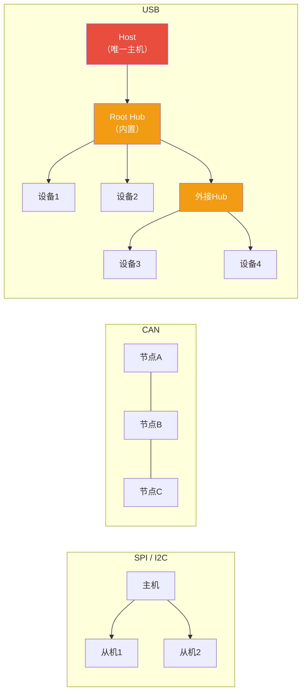
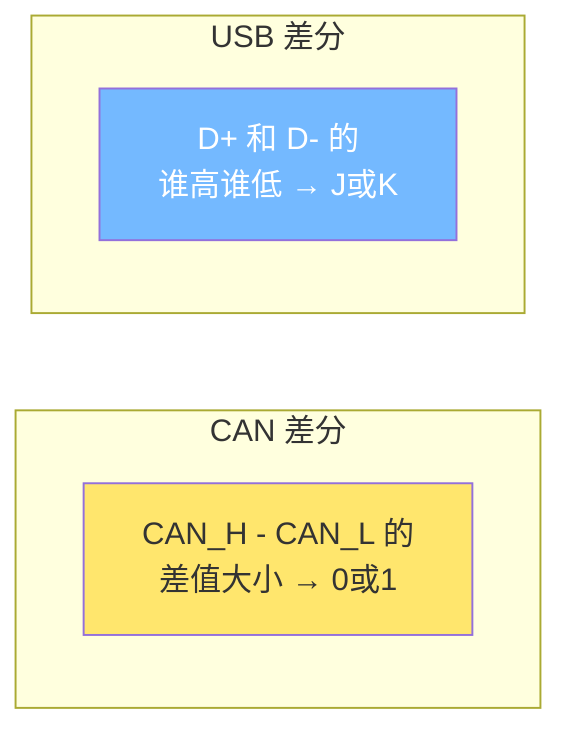
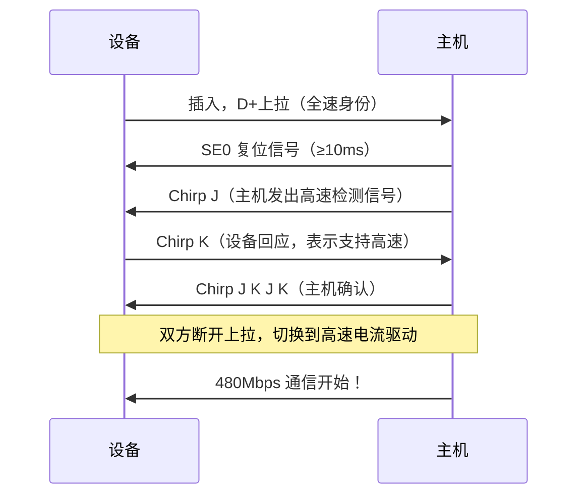
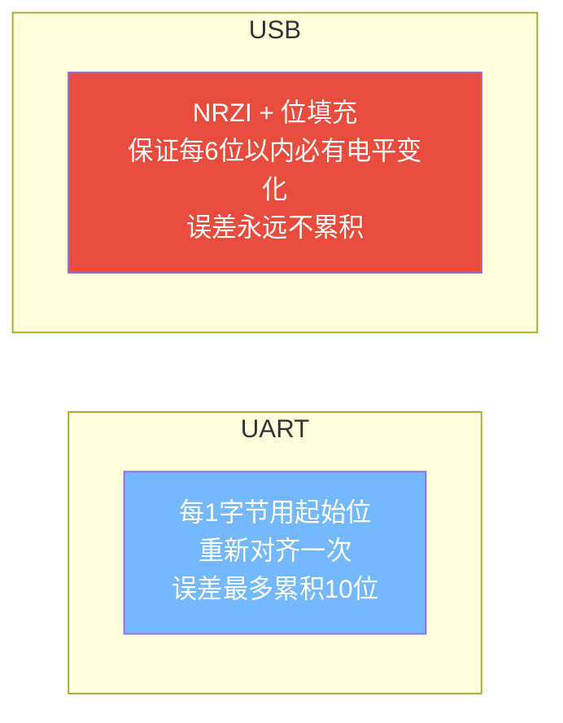
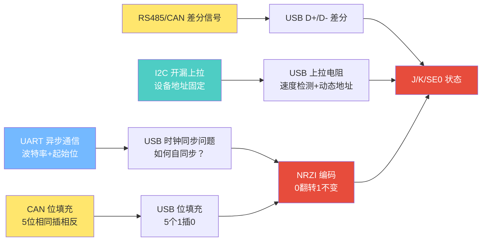

---
tags:
  - 嵌入式
  - 通信协议
  - USB
  - 硬件层
aliases:
  - USB物理层
  - USB Hardware
related:
  - "[[协议逻辑层]]"
  - "[[枚举与描述符]]"
  - "[[../传输层/4. CAN的基础理解]]"
  - "[[../传输层/1. UART的基础理解]]"
date: 2026-05-29
---

# USB 硬件层

[Ben Eater: USB协议](https://www.youtube.com/watch?v=wdgULBpRoXk&list=LL&index=4)


> [!abstract] 核心思想
> USB 用**最少2根数据线**实现了复杂的通信：所有寻址、控制、数据、校验全部打包成数据包传输。
> 物理层只负责"信号可靠传输"，复杂的事全交给协议层。

---

## 一、拓扑结构

### 与已知协议对比



| 对比 | SPI | I2C | CAN | **USB** |
|------|-----|-----|-----|---------|
| 拓扑 | 一主多从 | 一主多从 | 多主总线 | **分层星型（Tiered Star）** |
| 谁发起通信 | 主机 | 主机 | 任何节点 | **唯一主机（Host）** |
| 设备间互传 | 否 | 否 | 可以 | **否，必须经主机中转** |
| 寻址方式 | CS片选线 | 7/10位地址 | 消息ID | **动态分配地址（软件包内）** |
| 扩展方式 | 加CS线 | 加地址 | 加节点 | **Hub级联（最多7层）** |

### 关键特征

- **主机说了算**：所有通信由主机发起，设备只能应答（类似I2C，非CAN）
- **分层星型**：每个设备只和上游Hub/Host通信，Hub负责转发
- **Hub级联**：最多 **7层** Hub嵌套，最多 **127个设备**（地址0~127，0保留给新设备）
- **设备不互通**：键盘不会直接和鼠标通信，一切经主机中转

---

## 二、线缆与连接器

### USB 2.0 线缆：4根线

```
┌─────────────────────────────────────┐
│           USB 线缆截面               │
│                                     │
│   VBUS (+5V)  ── 红色   ← 电源供电   │
│   D+          ── 绿色   ← 差分数据+  │
│   D-          ── 白色   ← 差分数据-  │
│   GND         ── 黑色   ← 地线       │
│                                     │
└─────────────────────────────────────┘
```

| 协议 | 线数 | 组成 |
|------|------|------|
| SPI | 3+N | SCK + MOSI + MISO + N根CS |
| I2C | 2 | SCL + SDA |
| UART | 3 | TX + RX + GND |
| CAN | 2 | CAN_H + CAN_L |
| **USB 2.0** | **4** | **VBUS + D+ + D- + GND** |

> [!important] USB 自带供电
> VBUS 提供 +5V 电源，设备可以直接从USB取电（最大500mA，USB 3.0最大900mA）。
> 这是你学过的SPI、I2C、UART、CAN都**没有**的特性。

---

## 三、差分信号

### D+ / D- 的四种状态

| 状态 | D+ | D- | 含义 |
|------|-----|-----|------|
| **J** | 高 | 低 | 空闲状态（FS）或相反（LS） |
| **K** | 低 | 高 | J的取反 |
| **SE0** | 低 | 低 | **单端零**：包结束（EOP）或复位信号 |
| **SE1** | 高 | 高 | **非法状态**，不应出现 |

### 与 CAN 差分的对比



| 对比 | CAN | USB |
|------|-----|-----|
| 判断方式 | 差值大小（~2V=显性，~0V=隐性） | **谁高谁低**（D+高=J，D-高=K） |
| 特殊状态 | 无（只有显性/隐性） | **SE0（双低=复位/结束）** |
| 仲裁 | 线与（显性赢隐性） | **无仲裁**（主机说了算，不需要） |

---

## 四、设备插入检测

### 上拉电阻机制

```
              设备端                         主机端
                                          ┌──────────┐
 D+ ──┬── [1.5kΩ] ── VBUS        D+ ──┬── [15kΩ] ── GND
      │                                   │
 D- ──┘                                  D- ──┬── [15kΩ] ── GND
（全速设备：上拉在D+）                          │
                                          └──────────┘
```

**原理：**
- 未插入时：主机端D+/D-被15kΩ下拉到低 → **空闲状态**
- 插入后：设备的1.5kΩ上拉 vs 主机的15kΩ下拉 → **分压，某根线变高** → 主机检测到设备

### 上拉位置决定速度

| 上拉位置 | 速度 | D+/D-空闲状态 | 典型设备 |
|---------|------|-------------|---------|
| **D+ 上拉** | 全速 12 Mbps | J（D+高） | U盘、打印机 |
| **D- 上拉** | 低速 1.5 Mbps | J（D-高） | 鼠标、键盘 |
| **D+ 上拉 + 高速握手** | 高速 480 Mbps | 先J，后切换 | 摄像头、硬盘 |

> [!tip] 对比 I2C
> I2C 主机必须**主动扫描地址**才能发现设备。
> USB 主机是**被动感知**的——设备插入瞬间，上拉电阻立刻改变电平，硬件中断通知主机。

---

## 五、高速设备握手（Chirp）

### 为什么不直接高速？

```
类比：打国际长途电话
  1. 先慢慢说："喂？听得到吗？"  → 确认线路通了
  2. 确认没问题后，才开始正常语速

USB同理：
  1. 先以全速（12Mbps）接入  → 设备刚上电，电路还在稳定
  2. 确认信号质量后，再提速到 480Mbps
```

### 握手流程



**三个不直接高速的原因：**

| 问题 | 说明 |
|------|------|
| **信号质量** | 480Mbps对线缆阻抗、信号完整性要求极高，需要先测试 |
| **设备就绪** | 刚上电时内部电路还没稳定，直接高速采样会出错 |
| **兼容性** | 如果插到只支持全速的Hub，握手失败就留在全速，不会出问题 |

---

## 六、编码：NRZI + 位填充

### 为什么需要编码？

```
问题：USB一个包最多 1024字节 = 8192位
如果连续8192个0，电平就是一条直线
接收方时钟稍有偏差，就数错了位数

解决：保证信号线上永远有足够的电平变化
→ 接收方从信号本身恢复时钟（自同步）
```

### 与 UART 对齐方式对比



| 对比 | UART | USB |
|------|------|-----|
| 时钟同步方式 | 约定波特率 + 每字节起始位对齐 | 约定速率 + **信号自同步** |
| 对齐频率 | 每10位（1字节） | **每 ≤6位**（位填充保证） |
| 长数据风险 | 不存在（每字节都对齐） | 不编码则风险极大 |

### NRZI 编码规则

> **0 → 电平翻转，1 → 电平不变**

```
原始数据:   0    0    1    1    0    1    0
            ↓    ↓    ↓    ↓    ↓    ↓    ↓
NRZI:      翻转  翻转  保持  保持  翻转  保持  翻转
（初始低）  高   低   低   低   高   高   低
```

**NRZI解决了连续0的问题（每个0都翻转），但连续1电平不变，问题还在。**

### 位填充：解决连续1

> **连续5个1后，强制插入一个0**

```
原始数据:     1  1  1  1  1  1  1  0
                    ↓
位填充后:     1  1  1  1  1 [0] 1  1  0
                            ↑
                        填充位（强制NRZI翻转）
```

**接收方规则：看到连续5个1后面跟了一个0，丢弃这个0（去填充）。**

### 完整编码流程

```
┌──────────────────────────────────────────────────┐
│                 发送方                             │
│                                                  │
│  原始数据 → 位填充（连续5个1插0） → NRZI编码 → D+/D- 差分信号  │
│                                                  │
├──────────────────────────────────────────────────┤
│                 接收方                             │
│                                                  │
│  D+/D- 差分信号 → NRZI解码 → 去填充（删填充位） → 原始数据      │
│                                                  │
└──────────────────────────────────────────────────┘
```

### 与 CAN 位填充对比

| 对比 | CAN | USB |
|------|-----|-----|
| 编码方式 | 显性/隐性直接映射 | **NRZI**（0翻转，1不变） |
| 填充触发 | 连续 **5个相同位** | 连续 **5个1**（只需处理1） |
| 填充内容 | 插入相反位 | 固定插入 **0** |
| 填充目的 | 时钟同步 | **时钟同步**（完全一样） |
| 填充范围 | 帧的特定位段 | **包的PID之后所有数据** |

> [!note] 为什么USB只填充连续1？
> 因为NRZI编码下，连续0已经自动产生电平翻转了（0→翻转），只有连续1会导致电平不变。
> 所以USB只需要解决"连续1"的问题，不像CAN需要处理两个方向。

---

## 七、速度等级总览

| 速度 | 速率 | USB版本 | 检测方式 | 双工 | 典型应用 |
|------|------|--------|---------|------|---------|
| **低速 LS** | 1.5 Mbps | 1.0 | D- 上拉 | 半双工 | 鼠标、键盘 |
| **全速 FS** | 12 Mbps | 1.1 | D+ 上拉 | 半双工 | U盘、打印机 |
| **高速 HS** | 480 Mbps | 2.0 | D+ 上拉 → Chirp切换 | 半双工 | 摄像头、硬盘 |
| **超速 SS** | 5 Gbps | 3.0 | **独立差分对** | **全双工** | SSD、显示器 |

> [!warning] USB 3.0 是分水岭
> USB 3.0（超速）不再使用 D+/D- 传输数据，而是增加了独立的 TX+/TX- 和 RX+/RX- 差分对，变成全双工。
> 本笔记主要覆盖 USB 2.0（LS/FS/HS），掌握后再扩展 USB 3.0+。

---

## 知识脉络



**从已知到未知的关联：**
- **UART 异步通信** → 理解USB为什么需要自同步编码（NRZI）
- **CAN 位填充** → USB位填充原理几乎一样，只是只处理连续1
- **CAN/RS485 差分信号** → USB D+/D-差分，但判断方式更简单
- **I2C 开漏上拉** → USB上拉电阻用于设备检测，但目的不同（检测+速度识别）

---

## 相关链接

- [[协议逻辑层]] - 数据包如何在这两根线上组织
- [[枚举与描述符]] - 设备插入后主机如何了解它
- [[../传输层/4. CAN的基础理解]] - CAN差分信号、位填充是理解USB的基础
- [[../传输层/1. UART的基础理解]] - 异步通信的时钟同步问题
