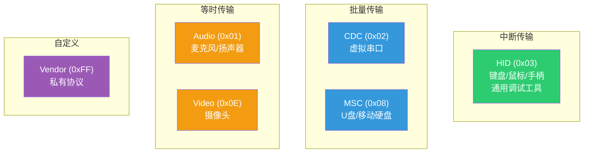
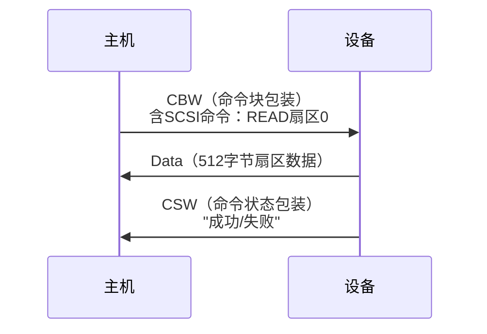
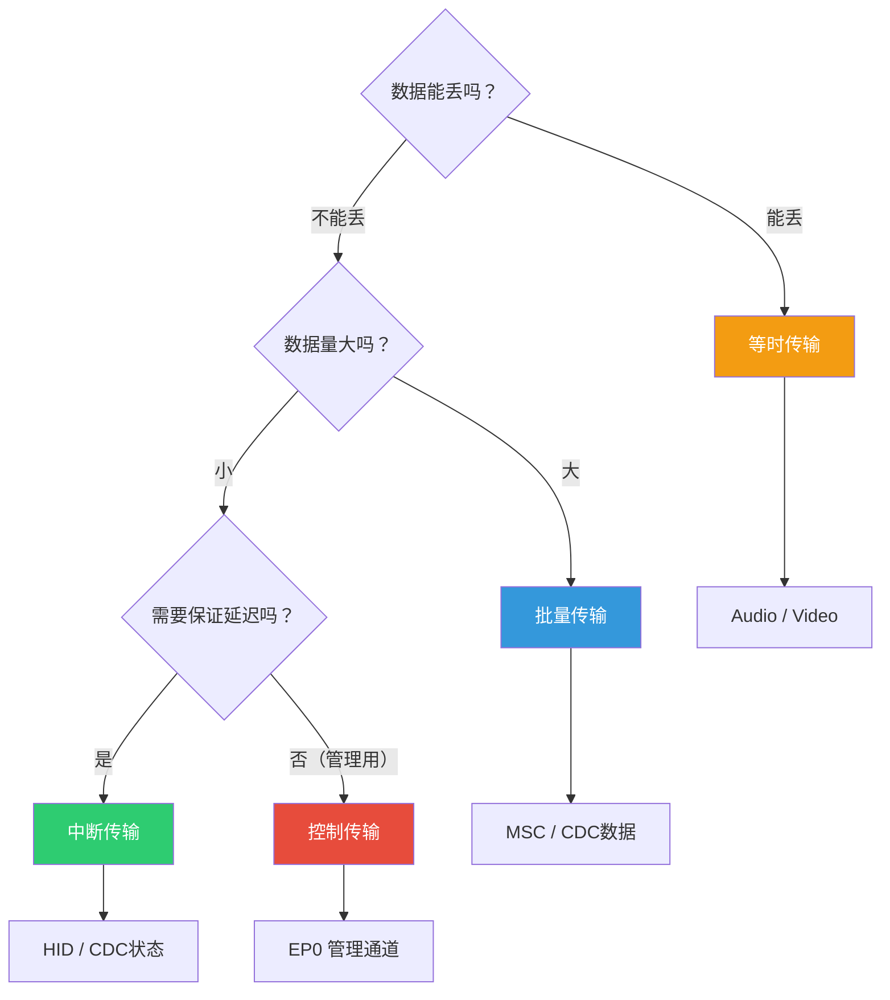
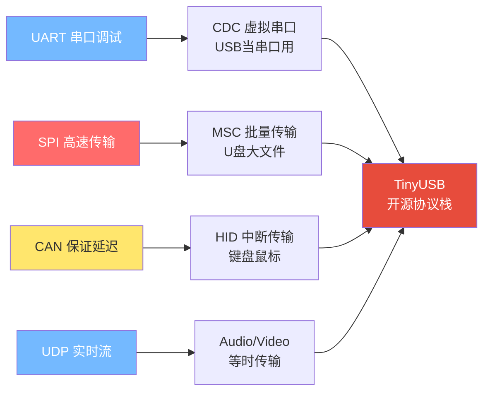

---
tags:
  - 嵌入式
  - 通信协议
  - USB
  - 设备类
  - 软件栈
aliases:
  - USB Device Class
  - USB软件栈
related:
  - "[[硬件层]]"
  - "[[协议逻辑层]]"
  - "[[枚举与描述符]]"
  - "[[../传输层/1. UART的基础理解]]"
  - "[[../传输层/SPI的基础理解]]"
date: 2026-05-29
---

# USB 设备类协议与开源软件栈

> [!abstract] 核心思想
> USB通用机制（包、事务、枚举）是"骨架"，设备类是"血肉"。
> 符合某个设备类规范，就能用操作系统自带的通用驱动，**即插即用**。
> 实际开发不需要从零写USB协议，用开源栈（如TinyUSB）即可快速上手。

---

## 一、设备类的意义

### 为什么需要设备类？

```
没有设备类：
  A厂的键盘 → 装A厂专用驱动
  B厂的键盘 → 装B厂专用驱动
  C厂的键盘 → 装C厂专用驱动
  → 每个设备都要装驱动，痛苦

有设备类（HID类）：
  所有键盘、鼠标 → 都是HID类
  Windows/Linux/macOS 自带HID驱动
  → 即插即用！
```

**设备类 = 行业标准协议。只要遵守，就能共享通用驱动。**

---

## 二、常用设备类总览



| 类代码 | 名称 | 传输类型 | 典型设备 | 为什么用这种传输 |
|--------|------|---------|---------|----------------|
| **0x03** | HID | 中断 | 键盘、鼠标 | 保证延迟，数据量小 |
| **0x02** | CDC | 批量+中断 | 虚拟串口 | 可靠传输 + 状态通知 |
| **0x08** | MSC | 批量 | U盘 | 大数据，一个字节不能丢 |
| **0x01** | Audio | 等时 | 麦克风、音箱 | 实时流，宁可丢不可等 |
| **0x0E** | Video | 等时 | 摄像头 | 视频流，丢帧可接受 |
| **0x0A** | CDC-ECM | 批量 | USB网卡 | 网络数据包，需完整 |
| **0xFF** | Vendor | 自定义 | 私有设备 | 完全自定义 |

---

## 三、CDC类：虚拟串口

### 最常用的嵌入式USB设备类

```
STM32开发板 ──USB线──→ 电脑
                      出现 COM3（虚拟串口）
                      串口助手收发数据
```

### CDC vs 真实UART对比

| 对比 | 真实UART | CDC虚拟串口 |
|------|---------|------------|
| 传输单位 | 1字节1字节 | **按包传输**（批量传输） |
| 波特率 | 真正影响速率 | **只是个数字**，USB速度固定 |
| 流控 | RTS/CTS硬件或XON/XOFF | USB自带流控（NAK） |
| 校验 | 奇偶校验（弱） | USB的CRC16（强） |
| 数据线 | TX + RX + GND | 全走D+/D- |

> [!warning] 波特率是假的
> CDC虚拟串口设成 115200 或 9600，USB实际以全速12Mbps传输。
> 波特率只是"配置信息"从主机传给设备，设备端代码可以选择是否尊重。
> 透传数据时完全可以忽略波特率设置。

### CDC的端点配置

```
EP0（控制传输）→ 枚举 + 线路状态控制（波特率、数据位等）
EP1 IN（中断传输）→ 通知主机串口状态变化
EP2 IN（批量传输）→ 设备→主机 数据传输
EP3 OUT（批量传输）→ 主机→设备 数据传输
```

---

## 四、HID类：人机接口设备

### 不只是键盘鼠标

```
HID表面：键盘、鼠标、游戏手柄
HID实质：免驱动的通用低带宽双向通信方案

很多嵌入式项目用HID做：
  → 自定义调试工具
  → 设备配置界面
  → 固件升级通道
```

### 报告描述符（Report Descriptor）

```
HID的核心 = 报告描述符
它告诉主机：我的数据格式是什么

例：自定义3字节报告
  字节0: 按键状态（8个按键，每个1位）
  字节1: X轴位置（0~255）
  字节2: Y轴位置（0~255）

报告描述符用一种专用的"Item"语法描述这个格式
主机解析后就知道怎么理解你的数据
```

### HID的优势与局限

| 维度 | 说明 |
|------|------|
| **优势** | 免驱动、跨平台、双向通信、自定义报告格式 |
| **局限** | 带宽有限（低速8B/帧，全速64B/帧）、传大数据很慢 |

---

## 五、MSC类：大容量存储

### 传输方式：批量传输

```
为什么用批量传输？
  U盘传文件 → 数据量大 → 需要利用所有剩余带宽
  文件数据 → 一个字节不能丢 → 必须有CRC + 重传
  不急 → 没有延迟保证，慢一点没关系

对比等时传输：
  视频 → 丢一帧无所谓  ✓ 等时
  U盘 → 丢一个字节文件损坏 ✗ 等时 → 用批量！
```

### MSC的三层协议

```
┌─────────────────────────────────────────┐
│  SCSI命令（最上层）                       │
│  READ(10) / WRITE(10) / INQUIRY 等      │
│  "读第0~511扇区" "写512字节到扇区100"     │
├─────────────────────────────────────────┤
│  BBB协议（Bulk-Only Transport）          │
│  CBW（命令包）→ Data → CSW（状态包）      │
├─────────────────────────────────────────┤
│  USB批量传输（最底层）                    │
│  OUT事务 / IN事务                        │
└─────────────────────────────────────────┘
```

| 协议层 | 内容 | 说明 |
|--------|------|------|
| **SCSI命令** | READ/WRITE/INQUIRY等 | 标准存储命令集 |
| **BBB传输** | CBW + Data + CSW | 把SCSI命令包装成USB批量事务 |
| **USB批量** | Token + Data + Handshake | 你已经学过的底层协议 |

### BBB传输流程



---

## 六、Audio类：音频设备

### 传输方式：等时传输

```
音频数据特点：
  → 持续不断的流
  → 有时效性（晚了就没用）
  → 偶尔丢一个采样，人耳分辨不出

所以用等时传输：
  → 保证带宽（每帧固定时间片）
  → 不重传（丢了就丢了）
  → 保证延迟（不越积越多）
```

### Audio类的端点

```
EP0（控制）→ 音量、静音等控制
EP1 IN（等时）→ 麦克风数据（设备→主机）
EP2 OUT（等时）→ 扬声器播放（主机→设备）

音频同步方式：
  → 基于帧率同步（1ms微帧内传固定采样数）
  → 不需要Handshake → 不重传 → 延迟可控
```

---

## 七、设备类与传输类型的关系总结



**选型口诀：**

| 问自己 | 答案 | 传输类型 | 设备类参考 |
|--------|------|---------|-----------|
| 数据能丢吗？ | 能 | 等时 | Audio、Video |
| 数据量大且不能丢？ | 是 | 批量 | MSC、CDC数据 |
| 数据量小且要即时？ | 是 | 中断 | HID |
| 管理/配置/枚举？ | 是 | 控制 | EP0 |

---

## 八、开源USB软件栈

### 主流协议栈对比

| 协议栈 | 适用MCU | 许可证 | 特点 | 推荐度 |
|--------|--------|--------|------|--------|
| **TinyUSB** | 跨MCU（STM32/ESP32/RP2040/NXP等） | MIT | 最流行，代码质量高，社区活跃 | ★★★★★ |
| **STM32 HAL USB** | STM32 | BSD | 官方库，CubeMX配合好 | ★★★★ |
| **CherryUSB** | ARM/RISC-V | Apache 2.0 | 国产，中文文档好 | ★★★★ |
| **LUFA** | AVR（Arduino） | MIT | 适合学习和小项目 | ★★★ |
| **NXP USB Stack** | NXP | 商用 | NXP官方提供 | ★★★ |

### 推荐：TinyUSB

```
TinyUSB 优势：
  ✓ 开源免费（MIT协议，商用无顾虑）
  ✓ 支持多种MCU（STM32、ESP32、RP2040、NXP、NRF52等）
  ✓ 支持多种设备类（CDC、HID、MSC、Audio、Video、WebUSB等）
  ✓ 不依赖特定RTOS（裸机/FreeRTOS/RT-Thread都能用）
  ✓ 代码质量高，Adafruit/Arduino底层也用它
```

### TinyUSB使用概览

```
应用层：你的代码（处理业务逻辑）
    ↕
设备类层：tusb_cdc_acm / tusb_hid / tusb_msc 等
    ↕
TinyUSB核心：tud_task() 处理USB事件
    ↕
DCD层：设备控制器驱动（对接具体MCU的USB外设）
    ↕
硬件：MCU的USB PHY → D+/D-
```

### STM32 HAL USB

```
适用场景：只用STM32、用CubeMX开发

优势：
  ✓ CubeMX一键生成USB初始化代码
  ✓ HAL库统一风格
  ✓ ST官方长期维护

劣势：
  ✗ 只能在STM32上用
  ✗ 代码量较大
  ✗ 设备类支持不如TinyUSB丰富
```

---

## 九、USB全栈架构总览

```
┌─────────────────────────────────────────────────────┐
│                    你的应用代码                        │
│         "我要发一个字节到虚拟串口"                      │
├─────────────────────────────────────────────────────┤
│              设备类协议（CDC/HID/MSC/...）             │
│         定义命令格式、数据含义、行为规范                 │
├─────────────────────────────────────────────────────┤
│              USB协议逻辑层                             │
│    传输（Transfer）→ 事务（Transaction）→ 包（Packet）  │
│    四种传输类型：控制/批量/中断/等时                     │
├─────────────────────────────────────────────────────┤
│              USB硬件层                                │
│    D+/D- 差分信号 / NRZI+位填充 / 上拉电阻检测          │
├─────────────────────────────────────────────────────┤
│              物理连接                                 │
│    VBUS + D+ + D- + GND（4根线）                      │
└─────────────────────────────────────────────────────┘
```

---

## 知识脉络



**从已知到未知的关联：**
- **UART 串口调试** → CDC虚拟串口，最简单的USB入门设备类
- **SPI 大数据传输** → MSC批量传输，高速可靠但不急
- **CAN 保证延迟** → HID中断传输，小数据但要及时
- **UDP 实时流** → Audio/Video等时传输，宁可丢不可等
- **Modbus 应用协议** → SCSI命令，USB设备类定义了上层协议

---

## 相关链接

- [[硬件层]] - 物理层基础，D+/D-差分信号
- [[协议逻辑层]] - 包/事务/传输类型是设备类的底层支撑
- [[枚举与描述符]] - 设备类在描述符中声明（bDeviceClass/bInterfaceClass）
- "[[../传输层/1. UART的基础理解]]" - UART是理解CDC虚拟串口的基础
- "[[../协议层/Modbus协议]]" - 应用层协议类比SCSI命令
