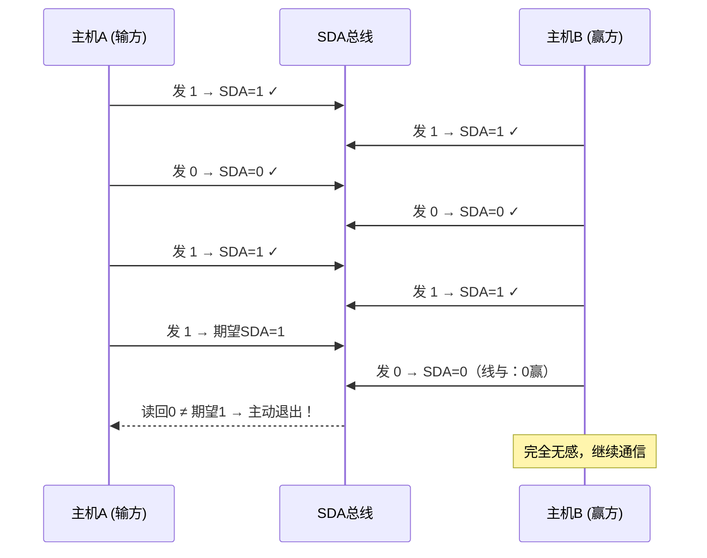

---
tags:
  - 嵌入式
  - 通信协议
  - I2C
aliases:
  - I2C
  - IIC
  - Inter-Integrated Circuit
related:
  - "[[1. UART的基础理解]]"
  - "[[3.SPI的基础理解]]"
  - "[[通信总览]]"
date: 2026-01-05
updated: 2026-04-18
---

# I2C 深度理解

> [!abstract] 一句话总结
> I2C 是一种**半双工、同步、多主机**的通信协议，只用 **2 根线**（SCL + SDA），靠**软件地址寻址**和**开漏输出 + 上拉电阻**实现多设备通信，硬件仲裁靠**线与逻辑（0 赢过 1）**。

> [!tip] 学习主线
> I2C 的核心问题：**两根线怎么挂一百多个设备？**
> 答案链条：**软件地址代替CS线 → 开漏输出避免短路 → 线与逻辑实现仲裁 → ACK确认每次传输**

---

## 物理层


1. **SCL**：时钟线，同步通信
2. **SDA**：双向传输数据
3. **仲裁模式**：后面详细讲解，因为 I2C 可以多主机
4. **传输速度**：标准 100kbit/s，快速 400kbit/s，高速 3.4Mbit/s（目前大多设备尚不支持高速模式）


### 为什么必须用开漏输出 + 上拉电阻？

> [!important] 核心理解
> I2C 的 SDA 线被多个设备共用，**必须用开漏输出**，否则推挽输出会导致短路烧毁。

**推挽输出 vs 开漏输出的区别：**

```
推挽输出（两个开关，不能共用一根线）:

       VCC                              VCC
        │                                │
      ┌─┴─┐                            ┌─┴─┐
      │上管│ ← 主动拉高                  │上管│
      └─┬─┘                            └─┬─┘
        ├── Output ──── 同一根线 ──────────┤
      ┌─┴─┐                            ┌─┴─┐
      │下管│ ← 主动拉低                  │下管│
      └─┬─┘                            └─┬─┘
        │                                │
       GND                              GND

设备A 输出1（上管导通）+ 设备B 输出0（下管导通）
→ VCC 直接短路到 GND → 烧芯片！💥
```

```
开漏输出（只有一个开关，可以共用）:

       VCC
        │
      ┌─┴─┐
      │上拉│ ← 外部电阻，只有很小的电流
      └─┬─┘
        ├── 主机开关 ── 从机1开关 ── 从机2开关
        │
       GND

任何设备想发0 → 开关闭合，拉到 GND（0赢）
所有设备都松手 → 上拉电阻拉到 VCC → 高电平
→ 永远不会短路 ✓
```

**上拉电阻的作用：**
```
开漏输出只有一个下管开关：
  开关闭合 → 输出连 GND → 低电平 ✓
  开关断开 → 输出没连任何地方 → 电压不确定（悬空）
  → 上拉电阻 = 开关断开时，把线"拉"到 VCC 的弹簧
  → 确保没人拉低时，SDA 默认是高电平
```

**这就是"线与逻辑"：所有人松手 = 1，任何一个人拉低 = 0。0 赢过 1。**

---

## 协议层

### 地址寻址

I2C 用**软件地址**代替了 [[3.SPI的基础理解|SPI]] 的硬件 CS 线：

```
SPI: 每个从机一根 CS 线 → 硬件选从机，线多
I2C: 主机在 SDA 上广播地址 → 软件选从机，线少

主机发: "我要找 0x68！"
→ 所有从机都在听
→ 地址匹配的从机响应，其他从机忽略
```

```
7位地址范围: 0x00 ~ 0x7F (128个)
保留地址:    0x00~0x07 (8个) + 0x78~0x7F (8个) = 16个
可用地址:    0x08 ~ 0x77 = 112个设备

有些芯片地址可通过引脚配置:
  MPU6050: AD0=低 → 0x68, AD0=高 → 0x69
  → 同一总线可挂两个（地址不同）
```

### 读写位（LSB）

地址字节 = 7位地址 + 1位读写标志：

```
┌─────────────────────────────┬──────┐
│     7位地址                  │ R/W  │
│  A6 A5 A4 A3 A2 A1 A0       │ bit  │
└─────────────────────────────┴──────┘

R/W = 0 → 写    R/W = 1 → 读

代码中常见写法:
  写: (0x68 << 1) | 0 = 0xD0
  读: (0x68 << 1) | 1 = 0xD1
```

### ACK / NACK 机制

**每发完 8 bit，接收方在第 9 个时钟周期拉低 SDA 表示"收到了"：**

```
SCL:  ┌─┐┌─┐┌─┐┌─┐┌─┐┌─┐┌─┐┌─┐┌─┐
      1  2  3  4  5  6  7  8  9
SDA:  D0 D1 D2 D3 D4 D5 D6 D7 ACK
      ↑                        ↑
   发送方控制SDA           接收方控制SDA
   (发数据)               (拉低=收到)
```

```
ACK  = 0 (低电平) → "收到了，请继续"
NACK = 1 (高电平) → "没收到 / 不想听了 / 传输结束"

流程:
  发送方发完8bit → 释放SDA（松手）
  接收方把SDA拉低 → 发送方在第9个SCL采样确认
```


> [!note]
> 这个图有一点的问题，一开始肯定要先发出从机地址和 LSB，这个时候必然是从机拉低 SDA 表示我是你要找的那个，后面 LSB 根据谁接收数据谁应答。

### 采样

SCL 为高电平的时候 SDA 表示的数据有效，即此时的 SDA 为高电平时表示数据"1"，为低电平时表示数据"0"。

当 SCL 为低电平时，SDA 的数据无效，一般在这个时候 SDA 进行电平切换，为下一次表示数据做好准备。

---

## 仲裁模式

> [!important] 线与逻辑实现仲裁
> 0 赢过 1，发 0 的主机赢得总线控制权。

*这便涉及到了线与模式（你可以理解成用线的方式实现了与逻辑门的逻辑架构，只有都是1才是1）*

1. 而实现线与逻辑便需要设置 GPIO 为开漏输出模式，并且要配一个上拉电阻(使其能发送高电平)
2. 至于开漏输出和推挽输出的一些区别看 [keysking](https://www.bilibili.com/video/BV1zG4y1K78S/?spm_id_from=333.1387.collection.video_card.click&vd_source=603f3c284e76fbe772654083937e3fac)
3. 线与逻辑的实现，明确了输出 0 为高优先级，而进一步明确了主机

**仲裁过程：边发边监听**

```
主机A 发: 1  0  1  1  0 ...
主机B 发: 1  0  1  0  ...
                 ↑
              从这里开始不一样了！

SCL 第4拍: A发1, B发0 → SDA=0!
           A 读回来发现 SDA≠自己发的 → A 主动退出
           B 完全无感，继续完成通信
```




**三个仲裁原则：**
1. **0 赢过 1**（线与逻辑决定）
2. **输方必须主动退出**，不能硬抢（否则就短路了）
3. **赢方完全无感**，不知道有人在竞争

**仲裁的局限：**
- 优先级由数据内容决定（地址值越小越容易赢），不可控
- 输方退出后没有硬件重试机制，需要软件处理
- 实际工程中很少用多主机，大多还是一主多从

---

## TIPS

来源于 Gemini


使用 I2C-Tools 检测波形

示波器调试

---

## 出现的问题

*抓波形，一定比去傻傻的看那个寄存器好*

1. **ACK_Error** → 从机出现引脚配置错误，速度匹配，上拉电阻，上电问题
2. **ACK_Time_Out** → 波频异常拉低，中断配置问题
3. **波形异常** → 和厂家有关，或者硬件内部有关
4. 还有挺多的，以后自己实践会遇到的

[B站视频](https://www.bilibili.com/video/BV1WkSwBTE8B/?spm_id_from=333.1387.homepage.video_card.click&vd_source=603f3c284e76fbe772654083937e3fac)

---

## 工程选型：I2C vs SPI vs UART

| 维度 | [[3.SPI的基础理解|SPI]] | I2C | [[传输层/1. UART的基础理解|UART]] |
|------|-----|-----|------|
| 速度 | 快(几十MHz) | 慢(100k~3.4M) | 中(115200常见) |
| 线数 | 3+N根 | **2根** | 3根(TTL) |
| 双工 | 全双工 | 半双工 | 全双工 |
| 寻址 | 硬件(CS线) | **软件地址** | 无(点对点) |
| 多主 | ✗ | **✓ (有仲裁)** | ✗ |
| 距离 | 板内 | 板内 | TTL板内/RS485远距离 |

**选型口诀：要高速传大量数据 → SPI，引脚紧张或传命令 → I2C，远距离或点对点 → UART**

---

## 相关链接

- [[通信总览]] - 通信协议的整体对比
- [[1. UART的基础理解]] - 异步通信，靠波特率同步
- [[3.SPI的基础理解]] - 全双工同步协议，线多但快
