---
tags:
  - 嵌入式
  - 通信协议
  - SPI
aliases:
  - Serial Peripheral Interface
  - SPI总线
related:
  - "[[1. UART的基础理解]]"
  - "[[2. I2C的基础理解]]"
  - "[[通信总览]]"
date: 2026-01-05
updated: 2026-04-18
---

# SPI 深度理解

> [!abstract] 一句话总结
> SPI 是一种**同步、全双工、一主多从**的通信协议（也是最简单的那个），靠 **SCK 时钟线同步**，靠 **CS 片选线选从机**，核心机制是**移位寄存器的数据交换**。

> [!tip] 学习主线
> SPI 的核心优势：**有时钟线 → 不需要波特率约定**，**全双工 → 同时收发**。
> 代价是**线多**（每多一个从机多一根 CS 线）。

---

## 物理层

### 四根线的职责

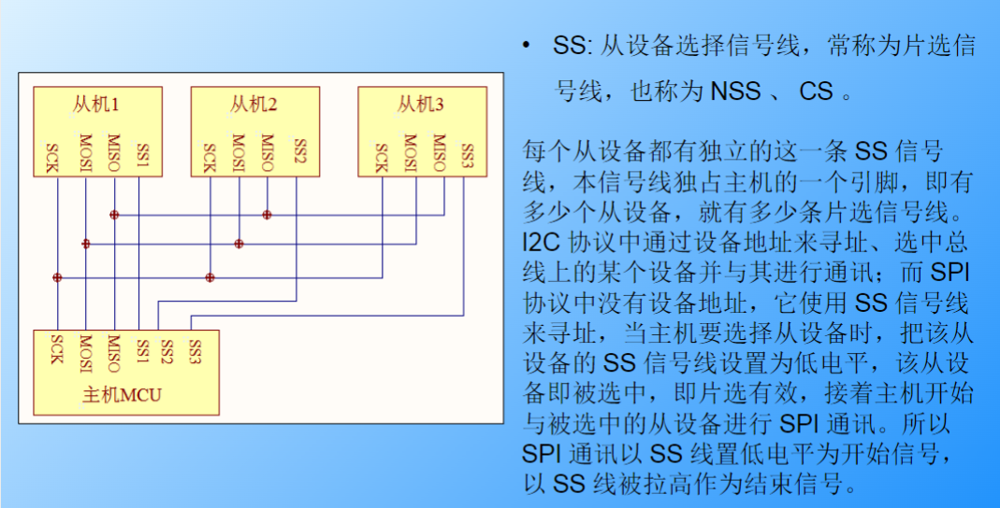

```
主机(Master)                    从机(Slave)
┌──────┐                      ┌──────┐
│      │──── CS ──────────────│      │  ← 点名：低电平选中
│      │──── SCK ─────────────│      │  ← 节拍：告诉何时读数据
│      │──── MOSI ────────────│      │  ← 主机说 → 从机听
│      │──── MISO ────────────│      │  ← 从机说 → 主机听
└──────┘                      └──────┘
```

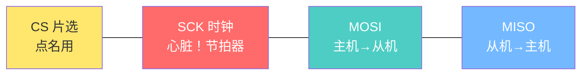

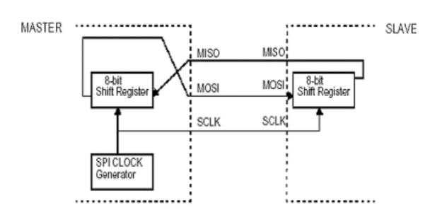

1. **CS**：一机多从的特点，其中 CS 片选引脚，是来选择从机的
2. **MOSI / MISO**：同时输入和输出的特点，即数据如同在俩个移位寄存器里面交换，说明读一定要写的特点，由 MOSI(输出)，MISO(输入)控制
3. **SCK**：是同步通信，意味着有时钟线(SCK)控制
4. **移位寄存器**：配合 SCK 将并行的数据改变成串行输入到 MOSI，反之亦然
5. **传输速度**：取决于时钟速率

> [!important] SCK 是心脏
> 没有 SCK → MOSI/MISO 上的电平没有意义，没人知道"什么时候算一个 bit"。
> 对比 [[1. UART的基础理解|UART]] 靠波特率猜节奏，SPI 直接用时钟线告诉从机"现在读"。

所以总的来说 SPI 有四根线，这种高硬件化的确提供了高速，双向同行的优势，但成本也上去了。

### 一主多从结构与线多问题

```
            ┌── CS1 ── 从机1
            ├── CS2 ── 从机2
主机 ──SCK──┼── CS3 ── 从机3
    ──MOSI──┤
    ──MISO──┘

每多一个从机 → 多一根 CS 线 → 3+N 根线
```

> [!warning] 线多就是 SPI 最大的痛点
> 10个从机 = 13根线！MCU 引脚根本不够用。
> 对比 [[2. I2C的基础理解|I2C]] 只要 2 根线就能挂 127 个从机。

**工程解决办法：**
1. **IO 扩展芯片**（如 74HC138 译码器）→ 3 根 GPIO 控制 8 根 CS 线
2. **菊花链连接** → 所有从机串起来，数据一个个传过去（特定场景）

---

## 协议层

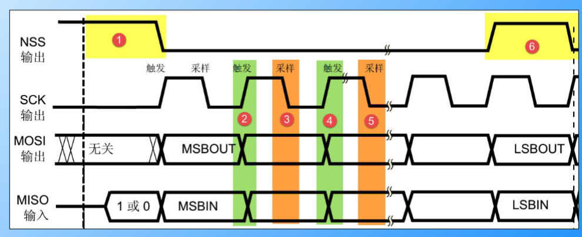

### 全双工的秘密：移位寄存器

SPI 本质是**数据交换**——主机和从机各有一个 8 位移位寄存器，通过 MOSI/MISO 连成环形。

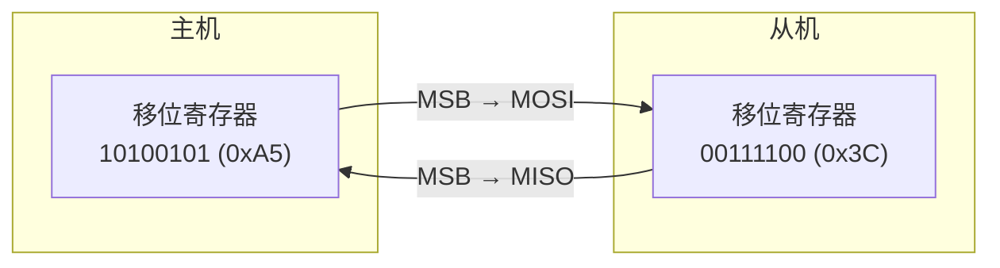

**每个 SCK 时钟脉冲，两件事同时发生：**
1. 各自的最高位(MSB)被"推"出去
2. 收到的位被"塞"进最低位

```
初始:  主机 [1][0][1][0][0][1][0][1]   从机 [0][0][1][1][1][1][0][0]

SCK第1拍: 主机推出"1" → 从机推出"0"
          主机 [0][1][0][0][1][0][1][0]  从机 [0][1][1][1][1][0][0][1]

SCK第2拍: 主机推出"0" → 从机推出"0"
          主机 [1][0][0][1][0][1][0][0]  从机 [1][1][1][0][0][1][1][0]

... 8拍之后 ...

结果:  主机 [0][0][1][1][1][1][0][0] = 0x3C ← 收到了从机的数据！
       从机 [1][0][1][0][0][1][0][1] = 0xA5 ← 收到了主机的数据！

→ 两个寄存器内容完全交换！
```

> [!important] 读一定要写
> SPI 没办法只读不写。想读从机一个字节，必须**写一个字节**去产生 8 个 SCK 脉冲，才能把数据"挤"回来。
> 写的那个字节通常叫 **Dummy Byte**（随便填什么都行）。

### CPOL 与 CPHA：四种 SPI 模式

不同 SPI 芯片对时钟形状要求不同，用两个参数来适配：

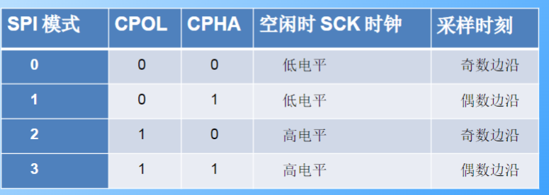

**CPOL（Clock Polarity）→ 空闲时 SCK 停在哪个电平**

```
CPOL=0 (空闲低):  SCK: _┌─┐_┌─┐_┌─┐___
CPOL=1 (空闲高):  SCK: ─┐_┌─┐_┌─┐_┌───
```

**CPHA（Clock Phase）→ 在第几个边沿采样**

```
CPHA=0: 第1个边沿就采样（数据必须提前放好）
CPHA=1: 第2个边沿才采样（第1个边沿准备数据）
```

**四种模式组合：**

| 模式 | CPOL | CPHA | 空闲电平 | 采样边沿 | 常见芯片 |
|------|------|------|---------|---------|---------|
| 0 | 0 | 0 | 低 | 上升沿 | W25Q64(Flash)、MPU6050 |
| 1 | 0 | 1 | 低 | 下降沿 | ADS1115(ADC) |
| 2 | 1 | 0 | 高 | 下降沿 | 较少 |
| 3 | 1 | 1 | 高 | 上升沿 | W25Q64(Flash)、某些显示屏 |

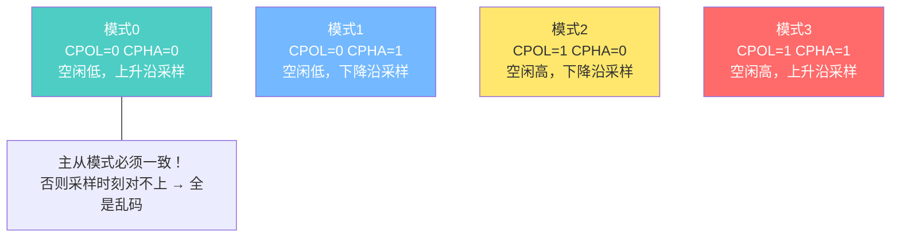

> [!warning] 主从模式必须匹配
> 拿到一个 SPI 芯片，**第一件事就是翻数据手册找它要求哪种模式**，然后配置 STM32 的 CPOL/CPHA 与之一致。

---

## 采样和移位的理解

根据 SCK 的时钟信号和 CPOL 的选择，在电压变换的时候（上升或者下降），一部分是从移位寄存器里面采样到 MOSI 通道，另一部分是进行移位寄存器电平反转，来表示数据。

---

## STM32 里面的配置

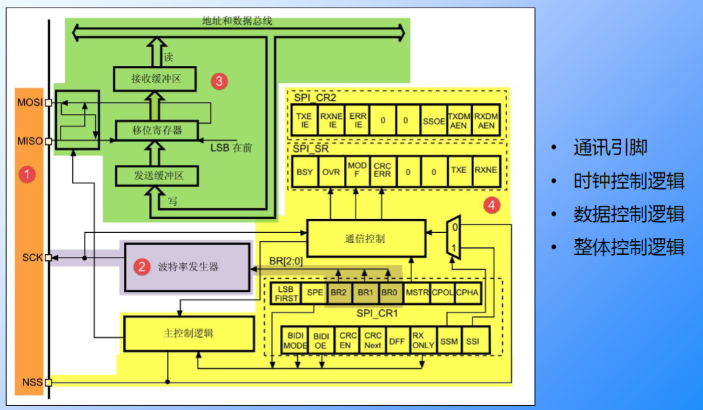

*主要涉及到用位控制寄存器去硬件化 SPI，详细见 > STM32F4xx中文手册*

涉及到的寄存器：
1. **SPI_DR** (Data Register，数据寄存器)：主要用于缓冲的接发作用，发送和接收
2. **SPI_SR** (Data Status，状态寄存器)：检测 TXE(Transmit Buffer Empty)，RXNE(Receive Buffer Not Empty)
3. **SPI_CR** (Control Register 控制寄存器)：配置 SCK, CPOL, CPHA, MSTR

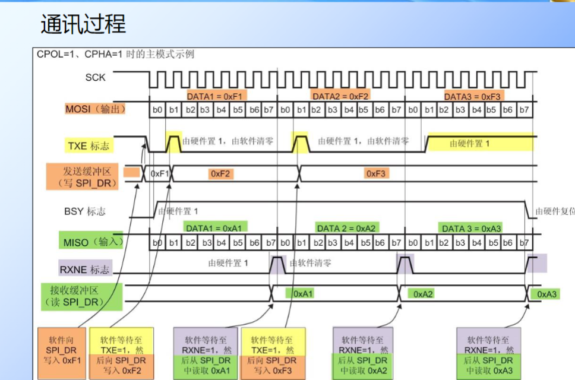

---

## TIPS 和注意事项

来源于 Gemini
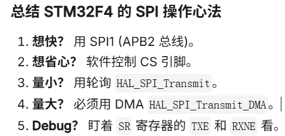

---

## 出现的问题

*主要有内存问题，硬件问题，芯片底层问题*

1. **SPI_Timeout** → 两次中断导致的双重释放，导致死机
2. **触摸屏没有反应** → 内存不足问题
3. **高速时钟错位** → 要用 tick_delay 调整采样点

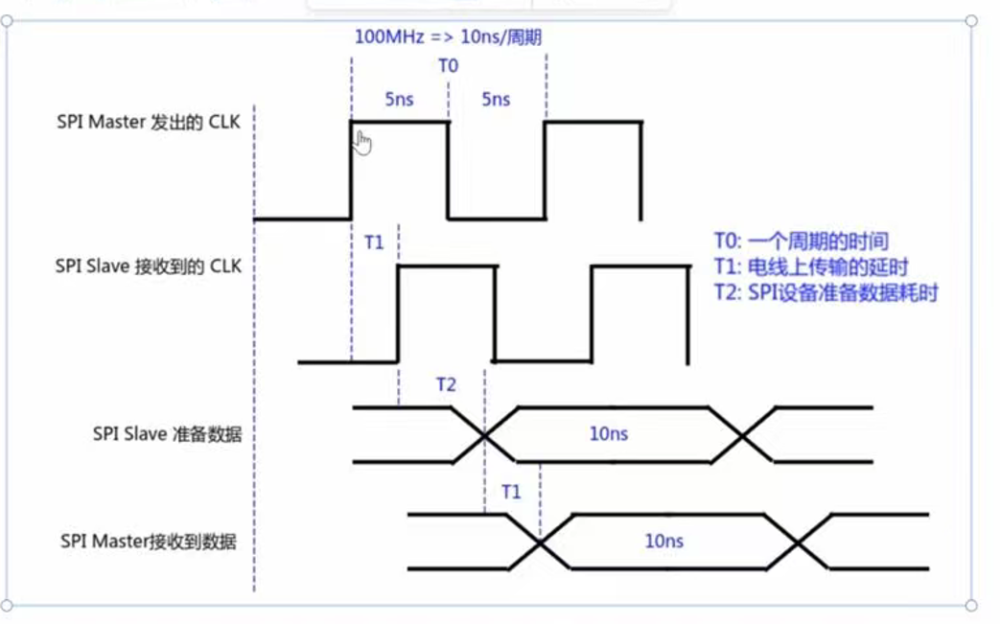

4. 回环测试来检测是主机有传输问题还是从机问题，利用了全双工的性质

[B站的一个视频](https://www.bilibili.com/video/BV1GwijBXEs9/?spm_id_from=333.1387.homepage.video_card.click&vd_source=603f3c284e76fbe772654083937e3fac)

---

## 工程选型：SPI vs I2C vs UART

| 维度 | SPI | [[2. I2C的基础理解\|I2C]] | [[传输层/1. UART的基础理解|UART]] |
|------|-----|-----|------|
| 速度 | 快(几十MHz) | 慢(100k~3.4M) | 中(115200常见) |
| 线数 | 3+N根 | 2根 | 3根(TTL) |
| 双工 | 全双工 | 半双工 | 全双工 |
| 寻址 | 硬件(CS线) | 软件地址 | 无(点对点) |
| 多主 | ✗ | ✓ | ✗ |
| 距离 | 板内 | 板内 | TTL板内/RS485远距离 |

**选型口诀：要高速传大量数据 → SPI，引脚紧张或传命令 → I2C，远距离或点对点 → UART**

---

## 相关链接

- [[通信总览]] - 通信协议的整体对比
- [[1. UART的基础理解]] - 异步通信，靠波特率同步
- [[2. I2C的基础理解]] - 半双工同步协议，线少但有仲裁
