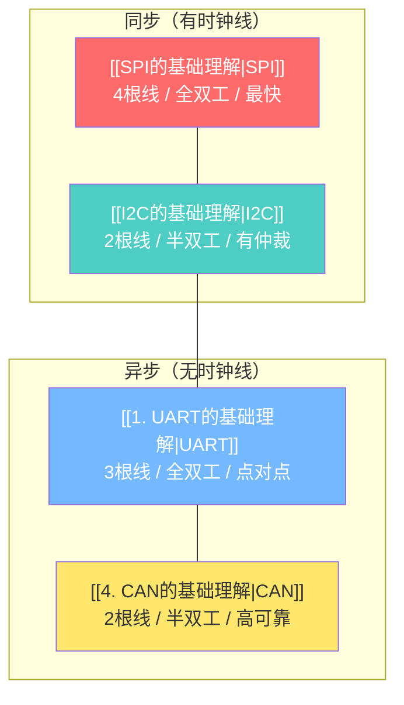
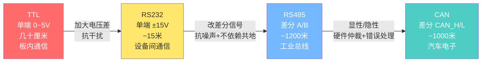
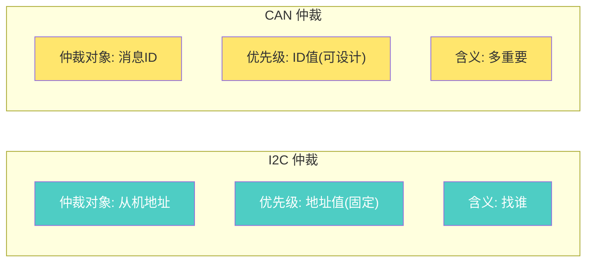
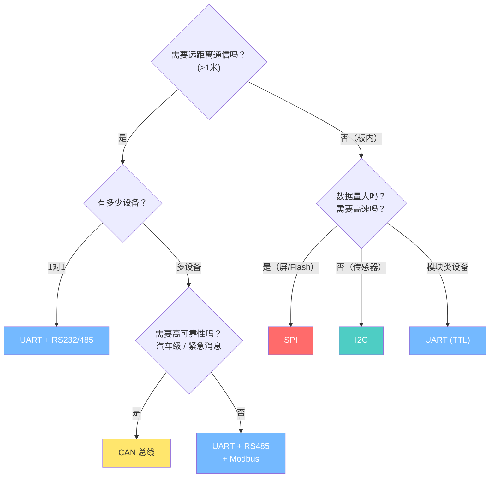
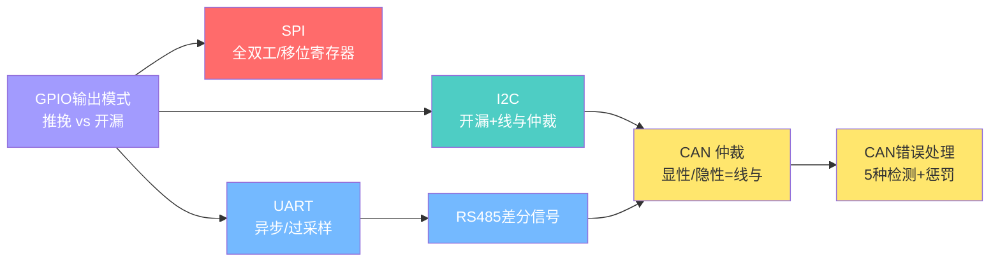

---
tags:
  - 嵌入式
  - 通信协议
  - 总览
aliases:
  - 通讯协议总览
  - 协议对比
related:
  - "[[1. UART的基础理解]]"
  - "[[SPI的基础理解]]"
  - "[[I2C的基础理解]]"
  - "[[4. CAN的基础理解]]"
date: 2026-01-05
updated: 2026-04-20
---

# 通信协议总览

> [!abstract] 核心思想
> 从 SPI → I2C → UART → CAN → 互联网，**线的减少（硬件化变弱）**，也伴随着**软件化实现的难度加深**。
> 嵌入式底层（寄存器级）→ 网络应用层（协议栈级）。

---

## 演进主线

```
同步方式:  SPI/SCK ── I2C/SCL ── UART/波特率 ── CAN/位同步 ── TCP/IP/协议栈
仲裁方式:  无(CS线) ── I2C/线与 ── 无(主从)  ── CAN/线与ID ── MAC/CSMA
物理层:    单端     ── 开漏上拉 ── TTL/RS485  ── CAN差分    ── Ethernet
复杂度:    简单     ── 简单     ── 中等       ── 复杂       ── 最复杂
可靠性:    低       ── ACK     ── 奇偶校验    ── 5种检测+惩罚 ── TCP重传
```

---

## 全景对比



| 维度 | [[SPI的基础理解\|SPI]] | [[I2C的基础理解\|I2C]] | [[1. UART的基础理解\|UART]] | [[4. CAN的基础理解\|CAN]] |
|------|-----|-----|------|-----|
| **同步方式** | SCK 时钟线 | SCL 时钟线 | 波特率 + 过采样 | 位同步 + 位填充 |
| **线数** | 3+N | 2 | 3(TTL) / 2(RS485) | 2 |
| **信号方式** | 单端 | 开漏+上拉 | 单端 / 差分(RS485) | 差分(显性/隐性) |
| **双工** | 全双工 | 半双工 | 全双工 | 半双工 |
| **寻址** | 硬件(CS线) | 软件地址(7/10位) | 无(点对点) | 消息ID(11/29位) |
| **多主机** | ✗ | ✓(线与仲裁) | ✗ | **✓(ID仲裁)** |
| **速度** | 几十 MHz | 100k~3.4M | 115200 常见 | 500k~1M(FD:5M) |
| **距离** | 板内 | 板内 | RS485: ~1200m | ~1000m |
| **仲裁** | 无(主机独占) | 线与(地址固定) | 无(Modbus软件) | **线与(ID可设计)** |
| **优先级** | 无 | 固定(地址决定) | 无 | **可设计(ID越小越高)** |
| **错误检测** | 无 | ACK/NACK | 奇偶校验(弱) | **5种+三级惩罚** |
| **数据量/帧** | 任意 | 任意 | 1字节 | 8字节(FD:64) |
| **典型应用** | Flash、显示屏 | 传感器、EEPROM | GPS、蓝牙、调试 | 汽车、工业控制 |

---

## 物理层演进路线



**关键演进步伐：**

| 演进 | 解决了什么问题 | 核心改进 |
|------|--------------|---------|
| TTL → RS232 | 噪声容限太小 | 加大电压差(5V → 30V) |
| RS232 → RS485 | 依赖共地 + 距离短 | 差分信号(不依赖GND) + 多设备 |
| RS485 → CAN | 无仲裁 + 错误处理弱 | 显性/隐性仲裁 + 5种检测 + 惩罚机制 |

---

## 仲裁机制对比

I2C 和 CAN 都用"线与逻辑(0赢过1)"仲裁，但本质不同：



| 对比 | [[I2C的基础理解\|I2C]] | [[4. CAN的基础理解\|CAN]] |
|------|------|------|
| 共同原理 | 线与逻辑：0赢过1 | 线与逻辑：显性(0)赢过隐性(1) |
| 实现方式 | 开漏输出 + 上拉电阻 | 显性驱动 / 隐性松手 |
| 仲裁对象 | 从机地址(7位) | 消息ID(11/29位) |
| 优先级 | 固定(地址出厂决定) | **可设计(ID由你分配)** |
| 仲裁含义 | "找谁说话" | **"这件事有多重要"** |

---

## 分层思想

```
┌──────────────────────────────────────────────────────┐
│                应用层（你的代码）                        │
├──────────────────────────────────────────────────────┤
│          协议层（Modbus / ISO-TP / 自定义）              │
│   管理总线访问、地址/ID、校验、分包、重传                  │
├──────────────────────────────────────────────────────┤
│      通信协议（UART / SPI / I2C / CAN）                 │
│   定义帧结构、同步方式、仲裁机制                          │
├──────────────────────────────────────────────────────┤
│      物理层（TTL / RS232 / RS485 / CAN差分）            │
│   电压标准、差分/单端、线                                │
└──────────────────────────────────────────────────────┘

换物理层 → 上层不变
  例: UART帧结构不变，TTL换成RS485

换上层协议 → 底层不变
  例: Modbus RTU(UART) 换成 Modbus TCP(Ethernet)

CAN 自带了很多"协议层"的功能（仲裁、校验、错误处理）
→ 有些场景不需要额外加 Modbus，CAN 本身就够可靠
```

---

## 工程选型速查



**选型口诀：**

| 场景 | 选择 | 原因 |
|------|------|------|
| 高速大容量（Flash、屏幕） | [[SPI的基础理解\|SPI]] | 全双工、几十MHz |
| 少量数据省引脚（传感器） | [[I2C的基础理解\|I2C]] | 2根线、112个设备 |
| 点对点持续数据流（GPS、蓝牙） | [[1. UART的基础理解\|UART]] | 全双工、简单 |
| 工业远距离多设备 | UART + RS485 + Modbus | 1200m、差分、主从 |
| **汽车/高可靠/紧急消息** | **[[4. CAN的基础理解\|CAN]]** | **多主、ID仲裁、5种检测+惩罚** |

---

## 知识脉络



**知识关联：**
- **开漏输出 + 上拉电阻** → 理解 I2C 总线 → 理解 CAN 的显性/隐性
- **线与逻辑（0赢过1）** → I2C 仲裁 → CAN 仲裁（但对象从地址变成消息ID）
- **差分信号** → RS485（双驱） → CAN（显性/隐性松手式）
- **分层思想** → UART + Modbus → CAN + ISO-TP → TCP/IP 协议栈

---

## 学习进度

### 已完成 ✓

- [x] [[SPI的基础理解]] - 全双工、同步、移位寄存器、CPOL/CPHA
- [x] [[I2C的基础理解]] - 半双工、同步、地址寻址、线与仲裁、开漏输出
- [x] [[1. UART的基础理解]] - 异步、过采样、波特率、TTL→RS232→RS485、Modbus
- [x] [[4. CAN的基础理解]] - 多主、差分信号、ID仲裁、帧结构、错误处理

### 待学习

- [ ] [[../协议层/TCP-IP 协议栈]] - 网络协议栈、LwIP
- [ ] CAN FD 深入 - 灵活数据率、64字节扩展
- [ ] CAN 在 STM32 中的配置 - bxCAN、滤波器

---

## 相关链接

- [[1. UART的基础理解]] - 异步通信，RS485 是 CAN 物理层的"前身"
- [[SPI的基础理解]] - 全双工同步协议，线多但快
- [[I2C的基础理解]] - 线与仲裁是理解 CAN 仲裁的基础
- [[4. CAN的基础理解]] - 多主高可靠总线，集大成者
- [[../协议层/TCP-IP 协议栈]] - 更上层的网络协议栈
