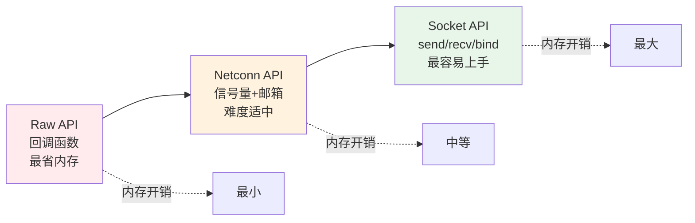
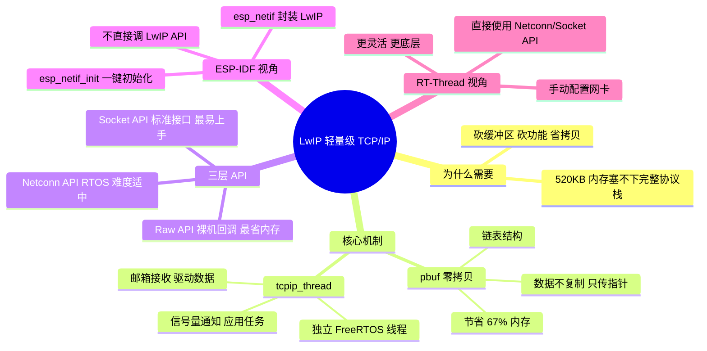

---
aliases:
  - LwIP
  - Lightweight IP
  - 轻量级TCP/IP
  - lwip协议栈
tags:
  - 嵌入式
  - 通信
  - 协议层
  - LwIP
  - TCP/IP
  - ESP-IDF
  - RT-Thread
date: 2026-05-23
status: evergreen
related:
  - "[[TCP-IP 协议栈]]"
  - "[[../../../物联网/IOT应用/WIFI]]"
  - "[[../../芯片/开发板/ESP32-D0WDQ6]]"
  - "[[../../芯片/架构与指令集/Xtensa LX6 双核架构]]"
  - "[[../../操作系统与内核/04_FreeRTOS/同步与通信/队列]]"
---

> [!abstract] 核心摘要
> LwIP（Lightweight IP）是为资源受限的嵌入式系统量身定制的 TCP/IP 协议栈，只需几十 KB RAM 就能让单片机连上互联网。它通过 **`pbuf` 零拷贝**省内存、通过 **`tcpip_thread`** 独立线程处理协议计算、通过 **三层 API**（Raw/Netconn/Socket）适配不同场景。在 ESP-IDF 中被 `esp_netif` 封装，你不直接调用 LwIP API；在 RT-Thread 中可直接使用 Netconn/Socket API。

---

## 1. 为什么需要 LwIP

### 1.1 问题：ESP32 怎么塞得下 TCP/IP 协议栈

```
PC 上的 TCP/IP 协议栈（Windows/Linux）：
  → TCP 缓冲区就可能占几 MB
  → 完整协议栈需要几十 MB

ESP32 的全部 SRAM：
  → 520KB（还要分给 FreeRTOS、Wi-Fi 驱动、业务代码...）
```

**520KB 内存塞不下完整协议栈。** LwIP 的解决方案——**只搬最必要的，该砍的砍、该缩的缩：**

| 瘦身方式 | PC 上的做法 | LwIP 的做法 |
|---------|-----------|-----------|
| **砍缓冲区** | 每个 TCP 连接分配几 KB | 每个 TCP 连接只分配几百字节 |
| **砍功能** | 支持所有 TCP/IP 特性 | 只保留嵌入式最常用的子集 |
| **省内存拷贝** | 数据每过一层复制一份 | **零拷贝**：数据不复制，只传指针 |

---

## 2. pbuf：零拷贝的灵魂数据结构

### 2.1 PC 的做法 vs LwIP 的做法

```
PC 的做法（复制 3 次，用约 3.3KB 内存）：
  原始数据 1KB → 复制+加TCP头 → 1.05KB
               → 复制+加IP头  → 1.1KB
               → 复制+加MAC头 → 1.14KB
  总共：约 3.3KB

LwIP 的做法（不复制，用链表串起来，约 1.1KB 内存）：
  ┌──────────┐   ┌──────────┐   ┌──────────┐   ┌──────────┐
  │ pbuf     │──→│ pbuf     │──→│ pbuf     │──→│ pbuf     │
  │ MAC 头   │   │ IP 头    │   │ TCP 头   │   │ 原始数据  │
  │ (14字节) │   │ (20字节) │   │ (20字节) │   │ (1KB)    │
  └──────────┘   └──────────┘   └──────────┘   └──────────┘
  每个 pbuf 只是一个指针 + 小块头数据
  原始数据始终待在原地，没被复制过
  总共：约 1.1KB（节省 67%）
```

> [!tip] 类比集装箱运输：箱子里的货不动，只是在箱子外面依次贴上不同的标签（TCP 标签 → IP 标签 → 快递标签）。绝不会把里面的货物搬出来重新装箱。

### 2.2 pbuf 链表的工作方式

```c
// LwIP 内部：pbuf 是一个链表节点
struct pbuf {
    struct pbuf *next;   // 指向下一个节点
    void *payload;       // 指向实际数据
    u16_t len;           // 这个节点的数据长度
    u16_t tot_len;       // 从这个节点到链表末尾的总长度
};
```

```
发送 1KB MQTT 数据时的 pbuf 链表：

  pbuf1 (MAC头)  →  pbuf2 (IP头)  →  pbuf3 (TCP头)  →  pbuf4 (数据1KB)
  next ─────────→  next ─────────→  next ─────────→  next = NULL

  发送时：遍历链表，每个节点的数据依次写入 WiFi 硬件
  不需要把所有数据拼成一块连续内存
```

---

## 3. 三层 API：丰俭由人的编程接口

LwIP 提供三种不同抽象级别的 API，适配不同场景：

| API | 运行环境 | 特点 | 适合场景 |
|-----|---------|------|---------|
| **Raw API** | 裸机（无 RTOS） | 最省内存，速度最快，全靠回调函数，代码最反人类 | 极度资源受限 |
| **Netconn API** | RTOS 环境 | 用信号量/邮箱把异步变同步，难度适中 | RT-Thread 项目 |
| **Socket API** | RTOS 环境 | 兼容 BSD Socket（send/recv/bind），最容易上手，但开销最大 | Linux 移植、快速开发 |



---

## 4. RTOS 视角：tcpip_thread 线程模型

### 4.1 为什么必须是独立线程

LwIP 在 RTOS 环境下不是散落在各处运行的，而是**一个独立的 FreeRTOS 线程**（`tcpip_thread`）。原因：

```
网络数据收发的时间是不确定的：
  → 可能 1ms 就收到一个包
  → 可能 10ms 才收到
  → 如果在你的主循环里跑 LwIP，数据来了的时候你在忙别的

解决方案：
  → 给 LwIP 一个独立的线程
  → 专门负责协议计算（解析报文、计算校验和、处理超时）
  → 数据来了立刻处理，不影响你的业务任务
```

### 4.2 接收数据的完整流程

```
WiFi 驱动收到无线电波
  │
  │ 硬件中断触发
  ▼
中断处理函数（ISR，不能做耗时操作）
  │ 把数据封装成 pbuf
  │ 通过邮箱（Message Queue）扔给 tcpip_thread
  ▼
tcpip_thread 被唤醒
  │ 从邮箱取出 pbuf
  │ 拆 MAC 头 → 拆 IP 头 → 拆 TCP 头
  │ 查端口表，找到目标程序的接收队列
  ▼
通过信号量通知应用任务
  │ "你的数据到了，来拿吧"
  ▼
应用任务（如 MQTT 任务）
  │ 从接收队列取出数据
  │ 处理 MQTT 消息
```

### 4.3 发送数据的完整流程

```
应用任务（如 MQTT 任务）
  │ 调用发送 API（如 mqtt_client_publish）
  ▼
esp_netif 翻译成 LwIP 调用
  │ tcpip_thread 收到发送请求
  ▼
tcpip_thread 封装
  │ 用 pbuf 链表零拷贝
  │ 加 TCP 头 → 加 IP 头 → 加 MAC 头
  │ 通过邮箱发给 WiFi 驱动
  ▼
WiFi 驱动
  │ 读取 pbuf 链表，写入射频硬件
  ▼
无线电波发出去
```

### 4.4 线程间通信机制

```
┌──────────────┐     邮箱/队列      ┌──────────────┐     邮箱/队列     ┌──────────────┐
│  WiFi 驱动    │ ──────────────→  │ tcpip_thread │ ←────────────── │  应用任务     │
│  (硬件中断)   │  收到的 pbuf      │  (LwIP核心)  │  发送请求        │  (MQTT等)    │
└──────────────┘                   └──────────────┘                   └──────────────┘
                                    │
                                    │ 信号量通知
                                    ▼
                                   应用任务："数据到了，来拿"
```

---

## 5. ESP-IDF 视角：esp_netif 封装 LwIP

### 5.1 你为什么不直接调 LwIP API

```
你写的代码                  ESP-IDF 封装层                底层
┌──────────────┐          ┌──────────────┐          ┌──────────────┐
│ app_main()   │          │ esp_netif    │          │ LwIP         │
│              │──调──→   │ 封装层       │──调──→   │ TCP/IP 协议栈 │
│esp_netif_init│          │ 提供统一接口  │          │ pbuf, tcpip  │
│esp_mqtt      │          │ 管理网络接口  │          │ DHCP, DNS    │
└──────────────┘          └──────────────┘          └──────────────┘

你不直接碰 LwIP          ESP-IDF 帮你翻译           真正干活的是 LwIP
```

### 5.2 为什么加这层封装

| 原因 | 说明 |
|------|------|
| **简化 API** | LwIP 的 Raw API 很底层很复杂，`esp_netif` 封装成简单接口 |
| **可移植** | 如果未来 ESP-IDF 换了协议栈（不用 LwIP 了），你的代码不用改 |
| **自动集成** | `esp_netif` 自动把 LwIP 和 WiFi 驱动绑定，你不需要手动对接 |

### 5.3 esp_netif_init() 内部做了什么

```c
esp_netif_init()
  │
  ├── 初始化 LwIP 协议栈（底层调 lwip_init()）
  ├── 创建 tcpip_thread（LwIP 的核心线程）
  ├── 注册 DHCP 客户端
  ├── 注册 DNS 解析器
  └── 创建网络接口管理框架

esp_netif_create_default_wifi_sta()
  │
  ├── 创建一个 esp_netif 实例（网络接口对象）
  ├── 绑定到 WiFi STA 模式
  ├── 自动配置 DHCP 客户端
  └── 把这个接口和 WiFi 驱动"绑"在一起
      → WiFi 收到数据 → 自动交给 tcpip_thread 处理
      → 应用层发送数据 → 自动交给 WiFi 驱动发出
```

> [!tip] 这就是你在 [[../../../物联网/IOT应用/WIFI|WiFi 篇]] 里 `esp_netif_init()` 和 `esp_netif_create_default_wifi_sta()` 背后真正发生的事。

### 5.4 ESP-IDF 中的数据流

```
接收方向（从下往上）：

WiFi 射频收到电波
  → WiFi 驱动解码成数据帧
  → 通过 esp_netif 传递给 LwIP 的 tcpip_thread
  → tcpip_thread 拆 MAC → 拆 IP → 拆 TCP
  → 查端口表 → 放入 MQTT 任务的接收队列
  → MQTT 任务处理

发送方向（从上往下）：

MQTT 任务要发消息
  → 调 esp_mqtt_client_publish()
  → ESP-IDF MQTT 库调 esp_netif 发送接口
  → esp_netif 翻译成 LwIP 调用
  → tcpip_thread 用 pbuf 零拷贝封装
  → 通过 esp_netif 传递给 WiFi 驱动
  → WiFi 射频发出去
```

---

## 6. RT-Thread 视角：直接使用 LwIP API

> [!info] 以下内容面向 RT-Thread 开发，与 ESP-IDF 视角形成对比。

### 6.1 RT-Thread 中 LwIP 的集成方式

在 RT-Thread 中，LwIP 以软件包形式集成，开发者可以直接使用 Netconn API 或 Socket API，没有额外的封装层。

```
RT-Thread 应用代码
  │
  ├── 直接调 LwIP 的 Socket API
  │   socket() / bind() / listen() / accept() / send() / recv()
  │
  └── 或直接调 LwIP 的 Netconn API
      netconn_new() / netconn_bind() / netconn_recv() / netconn_send()
```

### 6.2 线程模型（与 ESP-IDF 相同原理）

```
RT-Thread 中的 LwIP 线程模型：

┌──────────────┐     邮箱（Mailbox）   ┌──────────────┐     信号量       ┌──────────────┐
│ 以太网驱动    │ ──────────────────→  │ tcpip_thread │ ─────────────→  │ 用户线程     │
│ (硬件中断)   │  收到的 pbuf          │ (LwIP 核心)  │  "数据到了"     │ (你的应用)   │
└──────────────┘                       └──────────────┘                  └──────────────┘

与 ESP-IDF 的区别：
  RT-Thread：以太网 MAC → 中断 → pbuf → 邮箱 → tcpip_thread
  ESP-IDF：  WiFi 驱动 → esp_netif 封装 → tcpip_thread
  核心原理相同，只是物理接口不同（以太网 vs WiFi）
```

### 6.3 Netconn API 使用示例

```c
// RT-Thread 中用 Netconn API 创建 TCP 服务器
struct netconn *conn = netconn_new(NETCONN_TCP);
netconn_bind(conn, IP_ADDR_ANY, 8080);
netconn_listen(conn);

while (1) {
    struct netconn *newconn;
    if (netconn_accept(conn, &newconn) == ERR_OK) {
        struct netbuf *buf;
        if (netconn_recv(newconn, &buf) == ERR_OK) {
            // 处理接收到的数据
            netconn_write(newconn, "HTTP/1.1 200 OK\r\n", 17, NETCONN_NOCOPY);
            netbuf_delete(buf);
        }
        netconn_close(newconn);
        netconn_delete(newconn);
    }
}
```

### 6.4 Socket API 使用示例

```c
// RT-Thread 中用 Socket API（与 Linux 代码几乎一样）
int sock = socket(AF_INET, SOCK_STREAM, 0);

struct sockaddr_in server_addr;
server_addr.sin_family = AF_INET;
server_addr.sin_port = htons(8080);
server_addr.sin_addr.s_addr = inet_addr("192.168.1.100");

connect(sock, (struct sockaddr *)&server_addr, sizeof(server_addr));
send(sock, "Hello", 5, 0);

char buf[128];
recv(sock, buf, sizeof(buf), 0);
close(sock);
```

---

## 7. ESP-IDF vs RT-Thread 的 LwIP 使用对比

| 维度 | ESP-IDF | RT-Thread |
|------|---------|-----------|
| **LwIP 集成方式** | 被 `esp_netif` 封装，不直接暴露 | 以软件包形式直接暴露 |
| **开发者调的 API** | `esp_netif` / `esp_mqtt` / `esp_http` | 直接调 LwIP 的 Netconn / Socket API |
| **物理接口** | WiFi（SPI Flash 总线） | 以太网（MAC 芯片） |
| **初始化** | `esp_netif_init()` 一键完成 | 需要手动配置网卡、注册到 LwIP |
| **线程通信** | esp_netif 自动管理 | 用 RT-Thread 的邮箱/信号量 |
| **学习曲线** | 更简单（封装好了） | 更底层（需要理解 LwIP 细节） |
| **灵活性** | 较低（受限于封装） | 较高（直接操作 LwIP） |

---

## 8. 知识体系总图



---

## 关键概念速查

| 概念 | 说明 |
|------|------|
| **LwIP** | Lightweight IP，为嵌入式设计的轻量 TCP/IP 协议栈 |
| **pbuf** | Packet Buffer，LwIP 的核心数据结构，链表实现零拷贝 |
| **零拷贝** | 数据在内存中不复制，各层只传递指针，节省内存和 CPU |
| **tcpip_thread** | LwIP 的核心线程，所有协议计算都在这里执行 |
| **Raw API** | LwIP 最底层 API，回调函数模式，最省内存 |
| **Netconn API** | LwIP 中层 API，用 RTOS 信号量/邮箱，难度适中 |
| **Socket API** | LwIP 最高层 API，兼容 BSD Socket，最容易上手 |
| **esp_netif** | ESP-IDF 对 LwIP 的封装层，提供统一接口 |
| **邮箱/消息队列** | RTOS 中 tcpip_thread 和驱动/应用之间的通信机制 |

---

## 面试高频问题

> [!example]- Q1：LwIP 是怎么做到"轻量"的？
> 三个方面：砍缓冲区（每个 TCP 连接只分配几百字节）、砍功能（只保留嵌入式常用子集）、零拷贝（pbuf 链表，数据不复制只传指针，节省约 67% 内存）。

> [!example]- Q2：pbuf 的零拷贝原理是什么？
> pbuf 是一个链表结构。发送数据时，不为每一层复制整个数据，而是在原始数据前面挂链表节点，每个节点存一层包头（MAC头→IP头→TCP头）。原始数据始终在内存中不动，各层传递的只是链表指针。就像集装箱运输，货物不动，只在箱子外面贴不同的标签。

> [!example]- Q3：ESP-IDF 中为什么不直接调 LwIP API？
> ESP-IDF 用 `esp_netif` 封装了 LwIP。原因：简化 API（LwIP 原生 API 很底层）、可移植（换协议栈不用改代码）、自动集成（自动把 LwIP 和 WiFi 驱动绑定）。你调 `esp_netif_init()` 的底层就是初始化 LwIP。

> [!example]- Q4：tcpip_thread 的工作流程是什么？
> tcpip_thread 是 LwIP 的核心线程。接收时：WiFi 驱动通过邮箱把 pbuf 发给 tcpip_thread，它拆包（MAC→IP→TCP）后通过信号量通知应用任务。发送时：应用任务通过 API 发送请求，tcpip_thread 用 pbuf 零拷贝封装后通过邮箱发给 WiFi 驱动。

> [!example]- Q5：ESP-IDF 和 RT-Thread 使用 LwIP 有什么区别？
> ESP-IDF 用 `esp_netif` 封装了 LwIP，开发者不直接调 LwIP API，而是用 `esp_mqtt`/`esp_http` 等高层接口。RT-Thread 中 LwIP 以软件包形式直接暴露，开发者直接使用 Netconn/Socket API。ESP-IDF 更简单但灵活性低，RT-Thread 更灵活但需要理解 LwIP 细节。

---

## 踩坑记录

> [!bug] 实战经验填充区
> （项目开发中遇到的 LwIP 相关问题记录于此）

---

## 继续阅读

- [[TCP-IP 协议栈]] — TCP/IP 四层模型、MAC/IP/端口、封装过程
- [[../../../物联网/IOT应用/WIFI]] — ESP32 Wi-Fi 工程化（esp_netif 初始化）
- [[../../芯片/架构与指令集/Xtensa LX6 双核架构]] — 双核架构、CPU0 Protocol Core
- [[../../操作系统与内核/04_FreeRTOS/同步与通信/队列]] — FreeRTOS 队列（LwIP 线程间通信的基础）
- [[../../内存/ESP32/ESP32的系统存储]] — ESP32 存储体系（520KB SRAM 的分配）
