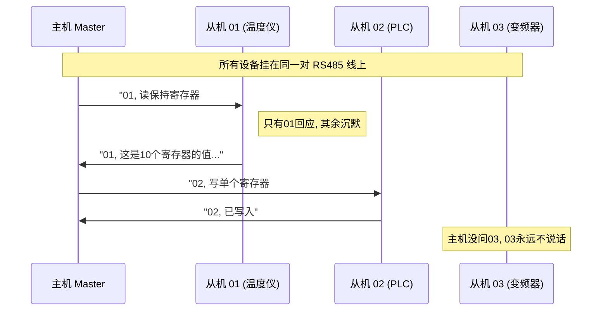
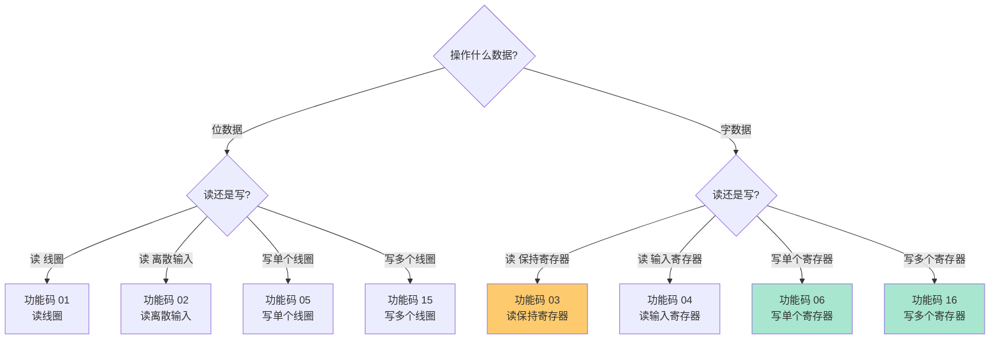
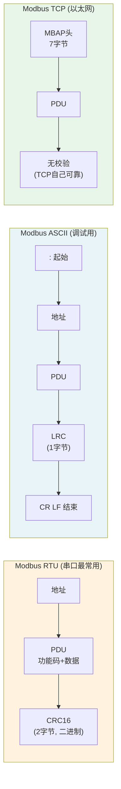
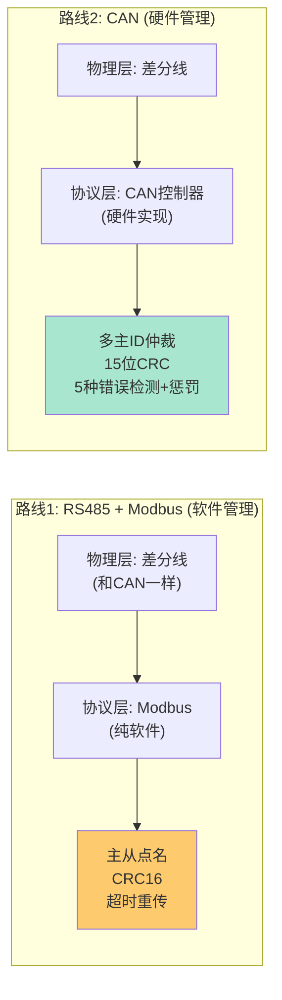
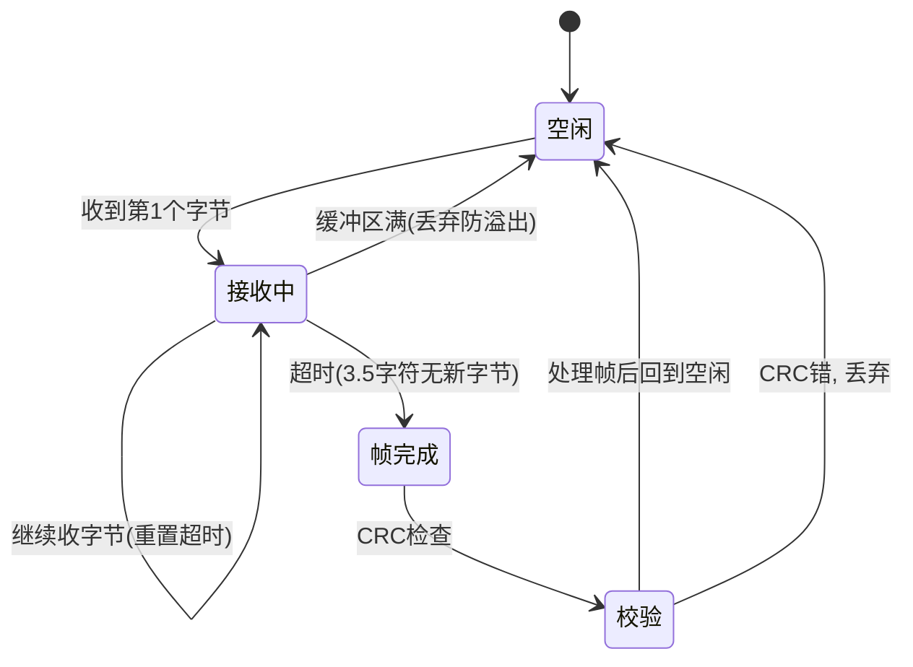
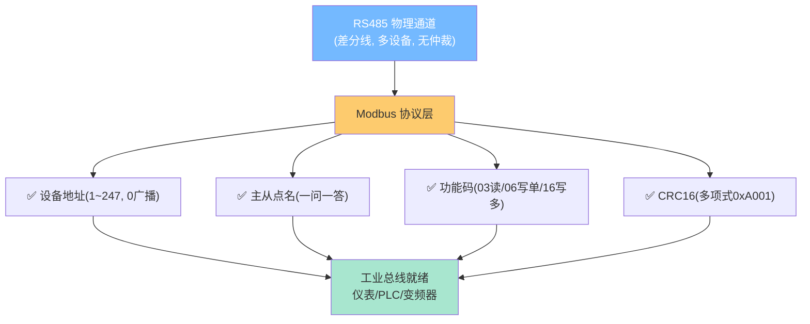

---
aliases:
  - Modbus
  - Modbus协议
  - Modbus RTU
  - Modbus ASCII
  - Modbus TCP
  - 主从协议
  - 功能码
  - PDU
  - ADU
  - 保持寄存器
  - 线圈
tags:
  - 嵌入式
  - 通信协议
  - Modbus
  - 协议层
  - 工业通信
related:
  - "[[../传输层/1. UART的基础理解]]"
  - "[[../传输层/4. CAN的基础理解]]"
  - "[[../传输层/通信总览]]"
  - "[[../校验层/CRC]]"
  - "[[TCP-IP 协议栈]]"
date: 2026-06-25
status: ✅已完成
---

# Modbus 协议

> [!abstract] 核心思想
> Modbus 是一个跑在 **RS485（或以太网）之上的应用层主从协议**，它把"只会发字节的裸 UART"武装成"能管几十台设备的工业总线"。
> 它解决的问题用一句话讲：**RS485 只给了物理通道（差分线、多设备挂线），但没说"谁发给谁、发的对不对、听谁的"**——Modbus 给这套通道补上了**地址、功能码、CRC 校验、主从仲裁**四件套。
> 换到分层视角：物理层（RS485 差分）+ 传输层（UART 字节）保持不变，Modbus 只是叠在最上面的"协议层"——所以同一套 Modbus 规则，底层换成以太网就是 Modbus TCP，规则不变。

---

## 1. Modbus 要解决什么：RS485 缺了什么

在 [[../传输层/1. UART的基础理解|UART 基础理解]] 里你学过：RS485 用差分信号解决了"远距离 + 多设备挂线"，但它**只通到字节层就停了**。几十个设备挂在同一对 A/B 线上，光有物理通道还不够——还缺四样东西。

### 1.1 RS485 的三个缺口

```
场景：1个主机 + 30台温度仪表，全挂在 RS485 总线上

缺口①：没有"地址"——主机喊一句"读温度"，30台全抢着回，总线瞬间打架
缺口②：没有"仲裁"——两台同时回，电平冲突，收到的全是乱码（RS485 无线与）
缺口③：校验太弱——UART 只有 1 位奇偶校验，工业噪声下根本不够用
```

> [!warning] RS485 没有硬件仲裁
> 这点要和 [[2. I2C的基础理解|I2C]]（线与仲裁）以及 [[../传输层/4. CAN的基础理解|CAN]]（显性/隐性仲裁）区分开。RS485 是"哑巴差分线"，谁都能拉，但谁也不让，冲突了硬件不会发现。所以**总线的"谁先说、说什么"必须靠软件协议来管**——这就是 Modbus 存在的理由。

### 1.2 Modbus 补上的四件套

Modbus 的整套设计，就是冲着补这四个缺口来的：

```mermaid
flowchart LR
    subgraph RS485的缺口
        G1["❌ 无地址"]
        G2["❌ 无仲裁"]
        G3["❌ 校验弱"]
    end
    subgraph Modbus的补全
        F1["✅ 设备地址<br/>1~247，主机点名"]
        F2["✅ 主从点名<br/>主机问从机答，避免冲突"]
        F3["✅ CRC16<br/>能查99.99%错误"]
        F4["✅ 超时重传<br/>没答就重问"]
    end
    G1 -.补.-> F1
    G2 -.补.-> F2
    G2 -.补.-> F4
    G3 -.补.-> F3
    style G1 fill:#ff6b6b,color:#fff
    style G2 fill:#ff6b6b,color:#fff
    style G3 fill:#ff6b6b,color:#fff
    style F1 fill:#a8e6cf,color:#333
    style F2 fill:#a8e6cf,color:#333
    style F3 fill:#a8e6cf,color:#333
    style F4 fill:#a8e6cf,color:#333
```



| 缺口 | Modbus 的解法 | 体现在报文哪里 |
|------|--------------|----------------|
| 无地址 | 每帧带**设备地址**（1~247），只有被点名的设备才回 | 报文第 1 字节 |
| 无仲裁 | **主从模型**：主机问 → 从机答，永远一问一答，绝不抢线 | 协议规则 |
| 校验弱 | 每帧尾加 **CRC16**（多项式 0xA001），检测能力远强于奇偶 | 报文最后 2 字节 |
| 无错误恢复 | 主机**超时重传**：规定时间内没收到答，就重发 | 协议规则 |

> [!tip] 一句话记住 Modbus 的本质
> **Modbus = RS485 物理通道 + 主从点名 + 地址 + 功能码 + CRC16**。前半句是"路"，后半句是"路规"。

---

## 2. 通信模型：主从点名 + 四种数据对象

### 2.1 主从架构：永远一问一答

Modbus 是**单主多从**：总线上只有 **1 个主机**（Master）和最多 **247 个从机**（Slave，地址 1~247）。通信永远由主机发起，**从机从不主动说话**。



> [!important] 为什么是主从而不是多主？
> 因为 RS485 **没有硬件仲裁**。如果有两个主机同时发，电平冲突没人管。Modbus 用"只有一个主机"这条铁规，从源头消灭冲突——**只要主机不疯，总线就不乱**。这和 [[../传输层/4. CAN的基础理解|CAN]] 的多主 ID 仲裁是两条完全不同的路（详见第 6 节）。

**主机的两种工作节奏**：
- **轮询（Polling）**：挨个问一遍 01、02、03……周而复始，工业现场最常见；
- **事件驱动**：需要时才问某个设备，比如操作员按下按钮才去读 PLC。

### 2.2 四种数据对象：Modbus 的"四种货架"

Modbus 把从机里的数据按"**位 vs 字**"和"**只读 vs 读写**"两个维度，分成了 **4 种对象**。这是理解功能码的钥匙——后面所有"读/写"命令，都是针对这 4 种货架之一。

```
            只读 (Input)              读写 (Coil/Holding)
          ┌──────────────────┬──────────────────────┐
  位(1bit)│ ① 离散输入 DI      │ ② 线圈 Coil            │
          │  功能码 02 读      │  功能码 01读/05写/15写   │
          │  例:开关状态       │  例:继电器输出          │
          ├──────────────────┼──────────────────────┤
字(16bit) │ ③ 输入寄存器 IR    │ ④ 保持寄存器 HR         │
          │  功能码 04 读      │  功能码 03读/06写/16写   │
          │  例:ADC采样值      │  例:设定值/参数         │
          └──────────────────┴──────────────────────┘
```

> [!note] "输入"=只读，因为它的数据来自外部
> "输入（Input）"类（离散输入、输入寄存器）之所以只读，是因为它们的值**由外部物理世界决定**——比如一个按钮的状态、一个温度传感器的采样值，这些不是你能"写"的。能写的是"输出"类——线圈（控制继电器）、保持寄存器（存设定值）。

### 2.3 四种对象的地址分区

每种对象在 Modbus 里有一个**独立的地址空间**，从 0 开始编号（注意：文档里常写成从 1 开始，但**报文里是 0 开始**，差 1，这是个坑）：

| 对象 | 类型 | 读写 | 地址范围（文档） | 报文偏移 | 典型用途 |
|------|------|------|------------------|----------|----------|
| **线圈** Coil | 位 | 读写 | 00001~09999 | 0 起 | 继电器、指示灯 |
| **离散输入** DI | 位 | 只读 | 10001~19999 | 0 起 | 按钮状态、限位开关 |
| **输入寄存器** IR | 16位 | 只读 | 30001~39999 | 0 起 | ADC 采样、传感器读数 |
| **保持寄存器** HR | 16位 | 读写 | 40001~49999 | 0 起 | 设定值、PID 参数、计数器 |

> [!warning] 文档地址 vs 报文地址（差 1 陷阱）
> 仪表手册写"读 40001"，意思是"**第 1 个**保持寄存器"。但在报文里你要填 `0x0000`（0 开始偏移）。记住口诀：**文档减一才是报文**。这是新手最容易踩的坑。

### 2.4 四种对象与功能码的对应

每个功能码就是"对某种对象做什么操作"：



> [!tip] 最高频的功能码只有三个
> 工业现场 **90% 的流量**是：**03**（读保持寄存器，读设定值/测量值）、**06**（写单个寄存器，改一个参数）、**16**（写多个寄存器，批量下参数）。把这三个吃透，Modbus 就会用了一大半。第 5 节会详细拆它们的报文。

---

## 3. 三种传输模式：RTU / ASCII / TCP

Modbus 的"规则"只有一套（主从 + 功能码 + 数据对象），但**这套规则可以被装进三种不同的"信封"**——这就是三种传输模式。理解它们的关键是一个分层概念：**ADU 与 PDU**。

### 3.1 PDU 与 ADU：Modbus 的灵魂分层

```
┌─────────────────────────────────────────────────┐
│  ADU (Application Data Unit)  应用数据单元        │
│  ┌────────┬──────────────────────────┬────────┐  │
│  │ 附加头  │      PDU                 │ 校验    │  │
│  │ 地址等  │  ┌──────┬─────────────┐ │        │  │
│  │        │  │功能码 │   数据       │ │        │  │
│  │        │  └──────┴─────────────┘ │        │  │
│  └────────┴──────────────────────────┴────────┘  │
└─────────────────────────────────────────────────┘
         ↑                                      ↑
     PDU = 协议内核(所有模式都一样)            信封(随模式变)
     ADU = 信封 + 内核
```

| 概念 | 全称 | 含义 | 是否随模式变 |
|------|------|------|--------------|
| **PDU** | Protocol Data Unit | 协议数据单元 = **功能码 + 数据** | **不变**（所有模式通用） |
| **ADU** | Application Data Unit | 应用数据单元 = **附加头 + PDU + 校验** | **随模式变** |

> [!important] 为什么 Modbus 能"换底层不变规则"？
> 因为**Modbus 的灵魂（PDU）和信封（ADU 外壳）是分开的**。换传输模式，只换 ADU 的附加头和校验，PDU 一动不动。这就是 [[../传输层/通信总览|通信总览]] 里那句"Modbus RTU（UART）换成 Modbus TCP（以太网）规则不变"的底层原因。

### 3.2 三种模式的 ADU 对比



### 3.3 三种模式全对比

| 维度 | **Modbus RTU** | Modbus ASCII | Modbus TCP |
|------|---------------|--------------|------------|
| **底层** | UART/RS485/RS232 | UART/RS485/RS232 | 以太网 / [[TCP-IP 协议栈\|TCP/IP]] |
| **数据表示** | 二进制（原始字节） | ASCII 字符（每个字节变 2 个 hex 字符） | 二进制 |
| **帧定界** | **3.5 字符静默时间** | `:` 起始 + `CR LF` 结束 | MBAP 头里含长度 |
| **校验** | **CRC16**（多项式 0xA001） | LRC（纵向冗余，弱） | **无**（靠 TCP 保证） |
| **效率** | 高（每字节原样传） | 低（数据量翻倍） | 高 |
| **典型端口** | 串口 | 串口 | TCP **502** |
| **使用率** | ⭐⭐⭐⭐⭐ 最常用 | ⭐ 偶尔调试用 | ⭐⭐⭐ 联网场景 |

> [!note] 为什么 RTU 最常用？
> ① **二进制高效**——不像 ASCII 把每字节拆成两个字符；② **CRC16 可靠**——远强于 ASCII 的 LRC；③ **跑在便宜的 RS485 上**——工业现场一根双绞线搞定。ASCII 模式当年是为了让 ASCII 终端能直接看报文，现在有上位机软件基本用不上了。Modbus TCP 则是现代联网需求（远程监控、PLC 联网）的产物。

> [!tip] 三种模式的本质：同一套 PDU，三种信封
> 不管 RTU/ASCII/TCP，**功能码和数据（PDU）完全一样**。比如"从机 01，读保持寄存器 0~9"，PDU 永远是 `03 00 00 00 0A`，只是 RTU 外面套地址+CRC、TCP 外面套 MBAP 头。**学透 PDU，三种模式通吃。**

### 3.4 Modbus TCP 的 MBAP 头

Modbus TCP 把 RTU 的"地址 + CRC"换成了一个 7 字节的 **MBAP 头**（Modbus Application Protocol header），因为 TCP 已经保证可靠，不需要 CRC；而设备地址改用 IP 来区分：

```
┌──────────────────────────────────────────────────┐
│ MBAP 头 (7字节)                                    │
│ ├─ 事务元标识 (2B): 配对请求与响应                  │
│ ├─ 协议标识   (2B): 固定 0000 (表示Modbus)          │
│ ├─ 长度       (2B): 后面 PDU 的字节数               │
│ └─ 单元标识   (1B):  从机地址(留给网关转串口用)      │
├──────────────────────────────────────────────────┤
│ PDU (功能码 + 数据)  ——和 RTU 完全一样              │
└──────────────────────────────────────────────────┘
```

> [!example] Modbus TCP vs RTU 的设备寻址
> RTU：靠报文第 1 字节"从机地址"找设备（因为多设备挂一条 RS485）。
> TCP：靠 **IP 地址**找设备（每台设备一个 IP），报文里的"单元标识"主要给**网关**用——网关收到 TCP 报文，剥掉 MBAP 头，把剩下的转成 RTU 发给 RS485 总线上的从机。这就是 Modbus TCP↔RTU 网关的原理。

---

## 4. RTU 报文格式（字节级）

RTU 是工业现场的主流模式，必须吃透它的字节布局。一帧 RTU 报文长这样：

### 4.1 帧结构总览

```
┌──────────┬──────────┬───────────────────────┬─────────────┐
│  从机地址 │  功能码   │       数据区           │   CRC16     │
│  1 字节   │  1 字节   │  长度随功能码变(N字节) │  2 字节     │
│  01~F7    │  01~7F    │  寄存器地址/数量/值... │  低字节在前  │
└──────────┴──────────┴───────────────────────┴─────────────┘
   ADU 附加头         PDU(功能码+数据)           ADU 校验
```

| 字段 | 字节 | 说明 |
|------|------|------|
| 从机地址 | 1 | 1~247（0x01~0xF7）；**0 是广播**，所有从机都听但不回 |
| 功能码 | 1 | 0x01~0x7F 正常；**≥0x80 表示异常响应**（最高位置 1） |
| 数据区 | N | 寄存器地址、数量、字节数、具体值——随功能码而变 |
| CRC16 | 2 | **低字节在前，高字节在后**（小端序，与多数协议相反） |

> [!warning] CRC 字节序：低字节在前（容易踩的坑）
> 多数协议（如网络序）是大端——高字节在前。但 **Modbus RTU 的 CRC16 是低字节在前（小端）**。新手算完 CRC 拼报文时很容易把两个字节写反，导致每次都被判错。记住：**Modbus 一切皆大端，唯独 CRC 是小端**。

### 4.2 关键机制：3.5 字符帧定界

RTU 是二进制流，没有起始/结束标志符（ASCII 模式有 `:` 和 `CR LF`）。那接收方怎么知道"一帧结束了"？答案是**时间静默**。

```
帧与帧之间靠"静默时间"分隔：

  字节 字节 字节 字节    [≥3.5字符的静默]     字节 字节...
  ┃    ┃    ┃    ┃                          ┃    ┃
  └────┴────┴────┴─── 一帧 RTU 报文 ─────────┴────┴─── 下一帧
                                          ↑
                                   这里被认定为"帧边界"
```

> [!important] 3.5 字符时间的含义
> "3.5 字符"指**传输 3.5 个字节所需的时间**（注意是字节，不是 bit）。在 9600bps 下，一个字节（11 bit = 起始+8数据+校验+停止）≈ 1.15ms，所以 3.5 字符 ≈ **4ms**。
> **规则**：如果接收完一个字节后，超过 3.5 字符时间没收到下一字节，就认为"这一帧结束"。这个静默间隔是 RTU 唯一的帧边界标志。

```
波特率      1字节时长      3.5字符静默阈值     工程常用值
 9600       ~1.15 ms         ~4 ms              定为 4ms
19200       ~0.57 ms         ~2 ms              定为 2ms
115200      ~0.096 ms        ~0.34 ms           统一规定≥1.75ms
```

> [!tip] 高波特率下的简化
> 规范规定：**波特率 > 19200 时，3.5 字符时间统一按 1.75ms 算**（因为按公式算会小到不切实际）。实际工程里，9600 用 4ms、115200 用 1.75~2ms 是常见配置。

> [!warning] 帧内字节间隔不能超过 1.5 字符
> 注意两个阈值：**帧之间**的静默 ≥3.5 字符（判定帧结束）；但**帧内**连续两个字节之间间隔 **不能超过 1.5 字符**，否则也判为帧错误（说明中途被打断）。这就是 RTU 解析状态机要管的事（第 7 节）。

### 4.3 广播地址 0

```
从机地址 = 0   → 广播：所有从机都执行，但都不回答
从机地址 = 1~247 → 点名：只有地址匹配的从机回响应
```

广播典型用途：**写命令**（功能码 05/06/15/16）——主机要"全员把继电器关掉"，用广播一次搞定，不用逐个点。**读命令绝不能广播**（否则所有从机同时回，总线冲突）。

---

## 5. 功能码详解 + 报文实例

这一节是 Modbus 的"实战核心"。我们把最高频的 **03/06/16** 逐字节拆解，再过一遍其他功能码和异常响应。

### 5.1 功能码 03：读保持寄存器（最常用）

**场景**：主机要读从机 01 的保持寄存器，从第 0 号开始读 10 个（即寄存器 40001~40010）。

```
┌──── 请求帧（主机发）─────────────────────────────┐
│  01   03   00 00   00 0A   C5 CD                  │
│  从机  功能  寄存器   寄存器    CRC16              │
│  地址  码    起始地址  数量      (低在前)            │
│        读HR   =0       =10                         │
└──────────────────────────────────────────────────┘

┌──── 正常响应帧（从机回）────────────────────────────┐
│  01   03   14   [20字节数据]   CRClo CRChi        │
│  从机  功能  字节  D0H D0L D1H D1L ... D9H D9L    │
│  地址  码    计数  =20  (10个寄存器×2字节)          │
└──────────────────────────────────────────────────┘
```

逐字节解读请求帧：

| 字节 | 值 | 含义 |
|------|-----|------|
| `01` | 从机地址 | 点名 1 号设备 |
| `03` | 功能码 | "读保持寄存器" |
| `00 00` | 起始地址 | 第 0 号寄存器（文档里是 40001） |
| `00 0A` | 寄存器数量 | 读 10 个（0x0A = 10） |
| `C5 CD` | CRC16 | 低字节 `C5` 在前 |

> [!note] 响应里的"字节计数"
> 响应帧第 3 字节 `14`（=20）是**数据区的字节数**。因为读了 10 个寄存器，每个 16 位 = 2 字节，共 20 字节 = 0x14。这个字段是变化的——读几个寄存器，它就等于"数量×2"。这是解析响应的关键：**先读字节计数，再按它收数据**。

### 5.2 功能码 06：写单个保持寄存器

**场景**：主机把从机 01 的第 5 号寄存器写成 100（0x0064）。

```
┌──── 请求帧 ────────────────────────┐
│  01   06   00 05   00 64   98 0A    │
│  从机  写HR  寄存器   写入值   CRC16 │
│        单个  地址=5   =100          │
└────────────────────────────────────┘

┌──── 响应帧（原样回显）─────────────────┐
│  01   06   00 05   00 64   98 0A    │
│  完全相同！从机把请求原封回传作为确认 │
└────────────────────────────────────┘
```

> [!tip] 写命令的响应就是"原样回显"
> 功能码 05/06（写单个）的响应帧**和请求帧完全相同**——从机把主机发的数据原样返回，等于说"我收到了，就按这个执行"。这是最简单的确认机制。对比 16（写多个）响应会精简。

### 5.3 功能码 16：写多个保持寄存器

**场景**：主机往从机 01 的第 0、1 号寄存器分别写 0x0A0B、0x0C0D。

```
┌──── 请求帧 ────────────────────────────────────────┐
│ 01  10  00 00  00 02  04  0A 0B  0C 0D  72 F9       │
│ 从机 写多 起始  寄存器 字节  寄存器0  寄存器1 CRC     │
│      HR  地址=0 数量=2 计数=4 值      值             │
└────────────────────────────────────────────────────┘

┌──── 响应帧（精简确认）─────────────────────┐
│ 01  10  00 00  00 02  41 C8               │
│ 从机 写多 起始   数量    CRC              │
│      HR  地址=0 =2                        │
└──────────────────────────────────────────┘
```

| 字段（请求） | 值 | 含义 |
|------|-----|------|
| `00 00` | 起始地址 | 第 0 号寄存器 |
| `00 02` | 寄存器数量 | 写 2 个 |
| `04` | 字节计数 | 数据区 4 字节（2 寄存器 × 2） |
| `0A 0B` | 第 1 个值 | 写入寄存器 0 |
| `0C 0D` | 第 2 个值 | 写入寄存器 1 |

> [!note] 为什么 16 的响应不带数据？
> 响应只需回"起始地址 + 数量"确认写哪了、写了几个，不重复回数据（省字节）。和 06 的"全回显"相比，16 因为数据多，全回显太浪费，所以精简。

### 5.4 其他常用功能码速览

| 功能码 | 操作 | 对象 | 备注 |
|--------|------|------|------|
| 01 | 读多个线圈 | 线圈（位） | 类似 03 但每位一个线圈 |
| 02 | 读离散输入 | 离散输入（位） | 只读版的 01 |
| 03 | 读保持寄存器 | HR（字） | ⭐ 最常用 |
| 04 | 读输入寄存器 | IR（字） | 只读版的 03 |
| 05 | 写单个线圈 | 线圈 | `FF00`=ON，`0000`=OFF |
| 06 | 写单个寄存器 | HR | ⭐ 原样回显 |
| 15 | 写多个线圈 | 线圈 | 类似 16 但针对位 |
| 16 | 写多个寄存器 | HR | ⭐ 批量写 |

> [!tip] 功能码分组规律
> 看**个位数**就知道操作类型：**1/2** = 读位、**3/4** = 读字、**5/6** = 写单个、**15/16** = 写多个。**奇数针对位（线圈/离散），偶数针对字（寄存器）**。记住这个规律，功能码表不用死背。

### 5.5 异常响应：功能码 + 0x80

当从机无法执行请求（地址越界、功能码不支持、值非法），它不沉默，而是回一个**异常响应**，标志是**功能码最高位置 1**（即原功能码 + 0x80），并跟一个**异常码**。

```
正常响应:  01  03  [数据]  CRC
异常响应:  01  83  02      CRC      ← 功能码 03→83，异常码=02
                ↑   ↑
            0x80置1  非法数据地址
```

| 异常码 | 含义 | 典型原因 |
|--------|------|----------|
| 01 | 非法功能码 | 设备不支持这个功能码 |
| 02 | 非法数据地址 | 寄存器地址超出范围（最常见，文档地址没减1） |
| 03 | 非法数据值 | 数值超范围（如写温度设定到 9999） |
| 04 | 从机故障 | 设备内部出错 |
| 05 | 确认 | 操作耗时长，先回个"稍等" |
| 06 | 从机忙 | 设备正在处理上一个请求 |

> [!warning] 怎么判断是正常还是异常响应？
> **看功能码最高位**：响应功能码 < 0x80 = 正常；≥ 0x80（即原码+0x80）= 异常。解析代码第一步就该判断这个，分支处理。异常码 02（非法地址）是新手最常遇到的——几乎都是"文档地址没减 1"惹的祸。

---

## 6. Modbus vs CAN：软件管理 vs 硬件管理

[[../传输层/4. CAN的基础理解|CAN 基础理解]] 开篇就讲："CAN 解决的核心问题是 RS485 + Modbus 不够可靠、不够实时"。这一节我们把两者摆在一起，看清 Modbus 用**软件**做到的事，CAN 用**硬件**做得更好。

### 6.1 两条路线的本质差异



### 6.2 全面对比

| 维度 | RS485 + Modbus | CAN |
|------|---------------|-----|
| **物理层** | 差分线（与 CAN 同源） | 差分线（显性/隐性） |
| **仲裁** | ❌ 无（靠主从软件避免） | ✅ **硬件 ID 仲裁**（线与） |
| **多主** | ❌ 单主 | ✅ **多主** |
| **校验** | CRC16（软件算） | 15 位 CRC（硬件算） |
| **错误检测** | 仅 CRC16 | **5 种**（位错误/格式/填充/CRC/ACK） |
| **错误处理** | 主机超时重传 | **三级惩罚**（错误计数→禁言→离线） |
| **优先级** | ❌ 无（先问谁谁优先） | ✅ **ID 越小优先级越高** |
| **实时性** | 取决于轮询周期 | 高优先级帧可抢占 |
| **成本** | 极低（一片 MAX485） | 中（需 CAN 控制器+收发器） |
| **典型场景** | 仪表/PLC/能源监控 | 汽车/工业控制/医疗 |

### 6.3 演进视角：从 Modbus 到 CAN


> [!important] 一句话理解两者的关系
> **Modbus 是"用软件在哑巴差分线上搭出的协议"，CAN 是"把协议规则烧进硬件的差分总线"**。Modbus 能做到的（寻址、校验、错误处理），CAN 不仅做到了，还做到了硬件级、多主、带优先级。代价是 CAN 控制器更贵更复杂。所以：**省钱选 Modbus，要命（可靠性）选 CAN**。

> [!example]- 为什么 Modbus 至今没被 CAN 淘汰？
> ① **便宜**——一片 MAX485 几毛钱，所有 MCU 都有 UART，但不是所有 MCU 都有 CAN；② **简单**——Modbus 就是字节流加个协议，CAN 要配位时序、滤波器，门槛高；③ **生态**——几十年积累，几乎所有工业仪表、PLC、变频器都原生支持 Modbus RTU；④ **够用**——很多场景（能源监控、楼宇自控）轮询几百毫秒一次就够，不需要 CAN 的实时性。所以 Modbus 在"对实时性要求不高、设备多、要省钱"的工业现场依然主力。

---

## 7. 工程实践：CRC16、解析状态机与开源栈

理解协议只是第一步，真正写驱动要落到代码。这一节给三块实战：CRC16/Modbus 的实现、RTU 帧解析状态机、开源栈选型。

### 7.1 CRC16/Modbus 实现

[[../校验层/CRC|CRC 笔记]] 里讲的是 CRC-32（多项式 0xEDB88320），但 **Modbus 用的是 CRC-16/Modbus**——多项式 `0xA001`（反向），初始值 `0xFFFF`，输入输出都反转。两者算法一样，参数不同。

**查表法（工程首选）**：

```c
/* CRC-16/Modbus 预计算表（多项式 0xA001，256 项） */
static const uint16_t crc16_table[256] = {
    0x0000, 0xC0C1, 0xC181, 0x0140, 0xC301, 0x03C0, 0x0280, 0xC241,
    0xC601, 0x06C0, 0x0780, 0xC741, 0x0500, 0xC5C1, 0xC481, 0x0140,
    /* ... 共 256 项，可由下方函数生成，或查 Modbus 标准表 ... */
};

uint16_t CRC16_Modbus(const uint8_t *data, uint16_t len)
{
    uint16_t crc = 0xFFFF;              /* 初始值 */
    while (len--) {
        crc = (crc >> 8) ^ crc16_table[(crc ^ *data++) & 0xFF];
    }
    return crc;                          /* 注意：低字节先发 */
}

/* 拼报文时，低字节在前 */
uint16_t crc = CRC16_Modbus(frame, frame_len);
frame[frame_len]     = crc & 0xFF;       /* 低字节 */
frame[frame_len + 1] = (crc >> 8) & 0xFF;/* 高字节 */
```

**按位计算（省 ROM，慢，用于理解/资源受限）**：

```c
uint16_t CRC16_Modbus_Bitwise(const uint8_t *data, uint16_t len)
{
    uint16_t crc = 0xFFFF;
    while (len--) {
        crc ^= *data++;
        for (int i = 0; i < 8; i++) {
            if (crc & 1) {
                crc = (crc >> 1) ^ 0xA001;   /* 多项式 0xA001 */
            } else {
                crc >>= 1;
            }
        }
    }
    return crc;
}
```

> [!tip] 生成 CRC 表的技巧
> 表不用手抄——初始化时用按位算法生成 256 项存 RAM，或用脚本预生成烧进 Flash。两种方式本质一样，查表只是把按位的 8 次循环预存了。

### 7.2 RTU 接收解析状态机

RTU 没有帧标志符，靠"3.5 字符静默"判断帧边界。实现要点：**UART 每收到一个字节进中断，重置一个超时定时器；定时器到期（≥3.5 字符没新字节）就触发"帧完成"**。



**典型实现框架**：

```c
#define MB_BUF_SIZE 256
static uint8_t  rx_buf[MB_BUF_SIZE];
static uint16_t rx_len = 0;
static volatile bool frame_ready = false;

/* UART 接收中断：每来一个字节调一次 */
void UART_RxISR(uint8_t byte)
{
    if (rx_len < MB_BUF_SIZE) {
        rx_buf[rx_len++] = byte;        /* 存字节 */
    }
    restart_timer_35();                 /* 重置 3.5 字符超时定时器 */
}

/* 超时回调：3.5 字符内没新字节 → 一帧完成 */
void Timer35_Callback(void)
{
    if (rx_len >= 4) {                  /* 最短帧: 地址+功能码+CRC = 4字节 */
        frame_ready = true;             /* 通知主循环处理 */
    } else {
        rx_len = 0;                     /* 太短，丢弃 */
    }
}

/* 主循环里处理完整帧 */
void Modbus_Poll(void)
{
    if (!frame_ready) return;

    /* 1. 校验 CRC（去掉最后 2 字节 CRC） */
    uint16_t calc = CRC16_Modbus(rx_buf, rx_len - 2);
    uint16_t recv = rx_buf[rx_len-2] | (rx_buf[rx_len-1] << 8);
    if (calc != recv) { rx_len = 0; frame_ready = false; return; }

    /* 2. 检查从机地址 */
    if (rx_buf[0] != MY_ADDR && rx_buf[0] != 0) {
        rx_len = 0; frame_ready = false; return;
    }

    /* 3. 解析功能码，分发处理 */
    uint8_t func = rx_buf[1];
    if (func & 0x80) { /* 异常响应处理 */ }
    switch (func) {
        case 0x03: Handle_ReadHR(rx_buf, rx_len);  break;
        case 0x06: Handle_WriteSingle(rx_buf);     break;
        case 0x10: Handle_WriteMulti(rx_buf);      break;
        /* ... */
    }
    rx_len = 0;
    frame_ready = false;
}
```

> [!important] 状态机的三个关键点
> ① **字节中断只管存+重置定时器**——不在中断里解析（耗时操作），只做最快的事；② **3.5 字符超时是唯一的帧边界**——定时器到期才认为帧完整；③ **CRC 校验通过才处理**——否则直接丢弃，防止噪声假帧。

### 7.3 超时与重传策略

主机发出请求后要等响应，但设备可能没接好、地址错、CRC 错。主机必须设**响应超时**：

| 参数 | 典型值 | 说明 |
|------|--------|------|
| 响应超时 | 500~1000ms | 超过就判定从机无响应 |
| 重试次数 | 3 次 | 连续失败几次才报"设备离线" |
| 轮询间隔 | 50~200ms | 两次请求之间的最小间隔 |

> [!warning] 超时时间不能太短
> 有些仪表（如电能表）处理一次读请求要 100~300ms。超时设太短会误判为"无响应"。工程上**先用示波器/抓包工具测真实响应时间**，超时设为"最大响应时间的 1.5~2 倍"。

### 7.4 开源栈选型

自己写 Modbus 栈不难，但成熟的开源栈省时省力、经过实战验证：

| 开源栈 | 语言 | 主从 | 适用 | 特点 |
|--------|------|------|------|------|
| **FreeModbus** | C | 从机为主，主机需扩展 | MCU/嵌入式 | ⭐ 嵌入式首选，移植简单，RTU/ASCII/TCP 全支持 |
| **libmodbus** | C | 主从都支持 | Linux/PC/网关 | ⭐ PC 端首选，Modbus TCP 强，做上位机/网关用 |
| **EasyModbus** | C#/Java | 主机 | PC 上位机 | 写 Windows 上位机软件用 |

```mermaid
flowchart TD
    Q{"你的角色?"}
    Q -->|"MCU 做从机(被读)" --> F["FreeModbus<br/>(嵌入式首选)"]
    Q -->|"MCU 做主机(轮询)" --> F2["FreeModbus + 主机扩展<br/>或自己写状态机"]
    Q -->|"PC/Linux 做主机/网关" --> L["libmodbus<br/>(Modbus TCP 强)"]
    Q -->|"Windows 上位机" --> E["EasyModbus / NModbus"]
    style F fill:#a8e6cf,color:#333
    style L fill:#a8e6cf,color:#333
```

> [!tip] FreeModbus 移植要点
> FreeModbus 是为"MCU 做从机"设计的（仪表、PLC 角色最常见）。移植只需实现三个接口：① **串口收发**（对接 UART 驱动）；② **定时器**（3.5 字符超时）；③ **临界区保护**（开关中断）。协议解析、CRC、寄存器管理它全包了。做主机需要打 patch 或自己扩展轮询逻辑。

---

## 8. 一页总结：Modbus 全貌



**三句话讲透 Modbus**：

1. **问题**：RS485 只给了物理通道，没说"谁发给谁、发的对不对"；
2. **办法**：Modbus 叠在 RS485 上面，用"地址 + 主从点名 + 功能码 + CRC16"四件套补全；
3. **精髓**：PDU（功能码+数据）与 ADU（信封）分离——同一套规则，串口是 RTU，网线是 TCP，规则不变。

> [!abstract] 速查口诀
> **裸线无规，Modbus 来管；地址点名，主问从答；功码指活，CRC 兜底；PDU 不变，信封随变。**
> - 裸线无规 = RS485 没有协议规则
> - 地址点名 = 设备地址 + 主从轮询
> - 功码指活 = 功能码指定"做什么"
> - CRC 兜底 = CRC16 保证数据正确
> - PDU 不变 = 三种模式共用同一套 PDU
> - 信封随变 = RTU/ASCII/TCP 只是不同的 ADU 外壳

> [!example]- 决策树：什么时候用 Modbus？
> ```
> 你的场景是？
> ├─ 板内通信(传感器/Flash) → 用 SPI/I2C，不需要 Modbus
> ├─ 远距离多设备工业现场
> │   ├─ 实时性要求高/汽车级 → 用 CAN（硬件仲裁+5种检测）
> │   └─ 仪表/PLC/能效监控(省钱够用) → 用 RS485 + Modbus RTU ⭐
> └─ 需要联网/远程监控 → Modbus TCP（以太网）或 网关转 RTU
> ```

---

## 继续阅读

- [[../传输层/1. UART的基础理解]] — Modbus RTU 的载体：RS485 差分信号、UART 字节帧，Modbus 就是叠在它上面的协议层
- [[../传输层/4. CAN的基础理解]] — Modbus 的"进化方向"：CAN 用硬件把 Modbus 用软件做的事全做了，还加了多主和优先级
- [[../传输层/通信总览]] — 通信协议总览与选型：分层思想、物理层演进、SPI/I2C/UART/CAN 全景对比
- [[../校验层/CRC]] — Modbus CRC16 的数学原理：GF(2) 域、查表法、按位法（Modbus 用 CRC-16/0xA001，笔记讲的是 CRC-32，算法相通）
- [[TCP-IP 协议栈]] — Modbus TCP 的底层：同一套 Modbus 规则，底层从串口换成以太网协议栈

---

## 面试高频问题

> [!example]- Q1：Modbus 是什么？它在通信分层里属于哪一层？
> Modbus 是一个**应用层主从协议**，跑在 RS485（串口）或以太网之上。在分层模型里它属于**协议层/应用层**——底下是传输层（UART）和物理层（RS485 差分线），Modbus 叠在最上面，用"地址+功能码+CRC16+主从点名"把裸 RS485 武装成工业总线。同一套规则，串口叫 Modbus RTU，网线叫 Modbus TCP，因为它的 PDU（功能码+数据）与 ADU（信封）是分离的，换底层只换信封。

> [!example]- Q2：为什么 Modbus 是主从而不是多主？
> 因为它底层的 RS485 **没有硬件仲裁**——如果两个设备同时发，电平冲突，硬件不会发现，收到的全是乱码。Modbus 用"只有一个主机"这条铁规从源头消灭冲突：主机问从机答，从机绝不主动说话，一问一答，总线永远只有一个方向在传。对比 CAN 有硬件 ID 仲裁，能支持多主；Modbus 想要多主就得靠软件令牌环之类的复杂方案，失去了简单性。

> [!example]- Q3：RTU 模式怎么判断一帧结束？什么是 3.5 字符时间？
> RTU 是二进制流，没有起始/结束标志符，靠**时间静默**判断帧边界。规则是：收完一个字节后，如果超过 **3.5 个字符的传输时间**没收到下一字节，就认为帧结束。一个字符指一个完整字节（11 bit = 起始+8数据+校验+停止），9600bps 下约 1.15ms，所以 3.5 字符 ≈ 4ms。工程上 9600 用 4ms、115200 统一按 1.75ms。另外帧内字节间隔不能超过 1.5 字符，否则判帧错误。实现上用"每字节中断重置定时器，定时器到期触发帧完成"。

> [!example]- Q4：Modbus CRC16 为什么低字节在前？容易踩什么坑？
> Modbus 一切数据都是大端（高字节在前），唯独 CRC16 是小端（低字节在前）。这是规范规定的，历史原因。坑在于：算完 CRC 拼报文时，如果按大端习惯把高字节放前面，接收方校验必然失败。记住口诀：**Modbus 一切皆大端，唯独 CRC 是小端**。另一个坑是文档地址和报文地址差 1——手册写"40001"指第一个寄存器，报文里要填 0x0000（0 开始）。

> [!example]- Q5：Modbus 和 CAN 有什么区别？为什么 Modbus 没被 CAN 淘汰？
> Modbus 是"软件在哑巴差分线上搭的协议"，CAN 是"把协议规则烧进硬件的总线"。CAN 比 Modbus 强在：硬件 ID 仲裁（多主）、5 种错误检测、三级错误惩罚、优先级可设计。但 Modbus 至今主力因为：① 便宜（MAX485 几毛钱，不是所有 MCU 有 CAN）；② 简单（字节流加协议 vs 配位时序滤波器）；③ 生态（所有工业仪表原生支持）；④ 够用（能源监控等场景轮询几百毫秒一次足够）。一句话：**省钱选 Modbus，要可靠选 CAN**。

> [!example]- Q6：功能码 03、06、16 的报文有什么区别？怎么判断异常响应？
> **03**（读保持寄存器）：请求是"地址+功能码+起始地址+数量+CRC"，响应多了个"字节计数"再跟数据。**06**（写单个寄存器）：请求和响应**完全相同**（原样回显确认）。**16**（写多个寄存器）：请求含"起始地址+数量+字节计数+数据"，响应精简为"起始地址+数量"不回数据。判断异常响应看功能码最高位：正常功能码 < 0x80，异常是原码 + 0x80（如 03 异常变 83），后跟异常码（02 最常见=地址非法，通常是文档地址没减 1）。

---

> **知识脉络**：Modbus 向上接 [[../传输层/通信总览|通信总览]] 的分层思想，向下扎根于 [[../传输层/1. UART的基础理解|UART/RS485]]，横向对比 [[../传输层/4. CAN的基础理解|CAN]] 的硬件路线，校验用到 [[../校验层/CRC|CRC]]。它串起了整个通信层"物理→传输→协议"的纵向认知。
