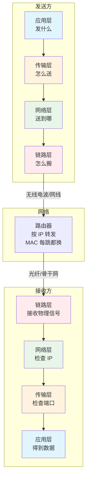
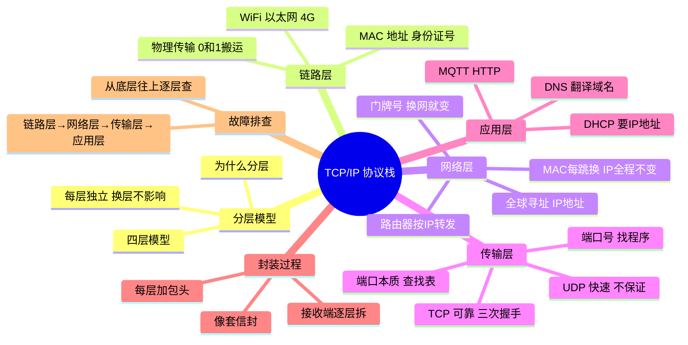

---
aliases:
  - TCP IP 协议栈
  - 网络协议栈
  - TCP/IP 分层模型
  - TCP IP 四层模型
tags:
  - 嵌入式
  - 通信
  - 协议层
  - TCP/IP
  - 网络协议
date: 2026-05-23
status: evergreen
related:
  - "[[../传输层/通信总览]]"
  - "[[LwIP 网络协议栈]]"
  - "[[../../../物联网/IOT应用/MQTT协议]]"
  - "[[../../../物联网/IOT应用/WIFI]]"
  - "[[../../芯片/开发板/ESP32-D0WDQ6]]"
---

> [!abstract] 核心摘要
> TCP/IP 把网络通信分成四层：**链路层（物理传输）→ 网络层（IP 寻址）→ 传输层（TCP/UDP 送达保证）→ 应用层（产生数据）**。每层独立工作，换一层不影响其他层。ESP32 发一条 MQTT 消息到云平台，数据要经过四层封装——每层加自己的"包头"，像套信封一样层层包裹。理解四层模型和封装过程，是从"会用 WiFi"到"理解网络通信"的关键跃迁。

---

## 1. 为什么要分层

### 1.1 寄快递的类比

你寄一个快递，不是一个人从头干到尾，而是每个环节有专人负责：

```
你（打包）→ 快递员（取件）→ 转运中心（分拣）→ 卡车（运输）→ 派件（送达）

换一个环节，不影响其他环节：
  换快递公司（顺丰改圆通）→ 你打包的方式不用变
  换运输方式（卡车改飞机）→ 快递单上的地址不用变
```

**网络通信也是一样——发一条微信，数据经过 WiFi、路由器、运营商网络、云平台，每个环节由专门的协议负责。**

### 1.2 分层的核心价值

```
换应用层 → 底下不用改（微信换 QQ，网络还是那个网络）
换传输方式 → 上面不用改（WiFi 换 4G，微信还是那个微信）
换物理介质 → 上面不用改（WiFi 换以太网，TCP/IP 还是一样跑）
```

> [!important] 每层独立工作，换一层不影响其他层。这就是分层的核心价值。

### 1.3 和已有知识的连接

> [!tip] 你在 [[../传输层/通信总览|通信总览]] 里学的 SPI、I2C、UART、CAN 都是**链路层**的东西——它们负责物理上把 0 和 1 从 A 搬到 B。但它们找不到"地球另一端的设备"。TCP/IP 在链路层之上，加了网络层（IP 全球寻址）和传输层（TCP 可靠送达），让数据能到达全球任何地方。

---

## 2. 四层模型总览



| 层 | 解决什么问题 | 一句话 | 协议举例 |
|------|------------|--------|---------|
| **应用层** | 产生要发送的数据 | "发什么" | MQTT、HTTP、DNS、DHCP |
| **传输层** | 保证数据完整送达 + 区分程序 | "怎么送" | TCP（可靠）、UDP（快速） |
| **网络层** | 全球寻址，找到目标设备 | "送到哪" | IP |
| **链路层** | 物理传输，0 和 1 的搬运 | "怎么搬" | WiFi、以太网、4G、SPI、I2C |

---

## 3. 链路层——MAC 地址

### 3.1 身份证号 vs 门牌号

你的 ESP32 连上 WiFi 后有两个地址：

| 地址 | 类比 | 特点 |
|------|------|------|
| **MAC 地址** `30:AE:A4:xx:xx:xx` | 身份证号 | 出厂烧死在芯片里，永远不变 |
| **IP 地址** `192.168.1.100` | 门牌号 | 换了路由器就变 |

### 3.2 为什么需要两个地址

> [!question] MAC 地址已经能唯一标识设备了，为什么还需要 IP 地址？

```
MAC 地址没有"地理位置"信息：
  30:AE:A4:12:34:56 → 只是一串随机编号
  路由器完全不知道这个设备在哪里

IP 地址有层次结构：
  47.102.33.50
  → 47.102 代表某个网络区域（比如阿里云华南机房）
  → 路由器一看前半部分就知道"往华南方向转发"
```

**两个地址各有分工：**

| 地址 | 解决什么问题 | 类比 |
|------|------------|------|
| **IP 地址** | 全球寻址——找到目标在哪个网络 | 快递单上的收件地址（省-市-区-街道） |
| **MAC 地址** | 本地传输——在同一网络内找到具体设备 | 这条街上具体哪栋楼哪个门 |

---

## 4. 网络层——IP 地址

### 4.1 IP 地址的分配（DHCP）

设备连上路由器后，IP 地址不是自己随便填的，是路由器通过 **DHCP** 分配的：

```
ESP32 → 路由器："我刚连上，请给我一个 IP 地址"（DHCP Discover）
路由器 → ESP32："给你 192.168.1.100"（DHCP Offer）
ESP32 → 路由器："好的，我用这个"（DHCP Request）
路由器 → ESP32："确认，租期 24 小时"（DHCP ACK）
```

> [!tip] 这就是你在 [[../../../物联网/IOT应用/WIFI|WiFi 篇]] 里收到 `IP_EVENT_STA_GOT_IP` 事件前发生的事。`esp_netif` 自动帮你完成了整个 DHCP 过程。

### 4.2 域名翻译（DNS）

你通常写域名（`mqtt.example.com`）而不是 IP 地址。**DNS 把域名翻译成 IP 地址：**

```
ESP32 → DNS 服务器："mqtt.example.com 的 IP 是多少？"
DNS 服务器 → ESP32："47.102.33.50"
ESP32 用 47.102.33.50 建立连接
```

### 4.3 IP 地址全程不变

```
你的 ESP32 发消息到云平台：

第1跳：ESP32 → 家里路由器
  IP：192.168.1.100 → 47.102.33.50（不变）
  链路层：WiFi 射频

第2跳：路由器 → 运营商
  IP：192.168.1.100 → 47.102.33.50（还是不变）
  链路层：光纤（换了！）

第3跳：运营商 → 云平台
  IP：192.168.1.100 → 47.102.33.50（还是不变）
  链路层：骨干网（又换了！）
```

> [!important] IP 地址全程不变（端到端），MAC 地址每跳都换（点到点）。就像快递单上的收件地址从头到尾没改过，但包裹换了卡车、换了飞机、换了快递员。

---

## 5. 传输层——TCP/UDP + 端口

### 5.1 TCP vs UDP

| | TCP | UDP |
|--|-----|-----|
| 类比 | 寄快递要签收确认 | 往信箱里塞传单 |
| 保证送达 | 是，丢了重发 | 否，发了就不管 |
| 建连接 | 三次握手 | 不需要 |
| 速度 | 慢（要确认、要重传） | 快（没有额外开销） |
| 适合 | 微信消息、MQTT、HTTP | 直播、DNS 查询、视频通话 |

### 5.2 TCP 三次握手

TCP 发数据之前必须先"建立连接"——双方确认"我能听到你、你也能听到我"：

```
ESP32                          云平台
  │                              │
  │── 第1次：你好，我想连你 ──────→│  SYN
  │                              │
  │←─ 第2次：好的，我收到了 ──────│  SYN+ACK
  │                              │
  │── 第3次：好的，确认你的确认 ─→│  ACK
  │                              │
  │════════ 开始发数据 ══════════│
```

> [!question] 为什么需要三次？两次不够吗？
> 你听到对方说"喂"，但对方不知道你听到了。你还得回应"喂，是我"，这样双方都确认了互相能听到。两次只能确认一个方向，第三次确认另一个方向。

### 5.3 端口号——找到设备上的哪个程序

**端口的本质就是一个数字（0~65535），是传输层用来区分"同一个 IP 上的不同程序"的标识。**

```
一栋楼（ESP32，一个 IP）
  ├── 1号房（端口 1883）→ MQTT 程序
  ├── 2号房（端口 80）  → HTTP 程序
  ├── 3号房（端口 53）  → DNS 程序
  └── 4号房（端口 54321）→ 传感器任务

数据包到了 ESP32
  → IP 地址找到这栋楼 ✓
  → 端口号找到楼里的哪个人 ✓
```

**端口在代码层面是什么？** 不是硬件，不是寄存器，就是操作系统（或 LwIP）内部维护的一张查找表：

```
LwIP 内部的端口监听表：

  端口号    →    谁在监听（回调函数/消息队列）
  ─────────────────────────────────
  1883      →    mqtt_task 的接收队列
  80        →    http_server 的接收队列
  53        →    dns_handler 的回调函数
```

**常见端口号：**

| 端口 | 协议 | 说明 |
|------|------|------|
| 80 | HTTP | 网页 |
| 443 | HTTPS | 加密网页 |
| 1883 | MQTT | IoT 消息 |
| 8883 | MQTTS | 加密 IoT 消息 |
| 53 | DNS | 域名查询 |
| 67/68 | DHCP | IP 地址分配 |

---

## 6. 应用层——DHCP / DNS

DHCP 和 DNS 都属于**应用层**，因为它们和 MQTT、HTTP 一样，是运行在传输层之上的具体"应用"：

| 协议 | 做什么 | 运行在 | 端口 |
|------|--------|--------|------|
| **DHCP** | 自动分配 IP 地址 | UDP 之上 | 67/68 |
| **DNS** | 把域名翻译成 IP 地址 | UDP/TCP 之上 | 53 |
| **MQTT** | IoT 消息通信 | TCP 之上 | 1883 |
| **HTTP** | 网页请求 | TCP 之上 | 80 |

> [!tip] 判断标准：传输层（TCP/UDP）之上、有具体应用目的的协议，都是应用层。DHCP 操作 IP 地址但它本身是应用层协议，就像邮局工作人员帮你查地址——他在帮你查地址，但他不是地址本身。

---

## 7. 封装过程

### 7.1 从 MQTT 消息到 WiFi 射频

```
应用层产生数据：
  "temperature=25.3"

  ↓ 传输层加 TCP 头
  ┌────────────────────────────────────────────────┐
  │ TCP头：源端口=54321  目标端口=1883              │
  │ 序列号、校验和                                  │
  │                                  temperature=25.3│
  └────────────────────────────────────────────────┘

  ↓ 网络层加 IP 头
  ┌─────────────────────────────────────────────────────────┐
  │ IP头：源IP=192.168.1.100  目标IP=47.102.33.50            │
  │                                    TCP头  temperature=25.3│
  └─────────────────────────────────────────────────────────┘

  ↓ 链路层加 MAC 头
  ┌──────────────────────────────────────────────────────────────────┐
  │ WiFi帧头：源MAC=30:AE:A4:xx:xx  目标MAC=路由器MAC                │
  │                                          IP头  TCP头  数据        │
  └──────────────────────────────────────────────────────────────────┘

  ↓ 通过 WiFi 射频发送出去（变成无线电波）
```

### 7.2 接收端的解封装

```
云平台收到数据后，从下到上拆：

WiFi 驱动收到无线电波
  → 拆 MAC 头：是给我的吗？✓
  → 拆 IP 头：目标 IP 是我吗？✓
  → 拆 TCP 头：端口号 1883 → 交给 MQTT 程序
  → 得到 "temperature=25.3"
```

### 7.3 封装规律

```
每层只加自己的标签，不关心其他层的内容：
  链路层：只知道 MAC 地址，不知道里面装的是 TCP 还是 UDP
  网络层：只知道 IP 地址，不知道里面装的是 MQTT 还是 HTTP
  传输层：只知道端口号，不知道里面装的是温度数据还是湿度数据
  应用层：只知道业务数据，不知道底下用的是什么网络

就像快递：
  打包的人不关心用卡车还是飞机
  开卡车的人不关心箱子里装的是什么
```

---

## 8. 故障分层排查

**网络故障永远从底层开始排查：**

```
第1步：链路层通了吗？    → WiFi 连上了吗？
第2步：网络层通了吗？    → IP 拿到了吗？（DHCP 成功了吗？）
第3步：传输层通了吗？    → TCP 连上了吗？（三次握手成功了吗？）
第4步：应用层通了吗？    → MQTT 发消息有回应吗？

任何一层不通，上面的层一定不通
就像快递：卡车坏了（链路层）→ 地址再对（网络层）也送不到
```

### 故障现象对照表

| 故障现象 | 属于哪层 | 排查方向 |
|---------|---------|---------|
| WiFi 断了，`WIFI_EVENT_STA_DISCONNECTED` | **链路层** | 检查 SSID、密码、信号强度 |
| 连上 WiFi 但拿不到 IP（DHCP 超时） | **网络层** | 检查 `esp_netif` 初始化、路由器 DHCP 服务 |
| DNS 查询失败，域名翻译不了 IP | **应用层** | 检查 DNS 服务器配置、网络是否通 |
| TCP 三次握手超时，连不上云平台 | **传输层** | 检查目标 IP 是否正确、端口是否开放、防火墙 |
| MQTT 连上了但发消息没回应 | **应用层** | 检查 MQTT 主题、用户名密码、QoS |

### ESP32 场景下的排查步骤

```
ESP32 网络故障排查流程：

1. 看 WiFi 日志（参考 [[../../../物联网/IOT应用/WIFI|WiFi 篇]]）
   → wifi:init ? WiFi started ? Got IP ?

2. 没有 Got IP → 网络层问题
   → 检查 esp_netif_init()
   → 检查路由器是否开了 DHCP

3. 有 Got IP 但 TCP 连不上 → 传输层问题
   → ping 一下目标 IP
   → 检查端口号是否正确

4. TCP 连上但 MQTT 不通 → 应用层问题
   → 检查 MQTT 配置（用户名、密码、主题）
```

---

## 9. 知识体系总图



---

## 关键概念速查

| 概念 | 说明 |
|------|------|
| **TCP/IP 四层模型** | 链路层→网络层→传输层→应用层 |
| **MAC 地址** | 设备物理地址，出厂固定，同一网络内找设备（身份证号） |
| **IP 地址** | 网络逻辑地址，换网就变，全球寻址（门牌号） |
| **端口号** | 区分同一设备上的不同程序，0~65535，本质是查找表 |
| **TCP** | 可靠传输，三次握手建连接，保证送达 |
| **UDP** | 快速传输，不建连接，不保证送达 |
| **DHCP** | 自动分配 IP 地址的应用层协议 |
| **DNS** | 把域名翻译成 IP 地址的应用层协议 |
| **封装** | 每层加自己的包头，像套信封层层包裹 |
| **解封装** | 接收端从下到上逐层拆包头 |
| **三次握手** | TCP 建立连接的过程，双方确认互相能收发 |

---

## 面试高频问题

> [!example]- Q1：TCP/IP 为什么要分层？
> 每层独立工作，换一层不影响其他层。应用层从 HTTP 换成 MQTT，传输层和网络层不用改；链路层从 WiFi 换成以太网，应用层不用改。分层让协议可以独立演进、灵活组合。

> [!example]- Q2：MAC 地址和 IP 地址的区别？为什么需要两个？
> MAC 地址是出厂固定的物理地址（身份证号），没有地理位置信息，路由器无法根据 MAC 地址转发。IP 地址是有层次结构的逻辑地址（门牌号），路由器可以根据 IP 前缀判断转发方向。两个地址分工不同：MAC 地址在同一网络内找到具体设备，IP 地址在全球范围内找到目标网络。

> [!example]- Q3：TCP 三次握手为什么需要三次？两次不行吗？
> 三次的本质是双方都要确认"我能发对方能收到"和"对方能发我能收到"。第一次：客户端→服务端（服务端确认客户端能发）。第二次：服务端→客户端（客户端确认服务端能发、能收）。第三次：客户端→服务端（服务端确认客户端能收）。两次只能确认一个方向，第三次确认另一个方向。

> [!example]- Q4：端口号的本质是什么？
> 端口号是一个 0~65535 的整数，是传输层用来区分同一 IP 地址上不同程序的标识。在代码层面就是操作系统（或 LwIP）内部维护的一张查找表：端口号→对应的回调函数或消息队列。不是硬件，不是寄存器，就是软件里的一张表。

> [!example]- Q5：数据从 ESP32 发到云平台，IP 地址和 MAC 地址怎么变化的？
> IP 地址全程不变（端到端），从 192.168.1.100 到 47.102.33.50 从头到尾一样。MAC 地址每跳都变（点到点），ESP32→路由器用 WiFi MAC，路由器→运营商用以太网 MAC。就像快递单上的收件地址从头到尾没改过，但包裹换了卡车、换了飞机、换了快递员。

> [!example]- Q6：网络故障应该怎么排查？
> 从底层往上逐层排查。先看链路层（WiFi 连上了吗）→ 再看网络层（IP 拿到了吗，DHCP 成功了吗）→ 再看传输层（TCP 连上了吗，端口对不对）→ 最后看应用层（MQTT/HTTP 协议配置对不对）。任何一层不通，上面的层一定不通。

---

## 踩坑记录

> [!bug] 实战经验填充区
> （项目开发中遇到的网络协议相关问题记录于此）

---

## 继续阅读

- [[LwIP 网络协议栈]] — TCP/IP 在嵌入式上的轻量实现
- [[../../../物联网/IOT应用/WIFI]] — ESP32 Wi-Fi 工程化（链路层 + 网络层初始化）
- [[../../../物联网/IOT应用/MQTT协议]] — MQTT 协议（应用层）
- [[../传输层/通信总览]] — SPI/I2C/UART/CAN 对比（都是链路层的东西）
- [[../../内存/ESP32/ESP32的系统存储]] — ESP32 存储体系（NVS、SPIFFS）
