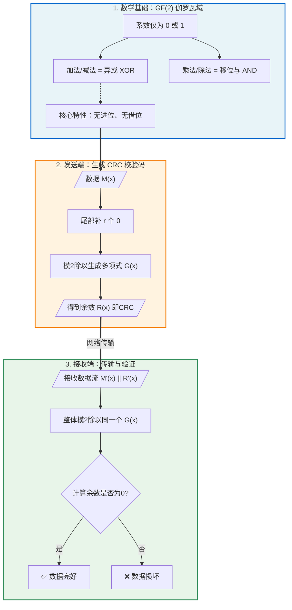
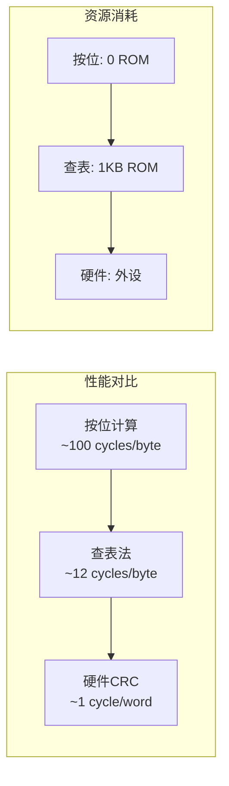
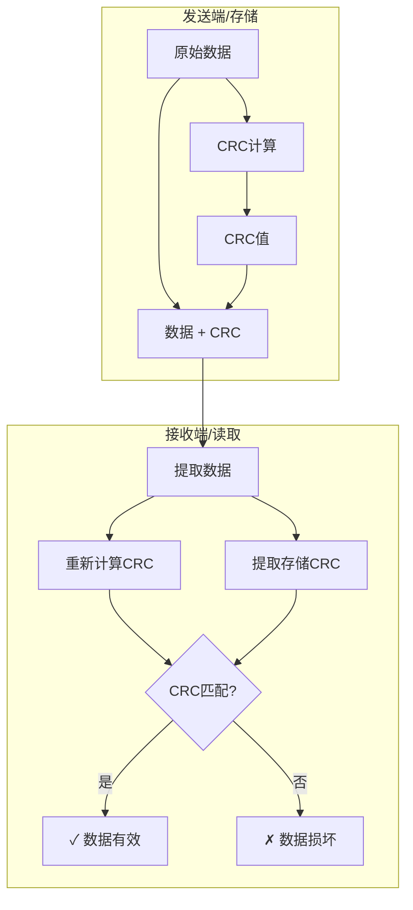

工程师你好，看到你的笔记已经有了不错的CRC基础框架。让我从**数学本质**到**工程实现**帮你系统梳理一遍，补充一些笔记中未深入的关键细节。

---

## 【问题诊断】

CRC的核心是**GF(2)域上的多项式运算**——这个数学基础决定了它的检错能力。你的笔记已经覆盖了基本流程，我将重点补充：
1. 多项式选择的工程意义
2. 三种实现方式的性能对比
3. STM32硬件CRC的正确使用姿势
4. 工程中常见的"坑"

---

## 【根本原理分析】

### 1. CRC的数学本质：GF(2) 域



---


### 2. 为什么选择这个多项式？

CRC-32 使用的多项式是 `0x04C11DB7`（标准形式），但你代码里看到的是 `0xEDB88320`——这是**反转形式**：

| 表示形式 | 多项式值 | 用途 |
|---------|---------|------|
| 正向 | `0x04C11DB7` | 左移算法 |
| 反转 | `0xEDB88320` | 右移算法（更常用） |
| 反射 | `0x1EDC6F41` | CRC-32C (Castagnoli) |

```c
// 正向多项式: x²⁶ + x²³ + x²² + x¹⁶ + x¹² + x¹¹ + x¹⁰ + x⁸ + x⁷ + x⁵ + x⁴ + x² + x + 1
// 0x04C11DB7 = 0000 0100 1100 0001 0001 1101 1011 0111

// 反转多项式（用于右移算法）：
// 把上面的位序反转，得到 0xEDB88320
```

**为什么右移算法更常用？**
- 处理字节时，从LSB开始更自然
- 硬件实现更简单

---

## 【解决方案：三种实现方式】

### 方案A：按位计算（省空间，慢）

```c
/**
 * @brief CRC-32 按位计算（查表法的原理展示）
 * @note  实际工程中不推荐，仅用于理解原理
 */
uint32_t CRC32_Bitwise(const uint8_t *data, size_t len)
{
    uint32_t crc = 0xFFFFFFFF;  // 初始值
    
    for (size_t i = 0; i < len; i++) {
        crc ^= data[i];  // 将字节混入CRC低8位
        
        for (int bit = 0; bit < 8; bit++) {
            if (crc & 1) {
                // LSB为1，需要"除"多项式
                crc = (crc >> 1) ^ 0xEDB88320;
            } else {
                // LSB为0，只移位
                crc >>= 1;
            }
        }
    }
    
    return crc ^ 0xFFFFFFFF;  // 最终异或
}
```

### 方案B：查表法（工程首选）

```c
// 预计算的CRC表（256项，1KB）
static const uint32_t crc32_table[256] = {
    0x00000000, 0x77073096, 0xEE0E612C, 0x990951BA,
    0x076DC419, 0x706AF48F, 0xE963A535, 0x9E6495A3,
    // ... 完整表格共256项
    0x2D02EF8D  // 最后一项
};

/**
 * @brief CRC-32 查表法（推荐）
 * @note  速度提升约8倍，代价是1KB ROM
 */
uint32_t CRC32_Table(const uint8_t *data, size_t len)
{
    uint32_t crc = 0xFFFFFFFF;
    
    for (size_t i = 0; i < len; i++) {
        // 查表：用当前字节的值作为索引
        // 异或：将查表结果与右移后的CRC合并
        uint8_t index = (crc ^ data[i]) & 0xFF;
        crc = (crc >> 8) ^ crc32_table[index];
    }
    
    return crc ^ 0xFFFFFFFF;
}

/**
 * @brief 生成CRC表（编译时或初始化时调用一次）
 */
void CRC32_GenerateTable(uint32_t *table)
{
    for (uint32_t i = 0; i < 256; i++) {
        uint32_t crc = i;
        for (int bit = 0; bit < 8; bit++) {
            if (crc & 1) {
                crc = (crc >> 1) ^ 0xEDB88320;
            } else {
                crc >>= 1;
            }
        }
        table[i] = crc;
    }
}
```

### 方案C：STM32硬件CRC（最快）

```c
/**
 * @brief STM32F4 硬件CRC使用示例
 * @note  STM32的CRC外设使用多项式 0x4C11DB7（正向）
 *        且没有初始值和最终异或，需要软件适配
 */
#include "stm32f4xx_hal.h"

// STM32硬件CRC计算（字对齐）
uint32_t CRC32_Hardware(const uint32_t *data, size_t word_count)
{
    // 使能CRC时钟
    __HAL_RCC_CRC_CLK_ENABLE();
    
    // 复位CRC计算单元
    CRC->CR |= CRC_CR_RESET;
    
    // 逐字写入（必须是32位对齐）
    for (size_t i = 0; i < word_count; i++) {
        CRC->DR = __RBIT(data[i]);  // 反转位序以匹配标准CRC-32
    }
    
    return __RBIT(CRC->DR) ^ 0xFFFFFFFF;  // 反转并异或
}

/**
 * @brief 兼容标准CRC-32的硬件加速版本
 * @note  处理任意长度数据（包括非对齐字节）
 */
uint32_t CRC32_STM32_Compat(const uint8_t *data, size_t len)
{
    __HAL_RCC_CRC_CLK_ENABLE();
    CRC->CR |= CRC_CR_RESET;
    
    // 处理完整的32位字
    size_t word_count = len / 4;
    const uint32_t *words = (const uint32_t *)data;
    
    for (size_t i = 0; i < word_count; i++) {
        uint32_t temp = __RBIT(__REV(words[i]));  // 大端转小端 + 位反转
        CRC->DR = temp;
    }
    
    // 处理剩余字节（软件补零）
    uint32_t crc = __RBIT(CRC->DR);
    const uint8_t *remaining = data + word_count * 4;
    for (size_t i = 0; i < (len % 4); i++) {
        crc = (crc >> 8) ^ crc32_table[(crc ^ remaining[i]) & 0xFF];
    }
    
    return crc ^ 0xFFFFFFFF;
}
```

---

## 【性能对比】



| 方案 | 速度 | ROM占用 | RAM占用 | 适用场景 |
|-----|------|--------|--------|---------|
| 按位计算 | 慢 | ~50B | 0 | 极度ROM受限 |
| 查表法 | 快 | ~1KB | 0 | **工程首选** |
| 硬件CRC | 最快 | 0 | 0 | STM32平台 |

---

## 【大师的工程建议】

### 1. 常见坑点：初始值和最终异或

```c
// ❌ 错误：直接用STM32硬件CRC与PC端校验
// STM32硬件CRC没有初始值和最终异或！

// ✅ 正确：完整的CRC-32参数
typedef struct {
    uint32_t poly;      // 多项式
    uint32_t init;      // 初始值
    bool     ref_in;    // 输入反转
    bool     ref_out;   // 输出反转
    uint32_t xor_out;   // 最终异或值
} CRC_Config_t;

// 标准CRC-32参数
const CRC_Config_t CRC32_Standard = {
    .poly   = 0x04C11DB7,
    .init   = 0xFFFFFFFF,
    .ref_in = true,     // 输入字节位序反转
    .ref_out= true,     // 输出位序反转
    .xor_out= 0xFFFFFFFF
};

// CRC-32/MPEG-2（不反转）
const CRC_Config_t CRC32_MPEG2 = {
    .poly   = 0x04C11DB7,
    .init   = 0xFFFFFFFF,
    .ref_in = false,
    .ref_out= false,
    .xor_out= 0x00000000
};
```

### 2. 增量计算（流式数据）

```c
// 场景：数据分多次接收，需要累积计算CRC
typedef struct {
    uint32_t crc;
} CRC32_Context_t;

void CRC32_Init(CRC32_Context_t *ctx)
{
    ctx->crc = 0xFFFFFFFF;
}

void CRC32_Update(CRC32_Context_t *ctx, const uint8_t *data, size_t len)
{
    for (size_t i = 0; i < len; i++) {
        uint8_t index = (ctx->crc ^ data[i]) & 0xFF;
        ctx->crc = (ctx->crc >> 8) ^ crc32_table[index];
    }
}

uint32_t CRC32_Final(CRC32_Context_t *ctx)
{
    return ctx->crc ^ 0xFFFFFFFF;
}

// 使用示例：分块计算
void Example_IncrementalCRC(void)
{
    CRC32_Context_t ctx;
    CRC32_Init(&ctx);
    
    CRC32_Update(&ctx, chunk1, len1);  // 第一块数据
    CRC32_Update(&ctx, chunk2, len2);  // 第二块数据
    CRC32_Update(&ctx, chunk3, len3);  // 第三块数据
    
    uint32_t final_crc = CRC32_Final(&ctx);
}
```

### 3. 大端小端陷阱

```c
// ⚠️ 危险：直接强转指针
uint32_t crc = CRC32_Table((uint8_t*)&struct_data, sizeof(struct_data));
// 如果结构体中有uint32_t成员，不同端序的CRC结果不同！

// ✅ 正确：序列化后再计算
void Serialize_ForCRC(uint8_t *buf, const MyStruct_t *data)
{
    buf[0] = (data->field1 >> 24) & 0xFF;  // 大端序
    buf[1] = (data->field1 >> 16) & 0xFF;
    buf[2] = (data->field1 >> 8) & 0xFF;
    buf[3] = data->field1 & 0xFF;
    // ...
}
```

### 4. 固件完整性校验实战

```c
/**
 * @brief 启动时校验Flash中的固件完整性
 * @note  配合链接脚本，自动计算CRC存储区域
 */
typedef struct {
    uint32_t crc;
    uint32_t size;
    uint8_t  version[16];
} Firmware_Header_t;

bool Firmware_Validate(void)
{
    extern uint32_t _firmware_start;  // 链接脚本定义
    extern uint32_t _firmware_end;
    
    const Firmware_Header_t *hdr = (Firmware_Header_t *)&_firmware_start;
    const uint8_t *data = (const uint8_t *)(&hdr[1]);
    uint32_t size = (uint32_t)&_firmware_end - (uint32_t)data;
    
    uint32_t calc_crc = CRC32_Table(data, size);
    
    if (calc_crc != hdr->crc) {
        Log_Error("Firmware CRC mismatch: calc=0x%08X, stored=0x%08X", 
                  calc_crc, hdr->crc);
        return false;
    }
    
    return true;
}
```

---

## 【总结：CRC验证流程图】


