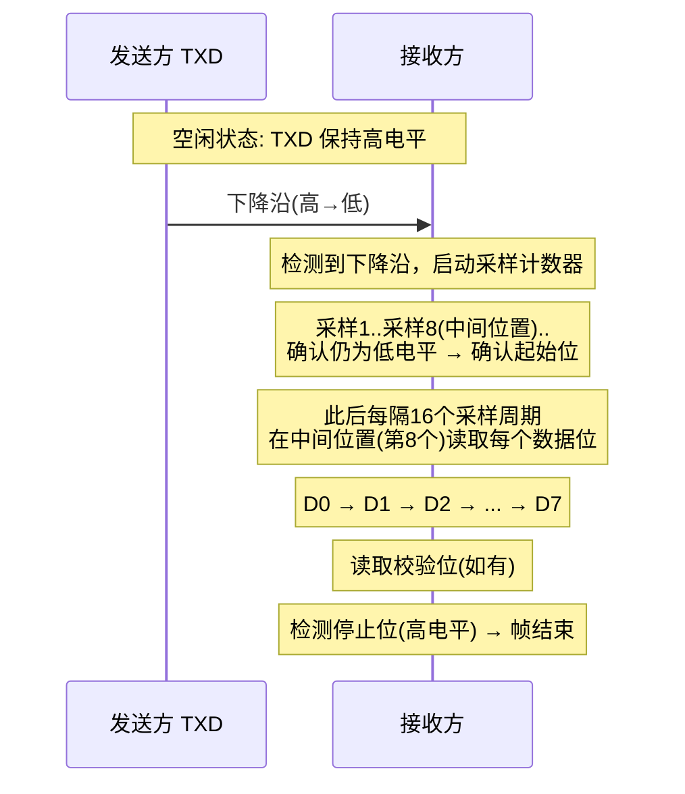
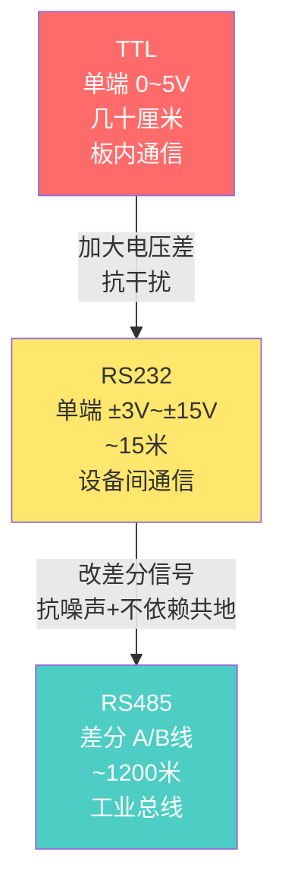
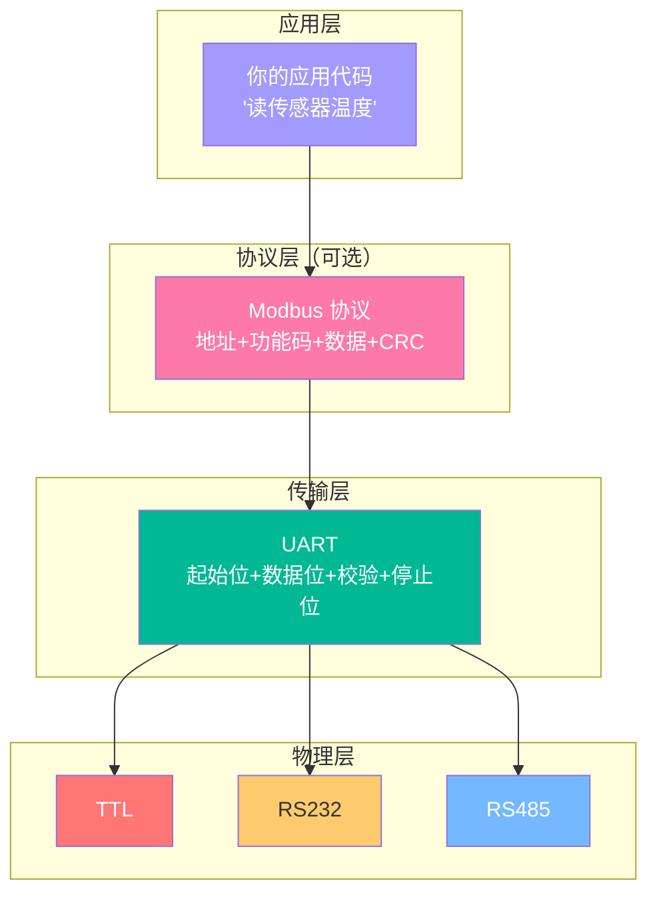
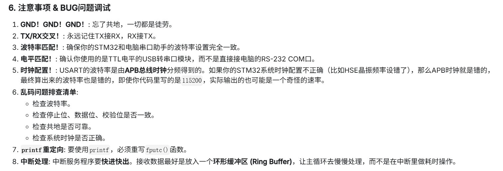

---
tags:
  - 嵌入式
  - 通信协议
  - UART
  - 串口
aliases:
  - USART
related:
  - "[[通信协议总览]]"
  - "[[TCP-IP 协议栈]]"
date: 2026-01-05
updated: 2026-04-18
---

# UART 深度理解

> [!abstract] 一句话总结
> UART 是一种**异步、全双工、点对点**的通信协议，没有时钟线，靠**波特率约定 + 过采样**来同步，物理层可从 TTL 演进到 RS232/RS485。

> [!tip] 学习主线
> UART 的核心问题是：**没有时钟线，双方怎么同步？**
> 答案链条：**波特率约定 → 起始位触发 → 过采样中间读取 → 校验位查错 → 停止位复位**

---

## 协议层

### 异步通信的本质

UART 没有时钟线（对比 [[3. SPI的基础理解|SPI]] 有 SCK，[[2. I2C的基础理解|I2C]] 有 SCL），收发双方必须提前约定好**波特率**——也就是每秒传输多少个 bit。

### 数据帧结构

```
 ┌──────┬────────────────────┬────────┬──────┐
 │ 起始 │    数据位(8bit)     │ 校验位 │ 停止 │
 │  0   │ D0 D1 ... D6 D7    │ 0/1/无 │ 1/2  │
 └──────┴────────────────────┴────────┴──────┘
  触发     LSB先发            查错     恢复+分隔
  接收                       可选      可选长度
```


传输顺序：**低位在前，高位在后（LSB First）**

### 过采样机制

> [!important] 核心机制
> 接收方不是"看一眼"就确定电平，而是**采样多次**来确认，通常采用 **16 倍过采样**。



**过采样的意义：**
1. **起始位确认**：不是一次判断，而是中间位置再验证，防止噪声误触发
2. **中间采样**：每个数据位都在正中间采样，避开边缘的电平不稳定区域
3. **容错空间**：给波特率微小偏差提供容忍窗口

### 波特率与误差累积

波特率 = 每秒传输的 bit 数（如 9600、115200）

```
波特率 9600: 每个 bit = 1/9600 ≈ 104μs
```

> [!warning] 误差会累积
> 如果收发双方波特率有偏差，每个 bit 的采样点会**逐渐偏移**，到最后几个 bit 时可能偏到位边缘，导致误读。

```
理想采样:        ↓     ↓     ↓     ↓     ↓     ↓     ↓
实际采样(偏快):  ↓      ↓      ↓       ↓       ↓        ↓         ↓(歪了!)
             |-----|-----|-----|-----|-----|-----|-----|
              D0    D1    D2    D3    D4    D5    D6
```

工程上波特率误差允许 **2%~3%** 以内。由于帧只有 8~9 个 bit，误差累积有限，下一帧重新从起始位对齐，所以不会无限偏下去。

### 校验位（Parity Bit）

**偶校验（Even Parity）**：数据位 + 校验位中 "1" 的总数为偶数

```
数据 0x41 (0100 0001): 有2个"1" → 校验位 = 0（已是偶数，不用补）
帧: 起始 | 1 0 0 0 0 0 1 0 | 0 | 停止

数据 0x43 (0100 0011): 有3个"1" → 校验位 = 1（补成偶数）
帧: 起始 | 1 1 0 0 0 0 1 0 | 1 | 停止
```

> [!bug] 奇偶校验的局限
> - 错 1 个 bit → 能检测 ✓
> - 错 2 个 bit → **检测不出来** ✗（偶数个错误互相抵消）
>
> 所以奇偶校验能力很弱，工程上常用 **None**（不校验）或更强的 CRC。

### 停止位的作用

1. **强制拉回高电平** → 保证下一帧起始位能产生下降沿
2. **恢复时间** → 给接收方时间处理数据、重置采样计数器
3. **1 位 vs 2 位** → 慢设备用 2 位停止位获得更多缓冲时间

---

## 物理层

UART 协议层定义了"怎么聊"，物理层定义了"用什么方式传"。



### TTL 电平

```
逻辑0 = 0V,  逻辑1 = 5V
连线: TXD + RXD + GND（3根线，交叉连接：TXD→RXD, RXD→TXD）

局限: 
  - 高低电平差仅 ~5V，噪声容限小
  - 判决阈值约 1.4V，噪声超过就会误判
  - 可靠传输距离: 几十厘米（板内）
```

### RS232 电平

```
逻辑0 = +3V ~ +15V,  逻辑1 = -3V ~ -15V
需要电平转换芯片（如 MAX232）

改进: 电压差最大 30V，噪声要 >3V 才会影响判决
局限: 仍然是单端信号，依赖 GND 共地
可靠传输距离: ~15米
```

### RS485 差分信号

> [!important] 关键改进
> RS485 用**差分信号**，不再依赖 GND 共地，噪声对两根线的影响相同，相减后抵消。

```
差分逻辑: V = VA - VB
  逻辑1: VA - VB > +0.2V
  逻辑0: VA - VB < -0.2V

例: 发送 VA=3.5V, VB=1.5V → V=+2V → 逻辑1
    传输中 +1V 噪声 → VA=4.5V, VB=2.5V → V=+2V → 仍然正确！
```

```
连线: A线 + B线（2根，差分对）

总线结构（多设备挂同一对线）:
    设备1 ──┐
            ├── A线 ════════════
    设备2 ──┤
            ├── B线 ════════════
    设备3 ──┘
    (最多 32/128/256 个设备，看芯片型号)
```

> [!warning] RS485 没有硬件仲裁
> 与 [[2. I2C的基础理解|I2C]] 的线与仲裁不同，RS485 **没有硬件级冲突检测**。
> 多设备同时发送会直接冲突导致乱码。
> 解决方案：靠**软件协议**（如 [[Modbus 协议]]）管理总线访问。

### 物理层对比总结

| 特性 | TTL | RS232 | RS485 |
|------|-----|-------|-------|
| 信号方式 | 单端 | 单端 | **差分** |
| 逻辑电平 | 0/5V | ±3V~±15V | 差分 ±0.2V |
| 传输距离 | ~几十cm | ~15m | **~1200m** |
| 多设备 | ✗ | ✗ | **✓** |
| 仲裁机制 | 无 | 无 | 无（靠软件协议） |
| 是否需要共地 | **是** | **是** | 否（差分） |
| 典型芯片 | 直连 | MAX232 | MAX485 |

---

## 分层思想



> [!tip] 关键理解
> **UART 是规则，物理层是实现，上层协议是扩展。**
> - 换物理层（TTL→RS485）：UART 帧结构不变，只是信号方式变了
> - 换上层协议（Modbus RTU→Modbus TCP）：Modbus 规则不变，底层从 UART 换成 [[TCP-IP 协议栈|TCP/IP]]

### Modbus 与 UART 的关系

| 层级 | 职责 | Modbus 做了什么 UART 做不了的 |
|------|------|------|
| UART | 传输字节 | 点对点、无地址概念、无错误恢复 |
| Modbus | 管理总线 | 设备地址（点名）、功能码（读写命令）、CRC16（强校验）、超时重传 |

Modbus RTU（串口） vs Modbus TCP（网线）：同一套 Modbus 规则，底层分别走 UART 和 [[TCP-IP 协议栈|TCP/IP]]。

---

## STM32 里面的配置

| 步骤 | 内容 |
|------|------|
| GPIO 初始化 | 配置 TX/RX 引脚为复用功能 |
| USART 初始化 | 波特率、数据位、校验位、停止位 |
| 数据收发 | 轮询 / 中断 / DMA 三种方式 |

*主要涉及到用位控制寄存器去硬件化 UART，详细见 > STM32F4xx中文手册*

---

## TIPS

来源于 Gemini


---

## 出现的问题

*主要有波特率匹配、采样偏移、物理层选型问题*

1. **波特率不匹配** → 数据完全乱码，误差超过 2~3% 就会出问题
2. **采样点偏移** → 高波特率下更敏感，需要确保收发双方时钟源精度
3. **RS485 总线冲突** → 多设备同时发送无硬件仲裁，靠 Modbus 主从协议避免
4. **共地问题** → TTL/RS232 必须 GND 相连，否则地电位差导致误读
5. **GND 一定要接** → 即使只看 TXD/RXD，不接 GND 通信必出问题

---

## 相关链接

- [[通信协议总览]] - 通信协议的整体对比
- [[2. I2C的基础理解]] - 半双工同步协议（有仲裁机制）
- [[3. SPI的基础理解]] - 全双工同步协议（有时钟线）
- [[TCP-IP 协议栈]] - Modbus TCP 的底层协议栈
