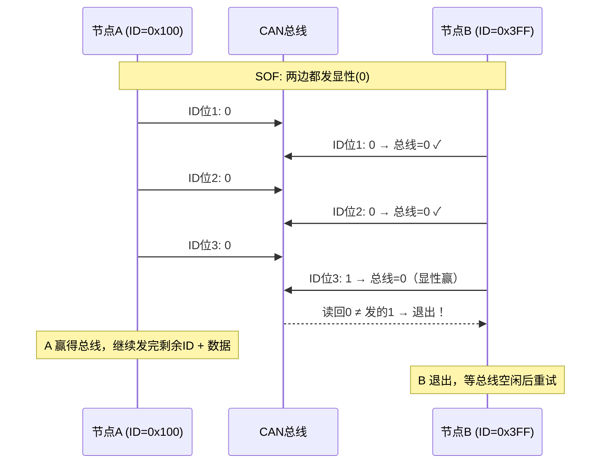
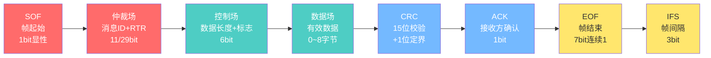
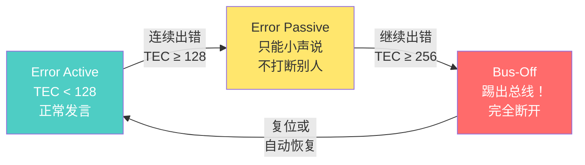
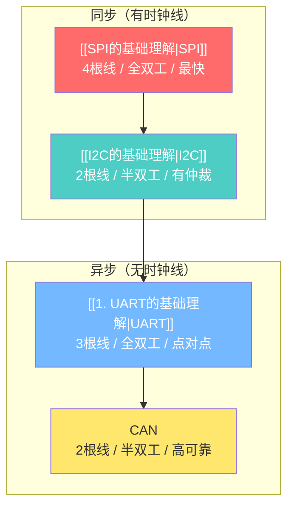

---
tags:
  - 嵌入式
  - 通信协议
  - CAN
aliases:
  - CAN
  - CAN总线
  - Controller Area Network
  - CAN FD
related:
  - "[[1. UART的基础理解]]"
  - "[[I2C的基础理解]]"
  - "[[SPI的基础理解]]"
  - "[[通信协议总览]]"
date: 2026-04-20
---

# CAN 总线深度理解

> [!abstract] 一句话总结
> CAN 是一种**多主、差分、高可靠**的通信总线协议，任何节点都可以主动发送消息，靠**消息 ID 仲裁优先级**（显性0赢过隐性1），拥有 **5 种错误检测 + 三级惩罚机制**，广泛用于汽车电子和工业控制。

> [!tip] 学习主线
> CAN 解决的核心问题：**RS485 + Modbus 不够可靠、不够实时。**
> 进化路线：**RS485（主从、无仲裁）→ CAN（多主、硬件仲裁、错误处理）**

---

## 为什么需要 CAN？

### RS485 + Modbus 的三大不足

```
1. 主从架构 → 从机不能主动发言
   刹车ECU检测到紧急制动 → 必须等主机来问才能说
   → 紧急消息被延迟！

2. 无硬件仲裁 → 靠软件协议（Modbus）避免冲突
   冲突时数据全毁 → 重传 → 浪费时间

3. 错误检测弱 → 靠 Modbus 的 CRC16
   没有对出错节点的惩罚机制
   → 一个坏节点可能拖垮整个网络
```

### CAN 的三个核心优势


| 对比维度 | RS485 + Modbus | CAN |
|---------|---------------|-----|
| 架构 | 主从 | **多主** |
| 紧急消息 | 必须等主机来问 | **主动发送，立即响应** |
| 冲突处理 | 无硬件仲裁，靠软件避免 | **硬件仲裁，0赢过1** |
| 优先级 | 无（先问先答） | **消息ID越小优先级越高，可设计** |
| 错误检测 | CRC16（Modbus层） | **5种检测机制** |
| 出错节点 | 无惩罚，可能拖垮网络 | **三级惩罚，自动Bus-Off** |

---

## 物理层

### 差分信号：显性与隐性

CAN 使用两根差分线：**CAN_H** 和 **CAN_L**，和 [[1. UART的基础理解|RS485]] 目的一样——抗干扰。但实现方式有关键区别。

```
RS485 的差分:
  逻辑1: 主动驱动 VA高 VB低 → 有电压差
  逻辑0: 主动驱动 VA低 VB高 → 有电压差
  → 两种状态都在"用力驱动"

CAN 的差分:
  显性(逻辑0): CAN_H ≈ 3.5V, CAN_L ≈ 1.5V → 有电压差 → 被驱动
  隐性(逻辑1): CAN_H ≈ 2.5V, CAN_L ≈ 2.5V → 电压差≈0 → 没人管
```

```
CAN_H: ──── 3.5V ──────────── 2.5V ────────── 3.5V ────
              显性               隐性            显性
CAN_L: ──── 1.5V ──────────── 2.5V ────────── 1.5V ────
              显性               隐性            显性
```

> [!important] 显性/隐性 = CAN 能仲裁的根本原因
> - 显性(0) = 主动驱动总线（像开漏输出的"拉低"）
> - 隐性(1) = 松手，总线回到默认值（像开漏输出的"松手"）
> - 显性(0) 赢过隐性(1) → 和 [[I2C的基础理解|I2C]] 的线与逻辑一模一样！
> - 而 RS485 两种状态都在"驱动"→ 冲突就是乱码，无法仲裁

### 终端电阻

```
CAN 总线物理连接:

[120Ω]──┬──────┬──────┬──────┬──[120Ω]
        节点1  节点2  节点3  节点4
        只有两头有电阻，中间节点直接挂上去
```

**为什么需要终端电阻？**

信号在导线上以波的形式传播，到达导线末端时会"反射"回来，导致振铃干扰。

```
没有终端电阻:
发送方: ──┐─── 理想方波
接收方: ──┐───┐─┐─┐─── 振铃！波形乱跳 → 误码

加上终端电阻:
发送方: ──┐─── 方波
接收方: ──┐─── 干净的方波 ✓
```

**为什么是 120Ω？**
- CAN 双绞线的特性阻抗 ≈ 120Ω
- 终端电阻 = 特性阻抗 → 信号完全被吸收，零反射

**为什么放在两端？**
- 信号反射只发生在"线的末端"
- 两端都放 → 两头的反射都被吸收
- 中间节点不需要加

---

## 仲裁机制

### 消息 ID 仲裁

CAN 仲裁的核心：**边发边听，显性(0) 赢过隐性(1)**，和 [[I2C的基础理解|I2C]] 线与逻辑原理相同。

```
节点A(ID=0x100) 和 节点B(ID=0x3FF) 同时发消息:

SOF:  两边都发0 → 一样，继续
ID位1: A发0, B发0 → 一样 → 继续
ID位2: A发0, B发0 → 一样 → 继续
ID位3: A发0, B发1 → 总线=0！
       B 读回来发现"我发了1但总线上是0" → B 主动退出
       A 继续把整帧发完

仲裁过程: 一气呵成，没有中断！
```



### CAN 仲裁 vs I2C 仲裁

| 对比维度 | [[I2C的基础理解\|I2C]] | CAN |
|---------|------|-----|
| 仲裁对象 | 从机地址（7位） | 消息ID（11/29位） |
| 优先级决定 | 地址值（出厂固定） | **消息ID（可设计）** |
| 优先级可调 | ✗ 固定的 | **✓ 你自己分配** |
| 仲裁含义 | "找谁" | **"这件事有多重要"** |

```
CAN 的优先级可设计:

同一个刹车ECU可以发不同优先级的消息:
  刹车紧急制动: ID = 0x010 ← 小ID，高优先级
  刹车常规状态: ID = 0x200 ← 大ID，低优先级

→ 紧急消息永远能插队，普通消息自动让路
```

### 仲裁的三个原则

1. **显性(0) 赢过隐性(1)**（物理层决定）
2. **输方必须主动退出**，不能硬抢
3. **赢方完全无感**，不知道有人在竞争，通信正常完成

---

## 数据帧结构

```
┌─────┬──────────┬──────┬────────┬──────┬───────┬──────┬─────┐
│ SOF │ 仲裁场    │控制场 │ 数据场  │ CRC  │ ACK   │ EOF  │ IFS │
│ 1bit│ 12/32bit │6bit  │0~8字节 │15bit │ 2bit  │7bit  │3bit │
└─────┴──────────┴──────┴────────┴──────┴───────┴──────┴─────┘
```



| 字段 | 长度 | 作用 |
|------|------|------|
| **SOF** | 1 bit | 显性(0)，"注意，开始了"（类似 UART 起始位） |
| **仲裁场** | 12/32 bit | 消息 ID（11/29位）+ RTR 位，决定优先级 |
| **控制场** | 6 bit | IDE + r0 + 数据长度码（DLC，0~8字节） |
| **数据场** | 0~8 字节 | 有效数据 |
| **CRC** | 15+1 bit | 15位循环冗余校验 + 1位定界符 |
| **ACK** | 2 bit | 发送方松手，接收方拉低确认（和 I2C ACK 类似） |
| **EOF** | 7 bit | 7位连续隐性(1)，标记帧结束 |
| **IFS** | 3 bit | 帧间间隔，给节点处理时间 |

### ACK 机制

```
发送方发完CRC → 在ACK位释放总线（松手，隐性）
接收方数据正确 → 把总线拉成显性(0)
→ 发送方检测到显性 → "至少有一个人收到了" ✓

和 [[I2C的基础理解|I2C]] ACK 的区别:
  I2C: 一对一确认，指定从机回答
  CAN: 广播式确认，任何一个人回答就行
```

### 数据量限制：8字节怎么办？

**方法1：拆包（ISO-TP 协议）**

```
要发 100 字节 → 拆成多帧:

帧1: ID=0x100, [序列号 + 第1~7字节]
帧2: ID=0x100, [序列号 + 第8~14字节]
...
帧15: ID=0x100, [序列号 + 第99~100字节]

接收方按序列号拼起来
本质: 在 CAN 上面又包了一层协议（和 UART 上层包 Modbus 一样的思想）
```

**方法2：CAN FD（直接扩大数据场）**

```
CAN FD (Flexible Data-rate):
  数据场: 8字节 → 64字节
  速度: 仲裁阶段保持慢速，数据阶段切换到 2~5Mbps

┌────────────────────┬──────────────────────┐
│ 仲裁场(慢速500kbps) │ 数据场(快速2~5Mbps)   │
│ ID + 控制场        │ 最长64字节 + CRC      │
└────────────────────┴──────────────────────┘
  用慢速保证仲裁准确     不需要仲裁了，放心加速！
```

---

## 错误处理

### 5 种错误检测机制

| 机制 | 检测内容 | 说明 |
|------|---------|------|
| **CRC 校验** | 数据完整性 | 15位CRC，检测传输中的数据损坏 |
| **位监测** | 发送一致性 | 发送方每发一个 bit 同时读回对比，不一样就报错 |
| **位填充** | 编码规则 | 连续6个相同 bit → 强制插入反向 bit，否则报错 |
| **格式检查** | 帧结构 | 检查 SOF、EOF、ACK 定界符等是否正确 |
| **ACK 检查** | 接收确认 | 发送方在 ACK 位没检测到显性 → 没人收到 |

> [!important] 位监测是 CAN 独有的
> [[I2C的基础理解|I2C]] 的边发边听是为了仲裁，CAN 的边发边听既为了仲裁也为了错误检测。
> 发送方发了显性(0)但读回来是隐性(1) → 立刻报错。

### 三级惩罚机制

每个节点有两个错误计数器：**TEC**（发送错误）和 **REC**（接收错误）。

```
出错: TEC/REC +8
成功: TEC/REC -1（最小为0）
```



| 状态 | 条件 | 行为 |
|------|------|------|
| **Error Active** | TEC < 128 且 REC < 128 | 正常工作，发主动错误帧（显性，能打断别人） |
| **Error Passive** | TEC ≥ 128 或 REC ≥ 128 | 还能工作，只能发被动错误帧（隐性，不打断别人） |
| **Bus-Off** | TEC ≥ 256 | 完全从总线断开，直到手动复位或自动恢复 |

> [!warning] 为什么这么设计？
> 如果某个节点硬件故障一直发垃圾数据：
> - 没有惩罚 → 坏节点不断干扰 → 整个网络瘫痪 💀
> - CAN 惩罚 → 坏节点 TEC 暴涨 → 被 Bus-Off 开除 → 其他节点正常工作 ✓
> - **一个节点坏了不会拖垮整个网络！**

---

## 全协议对比



| 维度 | SPI | I2C | UART | CAN |
|------|-----|-----|------|-----|
| 线数 | 3+N | 2 | 3/2 | 2 |
| 信号 | 单端 | 单端+上拉 | 单端/差分 | **差分** |
| 同步 | SCK | SCL | 波特率 | 位同步 |
| 双工 | 全双工 | 半双工 | 全双工 | 半双工 |
| 多主 | ✗ | ✓(线与) | ✗ | **✓(显性赢)** |
| 仲裁 | 无 | 线与(地址) | 无 | **线与(消息ID)** |
| 优先级 | 无 | 固定(地址) | 无 | **可设计(ID)** |
| 错误检测 | 无 | ACK | 奇偶(弱) | **5种+惩罚** |
| 距离 | 板内 | 板内 | RS485:1200m | ~1000m |
| 典型应用 | Flash/屏 | 传感器 | GPS/调试 | **汽车/工业** |

---

## 相关链接

- [[通信协议总览]] - 通信协议的整体对比与选型
- [[1. UART的基础理解]] - 异步通信，RS485 是 CAN 的"前身"
- [[I2C的基础理解]] - 线与仲裁机制是理解 CAN 仲裁的基础
- [[SPI的基础理解]] - 全双工同步协议
- [[TCP-IP 协议栈]] - 更上层的网络协议栈
