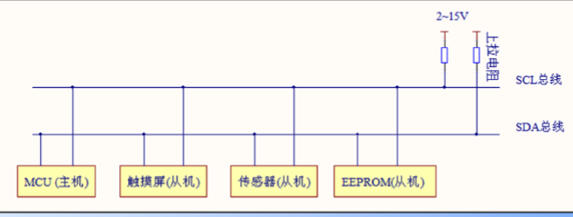
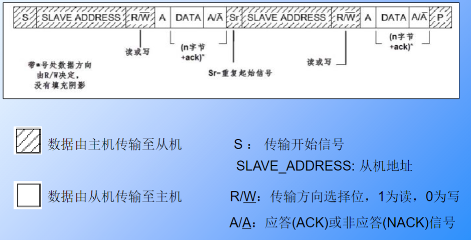
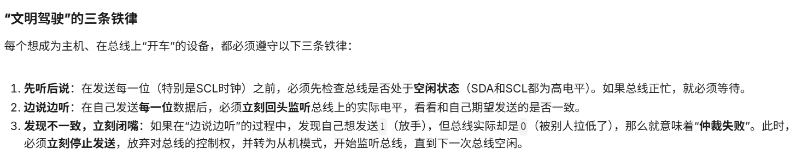
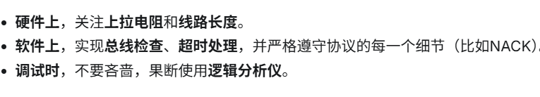

**I2C是较高速，半双工，同步，多机的通讯协议，一般传输命令**

**物理层**

1. SCL:时钟线,同步通信
2. SDA:双向传输数据
3. 仲裁模式：后面详细讲解，因为I2C可以多主机
4. 传输速度：标准：100kbit/s ，快速：
400kbit/s ，高速模式下可达 3.4Mbit/s，但目前大多I2C设备尚不支持高
速模式。

**协议层**

这个图有一点的问题，一开始肯定要先发出从机地址和LSB，这个时候必然是从机拉低SDA表示我是你要找的哪个，后面LSB根据谁接收数据谁应答

1. 在没有CS的片选下，主机要发出开始Start,Stop信号，和传输的从机地址信号（MSB）
2. 在SDA的控制下，因为是一根线的双向，意味着主机要发送都还是写的信号(LSB)
3. 从机在接收到数据之后要是否发送是否接收到信号的反馈
4. 最后一个回应是从机NACk,然后主机发出STOP信号
**采样**
SCL为高电平的时候SDA表示的数据有效，即此时的SDA为高电平时
表示数据“1”，为低电平时表示数据“0”。

•当SCL为低电平时，SDA的数据无效，一般在这个时候SDA进行电平
切换，为下一次表示数据做好准备。

**仲裁模式**
*这便涉及到了线与模式（你可以理解成用线的方式实现了与逻辑门的逻辑架构，只有都是1才是1）*
1. 而实现线与逻辑便需要设置GPIO为开漏输出模式，并且要配一个上拉电阻(使其能发送高电平)。
2. 至于开漏输出和推挽输出的一些区别看[keysking](https://www.bilibili.com/video/BV1zG4y1K78S/?spm_id_from=333.1387.collection.video_card.click&vd_source=603f3c284e76fbe772654083937e3fac)
3. 线与逻辑的实现，明确了输出0为高优先级，而进一步明确了主机
4. 三个原则（实现仲裁）：

**TIPS**
来源于Genimi

使用I2C-Tools检测波形

示波器调式

**出现的问题**
*抓波形，一定比去傻傻的看那个寄存器好*

1. ACK_Error:从机出现引脚配置错误，速度匹配，上拉电阻，上电问题
2. ACK_Time_Out:波频异常拉低，中断配置问题
3. 波形异常：和厂家有关，或者硬件内部有关
4. 还有挺多的，懒得研究了，以后自己实践会遇到的
[B站视频](https://www.bilibili.com/video/BV1WkSwBTE8B/?spm_id_from=333.1387.homepage.video_card.click&vd_source=603f3c284e76fbe772654083937e3fac)