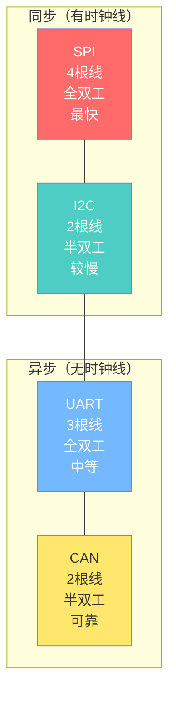
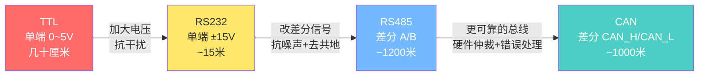
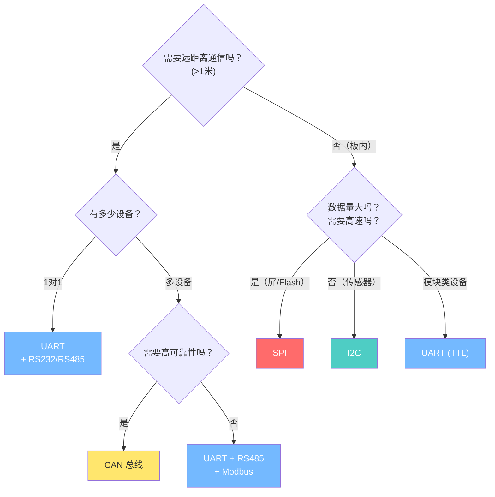
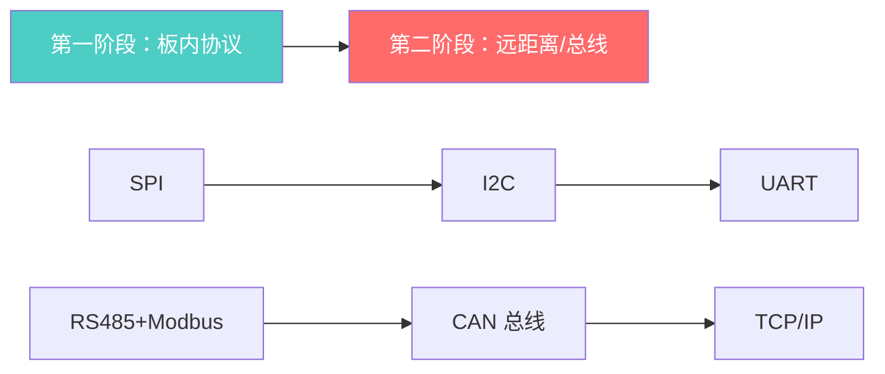

---
tags:
  - 嵌入式
  - 通信协议
  - 总览
aliases:
  - 通讯协议总览
  - 协议对比
related:
  - "[[1. UART的基础理解]]"
  - "[[SPI的基础理解]]"
  - "[[I2C的基础理解]]"
date: 2026-01-05
updated: 2026-04-18
---

# 通信协议总览

> [!abstract] 核心思想
> 从 SPI → I2C → UART → CAN → 互联网，**线的减少（硬件化变弱）**，也伴随着**软件化实现的难度加深**。
> 嵌入式底层（寄存器级）→ 网络应用层（协议栈级）。

---

## 同步 vs 异步的演进

```
通讯协议里面：从 SPI、I2C 里面有时钟线（CLK），到了 UART 是波特率，到了互联网是更加复杂的包、DNS 服务器。

SPI/I2C: 有时钟线 → 接收方跟着时钟走就行
UART:    没有时钟线 → 靠波特率约定 + 过采样来同步
CAN:     没有时钟线 → 靠差分信号 + 位同步 + 位填充
TCP/IP:  没有时钟线 → 完全靠复杂的协议栈管理
```

---

## 三协议全景对比



| 维度 | [[SPI的基础理解\|SPI]] | [[I2C的基础理解\|I2C]] | [[1. UART的基础理解\|UART]] |
|------|-----|-----|------|
| **同步方式** | SCK 时钟线 | SCL 时钟线 | 波特率约定 + 过采样 |
| **线数** | 3+N（每从机+1） | 2（固定） | 3（TTL）/ 2（RS485） |
| **双工** | 全双工 | 半双工 | 全双工 |
| **寻址** | 硬件（CS线） | 软件地址（7/10位） | 无（点对点） |
| **多主机** | ✗ | ✓（线与仲裁） | ✗ |
| **速度** | 几十 MHz | 100k~3.4M | 115200 常见 |
| **距离** | 板内 | 板内 | TTL:板内 / RS485:1200m |
| **仲裁** | 无（主机独占） | 线与逻辑（0赢） | 无（RS485靠软件协议） |
| **出错处理** | 无（靠上层） | ACK/NACK | 校验位（很弱） |
| **典型芯片** | Flash、显示屏 | 传感器、EEPROM | GPS、蓝牙模块 |

---

## 物理层演进路线



| 物理层 | 信号方式 | 距离 | 多设备 | 仲裁 | 典型应用 |
|--------|---------|------|--------|------|---------|
| TTL | 单端 | 几十cm | ✗ | 无 | MCU间通信 |
| RS232 | 单端（大电压） | ~15m | ✗ | 无 | 设备间通信 |
| RS485 | **差分** | ~1200m | ✓ | 无（靠Modbus） | 工业总线 |
| CAN | **差分** | ~1000m | ✓ | **硬件仲裁** | 汽车电子 |

---

## 分层思想

```
┌─────────────────────────────────────┐
│          应用层（你的代码）            │
├─────────────────────────────────────┤
│     协议层（Modbus / 自定义协议）      │  ← 管理总线、地址、校验
├─────────────────────────────────────┤
│     通信协议（UART / SPI / I2C）      │  ← 定义帧结构、同步方式
├─────────────────────────────────────┤
│     物理层（TTL / RS232 / RS485）     │  ← 电压、差分、线
└─────────────────────────────────────┘

每一层只关心自己的事：
  换物理层 → 上层协议不变（UART不变，TTL换成RS485）
  换上层协议 → 底层不变（Modbus RTU 换成 Modbus TCP，底层从 UART 换成 TCP/IP）
```

---

## 工程选型速查



**选型口诀：**
- **高速大容量** → SPI（Flash、屏幕、ADC）
- **少量数据省引脚** → I2C（传感器、EEPROM、RTC）
- **点对点持续数据流** → UART（GPS、蓝牙、调试串口）
- **工业远距离多设备** → UART + RS485 + Modbus
- **汽车/高可靠性** → CAN

---

## 学习路线



### 已完成 ✓

- [x] [[SPI的基础理解]] - 全双工、同步、移位寄存器、CPOL/CPHA
- [x] [[I2C的基础理解]] - 半双工、同步、地址寻址、线与仲裁、开漏输出
- [x] [[1. UART的基础理解]] - 异步、过采样、波特率、TTL→RS232→RS485、Modbus

### 进行中

- [ ] CAN 总线 - 差分信号、仲裁机制、数据帧、错误处理

### 待学习

- [ ] [[TCP-IP 协议栈]] - 网络协议栈、LwIP

---

## 相关链接

- [[1. UART的基础理解]] - 异步通信，靠波特率同步
- [[SPI的基础理解]] - 全双工同步协议，线多但快
- [[I2C的基础理解]] - 半双工同步协议，线少有仲裁
- [[TCP-IP 协议栈]] - Modbus TCP 的底层协议栈
