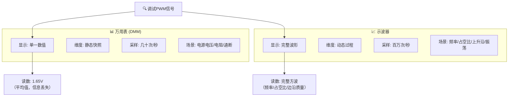
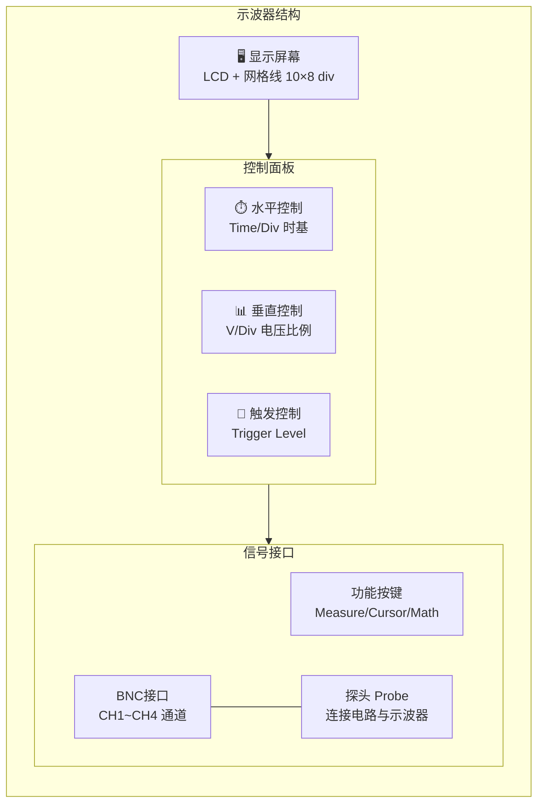
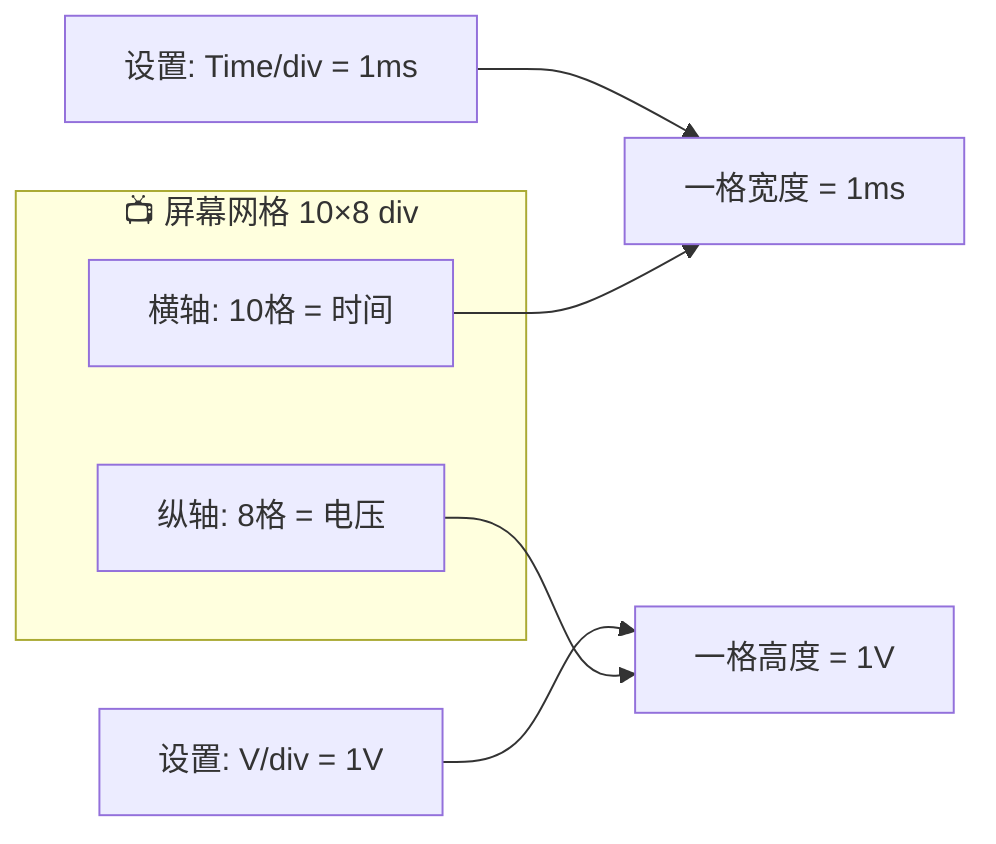
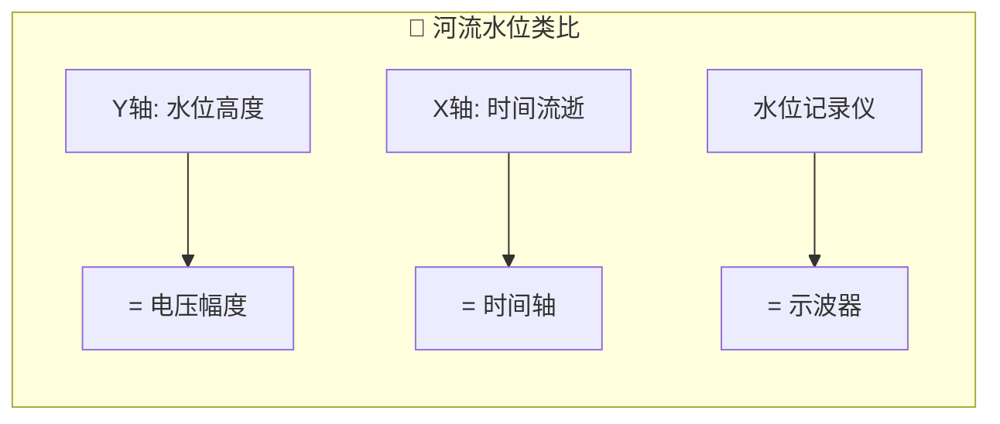

## 1. 核心定义 示波器（Oscilloscope）是一种电子测量仪器，将电压信号随时间变化的规律以**波形**形式可视化呈现。

## 2. 示波器 vs 万用表

| 对比维度 | 万用表 | 示波器 |
| :--- | :--- | :--- |
| **显示方式** | 数字/指针 | 波形图形 |
| **测量维度** | 静态（某一时刻） | 动态（连续过程） |
| **采样速率** | 几十次/秒 | 百万次/秒 |
| **能发现的问题** | 电压是否在范围 | 频率/占空比/边沿/振荡 |
| **价格区间** | 几十~几百元 | 几千~几十万元 |

> [!quote] 工程师经验
> 万用表占 **20%** 调试时间，示波器占 **80%**。当万用表量不出异常时，90% 的情况示波器能找到原因。

---

## 3. 外观结构

### 3.1 核心控制旋钮

| 控制区 | 旋钮 | 作用 | 顺时针旋转效果 |
| :--- | :--- | :--- | :--- |
| **水平** | Time/Div | 每格代表的时间 | 时间变短 → 波形拉伸（看细节） |
| **垂直** | V/Div | 每格代表的电压 | 电压变大 → 波形压缩 |
| **触发** | Trigger Level | 捕获波形的电压阈值 | 触发点上移 |

---

## 4. 核心概念：格

> [!important] 关键理解
> **格是相对单位**，实际代表的物理量由设置决定：
> - `V/div = 1V` → 一格高度 = 1V
> - `Time/div = 1ms` → 一格宽度 = 1ms

---

## 5. 直观类比

示波器就是电路世界的"水位记录仪"，记录的是**电压随时间的波动**。

---

## 6. 关键术语速查

| 术语 | 英文 | 含义 |
| :--- | :--- | :--- |
| [[时域分析]] | Time Domain Analysis | X轴为时间、Y轴为电压的分析方式 |
| [[波形]] | Waveform | 电信号随时间变化的图形 |
| [[格]] | Division/div | 屏幕基本单位，相对值 |
| [[时基]] | Time/Div | 每格代表的时间 |
| [[BNC接口]] | Bayonet Neill-Concelman | 同轴连接器，连接探头 |
| [[通道]] | Channel | 独立输入通道，每通道测一个信号 |
| [[触发]] | Trigger | 告诉示波器"何时开始显示"的条件 |
| [[探头]] | Probe | 连接被测电路与示波器的桥梁 |

---

## 🔗 知识延伸

