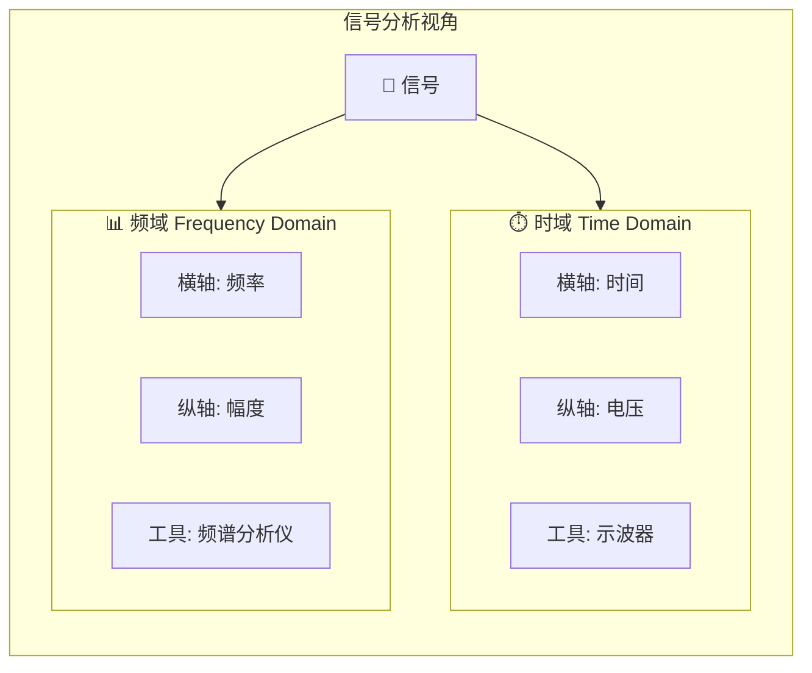
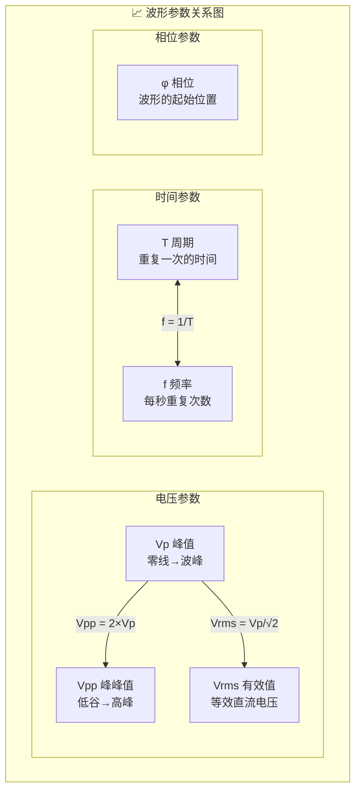
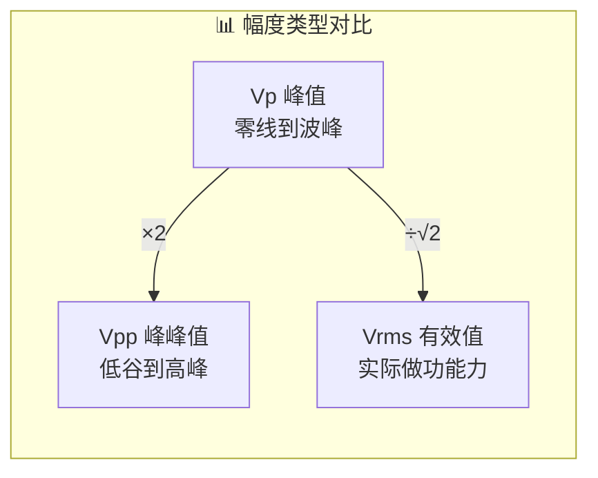
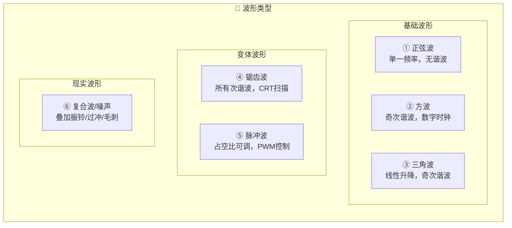
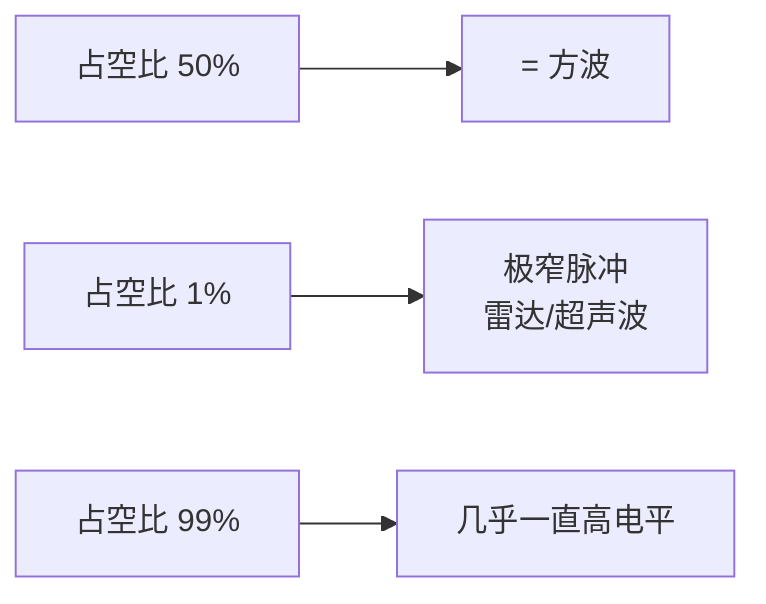
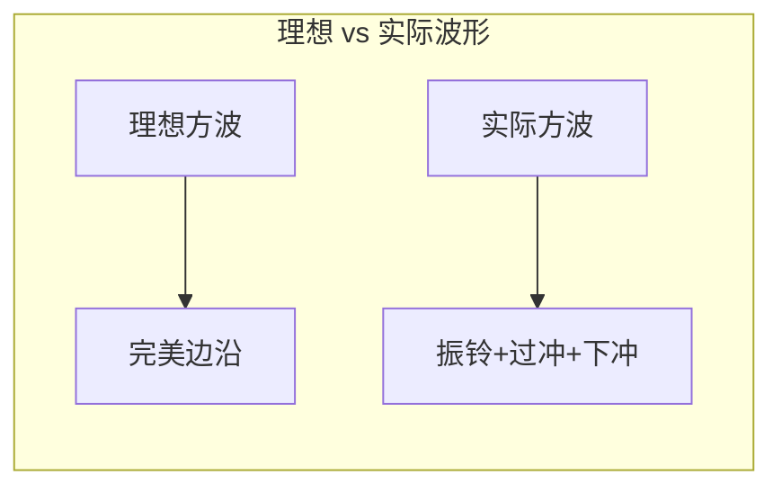

---
aliases:
  - Time Domain
  - Waveform
  - 时域分析
tags:
  - 测量仪器/示波器
date: 2026-03-18
status: 🌿草稿
---

> [!abstract] 核心本质
> **时域**是以时间为横轴、电压为纵轴观察信号变化的分析方式。**波形**是信号在时域中的可视化呈现，由幅度、周期、频率、相位五大参数描述。

---

## 1. 时域

### 1.1 两种分析视角

| 对比维度 | 时域 | 频域 |
| :--- | :--- | :--- |
| **横轴** | 时间 | 频率 |
| **纵轴** | 电压 | 幅度 |
| **回答问题** | 信号随时间怎么变？ | 信号包含哪些频率成分？ |
| **使用仪器** | [[示波器]] | [[频谱分析仪]] |
| **类比** | 歌曲波形 | 均衡器显示 |

> [!quote] 工程师经验
> **95%** 的调试工作在时域中进行。频域分析（FFT）是进阶技能，先把时域搞透。

### 1.2 时域的本质

---

## 2. 波形五大基本参数

### 2.1 核心公式

$$f = \frac{1}{T}$$

> [!important] 肌肉记忆速算表
> | 周期 T | 频率 f |
> | :--- | :--- |
> | 1s | 1 Hz |
> | 1ms | 1 kHz |
> | 1μs | 1 MHz |
> | 1ns | 1 GHz |

### 2.2 幅度的三种表示

| 类型 | 符号 | 含义 | 正弦波换算 |
| :--- | :--- | :--- | :--- |
| 峰值 | Vp | 从零线到波峰的距离 | - |
| 峰峰值 | Vpp | 从最低谷到最高峰的距离 | Vpp = 2 × Vp |
| 有效值 | Vrms | 信号做功能力的等效直流电压 | Vrms = Vp ÷ √2 |

> [!example] 实例：中国市电
> - 标称 **220V** = Vrms
> - 实际峰值 Vp = 220 × √2 ≈ **311V**
> - 峰峰值 Vpp ≈ **622V**
> 
> 用示波器测市电时，波形在 -311V 到 +311V 之间摆动！

> [!danger] 安全警告
> 新手**千万不要**用示波器直接测市电！详见[[示波器安全测量]]。

---

## 3. 六种常见波形

### 3.1 波形特征对比

| 波形类型 | 特征 | 谐波成分 | 典型应用 |
| :--- | :--- | :--- | :--- |
| **正弦波** | 最自然，平滑连续 | 无谐波（单一频率） | 市电、音频、RF信号 |
| **方波** | 高低电平瞬间跳变 | 奇次谐波 | [[时钟信号]]、[[PWM]]、GPIO |
| **三角波** | 线性上升+线性下降 | 奇次谐波（衰减快） | 扫频源、ADC测试 |
| **锯齿波** | 缓慢上升+瞬间下降 | 所有次谐波 | CRT扫描、开关电源 |
| **脉冲波** | 高低电平时间不等 | 取决于占空比 | PWM调光/调速、通信协议 |
| **复合波** | 叠加噪声/振铃/毛刺 | 复杂 | 现实中的所有信号 |

### 3.2 占空比

$$\text{Duty Cycle} = \frac{t_w}{T} \times 100\%$$

> [!tip] 占空比应用
> - **PWM调光**：占空比越大 → LED越亮
> - **PWM调速**：占空比越大 → 电机转速越快

---

## 4. 实际波形的不完美

| 现象 | 英文 | 描述 | 影响 |
| :--- | :--- | :--- | :--- |
| **过冲** | Overshoot | 信号跳过目标值再回来 | 降低噪声裕量 |
| **下冲** | Undershoot | 信号跌破目标值再回来 | 可能触发误动作 |
| **振铃** | Ringing | 在目标值附近来回振荡 | 信号完整性问题 |
| **毛刺** | Glitch | 短暂的异常电压尖峰 | 可能导致逻辑错误 |
| **抖动** | Jitter | 信号边沿在时间上的随机偏移 | 时序问题 |

> [!warning] 工程师经验
> 振铃和过冲不会让电路立刻失败，但会降低**噪声裕量**，导致系统在极端条件下（温度变化、电源波动）出现**间歇性故障**——这种bug最难查。

---

## 5. 波形数学表达（速查）

| 波形 | 数学表达式 |
| :--- | :--- |
| 正弦波 | $V(t) = A \sin(2\pi ft + \phi)$ |
| 方波 | $V(t) = A \cdot \text{sgn}(\sin(2\pi ft))$ |
| 三角波 | $V(t) = \frac{2A}{\pi} \arcsin(\sin(2\pi ft))$ |
| 锯齿波 | $V(t) = 2A(ft - \lfloor ft + 0.5 \rfloor)$ |

> [!note] 参数含义
> - A = 振幅，f = 频率，t = 时间，φ = 初相位
> - 调节示波器旋钮时，实际上就是在改变这些参数

---

## 🔗 知识延伸

- ⬆️ **上位知识**：[[信号与系统]]、[[电子测量仪器]]
- ⬇️ **下位知识**：[[示波器电压参数测量]]、[[傅里叶变换]]、[[信号完整性分析]]
- ➡️ **平级关联**：[[频域分析]]、[[FFT快速傅里叶变换]]、[[示波器触发原理]]

