# Phase 2 云端 AI 部署——AI 工程认知基础(七站学习笔记)

这份笔记不是 HLD,也不是代码说明。

它记录的是从 Phase 1(基础闭环)过渡到 Phase 2(云端 AI 真实检测)之前,必须先理清的 AI 工程核心认知。

主线任务:

```text
Phase 1 已完成:
    USB Camera
        -> ESP32-S3 UVC Host
        -> latest JPEG cache
        -> HTTP upload / mock detect
        -> CH552G CDC command
        -> L1 ON / L1 OFF

Phase 2 要做:
    USB Camera
        -> ESP32-S3 UVC Host
        -> latest JPEG cache
        -> HTTP upload
        -> PC FastAPI + YOLOv8n 推理
        -> 返回 person_count
        -> ESP32 决策层(light_policy)
        -> CH552G CDC
        -> L1~L5 按人数递进点亮
```

这份笔记回答的核心问题:

```text
1. AI 模型到底是什么?
2. 为什么本项目用检测,不用分类?
3. 一张图片在 AI 眼里是什么?
4. 为什么本项目零训练?
5. 云端 AI 和边缘 AI 到底差在哪?
6. FastAPI 服务端怎么包住模型?
7. 模型推理怎么优化到延迟预算内?
```

---

# 0. 写在前面

## 0.1 这份笔记是什么

```text
不是教程搬运。
不是 API 文档。
是进入 Phase 2 实战前必须掌握的 AI 工程认知沉淀。
```

## 0.2 为什么写

```text
Phase 1 的坑是"USB/内存/网络"——这些是嵌入式老问题。
Phase 2 的坑完全不同——是"AI 工程化认知"问题。

如果直接上手写代码,会遇到这些坑:
    - 为什么模型加载要在启动时做一次?
    - 为什么 conf 阈值不能乱调?
    - 为什么预处理路径必须测试和生产一致?
    - 为什么先做云端不做边缘?

这些坑不是代码问题,是认知问题。
认知不清,代码写得再多也是乱调参数。
```

## 0.3 怎么用

```text
1. 先通读一遍,建立完整认知地图
2. 开始写 Phase 2 代码时,遇到决策点回来对照
3. 面试前重点看第 9 节(踩坑记录)和第 10 节(求职浓缩)
```

## 0.4 与 Phase 1 笔记的衔接

```text
Phase 1 笔记记录的是"嵌入式工程经验":
    - USB Host 分层排查
    - BSS 段内存预算
    - HTTP 网络五步法

Phase 2 笔记(本文件)记录的是"AI 工程认知":
    - 模型本质
    - 预处理一致性
    - 云端 vs 边缘架构判断
    - 模型优化 tradeoff

两者是互补关系,不重叠。
```

---

# 1. 站0:模型 = 参数化函数

这一站解决一个问题:

```text
"AI 模型到底是什么?它的'智能'从哪里来?"
```

## 1.1 核心心智模型

判断:

```text
一个 AI 模型,本质上就是一个"输入数字、输出数字"的函数。
只不过这个函数有几百万个可调参数(权重),它的形状由网络结构决定。
```

图示:

```text
        ┌─────────────────────────────────┐
输入 ──>│  一个有300万个旋钮的超复杂函数   │──> 输出
(数字)  │  f(x) = 一大堆矩阵乘法+非线性    │(数字)
        └─────────────────────────────────┘
```

关键认知(四条):

```text
1. 输入必须是数字
   图片不是"图片",是被拆成一堆数字(张量)喂进去
   AI 不"看"图,它只"算"数字

2. 函数本身是固定的数学运算
   一堆矩阵相乘、加法、非线性激活
   这部分是死的、确定的,没有魔法
   能用纸笔一步步算出来(虽然要算到天荒地老)

3. 真正"调"出来的是权重
   同样的网络结构,权重不同,输出天差地别
   "训练一个模型" = 找到一组合适的权重

4. 输出也是数字
   概率、坐标,没有任何"语义"
   语义是我们事后赋予的
```

结论:

```text
"智能"藏在权重里,不在函数运算逻辑里。
函数是骨架,权重是肉。
同骨架换肉,能跑;换骨架,得重写。
```

## 1.2 钢琴调音类比

```text
AI 概念          钢琴类比
─────────        ─────────
网络结构          钢琴本身(88个键、弦、击弦机构)
权重             每根弦的调音
输入             按下的琴键组合
输出             钢琴发出的声音
训练             调音师反复拧弦,把音调准
推理             演奏:按琴键,出声音
```

关键洞察:

```text
同一架钢琴(同样的网络结构):
    调音准 → 弹出来是音乐
    弦全部拧乱 → 弹出来是噪音

结构一模一样,只是权重(调音)不同。
这就是"智能在权重里,不在结构里"的最直观证明。
```

## 1.3 亲手算一次:一个神经元的"模型"

做一个最蠢的"亮度检测器":输入 1 个像素(0~255),判断亮还是暗。

```text
模型结构:1 个神经元
公式:output = weight × input + bias

情况A:训练好的权重(weight=0.01, bias=-1.2)
    输入 200(亮) → 0.01×200 + (-1.2) = 0.8 → 0.69 → "亮"
    输入 50 (暗) → 0.01×50  + (-1.2) = -0.7 → 0.33 → "暗"

情况B:同样公式,权重随机(weight=-0.03, bias=0.5)
    输入 200(亮) → -0.03×200 + 0.5 = -5.5 → 0.004 → "暗"(错了!)
    输入 50 (暗) → -0.03×50  + 0.5 = -1.0 → 0.27  → "暗"
```

看到了什么:

```text
公式 output = weight × input + bias 一行都没变。
但权重数字一换,模型就废了。
训练做的事,就是把 weight 和 bias 从"随机乱猜"调到"0.01 和 -1.2"。

YOLOv8n 有 300 万个这样的数字,但本质完全一样。
只是规模大了,不是性质变了。
所谓"深度学习",就是很多层这样的乘加运算串起来。
```

## 1.4 三个思想实验(烧掉"AI 有魔法"的迷雾)

### 实验1:把 yolov8n.pt 的所有权重设成 0

```text
每一层算出来都是 0,最后输出全是 0。
模型彻底"脑死亡",什么也检测不到。

证明:智能在权重里,权重没了,模型就是一堆空转的乘法。
```

### 实验2:把 yolov8n.pt 的权重随机洗牌(结构不变)

```text
它会输出"看起来像检测结果但完全乱来的框"。
不是崩溃,是自信地胡说八道。

证明:同样的结构、同样的代码,只是权重数字变了,行为天差地别。
```

### 实验3:训练两个完全相同结构的 YOLOv8n,一个在 COCO 上训练,一个只在猫狗上训练

```text
网络结构、代码、算力消耗完全一样。
但一个能认 80 类,一个只能认 2 类。

证明:"能认什么"由训练数据 + 训出来的权重决定,跟模型代码无关。
```

## 1.5 一个易错点:权重绑定结构

这是新手最容易栽的认知坑。

判断:

```text
权重不是一个"自由漂浮的数字",而是"某条特定连线"上的数字。
权重 = 数值 + 位置。
```

举例:

```text
yolov8s 的某个权重是:
    "第4521个神经元 → 第8234个神经元"连线上的乘法系数

yolov8n 的层根本没有第4521个神经元(它的层更窄)。
这个位置不存在,你无处可填。
```

张量形状角度:

```text
yolov8n 第3层卷积权重形状: [256, 256, 3, 3]   总共 589824 个数字
yolov8s 第3层卷积权重形状: [512, 512, 3, 3]   总共 2359296 个数字

形状都对不上,塞都塞不进去。
代码会在加载模型时直接报错。
```

干净的两条规则:

```text
规则1: 结构(骨架)相同 + 权重(数值)不同  → 能互换
       (代码不用改,行为不同而已)

规则2: 结构(骨架)不同                 → 不能互换
       (形状对不上,代码都要改)
```

关键区分点:

```text
"结构"指的是层的形状和连接方式,不是权重的数值。
    yolov8n vs yolov8s:层宽不同 → 结构不同 → 不能互换
    同样 yolov8n,COCO vs ImageNet:层相同,数值不同 → 能互换
    同样 yolov8n,80类 vs 2类:输出层形状不同 → 结构不同 → 不能互换
```

## 1.6 套到本项目:YOLO 到底做了什么

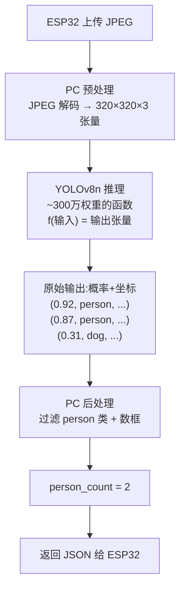

重要事实:

```text
"看出来 2 个人"这件事,本质是一堆矩阵乘法跑完后,输出里有 2 个高概率 person 框。
YOLO 本身根本不知道"2 个人"是什么概念,它只是吐出一堆数字。
是我们自己写的后处理代码,把"≥0.4 概率的 person 框数一数"得出了 2。

概率阈值 0.4、类别 person、NMS 去重……
这些都是我们写的业务规则,不是 AI 的魔法。
```

## 1.7 站0 小结

```text
1. 模型 = 参数化函数,智能在权重里,不在函数运算里
2. 钢琴类比:结构是钢琴,权重是调音
3. 权重绑定结构:同结构可换权重,换结构权重不兼容
4. YOLO 只吐数字,所有"语义"是后处理赋予的
```

---

# 2. 站1:视觉 AI 的三大任务

这一站解决一个问题:

```text
"为什么本项目必须用 YOLO(检测),不能用一个简单的分类模型?"
```

## 2.1 分类 / 检测 / 分割 的区别

输入同一张图(里面有一个人、一只猫):

```text
任务1  分类(Classification)
  问: 这张图里"主要是什么"?
  答: "person"(一个答案)
  输出: 一个类别标签

任务2  检测(Detection)  ← YOLO 干这个
  问: 图里"有什么,各在哪里,各有几个"?
  答: "左上有1个person(框),右下有1个cat(框)"
  输出: N 个 (类别, 概率, 矩形框) 的列表

任务3  分割(Segmentation)
  问: 图里"每个像素属于什么"?
  答: "这些像素是人,这些是猫,这些是背景"
  输出: 一张和原图等大的"掩码图"
```

难度/算力递增:

```text
分类 < 检测 < 分割
```

## 2.2 为什么本项目用检测

本项目的需求:

```text
"画面里有几个人就点亮几盏 LED"
```

三种任务各自能不能干:

```text
用"分类"做:
    分类只告诉你"这张图主要是 person"
    它不告诉你有几个人
    3 个人挤在一起的图,分类模型可能就输出一个 "person"
    → 不能满足"按人数点亮 LED"

用"检测"做:
    检测给你 N 个框:[person框1, person框2]
    数一下框个数 → 2 个人 → 点亮 L1+L2
    → 完美匹配需求

用"分割"做:
    能告诉你每个像素是不是 person
    也能数出人数(连通区域计数)
    但杀鸡用牛刀,算力消耗是检测几倍
    → 性价比低,不选
```

选型逻辑:

```text
需求 = "数人数"
    ↓
需要知道"每个人的位置"(否则重叠多人分不开)
    ↓
必须用"检测"
    ↓
YOLO 是检测领域又快又准的代表性模型
    ↓
所以本项目用 YOLOv8n
```

结论:

```text
任务选型从需求倒推,不是从"哪个模型火"正推。
```

## 2.3 YOLO 只吐数字,后处理是我们的代码

检测模型的原始输出:

```text
一张 320×320 的图,YOLOv8n 可能输出 ~8400 个候选框
每个候选框是一行数字:
    [x_center, y_center, width, height, prob_person, prob_cat, ..., prob_80类]

比如:
    [120, 80, 50, 120, 0.92, 0.01, ..., 0.03]  ← 大概率是 person
    [210, 75, 45, 115, 0.87, 0.02, ..., 0.01]  ← 大概率是 person
    [300, 300, 20, 20, 0.12, 0.05, ..., 0.02]  ← 概率都很低,大概率是背景
    ... 还有 8397 行 ...
```

注意几件事:

```text
1. 模型不知道哪个框是"真的",它只给每个框算了一堆概率
2. 8400 个框里绝大多数是垃圾(背景、低概率)
3. 需要后处理才能从这堆数字里捞出"真正的 2 个人"
```

## 2.4 后处理三步

```text
① 概率过滤:只保留 prob_person > 0.4 的框
    8400 → 可能 5 个

② 类别判定:每个框取概率最大的类作为它的类别

③ NMS 去重:重叠度高的框只保留概率最高的那个(同一人不重复数)
    5 → 最终 2 个
```

最终:

```text
len(剩下的框) == 2 → person_count = 2
```

关键认知:

```text
这个后处理流程,就是服务端 detector.py 要干的核心业务逻辑。
它和 YOLO 模型本身是分离的。
YOLO 只负责吐数字,后处理是我们写的代码。
```

## 2.5 NMS 去重原理

NMS = Non-Maximum Suppression(非极大值抑制)。

具体场景:

```text
画面里有 1 个人,YOLO 可能在他身上框了 5 个略有差异的框
(模型对同一个人会从不同位置、不同大小尝试多次)
如果不处理,会数出 5 个人,错。
```

NMS 做的事:

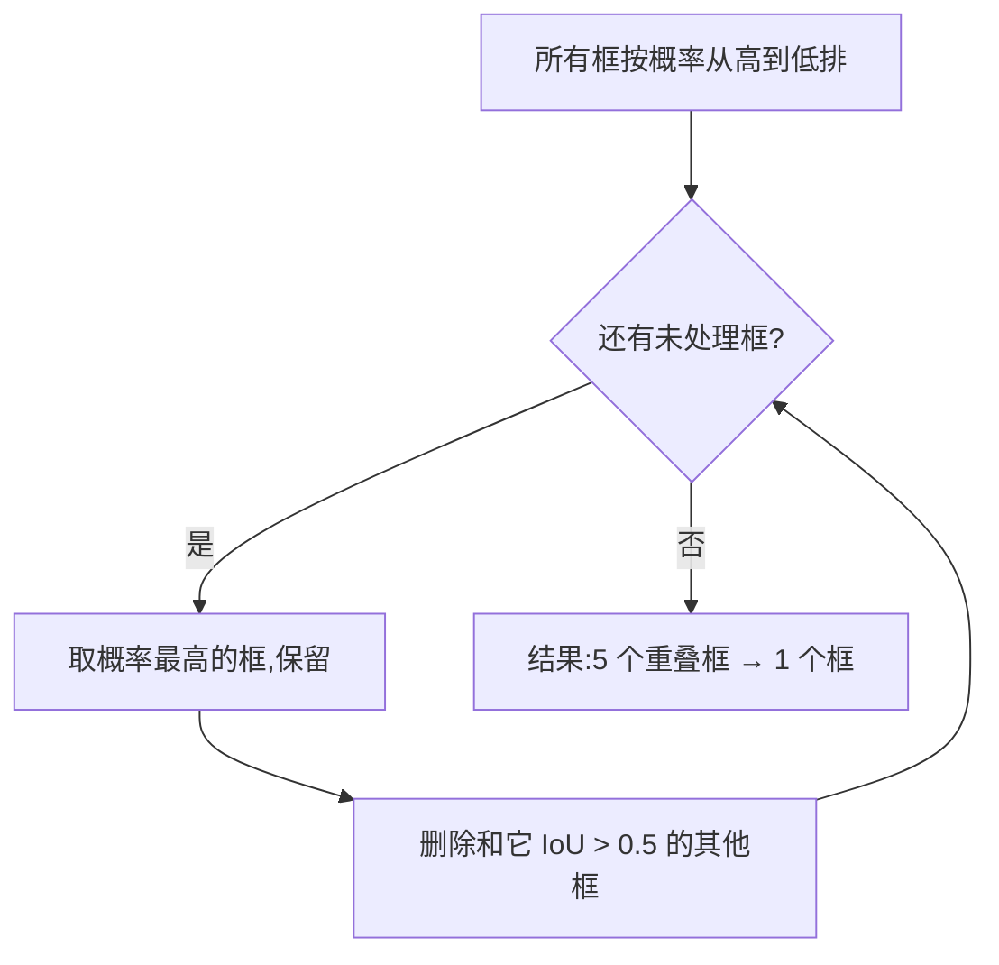

工程意义:

```text
IoU 阈值(0.5)是可调参数,server 可以暴露做 A/B 对比
ultralytics 库默认帮你做了 NMS,但要知道它在背后发生了什么
面试官问"YOLO 怎么避免重复检测",答案就是 NMS
```

## 2.6 conf 和 IoU 解决不同问题(易混淆)

这是新手最容易混淆的两个阈值,必须钉死。

```text
conf 阈值(置信度)——管"误检 vs 漏检"
    提高 conf → 误检减少,但可能漏检
    降低 conf → 漏检减少,但可能误检增多

NMS IoU 阈值——管"重复计数 vs 合并漏人"
    提高 IoU 阈值 → 删得少,可能重复计数
    降低 IoU 阈值 → 删得多,可能相邻两人被合并
```

两张表对照:

```text
你想让系统...              调哪个          调成什么
─────────────────────     ──────          ────────
减少误检(把椅子当人)       conf 阈值       调高(0.5+)
减少漏检(真人没识别)       conf 阈值       调低(但要先排查根因)
解决"同一人重复计数"        NMS IoU 阈值    调低(0.4-0.5)
解决"相邻两人被合并成一个"  NMS IoU 阈值    调高(0.6-0.7)
```

结论:

```text
conf 和 IoU 解决完全不同的问题,绝不能混为一谈。
这就是面试官最爱挖的细节。
```

## 2.7 后处理顺序不能乱

后处理三步顺序:①conf过滤 ②类别判定 ③NMS去重。

能不能换顺序?比如先 NMS 再 conf 过滤?

```text
不能换,有双重依赖。
```

性能依赖:


```text
NMS 算法是 O(n²)——要两两比对所有框。
在 8400 个框上跑 NMS vs 在 5 个框上跑 NMS,速度差几千倍。
先 conf 过滤是为了让 NMS 在小集合上跑。
```

正确性依赖:

```text
NMS 逻辑是"保留概率最高的框,删除和它重叠高的"。
如果先 NMS,8400 个垃圾框(都是低概率)会互相干扰。
两个低概率垃圾框 IoU 可能很高,NMS 会保留其中一个,污染结果。
```

结论:

```text
conf 过滤是 NMS 的必要预处理,既为性能也为正确性。
工程上"流水线顺序不能乱"。
```

## 2.8 站1 小结

```text
1. 视觉三大任务:分类<检测<分割,按需求倒推选型
2. 本项目"数人数"必须用检测,选 YOLOv8n
3. YOLO 只吐数字,后处理(过滤/计数)是我们的代码
4. 后处理三步:conf过滤 → 类别判定 → NMS去重
5. conf 管误检/漏检,IoU 管重复/合并,不能混
6. 后处理顺序有性能+正确性双重依赖
```

---

# 3. 站2:一张图片在 AI 眼里是什么

这一站解决一个问题:

```text
"ESP32 上传 JPEG 到服务端,送进 YOLO 之前,这堆字节到底发生了什么?"
"为什么预处理做错任何一步,模型就废了?"
```

## 3.1 图片的本质:像素 + RGB 三通道

判断:

```text
AI 只吃数字。一张图片在送进模型之前,必须先变成一个数字构成的多维数组。
这个过程叫预处理(preprocessing)。
预处理做错任何一步,模型就废了。
```

一张 320×320 彩色图:

```text
图片高度 H = 320 行
图片宽度  W = 320 列
每个像素有 3 个通道:R(红)、G(绿)、B(蓝)
每个通道的值是 0~255 的整数

总数字数 = 320 × 320 × 3 = 307,200 个
```

关键认知:

```text
一张图 = 一个三维"数字立方体",形状记作 [H, W, C] = [320, 320, 3]
这个"数字立方体"有个专门的名字:张量(Tensor)
张量听起来唬人,本质就是多维数组
    一维叫向量
    二维叫矩阵
    三维以上统称张量
```

## 3.2 完整预处理流程

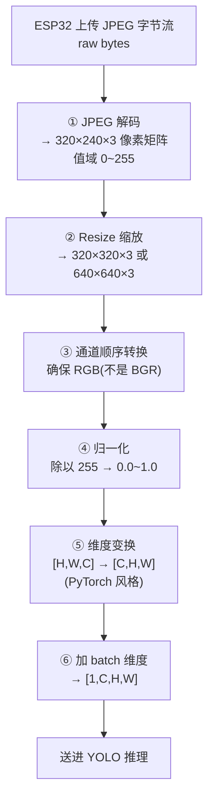

每一步都可能出错。下面重点讲三个新手必踩的坑。

## 3.3 五大坑

### 坑1:BGR vs RGB(90% 新手栽过)

现象:

```text
OpenCV (cv2.imread) 默认读图是 BGR 顺序——蓝通道在前,红通道在后
几乎所有模型训练时用的是 RGB 顺序——红通道在前
这两个顺序数值完全一样,但通道顺序反了
```

后果:

```text
模型训练时学的是"R 通道在位置0,G 在位置1,B 在位置2"
你喂给它 BGR,它会把蓝色当成红色来识别

原图(一个人穿红衣服):
    正确 RGB 喂入 → 模型看到"红色衣服的人" → 识别正常
    错误 BGR 喂入 → 模型看到"蓝色衣服的人" → 概率骤降,可能漏检
```

修复:

```python
img = cv2.imread("xxx.jpg")                       # BGR
img_rgb = cv2.cvtColor(img, cv2.COLOR_BGR2RGB)    # 转 RGB
```

好消息:

```text
用 ultralytics 库不用操心:
    from ultralytics import YOLO
    model = YOLO("yolov8n.pt")
    results = model(img)   # 内部自动处理 BGR/RGB

它把坑都帮你填了。但你要知道它在背后做了什么,面试问起来才能答。
```

### 坑2:归一化范围

现象:

```text
模型训练时,输入被归一化到某个固定范围
部署时必须用完全相同的归一化方式,否则权重失效
```

三种常见归一化:

```text
0-1 归一化:      x / 255.0              → YOLO、大多数模型
-1~1 归一化:    (x/127.5) - 1          → 部分模型(如 MobileNet v2)
标准化:         (x - mean) / std       → ImageNet 训练的模型
```

后果:

```text
YOLO 训练时输入是 0-1,你部署时输入是 0-255
等于把所有像素值放大了 255 倍喂进去
权重算出来的结果完全错乱,模型直接废掉
```

修复:

```python
img_normalized = img.astype(np.float32) / 255.0
```

### 坑3:Resize 的尺寸和插值方法

现象:

```text
模型训练时输入尺寸固定(YOLOv8 默认 640×640)
部署时必须用相同尺寸
尺寸不对,模型直接报错或精度崩盘
```

关键陷阱:letterbox vs 直接 resize

```text
YOLO 训练时用的是 letterbox(保持宽高比,补黑边)
不是简单 resize

简单 resize(错误,会让图像变形):
    cv2.resize(img, (640, 640))

letterbox(正确,保持宽高比,补灰边):
    ultralytics 内部默认用 letterbox,你不用操心
```

### 坑4/坑5:dtype 和 batch 维度

```text
dtype:    本地测试用 float32,上传解码成 uint8,类型不一致会报错或精度掉
batch:    模型要 [1,C,H,W] 而不是 [C,H,W],少一维会报错
```

## 3.4 预处理步骤总览表

| 预处理步骤 | 作用 | 做错了的后果 | 谁负责 |
|-----------|------|------------|--------|
| JPEG 解码 | bytes → 像素矩阵 | 推理直接失败 | 你的代码 |
| BGR→RGB | 通道顺序对齐 | 精度掉一半 | ultralytics 自动 / 你的代码 |
| 归一化(÷255) | 数值范围对齐 | 模型完全失效 | ultralytics 自动 |
| Resize+letterbox | 尺寸对齐 | 报错或精度下降 | ultralytics 自动 |
| 加 batch 维度 | 形状对齐 | 报错 | ultralytics 自动 |

核心认知:

```text
预处理 = 把任意图片变成"模型训练时见过的那个形状和范围的数字"
预处理做错 = 模型权重失效
用 ultralytics 等成熟库 = 把这些坑自动填好,但你要知道它在填什么
```

## 3.5 单一真理源(测试和生产同路径)

这是真实项目里最容易翻车的地方。

现象:

```text
PC 本地测试精度很高,但用 ESP32 上传的 JPEG 推理时精度掉一半
模型、代码都没变
```

判断:

```text
本地测试路径和 ESP32 上传路径走了不同的预处理
```

对比:

```text
本地测试路径:cv2.imread 读 .jpg → ultralytics 推理 → 精度高
ESP32 上传路径:FastAPI 收到 bytes → ??? → ultralytics 推理 → 精度掉一半

常见不一致:
    本地 cv2.imread 是 BGR,上传用 PIL 是 RGB
    本地 imgsz=640,上传 imgsz=320
    本地用原图(高质量),ESP32 出图被 JPEG 压缩
    本地 numpy float32,上传解码成 uint8
```

正确做法(单一真理源):

```text
测试和生产必须用同一条预处理函数
封装成一个 preprocess() 函数,两边都调用它

def preprocess(jpeg_bytes: bytes) -> np.ndarray:
    """统一的预处理入口,测试和生产都用这个"""
    img = cv2.imdecode(np.frombuffer(jpeg_bytes, np.uint8), cv2.IMREAD_COLOR)
    return img

# 本地测试
img = preprocess(open("test.jpg", "rb").read())
results = model(img)

# 生产(FastAPI)
img = preprocess(await request.body())
results = model(img)

两条路径永远一致,因为它们调的是同一个函数。
```

结论:

```text
DRY 原则(Don't Repeat Yourself)在 ML 工程里的体现。
测试和生产用同一条预处理函数,绝不复制粘贴两份。
```

## 3.6 本项目架构:端云分工

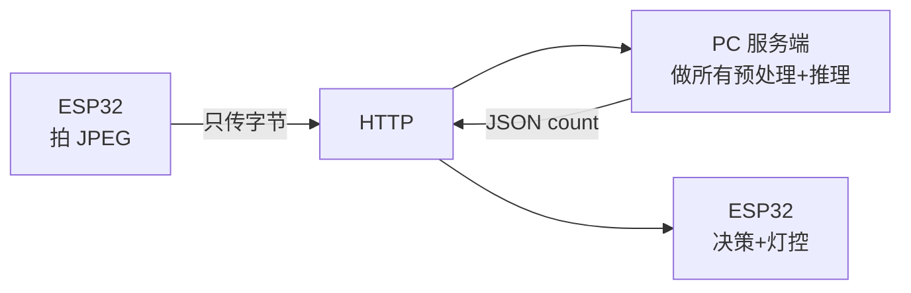

为什么预处理全放服务端:

```text
ESP32 算力有限,做 JPEG 解码+resize+归一化很费 CPU
JPEG 本身就是压缩后的字节流,体积小,适合网络传输
服务端 PC 算力充足,做预处理很快
架构原则:重计算放服务端,端侧只做轻量任务

这就是"端云分工"——不只是 AI 推理可以分工,预处理也是。
```

## 3.7 站2 小结

```text
1. 图片 = 张量 = H×W×C 数字立方体,320×240×3 = 230,400 个数字
2. 预处理 = 把任意图片变成模型训练时见过的形状和范围,做错=权重失效
3. 五大坑:BGR/RGB、归一化范围、resize 方法、尺寸、dtype
4. 用 ultralytics = 自动填坑,但要知道它在填什么
5. 单一真理源:测试和生产用同一条 preprocess 函数
6. 端云分工:ESP32 只传 JPEG 字节,预处理全在服务端做
```

---

# 4. 站3:推理 vs 训练

这一站解决一个问题:

```text
"为什么本项目可以直接用 yolov8n.pt 不用训练?"
"什么时候才必须自己训练?训练到底在做什么?"
```

## 4.1 权重是分界线

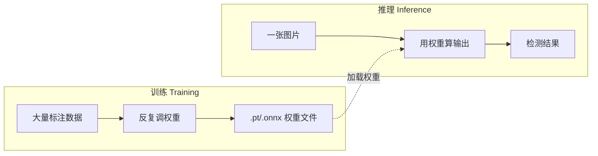

两个世界对比:

```text
【训练 Training】              【推理 Inference】
─────────────────              ─────────────────
目标: 找到合适的权重           目标: 用权重算输出
输入: 大量标注数据             输入: 一张图片
输出: .pt/.onnx 权重文件       输出: 检测结果
代价: 几小时~几天, 要 GPU      代价: 几十~几百ms
频率: 偶尔做一次               频率: 每帧都做
谁做: 算法工程师/研究员        谁做: 部署工程师
工具: PyTorch 训练循环         工具: onnxruntime
```

关键认知:

```text
训练和推理是两个独立的工程,工具链、硬件、思维方式都不同
本项目只做推理(用别人训练好的 COCO 权重),所以一周能搞定
如果要自己训练,时间成本至少翻 5 倍(数据标注 + 训练调试)
```

## 4.2 训练为什么这么慢

训练循环(延续站0 的钢琴调音类比):

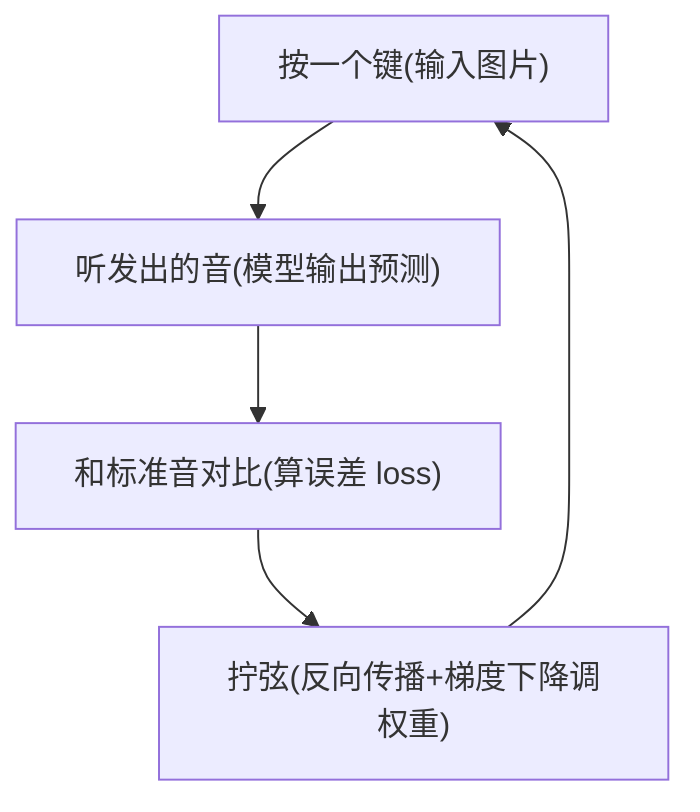

反向传播的直觉(不讲数学):

```text
"反向传播" = "算出每个权重对误差负多大责任,让责任大的权重调整得多一点"

想象工厂出了残次品:
    反向传播 = 追溯每个工序对残次品负多大责任
    梯度下降 = 让责任大的工序调整得多,责任小的调整得少
    训练循环 = 反复生产,反复追溯,反复调整,直到残次品率足够低

背后的数学是链式法则求导,但作为工程师
不需要会推数学公式,只需要理解这个直觉。
```

为什么训练慢:

```text
YOLOv8n 有 300 万个权重
每次调整都要把 300 万个权重都过一遍
调一次不够,要调几千次
每次还要在几百张图上算误差
总计算量 = 300万 × 几千 × 几百 = 天文数字

这就是为什么训练要 GPU 几小时到几天
而推理只要几十毫秒——计算量差几个数量级。
```

## 4.3 迁移学习:为什么本项目零训练

核心概念:

```text
别人已经花大价钱在 COCO 数据集上训练好了 YOLOv8n
这个权重里"封装"了识别 80 类物体的通用能力
你直接拿来用,等于免费获得了这些能力
```

类比:

```text
一个学了 10 年英语的人,再学 1 个月法语,比从零学法语的人快得多
他已经掌握了"如何学习语言"这件事本身

YOLOv8n 在 COCO 上训练后:
    它掌握了"如何识别物体"的通用视觉特征(边缘、纹理、形状)
```

COCO 数据集为什么重要:

```text
COCO 数据集:
    80 类常见物体(人、车、猫、狗、杯子、椅子...)
    33 万张标注图片
    是视觉 AI 的"通用语料库"

在 COCO 上训练的 YOLOv8n:
    学会了 "person" 类(class 0)
    本项目只需要 person → 直接拿来用
    不用自己采数据、标注、训练
```

本项目的工作:

```text
① 加载 yolov8n.pt(别人训练好的权重)  ← 零训练成本
② ESP32 上传 JPEG
③ 推理(用权重算输出)
④ 后处理(过滤 person 类,数框)        ← 我们的代码
⑤ 返回 person_count

整个项目零训练。这就是为什么一周能搞定——
省掉了 AI 工程最重的两件事:数据标注 + 训练调试。
```

## 4.4 什么时候必须训练(决策树)

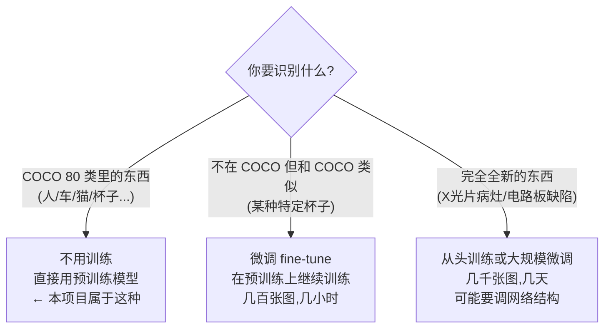

## 4.5 float32 vs int8:量化只在推理做

```text
              训练                    推理
精度要求       必须 float32            可以 int8(量化)
原因           梯度计算要高精度         省内存,精度损失可接受
内存           大(要装 batch+梯度)     小(一次一张图)
GPU            必需                    可选(CPU 也能跑)
频率           偶尔一次                每帧都做
```

为什么训练不能 int8:

```text
梯度是"权重往哪个方向调、调多少"的指示
梯度往往非常小(比如 0.00001)
int8 只能表示 -128~127 的整数,精度太粗
用 int8 算梯度,小数全被截断,训练直接发散崩溃
```

为什么推理可以 int8:

```text
推理只是"用现有权重算一遍输出",不涉及梯度
输入从 float32 量化到 int8,精度损失 1-3 个百分点
但模型体积缩小 4 倍,速度快 2-3 倍
这种 tradeoff 在边缘部署上非常值
```

这直接解释几个工程现象:

```text
为什么训练在 GPU 服务器上做,推理可以在 CPU/边缘设备做
为什么量化(int8)只在推理时做,训练必须 float32
为什么本项目能在笔记本 CPU 上跑(只做推理)
```

## 4.6 站3 小结

```text
1. 训练找权重,推理用权重,两者是完全不同的工程
2. 本项目零训练,因为 COCO 预训练封装了通用视觉能力(迁移学习)
3. 训练慢是因为 300万×几千×几百 的天文计算量
4. 微调 = 基于预训练继续训练,只需少量数据(Phase 3 走这条路)
5. 训练必须 float32,推理可 int8——这就是量化只用在推理端的根本原因
```

---

# 5. 站4:云端 AI vs 边缘 AI

这一站是整个认知体系含金量最高的一站,解决一个纠结了很久的问题:

```text
"云端 AI 和边缘 AI 到底差在哪?"
"为什么边缘部署'高级'?到底难在哪?"
"为什么本项目先做云端,不做边缘?"
```

## 5.1 先破除最大的迷思

判断:

```text
云端 AI 和边缘 AI 的唯一本质区别,就是"模型在哪台机器上跑"
除此之外,模型本身、训练过程、推理逻辑——全部一样。
```

```text
同一个 yolov8n.pt 权重文件(300万个数字)

  ┌─ 放在云端 PC 上跑  → 叫"云端 AI"
  │
  └─ 放在 ESP32 上跑   → 叫"边缘 AI"

就这么简单。没有魔法,没有本质差异。
```

那为什么边缘部署"难"?为什么它"有含金量"?

```text
答案在于:同一套权重,在不同机器上跑,速度差几个数量级。
```

## 5.2 部署的光谱

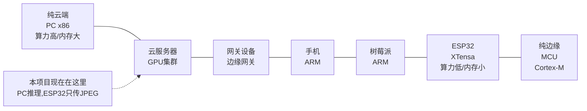

关键认知:

```text
"云端"和"边缘"不是非黑即白,是一个光谱
本项目"PC 同局域网"算"轻量云端"或"边缘网关"
但推理在 PC 上,所以本质是云端 AI
真正的边缘 AI = 推理在 ESP32/MCU 上发生
```

## 5.3 边缘部署的三重物理约束

边缘部署的难,不是"代码难写",而是物理约束。

### 约束1:算力(最直观)

```text
推理 = 反复算矩阵乘法
矩阵乘法速度 = 算力(TOPS,每秒万亿次运算)

PC CPU(i5/i7):        ~100 TOPS     →  YOLOv8n 推理 ~300ms
ESP32-S3(240MHz):     ~0.5 TOPS     →  YOLOv8n 推理 ~30秒(估算)
                                                  ↑
                                          慢100倍,根本不能用

这就是边缘部署的头号杀手
```

### 约束2:内存(本项目已经踩过)

```text
YOLOv8n float32 模型大小: ~12MB
ESP32-S3 内部 SRAM:       ~512KB(无PSRAM时)
                         ↑
                    模型都装不下!
```

这就是为什么"无 PSRAM 做视觉边缘部署成功率 30%"——连模型都塞不进去。

### 约束3:能耗(移动/电池场景)

```text
PC:        插电,功耗 100W+,不在乎
ESP32:     电池供电,功耗 ~50mA,必须省电
```

边缘设备常常电池供电,AI 推理会快速耗尽电池。这要求模型必须极度精简。

### 三重约束的叠加效应

```text
算力弱 → 必须用小模型         → 精度下降
内存小 → 必须量化压缩(int8)   → 精度再下降
能耗限 → 必须减少推理频率     → 响应变慢

结果:边缘 AI 在精度、速度、功能上都妥协

这就是边缘部署"有含金量"的真相——
不是"用了一个高级技术",
而是"在严苛约束下做出工程妥协,还能跑出可用结果"。
这种约束下的工程能力,才是面试官看重的。
```

## 5.4 模型压缩三技术(概念理解)

为了对抗三重约束,工程师发明了三大模型压缩技术。只需知道概念,不用会做(那是 Phase 3 的事)。

### 技术1:量化(Quantization)——最核心

```text
float32 权重(4字节/个) → int8 权重(1字节/个)

效果:
  模型体积: 12MB → 3MB(缩小4倍)
  内存占用: 同样缩小4倍
  推理速度: 快2-3倍(int8运算比float快)
  精度损失: 掉1-3个百分点(可接受)

量化是边缘部署最核心的技术
你之前听过的"int8 量化""TFLite-Micro""ESP-DL",核心都是这个
```

### 技术2:剪枝(Pruning)

```text
找出模型里"贡献小"的权重(接近0的),直接删掉

效果:
  模型变小、变快
  精度损失取决于剪多少
```

### 技术3:知识蒸馏(Knowledge Distillation)

```text
用大模型(老师)教小模型(学生)
小模型学到接近大模型的精度,但体积小很多
```

| 技术 | 难度 | 效果 | 本项目会用吗 |
|------|------|------|------------|
| 量化 | 中 | 压缩4倍,速度提升 | Phase 3 必用 |
| 剪枝 | 高 | 看情况 | Phase 3 可选 |
| 蒸馏 | 高 | 精度提升 | Phase 3 可选 |

## 5.5 本项目对比两种方案

### Phase 2(云端方案)

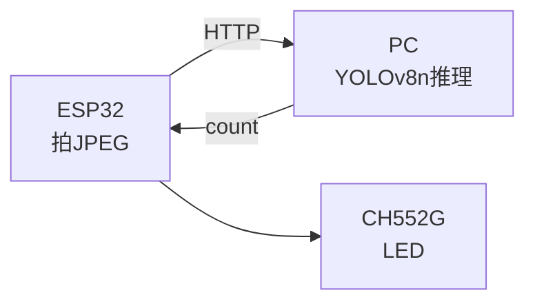

```text
优点:
  ✓ 模型大小无限制(PC内存大)
  ✓ 推理快(PC算力强)
  ✓ 开发简单(不用量化/压缩)
  ✓ 精度高(用完整float32模型)

缺点:
  ✗ 依赖网络(断网就废)
  ✗ 有网络延迟(上传+推理+回传)
  ✗ 数据要传出去(隐私问题)
  ✗ 需要一台常开的PC
```

### 假设的 Phase 3(边缘方案)

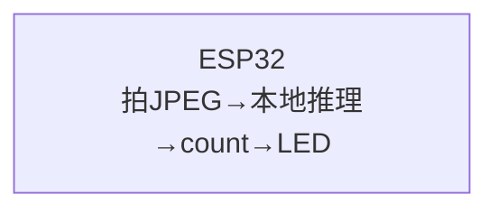

```text
优点:
  ✓ 无需网络(完全离线)
  ✓ 无网络延迟(本地即时)
  ✓ 数据不出端(隐私好)
  ✓ 不需要PC

缺点:
  ✗ 模型必须极小(量化+剪枝后<200KB)
  ✗ 推理慢(ESP32算力弱,可能1-5秒)
  ✗ 精度下降(int8量化+小模型)
  ✗ 开发极难(内存调优、工具链调试)
```

### 核心洞察:为什么本项目先做云端

```text
云端方案的"缺点"(依赖网络/有延迟)
   → 是业务层面的问题,可以优化但不是技术死局

边缘方案的"缺点"(模型装不下/推理太慢)
   → 是物理层面的硬约束,可能根本做不出来(尤其无PSRAM)

云端方案的挑战是"工程优化",一定能做出来
边缘方案的挑战是"物理约束",可能翻车

这就是"先做云端,稳定优先"的根本原因。
```

## 5.6 端云协同(最终架构愿景)

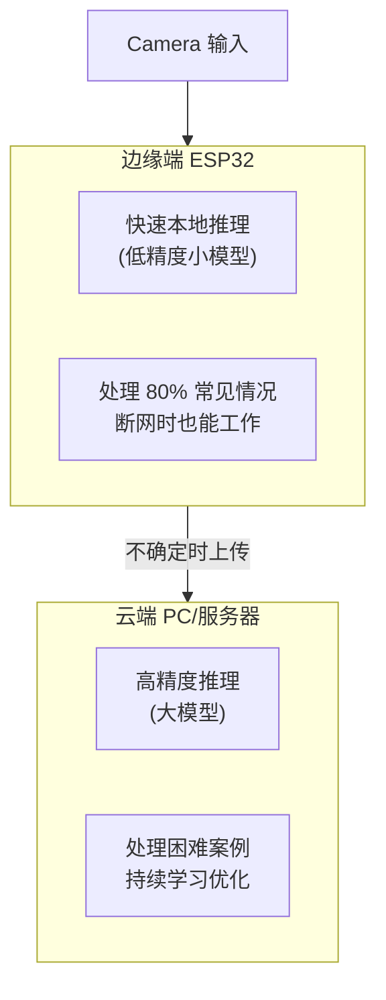

端云协同的核心思想:

```text
边缘做"快速粗筛":低延迟、省流量、保护隐私、断网可用
云端做"精确兜底":高精度、复杂场景、模型更新
两者协作,而不是非此即彼
```

这就是本项目最终的叙事方向——

```text
不是"我做了云端"或"我做了边缘"
而是"我理解了端云协同的架构思想,知道什么时候该用哪种方案"

面试讲到这里,已经超越了 95% 的同届生。
```

## 5.7 站4 小结

```text
1. 云端和边缘的唯一本质区别,是模型在哪台机器上跑
2. 边缘部署难,是因为 ESP32 的算力/内存/能耗三重物理约束
3. 三大压缩技术:量化(核心)、剪枝、蒸馏
4. 为什么本项目先做云端:云端挑战是工程优化(一定能做),边缘是物理约束(可能翻车)
5. 终极架构是端云协同——边缘快速粗筛,云端精确兜底
```

---

# 6. 站5:FastAPI 服务端架构

这一站解决一个问题:

```text
"FastAPI 怎么把 YOLO 包成一个可调用的服务?"
"新手最容易踩的服务端坑有哪些?"
```

## 6.1 为什么用 FastAPI

| 框架 | 异步支持 | 性能 | 文档 | 学习曲线 |
|------|---------|------|------|---------|
| FastAPI | 原生 async | 极高(接近 Go) | 自动生成 OpenAPI | 低 |
| Flask | 需插件 | 中 | 手动写 | 低 |
| Django | 一般 | 中 | 内置后台 | 高 |

选 FastAPI 的核心理由:

```text
1. 原生异步——服务端要同时处理 HTTP请求+推理+存图+统计,异步是刚需
2. Pydantic 数据校验——请求/响应自动校验,接口契约清晰(工业级思维)
3. 自动文档——启动后访问 /docs 就有 Swagger UI,调试极方便
```

## 6.2 新手第一大坑:模型加载策略

这是 90% 新生都会犯的致命错误。

### 错误做法(每请求加载模型)

```python
@app.post("/api/detect")
async def detect(image: UploadFile):
    model = YOLO("yolov8n.pt")     # ← 每次请求都加载模型!
    results = model(await image.read())
    return {"count": len(results)}
```

后果:

```text
每次请求都从磁盘加载 12MB 模型文件
每次耗时几秒
服务基本不可用
```

### 正确做法(启动时加载一次)

```python
# 全局加载一次
detector = PersonDetector("yolov8n.pt")   # 启动时加载

@app.post("/api/detect")
async def detect(image: UploadFile):
    results = detector.infer(await image.read())   # 只推理,不加载
    return {"count": results}
```

工程认知:

```text
模型加载(初始化权重)和模型推理(用权重计算)是两个完全不同的操作
加载极慢,推理很快
服务端架构必须"加载一次,推理多次"

这和站3 学的认知呼应——
推理是用权重,加载是把权重从磁盘读到内存
你不会每次做饭都重新买锅。
```

## 6.3 同步 vs 异步:最容易翻车的细节

这是教程不讲、但面试必问的细节。

### 问题根源

```text
YOLO 推理是 CPU 密集型同步操作——它会占满一个 CPU 核
期间那个核什么都干不了
```

错误代码:

```python
@app.post("/api/detect")
async def detect(image: UploadFile):        # ← async def!
    results = model(image)                   # ← 同步阻塞调用!
    return results
```

```text
这段代码看起来没问题,但有致命缺陷:
    async def 告诉 FastAPI"这是异步函数"
    但 model(image) 是同步阻塞的(CPU密集)
    结果:整个事件循环被阻塞,其他请求全部排队等待
```

### 正确做法

方案A:用 run_in_threadpool 把推理丢到线程池

```python
from fastapi.concurrency import run_in_threadpool

@app.post("/api/detect")
async def detect(image: UploadFile):
    results = await run_in_threadpool(detector.infer, image_bytes)
    return results
```

方案B(更简单):直接用 def,不是 async def

```python
@app.post("/api/detect")
def detect(image: UploadFile):              # ← 普通 def!
    results = detector.infer(image_bytes)   # FastAPI 会自动放到线程池
    return results
```

FastAPI 的机制:

```text
async def → 在主事件循环跑(适合 IO 密集,如等数据库)
def       → 自动放线程池跑(适合 CPU 密集,如推理)
```

工程认知:

```text
IO 密集用 async,CPU 密集用线程池。搞反了会拖垮整个服务。
这是新手和工程师的分水岭。
面试官问"你的服务能处理并发请求吗",这就是答案。
```

## 6.4 PersonDetector 类封装

好的架构是把推理逻辑封装成类,不写在路由里。

```python
# detector.py
class PersonDetector:
    def __init__(self, model_path: str, imgsz=320, conf=0.4):
        self.model = YOLO(model_path)    # 启动时加载一次
        self.imgsz = imgsz
        self.conf = conf

    def infer(self, jpeg_bytes: bytes) -> dict:
        # 统一预处理(站2 学过的单一真理源)
        img = self._preprocess(jpeg_bytes)
        # 推理
        results = self.model(img, imgsz=self.imgsz, conf=self.conf, classes=[0])
        # 后处理(站1 学过的三步)
        count = len(results[0].boxes)
        return {"person_count": count, "latency_ms": ...}

    def _preprocess(self, jpeg_bytes: bytes):
        # 站2 的统一预处理函数
        ...
```

为什么封装成类(工程认知):

```text
1. 关注点分离:路由只管 HTTP,推理逻辑在类里
2. 配置集中:imgsz、conf 是类的参数,改一处生效
3. 可测试:可以单独 import PersonDetector 测试,不启动 HTTP 服务
4. 可替换:明天换 ONNX 推理,只改类内部,路由不动

这就是软件工程的封装原则在 AI 工程里的体现。
```

## 6.5 Pydantic 接口契约

```python
# schemas.py —— 用 Pydantic 定义契约
from pydantic import BaseModel

class DetectResponse(BaseModel):
    status: str                    # "ok" | "error"
    person_count: int              # 0-99
    latency_ms: int                # 推理耗时
    image_id: str                  # 唯一ID(便于排错)
    model: str                     # 用的什么模型
    conf_threshold: float          # 当前阈值(透明化)
```

为什么用 Pydantic(工程认知):

```text
1. 自动校验:传错类型会报错,不会静默 bug
2. 自动文档:/docs 里自动生成接口文档
3. 序列化:Python 对象 ↔ JSON 自动转换

这就是"接口契约"——客户端和服务端都遵守同一份定义
ESP32 代码也按这个契约解析 JSON。
```

## 6.6 可观测性

新手的服务跑起来就不管了。工程师知道服务必须可观测。

```python
# stats.py —— 全局统计
class Stats:
    def __init__(self):
        self.total = 0
        self.success = 0
        self.fail = 0
        self.latencies = []        # 最近100次的延迟

    def record(self, success: bool, latency_ms: int):
        ...

stats = Stats()

# main.py —— 健康检查端点
@app.get("/api/health")
def health():
    return {"status": "ok", "model_loaded": detector.is_ready()}

@app.get("/api/stats")
def get_stats():
    return stats.summary()
```

工程认知:

```text
可观测性不是花活,是工业系统的刚需
ESP32 的容错策略(断网检测)就依赖 /api/health
没有可观测性,就没有可靠的容错。
```

## 6.7 站5 小结

```text
1. 模型启动时加载一次,不是每请求加载——新手第一大坑
2. CPU 密集(推理)用线程池,IO 密集用 async——搞反会拖垮服务
3. 推理逻辑封装成类——关注点分离、可测试、可替换
4. 用 Pydantic 定义请求/响应契约——工业级接口设计
5. 可观测性是刚需——健康检查、统计端点,支持 ESP32 容错
```

---

# 7. 站6:模型优化四档

这一站解决一个问题:

```text
"怎么把推理压进 1 秒的延迟预算?"
"优化该做到什么程度就停?"
```

## 7.1 延迟预算回顾

```text
Camera 出 JPEG:    ~50ms
HTTP 上传:        ~100-200ms
YOLO 推理:        ~300-500ms  ← 优化重点
JSON 回传:        ~10ms
ESP32 处理+CDC:   ~50ms
─────────────────────────────
合计:             ~500-800ms

推理是最大头,优化它能直接压低总延迟。
```

## 7.2 四档优化(由易到难)

### L1:基础推理(零优化)

```python
model = YOLO("yolov8n.pt")
results = model(img)                    # 默认 imgsz=640, 所有80类
```

延迟:**400-600ms**(CPU)。这是新手的起点。

### L2:参数优化(5分钟,省50%+)

```python
results = model(img, imgsz=320, conf=0.4, classes=[0])
#                      ↑          ↑          ↑
#                   降分辨率   提阈值     只检测person
```

三个参数的效果:

```text
优化                          原因                                    效果
──────────────────────       ──────────────────────                ──────
imgsz=320(从640降)            推理计算量和面积成正比,320²/640²=1/4   省70%时间
classes=[0](只检测person)     后处理只过滤1类,跳过79类                省30%后处理
conf=0.4(从0.25提)            更少候选框进入NMS                       省一点NMS时间
```

L2 优化后延迟:**150-250ms**。

工程认知:

```text
imgsz 是精度/延迟的最大 tradeoff 杠杆
从 640 降到 320,精度可能掉几个点(小目标漏检),但速度快 3-4 倍
这就是"JPEG质量对比表"的姐妹篇——"imgsz 对比表"
```

### L3:导出 ONNX(30分钟,再省30-50%)

```python
# 导出(一次性)
model.export(format="onnx", imgsz=320)

# 推理(用onnxruntime)
import onnxruntime as ort
session = ort.InferenceSession("yolov8n.onnx")
results = session.run(None, {input_name: preprocessed_img})
```

为什么 ONNX 更快:

```text
.pt 是 PyTorch 格式,推理时要经过 PyTorch 运行时(有开销)
.onnx 是独立格式,用 onnxruntime 直接跑(去掉了框架开销)
onnxruntime 有 CPU 指令集优化(AVX2/SSE)
```

L3 优化后延迟:**80-150ms**。

工程认知:

```text
ONNX 是模型交换的"通用语言"
训练用 PyTorch/TF,部署转 ONNX,是工业标准流程。
```

### L4:OpenVINO / TensorRT(高阶,可选)

```text
OpenVINO:  Intel CPU 专用加速,能再快 1.5-2 倍
TensorRT:  NVIDIA GPU 专用加速,能快 3-5 倍

本项目场景(笔记本 CPU):如果 L3 还不够快,才上 OpenVINO
否则 L3 已经够了。
```

## 7.3 优化决策树

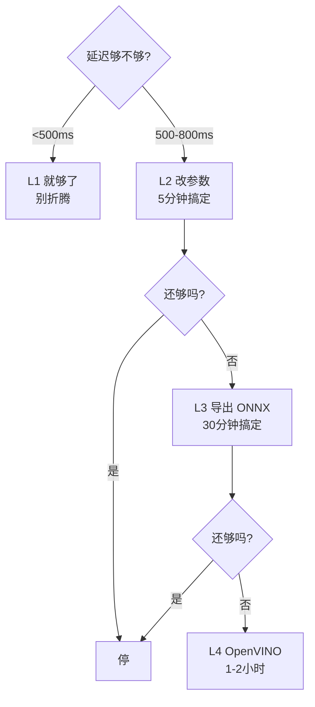

工程智慧:

```text
用最简单的优化达到目标,就别上更复杂的。
L2 够了就别上 L3。
```

## 7.4 A/B 对比表——求职证据

每个优化档都记录数据,最后产出这张表:

```text
┌─────────┬────────┬──────────┬────────────┬──────────┐
│ 优化档   │ imgsz  │ 推理延迟  │ person准确率 │ 模型大小 │
├─────────┼────────┼──────────┼────────────┼──────────┤
│ L1      │ 640    │ 480ms    │ 95%        │ 12MB     │
│ L2      │ 320    │ 180ms    │ 89%        │ 12MB     │
│ L3 ONNX │ 320    │ 95ms     │ 89%        │ 8MB      │
│ L4 OV   │ 320    │ 55ms     │ 89%        │ 8MB      │
└─────────┴────────┴──────────┴────────────┴──────────┘
```

这张表就是简历上"工程深度"的硬证据——

```text
说明你会做 tradeoff,不是只会调库。
```

## 7.5 站6 小结

```text
1. 四档优化:L1→L2→L3→L4,逐级优化
2. imgsz 是最大杠杆(从640降到320,快3-4倍)
3. ONNX 是部署工业标准(.pt→onnx,去框架开销)
4. 够用就停的工程智慧(L2 够就别上 L3)
5. 每级优化都记数据,产出对比表(求职硬证据)
```

---

# 8. 本项目认知地图(七站串联)

## 8.1 完整认知链条

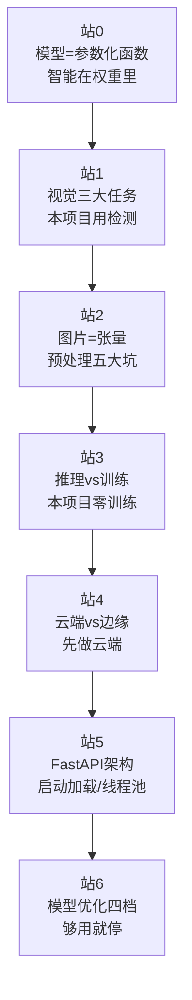

## 8.2 对应到项目的每个决策点

```text
站0  → 为什么用 yolov8n.pt(权重封装智能,直接拿来用)
站1  → 为什么选 YOLO(需求是数人数,必须检测)
站2  → 为什么 ESP32 只传 JPEG(预处理全在服务端,端云分工)
站3  → 为什么零训练(迁移学习,COCO 预训练已有 person 类)
站4  → 为什么先做云端(物理约束风险高,云端一定能做出来)
站5  → 为什么模型启动加载一次(加载慢,推理快)
站6  → 为什么用 imgsz=320(精度/延迟 tradeoff 的最大杠杆)
```

---

# 9. 对打中踩过的坑(成长记录)

这部分记录学习过程中真实犯过的认知错误,以及纠正后的工程铁律。

## 9.1 "权重是通用的"——错了

错误认知:

```text
"权重就是数字,数字是通用的,所以 yolov8s 的权重能塞到 yolov8n 里用"
```

正确认知:

```text
权重 = 数值 + 位置
每一个权重都绑定在"特定结构"的"特定位置"上
换了结构,位置就不存在了
```

教训:

```text
权重绑定结构。同结构可换权重,换结构得重写。
```

## 9.2 "conf 降到 0.1"——错了

场景:

```text
画面里有人,但 YOLO 给出最大概率只有 0.35(低于 0.4 阈值)
导致 person_count=0
```

错误处理:

```text
"把 conf 降到 0.1,就能检测到了"
```

为什么错:

```text
室内近距离场景,YOLOv8n 对真实的人给出的概率通常 >0.5
如果它只给出 0.35,说明根因不在阈值,而在别处
把 conf 降到 0.1 会立刻遇到灾难:
    真人(概率0.35)     → 被检测到 ✓
    椅子靠背(概率0.15) → 被误检为人 ✗
    衣架上的衣服(0.18) → 被误检为人 ✗
    墙上的海报(0.12)   → 被误检为人 ✗
    结果:person_count=4,LED 乱亮

用调阈值掩盖了问题,换来的是更严重的误检爆炸。
```

正确的工程思维:

```text
第一步(诊断):存下误检/漏检那一帧的 JPEG,看到底什么情况
第二步(对症):
    输入分辨率太小 → 提高 imgsz
    场景不适配     → 微调或换数据
    图像质量问题   → 调摄像头/JPEG质量
    预处理错误     → 修代码
第三步(验证):改完后再跑 30 分钟,确认问题解决

阈值是"在已经足够好的基础上做微调",不是"用来救一个本就有问题的系统"。
```

## 9.3 "NMS IoU 过低重复计数"——概念反了

错误认知:

```text
"IoU 阈值过低 → 同一人重复计数"
```

正确认知:

```text
NMS 规则:对概率最高的框 B,删除所有和它 IoU > threshold 的其他框

阈值 = 0.9(过高):重叠 > 90% 才删 → 删得很少 → 同一人重复计数
阈值 = 0.1(过低):重叠 > 10% 就删 → 删得太多 → 相邻不同人被误删 → 漏人

所以"重复计数"是 IoU 阈值过高导致的,不是过低。
```

## 9.4 工程铁律:诊断先于治疗

这是反复犯错后总结出的最重要的一条:

```text
当系统表现异常,先查根因,不要靠调阈值/调参数掩盖。

"诊断先于治疗。永远先看'是什么被误检',再决定'怎么治'。"
直接调参数是新手思维,先诊断再对症是工程师思维。
```

---

# 10. 面试可讲的关键认知(求职浓缩)

10 条核心认知,每条一句话。面试前重点过一遍。

```text
1. AI 模型本质是参数化函数,"智能"在权重里,不在函数运算里。

2. 模型选型从需求倒推:本项目"数人数"必须用检测,所以选 YOLOv8n。

3. YOLO 只吐数字,所有"语义"(类别/人数)都是后处理代码赋予的。

4. 后处理三步:conf 过滤 → 类别判定 → NMS 去重;顺序不能乱(性能+正确性双重依赖)。

5. conf 管误检/漏检,NMS IoU 管重复/合并,两者解决完全不同的问题。

6. 预处理 = 把任意图片变成"模型训练时见过的形状和范围",做错 = 权重失效。

7. 测试和生产必须用同一条预处理函数(单一真理源),否则精度会莫名其妙掉一半。

8. 本项目零训练,因为 COCO 预训练已封装通用视觉能力(迁移学习);Phase 3 才需要微调。

9. 云端和边缘的唯一本质区别是模型在哪跑;边缘难在三重物理约束,所以本项目先做云端。

10. 模型优化四档 L1→L2→L3→L4,够用就停;imgsz 是最大杠杆,每档优化都记数据产出对比表。
```

---

# 11. 写在最后

这份笔记记录的是"认知",不是"代码"。

```text
代码会变,框架会升级,模型会换代
但"模型=参数化函数""诊断先于治疗""测试生产同路径"这些认知不会过时
```

Phase 2 的代码,要建立在这些认知之上。

```text
认知不清,代码写得再多也是乱调参数。
认知扎实,遇到任何新框架、新模型,你都能快速定位它属于哪一层、该怎么用。
```

下一步:

```text
这份笔记完成后,开始写 Phase 2 的 HLD 文档
把架构决策(接口契约/决策层/容错/延迟预算)沉淀成正式设计文档
然后才是写代码。
```

---

(全文完)

