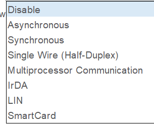
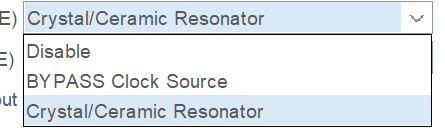
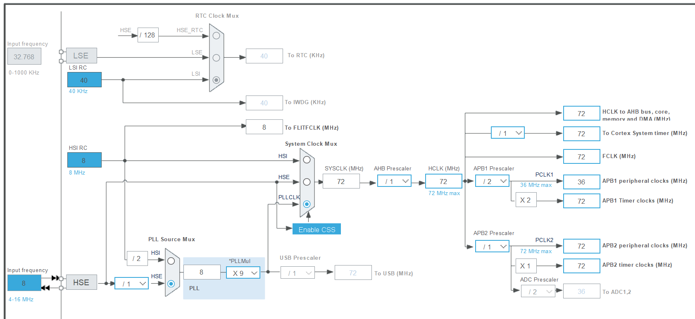

### USART模式的认知

### . 最核心、最常用的模式

- **Asynchronous (异步通信)**
    
    - **含义：** 就是我们平时口中常说的 **“普通串口” (UART)**。它不需要时钟线，只靠两根数据线（TX 发送，RX 接收）和一根地线（GND），双方约定好相同的波特率（比如 115200）就能通信。
        
    - **应用场景：** **极其广泛！** 你用来打印 printf 调试信息、连接蓝牙模块（HC-05）、WiFi模块（ESP8266）、GPS模块、使用 CH340 连电脑，**全部都是选这个选项**。
        

---

### 🛠️ 2. 其他特殊模式（按需了解即可）

- **Disable (禁用)**
    
    - **含义：** 关闭这个外设。
        
    - **应用场景：** 默认状态。当你不使用这个串口时，关闭它可以省电，并且释放对应的引脚给其他功能使用。
        
- **Synchronous (同步通信)**
    
    - **含义：** 变成了 **USART**（多了一个 S 代表同步）。除了 TX 和 RX，还会多出一根时钟线（CK）。数据是跟着时钟信号的节拍来传输的，速度可以更快。
        
    - **应用场景：** 现在很少用了。因为如果要用同步通信，大家通常会直接去用 SPI 或 I2C 接口。偶尔用来连接一些老式的移位寄存器或特定的同步芯片。
        
- **Single Wire (Half-Duplex) (单线半双工)**
    
    - **含义：** 把 TX 和 RX 合并到**一根信号线**上。就像对讲机一样，两边都能说话，但同一时刻只能有一个人说（不能同时收发）。
        
    - **应用场景：** 当单片机引脚极度紧张，或者板子之间连线极少时使用。需要代码里严格控制谁发谁收，用得不多。
        
- **Multiprocessor Communication (多处理器通信)**
    
    - **含义：** 允许把多个 STM32 挂在同一条串口总线上（主从模式）。它利用额外的第 9 位数据来区分发的是“地址”还是“数据”。如果从机发现地址不是自己的，就会硬件进入静音睡眠模式，不浪费 CPU 去处理。
        
    - **应用场景：** 早期的多机通信网络。但现在如果要做多机通信，工业上一般直接用 **RS-485** 或 **CAN 总线**了，这个模式比较鸡肋。
        
- **IrDA (红外数据协议)**
    
    - **含义：** 硬件直接支持红外线通信的调制解调。它会把串口的高低电平转换成适合红外发射管发出的极短脉冲。
        
    - **应用场景：** 做红外遥控器、早期的红外数据传输（以前的老手机互传数据）。现在大多被蓝牙取代了。
        
- **LIN (局域互联网络)**
    
    - **含义：** 一种低成本的串行通信总线标准。STM32 硬件帮你处理了 LIN 协议要求的特殊同步间隔和断开信号。
        
    - **应用场景：** **汽车电子专属**。汽车里控制车窗升降、雨刮器、后视镜调节等不需要太快速度的地方，大量使用 LIN 总线。如果你不做汽车电子，基本碰不到。
        
- **SmartCard (智能卡)**
    
    - **含义：** 支持 ISO 7816-3 标准。STM32 硬件会输出特定频率的时钟去驱动智能卡。
        
    - **应用场景：** 做 POS 机读银行卡、读 SIM 卡、读门禁 IC 卡芯片的时候才会用到

#### 开启外部时钟的认知

PD0 / OSC_IN
PD1 / OSC_OUT

