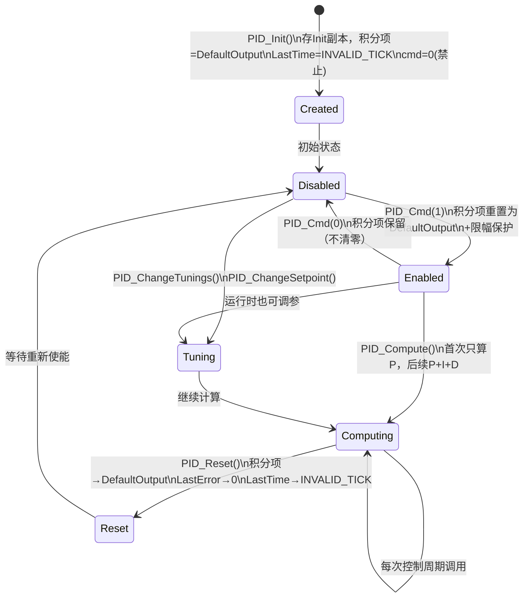
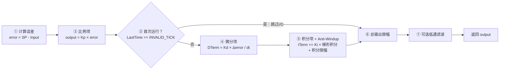

---
aliases:
  - PID库设计
  - PID Library
  - 控制器库
tags:
  - 嵌入式/控制算法
  - STM32/PID
  - 工程设计模式
  - 平衡小车
related:
  - "[[5.PID模块]]"
  - "[[PID算法-闭环控制]]"
  - "[[10.源码和复刻项目的对比]]"
  - "[[编码器-算法]]"
date: 2026-05-11
status: 🌿草稿
---

# PID 库的工程架构设计

> [!abstract] 定位
> 这篇笔记不重复 PID 理论和调参方法（理论部分见 [[5.PID模块]]，基础概念和 Anti-Windup/Derivative-on-Measurement 的入门解释见 [[PID算法-闭环控制]]）。这里聚焦一个问题：**如何把 PID 从"一个函数"设计成"一个工业级库"**——数据结构怎么选型、生命周期怎么管理、防护机制怎么布局、以及和 [[PID算法-闭环控制]] 里那套自写 PID 相比，铁头山羊的原版库多做了哪些工程决策。

---

## 一、设计哲学：配置与运行时分离

### 1.1 核心原则

PID 库的第一条设计规则：**"出厂配方"和"当前状态"必须分开存储**。

这和 [[编码器-算法]] 里的设计哲学完全一致——`encoder_cfg_t`（只读硬件参数）与 `encoder_wheel_sample_t`（运行时状态）分离。PID 库用两个结构体做了同样的事：

| 结构体 | 职责 | 生命周期 | 类比 |
| --- | --- | --- | --- |
| `PID_InitTypeDef` | 出厂配方（只读配置） | 初始化后不变 | 手机的"恢复出厂设置"快照 |
| `PID_TypeDef` | 运行时对象（完整状态） | 每周期更新 | 手机的"当前运行状态" |

> [!note] 为什么要存一份 Init 副本？
> `PID_Init()` 里做了 `PID->Init = *PID_InitStruct;`——这是结构体整体赋值。用户传入的临时变量在函数返回后就没了，用 `Init` 存一份副本，后续 `PID_Reset()` 才能从安全起点恢复。如果没有这个副本，复位时要么无法恢复，要么需要外部重新传参。

### 1.2 与 [[PID算法-闭环控制]] 的设计对比

[[PID算法-闭环控制]] 里的 `PID_TypeDef` 只有一个结构体，参数和状态混在一起：

```c
// [[PID算法-闭环控制]] 的设计：参数和状态不分离
typedef struct {
    float Kp, Ki, Kd, K_ff;     // 调参参数
    float target_val, actual_val; // 运行时状态
    float integral;               // 运行时状态
    float output_limit;           // 配置参数
    // ... 混在一起
} PID_TypeDef;
```

铁头山羊的设计多了一层 `Init` 嵌套：

```c
// 铁头山羊的设计：配置与状态分离
typedef struct {
    PID_InitTypeDef Init;  // ← 出厂配方（永远不变）
    float Kp, Ki, Kd;      // ← 运行时可调（可以在线改）
    float ITerm;            // ← 运行时累积
    float Setpoint;         // ← 运行时可调
    // ...
} PID_TypeDef;
```

> [!tip] 工程直觉
> 如果你的 PID 永远不需要"复位到初始状态"，那 [[PID算法-闭环控制]] 的单结构体设计就够了。但如果你的系统有"使能/失能/复位"的需求（比如平衡车摔倒后重新起立），就必须存一份初始配置的副本。

---

## 二、数据结构逐字段拆解

### 2.1 PID_InitTypeDef — 出厂配方

```c
typedef struct {
    float Kp;               // 比例系数
    float Ki;               // 积分系数
    float Kd;               // 微分系数
    float Setpoint;         // 初始设定值
    float OutputUpperLimit; // 输出上限
    float OutputLowerLimit; // 输出下限
    float DefaultOutput;    // 默认输出（积分项的安全起点）
} PID_InitTypeDef;
```

| 字段 | 含义 | 工程考量 |
| --- | --- | --- |
| `Kp/Ki/Kd` | PID 三参数 | 初始值，运行时可通过 `PID_ChangeTunings()` 覆盖 |
| `Setpoint` | 初始目标值 | 运行时可通过 `PID_ChangeSetpoint()` 覆盖 |
| `OutputUpperLimit/LowerLimit` | 输出上下限 | 映射到电机驱动器的物理能力，不是理论电压范围 |
| `DefaultOutput` | 积分项初始值 | **不是0**——稳态时 PID 输出可能不为0（见下文） |

> [!important] DefaultOutput 为什么不是 0？
> 速度环稳态时，电机需要持续输出一个电压来对抗摩擦力维持目标速度。如果复位时积分项归零，电机使能瞬间会"掉一下"再恢复。用 `DefaultOutput` 作为积分项的安全起点，可以避免这个抖动。
>
> 这在 [[PID算法-闭环控制]] 的实现里没有体现——那里的 `PID_Init()` 直接把 `integral` 清零。对于简单的速度控制可以接受，但对于需要频繁使能/失能的平衡车场景，这就是一个可感知的抖动来源。

### 2.2 PID_TypeDef — 运行时对象

```c
typedef struct {
    PID_InitTypeDef Init;      // 出厂配方副本
    uint8_t cmd;               // 使能标志
    uint64_t LastTime;         // 上次计算时间（us）
    float ITerm;               // 积分项累计值
    float DTerm;               // 微分项当前值
    float LastInput;           // 上次输入值
    float LastError;           // 上次误差值
    float Kp, Ki, Kd;          // 运行时可调参数
    float OutputUpperLimit;    // 运行时可调限幅
    float OutputLowerLimit;
    float Setpoint;            // 运行时可调设定值
    LPF_TypeDef Lpf;           // 可选的低通滤波器
    uint8_t LpfCmd;            // 低通滤波器开关
} PID_TypeDef;
```

| 字段 | 用途 | 与 [[PID算法-闭环控制]] 的区别 |
| --- | --- | --- |
| `Init` | 出厂配方备份 | [[PID算法-闭环控制]] 没有这个机制 |
| `cmd` | 运行时使能/失能 | [[PID算法-闭环控制]] 没有，无法在运行时开关 |
| `LastTime` | 动态计算 Δt | [[PID算法-闭环控制]] 假设固定 dt，不存时间戳 |
| `ITerm` | 积分项单独存储 | [[PID算法-闭环控制]] 也单独存了 `integral` |
| `DTerm` | 微分项单独存储 | 方便调试时观察，[[PID算法-闭环控制]] 没有 |
| `Lpf` | 级联低通滤波器 | [[PID算法-闭环控制]] 没有 |
| `LpfCmd` | 滤波器开关 | 运行时可开关，灵活 |

> [!note] 动态 Δt vs 固定 dt
> [[PID算法-闭环控制]] 的实现假设 PID 在固定 10ms 中断中被调用，所以不需要存时间戳。铁头山羊的设计用 `LastTime` 动态计算 `dt`——更通用，不依赖调用者的中断周期。代价是每次计算多一次减法和乘法（对于没有 FPU 的 STM32F103 约多 20~40 个时钟周期）。

---

## 三、生命周期管理

### 3.1 状态机全景



### 3.2 关键生命周期函数

#### PID_Init — 创建对象

```c
void PID_Init(PID_TypeDef *PID, PID_InitTypeDef *PID_InitStruct)
{
    PID->Init = *PID_InitStruct;          // 整体赋值，保存出厂配方
    
    PID->Setpoint = PID->Init.Setpoint;   // 从Init复制到运行时变量
    PID->Kp = PID->Init.Kp;
    PID->Ki = PID->Init.Ki;
    PID->Kd = PID->Init.Kd;
    PID->OutputLowerLimit = PID->Init.OutputLowerLimit;
    PID->OutputUpperLimit = PID->Init.OutputUpperLimit;
    
    PID->ITerm = PID->Init.DefaultOutput; // 积分项初始值（不是0！）
    PID->LastTime = INVALID_TICK;         // 标记"从未计算过"
    PID->LastInput = 0;
    
    PID->cmd = 0;      // 默认禁止
    PID->LpfCmd = 0;   // 默认不启用低通滤波
}
```

#### PID_Cmd — 运行时开关

```c
void PID_Cmd(PID_TypeDef *PID, uint8_t NewState)
{
    if(PID->cmd == 0 && NewState == 1)  // 从关闭→开启
    {
        PID->ITerm = PID->Init.DefaultOutput;  // 积分项重置为安全值
        // + 限幅保护
    }
    PID->cmd = NewState;
}
```

> [!warning] 为什么关闭→开启要重置积分项？
> 平衡车摔倒后电机失能（`PID_Cmd(0)`），自动起立成功后重新使能（`PID_Cmd(1)`）。如果不清零积分项，摔倒前累积的积分值会让电机瞬间猛转——这是物理上的危险。
>
> 但注意：**失能时不清零，重新使能时才清零**。这意味着在失能期间积分项的值被保留，只有从 `cmd=0` 转为 `cmd=1` 的瞬间才触发重置。

#### PID_Reset — 复位到初始状态

```c
void PID_Reset(PID_TypeDef *PID)
{
    PID->LastTime = INVALID_TICK;                  // 标记"从未计算过"
    PID->ITerm = PID->Init.DefaultOutput;          // 积分项回到安全值
    PID->LastError = 0;
    PID->LastInput = 0;
}
```

> [!note] Reset 不改 Kp/Ki/Kd/Setpoint
> `PID_Reset()` 只清除"历史累积状态"（积分项、上次误差、上次时间），不改参数。这就像清零计数器，而不是重新配置参数。参数可以从 `Init` 重新加载，也可以保持运行时修改后的值。

---

## 四、核心算法逐行拆解

### 4.1 PID_Compute1 — 误差微分法

这是整个库最核心的函数。分成 7 个阶段：



#### ① 计算误差

```c
float error = PID->Setpoint - Input;
```

正误差 = 实际值低于目标 → 需要加大输出。负误差反之。

#### ② 比例项（无条件计算）

```c
float output = PID->Kp * error;
```

即使 `Ki=0`、`Kd=0`，比例项也一定有。它是 PID 最基本的响应。

#### ③ 首次运行保护

```c
if(PID->LastTime != INVALID_TICK)  // 不是第一次
{
    // 才计算 I 和 D
}
```

第一次调用时 `dt = (now - 0xFFFFFFFFFFFFFFFF)` 的值不可预测。如果直接算微分项 `Kd × (error - 0) / dt`，结果会是一个随机数。所以第一次只算 P 项。

> [!tip] 工程对比
> [[PID算法-闭环控制]] 用 `first_run` 布尔标志实现同样的保护。铁头山羊用 `INVALID_TICK` 魔术值（`0xFFFFFFFFFFFFFFFF`）——不需要额外字段，且语义更明确："从未计算过"和"计算过但时间很远"是两种不同状态，用一个特殊的最大值可以同时表达前者。

#### ④ 微分项

```c
if(PID->Kd != 0)
{
    PID->DTerm = PID->Kd * (error - PID->LastError) / dt;
    output += PID->DTerm;
}
```

检查 `Kd != 0` 可以在没有 FPU 的 STM32F103 上省掉一次浮点除法（约几十个时钟周期）。

#### ⑤ 积分项 + Anti-Windup — 工业级PID的灵魂

```c
if(PID->Ki != 0)
{
    // 梯形积分（不是矩形积分）
    PID->ITerm += PID->Ki * (error + PID->LastError) * 0.5 * dt;
    
    // 积分限幅（Anti-Windup）！！！
    if(PID->ITerm > PID->OutputUpperLimit)
        PID->ITerm = PID->OutputUpperLimit;
    else if(PID->ITerm < PID->OutputLowerLimit)
        PID->ITerm = PID->OutputLowerLimit;
    
    output += PID->ITerm;
}
```

**梯形积分 vs 矩形积分**：

```text
矩形法：面积 = error × dt              （粗略，假设error在采样周期内不变）
梯形法：面积 = (error+lastError)/2 × dt  （更精确，假设error线性变化）

  error(k)
    /|
   / |    矩形法：整个矩形面积
  /  |
 /___|
      lastError
```

**积分限幅（Anti-Windup）的工程含义**：

> [!warning] 如果不做积分限幅会怎样？
> 场景：小车被手按住，无法移动。
>
> ```text
> 时间:    0s   1s   2s   3s   4s   5s
> 误差:   10   10   10   10   10   10
> 积分:   10   20   30   40   50   60   ← 疯狂累积！
> 输出:  饱和  饱和  饱和  饱和  饱和  饱和  ← 输出已经到上限了
> ```
>
> 松手后：
> ```text
> 时间:   5.1s  5.5s  6.0s  7.0s  8.0s
> 误差:    8     2    -5    -8    -3
> 积分:   68    69    64    56    53   ← 积分项还很大！
> 输出:  饱和   饱和  饱和  饱和  还大  ← 输出降不下来
> ```
>
> 即使误差已经变负了，积分项还很大，输出迟迟降不下来，小车会猛冲一下才恢复。
>
> **原版的防护**：对 `ITerm` 本身做限幅，不让它超过输出上下限。这样松手后积分项最多就是上限值，可以更快"消化"掉。

[[PID算法-闭环控制]] 里也实现了 Anti-Windup（`integral_limit`），但积分限幅和输出限幅用了相同的值。铁头山羊的设计把积分限幅直接绑定到 `OutputUpperLimit/LowerLimit`——更简洁，但灵活性稍低。

#### ⑥ 总输出限幅

```c
if(output > PID->OutputUpperLimit)
    output = PID->OutputUpperLimit;
else if(output < PID->OutputLowerLimit)
    output = PID->OutputLowerLimit;
```

即使积分项已经被限了，P + I + D 的总和仍可能超限。这里做最终兜底。

#### ⑦ 可选低通滤波

```c
if(PID->LpfCmd)
    output = LPF_Calc(&PID->Lpf, output, now);
```

如果使能了低通滤波器，PID 的输出会先经过一个一阶低通滤波再返回。详见 [五、LPF 组件](#五lpf-组件-低通滤波器)。

### 4.2 PID_Compute2 — 输入微分法（Derivative on Measurement）

```c
float PID_Compute2(PID_TypeDef *PID, float Input, float dInputDt, uint64_t now)
{
    // ...
    PID->DTerm = -PID->Kd * dInputDt;  // 注意负号！
    // ...
}
```

与 Compute1 的唯一区别在微分项：

| | Compute1（误差微分） | Compute2（输入微分） |
| --- | --- | --- |
| 微分项 | `Kd × (error - lastError) / dt` | `-Kd × dInputDt` |
| 含义 | 对误差求微分 | 对输入求微分 |
| `dInputDt` | 库内部自己算 | 用户从外部传入 |
| 对应理论 | 标准 PID | Derivative on Measurement |

> [!note] Derivative Kick 问题
> 这个问题在 [[PID算法-闭环控制]] 的 Figure 6 里有详细的可视化解释。核心是：
>
> ```text
> Setpoint 从 0 跳到 10:
> error:  0  0  0  10  10  10   ← 第4步突变
> dError: 0  0  0  10   0   0   ← 巨大尖峰！（Derivative Kick）
> ```
>
> "输入微分"不管 Setpoint 怎么变，只看传感器实际值的变化率：
> ```text
> Setpoint 从 0 跳到 10:
> Input:  0  2  5  7  9  10    ← 实际值平滑变化（有惯性）
> dInput: 0  2  3  2  2  1     ← 没有尖峰
> -Kd×dInput: 平滑的阻尼力     ← 安全
> ```
>
> 负号的原因：输入增大意味着误差减小，微分项应该起"阻尼"作用（阻止过冲），所以取反。
>
> 在本项目里，MPU6050 的陀螺仪直接输出角速度（就是角度的微分），所以用 Compute2 把陀螺仪值直接作为微分项传入，比库内部用两次角度值算差分更准确——少了一层数值微分引入的噪声。

---

## 五、LPF 组件 — 低通滤波器

### 5.1 传递函数与离散化

LPF 的连续域传递函数：

$$
G(s) = \frac{1}{T_f \cdot s + 1}
$$

离散化后的一阶递推公式（后向欧拉法）：

$$
c[k] = c[k-1] + \frac{r[k] - c[k-1]}{T_f} \cdot \Delta t
$$

其中：
- `r[k]` = 当前输入（PID 原始输出）
- `c[k]` = 滤波后输出
- `Tf` = 滤波器时间常数
- `Δt` = 采样周期

### 5.2 代码实现（50行）

```c
float LPF_Calc(LPF_TypeDef *Lpf, float Input, uint64_t now)
{
    float output;
    
    if(Lpf->LastTime == 0xffffffffffffffff)
    {
        output = Input;  // 第一次运算，直接透传
    }
    else
    {
        float dt = (now - Lpf->LastTime) * 1e-6;
        output = Lpf->LastOutput + (Input - Lpf->LastOutput) / Lpf->Tf * dt;
    }
    
    Lpf->LastTime = now;
    Lpf->LastOutput = output;
    return output;
}
```

### 5.3 Tf 参数的物理含义

```text
Tf 大 → (Input - LastOutput)/Tf 小 → 输出变化慢 → 滤波强，但响应迟钝
Tf 小 → (Input - LastOutput)/Tf 大 → 输出变化快 → 滤波弱，但响应灵敏
Tf = 0 → output = input → 无滤波
```

时域效果示意：

```text
原始PID输出（有毛刺）:  _/\_/\_████████░░░░░░░
                              ↑ 高频噪声（电机抖动）
低通滤波后:            __▗▖▗▖████████░░░░░░░
                              ↑ 平滑了
```

### 5.4 为什么 PID 需要级联 LPF？

PID 的微分项对高频噪声极其敏感——一个采样毛刺就会被微分放大。[[PID算法-闭环控制]] 的进阶图谱（Figure 5）里提到了"微分噪声 → 增加低通滤波"，但没给出具体实现。铁头山羊的方案是把 LPF 放在 PID **输出端**（而不是微分项内部），好处是：

1. 实现简单——不需要改 PID 核心算法
2. 可以平滑所有三个项的合成输出，不只是微分项
3. 可以运行时开关（`LpfCmd`），调参时方便对比有无滤波的效果

> [!warning] LPF 的代价
> 滤波越强，相位滞后越大。在平衡车这种需要快速响应的系统里，Tf 不能设太大，否则角度环的响应会变慢，车反而站不住。一般从 `Tf = 0.001`（1ms）开始试。

---

## 六、工程级设计清单

对比铁头山羊的原版库与 [[PID算法-闭环控制]] 的自写版本：

| 设计点 | [[PID算法-闭环控制]] | 铁头山羊原版 | 为什么重要 |
| --- | --- | --- | --- |
| 积分限幅（Anti-Windup） | 有（`integral_limit`） | 有（绑定到输出限幅） | 防止积分饱和导致松手后猛冲 |
| 梯形积分 | 无（矩形积分） | 有 | 积分精度更高，尤其在采样周期较大时 |
| 首次运行保护 | 有（`first_run` 标志） | 有（`INVALID_TICK` 魔术值） | 防止 dt=0 或异常值导致输出爆炸 |
| 低通滤波器 | 无 | 可选级联 | 平滑输出，抑制高频噪声和电机抖动 |
| Init 备份机制 | 无 | 有（`PID_InitTypeDef Init`） | 复位时可恢复出厂设置 |
| PID 使能管理 | 无 | 有（`PID_Cmd`） | 电机使能瞬间积分项安全初始化 |
| 两种微分算法 | 1种（Derivative on Measurement） | 2种（Compute1 + Compute2） | Compute2 可直接接收陀螺仪数据 |
| 动态 Δt | 无（固定 dt） | 有（`LastTime` 时间戳） | 不依赖调用者的中断周期 |
| 运行时参数可调 | 无 | 有（`ChangeTunings/ChangeSetpoint`） | 支持在线调参 |

> [!tip] 阅读建议
> 如果你想快速理解这个库，建议按这个顺序读源码：
> 1. `pid.h` — 先看两个结构体的字段定义
> 2. `PID_Init()` — 理解初始化时各字段怎么赋值
> 3. `PID_Compute1()` — 核心算法，逐行理解每个阶段
> 4. `PID_Cmd()` — 使能/失能逻辑
> 5. `lpf.c` — 只有50行，理解一阶低通滤波器的离散化

---

## 七、未来设计自己的 PID 库

基于铁头山羊原版和 [[PID算法-闭环控制]] 的经验，如果你要从零设计一个自己的 PID 库，以下是关键设计决策和建议：

### 7.1 必须有的设计

| 优先级 | 设计点 | 原因 |
| --- | --- | --- |
| **P0** | 积分限幅（Anti-Windup） | 没有它，积分饱和是必然发生的 bug，不是可能发生的 bug |
| **P0** | 输出总限幅 | 保护执行器，防止 PWM 打满 |
| **P0** | 首次运行保护 | dt 异常会导致输出瞬间爆炸 |
| **P1** | 梯形积分 | 比矩形积分精度高，代码量只多一行 |
| **P1** | 使能/失能管理 | 任何需要"停车→启动"的系统都离不开 |
| **P1** | Init 备份机制 | 如果有使能/失能，就必须有复位能力 |

### 7.2 可选但推荐的设计

| 设计点 | 适用场景 | 代价 |
| --- | --- | --- |
| 低通滤波器（LPF） | 传感器噪声大、电机抖动 | 增加相位滞后 |
| 两种微分算法 | 既有角度环（用Compute1）又有速度环（用Compute2） | 多维护一个函数 |
| 动态 Δt | 调用周期不固定 | 每次 Compute 多一次时间计算 |
| 前馈控制（Feedforward） | 已知系统模型（如目标速度对应的预估电压） | 需要额外的模型参数（[[PID算法-闭环控制]] 已实现） |
| 死区补偿 | 电机低速不转（摩擦力） | 需要标定死区大小 |

### 7.3 结构体设计模板

```c
// 出厂配方（初始化后不变）
typedef struct {
    float Kp, Ki, Kd;
    float OutputUpperLimit, OutputLowerLimit;
    float DefaultOutput;
} PID_ConfigTypeDef;

// 运行时对象
typedef struct {
    PID_ConfigTypeDef Config;     // 出厂配方副本
    
    // 运行时可调参数
    float Kp, Ki, Kd;
    float Setpoint;
    
    // 运行时状态
    float ITerm;
    float LastError;
    float LastInput;
    uint64_t LastTime;
    
    // 控制
    uint8_t Enabled;
    
    // 可选组件
    LPF_TypeDef OutputFilter;
    uint8_t FilterEnabled;
} PID_TypeDef;
```

### 7.4 API 设计 Checklist

```
必须实现的 API：
  [x] PID_Init()          — 初始化，存Config副本
  [x] PID_Compute()       — 核心计算（至少支持Compute1的误差微分）
  [x] PID_Reset()         — 复位到安全状态（不清Config）
  [x] PID_Cmd()           — 使能/失能（失能→使能时重置积分项）

建议实现的 API：
  [ ] PID_Compute2()      — 输入微分版本（Derivative on Measurement）
  [ ] PID_SetTunings()    — 运行时改参数
  [ ] PID_SetSetpoint()   — 运行时改目标
  [ ] PID_ConfigFilter()  — 配置输出低通滤波器

调试辅助 API（强烈建议）：
  [ ] PID_GetState()      — 返回内部状态快照（ITerm、DTerm、error等）
                            方便串口绘图工具观察，调参时不可或缺
```

> [!important] 最终建议
> 不要一开始就追求"完美"的 PID 库。先用最简版本跑通闭环（像 [[PID算法-闭环控制]] 那样），在实际调参过程中遇到问题（积分饱和、电机抖动、使能瞬间猛转）时，再逐个加入对应的防护机制。铁头山羊的库也是在实际平衡车项目里迭代出来的，不是一开始就设计成 268 行。
>
> 工程的本质是**在约束条件下做权衡**，而不是堆砌所有可能的功能。

---

## 附录：源码索引

| 文件 | 行数 | 职责 |
| --- | --- | --- |
| `bal/my_lib/pid.h` | 57 | 接口定义 + 数据结构 |
| `bal/my_lib/pid.c` | 268 | 核心算法（Compute1/Compute2 + 生命周期管理） |
| `bal/my_lib/lpf.h` | 16 | LPF 接口 |
| `bal/my_lib/lpf.c` | 50 | 一阶低通滤波器实现 |

对比参考：[[PID算法-闭环控制]] 的实现（Artifact 1/2）约 100 行，覆盖了 Anti-Windup 和 Derivative on Measurement，但没有 Init 备份、使能管理、LPF 和梯形积分。

---

### 🔗

- [[5.PID模块]] — PID 理论、电机建模、Bode 图分析、调参方法论
- [[PID算法-闭环控制]] — PID 基础概念、Anti-Windup 入门、Derivative Kick 解释、前馈控制
- [[10.源码和复刻项目的对比]] — 整体工程对比（包含 PID、编码器、MPU6050 等全部模块）
- [[编码器-算法]] — 配置驱动的设计哲学、数据流水线架构（和 PID 库的设计思路一脉相承）
