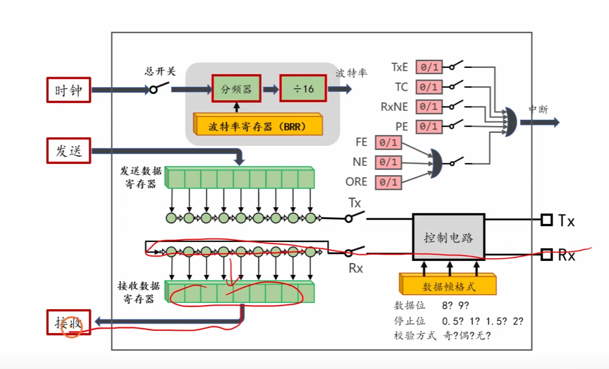
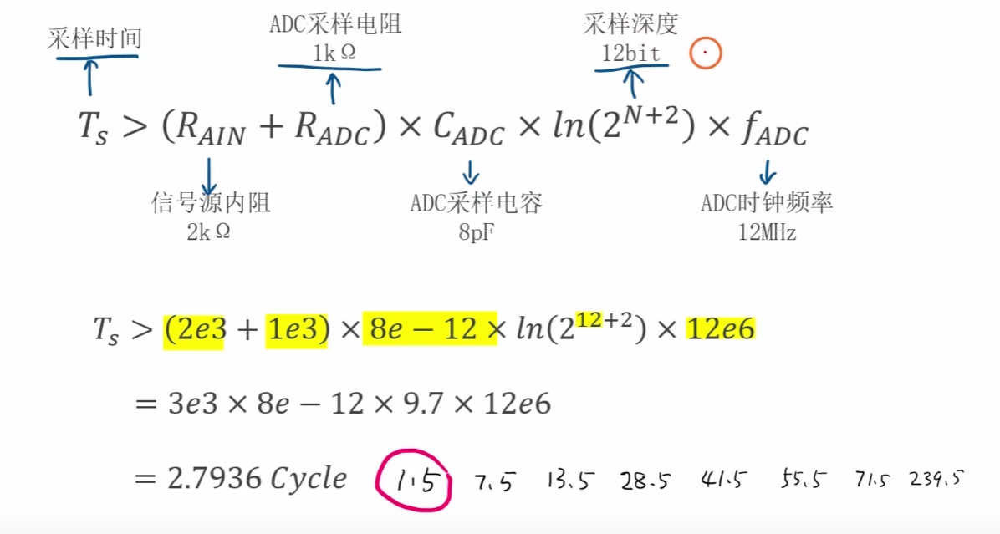
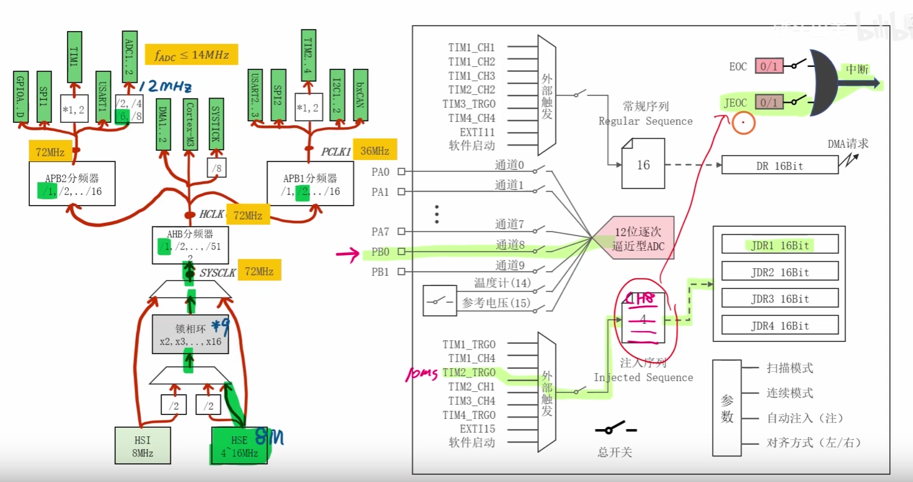

### 大体思路和细节


1. 分别的几个初始化流程ADC,TIM定时器，GPIO和UART
2. 计算定时器的采样时间涉及到一部分的电路原理公式
3. 裸机多任务编程模型
4. 采用Test模块进行与电脑端的通讯是为了测试模块，免得最后哪哪都是错，最后测试的时候


#### 思考
- 你说是为了熟悉函数吗？也不好说，因为很多的初始化流程以后都会根据HAL库直接初始化完成，更多的是根据函数去了解里面的内部结构吧，因为初始化过程本质就是对寄存器的调用和改写，标准库也是要稍微熟悉一点
- 我下面的例子只是最简单的例子，很多具体的操作还是要看场景，这个ADC既不是多通道采集
- 也没有涉及到注入序列等的多态，和DMA的应用，TIM定时器更是最简单的功能，更别说没有引入操作系统一切都还道阻且长


### 工程经验

- 大部分采样都是右对齐
- `ADC_InitStruct.ADC_DataAlign = ADC_DataAlign_Right;
- 这个模块主要就是ADC的采样时间的计算和数据读取之后的返回计算需要思考一下，没其他比较难的了
`


### LED的初始化流程直接跳过

- 没什么好说的，都是先配置时钟，然后明确TCB结构体
- 掌握GPIO的八种模式和配置相关的速度和模式就行了


### ADC采样思路
- PB0(模拟输入) ─→ ADC1_CH8 ─→ TIM3 TRGO每10ms触发─→ 转换完成 ─→ EOC中断

**通用的大体流程**
 1. 明确模拟输入端口，正常的时钟配置和TCB模块的配置
 2. 使能RCC和ADC分频处理
 3. 配置ADC模块的通用属性,包括扫描模式，连续模式，对齐模式的读写，采集方式，单独或者联动
 4. 进行通道得到注入，包括常规序列和注入序列，主要是配置注入通道的所在rank，和采集时间，重点是采集时间的计算方式
 5. 如果需要进行中断的读写，重点是电压的计算方式，还要进行NVIC的配置，触发EOC和JEOC，然后重写weak函数
 6. 最后是数据的读取逻辑
 7. 最后是使能


```c
static void ADC1_Init(void)
{
	//明确模拟输入端口
	
	RCC_APB2PeriphClockCmd(RCC_APB2Periph_GPIOB, ENABLE);
	
	GPIO_InitTypeDef GPIO_InitStruct = {0};//明确结构体
	
	GPIO_InitStruct.GPIO_Pin = GPIO_Pin_0;
	GPIO_InitStruct.GPIO_Mode =GPIO_Mode_AIN;
	
	GPIO_Init(GPIOB,&GPIO_InitStruct);
	
	
	
	//ADC模块的配置
	
	/*
	*主要是这几个配置方向：
	*先明确时钟数的开启，时钟树和传入给ADC模块的分频系数
	*ADCTCB模块的参数的配置
	*不打开连续扫描
	*对齐方向
	*采用外部触发采集，不使用软件模拟
	*ADC1为独立信号，不进行与其他模块的联动
	*触发通道为1，因为只有采集电压这个需求
	*不进行连续扫描
	*PB0对应的是通道8是它进入规则组进行采样
	*然后打开总开关

	
	*/
	
	
	RCC_ADCCLKConfig(RCC_PCLK2_Div6);//APB2端口的时钟频率进行6分频传入给ADC
	
	RCC_APB2PeriphClockCmd(RCC_APB2Periph_ADC1, ENABLE);


	ADC_InitTypeDef ADC_InitStruct = {0};
	ADC_InitStruct.ADC_ContinuousConvMode = DISABLE;
	ADC_InitStruct.ADC_DataAlign = ADC_DataAlign_Right;
	ADC_InitStruct.ADC_ExternalTrigConv = ADC_ExternalTrigConv_T3_TRGO;
	ADC_InitStruct.ADC_Mode = ADC_Mode_Independent;
	ADC_InitStruct.ADC_NbrOfChannel = 1;
	ADC_InitStruct.ADC_ScanConvMode = DISABLE;
	ADC_Init(ADC1, &ADC_InitStruct);
	
	ADC_RegularChannelConfig(ADC1,ADC1_Channel_8 ,1 , ADC_SampleTime_239Cycles5);
	ADC_ExternalTrigConvCmd(ADC1, ENABLE);
	
	
	//使能中断
	ADC_ITConfig(ADC1, ADC_IT_EOC, ENABLE);
	
	//配置TCB模块
	/*
	*明确配置ADC1模块，并且知道ADC1和ADC2共用中断向量表的位置
	*使能开关
	*配置抢占优先级
	*配置子优先级
	
	*/
	NVIC_InitTypeDef NVIC_InitStruct = {0};

	NVIC_InitStruct.NVIC_IRQChannel = ADC1_2_IRQn;
	NVIC_InitStruct.NVIC_IRQChannelCmd = ENABLE;
	NVIC_InitStruct.NVIC_IRQChannelPreemptionPriority = 1;
	NVIC_InitStruct.NVIC_IRQChannelSubPriority = 0;
	
	NVIC_Init(&NVIC_InitStruct);
	
	
	ADC_Cmd(ADC1, ENABLE);
	
}


```
### Tim定时器的配置，只是触发信号作用，不为输入采样模式和输出比较模式，为最普通的模式


- 只需要配置RCR,PSC,时钟树，ARR和CNT的移动方向

```c
static TIM3_TRGO_Init()
{
	
	/*
	*使能Tim3时钟
	*配置必要的TCB模块
	*向上计数
	*ARR,PSC配置，使每隔10ms进行update
	*不是高级定时器无法配置RCR，重复进行装载
	*使能
	*配置为从机模式，并且由update触发
	*/
	RCC_APB1PeriphClockCmd(RCC_APB1Periph_TIM3, ENABLE);
	
	TIM_TimeBaseInitTypeDef TIM_TimeBaseInitStruct = {0};
	
	TIM_TimeBaseInitTypeDef TIM_TimeBaseInitStruct = {0};
	TIM_TimeBaseInitStruct.TIM_CounterMode = TIM_CounterMode_Up;
	TIM_TimeBaseInitStruct.TIM_Period = 9999; // 10ms
	TIM_TimeBaseInitStruct.TIM_Prescaler = 71;
	TIM_TimeBaseInitStruct.TIM_RepetitionCounter = 0;
	TIM_TimeBaseInit(TIM3, &TIM_TimeBaseInitStruct);
	
	TIM_SelectOutputTrigger(TIM3, TIM_TRGOSource_Update);
	
	TIM_Cmd(TIM3, ENABLE);
	
}
```
#### USART的基础配置

1. 配置基础的推挽输出和上拉输入的GPIO口，速度的化一般是中速：UART空闲状态下TX/RX线应该保持高电平（Idle=High）。如果蓝牙模块还没上电或意外断开，RX脚会悬空（浮空），施密特触发器输入会随机跳变，USART可能误收到垃圾数据。上拉保证空闲时RX为高电平，符合UART协议规范。
2. 配置USART模块，本质是UART，但是物理的实现上是用TTL
3. 基本的TCB模块
4. 太简单了。波特率，UART的基础知识，数据长度，校验位，停止位，模式选择

```c
void app_usart2_init(void)
{
	//配置基础的输入引脚和输出引脚，根据他给的原理图
	RCC_APB2PeriphClockCmd(RCC_APB2Periph_GPIOA, ENABLE);
	
	GPIO_InitTypeDef GPIO_InitStruct = {0};
	
	// PA2 AF_PP
	GPIO_InitStruct.GPIO_Pin = GPIO_Pin_2;
	GPIO_InitStruct.GPIO_Mode = GPIO_Mode_AF_PP;//复用推挽输出
	GPIO_InitStruct.GPIO_Speed = GPIO_Speed_2MHz;
	
	GPIO_Init(GPIOA, &GPIO_InitStruct);
	
	// PA3 IPU
	GPIO_InitStruct.GPIO_Pin = GPIO_Pin_3;
	GPIO_InitStruct.GPIO_Mode = GPIO_Mode_IPU;//上拉输入
	
	GPIO_Init(GPIOA, &GPIO_InitStruct);
	
	
	/*
	*使能时钟
	*明确TCB
	*波特率的配置
	*模式选择
	*是否采用校验位
	*停止位：1，0，2
	*数据长度
	*参数使能
	*/
	
	RCC_APB1PeriphClockCmd(RCC_APB1Periph_USART2, ENABLE);
	
	USART_InitTypeDef USART_InitStruct = {0};
	
	USART_InitStruct.USART_BaudRate = 921600;
	USART_InitStruct.USART_Mode = USART_Mode_Tx | USART_Mode_Rx;
	USART_InitStruct.USART_Parity = USART_Parity_No;
	USART_InitStruct.USART_StopBits = USART_StopBits_1;
	USART_InitStruct.USART_WordLength = USART_WordLength_8b;
	USART_Init(USART2, &USART_InitStruct);
	
	// #5. 闭合USART2的总开关
	USART_Cmd(USART2, ENABLE);
	
}
```


### 裸机的多任务编程模式的采用

**最终的目的是为了看似进行多线程的同时运行**

每个模块通过 PERIODIC() 声明自己的执行频率，主循环全力轮询，靠宏内部的时间判断来决定"这次该不该跑"。这比裸 delay() 高明得多——不阻塞CPU，其他模块不受影响。


电量显示的逻辑

整体逻辑：电压分段 → 灯光状态
电池电压区间        LED状态        电量含义
─────────────────────────────────────────
< 6.0V            3灯快闪(100ms)    亏电警告！
6.0V ~ 6.6V       全灭              <33%（危险）
6.6V ~ 7.3V       亮1颗灯           <66%
7.3V ~ 8.0V       亮2颗灯           <99%
≥ 8.0V            亮3颗灯           满电


> 插入中断的配置思路主题是NVIC模块的明确，子优先级和抢占优先级的划分











#### 基础啊算法


**电压换比算法**

底层原理：为什么8.4V对应4095？
STM32的ADC参考电压（VREF+）通常是3.3V，ADC输入脚最大只能承受3.3V。但两节锂电池电压是 6.0V~8.4V，远超3.3V，所以硬件上必须加电阻分压电路：
电池(8.4V max)
    │
   [R1]
    │
    ├──→ PB0 (ADC输入，这里电压 = 电池电压 × R2/(R1+R2))
    │
   [R2]
    │
   GND
反推分压比：当电池=8.4V时，ADC输入应该刚好等于3.3V（满量程），所以：
分压比 = 3.3 / 8.4 ≈ 0.393
即 R2/(R1+R2) ≈ 0.393
比如R1=10kΩ，R2≈6.5kΩ就能满足。
反向计算：ADC读到的电压是分压后的值（0~3.3V），要还原成真实电池电压就要除以分压比，等价于乘以 8.4/3.3，再合并 dr/4095×3.3 里的3.3，最终就是 dr/4095×8.4。


**采集时间算法**


