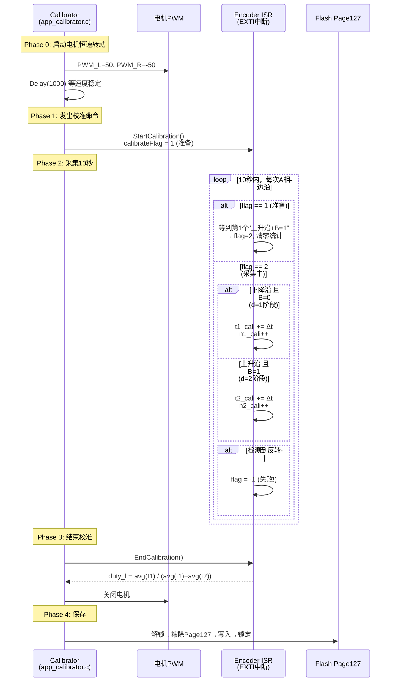
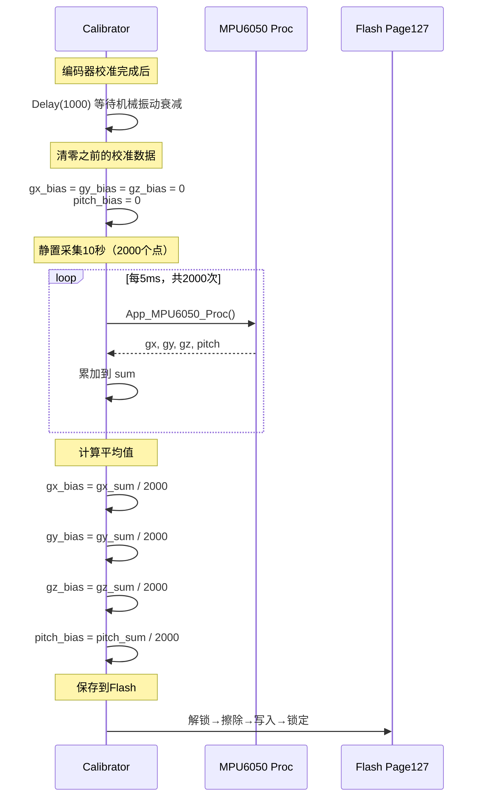

---
aliases:
  - 源码对比
  - 复刻项目对比
tags:
  - STM32
  - 平衡小车
  - 源码阅读
  - 工程复盘
related:
  - "[[3.编码器模块]]"
  - "[[5.PID模块]]"
  - "[[Lib/PID]]"
  - "[[编码器-算法]]"
date: 2026-05-11
status: 🌿草稿
---

# 视频代码和源码提供的比较和额外学习

> [!abstract] 定位
> 这篇笔记是 CT_bal_car（视频复刻版）与 bal（铁头山羊原版源码）的逐模块深度对比。不重复基础原理（理论见各自模块笔记），聚焦于"原版比复刻版多做了哪些工程决策，为什么这些决策重要"。

## 总览：两个项目的核心差异

| 维度 | CT_bal_car（复刻版） | bal（原版） | 笔记索引 |
| --- | --- | --- | --- |
| PID 库 | 简单实现，104行 | 工业级实现，268行 + LPF 滤波器 | [[Lib/PID]] |
| 编码器测速 | 基础 T 法 | 校准过的 M/T 法 + 占空比补偿 | ← 本篇专题一 |
| MPU6050 通信 | 硬件 I2C | 软件 I2C（更可靠） | ← 本篇专题二 |
| 传感器校准 | 无 | 完整校准系统 + Flash 持久化 | ← 本篇专题二 |
| 数学运算 | 标准 math.h | 查表法快速三角函数（qmath） | 待整理 |
| 摔倒恢复 | 无 | StartUp 自动起立状态机 | 待整理 |
| 命令系统 | 基础 | 带多命令路由的 str_cmd 框架 | 待整理 |

---

## 专题一：编码器测速 — T 法 vs 校准过的 M/T 法

> [!note] 前置知识
> 本节假设你已理解 [[3.编码器模块]] 的基础概念（EXTI 中断计数、AB 相方向判断）和 [[编码器-算法]] 的数据流水线。这里只关注两个版本在**测速算法**和**校准机制**上的差异。

两边使用了完全相同的硬件方案——EXTI 中断 + GPIO 软件读取 A 相边沿，不使用 TIM 硬件编码器模式。核心差异在于：ISR 里记了什么，以及怎么用这些数据算速度。

---

### 1.1 为什么台阶宽度可能不一样

这是理解整个 M/T 法的起点。

编码器输出的 A 相信号，本质上是磁环（或光栅）经过霍尔传感器产生的。一个完整的 A 相周期对应磁环上的一个 N-S 极对：

```text
理想的磁环：N极和S极的弧度完全相等

  N  |  S  |  N  |  S  |
  ←→   ←→   ←→   ←→
  50%  50%  50%  50%

A相输出: ___|‾‾‾‾|___|‾‾‾‾|
          低=50% 高=50%    ← 占空比完美50%
```

但实际制造中，N 极和 S 极的弧度不可能完美对称：

```text
实际的磁环：N极比S极宽一点点

  N   |  S  |  N   |  S  |
  ←→    ←→   ←→    ←→
  52%  48%  52%   48%

A相输出: ___|‾‾|_____|‾‾|_____|‾‾|
          高=48%  低=52%          ← 占空比不是50%！
```

这个偏差可能只有 1%~3%，看起来很小。但后果是：

```text
假设电机恒速旋转（每个阶段真实时间应该一样）：

理想占空比50%:  ___|‾‾‾‾‾|___|‾‾‾‾‾|
                  T=5ms    T=5ms   ← 测速结果稳定

实际占空比48%:  ___|‾‾‾|______|‾‾‾|
                 T=4.8ms  T=5.2ms  ← 测速结果周期性波动！
```

如果 T 法假设每次边沿走过的角度都一样（M=1），那测出来的速度就会忽大忽小，以编码器一圈的频率做周期性波动。在低速时这个波动相对于真实速度的比例更大，直接导致 PID 震荡。

**结论**：必须知道"当前在哪个阶段"，才能用对应的台阶高度来修正。这就是原版区分阶段的原因。

---

### 1.2 阶段记录的差异

两边都只监控 A 相的边沿（EXTI 挂在 A 相上），所以一个完整的 A 相方波周期被分成 **2 个阶段**：

```text
A相:  ___|‾‾‾‾‾‾‾|________|‾‾‾‾‾‾‾|
         ↑              ↑          ↑
       上升沿         下降沿      上升沿
       d=2阶段         d=1阶段     d=2阶段
       (B=1)          (B=0)       (B=1)
```

**CT_bal_car 的记录方式**——只记方向：

```c
// direction_l 只有 ±1（持续）或 ±2（换向瞬间）
direction_l = +1;   // 正转
direction_l = -1;   // 反转
direction_l = +2;   // 刚从反转切换到正转
```

**bal 的记录方式**——记方向 + 阶段：

```c
// d0_l 有 ±1, ±2 四个值
d0_l = +1;   // 正转，A相下降沿阶段
d0_l = +2;   // 正转，A相上升沿阶段
d0_l = -1;   // 反转，A相下降沿阶段
d0_l = -2;   // 反转，A相上升沿阶段
```

| 对比项 | CT_bal_car | bal |
| --- | --- | --- |
| 方向变量 | `direction_l = ±1, ±2` | `d0_l = ±1, ±2` |
| 历史状态 | 不存上上次 | 存 `d1_l`（上上次） |
| 能否区分阶段 | 不能 | 能（+1 vs +2 代表不同阶段） |
| 能否做校准 | 不能（没有阶段信息） | 能（知道当前在哪个台阶上） |

> [!important] 关键认知
> `+1` 和 `+2` 不是"两种正转"，而是"正转的两个不同阶段"。每个阶段对应的磁环弧度不同，所以台阶宽度（持续时间）不同。M/T 法必须区分这两个阶段才能分别用校准过的台阶高度。

---

### 1.3 校准流程完整拆解

校准的目标：测出 A 相信号中，第1阶段和第2阶段各自的真实占空比。

校准涉及两个模块联合工作：`app_calibrator.c`（指挥）和 `app_encoder.c` 的 ISR（采集数据）。



#### 校准的数据采集细节

ISR 中的状态机有三个状态：

```text
calibrateFlag = 0  : 空闲（不采集）
calibrateFlag = 1  : 准备（等待第一个d=2边沿）
calibrateFlag = 2  : 进行中（持续累加t1和t2）
calibrateFlag = -1 : 失败（检测到反转，数据作废）
```

用一个具体的时间线走一遍：

```text
A相边沿:  ___|‾‾‾|______|‾‾‾|______|‾‾‾|______|‾‾‾|
               ↑      ↑      ↑      ↑      ↑      ↑
             上升   下降    上升   下降    上升   下降
             d=2    d=1     d=2    d=1    d=2    d=1

flag:       1→2     2       2      2      2      2
                    累加t2  累加t1 累加t2 累加t1 累加t2
```

统计量含义：

| 变量 | 含义 | 累加时机 |
| --- | --- | --- |
| `t1_cali` | 第1阶段（A下降沿）的持续时间总和 | 每次 d=1 边沿时累加 `now - lastEdge` |
| `n1_cali` | 第1阶段被采样的次数 | 每次 d=1 边沿时 +1 |
| `t2_cali` | 第2阶段（A上升沿）的持续时间总和 | 每次 d=2 边沿时累加 `now - lastEdge` |
| `n2_cali` | 第2阶段被采样的次数 | 每次 d=2 边沿时 +1 |

最终计算：

```c
float t1_avg = t1_cali / n1_cali;  // 第1阶段平均持续时间
float t2_avg = t2_cali / n2_cali;  // 第2阶段平均持续时间
duty_l = t1_avg / (t1_avg + t2_avg);  // 占空比
```

#### 从占空比到台阶高度

```c
m_l[0] = duty_l * 2;     // 第1阶段的台阶高度
m_l[1] = 2 - duty_l * 2; // 第2阶段的台阶高度
```

```text
为什么乘以2？

理想情况: 占空比50%, m[0]=1.0, m[1]=1.0, 总和=2
实际:     占空比48%, m[0]=0.96, m[1]=1.04, 总和=2

总和始终为2 → 每个完整A相周期的角度增量不变
但每个阶段分别被修正了 → 消除了周期性测速波动
```

> [!note] 采样量估算
> 电机 3000RPM，编码器 22 线 × 2 倍频（只看 A 相双边沿）= 44 个 A 相边沿/圈。50 圈/秒 × 44 = 2200 个边沿/秒。10 秒 ≈ 22000 个边沿，t1 和 t2 各约 11000 个采样点。大量采样取平均，单次误差被充分平滑。

#### Flash 持久化

```c
#define CALI_RESULT_ADDR_START 0x0801fC00  // STM32F103 最后一页 (Page127)
#define CALI_KEY 0x34562897feda0312        // 魔术值，校验数据有效性

// 保存
FLASH_Unlock();
FLASH_ErasePage(CALI_RESULT_ADDR_START);  // 擦除整页
for(uint16_t i=0; i<size; i++)
    FLASH_ProgramHalfWord(ADDR+2*i, data[i]);  // 逐半字写入
FLASH_Lock();

// 加载（开机时）
caliResult = *(CaliResult_TypeDef *)ADDR;  // 直接读内存映射
if(caliResult.key != CALI_KEY)             // 数据无效
    caliResult = 默认值(duty=0.5);         // 回退到理想占空比
```

> [!warning] 为什么用魔术值校验
> Flash 擦除后全为 0xFF，写入后如果不是预期的 key，说明要么从未校准过、要么数据被意外擦除。用魔术值判断是嵌入式里的标准做法——比单独存一个"valid"标志更可靠，因为 key 本身就是一个 64 位的极低碰撞率校验。

---

### 1.4 M/T 法的两层精髓

M/T 法和 T 法的差别不只是"台阶高度不为1"。有**两层**改进：

#### 第一层：台阶高度修正

```text
T法:   速度 = 1 / T        (M固定为1，假设每个阶段角度相同)
M/T法: 速度 = M / T        (M是校准过的实际台阶高度)
```

这一层解决了"占空比不是 50%"导致的周期性波动。

#### 第二层：动态选择用哪个阶段的 M 和 T

这是真正的精髓。看原版的核心逻辑：

```c
// 推算当前阶段（从上一个阶段推算）
dnow = d0_cpy % 2 + 1;

// 两个候选方案
float Mnow = m_l[dnow-1];    // 当前阶段（正在进行中，还没完成）
float M0   = m_l[d0_cpy-1];  // 上一个阶段（已完成）

// 关键决策
if(fabsf(Mnow)*(t0-t1) < fabsf(M0)*(now-t0))
{
    M = Mnow;                   // 用当前阶段的台阶高度
    T = (now - t0) * 1e-6f;     // 用当前阶段的已过时间（不完整！）
}
else
{
    M = M0;                     // 用上一阶段的台阶高度
    T = (t0 - t1) * 1e-6f;      // 用上一阶段的完整时间
}
```

时间线示意：

```text
─────────────────────────────────────────────→
        │              │                   │
       t1             t0                  now
        │← 上一阶段 →│← 当前阶段(未完) →│
        
  T_old = t0 - t1      T_cur = now - t0
```

**为什么需要选？因为"上一阶段"和"当前未完阶段"的信息量不同：**

```text
场景1：电机正在减速
  上一阶段耗时: 1ms（很快就过了）
  当前已过时间: 3ms（还没来下一个边沿）
  
  T法:   速度 = 1/1ms = 1000 ← 高估了！电机已经减速
  M/T法: 选 M=Mnow, T=3ms    ← 用当前阶段的信息，更接近真实

场景2：电机正在加速
  上一阶段耗时: 3ms
  当前已过时间: 0.5ms（马上就要来下一个边沿了）
  
  T法:   速度 = 1/3ms = 333  ← 低估了！电机已经加速
  M/T法: 选 M=M0, T=3ms      ← 上一阶段已完成，用它更稳定
```

> [!important] 判断条件的物理含义
> `|Mnow × T_old| < |M0 × T_cur|`
>
> 左边 = "上一阶段的角位移估算"（台阶高度 × 已知时间）
> 右边 = "当前阶段的角位移估算"（台阶高度 × 已过时间）
>
> **哪个阶段的角位移更大，就用哪个阶段的数据**——因为角位移越大，量化误差占比越小，测速越准。
>
> 这就像 GPS 导航：T 法只看你"上一段路开了多久"，M/T 法同时看"上一段路"和"当前这段还没走完的路"，选择信息量更大的那个来估算当前速度。

对比你的 T 法版本：

```c
// CT_bal_car: 只用上一阶段的时间，M固定为1
if(t0_cpy - t1_cpy > now - t0_cpy)
    T = (t0_cpy - t1_cpy) * 1.0e-6f;
else
    T = (now - t0_cpy) * 1.0e-6f;
return direction_cpy / T / 22.0f / (30613.0f / 1500.0f) * 6.2831853f;
//     ↑ M=±1固定
```

虽然你也在选择用哪个 T，但没有 M 的概念——每个边沿走过的角度被假设为相同。在减速/加速场景下的判断逻辑也不一样：你选"T 更大的那个"，原版选"角位移更大的那个"。

---

### 1.5 位置读取的常数优化

| 对比项 | CT_bal_car | bal |
| --- | --- | --- |
| 公式 | `encoder / 22.0 / (30613.0/1500.0) * 360.0` | `encoder * 0.01399402208920360588844895090594` |
| 运算 | 3 次浮点除法 + 1 次乘法 | 1 次浮点乘法 |
| 时钟周期（F103无FPU） | ~150~200 周期 | ~30 周期 |

原版把 `1/22 / (30613/1500) * 360` 预算成一个常数。在没有 FPU 的 STM32F103 上，一次浮点除法要 30~60 个时钟周期，这个优化省了约 100 个周期。

> [!tip] 实操建议
> 这种预计算常数的技巧在嵌入式里极其常见。做法：先用计算器或 Python 算出完整表达式的浮点结果，直接写进代码。注意精度——用 `float` 类型至少保留 7~8 位有效数字。

---

### 1.6 换向保护对比

两个版本都有"方向切换瞬间返回速度 0"的保护，但判断方式不同：

**CT_bal_car**——只看当前值：

```c
if(direction_cpy == +2 || direction_cpy == -2)
    return 0.0f;
```

`±2` 是 ISR 里检测到换向时设置的临时值，下次中断就会被覆盖为 `±1`。

**bal**——看两个历史状态的乘积：

```c
if(d0_cpy * d1_cpy <= 0)
    return 0.0f;
```

`d0` 是上次状态，`d1` 是上上次状态。`d0 * d1 <= 0` 包含三种情况：
- `d0 > 0, d1 < 0` → 刚从反转切换到正转
- `d0 < 0, d1 > 0` → 刚从正转切换到反转
- `d0 或 d1 == 0` → 初始化状态，还没确定方向

| 对比项 | CT_bal_car | bal |
| --- | --- | --- |
| 判断依据 | 当前 direction 值 | 两个历史状态的乘积 |
| 覆盖场景 | 仅换向瞬间 | 换向 + 初始化未完成 |
| 时间窗口 | 1 个边沿周期 | 2 个边沿周期 |
| 可靠性 | 依赖 ISR 及时清除 ±2 | 数学判断，不依赖 ISR 清除时机 |

原版更完备——它用两个历史状态判断，不依赖 ISR 在"下一次中断"时及时清除标记。

---

### 工程级设计清单

| 设计点 | CT_bal_car | bal | 工程意义 |
| --- | --- | --- | --- |
| 阶段记录 | `direction = ±1` | `d0 = ±1, ±2` | M/T 法需要知道当前在哪个台阶 |
| 台阶高度 | 隐含 M=1 | 校准过的 `m_l[0]`, `m_l[1]` | 补偿磁环制造误差 |
| 速度算法 | T 法 | M/T 法 | M/T 法在高速和低速下都更准 |
| 校准机制 | 无 | Flash 持久化校准 | 断电不丢失，一次校准终身使用 |
| 公式优化 | 多次除法 | 预算常数 | 省 100+ 时钟周期 |
| 换向保护 | `±2` 返回 0 | `d0*d1 <= 0` 返回 0 | 原版判断更完备 |
| 数据完整性 | 关中断拷贝 | 关中断拷贝 | 两边一样，防止数据撕裂 |

---

## 专题二：MPU6050 + 校准系统 + I2C

> [!note] 前置知识
> 本节假设你已理解 [[4.MPU6050]] 的基础概念（寄存器读取、加速度计/陀螺仪换算、互补滤波原理）。这里聚焦于两个版本在**I2C 通信方式**、**校准机制**和**互补滤波实现细节**上的差异。

---

### 2.1 软件 I2C vs 硬件 I2C

#### 两种实现方式对比

**CT_bal_car**——使用 STM32F103 的硬件 I2C 外设（I2C1）：

```c
// 硬件I2C: GPIO配置为复用开漏，由I2C外设自动控制时序
GPIO_InitStruct.GPIO_Mode = GPIO_Mode_AF_OD;
I2C_InitStruct.I2C_ClockSpeed = 400000;  // 400kHz Fast Mode
I2C_Init(I2C1, &I2C_InitStruct);
```

**bal**——使用 GPIO 模拟 I2C（`my_lib/si2c.c`，341行）：

```c
// 软件I2C: GPIO配置为通用开漏输出，由代码手动翻转电平
GPIO_InitStruct.GPIO_Mode = GPIO_Mode_Out_OD;
// 没有使用I2C外设
```

| 对比项 | 硬件 I2C（CT_bal_car） | 软件 I2C（bal） |
| --- | --- | --- |
| 引脚模式 | `GPIO_Mode_AF_OD`（复用开漏） | `GPIO_Mode_Out_OD`（通用开漏） |
| 时序控制 | I2C 外设硬件自动生成 | CPU 手动翻转 SCL/SDA |
| 速度 | 400kHz（Fast Mode） | ~100-200kHz（取决于 delay 参数） |
| CPU 占用 | 低（硬件自动完成） | 高（每个 bit 需要 CPU 参与） |
| API 签名 | `My_I2C_SendBytes(I2C_TypeDef*, ...)` | `My_SI2C_SendBytes(SI2C_TypeDef*, ...)` |
| 代码量 | 427 行 | 341 行 |

#### 为什么原版选择软件 I2C？

> [!warning] STM32F103 硬件 I2C 的已知缺陷
> STM32F103 的 I2C 外设存在**总线死锁问题**——在特定噪声条件下（如通信中途复位从机、SDA 被拉低等），硬件 I2C 会卡在 BUSY 状态无法恢复，只能通过完全复位 I2C 外设来解除。这个问题在 ST 官方的 errata sheet 中有记录（ES097 Rev.17，Section 2.13.7）。
>
> 对于平衡车这种场景，MPU6050 每 5ms 要读一次数据（14 个寄存器 × 2 字节）。如果硬件 I2C 死锁，姿态数据断流，车体直接失控摔倒。

软件 I2C 虽然慢一些，但**完全可控**——不存在硬件 bug，不会死锁。在 5ms 的控制周期内读取 14 字节数据完全来得及。

#### 软件 I2C 的核心时序

`si2c.c` 的 `SendByte()` 函数展示了最底层的位操作：

```text
发送一个字节 0xA5 = 10100101 的时序：

SCL: ‾|_|‾|_|‾|_|‾|_|‾|_|‾|_|‾|_|‾|_|‾|___|‾|___|‾|_
SDA:  1   0   1   0   0   1   0   1   释放  读ACK
     bit7                bit0            ↑ 从机回复
```

每个 bit 的操作：
1. SCL 拉低 → 改 SDA 电平 → delay
2. SCL 拉高 → delay → 从机在此刻采样 SDA

```c
for(int8_t i=7; i>=0; i--)
{
    scl_w(0);                              // SCL 拉低
    sda_w((Byte & (0x01<<i)) ? 1 : 0);    // 改 SDA
    delay(2);                              // 等待

    scl_w(1);                              // SCL 拉高（从机采样）
    delay(2);                              // 等待
}
```

> [!tip] 软件I2C的可移植性
> `si2c.c` 的 `SI2C_TypeDef` 结构体只包含 GPIO 引脚信息，不依赖任何特定芯片的 I2C 外设。这意味着它可以直接移植到任何有 GPIO 的 MCU 上（ESP32、GD32、CH32 等），只需要实现对应的 `GPIO_WriteBit` 和 `GPIO_ReadInputDataBit`。相比之下，硬件 I2C 库（`i2c.c`）深度绑定了 STM32 的 I2C 外设寄存器。

---

### 2.2 MPU6050 初始化的细节差异

两边对 MPU6050 的寄存器配置几乎一致，只有一个关键差异：

```c
// CT_bal_car:
reg_write(0x6b, 0x00); // 关闭睡眠，时钟源 = 内部8MHz振荡器

// bal:
reg_write(0x6b, 0x01); // 关闭睡眠，时钟源 = 陀螺仪X轴PLL
```

寄存器 0x6B 的低 3 位（CLKSEL）选择 MPU6050 内部时钟源：

| CLKSEL | 时钟源 | 精度 |
| --- | --- | --- |
| 0 | 内部 8MHz RC 振荡器 | ±1%（一般） |
| 1 | 陀螺仪 X 轴 PLL | ±0.1%（高） |
| 2 | 陀螺仪 Y 轴 PLL | ±0.1%（高） |
| 3 | 陀螺仪 Z 轴 PLL | ±0.1%（高） |

> [!note] 为什么选陀螺仪 PLL 时钟？
> MPU6050 内部有 PLL（锁相环），可以用正在工作中的陀螺仪振动信号作为时钟基准。对于平衡车这种始终有角运动的应用，陀螺仪一直在工作，PLL 时钟比内部 RC 振荡器精确得多。采样间隔更稳定 → 积分更准确 → 角度估计更可靠。

其他寄存器配置完全一致：

| 寄存器 | 值 | 含义 |
| --- | --- | --- |
| 0x19 | 0x00 | 采样率 1kHz（不分频） |
| 0x1B | 0x18 | 陀螺仪量程 ±2000°/s |
| 0x1A | 0x02 | 陀螺仪带宽 94Hz |
| 0x1C | 0x00 | 加速度计量程 ±2g |
| 0x1D | 0x02 | 加速度计带宽 92Hz |

---

### 2.3 校准系统完整拆解

#### 校准数据结构

```c
typedef struct {
    uint64_t key;               // 魔术值，校验数据有效性
    float encoder_duty_l;       // 左编码器占空比
    float encoder_duty_r;       // 右编码器占空比
    float mpu6050_gx_bias;      // 陀螺仪X轴零偏
    float mpu6050_gy_bias;      // 陀螺仪Y轴零偏
    float mpu6050_gz_bias;      // 陀螺仪Z轴零偏
    float mpu6050_pitch_bias;   // pitch角度偏差
} CaliResult_TypeDef;
```

编码器校准部分已在专题一中详细拆解，这里聚焦 MPU6050 部分。

#### MPU6050 校准流程



#### 为什么需要校准陀螺仪零偏

MPU6050 即使静止不动，陀螺仪也不是完美输出 0。每个芯片都有一个固有的零偏（bias），通常在 ±1~5°/s 范围内：

```text
静止状态下：
真实角速度: 0°/s
陀螺仪输出: 2.3°/s  ← 这是零偏，不是真实角速度

不校准的后果（陀螺仪积分）：
  t=0s:  pitch = 0°
  t=1s:  pitch = 2.3°   ← 已经偏了
  t=10s: pitch = 23°    ← 完全不可用！
  t=60s: pitch = 138°   ← 灾难性漂移

校准后：
  gx = raw * 灵敏度 - gx_bias  ← 减去零偏
  剩余漂移: 通常 < 0.1°/s（由温度变化和噪声引起）
  10秒漂移: < 1°（可接受，互补滤波会修正）
```

校准后的零偏在每次读取陀螺仪数据时被减去：

```c
// bal: app_mpu6050.c 第66-68行
gx = gyro_x_raw * 0.06097560975610f - App_Calibrator_GetResult()->mpu6050_gx_bias;
gy = gyro_y_raw * 0.06097560975610f - App_Calibrator_GetResult()->mpu6050_gy_bias;
gz = gyro_z_raw * 0.06097560975610f - App_Calibrator_GetResult()->mpu6050_gz_bias;
```

CT_bal_car 没有这个校准步骤，陀螺仪数据直接使用：

```c
// CT_bal_car: 没有减去零偏
gx = gyro_x_raw * 6.1035e-2f;
gy = gyro_y_raw * 6.1035e-2f;
gz = gyro_z_raw * 6.1035e-2f;
```

> [!important] pitch_bias 是什么
> 小车静置时，由于安装角度不可能完美垂直，互补滤波算出的 pitch 不一定精确为 0°。`mpu6050_pitch_bias` 记录了这个偏差。读取 pitch 时会被加上：
> ```c
> // bal: GetPitch()
> return pitch + App_Calibrator_GetResult()->mpu6050_pitch_bias;
> ```
> 这确保了静止时 pitch 输出为 0°——PID 的设定值可以直接设为 0，不需要手动补偿安装偏差。

#### Flash 持久化的工程细节

Flash 操作的完整流程（已在专题一中展示代码，这里补充工程要点）：

```text
STM32F103 Flash 结构:
  Page 0:   0x08000000  ← 程序代码起始
  ...
  Page 126: 0x0801F800
  Page 127: 0x0801FC00  ← 校准数据存放位置（最后一页）
  Flash END: 0x08020000

为什么用最后一页？
  1. 离程序代码最远，不会被程序覆盖
  2. 擦除整页不影响程序运行
  3. 从后往前用，风险最低
```

开机加载时的容错设计：

```c
caliResult = *(CaliResult_TypeDef *)0x0801FC00;  // 直接内存映射读取
if(caliResult.key != CALI_KEY)                    // 0x34562897feda0312
{
    // 三种可能：
    // 1. 全新芯片，Flash 从未写入（全0xFF）
    // 2. 校准数据被意外擦除（程序更新等）
    // 3. 数据损坏（极端情况）
    // → 回退到安全默认值
    caliResult.encoder_duty_l = 0.5f;  // 理想占空比
    caliResult.encoder_duty_r = 0.5f;
    caliResult.mpu6050_gx_bias = 0;
    // ...
}
```

---

### 2.4 互补滤波实现差异

这是两个版本差异最微妙也最重要的部分。

#### 差异一：积分方式不同

**CT_bal_car**——先单独维护陀螺仪积分角度，再融合：

```c
// 第一步：单独积分陀螺仪
pitch_g = pitch_g + gx * 0.005;   // "自由积分"，不受加速度计修正

// 第二步：计算加速度角度
float pitch_a = qatan2(ay, az) / PI * 180.0f;

// 第三步：互补滤波
pitch = 0.95238 * pitch_g + 0.04762 * pitch_a;
```

**bal**——直接在上一次融合结果上积分：

```c
// 一步到位：在上次融合结果上积分 + 融合
pitch = 0.95238 * (pitch + gx * 0.005) + 0.04762 * pitch_accel;
//                  ↑ 上次融合结果            ↑ 加速度计角度
```

```text
CT_bal_car 的积分路径:
  陀螺仪 → pitch_g（自由积分，漂移累积）→ 互补滤波 → pitch
              ↑ pitch_g 不受加速度计修正，误差持续累积

bal 的积分路径:
  陀螺仪 → pitch + gx*dt（在上次融合结果上积分）→ 互补滤波 → pitch
              ↑ 积分起点是上次已经修正过的值，误差不会持续累积
```

> [!important] 为什么原版更优
> CT_bal_car 的 `pitch_g` 是陀螺仪的**自由积分**——它不受加速度计修正，零偏导致的漂移会持续累积。即使互补滤波能融合加速度计信息，`pitch_g` 本身已经在错误的方向上走远了。
>
> 原版每次积分的起点是**上一次互补滤波的结果**（已经融合过加速度计信息），所以积分的起点更准，漂移被持续修正而不是持续累积。

#### 差异二：跨 ±180° 跳变处理

原版有这段保护：

```c
if(pitch - pitch_accel > 180) pitch -= 360;
if(pitch_accel - pitch > 180) pitch += 360;
```

为什么需要？加速度计算出的角度在 ±180° 附近会有跳变：

```text
场景: pitch ≈ 179°

不处理时:
  pitch = 179°, pitch_accel = -179°
  真实差值 = 2°（很接近！）
  但 pitch - pitch_accel = 179 - (-179) = 358° ← 看起来差很远！
  → 互补滤波会把 pitch 拉到接近 0° ← 完全错误！

处理后:
  pitch_accel - pitch = -179 - 179 = -358 < -180
  → pitch += 360 → pitch = 539° → 归一化到 179°
  → 现在差值只有 2°，互补滤波正确
```

CT_bal_car 没有这个保护。当 pitch 接近 ±180° 时会出现剧烈抖动。

#### 差异三：roll 角度的符号

```c
// CT_bal_car:
float roll_a = qatan2(ax, az) / PI * 180.0f;    // 正号

// bal:
float roll_accel = -qatan2(ax, az) / PI * 180.0f; // 负号
```

这取决于 MPU6050 在车体上的实际安装方向。原版对 roll 加了负号，说明安装方式导致 roll 的实际方向和数学计算方向相反。这不是算法差异，而是**硬件安装适配**。

#### 差异四：首次融合的处理

原版有首次运行保护：

```c
if(firstCompute)
{
    firstCompute = 0;
    yaw = 0;
    roll = roll_accel;    // 第一次直接用加速度计结果
    pitch = pitch_accel;  // 避免从0°开始积分导致大误差
}
```

CT_bal_car 没有这个保护。`pitch_g` 和 `roll_g` 初始值为 0，如果实际安装角度是 5°，第一次互补滤波结果会是 `0.95238*0 + 0.04762*5 ≈ 0.24°`——需要很多个周期才能收敛到 5°。原版第一次就直接用加速度计结果作为起点，省去了这个收敛过程。

---

### 工程级设计清单

| 设计点 | CT_bal_car | bal | 工程意义 |
| --- | --- | --- | --- |
| I2C 方式 | 硬件 I2C（I2C1 外设） | 软件 I2C（GPIO 模拟） | 避开 STM32F103 硬件 I2C 总线死锁 bug |
| 时钟源 | 内部 8MHz RC 振荡器 | 陀螺仪 PLL | 采样间隔更精确，积分更准 |
| 陀螺仪零偏 | 不校准 | 2000 点取平均 + Flash 存储 | 消除 ±1~5°/s 的零偏漂移 |
| pitch 偏差 | 不校准 | 校准静置偏差 | 补偿安装角度误差，PID 目标可直接设为 0 |
| 互补滤波积分 | 先单独积分再融合 | 在融合结果上积分 | 原版积分起点更准，漂移不累积 |
| 跨 ±180° 处理 | 无 | 有归一化 | 避免边界角度剧烈抖动 |
| 首次融合 | 无保护 | 直接用加速度计结果 | 省去收敛过程 |
| Flash 持久化 | 无 | Page127 + 魔术值校验 | 断电不丢失，带容错回退 |

---

## 后续专题预告

以下模块将在后续学习中逐步写入：

- **qmath 查表法三角函数** — 1024 点 sin/tan 查找表 + 二分搜索
- **控制算法 + StartUp 状态机** — 串级 PID + 摔倒自动起立
- **命令系统 (str_cmd)** — 多命令路由框架，串口在线调参

### 🔗

- [[4.MPU6050]] — MPU6050 基础原理、寄存器配置、互补滤波
- [[3.编码器模块]] — 编码器基础原理、硬件链路、EXTI 计数
- [[编码器-算法]] — 配置驱动设计哲学、数据流水线架构（M4 项目，设计思想一脉相承）
- [[Lib/PID]] — PID 库的工程架构设计（原版 vs 复刻版对比的另一个维度）
- [[FL软件中断-设计]] — 软件中断编码器的完整设计文档（M4 项目，ISR 设计参考）
- [[I2C]] — I2C 通信基础概念
