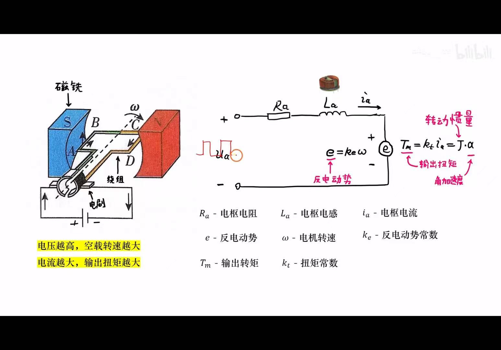
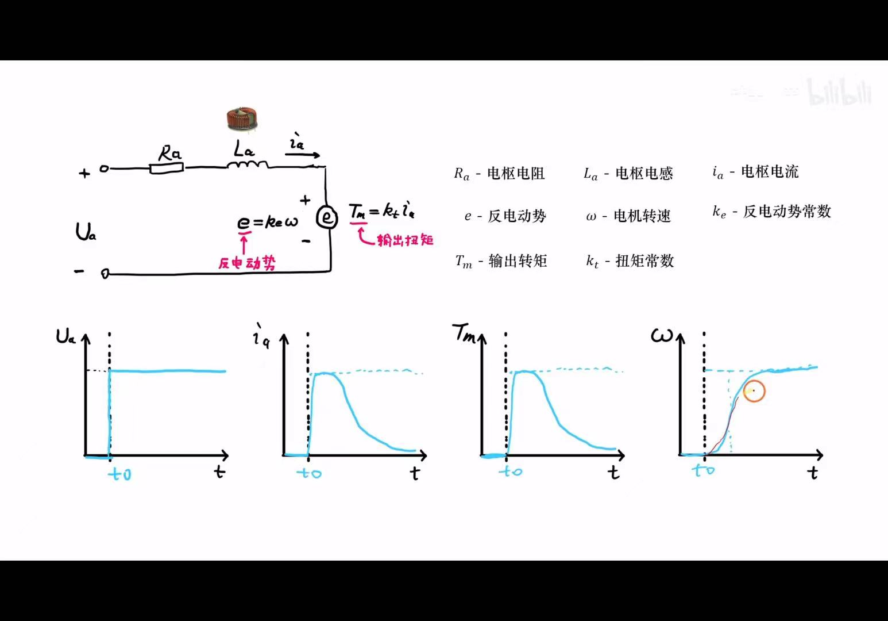
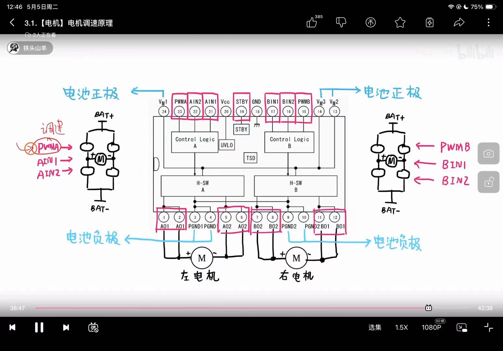
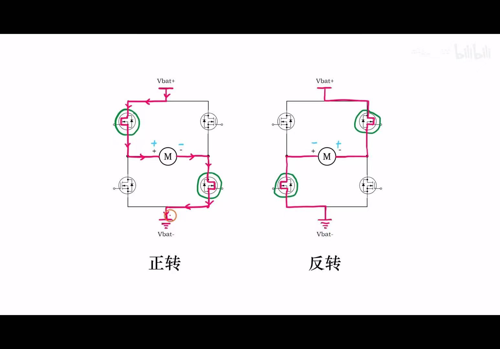
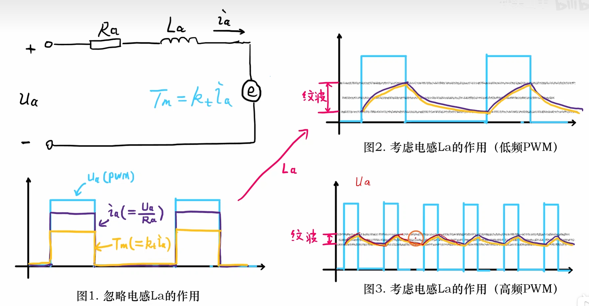
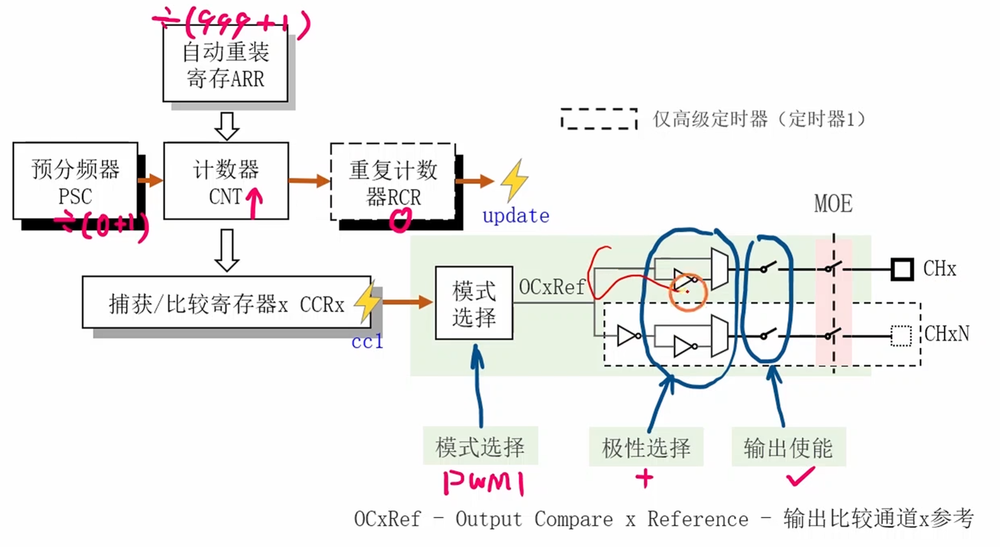

---
aliases:
  - 电机模块
  - TB6612FNG 电机驱动
  - 平衡车电机执行器
tags:
  - STM32
  - 平衡小车
  - 电机驱动
  - PWM
  - TB6612FNG
  - 工程复盘
related:
  - "[[1.ADC-采样电源]]"
  - "[[3.编码器模块]]"
  - "[[5.PID模块]]"
  - "[[7.速度环]]"
  - "[[9.整体的工程思考和错误问题]]"
  - "[[10.源码和复刻项目的对比]]"
date: 2026-05-10
status: 样板整理完成
---

# 电机模块：从 H 桥方向控制到 PWM 输出

> [!abstract] 实战场景
> 这篇笔记解决的是平衡小车“控制器算出来的输出，最后怎么变成电机正反转和速度”的问题。
>
> 工程链路是：[[5.PID模块]] 给出带符号的控制量，电机模块把符号翻译成 `AIN1/AIN2` 或 `BIN1/BIN2` 的方向，把绝对值翻译成 `PWMA/PWMB` 的占空比，再由 TB6612FNG 驱动左右两个有刷直流电机。

> [!note] 快速结论
> - 电机模块是执行器层：上层只应该传入“左/右电机输出值”，不应该关心 H 桥细节。
> - TB6612FNG 的关键控制脚是 `STBY`、`AIN1/AIN2/PWMA`、`BIN1/BIN2/PWMB`。
> - PWM 本质是改变电机端的等效平均电压，但电机电感、反电动势、负载和电池电压都会让实际速度不是线性变化。
> - 平衡车调试时先单独验证电机方向和 PWM，再接 [[3.编码器模块]]、[[7.速度环]] 和 [[5.PID模块]]。

## 总体主线

```text
PID / 手动测试输出
  -> 限幅
  -> 拆成方向 + 占空比
  -> TB6612FNG 逻辑脚
  -> H 桥电流方向
  -> 有刷直流电机转矩
  -> 车轮速度
  -> 编码器反馈
```

**工程结论：** 电机模块的核心不是“让电机转”，而是提供一个稳定、可预测、可复用的执行器接口。后面所有闭环控制都会建立在这个接口上。

> [!warning] 修正：FOC 和本项目不是同一层问题
> FOC 通常用于无刷电机或永磁同步电机的矢量控制。本项目用的是有刷直流电机加 TB6612FNG，重点是 H 桥方向控制和 PWM 调速，不需要把 FOC 的概念混进来。

## 有刷直流电机认知



**图意：** 左侧是有刷直流电机的物理结构，右侧是电枢回路的等效模型：电枢电阻 `Ra`、电枢电感 `La`、反电动势 `e = ke * omega`，以及转矩 `Tm = kt * ia`。

**工程结论：**
- 电压越高，空载转速通常越大。
- 电流越大，输出转矩通常越大。
- 转速升高会产生反电动势，反过来抵消输入电压，所以电机不是简单电阻。
- 电机电感会阻碍电流突变，所以 PWM 频率太低时，电流和转矩纹波会更明显。



**图意：** 阶跃电压输入后，电枢电流、输出转矩和角速度随时间变化。刚加电时反电动势小，电流和转矩大；转速升高后反电动势变大，电流下降。

**工程结论：** 启动瞬间电流最大，堵转更危险。电机测试时要先小占空比试转，再逐步增大，不要直接满占空比硬怼。

> [!warning] 易错点：PWM 占空比不等于速度
> PWM 占空比改变的是电机端等效电压，速度还取决于电池电压、负载、摩擦、反电动势和控制策略。电池电压下降时，同样占空比的实际输出会变弱，这和 [[1.ADC-采样电源]] 有直接关系。

## TB6612FNG 和 H 桥



**图意：** TB6612FNG 内部有 A/B 两路 H 桥，可以分别驱动左电机和右电机。`VM` 接电机电源，`VCC` 接逻辑电源，`STBY` 是总待机控制，`PWMA/PWMB` 控制两路调速。

**工程结论：**
- `VM` 和 `VCC` 不是同一个概念：`VM` 给电机供能，`VCC` 给逻辑电路供能。
- `STBY` 必须拉高，驱动器才真正工作。
- `AIN1/AIN2` 控制 A 路方向，`BIN1/BIN2` 控制 B 路方向。
- `AO1/AO2`、`BO1/BO2` 接电机两端，不要和控制脚混淆。



**图意：** H 桥通过对角 MOSFET 导通改变电机两端电压方向，从而实现正转和反转。

**工程结论：** 方向控制的本质是改变电流穿过电机的方向。写代码时最重要的是建立“逻辑方向”和“实际车轮方向”的映射表，并在实车上验证。

### TB6612 常用逻辑表

| `STBY` | `IN1` | `IN2` | `PWM` | 状态 |
| --- | --- | --- | --- | --- |
| `0` | 任意 | 任意 | 任意 | 待机，输出关闭 |
| `1` | `1` | `0` | 有效 | 一个方向转动 |
| `1` | `0` | `1` | 有效 | 反方向转动 |
| `1` | `0` | `0` | 任意 | 停止/滑行，具体看芯片模式和接法 |
| `1` | `1` | `1` | 任意 | 短刹车 |

> [!warning] 易错点：左电机和右电机方向可能相反
> 车体左右电机安装方向通常是镜像的。同样的 `IN1=1, IN2=0`，左右轮的实际“前进方向”不一定一致。工程里必须用 `motor_set_left()`、`motor_set_right()` 分别封装方向，不要默认左右完全一样。

## 软件接口设计

电机模块建议对上层暴露“带符号输出”，而不是暴露 `IN1/IN2/PWM` 细节。

```c
typedef enum {
    MOTOR_LEFT = 0,
    MOTOR_RIGHT,
} motor_id_t;

typedef struct {
    int16_t pwm_max;
    int16_t dead_zone;
} motor_config_t;
```

推荐接口：

```c
void motor_init(void);
void motor_enable(uint8_t enable);
void motor_set(motor_id_t id, int16_t output);
void motor_stop_all(void);
```

**工程结论：**
- `output > 0`：一个方向。
- `output < 0`：反方向。
- `output = 0`：停止或刹车。
- `abs(output)`：映射成 PWM 占空比。
- 上层 [[5.PID模块]] 不应该直接碰方向脚。

### 方向和限幅

```c
static int16_t motor_limit(int16_t value, int16_t max)
{
    if (value > max) {
        return max;
    }
    if (value < -max) {
        return -max;
    }
    return value;
}

void motor_set(motor_id_t id, int16_t output)
{
    output = motor_limit(output, 999);

    if (output > 0) {
        motor_set_direction(id, 1);
        motor_set_pwm(id, (uint16_t)output);
    } else if (output < 0) {
        motor_set_direction(id, -1);
        motor_set_pwm(id, (uint16_t)(-output));
    } else {
        motor_set_pwm(id, 0);
        motor_set_direction(id, 0);
    }
}
```

> [!tip] 工程习惯
> `999` 这种上限应该来自 `ARR` 或统一宏定义，不要散落在多个函数里。后面调 PID 输出限幅时，也要和电机 PWM 上限保持一致。

## PWM 调速



**图意：** PWM 不是让电压真的变成连续模拟量，而是快速开关电机端电压。电机电感 `La` 会让电流变化变平滑；频率越高，电流纹波通常越小。

**工程结论：**
- 低频 PWM 时电流和转矩波动更明显，电机可能抖、叫、发热。
- 高频 PWM 时电流更平滑，但开关损耗、定时器分辨率和驱动能力也要考虑。
- 对平衡车来说，PWM 频率和控制周期都要稳定，不然闭环表现会变得很难解释。



**图意：** 定时器 PWM 的输出比较链路：`PSC` 分频，`ARR` 决定周期，`CCR` 决定占空比，输出比较模式生成 `OCxRef`，再经极性和输出使能到通道引脚。

**工程结论：**
- PWM 频率由 `timer_clk / ((PSC + 1) * (ARR + 1))` 决定。
- 占空比由 `CCR / (ARR + 1)` 决定。
- PWM 模式常用 `TIM_OCMode_PWM1`，极性常用高有效。
- 高级定时器如 TIM1/TIM8 还需要主输出使能 `TIM_CtrlPWMOutputs(..., ENABLE)`；通用定时器不需要这个开关。

### PWM 初始化骨架

```c
static void motor_pwm_init(void)
{
    /*
     * 1. 使能 GPIO 和 TIM 时钟
     * 2. PWM 引脚配置为复用推挽输出
     * 3. 配置 PSC / ARR
     * 4. 配置输出比较 PWM 模式
     * 5. 使能预装载
     * 6. 启动定时器
     */
}
```

### 标准库配置要点

```c
TIM_TimeBaseInitTypeDef tim = {0};
tim.TIM_Prescaler = 0;
tim.TIM_Period = 999;
tim.TIM_CounterMode = TIM_CounterMode_Up;
tim.TIM_ClockDivision = TIM_CKD_DIV1;
TIM_TimeBaseInit(TIMx, &tim);

TIM_OCInitTypeDef oc = {0};
oc.TIM_OCMode = TIM_OCMode_PWM1;
oc.TIM_OutputState = TIM_OutputState_Enable;
oc.TIM_OCPolarity = TIM_OCPolarity_High;
oc.TIM_Pulse = 0;
TIM_OCxInit(TIMx, &oc);

TIM_OCxPreloadConfig(TIMx, TIM_OCPreload_Enable);
TIM_ARRPreloadConfig(TIMx, ENABLE);
TIM_Cmd(TIMx, ENABLE);
```

**工程结论：** 预装载机制可以避免运行时改 `CCR/ARR` 造成输出毛刺。电机这种执行器最怕莫名其妙的瞬间大输出，能让更新同步就同步。

## STBY 和测试链路

原文提到用 Button 端控制 `STBY`，这在测试阶段很实用：先有一个“总开关”，再逐步测试方向和 PWM。

```text
STBY = 0 -> 驱动器待机，电机不响应
STBY = 1 -> 驱动器使能，方向脚 + PWM 生效
```

建议测试顺序：

1. `STBY = 0`，确认电机不动。
2. `STBY = 1`，给左电机小占空比正转，确认方向。
3. 给左电机小占空比反转，确认方向。
4. 对右电机重复同样测试。
5. 记录“正输出”对应的车轮实际方向。
6. 接入 [[3.编码器模块]]，确认编码器正负方向和电机方向一致。

> [!warning] 易错点：方向错会让闭环发疯
> 如果 PID 输出正值时，电机实际把小车推向更大的误差，闭环会越修越错。接入 [[5.PID模块]] 前，必须单独验证“电机方向、编码器方向、误差符号”三者一致。

## 调试和排错

| 现象 | 优先怀疑 | 验证动作 |
| --- | --- | --- |
| 电机完全不动 | `STBY` 没拉高、`VM` 没供电、PWM 引脚没输出 | 先测 `STBY/VM/PWM` 电平 |
| 只有一个方向能转 | `IN1/IN2` 某个脚没配置好、H 桥接线错误 | 单独翻转方向脚 |
| 左右轮方向相反 | 电机安装镜像、方向映射未区分左右 | 为左右电机分别定义方向系数 |
| 小占空比不转 | 电机死区、摩擦、供电不足 | 加 dead zone 或提高启动占空比 |
| 电机抖/叫 | PWM 频率过低、负载变化大、控制输出抖 | 调 PWM 频率，检查 PID 输出 |
| 接入闭环后冲飞 | 电机方向、编码器方向、误差符号不一致 | 回到开环测试，逐层排查 |

> [!tip] 复盘法
> 电机模块所有问题都先开环验证。闭环不稳时，不要第一反应就改 PID 参数；先确认执行器方向和幅值是可信的。

## 和后续模块的连接

- [[1.ADC-采样电源]]：电池电压影响电机实际输出，同样 PWM 在不同电压下效果不同。
- [[3.编码器模块]]：电机输出必须和编码器反馈方向一致，否则速度环会反向发力。
- [[5.PID模块]]：PID 输出会被电机模块限幅并映射成方向与占空比。
- [[7.速度环]]：速度环的执行器就是电机模块，反馈来自编码器。
- [[9.整体的工程思考和错误问题]]：记录方向反、死区、PWM 频率、供电不足等工程问题。
- [[10.源码和复刻项目的对比]]：后续对比原项目的电机 pin map、方向系数、PWM 频率和限幅策略。
