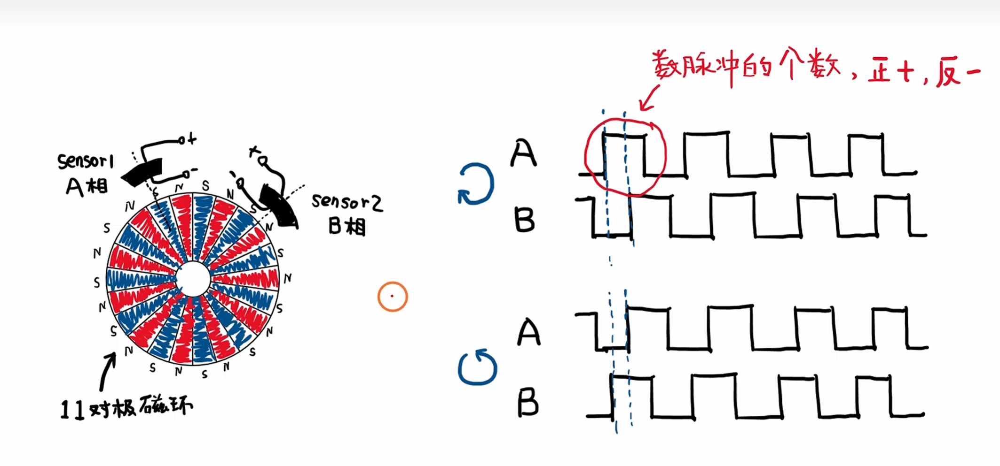
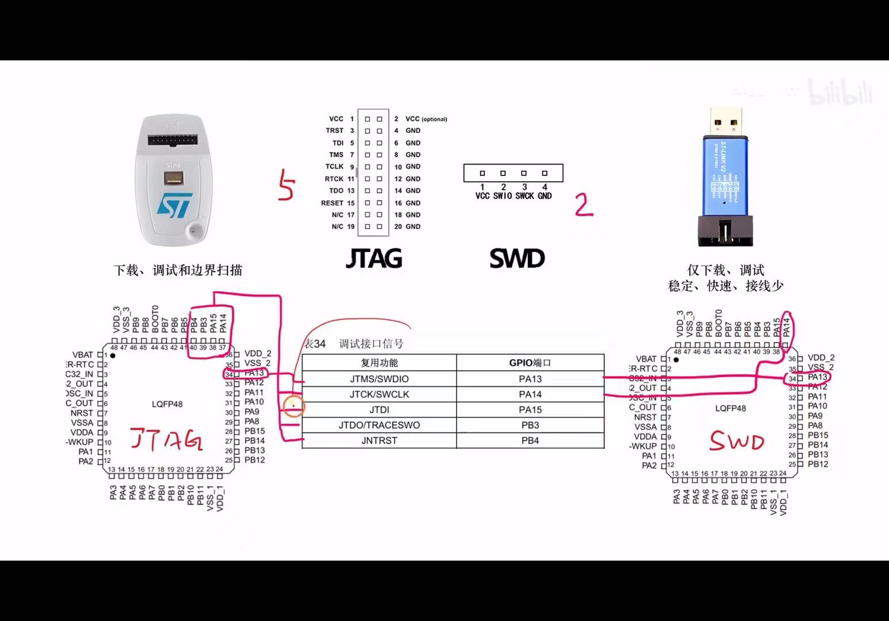
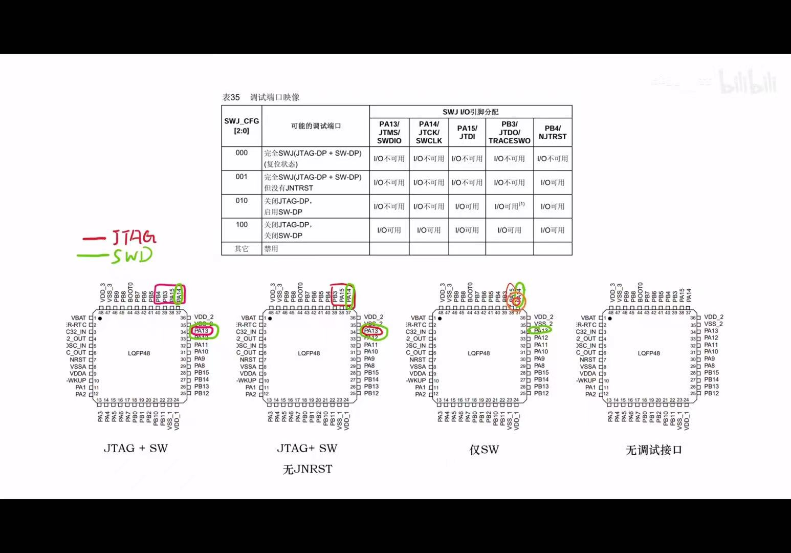
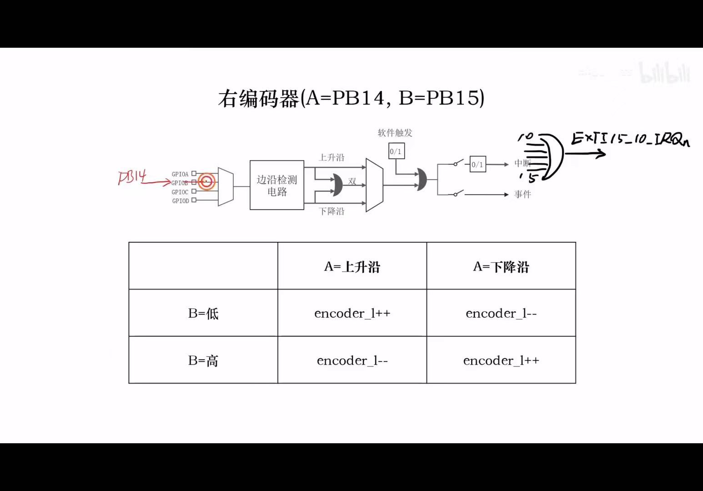
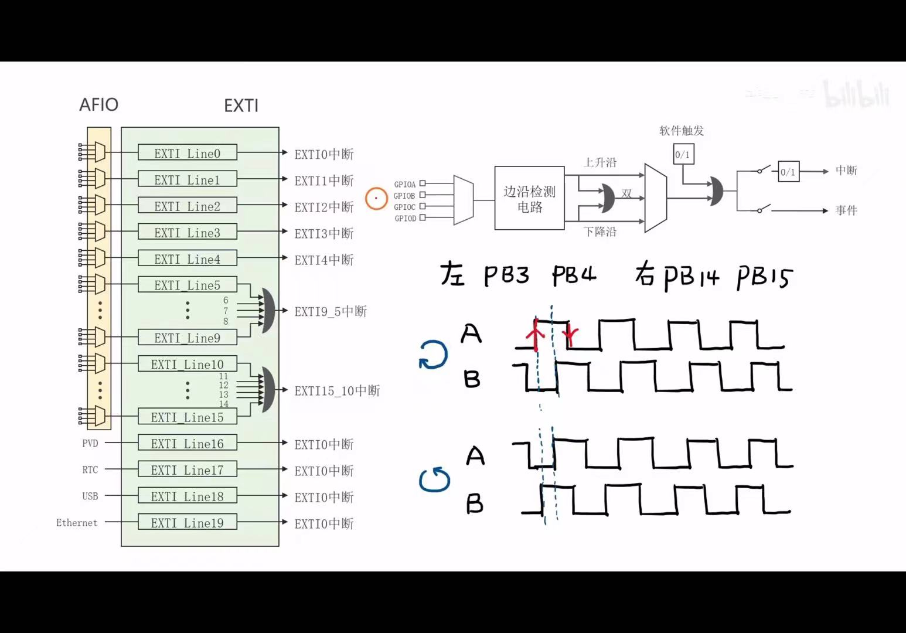
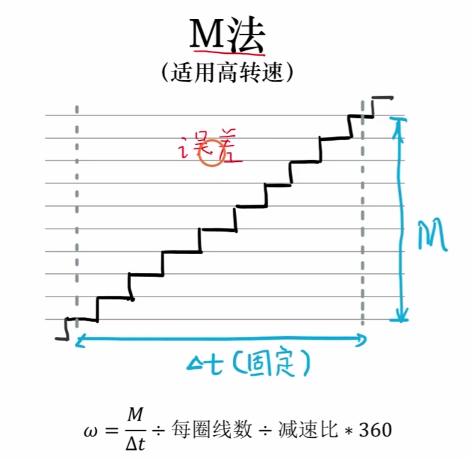
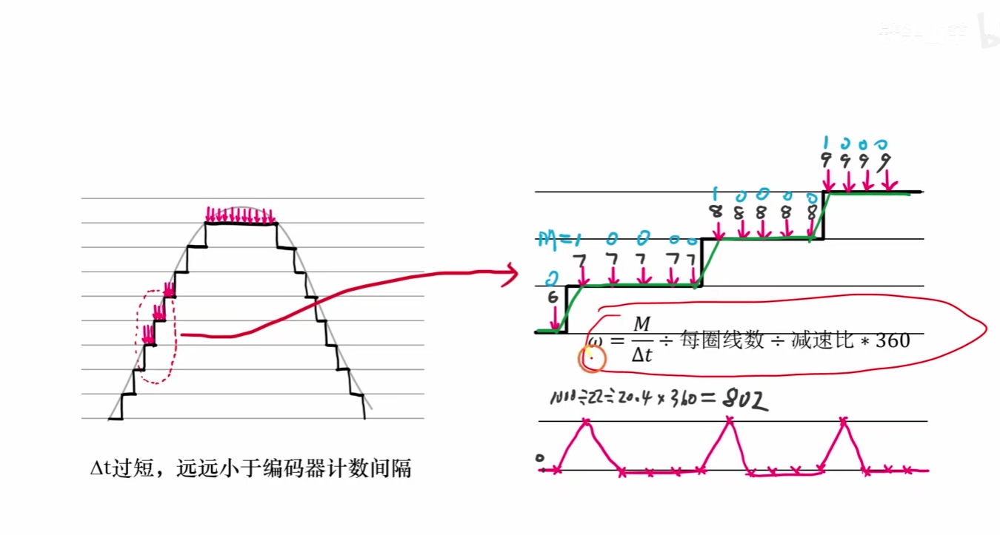
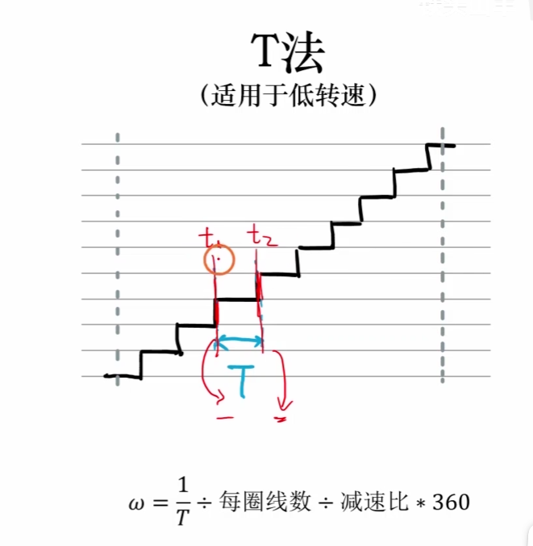
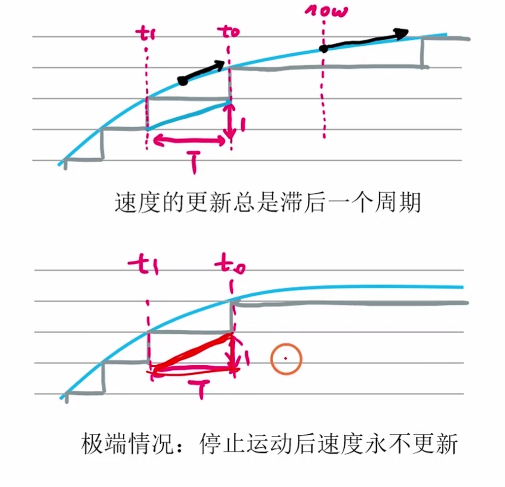
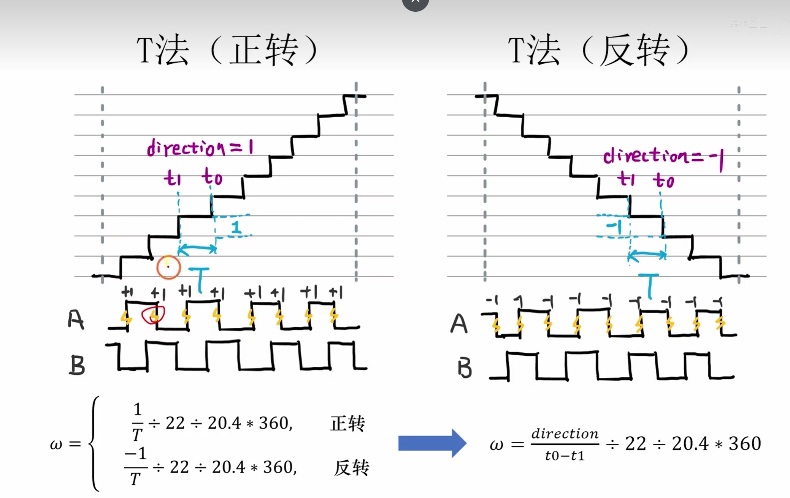

#### 硬件知识

##### 霍尔型编码器

- 通过查找脉冲的个数来判断转动角度
- 通过查找相位差来判断方向

##### 减速比认知

#### 代码逻辑端
1. 他本质适用GPIO中断的中断来完成编码器的测量，而非TIM的输入里面的编码器模式，采用EXTI的是单边双沿检测的逻辑
2. 所以就是配置GPIO的EXTI和NIVC模块 ，对于本事JTAG的端口要重映射成GPIO端口
3. 然后进行中断的配置和中断函数的明确书写逻辑
4. 然后进行基本的Test明确没有问题，这是测试pos模块
5. 然后进行pos->war公式的转换逻辑，这要看编码器内部的构造和电机的减速比
6. 进行算法的确认，和速度转换的逻辑

#### IO口的重映射逻辑

#### EXTI模块

- 主要就是初始化AFIO和EXTI，然后进行右上方的参数配置
- 明确线的编号，模式开关，捕获边沿
- 还有就是逻辑上的如何判断encoder的读值问题
- 对于多个比如`EXTI15_10`对于多段端口的中断，要明确是否为自己需要的中断

>TIPS
>CMD一般为开关
>算法里面明确数据单位

#### 算法模块

##### 霍伦滋线数->轮子转动角度

 **转动角度 = 编码器采样结果 / 磁环对数 / （单边单沿/单边双沿/双边双沿等情况）/ 减速比 * 360 **

##### 速度算法

###### M法测速

1. 公式

2.  误差来源
- 因为编码器的触发来源于电动机的带动，而时间的触发来源于单片机的信号，这两者之间存在时间的误差
- 这个时间的误差一般为2个上下沿，误差便是： 2/M，所以说M越大，误差越小

##### T法测速

1. 公式
 
2. 误差来源于T的计算，T的单位很重要，一开始选择的是用微妙来进行测量，会出现很多的问题
- 速度不归零问题
- 
**本质原因：速度更新的延时性质和只有当出现EXTI的中断才会进行计算的原因**

**解决方案：进行下次W的预测，T = MAX(T0-T1 , now-T0)**

- 换向波形问题

**本质原因：换向过程产生非常窄的脉冲**

**解决方案：强制令换线点为0**
- 中断毛刺问题

**本质问题：中断导致负数的出现，位的溢出**
**解决方案：进行中断的屏蔽和数据的记录，本质是为了进行数据读取的原子操作，和中断不进行长时间的计算考虑，非常值得学习的逻辑**

3.选择输入捕获来测量

##### PLL算法

##### 卡尔曼滤波算法