---
aliases:
  - MPU6050
  - 姿态传感器
  - 互补滤波姿态解算
tags:
  - STM32
  - 平衡小车
  - MPU6050
  - I2C
  - 姿态解算
  - 互补滤波
  - 工程复盘
related:
  - "[[5.PID模块]]"
  - "[[6.倒立摆]]"
  - "[[9.整体的工程思考和错误问题]]"
  - "[[10.源码和复刻项目的对比]]"
date: 2026-05-10
status: 样板整理完成
---

# MPU6050：从原始数据到平衡角反馈

> [!abstract] 实战场景
> MPU6050 是平衡小车的姿态传感器。它输出加速度计和陀螺仪原始数据，经过单位换算、角度解算和互补滤波后，形成 [[6.倒立摆]] 的角度反馈。

> [!note] 快速结论
> - 加速度计长期稳定但怕震动，陀螺仪短期平滑但会漂移。
> - 平衡车最关键的是 pitch 角，yaw 通常不能单靠加速度计得到。
> - 互补滤波的工程意义：用陀螺仪负责短期动态，用加速度计慢慢拉回长期零点。
> - I2C 读寄存器必须把高低字节拼接、符号扩展、量程系数和采样周期统一起来。

## 物理结构和传感器角色

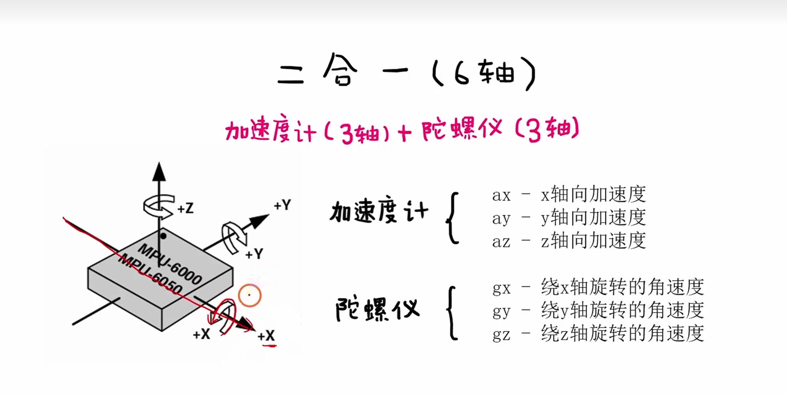

**图意：** MPU6050 内部包含三轴加速度计和三轴陀螺仪，两类传感器共同参与姿态估计。

**工程结论：** 不要把 MPU6050 理解成“直接给角度的芯片”。它给的是原始运动量，角度要靠算法解算。

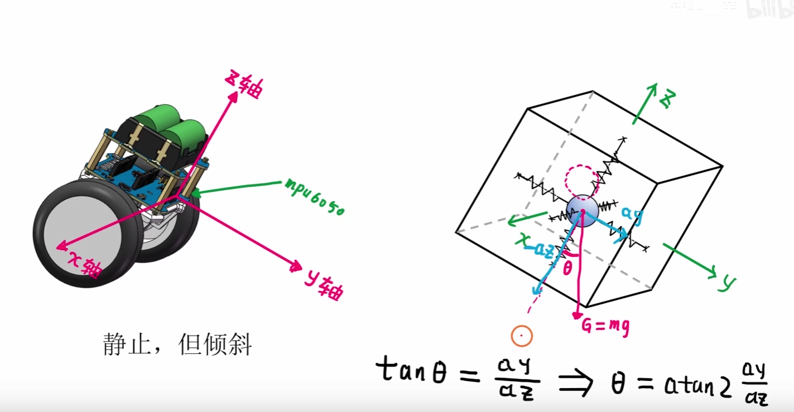

**图意：** 加速度计可以理解为测量质量块受到的惯性/重力方向变化。

**工程结论：** 静止或低动态时，加速度计能提供可靠的重力方向；小车震动和加减速时，它会把线加速度也混进去。

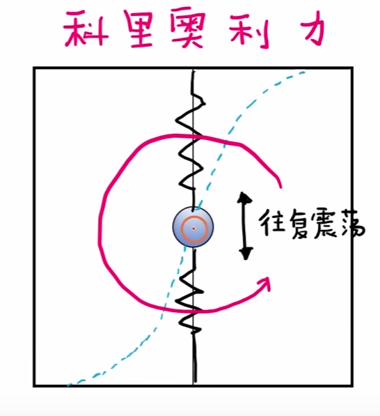

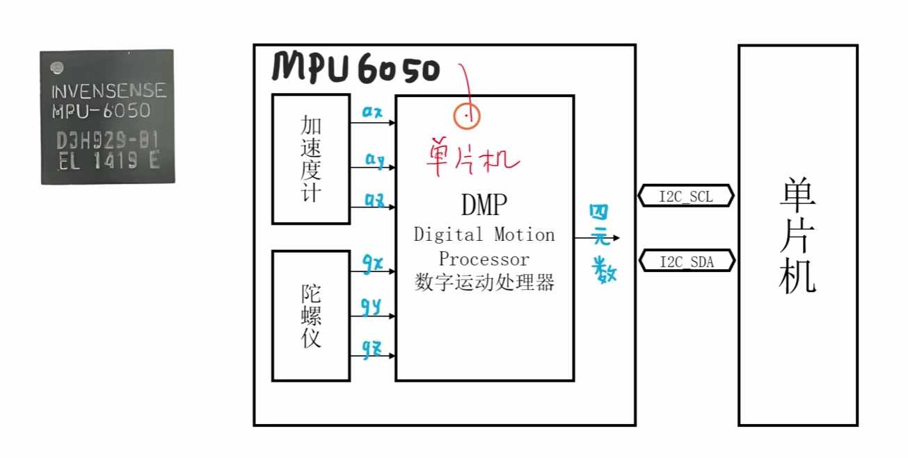

**图意：** 陀螺仪依靠科里奥利效应测量角速度。

**工程结论：** 陀螺仪积分能得到角度变化，短期响应好；但零偏会被积分成角度漂移，必须校准并融合加速度计。

## 软件链路

```text
I2C 初始化
  -> MPU6050 寄存器配置
  -> 读取 accel / gyro 原始值
  -> 高低字节拼接
  -> 单位换算
  -> gyro 积分角度
  -> accel 反三角角度
  -> 互补滤波
  -> pitch / roll
  -> [[6.倒立摆]]
```

**工程结论：** 姿态解算最怕“单位散落”。原始值、`g`、`deg/s`、`rad/s`、角度制、弧度制必须在代码里明确。

## 原始数据和单位换算

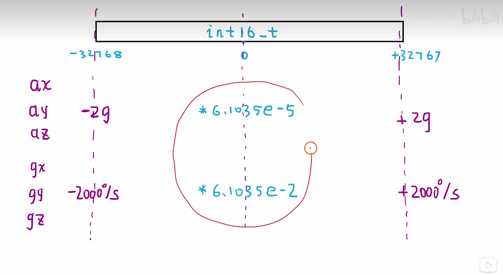

**图意：** 原始寄存器数据需要按量程系数换算成加速度和角速度。

**工程结论：** 数据手册里的 LSB/g、LSB/(deg/s) 是必须查的。量程配置变了，换算系数也必须同步变。

```c
int16_t make_int16(uint8_t high, uint8_t low)
{
    return (int16_t)((high << 8) | low);
}
```

> [!warning] 易错点：高低字节拼接后要保留符号
> MPU6050 原始数据是有符号 16 位数。拼接后要转成 `int16_t`，否则负数会被当成很大的正数。

## 欧拉角和互补滤波

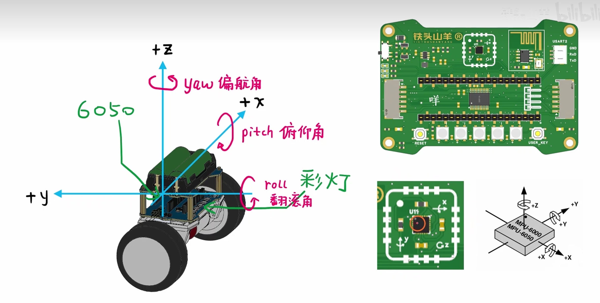

**图意：** yaw、pitch、roll 是姿态的三个欧拉角。平衡小车通常最关心 pitch。

**工程结论：** yaw 不能靠重力方向直接约束，单靠 MPU6050 的陀螺积分会漂；平衡控制阶段先把 pitch 做稳。

### 陀螺仪积分

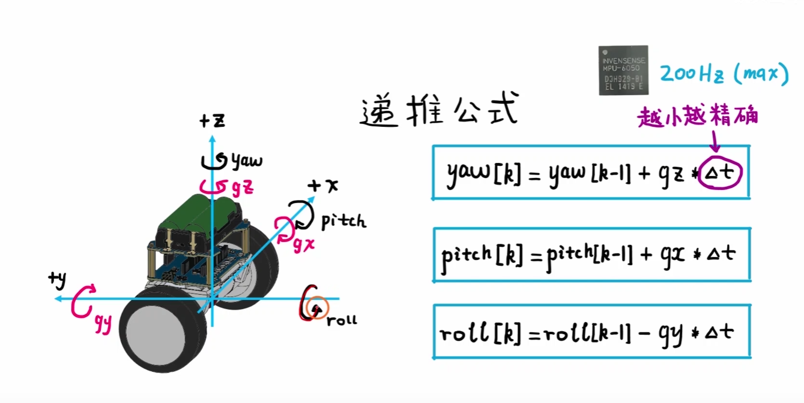

**图意：** 陀螺仪角速度通过时间积分得到角度变化。

**工程结论：** `angle += gyro_rate * dt` 的关键是 `dt` 稳定和零偏校准。`dt` 错了，滤波参数和 PID 参数都会跟着失真。

### 加速度计角度

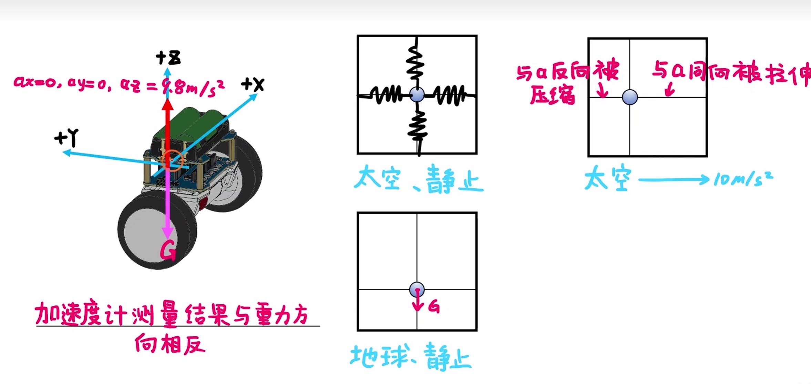

**图意：** 加速度计利用重力方向计算 pitch 和 roll。

**工程结论：** 加速度计适合提供长期角度参考，但车体加速、碰撞和电机震动会让瞬时角度很吵。

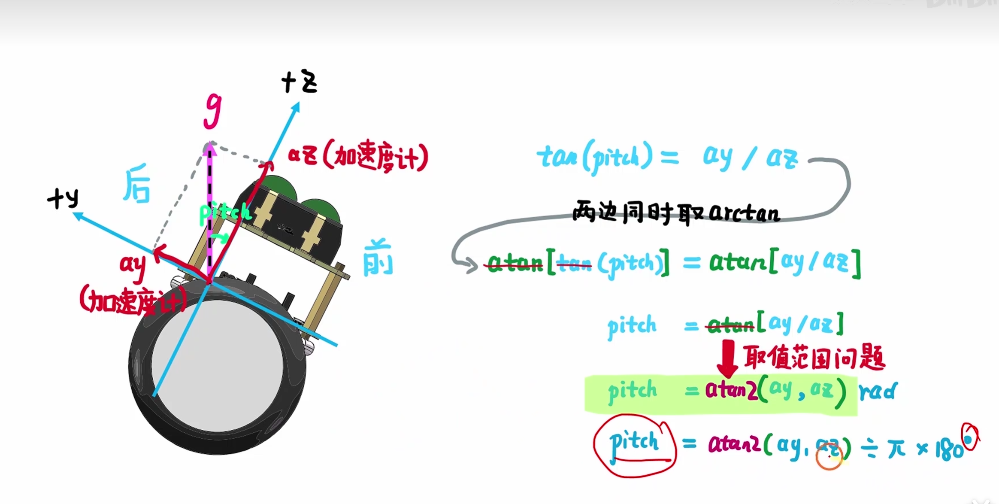

**图意：** pitch 角计算需要根据坐标关系选择合适的反三角函数。

**工程结论：** 优先使用 `atan2` 处理象限问题，不要只用 `atan`，否则角度范围会被限制，过零或大角度时容易错。

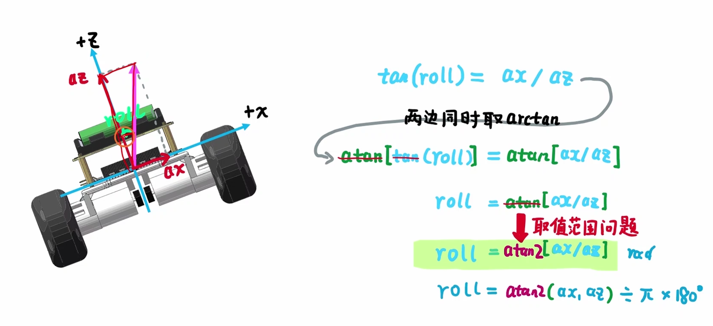

**图意：** roll 角计算同样依赖坐标轴定义。

**工程结论：** 板子安装方向一变，公式里的轴也要跟着变。先定义坐标系，再写公式。

### 互补融合

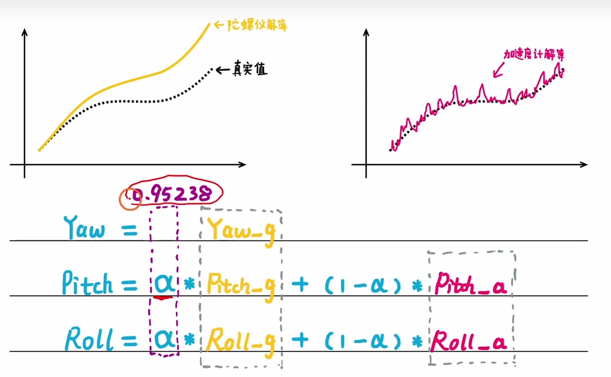

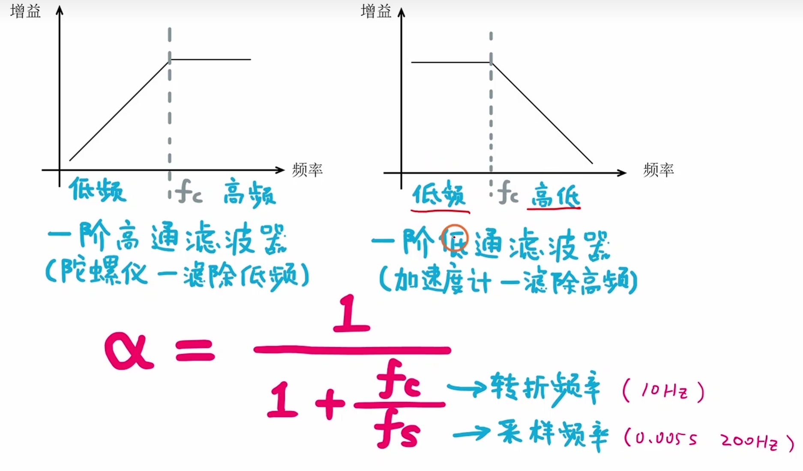

**图意：** 互补滤波把陀螺仪积分角和加速度计角度融合。

**工程结论：** 常见形式是：

```c
angle = alpha * (angle + gyro_rate * dt)
      + (1.0f - alpha) * accel_angle;
```

`alpha` 越大，越相信陀螺仪；`alpha` 越小，越相信加速度计。平衡车需要短期响应，通常会给陀螺仪更高权重。

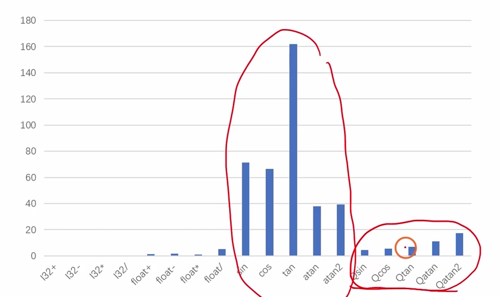

**图意：** 没有 FPU 时，可以考虑查表或近似计算三角函数。

**工程结论：** 优化之前先确认瓶颈。姿态周期不高时，先保证公式正确和单位一致，再考虑查表优化。

## I2C 和寄存器读写

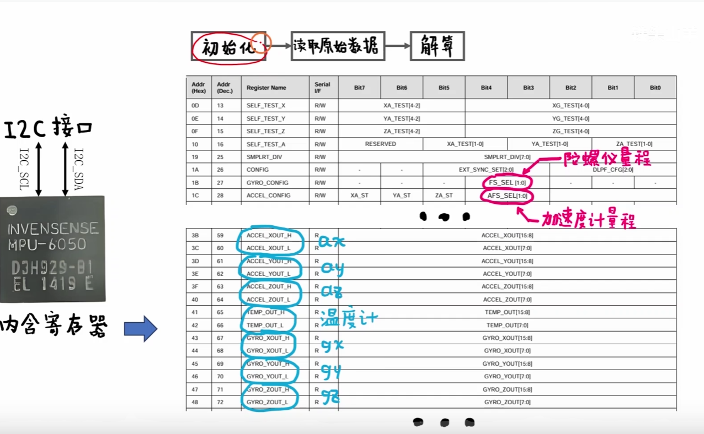

**图意：** MPU6050 的配置和数据读取都通过寄存器完成。

**工程结论：** 会读数据手册很重要。初始化本质是写寄存器，采样本质是连续读寄存器。

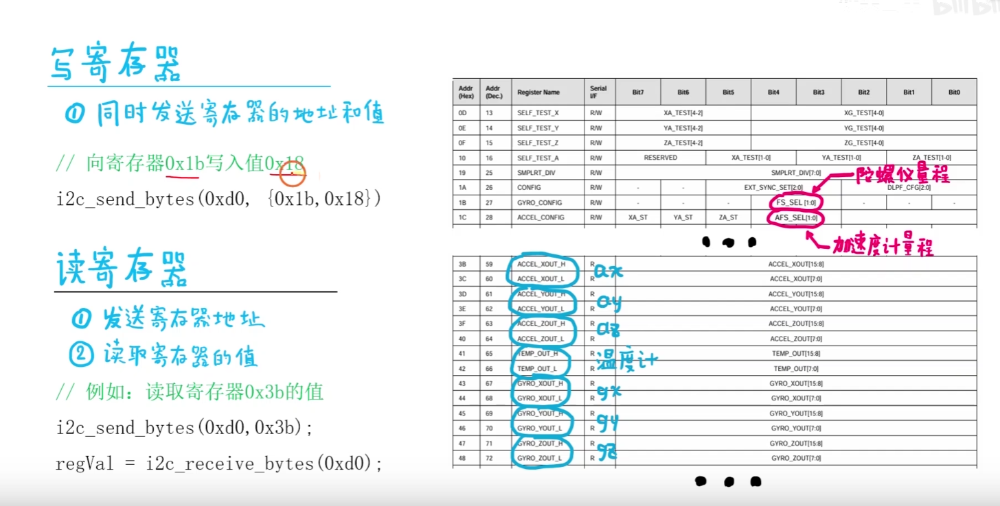

**图意：** I2C 读写函数应先封装“设备地址 + 寄存器地址 + 数据”，再在 MPU6050 层做语义化初始化。

**工程结论：**
- 底层 I2C 只管读写。
- MPU6050 驱动层隐藏设备地址和寄存器细节。
- 应用层只拿姿态角，不要直接散读寄存器。

> [!warning] 易错点：I2C 重映射和上拉
> I2C 线需要上拉，且部分引脚可能涉及重映射。初始化失败时先用逻辑分析仪或串口打印确认 ACK，不要直接怀疑滤波算法。

## 调试和排错

| 现象 | 优先怀疑 | 验证动作 |
| --- | --- | --- |
| I2C 无响应 | 地址错、上拉缺失、引脚重映射错 | 扫描地址，检查 ACK |
| 原始值全 0 或固定 | 寄存器没读对、设备未唤醒 | 先读 WHO_AM_I |
| 角度缓慢漂移 | 陀螺零偏未校准 | 静止采样求 offset |
| 角度抖动大 | 加速度噪声、电机震动 | 调 `alpha` 或做低通 |
| 接入倒立摆后发散 | 坐标轴方向、角度符号、单位错误 | 手动前后倾，确认 pitch 正负 |

## 后续连接

- [[6.倒立摆]]：姿态角是直立环的核心反馈。
- [[5.PID模块]]：PID 的测量值来自姿态解算结果。
- [[9.整体的工程思考和错误问题]]：记录 I2C、零偏、坐标系、滤波参数问题。
- [[10.源码和复刻项目的对比]]：后续对比原项目初始化寄存器、滤波算法和采样周期。
