---
aliases:
  - 倒立摆
  - 平衡车直立控制
  - 串级 PID 控制
tags:
  - STM32
  - 平衡小车
  - 倒立摆
  - 串级PID
  - 控制系统
  - 工程复盘
related:
  - "[[4.MPU6050]]"
  - "[[5.PID模块]]"
  - "[[7.速度环]]"
  - "[[2.电机模块]]"
  - "[[9.整体的工程思考和错误问题]]"
  - "[[10.源码和复刻项目的对比]]"
date: 2026-05-11
status: 样板整理完成
---

# 倒立摆：从姿态反馈到串级 PID

> [!abstract] 实战场景
> 平衡小车的核心问题是“车体天然会倒”。[[4.MPU6050]] 给出车体倾角，[[5.PID模块]] 根据角度误差算出控制量，[[2.电机模块]] 用电机输出把车轮推到合适位置，最终让车体重新回到平衡点。

> [!note] 快速结论
> - 倒立摆控制先解决“站住”，再解决“不要跑远”。
> - 内环通常是角度环，负责快速拉回车体角度；外环通常是 [[7.速度环]]，负责让小车长期位置/速度不漂。
> - 非线性模型可以帮助理解，但工程落地时先做小角度近似和串级 PID。
> - 信息不全时先记录“待实测”：车体重心、轮距、采样周期、角度零点、电机方向、PID 参数都必须在实车上校准。

## 总体架构

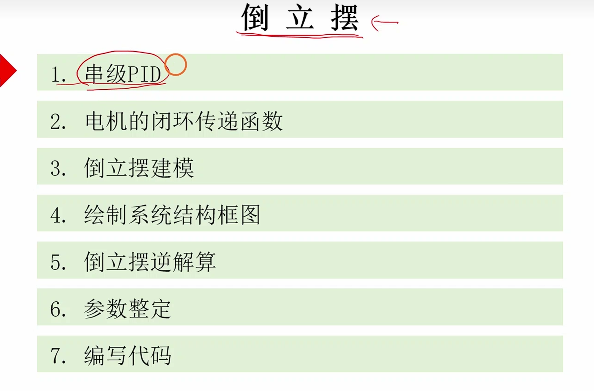

**图意：** 倒立摆控制的总体路线：传感器得到姿态，控制器计算修正，电机执行输出。

**工程结论：** 这不是单个 PID 就能完全解释的问题。它至少牵涉姿态反馈、角度控制、电机执行、速度反馈和安全保护。

## 物理模型

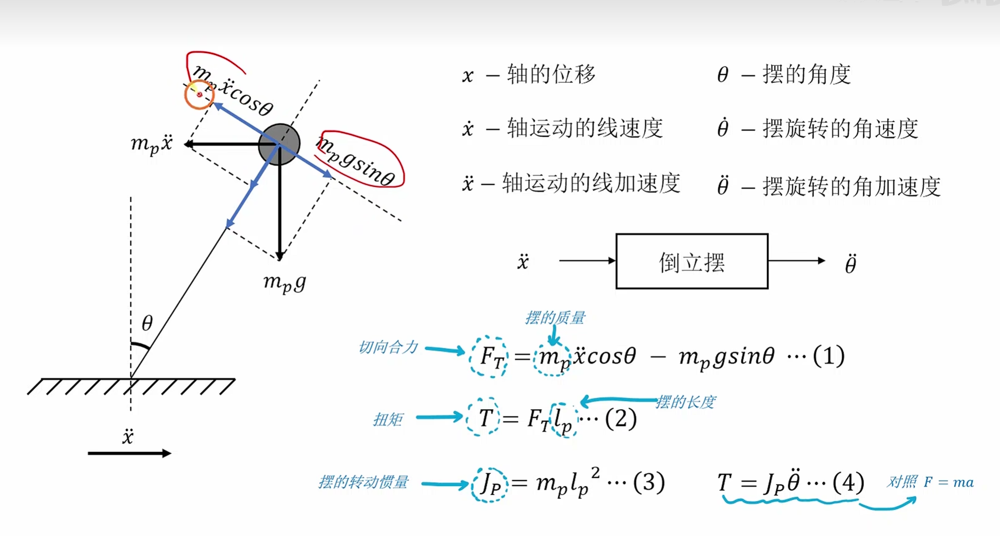

**图意：** 倒立摆受力图，把车轮水平加速度、摆杆角度、重力分量、切向合力和转动惯量放到同一个模型里。

**工程结论：** 小车想站住，本质上是让轮子移动产生合适的水平加速度，从而让车体角加速度朝着回正方向变化。

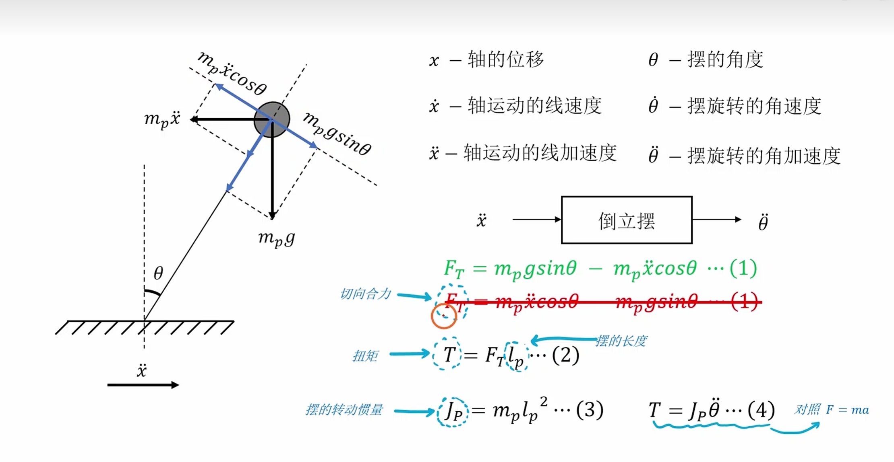

**图意：** 倒立摆物理模型进一步说明轴向运动线加速度和摆杆角加速度之间的关系。

**工程结论：** 角度环输出不是“角度本身”，而是要经过电机和轮子变成水平运动，再间接影响角度。

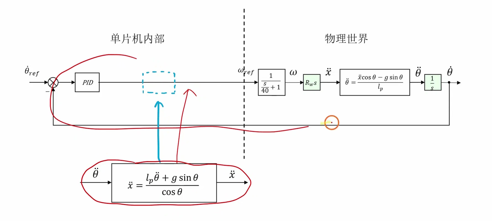

**图意：** 原始非线性模型中会出现 `sin(theta)`、`cos(theta)` 等项。

**工程结论：** 平衡车正常工作在小角度附近，所以可以先使用小角度近似：`sin(theta) ~= theta`，`cos(theta) ~= 1`。如果车体已经大角度倾倒，线性控制器不应该继续强行救车，而应该进入保护。

> [!warning] 易错点：模型不是为了背公式
> 对复刻项目来说，模型的价值是解释控制方向和参数影响。不要因为模型没推完就停住工程，也不要在模型不清楚时盲目加大 PID 参数。

## 串级 PID

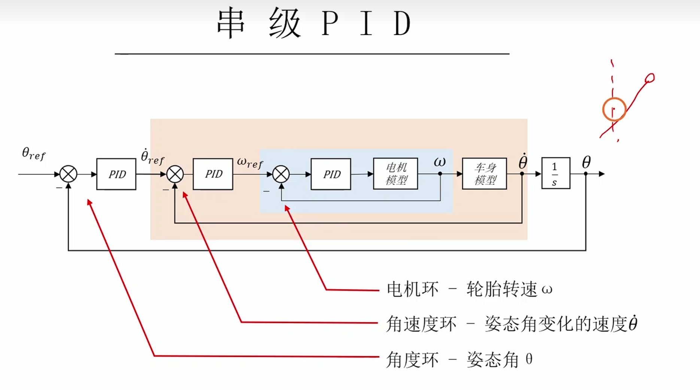

**图意：** 串级 PID 用多个闭环分层控制同一个对象。

**工程结论：** 平衡车常见结构是：速度外环给出期望倾角，角度内环根据期望倾角和实际倾角计算电机输出。内环必须比外环更快、更稳。

```text
速度目标
  -> 速度环
  -> 期望角度
  -> 角度环
  -> 电机输出
  -> 车体运动
  -> 编码器 / MPU6050 反馈
```

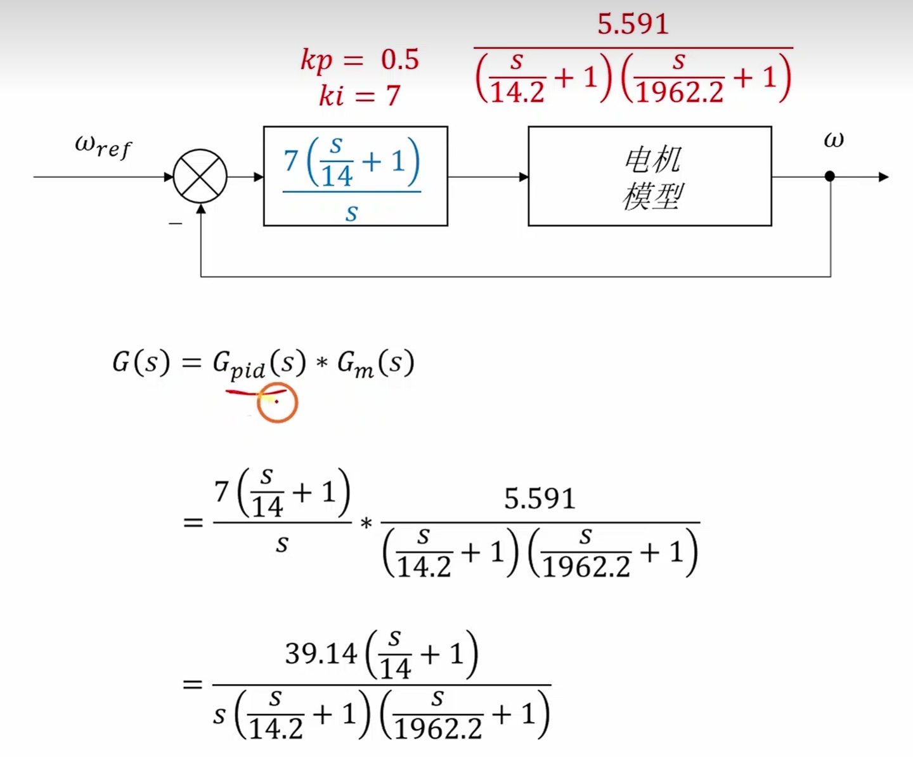

**图意：** 传递函数和控制结构之间的关系，用来把物理对象转成控制系统块图。

**工程结论：** 每一环都要明确输入、输出和反馈。不要把速度误差、角度误差、电机 PWM 混成一个变量。

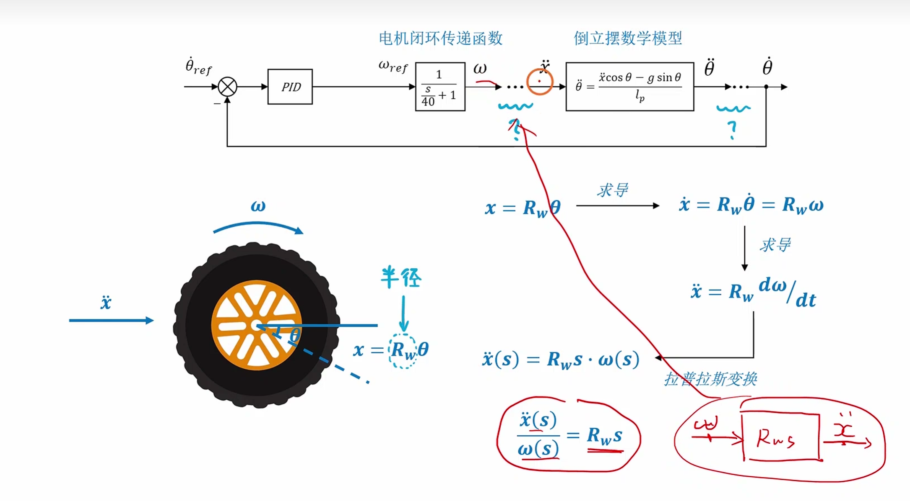

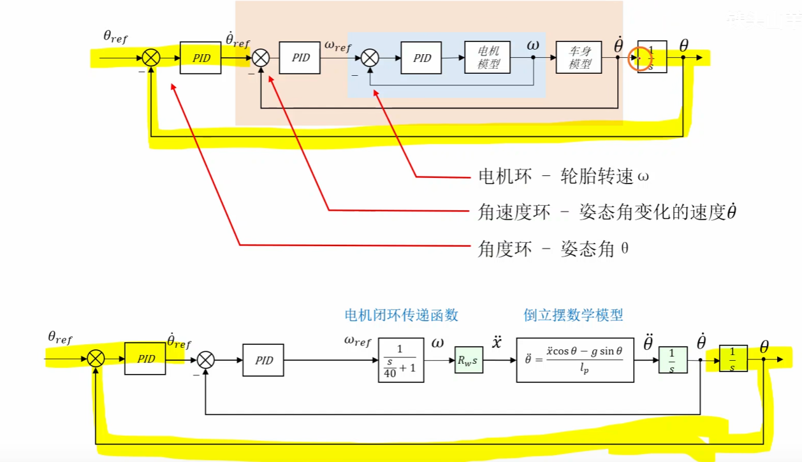

**图意：** 多个 PID 之间的联系和换算逻辑。

**工程结论：** 串级控制里外环输出通常不是直接 PWM，而是内环的目标值。例如速度环输出一个“期望倾角”，角度环再输出电机命令。

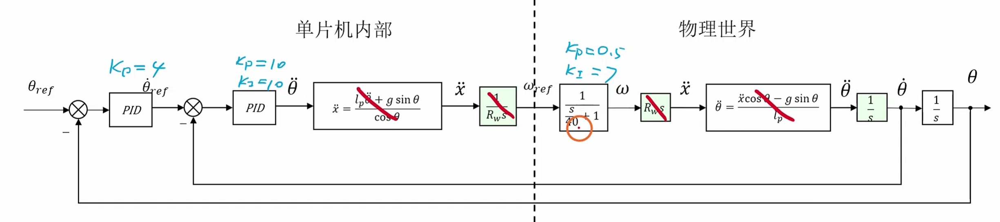

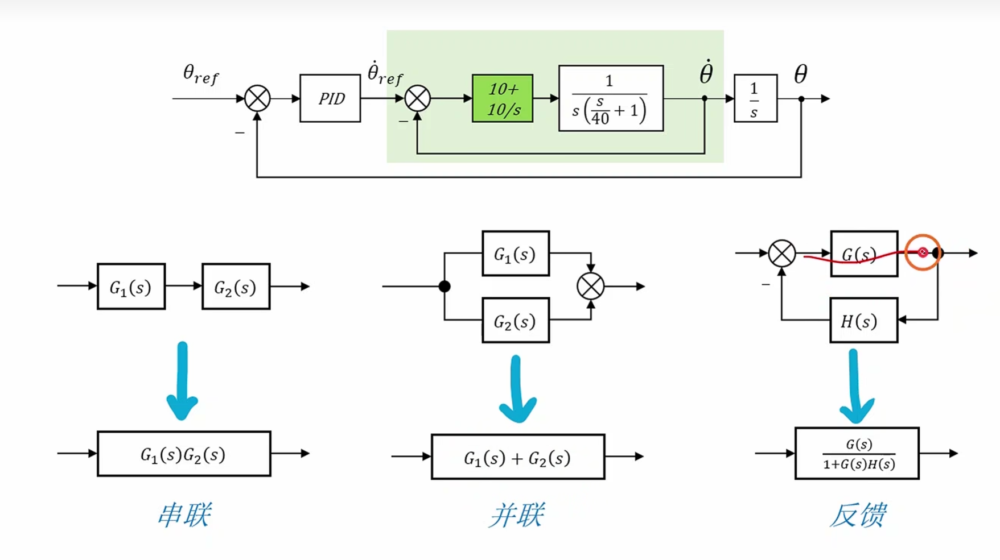

**图意：** 补充素材用于串联、并联、反馈结构化简和闭环关系理解。

**工程结论：** 这些图的落点是：先看清楚闭环结构，再谈参数。闭环方向反了，公式再漂亮也会发散。

## 控制量映射

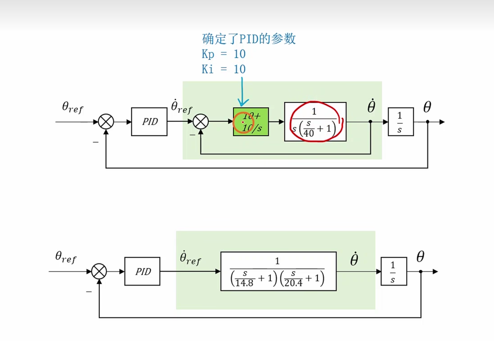

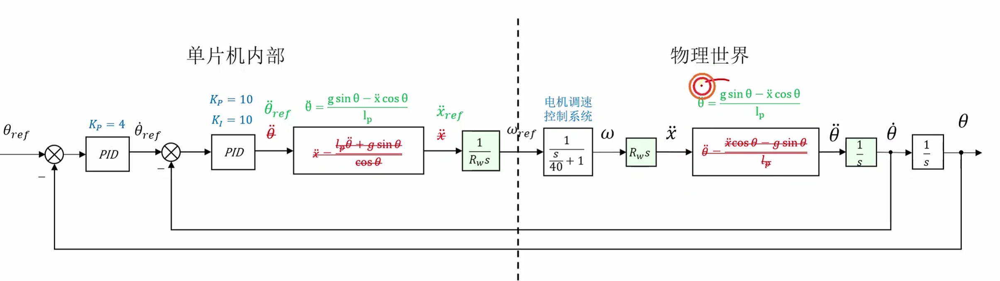

**图意：** 多个 PID 参数设定和控制输出约束。

**工程结论：**
- 角度环输出需要限幅，再交给 [[2.电机模块]]。
- 速度环输出也要限幅，否则会给角度环一个不现实的目标角度。
- 模式切换、扶起小车、失控保护时要复位 PID 内部状态。

> [!warning] 易错点：先调内环，再调外环
> 角度环没有站稳前，不要急着加速度环。否则你看到的漂移、震荡、冲出去，可能不是速度环问题，而是内环还没有基本稳定。

## `app_control` 代码逻辑

> [!note] 工程补充
> 这里没有完整源码，所以只写控制文件的职责和伪代码，不写死真实引脚或参数。

```c
void app_control_init(void)
{
    pid_init(&angle_pid);
    pid_init(&speed_pid);
    control_reset();
}

void app_control_update(float dt)
{
    float angle = imu_get_pitch();
    float speed = encoder_get_speed();

    float target_angle = pid_compute(&speed_pid, target_speed, speed);
    target_angle = limit(target_angle, -MAX_TARGET_ANGLE, MAX_TARGET_ANGLE);

    float motor_output = pid_compute(&angle_pid, target_angle, angle);
    motor_output = limit(motor_output, -MAX_MOTOR_OUTPUT, MAX_MOTOR_OUTPUT);

    motor_set_left((int16_t)motor_output);
    motor_set_right((int16_t)motor_output);
}
```

**工程结论：** `app_control` 应该负责“调度控制链路”，不应该把 MPU6050 原始寄存器读取、电机 GPIO 细节、编码器 EXTI 细节全部塞进来。

## 调试和排错

| 现象 | 优先怀疑 | 验证动作 |
| --- | --- | --- |
| 一上电就冲出去 | 角度符号、电机方向、PID 输出方向反了 | 手动倾斜车体，观察输出方向 |
| 能站但抖得厉害 | 角度环 `Kp` 太大、`Kd` 噪声大、采样周期不稳 | 固定 `dt`，先降 `Kp` |
| 慢慢跑远 | 缺速度环或速度环极性错误 | 先保持角度环稳定，再接 [[7.速度环]] |
| 扶起后突然大输出 | PID 积分/微分状态未复位 | 模式切换时调用 reset |
| 大角度倒下还猛转 | 没有保护角阈值 | 超过安全角度停电机 |

## 待实测参数

- 车体直立零点角度。
- MPU6050 安装方向和 pitch 正负号。
- 角度环采样周期。
- 电机正输出对应车轮实际方向。
- 角度环 `Kp/Ki/Kd`、速度环 `Kp/Ki/Kd`。
- 保护角度、最大目标角、最大电机输出。

## 后续连接

- [[4.MPU6050]]：提供姿态角反馈。
- [[5.PID模块]]：提供 PID 结构体、限幅、复位和计算逻辑。
- [[7.速度环]]：作为外环解决长期漂移。
- [[2.电机模块]]：执行控制输出。
- [[9.整体的工程思考和错误问题]]：记录方向反、参数发散、保护不足等问题。
- [[10.源码和复刻项目的对比]]：后续对比原项目的串级结构、参数和保护策略。
