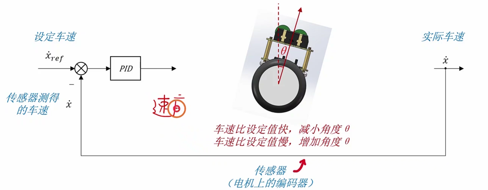
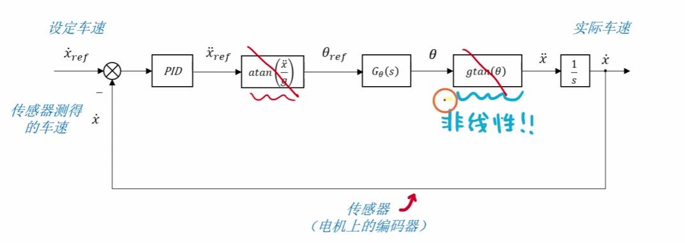
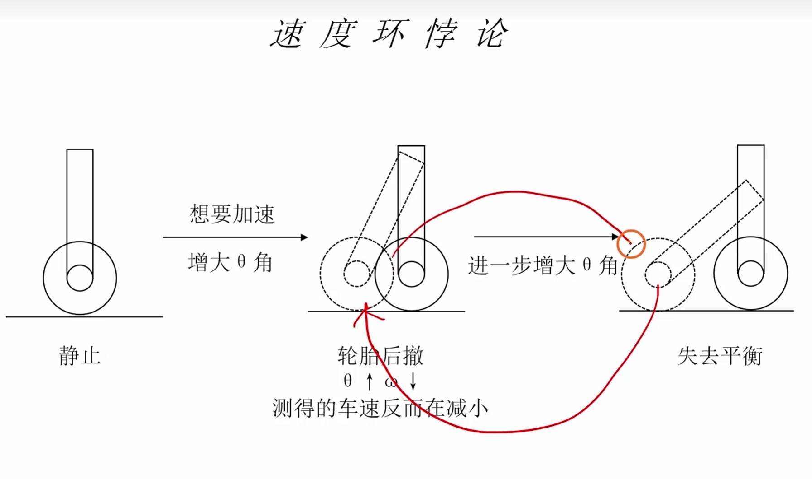
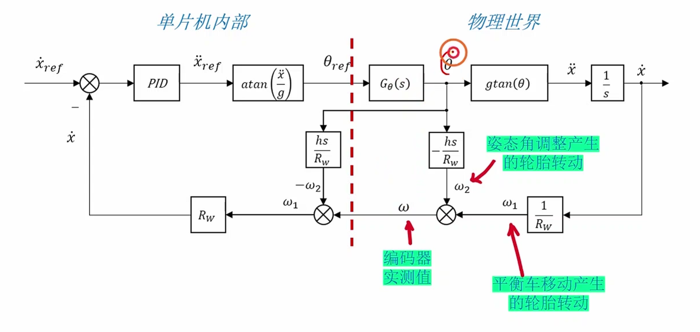
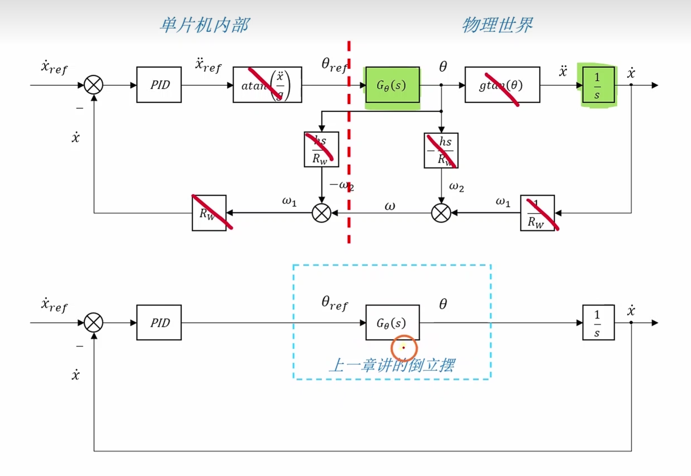
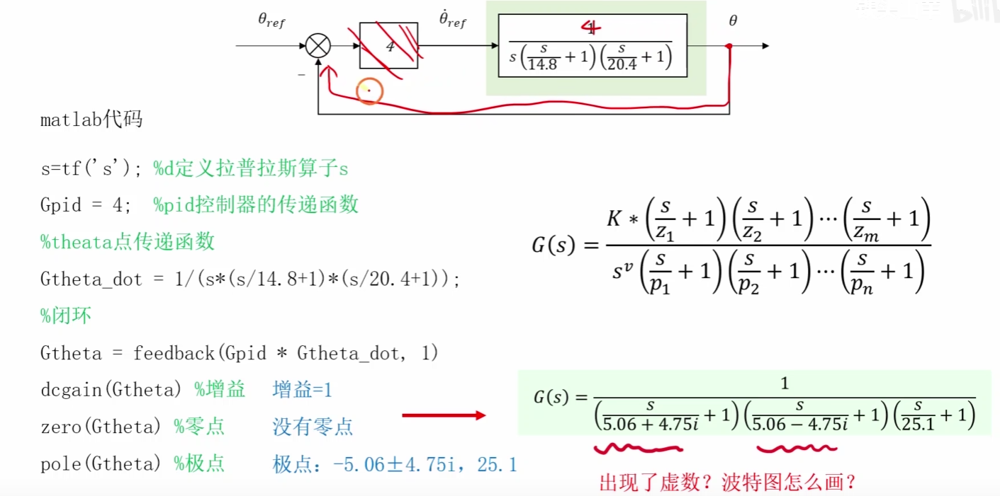
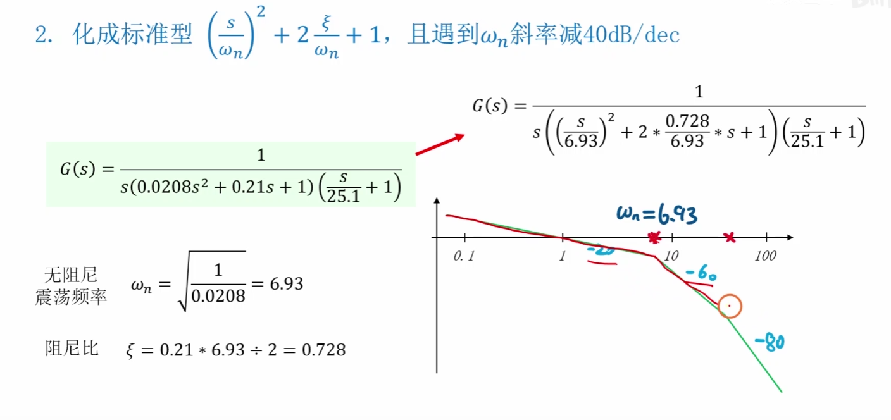
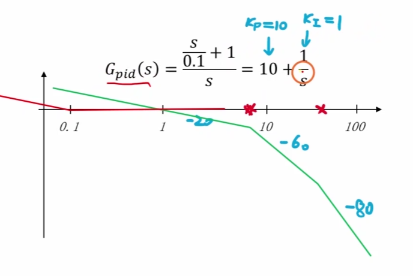

---
aliases:
  - 速度环
  - 平衡车速度闭环
  - 外环速度控制
tags:
  - STM32
  - 平衡小车
  - 速度环
  - 串级PID
  - 控制系统
  - 工程复盘
related:
  - "[[3.编码器模块]]"
  - "[[5.PID模块]]"
  - "[[6.倒立摆]]"
  - "[[2.电机模块]]"
  - "[[9.整体的工程思考和错误问题]]"
  - "[[10.源码和复刻项目的对比]]"
date: 2026-05-11
status: 样板整理完成
---

# 速度环：解决站得住但会跑的问题

> [!abstract] 实战场景
> 角度环能让小车“站住”，但不一定能让它“停在原地”。因为只要角度零点、地面摩擦、电机死区、重心偏差存在一点误差，小车就可能慢慢跑走。速度环就是用 [[3.编码器模块]] 的速度反馈，给 [[6.倒立摆]] 的角度环一个动态目标，让小车长期不漂。

> [!note] 快速结论
> - 速度环是外环，角度环是内环。
> - 速度环输出通常不是直接 PWM，而是期望倾角。
> - 先调稳角度环，再逐步加入速度环。
> - 单位换算必须清楚：编码器计数、轮子角速度、车体线速度、目标倾角不能混在一起。

## 为什么要加速度环



**图意：** 原图说明偏差产生的原因：真实系统不是理想模型，单靠角度回正会留下长期漂移。

**工程结论：** 角度环只关心车体是否直立，不关心车有没有移动。速度环用“轮子速度”来修正长期趋势。

```text
目标速度
  -> 速度 PID
  -> 目标倾角
  -> 角度 PID
  -> 电机输出
  -> 车轮速度
  -> 编码器反馈
```

> [!warning] 易错点：速度环不是直接抢电机
> 如果速度环直接输出 PWM，会和角度环抢执行器。更常见的串级方式是速度环输出目标角度，让角度环继续负责快速稳定。

## 单位换算



**图意：** 速度环里需要把编码器计数转换成轮速、车速或角速度。

**工程结论：** 速度环调不稳时，先查单位。`pulse/s`、`rad/s`、`rpm`、`m/s` 如果混用，PID 参数会变得完全不可解释。

```text
encoder_delta
  -> 电机轴转角
  -> 除以减速比
  -> 轮子转角
  -> 除以采样周期
  -> 轮子角速度
  -> 乘以轮半径
  -> 车体线速度
```

## 速度环悖论



**图意：** 原图讨论速度环的“悖论”：为了让车速变小，小车反而可能需要先倾斜并移动。

**工程结论：** 平衡车不是普通小车。它要改变速度，必须先改变姿态；所以速度环输出目标倾角是合理的，而不是直接要求电机“减速”。





**图意：** 用多维变量解释速度环：速度 `W` 不是单一因素，受到姿态、电机输出、轮子运动和反馈延迟共同影响。

**工程结论：** 如果速度环一加就震，不要只改 `Kp`。要同时检查角度环是否足够快、编码器方向是否正确、速度滤波是否过慢。

## `Gθ(s)` 建模思路







**图意：** 这些图尝试从系统方程推导 `Gθ(s)`，也就是目标倾角、车体角度和运动响应之间的关系。

**工程结论：** 建模的作用是说明“速度外环为什么要慢”。如果外环太快，它会频繁改变目标倾角，内环来不及稳定，整车就会抽动。

> [!note] 工程补充
> 复刻阶段不需要先把传递函数完全推完。更实用的顺序是：角度环站稳，编码器速度可信，速度目标小范围变化，再慢慢加外环增益。

## 代码落点

```c
void app_control_update(float dt)
{
    float speed = encoder_get_speed();
    float angle = imu_get_pitch();

    float target_angle = pid_compute(&speed_pid, target_speed, speed);
    target_angle = limit(target_angle, -MAX_TARGET_ANGLE, MAX_TARGET_ANGLE);

    float motor_output = pid_compute(&angle_pid, target_angle, angle);
    motor_output = limit(motor_output, -MAX_MOTOR_OUTPUT, MAX_MOTOR_OUTPUT);

    motor_set_left((int16_t)motor_output);
    motor_set_right((int16_t)motor_output);
}
```

**工程结论：**
- `speed_pid` 的输出是 `target_angle`。
- `angle_pid` 的输出是 `motor_output`。
- `MAX_TARGET_ANGLE` 是速度环安全边界，必须远小于失控角度。
- 速度环可以先只用 PI，微分项谨慎加入。

## 调参顺序

1. 关闭速度环，只调角度环，让车能短时间站住。
2. 验证编码器速度方向：往前推，速度符号符合定义。
3. 速度环只开很小 `Kp`，观察是否能减小漂移。
4. 逐步加入 `Ki`，消除长期速度误差。
5. 对速度环输出目标角做限幅。
6. 如果震荡，先降速度环增益，不要急着改角度环。

> [!warning] 易错点：速度环积分很容易堆积
> 小车被手按住、轮子卡住、速度目标突然变化时，速度环积分会快速累积。必须做积分限幅和模式切换复位。

## 调试和排错

| 现象 | 优先怀疑 | 验证动作 |
| --- | --- | --- |
| 加速度环后立刻冲走 | 速度反馈方向反了、目标角方向反了 | 手推车轮，看 `speed` 符号 |
| 小车来回慢摆 | 速度环太强、积分太大 | 降 `Kp/Ki`，加目标角限幅 |
| 能站但一直漂 | 速度环没接入、编码器死区、角度零点偏 | 打印速度和目标角 |
| 速度显示跳变 | 编码器毛刺、测速算法不稳 | 回到 [[3.编码器模块]] 检查 |
| 电机输出长期打满 | 目标角过大、输出限幅不合理 | 检查 [[5.PID模块]] 限幅 |

## 后续连接

- [[3.编码器模块]]：速度反馈来源。
- [[6.倒立摆]]：速度环作为外环给角度环目标。
- [[5.PID模块]]：速度 PID 的计算、限幅和复位策略。
- [[2.电机模块]]：最终执行速度环影响后的电机输出。
- [[9.整体的工程思考和错误问题]]：记录速度方向、积分堆积、慢摆等问题。
- [[10.源码和复刻项目的对比]]：后续对比原项目速度环参数、滤波和目标角限幅。
