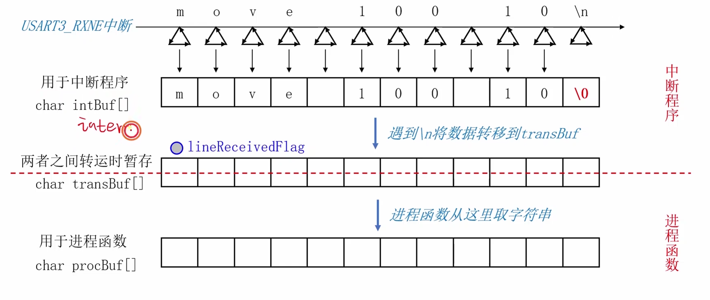
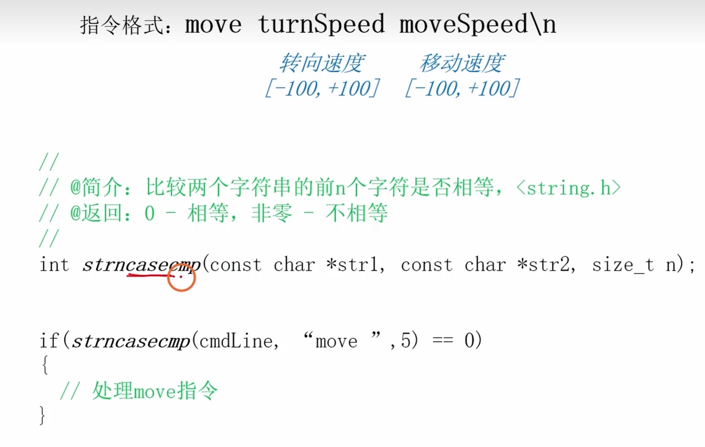
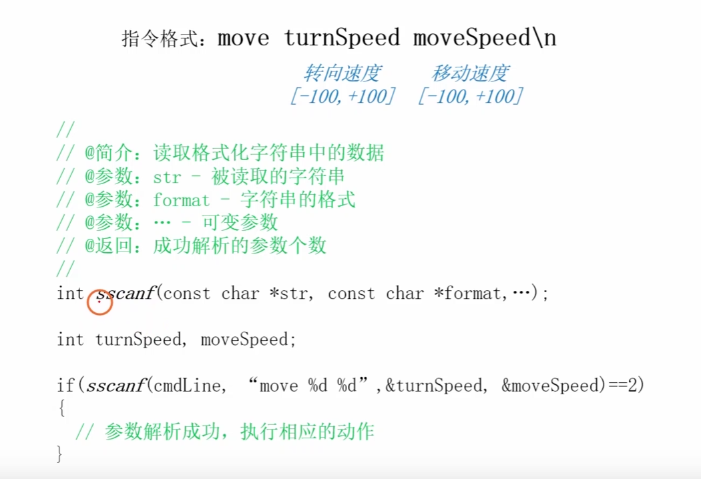
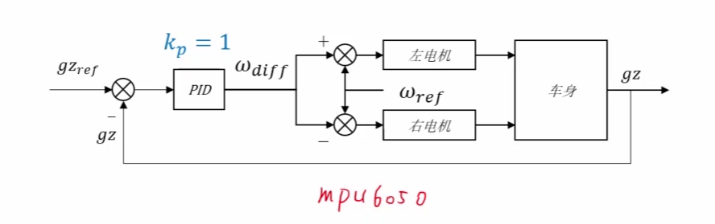

---
aliases:
  - 蓝牙控制模块
  - USART 蓝牙调参
  - RXNE 指令解析
tags:
  - STM32
  - 平衡小车
  - 蓝牙
  - USART
  - 指令解析
  - 工程复盘
related:
  - "[[1.ADC-采样电源]]"
  - "[[2.电机模块]]"
  - "[[5.PID模块]]"
  - "[[7.速度环]]"
  - "[[9.整体的工程思考和错误问题]]"
date: 2026-05-11
status: 样板整理完成
---

# 蓝牙控制模块：从 RXNE 中断到指令调参

> [!abstract] 实战场景
> 蓝牙模块的工程价值不是“无线串口能收字节”，而是让小车在不重新烧录的情况下完成调参、模式切换和状态观察。它需要把 USART 接收、中断缓冲、指令解析和控制参数修改分层处理。

> [!note] 快速结论
> - RXNE 中断只负责接收字节，不负责解析复杂命令。
> - 中断缓冲区和主循环解析区是生产者-消费者关系。
> - 指令必须有边界，例如换行符、固定帧头帧尾或长度字段。
> - 蓝牙调参必须加安全限制，不能让外部命令直接写出危险 PID 或电机输出。

## 接收链路



**图意：** USART3 的 `RXNE` 中断逐字节接收数据，先放进中断缓冲区 `intBuf`，遇到换行符后转移到 `transBuf`，主循环再取出处理。

**工程结论：** 这是典型的生产者-消费者模型：中断是生产者，主循环是消费者。中断只管快进快出，解析放在主循环。

外部参考：详细缓冲区思路见 [环形缓冲区](../../../../算法/嵌入式实战/4.Ring%20Buffer%20与掩码取模.md)。

```text
USART RXNE
  -> intBuf 接收字节
  -> 检测 '\n'
  -> lineReceivedFlag = 1
  -> transBuf 保存完整命令
  -> 主循环解析命令
  -> 修改目标速度 / PID 参数 / 模式
```

> [!warning] 易错点：不要在中断里解析命令
> 字符串匹配、参数转换、串口打印都不适合放在 RXNE ISR 里。中断里做太多事情，会影响控制周期，严重时会让平衡控制抖动。

## USART 初始化和 RXNE 中断

**工程补充：** 当前笔记没有完整 pin map，所以这里只保留标准职责，不写死真实 USART 编号和引脚。

```c
void bt_usart_init(void)
{
    /*
     * 1. 配置 TX 为复用推挽输出
     * 2. 配置 RX 为上拉输入
     * 3. 初始化 USART 波特率、8N1、收发模式
     * 4. 使能 RXNE 中断
     * 5. 配置 NVIC
     * 6. 使能 USART
     */
}
```

```c
void USARTx_IRQHandler(void)
{
    if (USART_GetITStatus(USARTx, USART_IT_RXNE) == SET) {
        char ch = (char)USART_ReceiveData(USARTx);
        bt_rx_push_from_isr(ch);
        USART_ClearITPendingBit(USARTx, USART_IT_RXNE);
    }
}
```

**工程结论：**
- RX 空闲态应该保持高电平，和 [[1.ADC-采样电源]] 里 USART 调试链路一致。
- 蓝牙模块本质上是串口透传，先按普通 USART 调通，再谈协议。
- 接收缓冲区必须防溢出，超长命令要丢弃或截断。

## 指令解析

原文的核心步骤是：判断指令名称，解析指令参数。整理成工程接口后，可以按“命令名 + 参数”的方式处理。

```text
spd 0.20
kp_angle 15.0
ki_speed 0.05
mode stop
status?
```

```c
void bt_command_process(const char *line)
{
    if (starts_with(line, "spd ")) {
        float target = parse_float_arg(line);
        target_speed_set(limit(target, -MAX_SPEED_CMD, MAX_SPEED_CMD));
        return;
    }

    if (starts_with(line, "mode stop")) {
        control_stop();
        return;
    }

    if (starts_with(line, "status?")) {
        telemetry_print();
        return;
    }
}
```

> [!warning] 易错点：调参命令必须限幅
> 蓝牙输入是不可信输入。速度目标、PID 参数、电机输出、模式切换都要有范围检查；否则一次误发命令就可能让车直接失控。

## 函数认知





**图意：** 这两张图记录了蓝牙控制相关函数和调用关系。

**工程结论：** 函数应该按层次拆开：底层 USART 收发、中间缓冲区、上层命令解析、应用层控制动作。不要让一个函数既收字节又改 PID。

建议分层：

```text
bt_usart.c      -> 字节收发
bt_buffer.c     -> 环形缓冲区 / 行缓冲
bt_command.c    -> 字符串命令解析
app_control.c   -> 根据命令修改目标或参数
```

## 转速差控制



**图意：** 蓝牙命令可以扩展出左右轮转速差或方向控制，用于转向、速度偏置和调试。

**工程结论：** 转速差控制应当叠加在安全边界内。不要让蓝牙命令绕过 [[7.速度环]] 和 [[2.电机模块]] 的限幅。

```c
left_target_speed  = base_speed - turn_delta;
right_target_speed = base_speed + turn_delta;
```

## 安全边界

| 命令类型 | 必须限制 |
| --- | --- |
| 目标速度 | 最大速度、最大加速度变化 |
| PID 参数 | 合理上下限，禁止负到不可解释 |
| 模式切换 | 切换时复位 PID，必要时停电机 |
| 原始电机输出 | 调试模式才允许，且限时限幅 |
| 状态查询 | 降低打印频率，避免阻塞控制 |

> [!tip] 工程习惯
> 所有蓝牙命令都应该能被日志复盘：收到什么命令、解析成什么参数、是否被限幅、是否被拒绝。

## 调试流程

1. 先用 USB 串口调通同一套命令解析逻辑。
2. 再接蓝牙模块，确认波特率和线序。
3. 打印收到的原始行，确认换行符和编码。
4. 只开放 `status?`、`mode stop` 这类安全命令。
5. 再开放目标速度和 PID 参数。
6. 实车测试时保留物理急停或 STBY 总开关。

## 调试和排错

| 现象 | 优先怀疑 | 验证动作 |
| --- | --- | --- |
| 收不到数据 | 波特率、TX/RX 交叉、RXNE 中断没开 | 先用串口助手发单字节 |
| 命令粘包 | 没有明确结束符、缓冲区转移不完整 | 检查 `\n` 和 line flag |
| 偶发乱码 | 波特率误差、供电不稳、蓝牙模块距离 | 降波特率排查 |
| 调参后车乱动 | 参数未限幅、模式切换未复位 | 检查命令日志和 PID reset |
| 控制周期被拖慢 | 中断里解析/打印太多 | ISR 只入队字节 |

## 后续连接

- [[1.ADC-采样电源]]：USART 调试链路和 RX 空闲态经验可复用。
- [[2.电机模块]]：蓝牙调试不能绕过电机限幅和 STBY 安全。
- [[5.PID模块]]：蓝牙调参主要修改 PID 参数和目标值。
- [[7.速度环]]：蓝牙速度命令最终影响速度环目标。
- [[9.整体的工程思考和错误问题]]：记录蓝牙误命令、缓冲区溢出、调参失控等问题。
