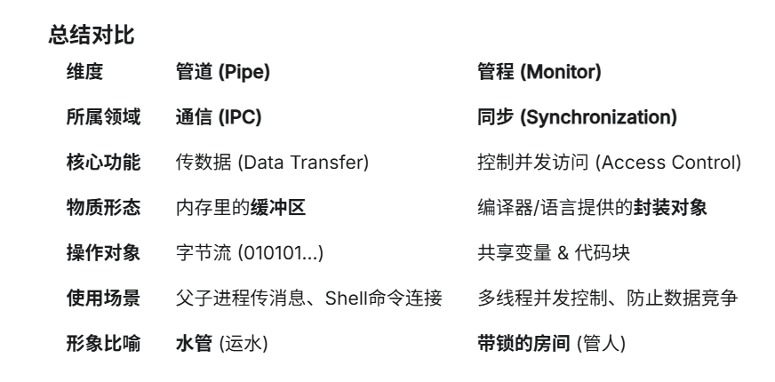

[Core Dumped: IPC](https://www.youtube.com/watch?v=Y2mDwW2pMv4)

*这一段其实有挺多的问题的，但是在初看下的了解，很多都没有深入*

一般有两种方法： 1. 共享内存(信号量) 2. 进程通信(重要，里面后期还涉及到了网络通信的知识比如端口，套接字，管道，队列，信号量什么的，要单开一期)
共享内存就是操作系统使他们的进程内存有一部分交互在一起，两者可以同时对同一块的数据进行处理。

这也导致了很多的问题：两者对于数据结构的处理不同(因为此时操作系统已经完全对这块区域放手了，完全由这俩个进程来控制)，竞争条件

进程通信则非常重要了，他的本质上是在操作内核下进行的通信，在操作系统的区域下开放了通讯端口，如同一个邮政局负责接发信息

既然是在操作系统的内核下，进程都需要向操作系统申请操作（receive,send）,里面便有了调用操作系统的开销，所以会比共享内存的方式慢一点，但是其实为了避免竞争条件，操作系统也介入了共享内存，来进行锁，信号量等操作，保护数据

进行互联网的通信也是如此，只是不在同一个操作内核下，里面便涉及到了网卡，net，服务器等(详细的看通讯协议里面的以太网)

## 进程间的通信(IPC)实现方法

 1. 信号

 (Core Dumped: Signals: Make Ctrl+C Do Anything You Want)[https://www.youtube.com/watch?v=m6WXrC9Mxzo]

 他只是举了个例子：ctrl^c 如何进行信号通信的

 2. [[信号量]]

**匿名管道 (Anonymous Pipe)**

原理： 内存里的一块缓冲区。

例子： Linux 命令里的竖线 |。例如 ls | grep .txt（把 ls 的输出接到 grep 的输入）。

特点：

半双工： 数据只能单向流动（父进程 -> 子进程）。

亲缘限制： 只能在父子进程或兄弟进程之间用。

用完即焚： 进程结束，管道也就消失了。

相关接口：

int pipe(int fd[2]);

fd[2]：管道两端用fd[0]和fd[1]来描述，读的连续用fd[0]表示，写的连续用fd[1]表示。通信双方的进程中写数据的一方需要把fd[0]先关闭，读的一方需要先把fd[1]给关闭

命名管道 (Named Pipe / FIFO)

原理： 在文件系统中创建一个特殊的文件（其实还是内存缓冲区，但有了文件名）。

特点：

突破亲缘： 任何两个不认识的进程，只要知道这个文件名(本质上是内核操作)，就能通信。

持久： 进程结束了，这个文件还在。

接口：

int mkfifo(const char *pathname, mode_t mode);

-返回：

-pathname：即将创建的FIFO文件路径，如果文件存在需要先删除。

-mode：和open()中的参数相同

Linux里面实现|的例子：

- 创建管道：Shell（指挥官）先在内核里申请一根管子，这根管子有一个入口和一个出口。
- Fork 进程：Shell 复制出两个子进程（一个是 ls，一个是 grep）。
- 偷梁换柱（重定向）：
- 对于 ls 进程：Shell 把它的1号管（嘴巴）拔掉，接到内核管子的入口上。
- 对于 grep 进程：Shell 把它的0号管（耳朵）拔掉，接到内核管子的出口上。
- 流动：ls 以为自己还在往屏幕打印，其实全吐进了管子；grep 以为自己在读键盘，其实是在吸管子里的数据。

4. **共享内存 (Shared Memory)**

原理： 操作系统拿出一块物理内存，同时映射到进程 A 和进程 B 的虚拟地址空间里。

例子： A 往这块内存写数据，B 瞬间就能看到（因为看的是同一块物理内存）。

特点：

最快： 没有任何数据复制（Zero Copy）。

危险： 必须配合信号量或互斥锁使用，否则 A 还没写完 B 就来读，数据会乱。

接口：

创建一个共享内存： int shmget(key_t key, int size,int flag)

                -成功时返回一个和关键相关的共享内存标识符，失败时返回范湖范围-1

                -key : 为共用区段起名字

                -size:空间大小

                -flag：权限标志位，和开放模式参数相同

连接到共享内存地址：void *shmat(int shmid, void *addr, int flag)

                -返回共享地址

                -共享内存标识符

                -决定以什么方式连接地址

                -访问模式

从共享内存分离：int shmdt(const void *shmaddr);

              -调用成功返回0，失败返回-1。

              -shmaddr：是shmat()返回的地址指针

5. **消息队列 (Message Queue)**

原理： 操作系统维护的一个链表。

例子： A 把消息（带类型、带内容）扔进信箱，B 从信箱里取。

特点：

有格式： 不像管道那是无头无尾的字节流，这里是一条条完整的消息。

异步： A 发完可以走，B 什么时候来取都可以

6. **套接字（socket）**
原理： 网络通信的标准接口

例子： TCP/IP, UDP, Unix Domain Socket。

特点：

最通用： 全世界都在用。

Unix Domain Socket： 专门用于本机进程通信，比 TCP 快（不走网络协议栈），像 Docker、Nginx 都在用它。

## 管道与[[管程]]的差别：

## 进程的通信和线程的同步

来源于Genimi

线程为了克服抢夺： 基本上就是锁，信号量，条件变量，原子操作什么的

进程间的通信(是在操作系统下的进程通信的话)： 队列，管道，socket
