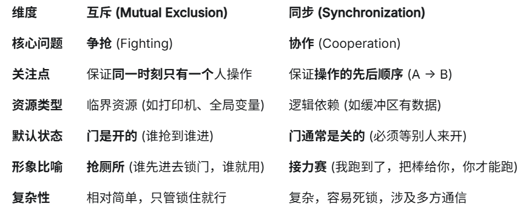
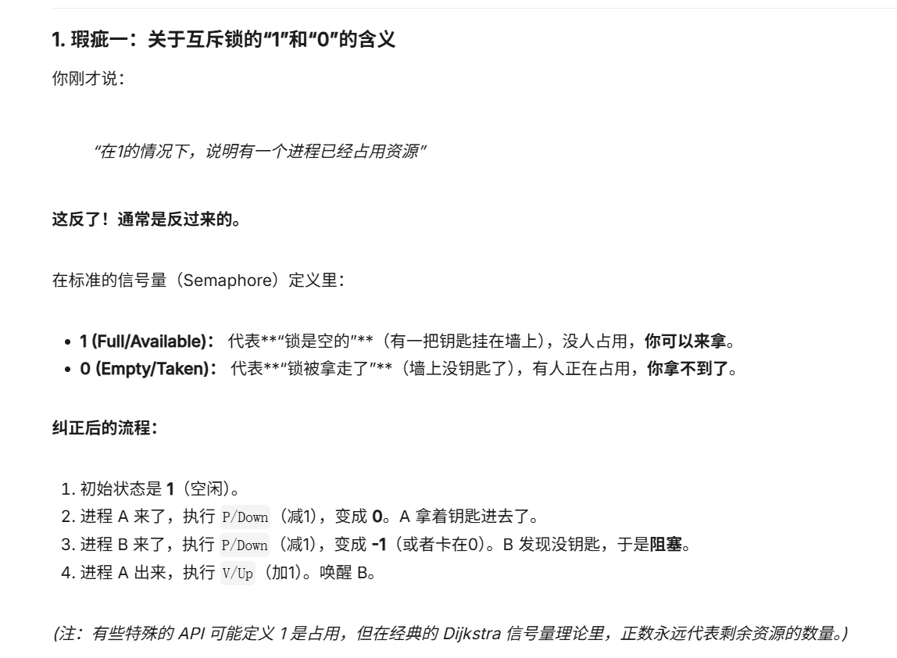

先将一下临界区：

*临界区*：用软件实现：设置全局标志位来进行分割，

临界区的本质是代码(是危险代码): 而且资源必然是共享资源，是全局的

为了互斥访问临界资源，每个进程在进入临界区之前，需要先进行检查，进行互斥锁的操作

*互斥的概念*

- 本质：资源的不可共享性，比如临界区的资源
- 实现工具：
互斥锁 (Mutex)
二值信号量 (Binary Semaphore)
关中断 (内核级)

*同步的概念*

- 本质：任务之间的依赖关系

- 实现工具：

信号量 (Semaphore)：P操作等信号，V操作发信号。

条件变量 (Condition Variable)：Wait 等条件，Signal 发通知。

管道/通道 (Pipe/Channel)：读的一方等写的一方。

来源于Genimi



前提先理解：**同步和互斥(锁)**这两个非常重要的概念

1. 纯软件无法实现高效的锁：当然也可以用： Peterson 算法等(很复杂)

2. 下面就是强行靠硬件(原子指令，不可分割)实现的自旋锁(锁可以单开一期有好多的锁，但基本都是基于这俩个硬件指令，操作系统的配合调度和优化策略)：

Test-and-Set (TSL)： 读一个值并写一个新值，一步完成。

```c
void lock() {
    // TSL 指令：尝试把 flag 设为 1，并返回旧值
    // 如果返回旧值是 1，说明本来就是锁的，继续循环
    // 如果返回旧值是 0，说明刚才没锁，现在被我锁住了(变成了1)，循环结束
    while (TestAndSet(&flag) == 1); 
}
```

Compare-and-Swap (CAS)： 比较内存里的值是不是我期望的，如果是就修改，不是就失败

```c

void lock() {
    // 尝试把 0 改成 1
    // 如果 flag 原本是 0，改成 1，成功 -> 拿到锁
    // 如果 flag 原本是 1，失败 -> 继续试
    while (CAS(&flag, 0, 1) == false);
}
```

3. *信号量*：

- 原理： 一个整数计数器 + 一个等待队列。
P 操作 (Wait)： 计数器 -1。如果结果 < 0，进程睡觉（阻塞）。
V 操作 (Signal)： 计数器 +1。如果结果 <= 0，唤醒一个睡觉的进程。
 - 分类：
计数信号量： 用于控制资源的数量。
二值信号量 (Binary Semaphore)： 只能是 0 或 1，功能等同于互斥锁。

- 优点： 解决了“忙等待”的问题（拿不到锁就睡觉，不占 CPU）。功能强大，既能做互斥，也能做同步（顺序控制）。

- 缺点： 编程复杂，P/V 操作必须成对出现，写错了容易死锁
基本操作，即用到了技术信号量也有互斥锁的思想
使用信号量实现生产者-消费者问题

```c
#define N 100
typedef int semaphore;
semaphore mutex = 1;
semaphore empty = N;
semaphore full = 0;

void producer() {
    while(TRUE) {
        int item = produce_item();
        down(&empty);
        down(&mutex);
        insert_item(item);
        up(&mutex);
        up(&full);
    }
}

void consumer() {
    while(TRUE) {
        down(&full);
        down(&mutex);
        int item = remove_item();
        consume_item(item);
        up(&mutex);
        up(&empty);
    }
}
```

4. *事件/条件变量*
- 原理：
一个进程运行到一半，发现条件不满足（比如没有数据可读），它就调用 Wait，主动挂起。
另一个进程干完活了（比如产生数据了），调用 Signal 或 Notify，通知刚才挂起的进程：“醒醒，条件满足了”。
- 特点：通常必须配合互斥锁一起使用（为了保护判断条件的过程不被打断）。
它可以实现“多对一”或“一对多”的广播通知。
5. *管程*：
- 原理： 把共享数据、锁、条件变量全都封装在一个类（Class）或模块里。
- 机制：自动互斥： 编译器保证，同一时间只能有一个线程执行管程里的任何一个方法（比如 Java 的 synchronized 关键字）。你不用手动加锁解锁。
- 条件变量 (Condition Variable)： 用 wait() 和 notify() 来控制顺序（比如：如果缓冲区空了，就 wait；满了就 notify）。
- 优点： 对程序员最友好，不容易出错，代码结构清晰。
- 缺点： 依赖高级语言编译器的支持（C 语言里没有原生的管程，得自己用信号量模拟）。

