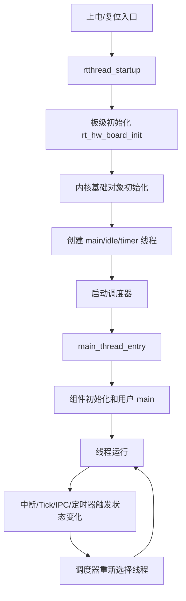

# RT-Thread 内核源码阅读总览地图

## 本章解决什么问题

这套 v2 笔记的目标不是把 RT-Thread 的所有函数摘出来，而是建立一条可以学习、复述、查源码的主线。

第一阶段只读内核核心：

```text
启动链路 -> 对象系统 -> 线程模型 -> 调度器
        -> 中断/Tick/定时器 -> IPC -> 内存管理
```

暂时不进入 DFS、FinSH、网络协议栈、完整驱动框架。它们属于第二阶段，因为它们依赖第一阶段的内核对象、线程、调度、IPC 和内存机制。

## 设计文档结论

RT-Thread 的内核不是一堆独立 API，而是一组围绕“对象”和“调度”组织起来的运行机制。

- 对象系统解决统一命名、统一生命周期、统一容器管理。
- 线程模型解决执行单元的创建、启动、阻塞、唤醒、退出。
- 调度器解决什么时候切换、切给谁、如何维护就绪队列。
- 中断、Tick、定时器负责把外部事件和时间推进转换成调度请求。
- IPC 负责让线程因为资源条件而阻塞，并在条件满足时被唤醒。
- 内存管理负责静态确定性和动态灵活性之间的取舍。

## 核心抽象/数据结构

| 抽象 | 典型结构 | 学习重点 |
| --- | --- | --- |
| 内核对象 | `struct rt_object` | 名字、类型、静态标志、对象链表 |
| 线程 | `struct rt_thread` | 继承对象、栈、入口函数、状态、调度字段 |
| 就绪队列 | 位图 + 链表数组 | O(1) 找最高优先级，链表保存同优先级线程 |
| 等待队列 | `rt_list_t suspend_thread` | IPC 和定时器阻塞线程的核心结构 |
| 定时器 | `struct rt_timer` | 超时唤醒、周期/单次、硬/软定时器 |
| 内存块 | heap/memheap/mempool | 通用分配、非连续内存拼接、固定块分配 |

## 运行时主链



读源码时不要从静态小函数随机钻进去。先问四个问题：

1. 这个模块在主链的哪个阶段被初始化？
2. 它管理的核心对象是什么？
3. 它如何改变线程状态？
4. 它是否会触发调度？

## 只深挖 3-5 个关键函数

总览阶段只需要知道这些入口，细节放到后续章节：

| 函数 | 为什么关键 |
| --- | --- |
| `rtthread_startup` | 系统从裸机世界进入 RTOS 世界的总入口 |
| `rt_object_init` / `rt_object_allocate` | 静态对象和动态对象生命周期的分水岭 |
| `rt_thread_startup` | 线程从“被创建”进入“可调度”的关键点 |
| `rt_schedule` | CPU 控制权真正发生切换的决策点 |
| `rt_tick_increase` | 时间推进如何驱动线程超时和时间片轮转 |

## 常见误区

- 不要把“读完所有函数”当作“理解源码”。RTOS 的核心是状态闭环，不是函数数量。
- 不要把启动链路和对象系统拆得太散。启动过程里创建的线程、定时器、对象容器，都会在后续章节继续工作。
- 不要把 `init/create`、`detach/delete` 混用。前者偏静态对象，后者偏动态对象。
- 不要忽略上下文。某个函数能不能阻塞，取决于它运行在启动阶段、线程上下文还是中断上下文。

## 面试复述版

RT-Thread 内核可以按“对象管理 + 线程调度 + 事件驱动”来理解。启动阶段先完成板级和内核基础设施初始化，再创建 main、idle、timer 等系统线程，最后启动调度器。运行后，线程通过 IPC、定时器、中断和主动 API 改变状态，调度器用就绪队列的位图和链表数组快速选出最高优先级线程。对象系统贯穿其中，统一管理线程、定时器、IPC、设备和内存对象的生命周期。

## 源码入口索引

| 主题 | 入口 |
| --- | --- |
| 公共 API 和类型 | `include/rtthread.h`, `include/rtdef.h` |
| 启动和自动初始化 | `src/components.c`, `bsp/<board>/board.c` |
| 对象系统 | `src/object.c` |
| 线程模型 | `src/thread.c` |
| 调度器 | `src/scheduler_comm.c`, `src/scheduler_up.c`, `src/scheduler_mp.c` |
| 中断/Tick/定时器 | `src/irq.c`, `src/clock.c`, `src/timer.c` |
| IPC | `src/ipc.c` |
| 内存管理 | `src/mem.c`, `src/memheap.c`, `src/mempool.c`, `src/slab.c` |

