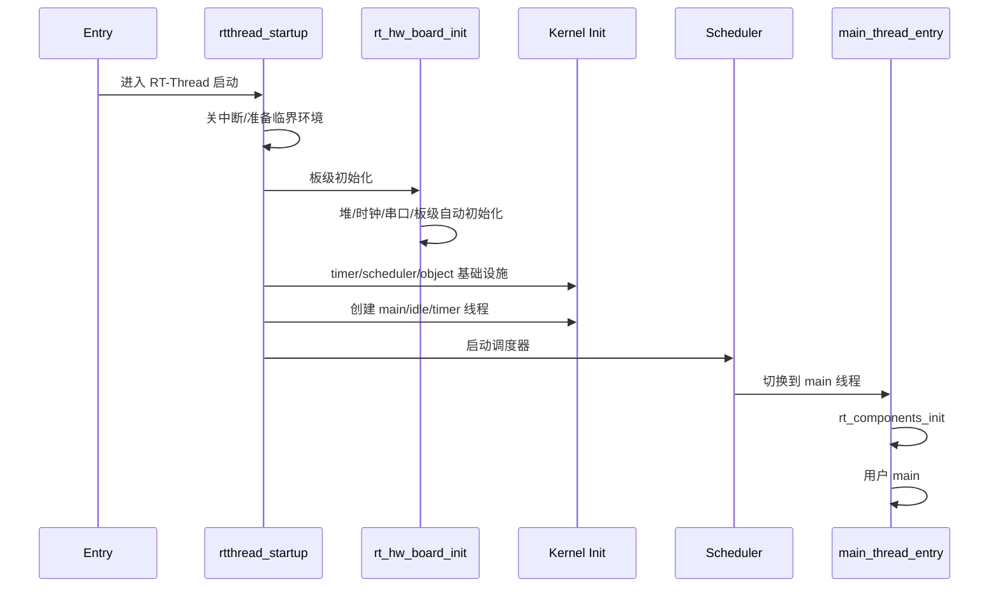

# 01-启动链路

## 本章解决什么问题

启动链路回答一个问题：CPU 上电后，RT-Thread 如何从裸机环境一步步进入多线程环境？

这一章只抓控制权转移，不做函数大全。主线是：

```text
Entry -> rtthread_startup -> rt_hw_board_init
      -> 内核对象初始化 -> 创建系统线程
      -> rt_system_scheduler_start -> main_thread_entry -> main
```

## 设计文档结论

RT-Thread 用一条统一的启动主链保证内核流程稳定，再把板级差异放到 BSP 的 `rt_hw_board_init` 和自动初始化段里。

最重要的设计点有两个：

- 启动前半段没有调度器，不能把它当成普通线程环境。
- `INIT_*_EXPORT` 让模块声明“我属于哪个初始化阶段”，由系统统一遍历执行，避免手工维护一长串初始化调用。

## 核心抽象/数据结构

| 抽象 | 作用 |
| --- | --- |
| 启动阶段 | 区分裸机阶段、内核初始化阶段、多线程阶段 |
| 自动初始化段 | 通过链接器段保存初始化函数指针 |
| main 线程 | 调度器启动后承接组件初始化和用户 `main` |
| idle 线程 | 保证系统永远有可运行线程，同时负责后台清理 |
| timer 线程 | 处理软定时器回调，避免在中断里做重活 |

## 运行时主链



阶段边界要记住：

| 阶段 | 执行环境 | 可以做什么 | 不适合做什么 |
| --- | --- | --- | --- |
| 板级阶段 | 无调度器 | 时钟、串口、堆、低层设备准备 | 线程延时、等待 IPC |
| 内核阶段 | 无调度器 | 初始化定时器、调度器、创建系统线程 | 依赖线程切换的逻辑 |
| main 线程阶段 | 有调度器 | 组件初始化、用户应用启动 | 长时间关中断 |

## 只深挖 3-5 个关键函数

| 函数 | 重点 |
| --- | --- |
| `rtthread_startup` | 启动总枢纽，按依赖顺序建立内核运行条件 |
| `rt_hw_board_init` | BSP 差异化入口，负责硬件基础设施 |
| `rt_components_board_init` | 调度器前的板级自动初始化 |
| `rt_system_scheduler_start` | 从“初始化代码顺序执行”切换到“线程调度执行” |
| `main_thread_entry` | 调度器启动后的承接点，调用 `rt_components_init` 和用户 `main` |

## 常见误区

- `rt_components_board_init` 和 `rt_components_init` 不是同一个阶段。前者在调度器前，后者在 main 线程上下文。
- 启动阶段能不能用 `rt_malloc` 要看堆是否已经初始化；能不能 `delay` 要看调度器是否已经启动。
- `main()` 在 RT-Thread 中通常不是裸机意义上的第一入口，而是 main 线程里被调用的用户入口。
- 自动初始化不是“魔法”，本质是函数指针放入指定链接段，再按段范围遍历执行。

## 面试复述版

RT-Thread 启动可以分成三段：先在裸机环境中关中断并完成板级初始化；再初始化内核基础设施，比如定时器、调度器和系统线程；最后启动调度器，CPU 控制权交给最高优先级就绪线程，main 线程开始运行。自动初始化机制通过 `INIT_*_EXPORT` 把初始化函数注册到链接器段里，系统按阶段遍历执行，从而把模块注册和启动主链解耦。

## 源码入口索引

| 入口 | 一句话用途 |
| --- | --- |
| `src/components.c` | `rtthread_startup`、自动初始化、`main_thread_entry` 常见位置 |
| `bsp/<board>/board.c` | `rt_hw_board_init` 和板级硬件准备 |
| `link.lds` / scatter 文件 | 自动初始化段的边界定义 |
| `src/scheduler_*.c` | 调度器初始化和启动 |
| `src/idle.c` | idle 线程初始化与后台清理 |

