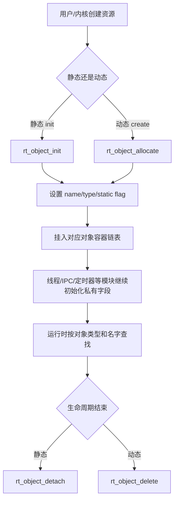

# 02-对象系统

## 本章解决什么问题

对象系统回答：RT-Thread 如何在 C 语言里统一管理线程、IPC、定时器、设备、内存池这些不同资源？

它不是为了“模拟高级语言类”，而是为了让内核资源具备统一的名字、类型、生命周期和查找方式。

## 设计文档结论

RT-Thread 把很多内核资源都抽象成对象。每个对象都有一个 `struct rt_object` 作为头部，具体对象再把它放在结构体第一个字段中。

这形成了 C 语言里的“轻量继承”：

```c
struct rt_thread
{
    struct rt_object parent;
    ...
};
```

只要拿到具体对象指针，就可以转成 `rt_object_t` 做统一管理；只要拿到对象类型，就能放入对应对象容器。

## 核心抽象/数据结构

| 数据结构 | 作用 |
| --- | --- |
| `struct rt_object` | 所有内核对象的公共头部 |
| `enum rt_object_class_type` | 区分线程、信号量、互斥量、事件、邮箱、消息队列、设备、定时器等 |
| `struct rt_object_information` | 每类对象的容器，内部维护对象链表 |
| `RT_Object_Class_Static` | 静态对象标志位，用来区分释放策略 |
| `rt_list_t` | 对象挂入容器的基础双向链表 |

静态对象和动态对象的铁律：

| 创建方式 | 销毁方式 | 内存来源 |
| --- | --- | --- |
| `*_init` | `*_detach` | 用户提供控制块和栈/缓冲区 |
| `*_create` | `*_delete` | 系统从 heap 分配 |

## 运行时主链



对象容器的意义不是“好看”，而是让系统能做这些事：

- FinSH 或调试命令列出线程、设备、信号量。
- 通过名字找到设备或其他对象。
- 对对象创建/销毁挂钩子，做调试、统计、泄漏追踪。
- 统一检查对象类型，减少误用。

## 只深挖 3-5 个关键函数

| 函数 | 重点 |
| --- | --- |
| `rt_object_init` | 静态对象初始化，设置名字、类型、静态标志，挂入容器 |
| `rt_object_allocate` | 动态对象分配，先申请内存再初始化公共字段 |
| `rt_object_detach` | 静态对象脱离容器，不释放控制块内存 |
| `rt_object_delete` | 动态对象脱离容器并释放对象控制块 |
| `rt_object_find` | 按名字和类型从对象容器中查找 |

## 常见误区

- `detach` 不是 `delete` 的别名。静态对象不能 `delete`，动态对象不能只 `detach` 后不释放。
- 对象系统只管理公共生命周期，不负责每个模块的全部私有资源。线程栈、IPC 缓冲区、定时器链表还需要各模块处理。
- 名字查找方便调试和绑定设备，但不要把它理解成高性能数据路径。
- `struct rt_object parent` 放在第一个字段，是让具体对象和基础对象之间可以安全转换的关键。

## 面试复述版

RT-Thread 用 `struct rt_object` 作为内核对象公共头部，线程、IPC、设备、定时器等结构体都包含它。对象系统负责名字、类型、静态/动态标志和对象容器链表，因此可以统一完成初始化、删除、查找和调试枚举。`init/detach` 面向静态对象，`create/delete` 面向动态对象，这是理解 RT-Thread 生命周期管理的第一条主线。

## 源码入口索引

| 入口 | 一句话用途 |
| --- | --- |
| `include/rtdef.h` | `struct rt_object`、对象类型枚举、链表基础定义 |
| `src/object.c` | 对象初始化、分配、删除、查找、对象容器 |
| `src/thread.c` | 线程如何继承对象系统 |
| `src/ipc.c` | IPC 对象如何复用对象生命周期 |
| `src/timer.c` | 定时器对象如何挂入对象容器和定时器链表 |

