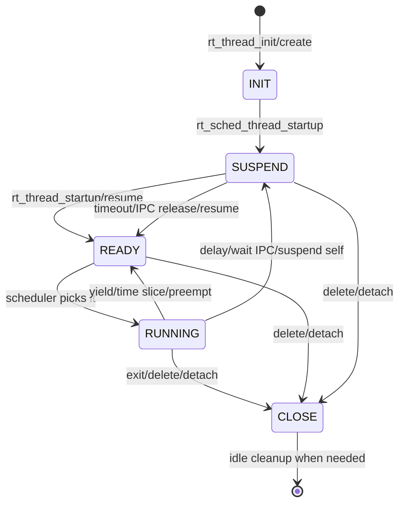

# 03-线程模型

## 本章解决什么问题

线程模型回答：一个线程从创建、启动、运行、阻塞、唤醒到退出，状态到底怎么流转？

这一章不展开所有线程 API，只抓生命周期闭环。

## 设计文档结论

RT-Thread 的线程是“内核对象 + 栈 + 入口函数 + 调度上下文”。创建线程只是把控制块和栈准备好，启动线程才会让它进入就绪队列，真正运行则由调度器决定。

最关键的区分：

- `rt_thread_init` / `rt_thread_detach`：静态线程。
- `rt_thread_create` / `rt_thread_delete`：动态线程。
- `rt_thread_resume`：让线程重新进入就绪队列，不等于立刻执行。
- `rt_thread_suspend`：让线程脱离就绪队列，常用于等待资源或延时。

## 核心抽象/数据结构

| 字段/概念 | 作用 |
| --- | --- |
| `struct rt_thread` | 线程控制块 TCB |
| `entry` / `parameter` | 线程入口函数和参数 |
| stack | 线程独立运行上下文的内存基础 |
| status | INIT、SUSPEND、READY、RUNNING 等状态 |
| priority / tick | 优先级和时间片 |
| thread timer | 线程阻塞超时使用的内部定时器 |
| `error` | 区分正常唤醒、超时、被中断唤醒等结果 |

## 运行时主链



一条典型线程创建路径：

```text
rt_thread_create
  -> 分配 TCB 和栈
  -> _thread_init
  -> rt_object_init
  -> rt_hw_stack_init
  -> rt_sched_thread_init_ctx

rt_thread_startup
  -> rt_sched_thread_startup
  -> rt_thread_resume
  -> 进入 ready queue
  -> 可能触发 rt_schedule
```

## 只深挖 3-5 个关键函数

| 函数 | 重点 |
| --- | --- |
| `rt_thread_init` / `rt_thread_create` | 静态/动态线程创建的分界 |
| `_thread_init` | 初始化线程对象、栈、入口、调度上下文 |
| `rt_thread_startup` | 把线程从“存在”推向“可调度” |
| `rt_thread_suspend_to_list` | 阻塞线程并可挂入 IPC 等待队列 |
| `rt_thread_resume` | 从阻塞态回到就绪态，是否运行交给调度器 |

## 常见误区

- 创建线程不等于运行线程。只有进入就绪队列并被调度器选中，线程才会执行。
- `resume` 不等于“马上切换过去”。如果优先级不够高，它只是排队。
- 不要随意从外部挂起别的线程。你不知道它是否持有互斥锁、堆锁或设备锁，强行挂起可能制造死锁。
- 动态线程删除后通常不会立刻释放所有运行相关资源，idle 线程会承担后台清理职责。
- 线程延时本质是线程自己让出 CPU，挂起并等待定时器超时唤醒。

## 面试复述版

RT-Thread 线程的一生可以概括为：创建时初始化 TCB、栈和调度字段；启动时进入就绪队列；运行时由调度器选择；等待资源或延时时从就绪队列移出并挂起；条件满足或超时后重新进入就绪队列；退出或删除时从调度体系脱离，必要时由 idle 线程完成资源清理。理解线程要抓状态机，而不是背所有 API。

## 源码入口索引

| 入口 | 一句话用途 |
| --- | --- |
| `src/thread.c` | 线程创建、启动、挂起、恢复、删除、延时 |
| `src/scheduler_comm.c` | 线程调度上下文、时间片、优先级辅助逻辑 |
| `src/scheduler_up.c` / `scheduler_mp.c` | 线程进入/离开就绪队列与实际调度 |
| `src/idle.c` | 线程退出后的延迟清理 |
| `libcpu/<arch>/` | 栈初始化和上下文切换的架构相关实现 |

