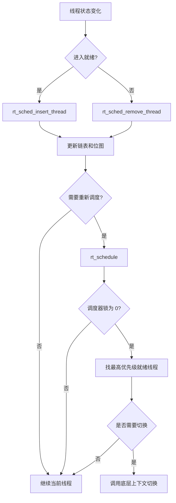

# 04-调度器

## 本章解决什么问题

调度器回答：系统里有多个就绪线程时，RT-Thread 如何快速决定“下一个 CPU 给谁用”？

重点不是把所有调度函数背下来，而是理解就绪队列、优先级、时间片、调度锁、上下文切换之间的闭环。

## 设计文档结论

RT-Thread 的调度核心是优先级抢占，同优先级再按时间片轮转。就绪队列通常由“优先级位图 + 每优先级链表”构成。

- 位图负责快速判断哪些优先级有线程就绪。
- 链表数组负责保存同优先级线程。
- `rt_schedule` 负责比较当前线程和最高优先级就绪线程。
- 底层 context switch 负责真正保存/恢复 CPU 上下文。

## 核心抽象/数据结构

| 数据结构 | 作用 |
| --- | --- |
| `rt_thread_ready_priority_group` | 就绪优先级总位图 |
| `rt_thread_ready_table[]` | 多级优先级位图，配置较多优先级时使用 |
| `rt_thread_priority_table[]` | 每个优先级一个就绪链表 |
| `rt_current_thread` | 当前运行线程 |
| `rt_scheduler_lock_nest` | 调度器锁嵌套计数 |
| `remaining_tick` | 当前线程剩余时间片 |

## 运行时主链

调度触发点通常来自：

- 高优先级线程被 `resume` 或 IPC 唤醒。
- 当前线程主动 `yield`。
- 当前线程 `delay` 或等待 IPC。
- Tick 让当前线程时间片耗尽。
- 中断退出时发现需要调度。

## 只深挖 3-5 个关键函数

| 函数 | 重点 |
| --- | --- |
| `rt_system_scheduler_init` | 初始化就绪队列、位图和当前线程状态 |
| `rt_system_scheduler_start` | 选择第一个线程并开始上下文切换 |
| `rt_schedule` | 调度决策核心 |
| `rt_sched_insert_thread` / `rt_sched_remove_thread` | 就绪队列和位图维护 |
| `rt_enter_critical` / `rt_exit_critical` | 禁止线程切换但不禁止硬件中断 |

## 常见误区

- 关中断和调度器锁不是一回事。关中断阻止中断打断当前 CPU，调度器锁只是推迟线程切换。
- 位图只告诉你某优先级是否有线程，真正的线程节点在对应链表里。
- 调度请求不一定立即切换。锁住调度器、优先级不够、当前线程仍应继续运行时，都可能不切。
- 同优先级线程不是靠位图区分，而是靠链表顺序和时间片轮转。
- 中断上下文里的切换要考虑“中断退出后再切”，不能简单套普通线程上下文。

## 面试复述版

RT-Thread 调度器以优先级抢占为核心，用位图快速找到最高优先级就绪队列，再从该优先级链表中取线程。同优先级靠时间片和链表顺序轮转。线程被唤醒、阻塞、延时或时间片耗尽时，就绪队列发生变化并可能触发 `rt_schedule`。调度器锁通过嵌套计数推迟线程切换，但不屏蔽硬件中断。

## 源码入口索引

| 入口 | 一句话用途 |
| --- | --- |
| `src/scheduler_comm.c` | 调度公共逻辑、线程调度上下文、tick/priority 辅助 |
| `src/scheduler_up.c` | 单核调度队列和切换逻辑 |
| `src/scheduler_mp.c` | SMP 多核调度逻辑 |
| `src/thread.c` | 线程 API 如何触发插入/移除就绪队列 |
| `libcpu/<arch>/` | 架构相关上下文切换 |

