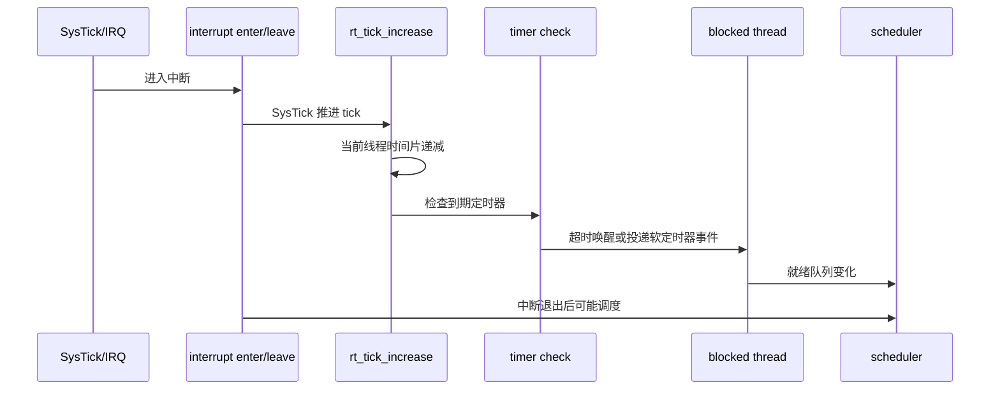

# 05-中断-Tick-定时器

## 本章解决什么问题

这一章回答：外部中断和时间流逝如何影响线程调度？

中断、Tick、定时器要一起看，因为它们共同完成一件事：把“硬件事件”和“时间到期”转换成线程状态变化。

## 设计文档结论

RTOS 不能只靠线程主动让出 CPU。外部设备中断、系统 Tick、定时器超时都会打破当前线程的执行流。

- 中断负责快速响应硬件事件。
- Tick 负责推进系统时间、时间片和超时检查。
- 定时器负责在未来某个 tick 唤醒线程或执行回调。
- 软定时器把回调放到 timer 线程里执行，避免中断上下文过重。

## 核心抽象/数据结构

| 抽象 | 作用 |
| --- | --- |
| interrupt nest | 标记当前是否在中断嵌套中 |
| system tick | 全局时间基准 |
| hard timer | 超时处理在 tick/中断相关路径中完成 |
| soft timer | 超时回调交给 timer 线程 |
| thread timer | 线程 delay 或 IPC 超时使用的内部定时器 |
| timeout list | 定时器按超时时间组织的链表 |

## 运行时主链



线程延时闭环：

```text
rt_thread_delay
  -> 当前线程挂起
  -> 启动线程内部 timer
  -> 调度其他线程
  -> tick 到期
  -> timer 回调唤醒线程
  -> 线程重新进入 ready queue
```

## 只深挖 3-5 个关键函数

| 函数 | 重点 |
| --- | --- |
| `rt_interrupt_enter` / `rt_interrupt_leave` | 维护中断嵌套，决定切换时机 |
| `rt_tick_increase` | 推进系统 tick，驱动时间片和定时器检查 |
| `rt_timer_init` / `rt_timer_create` | 静态/动态定时器生命周期 |
| `rt_timer_start` / `rt_timer_stop` | 定时器进入或离开超时链表 |
| `rt_thread_delay` | 线程主动阻塞并依赖定时器唤醒 |

## 常见误区

- 中断处理函数里不要做重活，尤其不要做可能阻塞的操作。
- Tick 不是“调度器本身”，它只是周期性触发时间推进和可能的调度。
- 定时器回调运行在哪个上下文，要看硬定时器还是软定时器配置。
- 线程 delay 不是忙等，而是挂起当前线程，让 CPU 去跑别的就绪线程。
- 中断里唤醒高优先级线程后，真正切换通常要等到中断退出路径。

## 面试复述版

中断、Tick 和定时器构成 RT-Thread 的时间事件系统。硬件中断进入后通过 enter/leave 维护中断嵌套；SysTick 周期性调用 tick 增加函数，推进系统时间、扣减当前线程时间片，并检查定时器超时。线程 delay 或 IPC 带超时时，本质是挂起线程并启动内部定时器；超时后定时器把线程唤醒进就绪队列，再由调度器决定是否切换。

## 源码入口索引

| 入口 | 一句话用途 |
| --- | --- |
| `src/irq.c` | 中断进入/退出、嵌套计数、调度边界 |
| `src/clock.c` | 系统 tick 推进 |
| `src/timer.c` | 定时器创建、启动、停止、超时检查 |
| `src/thread.c` | `rt_thread_delay` 和线程超时等待 |
| `bsp/<board>/` | SysTick 或硬件定时器如何接入内核 tick |

