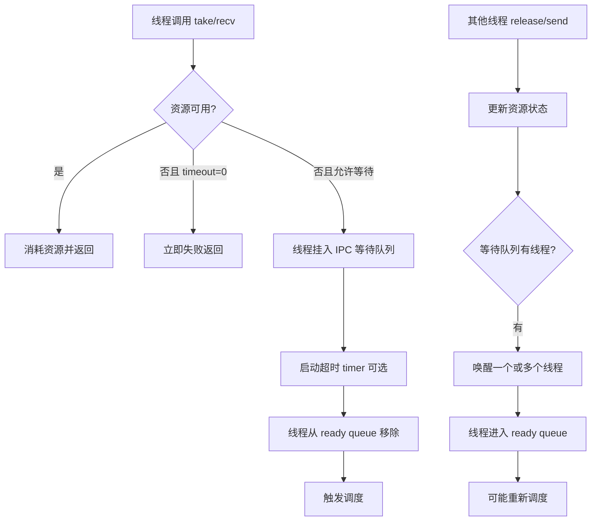

# 06-IPC

## 本章解决什么问题

IPC 回答：线程之间如何同步、互斥、通信，以及线程为什么会阻塞和被唤醒？

本章重点看阻塞-唤醒-再调度闭环，而不是把每一种 IPC 的 API 全背下来。

## 设计文档结论

RT-Thread 的 IPC 对象本质上都是“资源状态 + 等待队列”。

- 信号量表达资源计数。
- 互斥量表达独占访问，并额外处理优先级继承。
- 事件表达多个条件位的组合等待。
- 邮箱表达机器字大小消息传递。
- 消息队列表达定长消息块传递。

当资源不可用时，线程进入该 IPC 对象的等待队列；当资源可用时，等待队列里的线程被唤醒，重新进入就绪队列。

## 核心抽象/数据结构

| IPC 类型 | 核心状态 | 适合场景 |
| --- | --- | --- |
| semaphore | value 计数 | 资源数量、生产消费同步 |
| mutex | owner、hold、original priority | 临界资源互斥访问 |
| event | set 位图 | 多条件组合等待 |
| mailbox | 环形槽位，消息为机器字 | 轻量消息通知 |
| message queue | 消息块池和队列 | 定长数据包通信 |
| suspend list | 等待线程链表 | 所有阻塞唤醒的共同基础 |

## 运行时主链



互斥量要额外记一条线：

```text
低优先级线程持有 mutex
  -> 高优先级线程 take 失败并阻塞
  -> 持有者临时继承高优先级
  -> 持有者尽快运行并 release
  -> 高优先级线程被唤醒
  -> 持有者优先级恢复
```

## 只深挖 3-5 个关键函数

| 函数 | 重点 |
| --- | --- |
| `rt_sem_take` / `rt_sem_release` | 计数资源如何导致阻塞和唤醒 |
| `rt_mutex_take` / `rt_mutex_release` | 互斥访问和优先级继承 |
| `rt_event_recv` / `rt_event_send` | 条件位组合等待 |
| `rt_mb_recv` / `rt_mb_send` | 轻量消息槽位 |
| `rt_mq_recv` / `rt_mq_send` | 定长消息块通信 |

## 常见误区

- IPC 不是单纯的数据结构，它会改变线程状态并触发调度。
- 信号量不是互斥锁。信号量可以表达多个资源，互斥量强调所有权。
- 互斥量不能随便在中断里使用，因为它涉及线程所有权和阻塞。
- 优先级继承不是提高系统整体速度，而是降低优先级反转风险。
- 带 timeout 的等待有三种结果：拿到资源、超时、被其他机制中断唤醒。

## 面试复述版

RT-Thread IPC 的共性是每个 IPC 对象都有资源状态和等待队列。线程获取资源失败时，如果允许等待，就会从就绪队列移除并挂到 IPC 等待队列；其他线程释放资源或发送消息后，会唤醒等待线程，让它重新进入就绪队列，最后由调度器决定是否切换。互斥量相比信号量多了所有权和优先级继承，用来解决优先级反转。

## 源码入口索引

| 入口 | 一句话用途 |
| --- | --- |
| `src/ipc.c` | 信号量、互斥量、事件、邮箱、消息队列实现 |
| `include/rtthread.h` | IPC 公共 API 声明 |
| `src/thread.c` | 线程挂起、恢复、超时等待基础 |
| `src/scheduler_*.c` | IPC 唤醒后如何进入就绪队列 |
| `src/timer.c` | IPC timeout 的定时器基础 |

