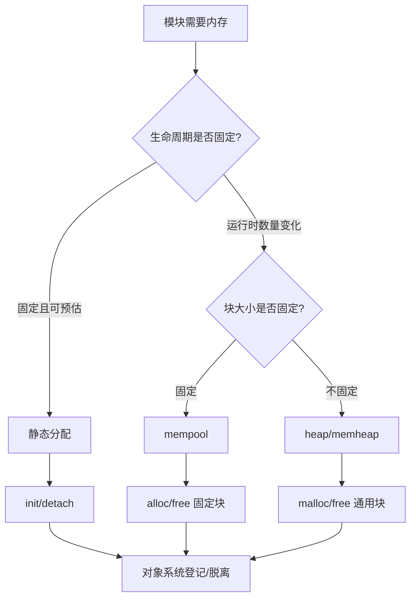

# 07-内存管理

## 本章解决什么问题

内存管理回答：RT-Thread 如何在“确定性”和“灵活性”之间取舍？

本章不追求把所有分配算法细节一次讲完，而是先建立三条线：静态内存、通用 heap、专用内存对象。

## 设计文档结论

嵌入式 RTOS 里的内存管理不能只问“能不能 malloc”，还要问：

- 分配耗时是否可预测？
- 是否会产生碎片？
- 失败时如何处理？
- 是否允许在这个上下文分配？
- 生命周期和对象系统是否匹配？

RT-Thread 同时支持静态对象、heap、memheap、mempool、small/SLAB 等机制，是为了覆盖不同确定性和灵活性需求。

## 核心抽象/数据结构

| 机制 | 解决的问题 | 代价 |
| --- | --- | --- |
| 静态分配 | 编译期确定内存，运行时最可控 | 灵活性差 |
| system heap | 通用动态分配 | 可能碎片化，失败需处理 |
| memheap | 管理一段或多段堆区域 | 算法复杂度更高 |
| mempool | 固定大小块快速分配 | 只能分配固定块 |
| small/SLAB | 面向小块或特定配置优化 | 需要理解配置差异 |

对象生命周期对应关系：

```text
rt_thread_init/static buffer -> rt_thread_detach
rt_thread_create/heap       -> rt_thread_delete
rt_mp_init/static pool      -> rt_mp_detach
rt_mp_create/heap           -> rt_mp_delete
```

## 运行时主链



线程动态创建时的典型路径：

```text
rt_thread_create
  -> rt_object_allocate 分配 TCB
  -> rt_malloc 分配 stack
  -> 初始化对象和栈
  -> 如果中途失败，按相反顺序回滚释放
```

## 只深挖 3-5 个关键函数

| 函数 | 重点 |
| --- | --- |
| `rt_system_heap_init` | 系统 heap 的建立时机，通常发生在板级初始化阶段 |
| `rt_malloc` / `rt_free` | 通用动态分配和释放 |
| `rt_memheap_init` | 管理指定内存区域，适合非连续内存拓扑 |
| `rt_mp_init` / `rt_mp_alloc` | 固定大小块分配，强调确定性 |
| `rt_object_allocate` / `rt_object_delete` | 动态对象生命周期如何依赖 heap |

## 常见误区

- `malloc` 失败不是小概率细节，嵌入式系统必须考虑失败回滚。
- 静态分配不等于落后，它常常是实时性和安全性更好的选择。
- `init/create` 的区别不只是 API 名字，而是内存所有权不同。
- 在中断上下文或调度器未启动阶段分配内存要非常谨慎。
- mempool 不是通用 heap，它牺牲灵活性换固定块分配的确定性。

## 面试复述版

RT-Thread 内存管理可以按确定性从高到低理解：静态分配最可控，mempool 用固定块提高可预测性，heap/memheap 提供动态灵活性但要处理碎片和失败。对象系统中的 `init/detach` 通常对应用户提供内存，`create/delete` 通常对应系统 heap 分配。动态创建线程时，TCB 和栈都可能来自 heap，因此任何一步失败都必须按相反顺序回滚。

## 源码入口索引

| 入口 | 一句话用途 |
| --- | --- |
| `src/mem.c` | 通用 heap 或 small memory 管理 |
| `src/memheap.c` | memheap 区域管理 |
| `src/mempool.c` | 固定块内存池 |
| `src/slab.c` | SLAB 分配器相关实现 |
| `src/object.c` | 动态对象分配与释放 |
| `src/thread.c` | 动态线程创建时 TCB 和 stack 的分配回滚 |

