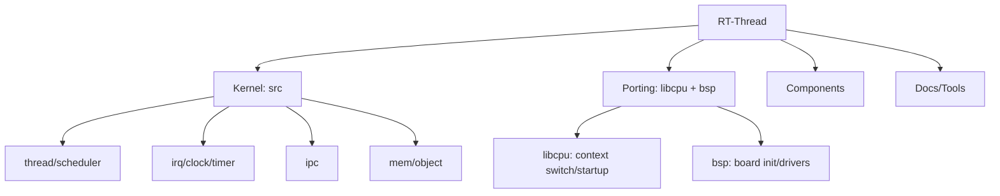

## 日记

- 学英文了，除了README，全是英文文档
- 对于多作者的架构，每个文件前都有Change Logs和开源协议
- 大型项目里的宏开关要会运用(**宏定义驱动的极限裁剪**)
- 真学英语了，没招了看函数还要搜一下
- Doxygen 风格注释
- 他里面涉及到的版本控制也是要学的
- 我说实话这他一个文件都值得我好好看一天了，跟别说其他的，我操了，算了，今天这是看个大体架构
- 涉及到好多的宏的运用啊
- 突然想起来，假如我要维护这个项目，查函数或者结构体，是不是还要学习一下快捷键啊
- 我也为AI要我好好的研究一下rt里面最深层的文档，结果不要，看的我头晕


## Introducion Rt-Thread

#### RT-Thread = RTOS Kernel + Components + Packages

- support multi-tasking
- code elegant, structured, modular, and very customizable(RT-Thread 用最纯粹、运行效率最高的 C 语言，实现了 C++ 才能做到的类的继承、派生和虚函数表（抽象接口层）。这不仅没有增加额外的 C++ 运行时开销，反而极大地提升了内核代码的可读性、可维护性和扩展性)
- small in size, low in cost, low in power consumption and fast in startup
- be used free of charge in commercial products
- **includes relatively complete middleware components such as a file system, graphics library, etc. It has low overhead and high security, abides by the Communication Protocol and is capable of connecting to the cloud**
- is not only a real-time kernel, but also has a rich middle-tier component, as shown in the following figure


## 阅读 rtthread.h和rtdef.h

```c
void rt_object_init(struct rt_object         *object,

                    enum rt_object_class_type type,

                    const char               *name);
```
- 这种对齐可以学一下啊

#### rtthread.h大体架构：
**一些宏开关的模块我也没记录**：大体就是这样，后面很多的宏开关：涉及到RTOS(IPC),I/O口
kernel object interface ->clock & timer interface->thread interface->idle thread interface
->schedule service->memory management interface(memory涉及到很多的模块，懒得看了)
->interrupt service->CPU object->general kernel service

#### rtthread.h大体作用：
- 我感觉就是就是一些关于RTOS的初始化，调用啊，销毁什么的，就是操作RTOS的内核吧
- **内核对象与数据结构暴露**，**核心 API 的函数声明**，**核心宏定义（系统基石）**，**处于架构的“承上启下”边界位置**


#### 关于rtdef.h
- 不是不看，实在是太多了，头晕，而且涉及到了好多宏的关系，看不了一点
- 这应该是核心

```c
enum rt_object_class_type

{

    RT_Object_Class_Null          = 0x00,      /**< The object is not used. */

    RT_Object_Class_Thread        = 0x01,      /**< The object is a thread. */

    RT_Object_Class_Semaphore     = 0x02,      /**< The object is a semaphore. */

    RT_Object_Class_Mutex         = 0x03,      /**< The object is a mutex. */

    RT_Object_Class_Event         = 0x04,      /**< The object is a event. */

    RT_Object_Class_MailBox       = 0x05,      /**< The object is a mail box. */

    RT_Object_Class_MessageQueue  = 0x06,      /**< The object is a message queue. */

    RT_Object_Class_MemHeap       = 0x07,      /**< The object is a memory heap. */

    RT_Object_Class_MemPool       = 0x08,      /**< The object is a memory pool. */

    RT_Object_Class_Device        = 0x09,      /**< The object is a device. */

    RT_Object_Class_Timer         = 0x0a,      /**< The object is a timer. */

    RT_Object_Class_Module        = 0x0b,      /**< The object is a module. */

    RT_Object_Class_Memory        = 0x0c,      /**< The object is a memory. */

    RT_Object_Class_Channel       = 0x0d,      /**< The object is a channel */

    RT_Object_Class_ProcessGroup  = 0x0e,      /**< The object is a process group */

    RT_Object_Class_Session       = 0x0f,      /**< The object is a session */

    RT_Object_Class_Custom        = 0x10,      /**< The object is a custom object */

    RT_Object_Class_Unknown       = 0x11,      /**< The object is unknown. */

    RT_Object_Class_Static        = 0x80       /**< The object is a static object. */

};

```


#### 宏模块

- **RT_USING_HEAP** **背后：资源分配的“动静分离”原则。** 在嵌入式领域，资源极其碎片化。如果是仅有几 KB RAM 的低成本 MCU，使用动态内存（Heap）是非常危险的，不仅会产生内存碎片，而且 `malloc` 本身需要消耗时间，打破了强实时的确定性。所以架构师通过提供 `RT_USING_HEAP` 开关，让系统可以做到真正的“静态化”。关闭它，内核对象在编译时由 RW/ZI 段直接分配，不仅运行效率最高，时间复杂度绝对 O(1)，而且内存使用量在编译阶段就是完全可预测的。
- **RT_USING_HOOK** **背后：操作系统的可观测性（Observability）与 AOP（面向切面编程）。** 操作系统内核是一个高度封闭的黑盒，如果用户想统计 CPU 利用率、想看每一次任务调度的耗时、或者想监控是否有任务长时间霸占互斥锁，直接修改内核源码是极其不优雅的。钩子函数（Hook）机制就是在内核的骨架上留下一排排“探针接口”。这使得操作系统在保持高内聚的前提下，获得了极强的扩展性和可调试性。

这是我提取，我看到最多的宏模块


### #error的作用

**作用**：**编译器强制报错并中断编译过程**

```c
#if (RT_MAIN_THREAD_PRIORITY >= RT_THREAD_PRIORITY_MAX)

#error "RT_MAIN_THREAD_PRIORITY must be < RT_THREAD_PRIORITY_MAX"

#elif (RT_MAIN_THREAD_PRIORITY < 0)

#error "RT_MAIN_THREAD_PRIORITY must be non-negative"

#endif /* RT_MAIN_THREAD_PRIORITY range check */
```

**RTOS 原理深度解析 (OS Principles)** 这段简短的代码背后，隐藏着 RT-Thread 底层调度器极其严谨的设计逻辑：

- **避免致命的“数组越界”**： 在 RT-Thread 的全抢占式调度器中，为了实现时间复杂度为 O(1) 的极速调度，系统底层维护了一个“就绪队列（Ready List）”数组，数组的长度恰好就是 `RT_THREAD_PRIORITY_MAX`。 如果主线程的优先级被错误地设置为了大于或等于最大值的数，当操作系统尝试将主线程挂入就绪队列时，就会直接造成**内存数组越界访问**。在嵌入式系统里，这往往会静默地覆盖掉相邻的其他内核数据，导致系统莫名其妙地跑飞或死机。
- **主线程（Main Thread）的特殊性**： 系统启动时（`rtthread_startup`），内核会自动创建两个核心的系统线程：**主线程**和**空闲线程（Idle Thread）**。主线程是我们编写的业务代码入口（`main()` 函数所在处）。这段校验正是为了保障这个最基础的业务入口能够被安全、合规地挂载到调度器中。
- **空闲线程的“专座”**： 虽然代码要求主线程优先级 `< RT_THREAD_PRIORITY_MAX`，但在实际的操作系统潜规则中，最低优先级（即 `RT_THREAD_PRIORITY_MAX - 1`）通常是**强制保留给空闲线程专用的**，用户线程（包括主线程）不应该去抢占这个位置，否则可能导致系统的某些后台回收机制或空闲钩子无法运行。

💡 **4. 思考与启发 (Takeaway)** 这展现了底层基础软件中极其经典的**防御性编程（Defensive Programming）**和**“失败得越早越好（Fail-Fast）”**的设计模式。

在嵌入式开发中，像 `rtconfig.h` 这样的系统配置文件往往是由开发者手动修改或通过图形化界面（如 Env 工具）生成的。如果开发者手滑填错了一个数值，与其让编译顺利通过、最后在板子上抓耳挠腮地用示波器查 HardFault 死机问题，**不如利用** **#error** **宏，把运行时的灾难直接前置转化为编译时的错误**。这种将潜在风险扼杀在摇篮里的做法，是非常值得我们在编写底层驱动或组件框架时借鉴的 C 语言技巧。


### 总结

1. RT-Thread 是一个面向 IoT 的实时操作系统平台，包含 RTOS 内核、组件层和软件包生态。
2. 源码分层上，include 定义接口，src 实现内核，libcpu+bsp 负责 CPU/板级适配，components 提供上层功能。
3. QEMU 让我们在没有实体板卡时运行虚拟板级环境，用于验证启动流程和学习内核架构。




图1：RT-Thread 全局架构图（目录 -> 职责 -> 运行形态）

RT-Thread
├─ Kernel
│  ├─ include  : 内核接口/宏/类型定义
│  └─ src      : 线程/调度/IPC/内存/时钟等实现
├─ Porting
│  ├─ libcpu   : CPU架构适配（上下文切换/中断底层）
│  └─ bsp      : 板级支持包（启动/驱动/链接/板级配置）
├─ Components  : 文件系统/FinSH/网络/设备框架/POSIX等
├─ Tools       : 构建与辅助脚本
└─ Documentation: 官方文档与教程

QEMU 运行形态：
PC 上运行 bsp/qemu-vexpress-a9（虚拟开发板）→ 观察启动与调度行为
