# 第一部分：文件头部 + 学习心得模块

# 1. 总体架构的理解

## 一、学习心得与要点速记

### 1.1 学习方法与规划

- 学英文了，除了 README，全是英文文档。
- 我说实话这他一个文件都值得我好好看一天了，跟别说其他的，算了，今天这是看个大体架构。
- 我也为 AI 要我好好的研究一下 rt 里面最深层的文档，结果不要，看的我头晕。
- 突然想起来，假如我要维护这个项目，查函数或者结构体，是不是还要学习一下快捷键啊。

### 1.2 代码风格与规范

- 大型项目里的宏开关要会运用（**宏定义驱动的极限裁剪**）。
- 对于多作者的架构，每个文件前都有 Change Logs 和开源协议。
- **Doxygen 风格注释**：这是标准的开源项目文档注释风格。
- 他里面涉及到的版本控制也是要学习的。
- 这种对齐可以学一下啊：

```c
void rt_object_init(struct rt_object         *object,
                    enum rt_object_class_type type,
                    const char               *name);
```

### 1.3 核心发现与感悟

- RT-Thread 用最纯粹、运行效率最高的 C 语言，实现了 C++ 才能做到的类的继承、派生和虚函数表（抽象接口层）。这不仅没有增加额外的 C++ 运行时开销，反而极大地提升了内核代码的可读性、可维护性和扩展性。
- 不是不看，实在是太多了，头晕，而且涉及到了好多宏的关系，看不了一点。
- 这应该是核心（指 `rtdef.h`）。


# 第二部分：RT-Thread 简介

---

## 二、RT-Thread 简介

### 2.1 核心定位

RT-Thread = RTOS Kernel + Components + Packages

#### 核心特性

- **支持多任务**：完整的实时调度器
- **代码优雅**：结构化、模块化、高度可定制
- **小巧高效**：体积小、成本低、功耗低、启动快
- **商业友好**：可免费用于商业产品
- **组件丰富**：包含文件系统、图形库等相对完整的中间件组件

### 2.2 架构组成

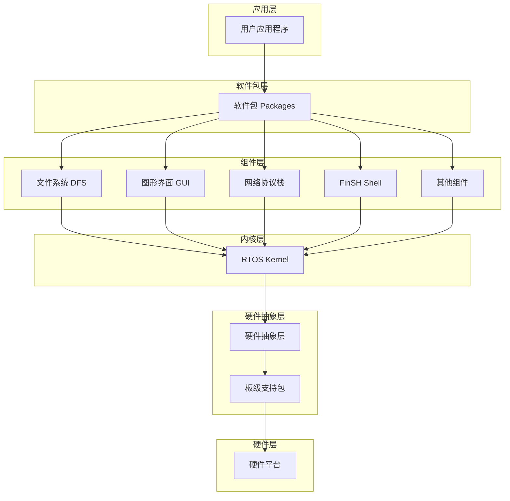

### 2.3 设计哲学

RT-Thread 用最纯粹、运行效率最高的 C 语言，实现了 C++ 才能做到的：

| C++ 特性 | RT-Thread C 语言实现 |
|----------|----------------------|
| 类的继承 | 结构体嵌套（父结构体作为第一个成员） |
| 派生 | 扩展结构体成员 |
| 虚函数表 | 函数指针成员 |
| 抽象接口层 | 统一的对象接口 |

#### 设计优势

- **无额外开销**：没有 C++ 运行时开销
- **可读性强**：内核代码结构清晰
- **可维护性高**：模块化设计，易于扩展
- **移植性好**：纯 C 实现，跨平台兼容


# 第三部分 + 第四部分：核心头文件分析 + 宏模块设计哲学


---

## 三、核心头文件分析

### 3.1 rtthread.h（内核接口层）

#### 一句话总结

`rtthread.h` 是 RT-Thread 的**内核对象与数据结构暴露层**，核心 API 的函数声明层，核心宏定义的系统基石，处于架构的"承上启下"边界位置。

#### 大体架构

内核对象接口
    ↓
时钟与定时器接口
    ↓
线程接口
    ↓
空闲线程接口
    ↓
调度服务
    ↓
内存管理接口
    ↓
中断服务
    ↓
CPU 对象
    ↓
通用内核服务

#### 核心作用

- **内核对象与数据结构暴露**：定义内核可操作的对象类型
- **核心 API 的函数声明**：声明所有内核服务函数
- **核心宏定义（系统基石）**：定义系统常量和配置宏
- **处于架构的"承上启下"边界位置**：连接上层应用与底层实现

---

### 3.2 rtdef.h（核心定义层）

#### 一句话总结

`rtdef.h` 是 RT-Thread 的**核心定义层**，包含了所有内核数据结构、类型定义、宏常量等基础定义，是整个系统的基石。

#### 核心内容

- **对象类型枚举**：定义所有内核对象类型
- **数据结构定义**：线程、信号量、互斥量等结构体
- **宏常量定义**：系统配置常量
- **条件编译宏**：功能裁剪开关

---

### 3.3 对象类型枚举详解

#### 枚举定义

```c
enum rt_object_class_type
{
    RT_Object_Class_Null          = 0x00,  /* 对象未使用 */
    RT_Object_Class_Thread        = 0x01,  /* 线程对象 */
    RT_Object_Class_Semaphore     = 0x02,  /* 信号量对象 */
    RT_Object_Class_Mutex         = 0x03,  /* 互斥量对象 */
    RT_Object_Class_Event         = 0x04,  /* 事件对象 */
    RT_Object_Class_MailBox       = 0x05,  /* 邮箱对象 */
    RT_Object_Class_MessageQueue  = 0x06,  /* 消息队列对象 */
    RT_Object_Class_MemHeap       = 0x07,  /* 内存堆对象 */
    RT_Object_Class_MemPool       = 0x08,  /* 内存池对象 */
    RT_Object_Class_Device        = 0x09,  /* 设备对象 */
    RT_Object_Class_Timer         = 0x0a,  /* 定时器对象 */
    RT_Object_Class_Module        = 0x0b,  /* 模块对象 */
    RT_Object_Class_Unknown       = 0x0c,  /* 未知对象 */
    RT_Object_Class_Static        = 0x80   /* 静态对象标志位 */
};
```

#### 对象类型关系图

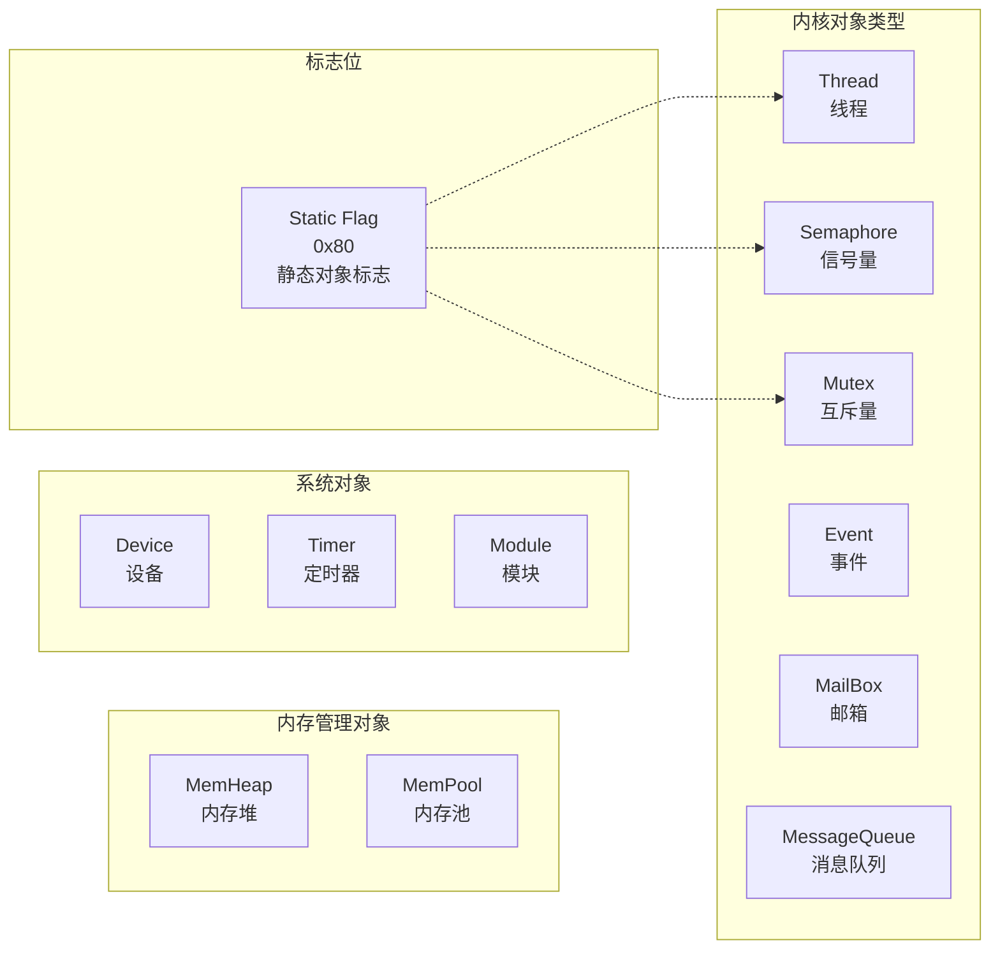

---

## 四、宏模块设计哲学

### 4.1 RT_USING_HEAP（动静分离原则）

#### 设计背景

在嵌入式领域，资源极其碎片化。如果是仅有几 KB RAM 的低成本 MCU，使用动态内存是非常危险的：

- **内存碎片**：频繁分配释放导致内存碎片化
- **时间不确定性**：`malloc` 本身需要消耗时间，打破强实时的确定性
- **内存泄漏风险**：忘记 `free` 导致内存耗尽

#### 宏开关的作用

```c
#ifdef RT_USING_HEAP
    /* 动态内存分配 */
    void *ptr = rt_malloc(size);
    /* ... 使用 ... */
    rt_free(ptr);
#else
    /* 仅使用静态内存 */
    static struct rt_thread thread;
    rt_thread_init(&thread, ...);
#endif
```

#### 动静分离对比

| 特性 | 静态内存 | 动态内存 |
|------|----------|----------|
| 分配时机 | 编译时 | 运行时 |
| 内存碎片 | 无 | 可能产生 |
| 分配速度 | 极快（无分配过程） | 较慢（需要堆管理） |
| 时间确定性 | 绝对 O(1) | 不确定 |
| 内存可预测性 | 编译时完全确定 | 运行时才知道 |
| 适用场景 | 安全关键系统 | 资源充足系统 |

#### 设计启示

架构师通过提供 `RT_USING_HEAP` 开关，让系统可以做到真正的"静态化"。关闭它，内核对象在编译时由 RW/ZI 段直接分配，不仅运行效率最高，时间复杂度绝对 O(1)，而且内存使用量在编译阶段就是完全可预测的。

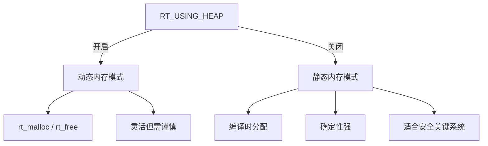

---

### 4.2 RT_USING_HOOK（可观测性机制）

#### 设计背景

操作系统内核是一个高度封闭的黑盒，如果用户想：

- 统计 CPU 利用率
- 查看每一次任务调度的耗时
- 监控是否有任务长时间霸占互斥锁

直接修改内核源码是极其不优雅的。

#### 钩子机制原理

钩子函数机制就是在内核的骨架上留下一排排"探针接口"。这使得操作系统在保持高内聚的前提下，获得了极强的扩展性和可调试性。

```c
#ifdef RT_USING_HOOK
    /* 钩子函数指针 */
    static void (*rt_scheduler_hook)(struct rt_thread *from, 
                                      struct rt_thread *to) = RT_NULL;
    
    /* 设置钩子 */
    void rt_scheduler_sethook(void (*hook)(struct rt_thread *from, 
                                            struct rt_thread *to))
    {
        rt_scheduler_hook = hook;
    }
#endif

/* 调度器内部调用 */
void rt_schedule(void)
{
    /* ... 调度逻辑 ... */
    
#ifdef RT_USING_HOOK
    if (rt_scheduler_hook != RT_NULL)
    {
        rt_scheduler_hook(from_thread, to_thread);
    }
#endif
}
```

#### 常用钩子类型

| 钩子名称 | 触发时机 | 典型用途 |
|----------|----------|----------|
| `rt_scheduler_hook` | 线程切换时 | CPU 利用率统计、调度追踪 |
| `rt_object_attach_hook` | 对象创建时 | 资源泄漏检测 |
| `rt_object_detach_hook` | 对象销毁时 | 资源追踪 |
| `rt_idle_hook` | 空闲线程运行时 | 低功耗管理 |
| `rt_malloc_hook` | 内存分配时 | 内存使用统计 |
| `rt_free_hook` | 内存释放时 | 内存泄漏检测 |

#### 钩子机制架构图

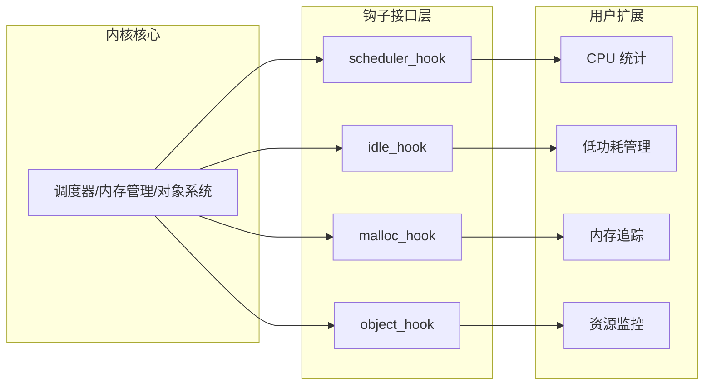

#### 设计启示

- **非侵入式**：无需修改内核源码即可扩展功能
- **可观测性**：让黑盒变得透明可调试
- **可选性**：通过宏开关控制，不影响内核体积
- **AOP 思想**：面向切面编程的 C 语言实现

---

### 4.3 宏模块设计总结

| 宏名称                   | 设计哲学   | 核心价值      |
| --------------------- | ------ | --------- |
| `RT_USING_HEAP`       | 动静分离原则 | 资源分配的可预测性 |
| `RT_USING_HOOK`       | 可观测性机制 | 内核行为的可调试性 |
| `RT_USING_MODULE`     | 模块化加载  | 动态扩展能力    |
| `RT_USING_DEVICE_IPC` | 设备抽象   | 硬件无关性     |

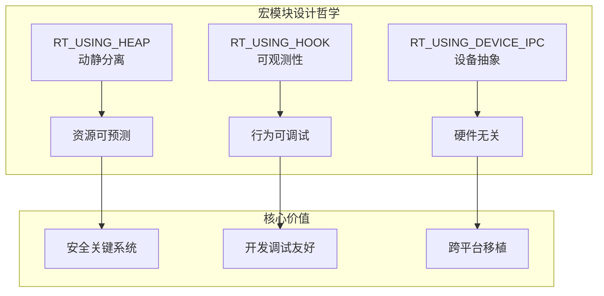


# 第五部分 + 第六部分：防御性编程实践 + 架构全景图

## 五、防御性编程实践

### 5.1 #error 编译时检查

#### 核心作用

**作用：编译器强制报错并中断编译过程**

在 RT-Thread 中，`#error` 被广泛用于配置参数的合法性检查，确保用户配置错误时在编译阶段就能被发现，而不是运行时崩溃。

#### 典型应用示例

```c
#if (RT_MAIN_THREAD_PRIORITY >= RT_THREAD_PRIORITY_MAX)
    #error "RT_MAIN_THREAD_PRIORITY must be < RT_THREAD_PRIORITY_MAX"
#elif (RT_MAIN_THREAD_PRIORITY < 0)
    #error "RT_MAIN_THREAD_PRIORITY must be non-negative"
#endif /* RT_MAIN_THREAD_PRIORITY range check */
```

#### RTOS 原理深度解析

这段简短的代码背后，隐藏着 RT-Thread 底层调度器极其严谨的设计逻辑：

##### 优先级范围约束

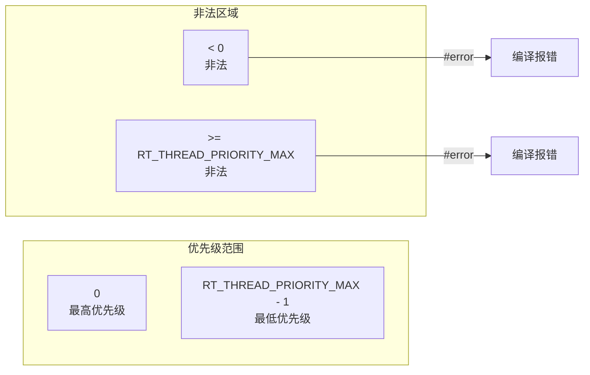

##### 为什么必须检查？

| 场景 | 后果 |
|------|------|
| 优先级 < 0 | 数组越界访问，内存崩溃 |
| 优先级 >= MAX | 位图溢出，调度器异常 |
| main 线程优先级错误 | 系统启动失败，无法进入用户代码 |

#### 编译时检查 vs 运行时检查

| 特性 | 编译时检查（#error） | 运行时检查 |
|------|----------------------|------------|
| 发现时机 | 编译阶段 | 运行阶段 |
| 错误定位 | 精确到文件和行号 | 需要调试定位 |
| 性能开销 | 无 | 有（条件判断） |
| 代码体积 | 无影响 | 增加 |
| 适用场景 | 静态配置参数 | 动态运行参数 |

#### 设计启示

- **早发现早解决**：在编译阶段拦截错误，成本最低
- **明确错误信息**：`#error` 后的字符串应清晰说明问题
- **防御性设计**：对所有用户可配置参数进行边界检查

---

### 5.2 优先级范围校验原理

#### 调度器数据结构约束

RT-Thread 的调度器使用**位图 + 链表数组**的架构，这决定了优先级必须满足特定约束：

```c
/* 位图：32 位整数，对应 32 个优先级 */
rt_uint32_t rt_thread_ready_priority_group;

/* 链表数组：32 个元素 */
rt_list_t rt_thread_priority_table[32];
```

#### 约束推导

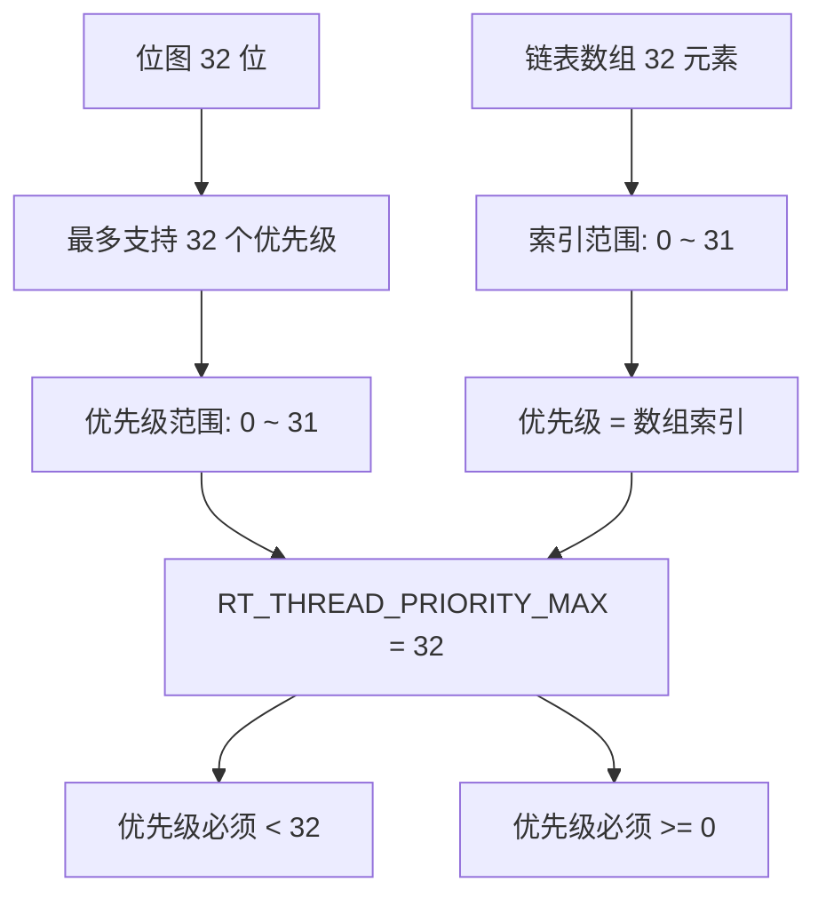

#### 越界后果分析

```c
/* 假设 RT_THREAD_PRIORITY_MAX = 32 */

/* ❌ 错误：优先级 = 32 */
thread->current_priority = 32;
/* 位图操作：1 << 32，结果未定义！ */
rt_thread_ready_priority_group |= (1 << thread->current_priority);

/* ❌ 错误：优先级 = -1 */
thread->current_priority = -1;
/* 数组访问：table[-1]，越界访问！ */
rt_list_t *list = &rt_thread_priority_table[thread->current_priority];
```

#### 防御性编程实践

```c
/* ✅ 正确：参数检查 */
rt_err_t rt_thread_startup(rt_thread_t thread)
{
    /* 参数有效性检查 */
    RT_ASSERT(thread != RT_NULL);
    RT_ASSERT(thread->current_priority < RT_THREAD_PRIORITY_MAX);
    
    /* ... 启动线程 ... */
    
    return RT_EOK;
}

/* ✅ 正确：编译时检查 */
#if (RT_THREAD_PRIORITY_MAX > 256)
    #error "RT_THREAD_PRIORITY_MAX must be <= 256"
#endif
```

---

### 5.3 防御性编程技巧总结

#### 常用防御性编程手段

| 手段      | 宏/关键字                  | 典型用途      |
| ------- | ---------------------- | --------- |
| 编译时断言   | `#error`               | 配置参数检查    |
| 运行时断言   | `RT_ASSERT`            | 参数有效性检查   |
| 静态断言    | `_Static_assert` (C11) | 编译时类型检查   |
| 未使用警告消除 | `RT_UNUSED`            | 消除编译器警告   |
| 条件编译    | `#ifdef`               | 功能裁剪与平台适配 |

#### RT_ASSERT 实现原理

```c
/* 断言宏定义 */
#ifdef RT_DEBUG
    #define RT_ASSERT(expr)                           \
        if (!(expr))                                   \
        {                                              \
            rt_kprintf("Assert: %s, %d\n",            \
                       __FILE__, __LINE__);           \
            while (1);                                 \
        }
#else
    #define RT_ASSERT(expr)  /* 空实现 */
#endif
```

#### 防御性编程流程

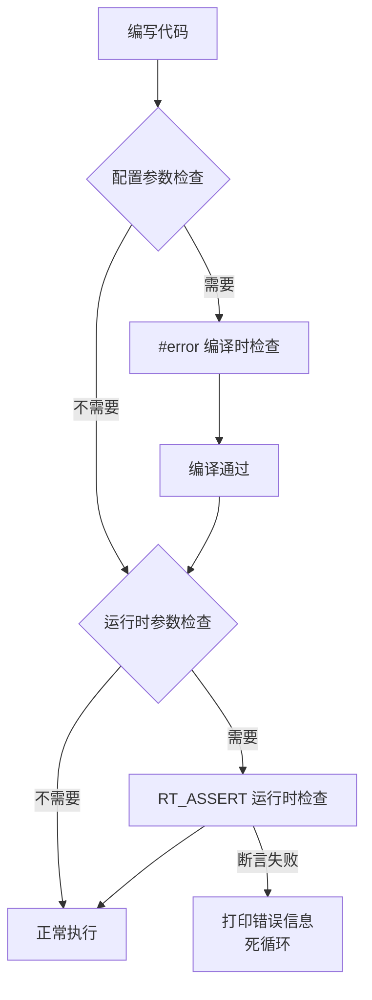

---

## 六、架构全景图

### 6.1 源码目录结构

RT-Thread 源码采用分层架构设计，目录结构清晰：

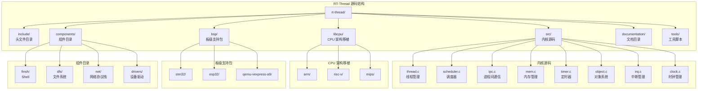

### 6.2 运行形态

RT-Thread 支持多种运行形态，适应不同应用场景：

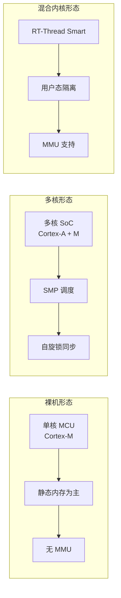

### 6.3 分层架构详解

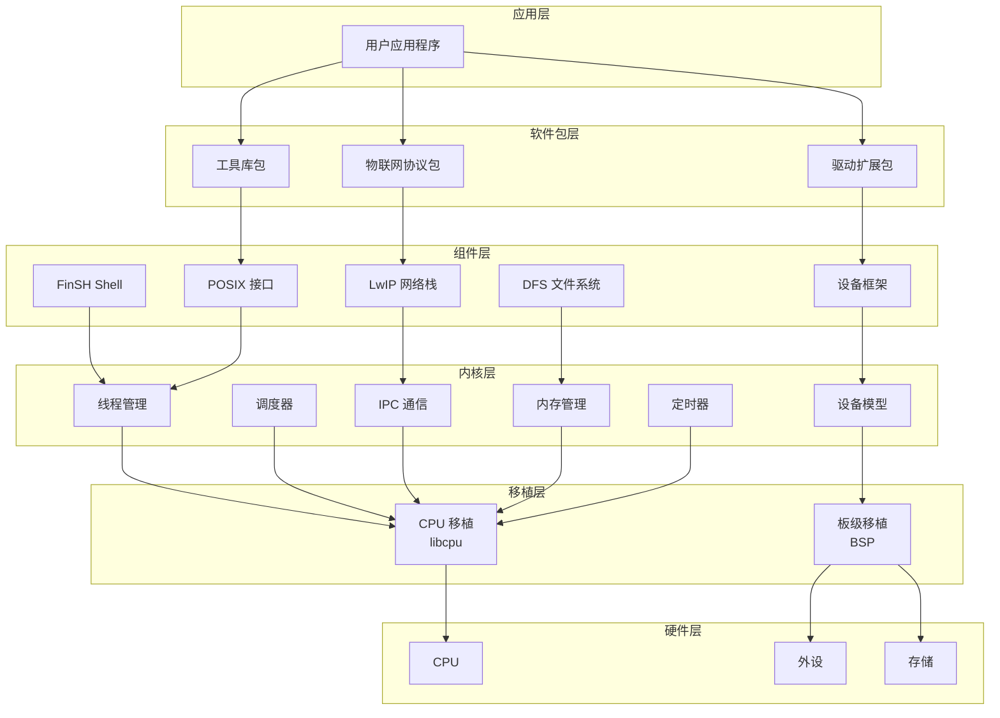

### 6.4 学习路径建议


---

## 七、总结

### 7.1 核心知识点速查表

| 主题 | 核心要点 |
|------|----------|
| 架构组成 | Kernel + Components + Packages 三层架构 |
| 核心头文件 | `rtthread.h`（接口层）、`rtdef.h`（定义层） |
| 对象系统 | 统一的对象类型枚举，支持继承和多态 |
| 动静分离 | `RT_USING_HEAP` 宏控制内存分配方式 |
| 可观测性 | `RT_USING_HOOK` 宏提供钩子机制 |
| 防御性编程 | `#error` 编译时检查、`RT_ASSERT` 运行时检查 |
| 源码结构 | include / src / libcpu / bsp / components |

### 7.2 关键宏定义速查

| 宏名称 | 作用 | 典型场景 |
|--------|------|----------|
| `RT_USING_HEAP` | 动态内存开关 | 资源受限系统关闭 |
| `RT_USING_HOOK` | 钩子函数开关 | 调试和监控场景开启 |
| `RT_USING_MODULE` | 动态模块加载 | 需要热更新时开启 |
| `RT_USING_DEVICE_IPC` | 设备 IPC 支持 | 设备驱动框架依赖 |
| `RT_DEBUG` | 调试模式开关 | 开发阶段开启 |
| `RT_ASSERT` | 断言宏 | 参数有效性检查 |

### 7.3 设计哲学总结

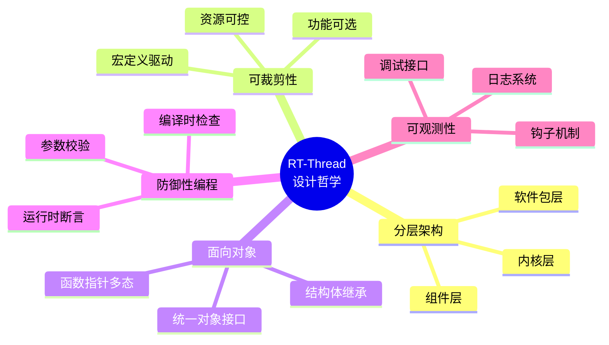

---

> **文档信息**
> - 整理日期：2026-04-16
> - 基于 RT-Thread 源码学习笔记
> - 涵盖总体架构、核心头文件、宏模块设计、防御性编程等主题
