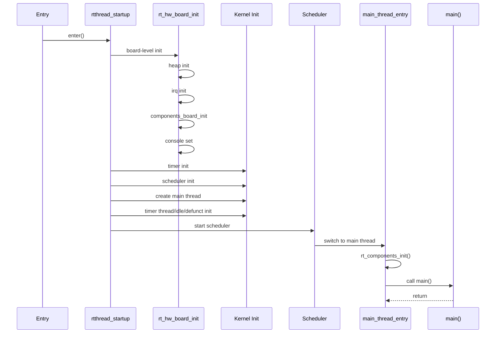

##### 日记
- 我服了我想用一下快捷键，看一下源码的调用函数，告诉我要进行：要先进入具体 BSP 目录，在 Env 终端里生成 VS Code 工程，再从那个终端里打开 VS Code
- 我好像知道一点为什么要用这么多的宏if了，他的函数好像分为debug和release的版本，debug版本更多的会进行串口汇报
- 指向函数指针的指针变量，我感觉我用的很少啊，都没怎么见过
- RT_UNUSED(parameter);的使用可以不传递参数，因为线程不一定要有参数
- 对于一些特殊的编译机制要知道
- 明天大体就是理解一下：我的那些问题：然后思考一下，认真思考完，基本上第三天也就处理完了，然后进入C语言里面的面对对象


### 启动时序图

```mermaid
graph TD
    %% 定义样式
    classDef hardware fill:#f9d0c4,stroke:#333,stroke-width:2px;
    classDef kernel fill:#d4e6f1,stroke:#333,stroke-width:2px;
    classDef thread fill:#d5f5e3,stroke:#333,stroke-width:2px;
    classDef app fill:#fcf3cf,stroke:#333,stroke-width:2px;

    Entry((Reset Entry)) --> STARTUP[rtthread_startup]
    
    subgraph Phase 1: 硬件与板级初始化
        STARTUP --> HW_INIT[rt_hw_board_init]
        HW_INIT --> HEAP[rt_system_heap_init]
        HEAP --> INT[rt_hw_interrupt_init]
        INT --> COMP_BD[rt_components_board_init]
        COMP_BD --> CONSOLE[rt_console_set_device]
    end
    class HW_INIT,HEAP,INT,COMP_BD,CONSOLE hardware

    subgraph Phase 2: OS 内核初始化
        CONSOLE --> VER[rt_show_version]
        VER --> TIMER[rt_system_timer_init]
        TIMER --> SCHED[rt_system_scheduler_init]
    end
    class VER,TIMER,SCHED kernel

    subgraph Phase 3: 系统核心线程创建
        SCHED --> APP_INIT[rt_application_init<br>创建 main 线程]
        APP_INIT --> TIMER_TH[rt_system_timer_thread_init]
        TIMER_TH --> IDLE_TH[rt_thread_idle_init]
        IDLE_TH --> DEF[rt_thread_defunct_init]
    end
    class APP_INIT,TIMER_TH,IDLE_TH,DEF thread

    subgraph Phase 4: 移交控制权
        DEF --> START_SCHED{rt_system_scheduler_start<br>启动调度器!}
        START_SCHED -.上下文切换.-> MAIN_ENTRY[main_thread_entry]
    end

    subgraph Phase 5: 应用层执行
        MAIN_ENTRY --> COMP_INIT[rt_components_init]
        COMP_INIT --> MAIN(main 函数)
        MAIN --> PRINT["Hello RT-Thread!"]
    end
    class MAIN_ENTRY,COMP_INIT,MAIN,PRINT app
```








#### rtthread_startup

**总入口与启动枢纽**（相当于宇宙大爆炸的起点）。它的核心作用是按严格的依赖顺序初始化硬件、OS 核心数据结构、创建系统必备线程，并最终把 CPU 的控制权交给调度器**

初始化顺序的要求

- **第一步：关中断，打造绝对安全的无干扰环境**
    
    - `rt_hw_local_irq_disable()`：这是一句底层的硬件汇编封装。在 OS 数据结构（如各种链表、队列）建立好之前，如果有硬件中断（比如滴答定时器）触发并尝试调用 OS API，系统必然崩溃。因此，第一件事就是关门谢客，屏蔽所有中断。
        
    - _注：如果是多核 (SMP)，还会在此之前初始化自旋锁 `rt_hw_spin_lock_init`。_
        
- **第二步：板级与内存初始化**
    
    - `rt_hw_board_init()`：非常关键的一步！它通常会配置系统时钟、串口（为了打印信息），**最重要的是初始化系统堆内存 (Heap)**。因为后续创建线程都需要用 `rt_malloc` 动态分配内存，所以它必须排在最前面。
        
- **第三步：OS 核心组件初始化**
    
    - `rt_system_timer_init()` 和 `rt_system_scheduler_init()`：初始化系统底层的定时器硬件链表和调度器的就绪队列（通常是一个多级指针数组，对应不同的优先级）。这时候 OS 只是搭好了架子，还没有“活人”（线程）。
        
- **第四步：入驻核心系统线程**
    
    - `rt_application_init()`：创建用户应用线程（通常是 `main` 线程）。
        
    - `rt_system_timer_thread_init()`：创建软件定时器线程，用于处理超时回调。
        
    - `rt_thread_idle_init()`：创建空闲线程（Idle Thread）。当所有其他线程都在阻塞等待时，CPU 不能停下，就会执行这个优先级最低的空闲线程（通常在这里做进入低功耗模式的操作）。
        
    - `rt_thread_defunct_init()`：僵尸线程回收器。当有线程被删除时，它的资源由这个线程在后台默默释放。
- 
- 问题：为什么多核要加入自旋锁
- 问题：`rt_thread_idle_init()`为什么不可以让cpu空闲，在所有任务阻塞的状态
- 问题：调度器的就绪队列（通常是一个多级指针数组，对应不同的优先级）是如何架构的

```c
/**

 * @brief  This function will call all levels of initialization functions to complete

 *         the initialization of the system, and finally start the scheduler.

 *

 * @return Normally never returns. If 0 is returned, the scheduler failed.

 */
 
 //启动系统和任务调度器

int rtthread_startup(void)

{

#ifdef RT_USING_SMP

    rt_hw_spin_lock_init(&_cpus_lock);

	//如果是多核 (SMP)，还会在此之前初始化自旋锁 `rt_hw_spin_lock_init`
#endif

    rt_hw_local_irq_disable();

	//关闭本地中断，

    /* board level initialization

     * NOTE: please initialize heap inside board initialization.

     */

    rt_hw_board_init();

  

    /* show RT-Thread version */

    rt_show_version();

  

    /* timer system initialization */

    rt_system_timer_init();

  

    /* scheduler system initialization */

    rt_system_scheduler_init();

  

#ifdef RT_USING_SIGNALS

    /* signal system initialization */

    rt_system_signal_init();

#endif /* RT_USING_SIGNALS */

  

    /* create init_thread */

    rt_application_init();

  

    /* timer thread initialization */

    rt_system_timer_thread_init();

  

    /* idle thread initialization */

    rt_thread_idle_init();

  

    /* defunct thread initialization */

    rt_thread_defunct_init();

  

#ifdef RT_USING_SMP

    rt_hw_spin_lock(&_cpus_lock);

#endif /* RT_USING_SMP */

  

    /* start scheduler */

    rt_system_scheduler_start();

  

    /* never reach here */

    return 0;

}
```
**永不返回”的魔法是怎么实现的？** 在单片机 C 语言编程中，函数调完了通常会 `return` 到调用它的地方。但 `rt_system_scheduler_start()` 内部使用了**汇编语言**。它会强制修改 CPU 的关键寄存器：

1. 把 SP（堆栈指针寄存器）指向最高优先级线程的栈顶。
    
2. 把 PC（程序计数器）指向该线程的入口函数。 这种暴力的寄存器修改，直接抛弃了 `rtthread_startup` 的 C 语言调用栈，完成了从“初始化上下文”到“线程上下文”的终极切换。


#### rt_hw_board_init

`rt_hw_board_init` 是 RT-Thread 启动过程中**最具硬件色彩的底层枢纽**。它的核心任务是在系统内核调度器正式接管 CPU 之前，把底层硬件的“基础设施”搭建好：开启内存管理单元（MMU）、划分系统堆内存、配置硬件中断控制器、启动串口控制台，并为多核或低功耗做好预热。


**Step 1: 内存管理单元 (MMU) 初始化（最晦涩的部分）**

- `#ifdef RT_USING_SMART`：这里引入了 **RT-Thread Smart**（混合微内核架构）。如果是 Smart 版本，它需要像 Linux 一样严格隔离“内核态”和“用户态”。
    
- `rt_hw_mmu_map_init(...)`：设定内核空间的映射区间。Smart 模式下通常映射在 `0xf0000000` 往上的空间；传统模式下在 `0x80000000`。
    
- `rt_hw_init_mmu_table`：根据当前硬件的 `platform_mem_desc`（内存描述符，告诉你哪段是 RAM，哪段是外设寄存器）来填充分页表 `MMUTable`。
    
- `rt_hw_mmu_switch` / `rt_hw_mmu_init`：操作 CPU 底层寄存器（通常是协处理器指令，如 ARM 的 CP15），**正式开启 MMU 硬件**。从这一刻起，CPU 读写的不再是物理地址，而是虚拟地址！
    
- _Smart 特有_：`rt_page_init(init_page_region)` 启动物理页分配器（类似于操作系统的按页分配机制），因为后续创建用户进程需要分配独立的物理内存页

- 我这个只是提取的虚拟板子的硬件模块，在bsp里面的qemu-vexpress-a9，每个板子的代码应该不动


- **Step 2: 内存堆栈与中断系统**
    
    - `rt_system_heap_init(HEAP_BEGIN, HEAP_END)`：将一块大段的空闲内存交由 OS 的内存分配算法管理。只有执行完这句，系统里才能使用 `rt_malloc` 和 `rt_free`。
        
    - `rt_hw_interrupt_init()`：初始化硬件中断控制器（比如 ARM 的 GIC 或 NVIC），设置好中断向量表。
        
- **Step 3: 唤醒底层外设与控制台**
    
    - `rt_components_board_init()`：这就是我们上次聊过的**自动初始化机制**！在这里，它会自动把底层驱动（如系统滴答定时器、UART 串口）全部初始化完毕。
        
    - `rt_console_set_device(...)`：告诉系统使用哪个串口作为主控制台。**极度关键**：从这行代码执行完开始，你写的 `rt_kprintf()` 才能真正在屏幕上打印出字符。
        
- **Step 4: 机制挂载 (低功耗与 SMP 多核)**
    
    - `rt_thread_idle_sethook(idle_wfi)`：给系统的空闲线程挂载一个“钩子”（Hook）。`wfi` 全称是 _Wait For Interrupt_（汇编指令），当 OS 没任务跑时，执行这句指令让 CPU 核心进入休眠省电，直到下一个中断到来。
        
    - `rt_hw_ipi_handler_install(...)`：如果是多核 (SMP) 环境，这里会注册 **IPI (Inter-Processor Interrupt，核间中断)**。主核就是靠触发这种中断，来跨核心指挥从核执行任务调度的。
- 问题：samrt版本和普通版本的区别
- 问题：MMU内存管理系统的理解
- 问题：这是怎么实现的：告诉系统使用哪个串口作为主控制台
- 问题：核间中断：跨核心指挥从核执行任务调度，不懂
- 问题：Hook (钩子) 机制
```c
/**

 * This function will initialize board

 */

  

extern size_t MMUTable[];

  

#ifdef RT_USING_SMART

rt_region_t init_page_region = {

    (uint32_t)PAGE_START,

    (uint32_t)PAGE_END,

};

#endif

  

void rt_hw_board_init(void)

{

#ifdef RT_USING_SMART

    rt_uint32_t mmutable_p = 0;

    rt_hw_mmu_map_init(&rt_kernel_space, (void*)0xf0000000, 0x10000000, MMUTable, PV_OFFSET);

    rt_hw_init_mmu_table(platform_mem_desc,platform_mem_desc_size);

    mmutable_p = (rt_uint32_t)MMUTable + (rt_uint32_t)PV_OFFSET ;

    rt_hw_mmu_switch((void*)mmutable_p);

    rt_page_init(init_page_region);

    rt_hw_mmu_ioremap_init(&rt_kernel_space, (void*)0xf0000000, 0x10000000);

    arch_kuser_init(&rt_kernel_space, (void*)0xffff0000);

#else

    rt_hw_mmu_map_init(&rt_kernel_space, (void*)0x80000000, 0x10000000, MMUTable, 0);

    rt_hw_init_mmu_table(platform_mem_desc,platform_mem_desc_size);

    rt_hw_mmu_init();

    rt_hw_mmu_ioremap_init(&rt_kernel_space, (void*)0x80000000, 0x10000000);

#endif

  

    /* initialize system heap */

    rt_system_heap_init(HEAP_BEGIN, HEAP_END);

  

    /* initialize hardware interrupt */

    rt_hw_interrupt_init();

  

    rt_components_board_init();

    rt_console_set_device(RT_CONSOLE_DEVICE_NAME);

  

    rt_thread_idle_sethook(idle_wfi);

  

#ifdef RT_USING_SMP

    /* install IPI handle */

    rt_hw_ipi_handler_install(RT_SCHEDULE_IPI, rt_scheduler_ipi_handler);

#endif

}
```

### rt_components_board_init

`rt_components_board_init` 是 RT-Thread **自动初始化机制（Auto-Initialization）**在板级（Board-level）的核心引擎。它通过遍历特定的内存段，自动发现在编译阶段被“秘密标记”的硬件初始化函数，并逐一执行它们，从而免去了手动书写一长串初始化代码的麻烦


**编译宏分支：** `#ifdef RT_DEBUGING_AUTO_INIT` 用于区分是否开启初始化调试。如果开启，系统不仅会执行初始化，还会通过 `rt_kprintf` 打印出正在执行的函数名及其执行结果，方便排查哪个硬件初始化卡死了。

- `__rt_init_rti_board_start` 和 `__rt_init_rti_board_end` 并不是在 C 语言文件里定义的普通变量！它们是由**链接器（Linker）**在链接脚本（如 `.ld`、`.sct` 或 `.icf` 文件）中强制塞入的内存地址标签。
    
- 这两个标签就像书架上的两个书挡。它们之间存放着所有被标记为“板级初始化”的函数地址。
    
- `fn_ptr++` 使得指针在内存中以函数指针的大小为步长，从起点一直往后移动，直到终点。

- 问题：这个函数指针是怎么使用的，和什么东西有关，初始化的函数吗？
- 问题：“基于链接器的自动注册机制”（或者叫面向切面编程 AOP 的 C 语言变体），这个要研究一下
- 问题：他调用在哪里

```c
/**

 * @brief  Onboard components initialization. In this function, the board-level

 *         initialization function will be called to complete the initialization

 *         of the on-board peripherals.

 */

void rt_components_board_init(void)

{

#ifdef RT_DEBUGING_AUTO_INIT

    int result;

    const struct rt_init_desc *desc;//定义了一个指向函数指针的指针变量

    for (desc = &__rt_init_desc_rti_board_start; desc < &__rt_init_desc_rti_board_end; desc ++)

    {

        rt_kprintf("initialize %s\n", desc->fn_name);

        result = desc->fn();

        rt_kprintf(":%d done\n", result);

    }

#else

    volatile const init_fn_t *fn_ptr;

  

    for (fn_ptr = &__rt_init_rti_board_start; fn_ptr < &__rt_init_rti_board_end; fn_ptr++)

    {

        (*fn_ptr)();

    }

#endif /* RT_DEBUGING_AUTO_INIT */

}
```


#### rt_components_init()

`rt_components_init` 是 RT-Thread 自动初始化机制的**“下半场”核心引擎**。它在调度器启动后（处于多线程环境下）被调用，专门负责遍历并执行那些依赖于操作系统功能（如需要分配内存、创建线程、使用信号量等）的**高级组件初始化函数**（如 VFS、FinSH 控制台、网络协议栈等）。

- 问题：他这个初始化和板级好像，但是函数指针指向的函数肯定是不一样的啊，怎么操作的啊不懂，地址是连续的我知道
- 问题：为什么要分段初始化


>- `rt_components_board_init` 运行在内核接管前的**裸机环境**，此时不能用 `rt_thread_mdelay()`（因为没有调度器），甚至某些时候连 `rt_malloc` 都不能用（如果堆还没建好）。
    
- `rt_components_init` 被 `main_thread_entry` 调用，此时**调度器已经正常运行**，它身处一个真实的线程环境中。如果某个组件（比如以太网芯片）初始化需要耗时几百毫秒，它可以放心地调用 `rt_thread_mdelay()` 让出 CPU，不会卡死整个系统。如果初始化需要动态申请大块内存，也可以正常使用 `rt_malloc`。
```c

/**

 * @brief  RT-Thread Components Initialization.

 */

void rt_components_init(void)

{

#ifdef RT_DEBUGING_AUTO_INIT

    int result;

    const struct rt_init_desc *desc;

  

    rt_kprintf("do components initialization.\n");

    for (desc = &__rt_init_desc_rti_board_end; desc < &__rt_init_desc_rti_end; desc ++)

    {

        rt_kprintf("initialize %s\n", desc->fn_name);

        result = desc->fn();

        rt_kprintf(":%d done\n", result);

    }

#else

    volatile const init_fn_t *fn_ptr;

  

    for (fn_ptr = &__rt_init_rti_board_end; fn_ptr < &__rt_init_rti_end; fn_ptr ++)

    {

        (*fn_ptr)();

    }

#endif /* RT_DEBUGING_AUTO_INIT */

}

#endif /* RT_USING_COMPONENTS_INIT */
```

#### main_thread_entry

`main_thread_entry` 是 RT-Thread 系统创建的**第一个用户级应用线程（main 线程）的入口函数**。它的核心作用是充当“承上启下”的桥梁：在调度器启动后，完成剩余的高级 OS 组件初始化，并最终优雅地把执行权交接给你（开发者）编写的 `main()` 函数。


**多核启动（SMP）：**

- `rt_hw_secondary_cpu_up();`：如果你用的是多核芯片（比如双核 Cortex-A），主核（Core 0）走到这里时，OS 已经基本就绪，于是它通过这行代码唤醒其他从核（Core 1, Core 2...），让它们也加入到操作系统的调度队列中来。

- **ARMCC (通常是 Keil MDK):** 看到 `$Super$$main()` 了吗？这是 ARM 编译器的一个“黑魔法”（链接器补丁）。正常情况下，C 语言的启动文件（Startup.s）会直接跳到 `main()`。RT-Thread 利用 `$Sub$$main` 和 `$Super$$main` 机制，在不修改原有启动文件的情况下，把程序的实际入口“劫持”到了系统初始化代码，等系统准备好后，再通过 `$Super$$main()` 回到开发者写的那个真正的 `main()` 函数中。
    
- **IAR / GCC / 其他编译器:** 对于没有 `$Super$$` 这种特殊机制的编译器，RT-Thread 会在底层汇编代码中直接修改复位向量，先跳到 `rtthread_startup`，所以这里可以直接像调用普通函数一样调用 `main()`。

- 问题：对于线程的理解要更加深入，比如从这里main初始化的位置

```c

/**

 * @brief  The system main thread. In this thread will call the rt_components_init()

 *         for initialization of RT-Thread Components and call the user's programming

 *         entry main().

 *

 * @param  parameter is the arg of the thread.

 */

static void main_thread_entry(void *parameter)

{

    extern int main(void);

    RT_UNUSED(parameter);

  

#ifdef RT_USING_COMPONENTS_INIT

    /* RT-Thread components initialization */

    rt_components_init();//OS系统已经处于多线程环境了，它可以安全地初始化需要依赖 OS 功能

#endif /* RT_USING_COMPONENTS_INIT */

  

#ifdef RT_USING_SMP

    rt_hw_secondary_cpu_up();

#endif /* RT_USING_SMP */

    /* invoke system main function */

#ifdef __ARMCC_VERSION

    {

        extern int $Super$$main(void);

        $Super$$main(); /* for ARMCC. */

    }

#elif defined(__ICCARM__) || defined(__GNUC__) || defined(__TASKING__) || defined(__TI_COMPILER_VERSION__)

    main();

#endif /* __ARMCC_VERSION */

}
```


1. INIT_BOARD_EXPORT(fn)
    - 级别是 "1"，定义在 rtdef.h (line 180)
    - 在 rt_hw_board_init() 阶段执行（很早），通过 rt_components_board_init() 跑
    - 更偏“板级基础能力”：时钟/中断控制器/基础串口/基础定时器等
2. INIT_DEVICE_EXPORT(fn)
    - 级别是 "3"，定义在 rtdef.h (line 193)
    - 在 main_thread_entry -> rt_components_init() 阶段执行（更晚）
    - 更偏“


## 思考

- **跨平台兼容性设计：** 这段代码是处理 C 语言跨平台/跨编译器差异的绝佳范本。通过 `#if defined(__ICCARM__) || defined(__GNUC__)` 这样的宏定义，同一套 C 源码可以无缝适配 Keil (ARMCC)、IAR (ICCARM) 和基于 GCC 的各种开发环境。编写底层驱动或中间件时，这种隔离硬件和编译器差异的抽象能力是架构师的必备技能。
    
- **AOP（面向切面编程）的 C 语言实现：** ARMCC 的 `$Super$$` 和 `$Sub$$` 机制，实际上就是在原本的执行流中间“切了一刀”，强行插入了 RTOS 的启动逻辑。这启发我们：在不破坏原有代码封装的前提下，通过链接器特性改变代码行为，是一种非常优雅的非侵入式设计


- **通过链接器脚本（Linker Script）实现“分门别类”：** 这个机制的美妙之处在于，所有写在不同 `.c` 文件里的 `INIT_xxx_EXPORT(fn)` 宏，在编译成 `.o` 文件后，链接器会根据你指定的不同前缀（比如 `1.`、`2.`、`3.`），像排列扑克牌一样，严格按照优先级顺序把它们在内存中排好队。这极大地解耦了各个模块，开发者无需维护一个庞大且容易冲突的显式初始化函数列表。
    
- **防错设计：** 使用 `__rt_init_rti_board_end` 既作为上一阶段的结束，又作为这一阶段的开始，从逻辑上保证了这两类初始化操作在内存分布上是连续且无缝衔接的，避免了内存碎片的产生或函数的遗漏。

- **Hook (钩子) 机制带来的完美解耦：** `rt_thread_idle_sethook` 是一种极佳的嵌入式设计模式。OS 的核心调度器不需要知道底层硬件是怎么省电的（不同芯片省电的汇编指令不同，有 WFI、WFE 等）。内核只提供一个空的“钩子”，而把具体挂什么逻辑的权力交给了 BSP（板级支持包）开发者。这做到了“机制与策略的分离”。
    
- **基于宏的高弹性架构：** 仔细看这段代码，通过 `#ifdef RT_USING_SMART` 和 `#ifdef RT_USING_SMP`，这同一个函数能够根据编译配置，无缝适应“传统单核”、“多核 SMP”、“微内核 Smart”三种截然不同的操作系统形态。这是 C 语言条件编译在大型软件工程中最经典的威力展现。