# 第一部分：文件头部 + 学习心得模块


# 2. 启动主链分析

## 一、学习心得与要点速记

### 1.1 开发环境与工具

- **VS Code 工程生成流程：** 要先进入具体 BSP 目录，在 Env 终端里生成 VS Code 工程，再从那个终端里打开 VS Code，才能使用快捷键查看源码的调用函数。
- **宏条件编译的作用：** 我好像知道一点为什么要用这么多的宏 `#if` 了，他的函数好像分为 debug 和 release 的版本，debug 版本更多的会进行串口汇报。

### 1.2 代码技巧与机制

- **指向函数指针的指针变量：** 我感觉我用的很少啊，都没怎么见过，需要加强这方面的理解。
- **`RT_UNUSED(parameter)` 的妙用：** 使用这个宏可以不传递参数，因为线程不一定要有参数，避免编译器警告。
- **特殊的编译机制：** 对于一些特殊的编译机制要知道，比如链接器脚本、段定义等。

### 1.3 学习规划

- 明天大体就是理解一下我的那些问题，然后思考一下，认真思考完，基本上第三天也就处理完了，然后进入 C 语言里的面向对象。


# 第二部分：启动时序全景图

---


## 二、启动时序全景图

### 2.1 启动流程时序图

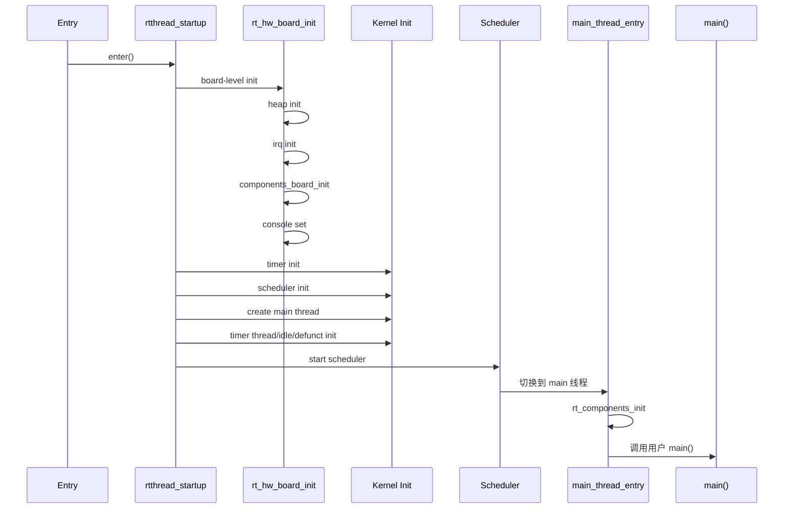

### 2.2 启动阶段划分

RT-Thread 的启动过程可以划分为**三个核心阶段**：


### 2.3 阶段特性对比

| 阶段 | 执行环境 | 可用功能 | 典型操作 |
|------|----------|----------|----------|
| 第一阶段 | 裸机环境（无调度器） | 仅硬件操作 | 时钟配置、堆初始化、串口初始化 |
| 第二阶段 | 裸机环境（无调度器） | 内核数据结构 | 定时器初始化、调度器初始化、线程创建 |
| 第三阶段 | 多线程环境 | 完整 OS 功能 | 组件初始化、用户应用启动 |

---

## 三、启动主链函数剖析

### 3.1 rtthread_startup

#### 一句话总结

**总入口与启动枢纽**（相当于宇宙大爆炸的起点）。它的核心作用是按严格的依赖顺序初始化硬件、OS 核心数据结构、创建系统必备线程，并最终把 CPU 的控制权交给调度器。

#### 初始化顺序详解

##### 第一步：关中断，打造绝对安全的无干扰环境

```c
rt_hw_local_irq_disable();
```

这是一句底层的硬件汇编封装。在 OS 数据结构（如各种链表、队列）建立好之前，如果有硬件中断（比如滴答定时器）触发并尝试调用 OS API，系统必然崩溃。因此，第一件事就是关门谢客，屏蔽所有中断。

> **注：** 如果是多核（SMP），还会在此之前初始化自旋锁 `rt_hw_spin_lock_init`。

##### 第二步：板级与内存初始化

```c
rt_hw_board_init();
```

非常关键的一步！它通常会配置系统时钟、串口（为了打印信息），**最重要的是初始化系统堆内存**。因为后续创建线程都需要用 `rt_malloc` 动态分配内存，所以它必须排在最前面。

##### 第三步：定时器初始化

```c
rt_system_timer_init();
```

初始化系统定时器链表和相关数据结构，为后续的软件定时器功能做准备。

##### 第四步：调度器初始化

```c
rt_system_scheduler_init();
```

初始化调度器的核心数据结构：就绪队列（位图 + 链表数组）、当前线程指针等。

##### 第五步：创建 main 线程

```c
rt_application_init();
```

创建系统第一个用户级线程——main 线程，它的入口函数是 `main_thread_entry`。

##### 第六步：定时器线程与空闲线程初始化

```c
rt_system_timer_thread_init();
rt_thread_idle_init();
```

- **定时器线程：** 专门处理软件定时器的超时回调。
- **空闲线程：** 当所有用户线程都阻塞时，给 CPU 兜底运行。

##### 第七步：启动调度器

```c
rt_system_scheduler_start();
```

这是启动流程的最后一行代码！调度器开始工作，从就绪队列中选出最高优先级的线程（通常是 main 线程），然后**永不返回**。

#### 启动流程图

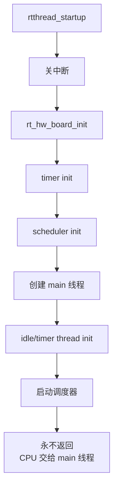

---

### 3.2 rt_hw_board_init

#### 一句话总结

`rt_hw_board_init` 是 RT-Thread 启动过程中**最具硬件色彩的底层枢纽**。它的核心任务是在系统内核调度器正式接管 CPU 之前，把底层硬件的"基础设施"搭建好：开启内存管理单元（MMU）、划分系统堆内存、配置硬件中断控制器、启动串口控制台，并为多核或低功耗做好预热。

#### 逐层代码剖析

这段代码使用了大量的条件编译（`#ifdef`），体现了 RT-Thread 极强的可配置性：

##### Step 1: 内存管理单元（MMU）初始化

```c
#ifdef RT_USING_SMART
    rt_hw_mmu_map_init(...);
    rt_hw_init_mmu_table(...);
#endif
```

这里引入了 **RT-Thread Smart**（混合微内核架构）。如果是 Smart 版本，它需要像 Linux 一样严格隔离"内核态"和"用户态"。

- `rt_hw_mmu_map_init(...)`：设定内核空间的映射区间。Smart 模式下通常映射在 `0xf0000000` 往上的空间；传统模式下在 `0x80000000`。
- `rt_hw_init_mmu_table`：根据当前硬件的 `platform_mem_desc`（内存描述符，告诉你哪段是 RAM，哪段是外设寄存器）来填充分页表 `MMUTable`。

##### Step 2: 系统堆内存初始化

```c
rt_system_heap_init((void *)HEAP_BEGIN, (void *)HEAP_END);
```

这是 RT-Thread 内存管理的起点。它告诉内核：从 `HEAP_BEGIN` 到 `HEAP_END` 这段连续内存区域，可以用来动态分配（`rt_malloc`）。

##### Step 3: 板级自动初始化

```c
rt_components_board_init();
```

这是自动初始化机制的入口！它会遍历所有用 `INIT_BOARD_EXPORT()` 注册的函数，依次执行。

##### Step 4: 控制台绑定

```c
rt_console_set_device(RT_CONSOLE_DEVICE_NAME);
```

将指定的串口设备绑定为系统控制台，之后 `rt_kprintf()` 的输出就会从这个串口打印出来。

#### 板级初始化流程图

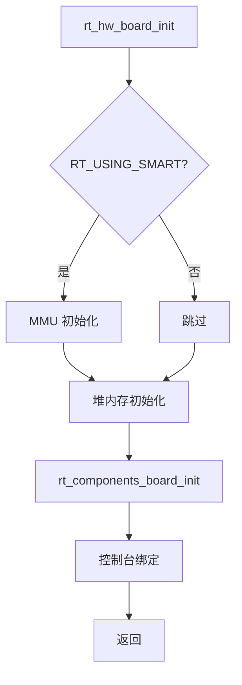

---

### 3.3 rt_components_board_init

#### 一句话总结

`rt_components_board_init` 是 RT-Thread **自动初始化机制**在板级的核心引擎。它通过遍历特定的内存段，自动发现在编译阶段被"秘密标记"的硬件初始化函数，并逐一执行它们，从而免去了手动书写一长串初始化代码的麻烦。

#### 核心代码逻辑

```c
void rt_components_board_init(void)
{
    const init_fn_t *fn_ptr;

    for (fn_ptr = &__rt_init_start; fn_ptr < &__rt_init_end; fn_ptr++)
    {
        (*fn_ptr)();  /* 依次调用每个初始化函数 */
    }
}
```

#### 调试模式

```c
#ifdef RT_DEBUGING_AUTO_INIT
    rt_kprintf("initialize %s: ", fn_name);
    result = (*fn_ptr)();
    rt_kprintf("result: %d\n", result);
#endif
```

`#ifdef RT_DEBUGING_AUTO_INIT` 用于区分是否开启初始化调试。如果开启，系统不仅会执行初始化，还会通过 `rt_kprintf` 打印出正在执行的函数名及其执行结果，方便排查哪个硬件初始化卡死了。

#### 内存段遍历示意图

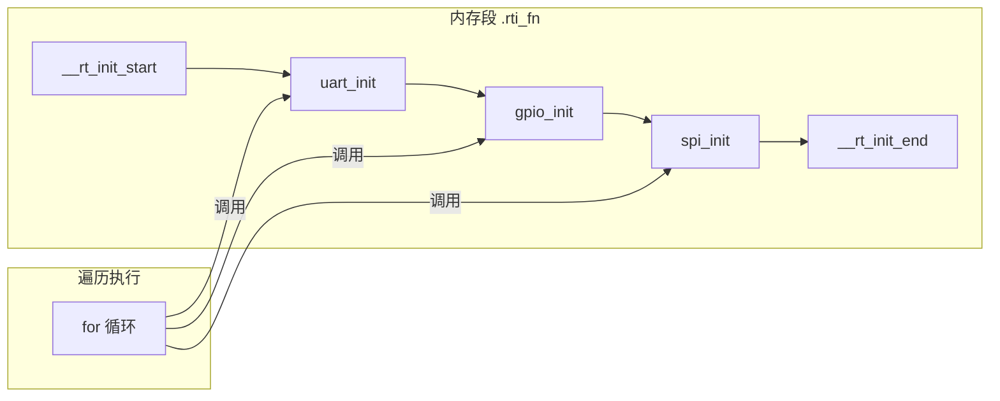

---

### 3.4 rt_components_init

#### 一句话总结

`rt_components_init` 是 RT-Thread 自动初始化机制的**"下半场"核心引擎**。它在调度器启动后（处于多线程环境下）被调用，专门负责遍历并执行那些依赖于操作系统功能（如需要分配内存、创建线程、使用信号量等）的**高级组件初始化函数**（如 VFS、FinSH 控制台、网络协议栈等）。

#### 与板级初始化的区别

> **问题：为什么要分段初始化？**

| 特性 | `rt_components_board_init` | `rt_components_init` |
|------|----------------------------|----------------------|
| 执行时机 | 调度器启动前 | 调度器启动后 |
| 执行环境 | 裸机环境 | 多线程环境 |
| 可用功能 | 仅硬件操作 | 完整 OS 功能 |
| 可否阻塞 | **绝对不能** | 可以 |
| 典型用途 | 硬件驱动初始化 | 软件组件初始化 |

#### 为什么必须分段？

- `rt_components_board_init` 运行在内核接管前的**裸机环境**，此时不能用 `rt_thread_mdelay()`（因为没有调度器），甚至某些时候连 `rt_malloc` 都不能用（如果堆还没建好）。

- `rt_components_init` 被 `main_thread_entry` 调用，此时**调度器已经正常运行**，它身处一个真实的线程环境中。如果某个组件（比如以太网芯片）初始化需要耗时几百毫秒，它可以放心地调用 `rt_thread_mdelay()` 让出 CPU。

#### 两阶段初始化流程图

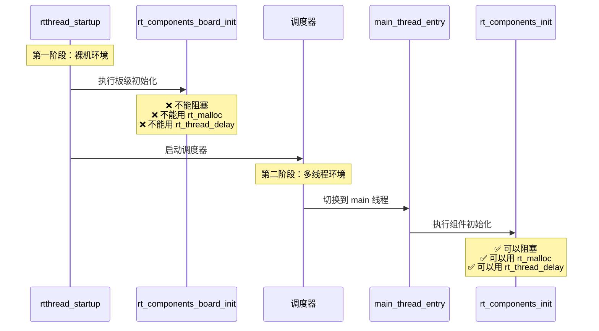

---

### 3.5 main_thread_entry

#### 一句话总结

`main_thread_entry` 是 RT-Thread 系统创建的**第一个用户级应用线程（main 线程）的入口函数**。它的核心作用是充当"承上启下"的桥梁：在调度器启动后，完成剩余的高级 OS 组件初始化，并最终优雅地把执行权交接给你（开发者）编写的 `main()` 函数。

#### 核心代码逻辑

```c
void main_thread_entry(void *parameter)
{
    /* 执行高级组件初始化 */
    rt_components_init();
    
#ifdef RT_USING_SMP
    /* 多核启动：唤醒从核 */
    rt_hw_secondary_cpu_up();
#endif
    
    /* 调用用户的 main 函数 */
    main();
}
```

#### 多核启动（SMP）

```c
rt_hw_secondary_cpu_up();
```

如果你用的是多核芯片（比如双核 Cortex-A），主核（Core 0）走到这里时，OS 已经基本就绪，于是它通过这行代码唤醒其他从核（Core 1, Core 2...），让它们也加入到操作系统的调度队列中来。

#### main 线程执行流程

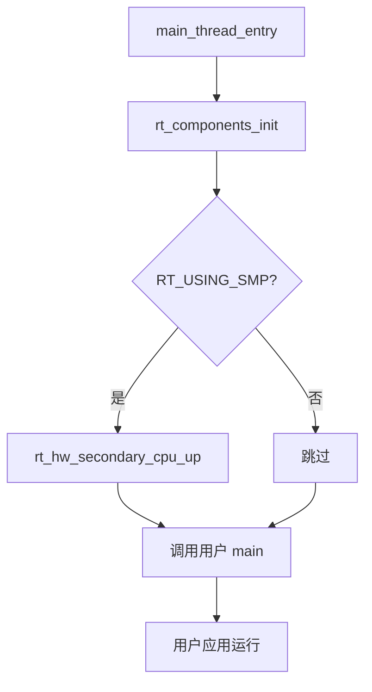


# 第三部分：自动初始化机制详解

---


## 四、自动初始化机制详解

### 4.1 机制总览

RT-Thread 的自动初始化机制通过**特殊的 C 语言宏定义和链接器脚本的配合**，将分散在各个源码文件中的初始化函数指针，在编译时自动收集并按优先级紧凑地排列到一段特定的内存段中。系统启动时只需遍历这段内存即可完成所有模块的初始化，彻底解除了 `main()` 函数与底层驱动之间的强耦合。

#### 三大关键角色

要实现这个魔法，需要三个关键角色的配合：

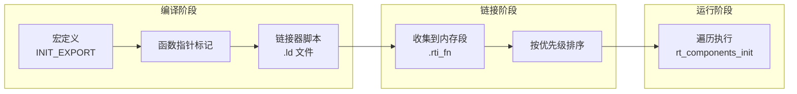

---

### 4.2 宏定义解析

#### 核心宏定义

在 RT-Thread 源码（`rtdef.h`）中，你会看到类似这样的宏：

```c
#define INIT_EXPORT(fn, level) \
    RT_USED const init_fn_t __rt_init_##fn SECTION(".rti_fn." level) = fn
```

当你写下 `INIT_BOARD_EXPORT(uart_init);` 时，宏展开后实际上是定义了一个**常量函数指针**，并且用 `SECTION` 属性把它强制放到了一个特殊的内存段中。

#### 宏展开示例

```c
/* 原始代码 */
INIT_BOARD_EXPORT(uart_init);

/* 宏展开后 */
RT_USED const init_fn_t __rt_init_uart_init SECTION(".rti_fn.1") = uart_init;
```

#### 宏参数解析

| 部分 | 含义 |
|------|------|
| `RT_USED` | 告诉编译器即使这个变量没被引用也不要优化掉 |
| `const init_fn_t` | 函数指针类型，指向返回 void、无参数的函数 |
| `__rt_init_##fn` | 宏拼接，生成唯一的变量名（如 `__rt_init_uart_init`） |
| `SECTION(".rti_fn." level)` | 将变量放入指定的内存段（如 `.rti_fn.1`） |
| `= fn` | 初始化函数指针，指向 `uart_init` |

---

### 4.3 INIT_*_EXPORT 分级体系

这段代码正是 RT-Thread 自动初始化机制的**"优先级法则表"**。它通过为不同的宏赋予不同的字符串标号（如 "1"、"2"、"3"），精准地定义了系统中成百上千个底层外设和软件组件的**绝对启动顺序**。

#### 分级宏定义

```c
/* 板级初始化（调度器启动前） */
#define INIT_BOARD_EXPORT(fn)      INIT_EXPORT(fn, "1")

/* 设备初始化（调度器启动后） */
#define INIT_DEVICE_EXPORT(fn)     INIT_EXPORT(fn, "2.0")

/* 组件初始化 */
#define INIT_COMPONENT_EXPORT(fn)  INIT_EXPORT(fn, "2.1")

/* 环境初始化 */
#define INIT_ENV_EXPORT(fn)        INIT_EXPORT(fn, "2.2")

/* 应用初始化 */
#define INIT_APP_EXPORT(fn)        INIT_EXPORT(fn, "2.3")
```

#### 优先级排序示意图

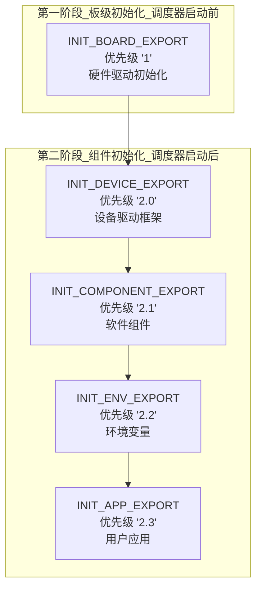

#### 各级别用途详解

| 宏名称 | 优先级 | 执行阶段 | 典型用途 |
|--------|--------|----------|----------|
| `INIT_BOARD_EXPORT` | "1" | 板级初始化 | GPIO、UART、SPI 等硬件驱动 |
| `INIT_DEVICE_EXPORT` | "2.0" | 组件初始化 | 设备驱动框架注册 |
| `INIT_COMPONENT_EXPORT` | "2.1" | 组件初始化 | 文件系统、网络协议栈 |
| `INIT_ENV_EXPORT` | "2.2" | 组件初始化 | 环境变量、工作目录 |
| `INIT_APP_EXPORT` | "2.3" | 组件初始化 | 用户应用程序入口 |

---

### 4.4 链接器脚本配合

#### 链接器脚本片段

链接器脚本（`.ld` 文件）会把这些分散的函数指针收集到一起：

```ld
/* 链接器脚本片段 */
.rti_fn :
{
    . = ALIGN(4);                    /* 4 字节对齐 */
    __rt_init_start = .;             /* 段起始标记 */
    KEEP(*(SORT(.rti_fn*)))          /* 按名称排序并保留所有段 */
    __rt_init_end = .;               /* 段结束标记 */
} > CODE
```

#### 关键语法解析

| 语法 | 含义 |
|------|------|
| `. = ALIGN(4)` | 将当前地址 4 字节对齐 |
| `__rt_init_start = .` | 记录段起始地址，供 C 代码遍历使用 |
| `KEEP(...)` | 防止链接器优化掉这些看似"无用"的段 |
| `SORT(.rti_fn*)` | 按名称字典序排序（"1" < "2.0" < "2.1"） |
| `__rt_init_end = .` | 记录段结束地址 |

#### 内存布局示意图

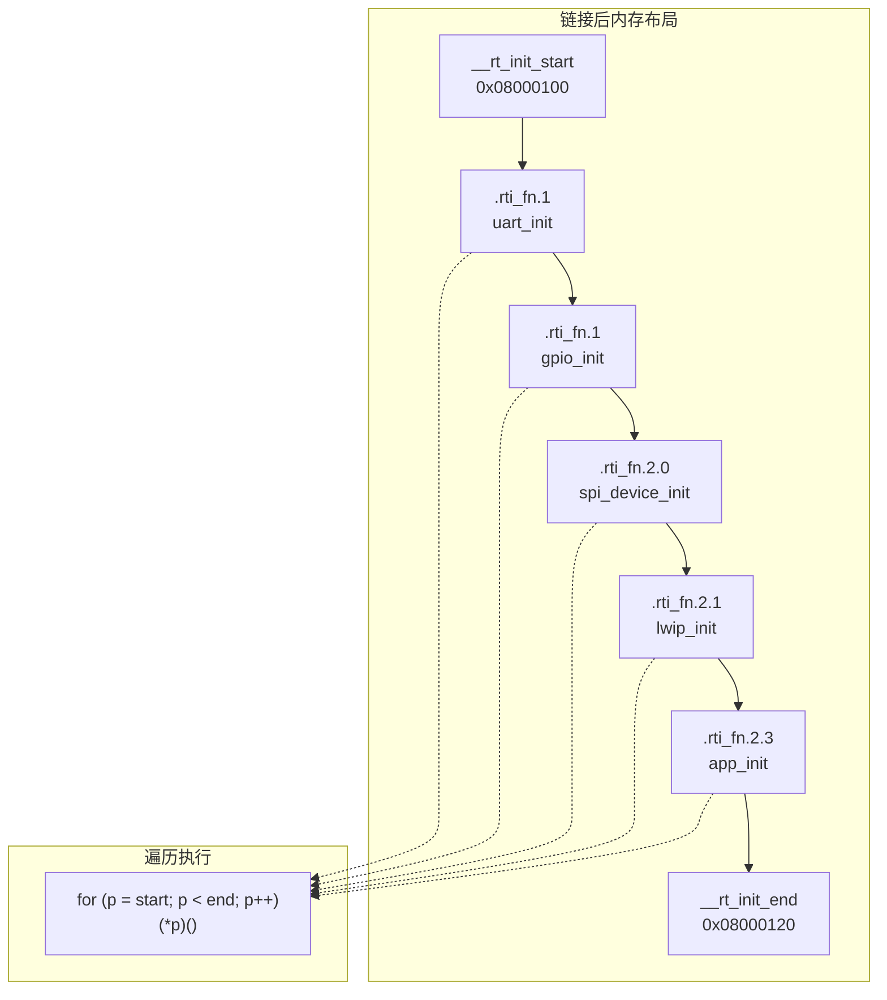

---

### 4.5 遍历执行代码

#### 核心遍历逻辑

```c
/* 函数指针类型定义 */
typedef void (*init_fn_t)(void);

/* 外部符号声明（由链接器脚本提供） */
extern const init_fn_t __rt_init_start;
extern const init_fn_t __rt_init_end;

/**
 * 遍历并执行所有初始化函数
 */
void rt_components_init(void)
{
    const init_fn_t *fn_ptr;
    
    /* 从起始地址遍历到结束地址 */
    for (fn_ptr = &__rt_init_start; 
         fn_ptr < &__rt_init_end; 
         fn_ptr++)
    {
        /* 调用初始化函数 */
        (*fn_ptr)();
    }
}
```

#### 执行流程图

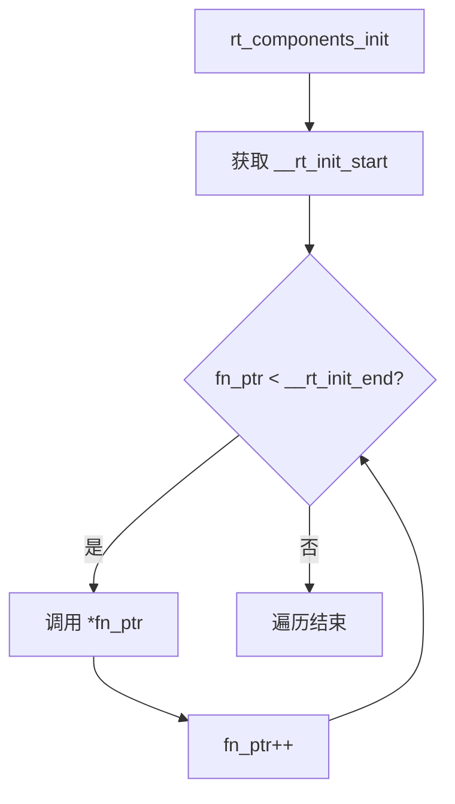

---

### 4.6 使用示例

#### 驱动文件中的使用

```c
/* uart.c */
static int rt_hw_uart_init(void)
{
    /* 配置 UART 硬件 */
    /* 注册 UART 设备 */
    return RT_EOK;
}
/* 使用 INIT_BOARD_EXPORT 在板级初始化时自动执行 */
INIT_BOARD_EXPORT(rt_hw_uart_init);

/* spi_flash.c */
static int rt_hw_spi_flash_init(void)
{
    /* 初始化 SPI Flash */
    /* 注册块设备 */
    return RT_EOK;
}
/* 使用 INIT_DEVICE_EXPORT 在组件初始化时自动执行 */
INIT_DEVICE_EXPORT(rt_hw_spi_flash_init);

/* app.c */
static int my_application_init(void)
{
    /* 创建应用线程 */
    rt_thread_create(...);
    return RT_EOK;
}
/* 使用 INIT_APP_EXPORT 在最后阶段执行 */
INIT_APP_EXPORT(my_application_init);
```

#### 初始化顺序验证

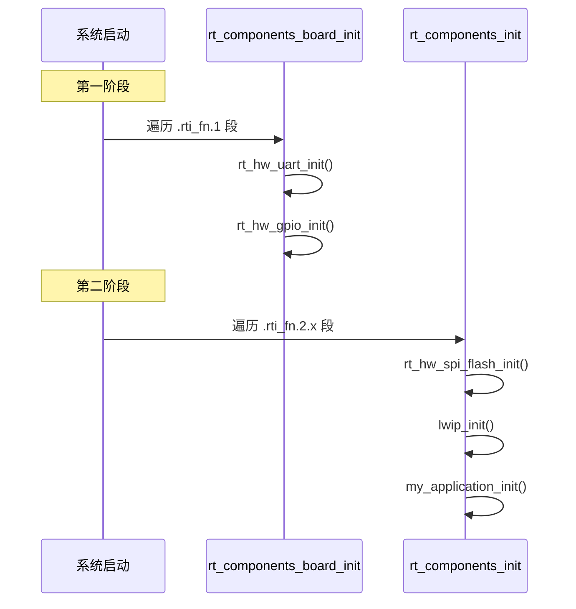

---

### 4.7 设计优势总结

| 特性 | 传统方式 | 自动初始化机制 |
|------|----------|----------------|
| 代码耦合 | 高（main 需知道所有初始化函数） | 低（各模块独立注册） |
| 可维护性 | 差（新增模块需修改 main） | 好（新增模块只需添加一行宏） |
| 初始化顺序 | 手动控制，易出错 | 自动排序，有保障 |
| 代码复用 | 差（不同项目 main 不同） | 好（模块可直接移植） |
| 调试难度 | 低（顺序明确） | 中（需理解链接器机制） |

#### 传统方式 vs 自动初始化对比

```c
/* ❌ 传统方式：main 函数臃肿，耦合严重 */
int main(void)
{
    uart_init();
    gpio_init();
    spi_init();
    i2c_init();
    timer_init();
    ethernet_init();
    file_system_init();
    network_init();
    application_init();
    /* ... 几十个初始化函数 ... */
    
    while (1) { /* 主循环 */ }
}

/* ✅ 自动初始化方式：main 函数简洁，解耦合 */
int main(void)
{
    /* 所有初始化已通过 INIT_*_EXPORT 自动完成 */
    while (1) { /* 主循环 */ }
}

/* 各驱动文件中独立注册 */
/* uart.c */  INIT_BOARD_EXPORT(uart_init);
/* gpio.c */  INIT_BOARD_EXPORT(gpio_init);
/* spi.c */   INIT_DEVICE_EXPORT(spi_init);
/* net.c */   INIT_COMPONENT_EXPORT(network_init);
/* app.c */   INIT_APP_EXPORT(application_init);
```


## 五、核心问题解答

### 5.1 多核编程

#### Q1：为什么多核要加入自旋锁？

##### 单核时代的幻觉（关中断就无敌了）

想象有一个房间（内存），里面有一本账本（OS 全局数据，比如就绪线程链表）。房间里只有一个人（单核 CPU）。如果这个人不想在记账时被打扰，他只需要**把门反锁（关中断）**，外面的人进不来，他就可以安心地修改账本。

##### 多核时代的危机（关中断失效）

现在房间里有两个人了（双核 CPU），大家共享这本账本。如果核心 A 想要改账本，它去把自己的门反锁了（关本地中断），但这**毫无意义**！因为核心 B 本来就在房间里，核心 B 依然可以同时伸手去撕这本账本，这就是灾难性的并发冲突。

##### 自旋锁的诞生与为何叫"自旋"

为了解决这个问题，我们在账本上加了一把唯一的物理锁（`_cpus_lock`）。

如果核心 A 拿到了锁，核心 B 也想记账，核心 B 发现锁被拿走了，它会怎么做？

它**绝对不能**去睡觉（不能使用信号量导致线程挂起），因为此时 OS 可能还没启动，而且上下文切换的代价太大了。所以，核心 B 只能像一个原地打转的陀螺一样，执行一个 `while(账本未解锁);` 死循环，不停地检查锁是否释放。这就是"自旋"——CPU 在空转等待。


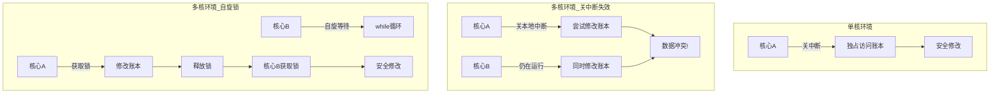


---

#### Q2：核间中断（IPI）是什么？为什么需要它？

[核间中断-IPI](../../嵌入式/操作系统与内核/02_多核与底层机制/核间中断-IPI.md)

---

### 5.2 调度器架构

#### Q3：调度器的就绪队列是如何架构的？

在 RT-Thread 的源码中（比如 `scheduler.c`），这个架构由两个极其关键的全局变量组成：

##### 变量一：位图

```c
rt_uint32_t rt_thread_ready_priority_group;
```

这是一个 32 位的无符号整数（对应 32 个优先级）。你可以把它看作一排 32 个开关。

- 如果优先级为 5 的链表里有线程准备好了，它的第 5 位就会被置为 `1`。
- 如果链表空了，就会被清零为 `0`。

##### 变量二：链表数组

```c
rt_list_t rt_thread_priority_table[32];
```

这是一个数组，数组的每一个元素都是一个双向链表的表头。

- `table[0]` 挂着所有优先级为 0 的线程。
- `table[5]` 挂着所有优先级为 5 的线程。
- 同一优先级下的线程排队站好（按时间片轮转）。

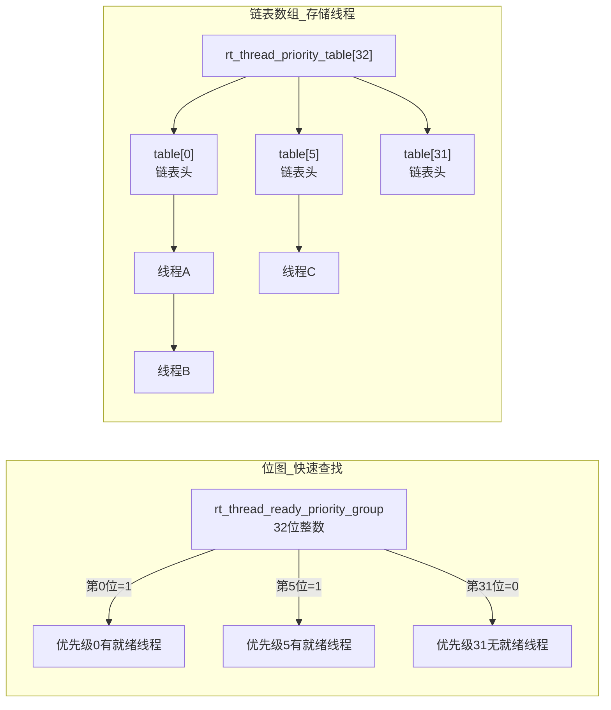

##### 调度算法流程

1. **查找最高优先级：** 使用 `__rt_ffs()`（Find First Set）函数，快速找到位图中最低位的 `1`，也就是最高优先级。
2. **取出线程：** 从对应的链表头部取出第一个线程。
3. **执行：** 切换到该线程运行。

---

### 5.3 空闲线程

#### Q4：`rt_thread_idle_init()` 为什么不可以让 CPU 空闲，在所有任务阻塞的状态？

CPU 在硬件物理层面上是"停不下来"的，它必须无时无刻不在执行指令；空闲线程就是当所有用户任务都去"睡觉"（进入阻塞态）时，派上来给 CPU 强行"兜底"的最后一个永远就绪的"替补队员"。

##### 如果没有空闲线程，系统会发生什么灾难？

**硬件的物理本能：**

CPU 的核心是一个叫 **PC（程序计数器，Program Counter）** 的寄存器。只要 CPU 有供电、有时钟晶振在跳动，PC 指针就会不断地 `+4`（在 32 位系统下），去内存里抓取下一条指令来执行。CPU 根本不懂什么是"空闲"，如果你不给它代码跑，它的 PC 指针就会漫无目的地乱跑，最后通常会导致访问非法内存，触发死机。

**调度器的硬性算法：**

RT-Thread 的调度器逻辑非常干脆：**"在就绪队列中，挑一个优先级最高的线程执行"**。如果所有用户线程都调用了 `rt_thread_delay()` 去睡眠了，就绪队列就空了。此时调度器会崩溃——它找不到任何可运行的线程，PC 指针就会跳到未知区域，系统直接崩溃。


---

### 5.4 控制台绑定

#### Q5：这是怎么实现的——告诉系统使用哪个串口作为主控制台？

RT-Thread 使用了**"名称绑定"**机制，通过在 `rt_hw_board_init` 中调用 `rt_console_set_device(RT_CONSOLE_DEVICE_NAME)`，系统在设备对象容器中按名字查找匹配的串口驱动，并将其挂载为系统的标准输入输出设备。

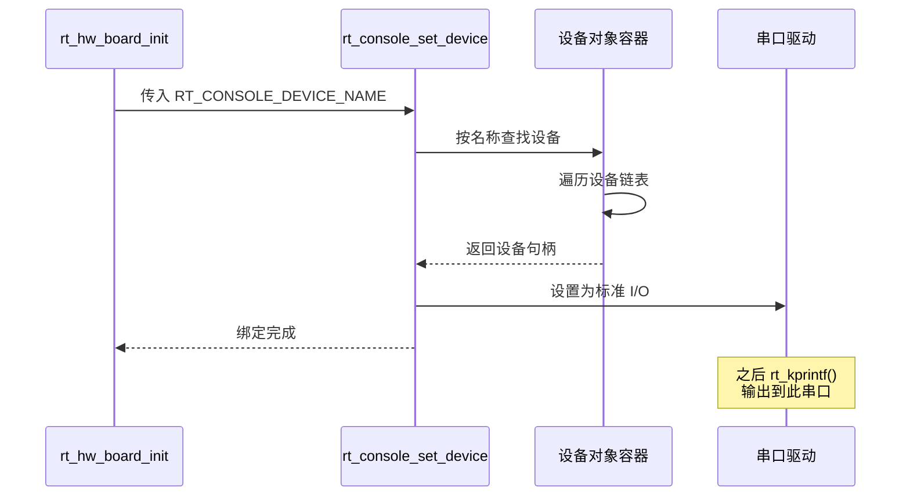

---

### 5.5 自动初始化机制

#### Q6：为什么要分段初始化？

| 特性 | `rt_components_board_init` | `rt_components_init` |
|------|----------------------------|----------------------|
| 执行时机 | 调度器启动前 | 调度器启动后 |
| 执行环境 | 裸机环境 | 多线程环境 |
| 可用功能 | 仅硬件操作 | 完整 OS 功能 |
| 可否阻塞 | **绝对不能** | 可以 |
| 可否使用 `rt_malloc` | 可能不行（堆可能未初始化） | 可以 |
| 可否使用 `rt_thread_delay` | **绝对不能** | 可以 |
| 典型用途 | 硬件驱动初始化 | 软件组件初始化 |

##### 核心原因

- `rt_components_board_init` 运行在内核接管前的**裸机环境**，此时不能用 `rt_thread_mdelay()`（因为没有调度器），甚至某些时候连 `rt_malloc` 都不能用（如果堆还没建好）。

- `rt_components_init` 被 `main_thread_entry` 调用，此时**调度器已经正常运行**，它身处一个真实的线程环境中。如果某个组件（比如以太网芯片）初始化需要耗时几百毫秒，它可以放心地调用 `rt_thread_mdelay()` 让出 CPU。

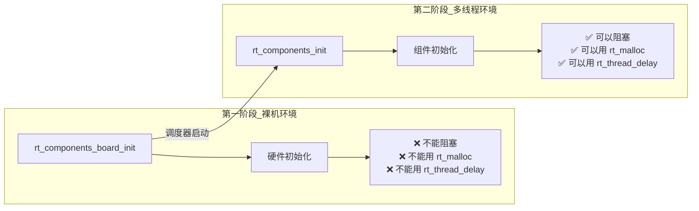

---

#### Q7：初始化函数指针指向的函数肯定是不一样的，怎么操作的？

> **问题：** 他这个初始化和板级好像，但是函数指针指向的函数肯定是不一样的啊，怎么操作的啊不懂，地址是连续的我知道。

##### 解答

关键在于**链接器脚本的排序机制**。虽然每个初始化函数的地址是不连续的（分散在 Flash 的各个位置），但**指向这些函数的函数指针变量**被链接器收集到了一个连续的内存段中。

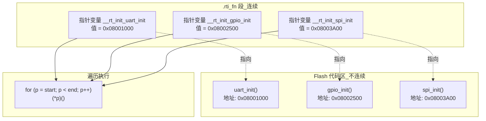

##### 代码示例

```c
/* 各驱动文件中定义的初始化函数（地址不连续） */
/* uart.c */
void uart_init(void) { /* ... */ }  /* 地址: 0x08001000 */

/* gpio.c */
void gpio_init(void) { /* ... */ }  /* 地址: 0x08002500 */

/* spi.c */
void spi_init(void) { /* ... */ }   /* 地址: 0x08003A00 */

/* 宏展开后生成的函数指针（地址连续） */
RT_USED const init_fn_t __rt_init_uart_init = uart_init;  /* .rti_fn 段 */
RT_USED const init_fn_t __rt_init_gpio_init = gpio_init;  /* .rti_fn 段 */
RT_USED const init_fn_t __rt_init_spi_init  = spi_init;   /* .rti_fn 段 */

/* 遍历时 */
for (fn_ptr = &__rt_init_start; fn_ptr < &__rt_init_end; fn_ptr++)
{
    (*fn_ptr)();  /* 依次调用 uart_init, gpio_init, spi_init */
}
```

# 第五部分：架构设计思考


## 六、架构设计思考

### 6.1 跨平台兼容性设计

这段代码是处理 C 语言跨平台/跨编译器差异的绝佳范本。通过 `#if defined(__ICCARM__) || defined(__GNUC__)` 这样的宏定义，同一套 C 源码可以无缝适配 Keil (ARMCC)、IAR (ICCARM) 和基于 GCC 的各种开发环境。

#### 编译器差异隔离

```c
/* 编译器适配示例 */
#if defined(__CC_ARM)                 /* Keil ARMCC */
    #define SECTION(x)    __attribute__((section(x)))
    #define RT_USED       __attribute__((used))
#elif defined(__ICCARM__)              /* IAR */
    #define SECTION(x)    @ x
    #define RT_USED       __root
#elif defined(__GNUC__)                /* GCC */
    #define SECTION(x)    __attribute__((section(x)))
    #define RT_USED       __attribute__((used))
#endif 
```

#### 设计启示

编写底层驱动或中间件时，这种隔离硬件和编译器差异的抽象能力是架构师的必备技能。

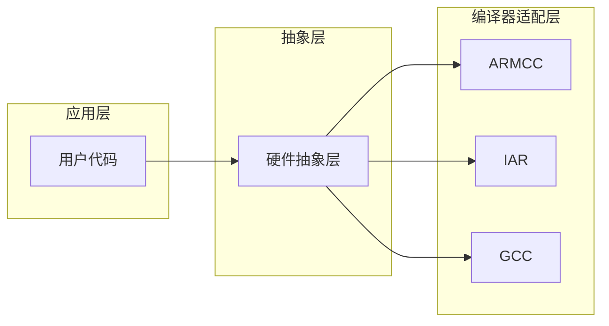

---

### 6.2 AOP（面向切面编程）的 C 语言实现

ARMCC 的 `$Super$$` 和 `$Sub$$` 机制，实际上就是在原本的执行流中间"切了一刀"，强行插入了 RTOS 的启动逻辑。这启发我们：在不破坏原有代码封装的前提下，通过链接器特性改变代码行为，是一种非常优雅的非侵入式设计。

#### $Super$$ / $Sub$$ 机制

```c
/*
 * $Super$$main  : 原始的 main 函数
 * $Sub$$main    : 编译器插入的"替身"函数
 * 
 * 链接器会：先调用 $Sub$$main，再由它决定是否调用 $Super$$main
 */

/* 原始用户的 main 函数 */
int main(void)
{
    /* 用户代码 */
    while (1);
}

/* RT-Thread 注入的启动代码 */
int $Sub$$main(void)
{
    /* 先执行 RTOS 启动 */
    rtthread_startup();
    
    /* 永不返回，用户的 main 由 RTOS 调度执行 */
    return 0;
}
```

#### 执行流对比

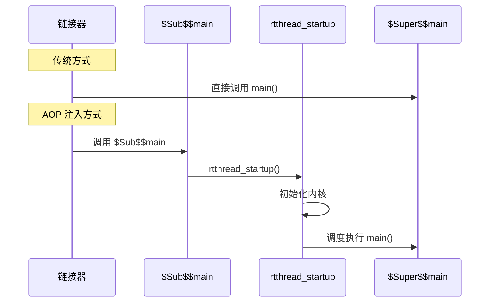

#### 设计启示

- **非侵入式：** 不需要修改用户的 `main()` 函数
- **透明性：** 用户代码无需感知 RTOS 的存在
- **可移植性：** 同一套机制可应用于不同平台

---

### 6.3 多核编程的思维转换

从单核开发过渡到多核开发，最大的改变就是必须具备"真·并发"意识。

#### 单核 vs 多核并发对比

| 特性 | 单核并发 | 多核并发 |
|------|----------|----------|
| 并发本质 | 时间片交替的伪并发 | 物理层面同一纳秒发生的真并发 |
| 关中断效果 | 完全保护临界区 | 仅保护当前核心，其他核心仍可访问 |
| 同步机制 | 关中断/信号量 | 自旋锁/原子操作 |
| 调试难度 | 较低 | 极高（时序难以复现） |

#### 思维转换图解

```mermaid
graph LR
    subgraph 单核思维
        A1[任务A] --> |时间片| A2[任务B]
        A2 --> |时间片| A1
        Note1[伪并发<br/>交替执行]
    end
    
    subgraph 多核思维
        B1[核心0: 任务A]
        B2[核心1: 任务B]
        B1 -.-> |同时执行| B2
        Note2[真并发<br/>物理并行]
    end
```

---

### 6.4 锁粒度与性能的无情博弈

自旋锁虽然强大，但它是一把"双刃剑"。因为它会让抢不到锁的 CPU 核心陷入死循环白白浪费算力，所以**自旋锁保护的代码块（临界区）必须极其短小、执行极快**，绝对不能在里面做延时或者打印操作。

这也是为什么优秀的 RTOS 架构师对内核代码的精简度有着近乎变态的追求。

#### 锁粒度设计原则

```mermaid
graph TD
    A[设计临界区] --> B{评估操作时间}
    B -->|< 1us| C[可以使用自旋锁]
    B -->|1us ~ 1ms| D[考虑使用互斥量]
    B -->|> 1ms| E[重新设计架构]
    
    C --> F{操作是否可能阻塞?}
    F -->|是| G[改用互斥量]
    F -->|否| H[✅ 自旋锁合适]
    
    D --> I{是否在中断上下文?}
    I -->|是| J[使用自旋锁<br/>但必须极快]
    I -->|否| K[使用互斥量]
```

#### 性能影响对比

| 锁类型 | 等待方式 | 上下文切换 | 适用场景 | CPU 开销 |
|--------|----------|------------|----------|----------|
| 自旋锁 | 忙等待（空转） | 无 | 极短临界区 | 高（等待时） |
| 互斥量 | 睡眠等待 | 有 | 较长临界区 | 低（等待时） |
| 信号量 | 睡眠等待 | 有 | 同步/资源计数 | 低（等待时） |

---

### 6.5 字符串作为系统级标识符

在资源受限的嵌入式系统中，使用字符串来注册和查找设备（`"uart1"`、`"i2c1"`、`"spi2"`）是一种非常经典且易于维护的设计模式。

#### 设计优势

1. **可读性强：** `rt_device_find("uart1")` 比 `rt_device_find(0x01)` 更直观
2. **解耦合：** 驱动层与应用层通过名称关联，而非硬编码地址
3. **可扩展：** 新增设备只需注册新名称，无需修改框架代码
4. **调试友好：** FinSH 命令可直接显示设备名称

#### 实现机制

```mermaid
sequenceDiagram
    participant App as 应用层
    participant Dev as 设备驱动
    participant Container as 对象容器
    
    Dev->>Container: rt_device_register("uart1")
    Container->>Container: 创建设备对象
    Container->>Container: 设置名称 "uart1"
    Container->>Container: 添加到设备链表
    
    App->>Container: rt_device_find("uart1")
    Container->>Container: 遍历设备链表
    Container->>Container: 名称匹配
    Container-->>App: 返回设备句柄
    
    App->>Dev: rt_device_open(device)
    Dev-->>App: 操作成功
```

#### 性能权衡

```c
/* 字符串比较的开销 */
rt_strncmp(object->name, name, RT_NAME_MAX)  /* 最多比较 8 字节 */

/* 对于嵌入式系统，这个开销是可接受的 */
/* 原因：设备查找通常只在初始化时进行，不在关键路径上 */
```

---

### 6.6 面向对象思想在 C 语言中的实现

RT-Thread 的对象系统是 C 语言实现面向对象编程的经典案例。

#### 核心技术手段

```c
/* 1. 结构体继承：将父结构体作为第一个成员 */
struct rt_object
{
    char name[RT_NAME_MAX];
    rt_uint8_t type;
    rt_uint8_t flag;
    rt_list_t list;
};

struct rt_thread
{
    struct rt_object parent;  /* 继承 rt_object */
    
    /* 线程特有成员 */
    void *sp;
    void *entry;
    void *parameter;
    /* ... */
};

/* 2. 多态：通过函数指针实现 */
struct rt_device
{
    struct rt_object parent;
    
    /* 虚函数表 */
    rt_err_t  (*init)   (rt_device_t dev);
    rt_err_t  (*open)   (rt_device_t dev, rt_uint16_t oflag);
    rt_err_t  (*close)  (rt_device_t dev);
    rt_size_t (*read)   (rt_device_t dev, rt_off_t pos, void *buffer, rt_size_t size);
    rt_size_t (*write)  (rt_device_t dev, rt_off_t pos, const void *buffer, rt_size_t size);
    /* ... */
};

/* 3. 类型识别：通过 type 字段实现 RTTI */
rt_object_t object = (rt_object_t)thread;
if (object->type == RT_Object_Class_Thread)
{
    /* 这是一个线程对象 */
}
```

#### 面向对象设计模式应用

```mermaid
classDiagram
    class rt_object {
        <<abstract>>
        +char name[RT_NAME_MAX]
        +rt_uint8_t type
        +rt_uint8_t flag
        +rt_list_t list
    }
    
    class rt_thread {
        +void *sp
        +void *entry
        +rt_thread_t thread_init()
        +rt_err_t thread_start()
    }
    
    class rt_device {
        <<abstract>>
        +rt_err_t (*init)()
        +rt_err_t (*open)()
        +rt_err_t (*close)()
        +rt_size_t (*read)()
        +rt_size_t (*write)()
    }
    
    class rt_serial_device {
        +struct rt_serial_ops *ops
        +rt_err_t init()
        +rt_size_t read()
    }
    
    class rt_spi_device {
        +struct rt_spi_ops *ops
        +rt_err_t init()
        +rt_size_t read()
    }
    
    rt_object <|-- rt_thread
    rt_object <|-- rt_device
    rt_device <|-- rt_serial_device
    rt_device <|-- rt_spi_device
```

---

### 6.7 可移植抽象的设计哲学

RT-Thread 通过统一的 `rtthread_startup` 主骨架和 `INIT_*_EXPORT` 分级初始化机制保持流程一致，再由各 BSP 的 `rt_hw_board_init` 实现硬件差异化。

#### 设计原则

```mermaid
graph TB
    subgraph 统一骨架_不变
        A[rtthread_startup]
        B[初始化顺序]
        C[自动初始化机制]
    end
    
    subgraph 硬件适配_可变
        D[STM32 BSP]
        E[ESP32 BSP]
        F[QEMU BSP]
    end
    
    A --> D
    A --> E
    A --> F
    
    B --> D
    B --> E
    B --> F
    
    C --> D
    C --> E
    C --> F
```

#### 不同板子的初始化差异

| 平台 | 时钟配置 | 内存布局 | 外设初始化 |
|------|----------|----------|------------|
| STM32 | HAL 库配置 | SRAM 起始地址 | GPIO/UART/SPI |
| ESP32 | ESP-IDF 配置 | DRAM 区域 | WiFi/BLE |
| QEMU | 模拟时钟 | 虚拟内存 | 虚拟设备 |

---

## 七、总结

### 7.1 核心知识点速查表

| 主题 | 核心要点 |
|------|----------|
| 启动流程 | 三阶段：裸机初始化 → 内核初始化 → 调度器接管 |
| 自动初始化 | `INIT_*_EXPORT` 宏 + 链接器脚本，按优先级自动执行 |
| 两阶段初始化 | 板级（裸机环境）vs 组件（多线程环境） |
| 多核同步 | 自旋锁保护极短临界区，禁止阻塞操作 |
| 核间中断 | IPI 实现微秒级任务抢占，保证硬实时性 |
| 空闲线程 | CPU 兜底，资源回收，不可删除 |
| 调度器架构 | 位图 + 链表数组，O(1) 时间复杂度 |

### 7.2 学习路径建议

```mermaid
graph LR
    A[启动流程<br/>rtthread_startup] --> B[自动初始化<br/>INIT_*_EXPORT]
    B --> C[调度器<br/>scheduler.c]
    C --> D[对象系统<br/>object.c]
    D --> E[进程间通信<br/>ipc.c]
    E --> F[设备驱动框架]
    F --> G[组件与中间件]
```

### 7.3 关键函数速查

| 函数名 | 作用 | 执行阶段 |
|--------|------|----------|
| `rtthread_startup` | 总入口，启动枢纽 | 第一阶段 |
| `rt_hw_board_init` | 板级硬件初始化 | 第一阶段 |
| `rt_components_board_init` | 板级自动初始化 | 第一阶段 |
| `rt_system_scheduler_start` | 启动调度器 | 第一阶段末 |
| `main_thread_entry` | main 线程入口 | 第二阶段 |
| `rt_components_init` | 组件自动初始化 | 第二阶段 |

---

> **文档信息**
> - 整理日期：2026-04-16
> - 基于 RT-Thread 源码学习笔记
> - 涵盖启动流程、自动初始化机制、多核编程等核心主题
