# 3. 深化启动的理解 + 理解对象系统

## 一、运算符差异速查

| 功能 | C/C++ | Python | 说明 |
|------|-------|--------|------|
| 整除 | `a / b`（整数相除得整数） | `a // b` | Python 的 `/` 总是浮点除 |
| 取余 | `a % b` | `a % b` | 一样 |
| 幂运算 | `pow(a, b)` | `a ** b` | Python 原生支持 |
| 自增 | `i++ / ++i` | `i += 1` | Python 没有 `++` |
| 逻辑与 | `&&` | `and` | |
| 逻辑或 | `\|\|` | `or` | |
| 逻辑非 | `!x` | `not x` | |
| 位运算 | `& \| ^ ~ << >>` | `& \| ^ ~ << >>` | 完全一样 |
| 三元表达式 | `cond ? a : b` | `a if cond else b` | 顺序反了 |

---

## 二、学习心得与要点速记

### 2.1 启动流程与初始化

- **面向切面编程 AOP 的 C 语言变体**挺有意思的设定，以后这种要自己写，试一试，先了解一下。
- 思考 OS 的初始化流程，非板级的，以后可以细化这个流程，并且去认知他们。
- 实话实说，今天的内容要和昨天的一起理解会更加的深刻。
- 不同板子的初始化是不一样的，我认为现在只要关注一个 QEMU 和 ESP32 和 STM32。
- **可移植抽象的结论和操作是什么：** "RT-Thread 通过统一的 `rtthread_startup` 主骨架和 `INIT_*_EXPORT` 分级初始化机制保持流程一致，再由各 BSP 的 `rt_hw_board_init` 实现硬件差异化。"

### 2.2 内存管理铁律

- 只要看到函数名是 **`_init`**，它处理的一定是**静态内存**，用完后需要调用 **`_detach`** 来脱离。
- 只要看到函数名是 **`_create`**，它处理的一定是**动态内存**，用完后需要调用 **`_delete`** 来释放。
- 搞懂这个对应关系，以后写底层代码就不会发生内存泄漏或 HardFault 了！

### 2.3 代码哲学

- **字符串作为系统级标识符：** 在资源受限的嵌入式系统中，使用字符串来注册和查找设备（`"uart1"`、`"i2c1"`、`"spi2"`）是一种非常经典且易于维护的设计模式。它使得系统的硬件资源变得像文件系统里的文件一样清晰可查，这也是后续 FinSH 命令行中输入 `list_device()` 能够列出所有硬件的基础。

### 2.4 多核编程思维转换

- **多核编程的思维转换：** 从单核开发过渡到多核开发，最大的改变就是必须具备"真·并发"意识。单核并发其实是时间片交替的伪并发；而多核并发是物理层面在同一纳秒发生的真并发。
- **锁粒度与性能的无情博弈：** 自旋锁虽然强大，但它是一把"双刃剑"。因为它会让抢不到锁的 CPU 核心陷入死循环白白浪费算力，所以**自旋锁保护的代码块（临界区）必须极其短小、执行极快**，绝对不能在里面做延时或者打印操作。这也是为什么优秀的 RTOS 架构师对内核代码的精简度有着近乎变态的追求。


# 第二部分：启动流程深度解析

---


## 三、启动流程深度解析

### 3.1 多核自旋锁原理

> **问题：为什么多核要加入自旋锁？**

#### 单核时代的幻觉（关中断就无敌了）

想象有一个房间（内存），里面有一本账本（OS 全局数据，比如就绪线程链表）。房间里只有一个人（单核 CPU）。如果这个人不想在记账时被打扰，他只需要**把门反锁（关中断）**，外面的人进不来，他就可以安心地修改账本。

#### 多核时代的危机（关中断失效）

现在房间里有两个人了（双核 CPU），大家共享这本账本。如果核心 A 想要改账本，它去把自己的门反锁了（关本地中断），但这**毫无意义**！因为核心 B 本来就在房间里，核心 B 依然可以同时伸手去撕这本账本，这就是灾难性的并发冲突。

#### 自旋锁的诞生与为何叫"自旋"

为了解决这个问题，我们在账本上加了一把唯一的物理锁（`_cpus_lock`）。

如果核心 A 拿到了锁，核心 B 也想记账，核心 B 发现锁被拿走了，它会怎么做？

它**绝对不能**去睡觉（不能使用信号量导致线程挂起），因为此时 OS 可能还没启动，而且上下文切换的代价太大了。所以，核心 B 只能像一个原地打转的陀螺一样，执行一个 `while(账本未解锁);` 死循环，不停地检查锁是否释放。这就是"自旋"——CPU 在空转等待。

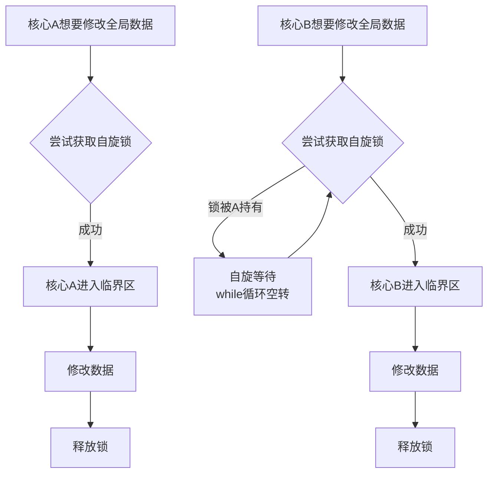
```mermaid
graph TD
    A[核心A想要修改全局数据] --> B{尝试获取自旋锁}
    B -->|成功| C[核心A进入临界区]
    C --> D[修改数据]
    D --> E[释放锁]
    
    F[核心B想要修改全局数据] --> G{尝试获取自旋锁}
    G -->|锁被A持有| H[自旋等待<br/>while循环空转]
    H --> G
    G -->|成功| I[核心B进入临界区]
    I --> J[修改数据]
    J --> K[释放锁]
```

---

### 3.2 空闲线程的使命

> **问题：`rt_thread_idle_init()` 为什么不可以让 CPU 空闲，在所有任务阻塞的状态？**

CPU 在硬件物理层面上是"停不下来"的，它必须无时无刻不在执行指令；空闲线程（Idle Thread）就是当所有用户任务都去"睡觉"（进入阻塞态）时，派上来给 CPU 强行"兜底"的最后一个永远就绪的"替补队员"。

既然你提到了"所有任务阻塞的状态"，我们来看看如果**没有**空闲线程，系统会发生什么灾难：

#### 硬件的物理本能

CPU 的核心是一个叫 **PC（程序计数器，Program Counter）** 的寄存器。只要 CPU 有供电、有时钟晶振在跳动，PC 指针就会不断地 `+4`（在 32 位系统下），去内存里抓取下一条指令来执行。CPU 根本不懂什么是"空闲"，如果你不给它代码跑，它的 PC 指针就会漫无目的地乱跑，最后通常会导致访问非法内存，触发死机（HardFault）。

#### 调度器的硬性算法

RT-Thread 的调度器逻辑非常干脆：**"在就绪队列中，挑一个优先级最高的线程执行"**。如果所有用户线程都调用了 `rt_thread_delay()` 去睡眠了，就绪队列就空了。此时调度器会崩溃——它找不到任何可运行的线程，PC 指针就会跳到未知区域，系统直接崩溃。

所以，空闲线程的存在就是为了保证：**无论何时，就绪队列里至少有一个线程可以运行**。它的优先级被设为最低（通常是 31 或 255，取决于配置），这样当有任何用户线程就绪时，它会立刻被抢占。

---

### 3.3 调度器就绪队列架构

> **问题：调度器的就绪队列（通常是一个多级指针数组，对应不同的优先级）是如何架构的？**

在 RT-Thread 的源码中（比如 `scheduler.c`），这个架构由两个极其关键的全局变量组成：

#### 变量一：位图 `rt_thread_ready_priority_group`

```c
rt_uint32_t rt_thread_ready_priority_group;
```

这是一个 32 位的无符号整数（对应 32 个优先级）。你可以把它看作一排 32 个开关。

- 如果优先级为 5 的链表里有线程准备好了，它的第 5 位就会被置为 `1`。
- 如果链表空了，就会被清零为 `0`。

#### 变量二：链表数组 `rt_thread_priority_table[32]`

```c
rt_list_t rt_thread_priority_table[32];
```

这是一个数组，数组的每一个元素都是一个双向链表的表头。

- `table[0]` 挂着所有优先级为 0 的线程。
- `table[5]` 挂着所有优先级为 5 的线程。
- 同一优先级下的线程排队站好（按时间片轮转）。

#### 架构示意图

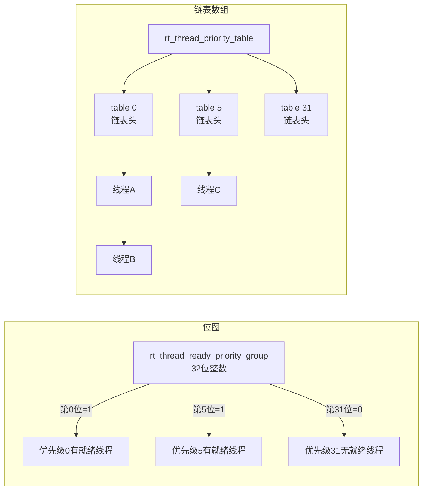
```mermaid
graph LR
    subgraph 位图
        BIT[rt_thread_ready_priority_group<br/>32位整数]
        BIT --> |第0位=1| P0[优先级0有就绪线程]
        BIT --> |第5位=1| P5[优先级5有就绪线程]
        BIT --> |第31位=0| P31[优先级31无就绪线程]
    end
    
    subgraph 链表数组
        ARR[rt_thread_priority_table]
        ARR --> T0[table 0<br/>链表头]
        ARR --> T5[table 5<br/>链表头]
        ARR --> T31[table 31<br/>链表头]
        
        T0 --> TH1[线程A]
        TH1 --> TH2[线程B]
        
        T5 --> TH3[线程C]
    end
```

#### 调度算法流程

1. **查找最高优先级：** 使用 `__rt_ffs()`（Find First Set）函数，快速找到位图中最低位的 `1`，也就是最高优先级。
2. **取出线程：** 从对应的链表头部取出第一个线程。
3. **执行：** 切换到该线程运行。

---

### 3.4 控制台绑定机制

> **问题：这是怎么实现的——告诉系统使用哪个串口作为主控制台？**

RT-Thread 使用了**"名称绑定（Name Binding）"**机制，通过在 `rt_hw_board_init` 中调用 `rt_console_set_device(RT_CONSOLE_DEVICE_NAME)`，系统在设备对象容器中按名字查找匹配的串口驱动，并将其挂载为系统的标准输入输出设备。

#### 工作流程

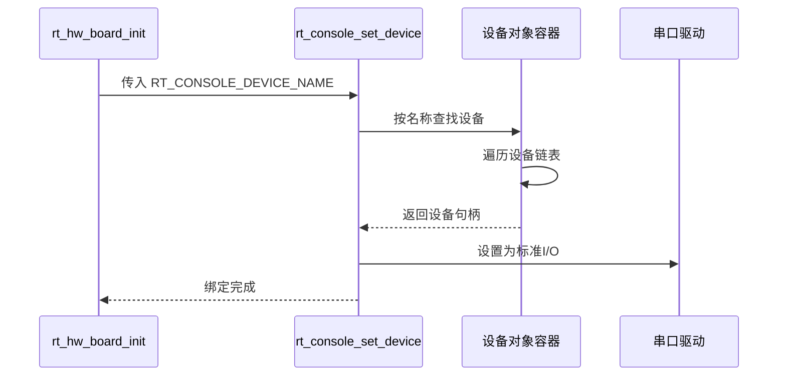
```mermaid
sequenceDiagram
    participant Init as rt_hw_board_init
    participant Console as rt_console_set_device
    participant Container as 设备对象容器
    participant Driver as 串口驱动
    
    Init->>Console: 传入 RT_CONSOLE_DEVICE_NAME
    Console->>Container: 按名称查找设备
    Container->>Container: 遍历设备链表
    Container-->>Console: 返回设备句柄
    Console->>Driver: 设置为标准I/O
    Console-->>Init: 绑定完成
```

---

### 3.5 核间中断（IPI）

> **问题：核间中断——跨核心指挥从核执行任务调度，不懂？**

核间中断（IPI，Inter-Processor Interrupt）是多核处理器提供的一种纯硬件通信机制；在 RT-Thread 中，它的核心作用是打破核心之间的物理屏障，允许一个 CPU 核心强行打断另一个 CPU 核心的执行流，强制它立刻进行上下文切换（任务调度）。

#### 为什么要用 IPI？为什么 Core 1 不能自己去发现新任务？

如果不用 IPI，Core 1 只有等到它的"滴答定时器"也就是时间片耗尽时，才会去检查就绪队列。假设 Tick 是 1 毫秒，那么这个最高优先级的急停任务最多可能要等 1 毫秒才会被 Core 1 执行。在实时操作系统中，1 毫秒的延迟足以让电机撞毁机器。

**IPI 的存在，就是为了保证"最高优先级任务被唤醒后，能在微秒级时间内立刻抢占任何核心的 CPU"，这捍卫了 RTOS 绝对的"硬实时性"。**

#### 典型场景

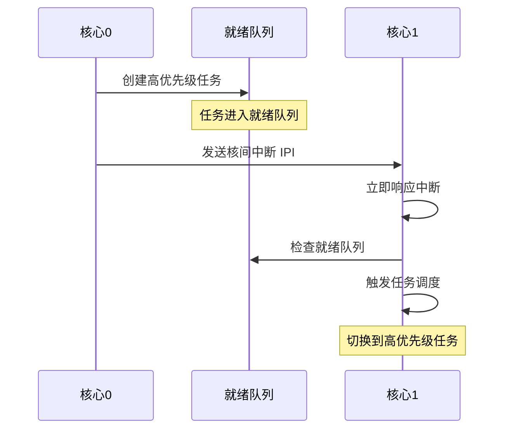
```mermaid
sequenceDiagram
    participant Core0 as 核心0
    participant ReadyQ as 就绪队列
    participant Core1 as 核心1
    
    Core0->>ReadyQ: 创建高优先级任务
    Note over ReadyQ: 任务进入就绪队列
    Core0->>Core1: 发送核间中断 IPI
    Core1->>Core1: 立即响应中断
    Core1->>ReadyQ: 检查就绪队列
    Core1->>Core1: 触发任务调度
    Note over Core1: 切换到高优先级任务
```

---

### 3.6 基于链接器的自动注册机制

> **问题："基于链接器的自动注册机制"（或者叫面向切面编程 AOP 的 C 语言变体），这个要研究一下？**

自动注册机制通过**特殊的 C 语言宏定义和链接器脚本的配合**，将分散在各个源码文件中的初始化函数指针，在编译时自动收集并按优先级紧凑地排列到一段特定的内存段中。系统启动时只需遍历这段内存即可完成所有模块的初始化，彻底解除了 `main()` 函数与底层驱动之间的强耦合。

#### 三大关键角色

要实现这个魔法，需要三个关键角色的配合：宏定义、链接器脚本、和遍历执行代码。

#### 角色一：宏定义

在 RT-Thread 源码（`rtdef.h`）中，你会看到类似这样的宏：

```c
#define INIT_EXPORT(fn, level) \
    RT_USED const init_fn_t __rt_init_##fn SECTION(".rti_fn." level) = fn
```

当你写下 `INIT_BOARD_EXPORT(uart_init);` 时，宏展开后实际上是定义了一个**常量函数指针**，并且用 `SECTION` 属性把它强制放到了一个特殊的内存段中。

#### 角色二：链接器脚本

链接器脚本（`.ld` 文件）会把这些分散的函数指针收集到一起：

```ld
.rti_fn :
{
    . = ALIGN(4);
    __rt_init_start = .;
    KEEP(*(SORT(.rti_fn*)))
    __rt_init_end = .;
} > CODE
```

#### 角色三：遍历执行代码

系统启动时，只需要一个简单的循环：

```c
void rt_components_board_init(void)
{
    const init_fn_t *fn_ptr;
    
    for (fn_ptr = &__rt_init_start; fn_ptr < &__rt_init_end; fn_ptr++)
    {
        (*fn_ptr)();  // 依次调用每个初始化函数
    }
}
```

#### 内存布局示意图

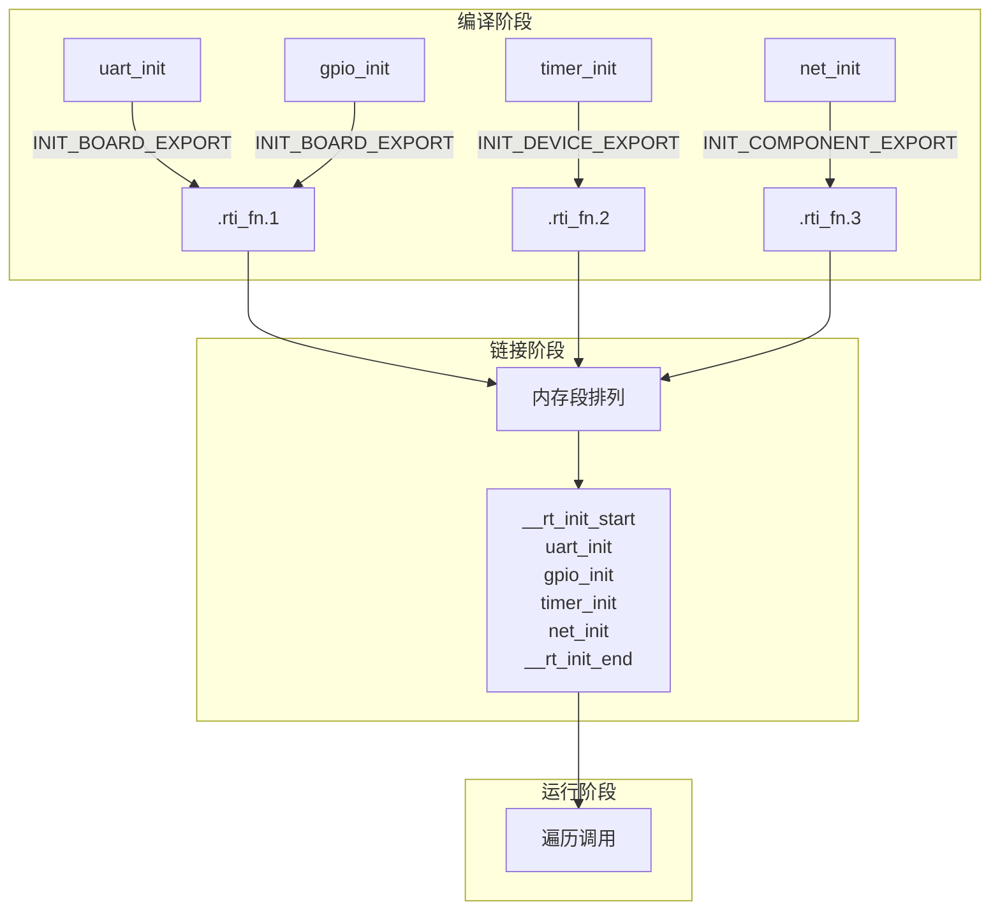
```mermaid
graph TD
    subgraph 编译阶段
        A[uart_init] --> |INIT_BOARD_EXPORT| SEG1[.rti_fn.1]
        B[gpio_init] --> |INIT_BOARD_EXPORT| SEG1
        C[timer_init] --> |INIT_DEVICE_EXPORT| SEG2[.rti_fn.2]
        D[net_init] --> |INIT_COMPONENT_EXPORT| SEG3[.rti_fn.3]
    end
    
    subgraph 链接阶段
        SEG1 --> ARR[内存段排列]
        SEG2 --> ARR
        SEG3 --> ARR
        ARR --> FINAL["__rt_init_start<br/>uart_init<br/>gpio_init<br/>timer_init<br/>net_init<br/>__rt_init_end"]
    end
    
    subgraph 运行阶段
        FINAL --> LOOP[遍历调用]
    end
```

---

### 3.7 INIT_*_EXPORT 自动初始化详解

**完全正确！你的直觉非常敏锐！** 这段代码正是 RT-Thread 自动初始化机制的**"优先级法则表"**。它通过为不同的宏赋予不同的字符串标号（如 "1"、"2"、"3"），精准地定义了系统中成百上千个底层外设和软件组件的**绝对启动顺序**。

#### 逐层代码剖析

这段代码的核心逻辑在于它把 `INIT_EXPORT` 的第二个参数（优先级层级）**硬编码成了字符串**。我们来看看它是怎么排兵布阵的：

##### 第一阶段：板级初始化（纯裸机环境，调度器未启动）

所有的宏都映射到 `"1"` 以及 `"1.x"` 的区间。

- `INIT_CORE_EXPORT("1.0")`：最先执行。唤醒 CPU 核心、内存堆、中断控制器。
- `INIT_SUBSYS_EXPORT("1.1")`：随后执行。配置系统时钟、引脚复用等。

之前我们读的 `rt_components_board_init()` 函数，就是专门负责遍历执行这个阶段的。

##### 第二阶段：内核初始化（调度器已启动）

所有的宏映射到 `"2"` 以及 `"2.x"` 的区间。

- `INIT_DEVICE_EXPORT("2.0")`：注册设备驱动框架。
- `INIT_COMPONENT_EXPORT("2.1")`：初始化软件组件（如文件系统、网络协议栈）。
- `INIT_ENV_EXPORT("2.2")`：环境变量、工作目录设置。
- `INIT_APP_EXPORT("2.3")`：最后执行。用户应用程序入口。

#### 优先级排序示意图

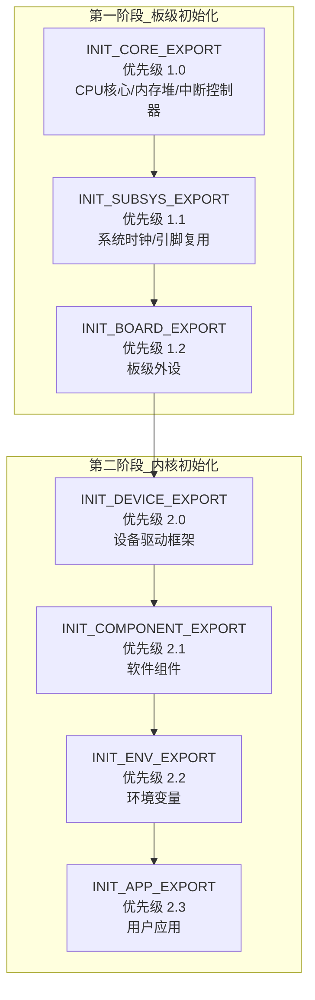
```mermaid
graph TD
    subgraph 第一阶段_板级初始化
        A1["INIT_CORE_EXPORT<br/>优先级 1.0<br/>CPU核心/内存堆/中断控制器"]
        A2["INIT_SUBSYS_EXPORT<br/>优先级 1.1<br/>系统时钟/引脚复用"]
        A3["INIT_BOARD_EXPORT<br/>优先级 1.2<br/>板级外设"]
    end
    
    subgraph 第二阶段_内核初始化
        B1["INIT_DEVICE_EXPORT<br/>优先级 2.0<br/>设备驱动框架"]
        B2["INIT_COMPONENT_EXPORT<br/>优先级 2.1<br/>软件组件"]
        B3["INIT_ENV_EXPORT<br/>优先级 2.2<br/>环境变量"]
        B4["INIT_APP_EXPORT<br/>优先级 2.3<br/>用户应用"]
    end
    
    A1 --> A2 --> A3 --> B1 --> B2 --> B3 --> B4
```

---

### 3.8 STM32 与 QEMU 初始化对比

这段 `rt_hw_board_init` 函数是针对 STM32 平台（以及 QEMU 模拟器）量身定制的**单板底层初始化入口**。它的核心作用是在内核正式运行前，把 CPU 时钟跑起来、配置好基础内存堆、点亮串口（为了后续打印日志），并完成系统的基础软硬件衔接。

#### 逐层代码剖析

这段代码使用了大量的条件编译（`#ifdef`），体现了 RT-Thread 极强的可配置性：

##### Step 1: 缓存配置

```c
SCB_EnableICache();
SCB_EnableDCache();
```

这通常出现在高级一点的 Cortex-M 芯片（如 M7/M33 架构或带 Cache 的 M4/M3 变种芯片，或者 QEMU 模拟的高性能处理器配置）上。开启指令 Cache (I-Cache) 和数据 Cache (D-Cache) 可以极大提升 CPU 的执行速度。

##### Step 2: 裸机硬件底层初始化

```c
HAL_Init();
SystemClock_Config();
```

调用 STM32 HAL 库的标准初始化函数，配置 Flash 延迟、中断向量表等，然后设置系统主频。

##### Step 3: 内存堆初始化

```c
rt_system_heap_init((void *)HEAP_BEGIN, (void *)HEAP_END);
```

这是 RT-Thread 内存管理的起点。它告诉内核：从 `HEAP_BEGIN` 到 `HEAP_END` 这段连续内存区域，可以用来动态分配（`rt_malloc`）。

##### Step 4: 板级自动初始化

```c
rt_components_board_init();
```

这是自动初始化机制的入口！它会遍历所有用 `INIT_BOARD_EXPORT()` 注册的函数，依次执行。

##### Step 5: 控制台绑定

```c
rt_console_set_device(RT_CONSOLE_DEVICE_NAME);
```

将指定的串口设备绑定为系统控制台，之后 `rt_kprintf()` 的输出就会从这个串口打印出来。

#### 初始化流程对比


```mermaid
graph TD
    subgraph STM32初始化流程
        S1[SCB_EnableICache/DCache] --> S2[HAL_Init]
        S2 --> S3[SystemClock_Config]
        S3 --> S4[rt_system_heap_init]
        S4 --> S5[rt_components_board_init]
        S5 --> S6[rt_console_set_device]
    end
    
    subgraph QEMU初始化流程
        Q1[可选: Cache配置] --> Q2[平台初始化]
        Q2 --> Q3[时钟配置]
        Q3 --> Q4[rt_system_heap_init]
        Q4 --> Q5[rt_components_board_init]
        Q5 --> Q6[rt_console_set_device]
    end
```


# 第三部分：对象系统源码剖析

---

```markdown
---

## 四、对象系统源码剖析

### 4.1 对象系统总览

#### 一句话总结

`object.c` 是整个 RT-Thread 操作系统底层资源的**"万物之源与户籍管理中心"**。它通过一套统一的面向对象框架，将系统中所有散落的线程、信号量、互斥量、定时器等资源，进行了高度抽象化、结构化的全生命周期管理（创建、销毁、查找、追踪）。

#### 宏观设计理念

从宏观来看，`object.c` 解决的是**"规模化管理"**的问题。随着系统日益庞大，管理几十种、成百上千个内核对象，不能靠散乱的全局变量，而需要一套高度自治的架构。

**宏观设计：对象分类与大数组**

架构师设计了一个名为 `_object_container` 的静态大数组（也就是我们比喻的"中药柜"）。每一种对象类型（Thread, Semaphore 等）在这个数组中占据一个"抽屉"。

#### 对象类型枚举定义

```c
/*
 * kernel object interface
 */
struct rt_object_information
{
    enum rt_object_class_type type;                     /* 对象类型 */
    rt_list_t                 object_list;              /* 对象链表头 */
    rt_size_t                 object_size;              /* 对象结构体大小 */
};

/**
 * 对象类型枚举定义
 * 每种内核对象都有对应的类型标识
 */
enum rt_object_class_type
{
    RT_Object_Class_Null          = 0,    /* 无效/未使用 */
    RT_Object_Class_Thread,               /* 线程对象 */
    RT_Object_Class_Semaphore,            /* 信号量对象 */
    RT_Object_Class_Mutex,                /* 互斥量对象 */
    RT_Object_Class_Event,                /* 事件对象 */
    RT_Object_Class_MailBox,              /* 邮箱对象 */
    RT_Object_Class_MessageQueue,         /* 消息队列对象 */
    RT_Object_Class_MemHeap,              /* 内存堆对象 */
    RT_Object_Class_MemPool,              /* 内存池对象 */
    RT_Object_Class_Device,               /* 设备对象 */
    RT_Object_Class_Timer,                /* 定时器对象 */
    RT_Object_Class_Module,               /* 模块对象 */
    RT_Object_Class_Unknown,              /* 未知对象 */
    RT_Object_Class_Static = 0x80         /* 静态对象标志位 */
};
```

#### 对象系统架构图

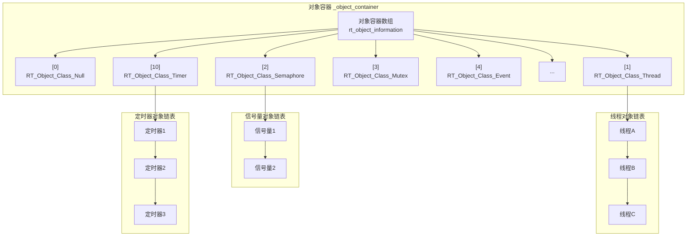
```mermaid
graph TD
    subgraph 对象容器 _object_container
        CONT[对象容器数组<br/>rt_object_information]
        
        CONT --> T0["[0]<br/>RT_Object_Class_Null"]
        CONT --> T1["[1]<br/>RT_Object_Class_Thread"]
        CONT --> T2["[2]<br/>RT_Object_Class_Semaphore"]
        CONT --> T3["[3]<br/>RT_Object_Class_Mutex"]
        CONT --> T4["[4]<br/>RT_Object_Class_Event"]
        CONT --> T5["..."]
        CONT --> T6["[10]<br/>RT_Object_Class_Timer"]
    end
    
    subgraph 线程对象链表
        T1 --> TH1[线程A]
        TH1 --> TH2[线程B]
        TH2 --> TH3[线程C]
    end
    
    subgraph 信号量对象链表
        T2 --> SEM1[信号量1]
        SEM1 --> SEM2[信号量2]
    end
    
    subgraph 定时器对象链表
        T6 --> TIM1[定时器1]
        TIM1 --> TIM2[定时器2]
        TIM2 --> TIM3[定时器3]
    end
```

---

### 4.2 对象容器初始化

#### 核心代码剖析

这段代码定义了 RT-Thread 的**"内核对象管理注册表"**。它在内存中静态创建了一个大数组，用来分门别类地记录和管理系统中所有的内核对象（如线程、信号量、互斥量等），是 RTOS 统一管理底层资源的基石。

##### 宏定义解析

```c
#define _OBJ_CONTAINER_LIST_INIT(c)     \
    {&(_object_container[c].object_list), &(_object_container[c].object_list)}
```

这个宏看起来非常诡异，但它的作用非常简单：**初始化一个双向链表头**。

让我们拆解一下：

1. `_object_container[c]`：访问对象容器数组的第 `c` 个元素。
2. `.object_list`：访问该元素的 `object_list` 成员（这是一个 `rt_list_t` 类型）。
3. `&(xxx)`：取这个成员的地址。
4. `{ptr1, ptr2}`：这是 C 语言的结构体初始化语法，用两个指针初始化一个结构体。

##### 为什么是两个相同的指针？

因为 `rt_list_t` 是一个双向链表节点，定义如下：

```c
struct rt_list_node
{
    struct rt_list_node *next;    /* 指向下一个节点 */
    struct rt_list_node *prev;    /* 指向前一个节点 */
};
typedef struct rt_list_node rt_list_t;
```

当一个链表为空时，它的 `next` 和 `prev` 都应该指向自己！这就是"空链表"的标准初始化方式。

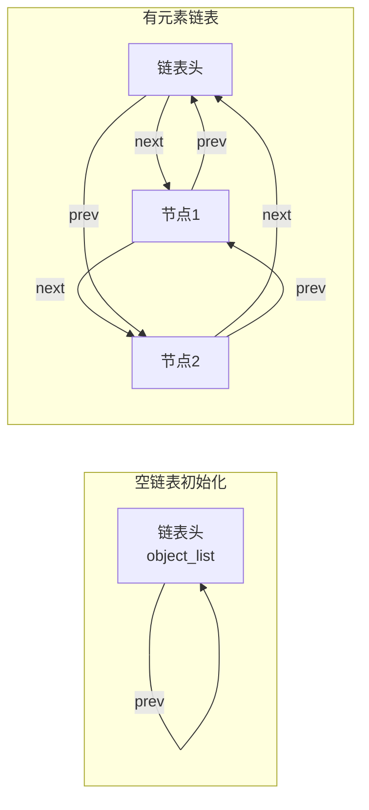
```mermaid
graph LR
    subgraph 空链表初始化
        HEAD[链表头<br/>object_list]
        HEAD --> |next| HEAD
        HEAD --> |prev| HEAD
    end
    
    subgraph 有元素链表
        HEAD2[链表头]
        NODE1[节点1]
        NODE2[节点2]
        
        HEAD2 --> |next| NODE1
        NODE1 --> |next| NODE2
        NODE2 --> |next| HEAD2
        
        HEAD2 --> |prev| NODE2
        NODE2 --> |prev| NODE1
        NODE1 --> |prev| HEAD2
    end
```

##### 静态数组初始化

```c
/*
 * 对象容器静态数组定义
 * 每个元素对应一种对象类型
 */
static struct rt_object_information _object_container[] =
{
    /* 初始化对象类型为 Null，链表为空，对象大小为 0 */
    {RT_Object_Class_Null, _OBJ_CONTAINER_LIST_INIT(0), sizeof(struct rt_object)},
    
    /* 初始化线程对象容器 */
    {RT_Object_Class_Thread, _OBJ_CONTAINER_LIST_INIT(1), sizeof(struct rt_thread)},
    
    /* 初始化信号量对象容器 */
    {RT_Object_Class_Semaphore, _OBJ_CONTAINER_LIST_INIT(2), sizeof(struct rt_semaphore)},
    
    /* 初始化互斥量对象容器 */
    {RT_Object_Class_Mutex, _OBJ_CONTAINER_LIST_INIT(3), sizeof(struct rt_mutex)},
    
    /* 初始化事件对象容器 */
    {RT_Object_Class_Event, _OBJ_CONTAINER_LIST_INIT(4), sizeof(struct rt_event)},
    
    /* 初始化邮箱对象容器 */
    {RT_Object_Class_MailBox, _OBJ_CONTAINER_LIST_INIT(5), sizeof(struct rt_mailbox)},
    
    /* 初始化消息队列对象容器 */
    {RT_Object_Class_MessageQueue, _OBJ_CONTAINER_LIST_INIT(6), sizeof(struct rt_messagequeue)},
    
    /* 初始化内存堆对象容器 */
    {RT_Object_Class_MemHeap, _OBJ_CONTAINER_LIST_INIT(7), sizeof(struct rt_memheap)},
    
    /* 初始化内存池对象容器 */
    {RT_Object_Class_MemPool, _OBJ_CONTAINER_LIST_INIT(8), sizeof(struct rt_mempool)},
    
    /* 初始化设备对象容器 */
    {RT_Object_Class_Device, _OBJ_CONTAINER_LIST_INIT(9), sizeof(struct rt_device)},
    
    /* 初始化定时器对象容器 */
    {RT_Object_Class_Timer, _OBJ_CONTAINER_LIST_INIT(10), sizeof(struct rt_timer)},
    
#ifdef RT_USING_MODULE
    /* 初始化模块对象容器（条件编译） */
    {RT_Object_Class_Module, _OBJ_CONTAINER_LIST_INIT(11), sizeof(struct rt_module)},
#endif
    
    /* 结束标记 */
    {RT_Object_Class_Unknown, _OBJ_CONTAINER_LIST_INIT(12), sizeof(struct rt_object)},
};
```

---

### 4.3 对象基础结构体

#### 通用对象头

所有内核对象都"继承"自这个基础结构体：

```c
/**
 * 内核对象基础结构体
 * 所有内核对象（线程、信号量、互斥量等）都包含这个结构体
 */
struct rt_object
{
    char       name[RT_NAME_MAX];        /* 对象名称 */
    rt_uint8_t type;                     /* 对象类型 */
    rt_uint8_t flag;                     /* 对象标志 */
    
#ifdef RT_USING_MODULE
    void      *module_id;                /* 所属模块ID（条件编译） */
#endif
    
    rt_list_t  list;                     /* 对象链表节点 */
};
typedef struct rt_object *rt_object_t;
```

#### 对象继承关系图

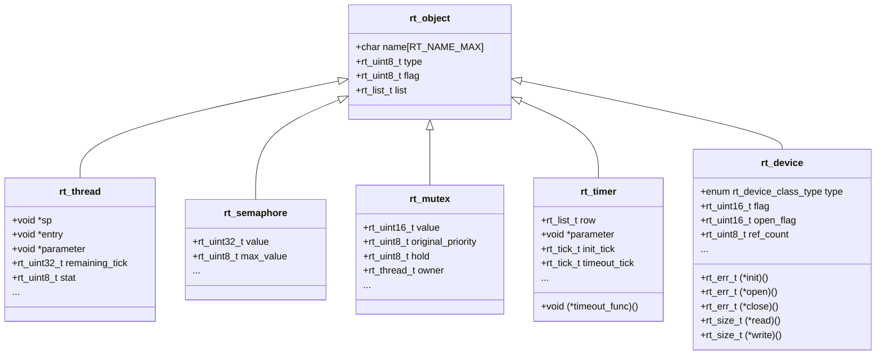
```mermaid
classDiagram
    class rt_object {
        +char name[RT_NAME_MAX]
        +rt_uint8_t type
        +rt_uint8_t flag
        +rt_list_t list
    }
    
    class rt_thread {
        +void *sp
        +void *entry
        +void *parameter
        +rt_uint32_t remaining_tick
        +rt_uint8_t stat
        ...
    }
    
    class rt_semaphore {
        +rt_uint32_t value
        +rt_uint8_t max_value
        ...
    }
    
    class rt_mutex {
        +rt_uint16_t value
        +rt_uint8_t original_priority
        +rt_uint8_t hold
        +rt_thread_t owner
        ...
    }
    
    class rt_timer {
        +rt_list_t row
        +void (*timeout_func)()
        +void *parameter
        +rt_tick_t init_tick
        +rt_tick_t timeout_tick
        ...
    }
    
    class rt_device {
        +enum rt_device_class_type type
        +rt_uint16_t flag
        +rt_uint16_t open_flag
        +rt_uint8_t ref_count
        +rt_err_t (*init)()
        +rt_err_t (*open)()
        +rt_err_t (*close)()
        +rt_size_t (*read)()
        +rt_size_t (*write)()
        ...
    }
    
    rt_object <|-- rt_thread
    rt_object <|-- rt_semaphore
    rt_object <|-- rt_mutex
    rt_object <|-- rt_timer
    rt_object <|-- rt_device
```

---

### 4.4 对象查找与遍历

#### 根据类型获取对象信息

```c
/**
 * 根据对象类型获取对象容器信息
 * 
 * @param type 对象类型枚举值
 * @return 对象信息结构体指针，失败返回 RT_NULL
 */
struct rt_object_information *rt_object_get_information(enum rt_object_class_type type)
{
    int index;
    
    /* 遍历对象容器数组 */
    for (index = 0; index < RT_Object_Class_Unknown; index++)
    {
        /* 找到匹配的类型 */
        if (_object_container[index].type == type)
        {
            return &_object_container[index];
        }
    }
    
    return RT_NULL;
}
```

#### 根据名称查找对象

```c
/**
 * 根据名称在指定类型的对象链表中查找对象
 * 
 * @param name 对象名称
 * @param type 对象类型
 * @return 找到的对象指针，未找到返回 RT_NULL
 */
rt_object_t rt_object_find(const char *name, rt_object_class_type type)
{
    struct rt_object_information *information;
    struct rt_list_node *node;
    struct rt_object *object;
    
    /* 参数检查 */
    RT_ASSERT(name != RT_NULL);
    
    /* 获取对象容器 */
    information = rt_object_get_information(type);
    if (information == RT_NULL)
    {
        return RT_NULL;
    }
    
    /* 遍历对象链表 */
    rt_list_for_each(node, &(information->object_list))
    {
        object = rt_list_entry(node, struct rt_object, list);
        
        /* 名称比较 */
        if (rt_strncmp(object->name, name, RT_NAME_MAX) == 0)
        {
            return object;
        }
    }
    
    return RT_NULL;
}
```

#### 查找流程图

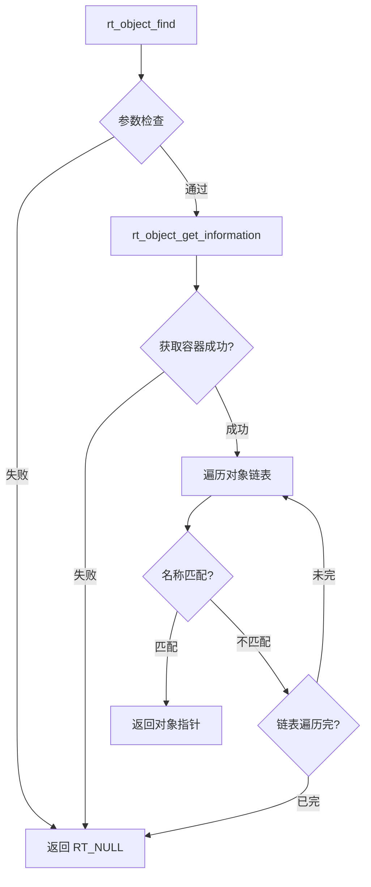
```mermaid
flowchart TD
    A[rt_object_find] --> B{参数检查}
    B -->|失败| C[返回 RT_NULL]
    B -->|通过| D[rt_object_get_information]
    
    D --> E{获取容器成功?}
    E -->|失败| C
    E -->|成功| F[遍历对象链表]
    
    F --> G{名称匹配?}
    G -->|匹配| H[返回对象指针]
    G -->|不匹配| I{链表遍历完?}
    
    I -->|未完| F
    I -->|已完| C
```

---

### 4.5 静态对象管理（init/detach）

#### 核心原则

- 只要看到函数名是 **`_init`**，它处理的一定是**静态内存**，用完后需要调用 **`_detach`** 来脱离。
- 静态对象的生命周期由程序员手动管理，内存通常在编译时分配（全局变量或静态局部变量）。

#### 静态对象初始化

```c
/**
 * 初始化静态对象
 * 
 * @param object 对象指针（由用户分配的静态内存）
 * @param type   对象类型
 * @param name   对象名称
 */
void rt_object_init(struct rt_object         *object,
                    enum rt_object_class_type type,
                    const char               *name)
{
    struct rt_object_information *information;
    
    /* 获取对象容器 */
    information = rt_object_get_information(type);
    RT_ASSERT(information != RT_NULL);
    
    /* 设置对象名称 */
    rt_strncpy(object->name, name, RT_NAME_MAX);
    
    /* 设置对象类型，并标记为静态对象 */
    object->type = type | RT_Object_Class_Static;
    
    /* 初始化链表节点 */
    rt_list_init(&(object->list));
    
    /* 关中断保护 */
    rt_hw_interrupt_disable();
    
    /* 将对象添加到对应类型的链表中 */
    rt_list_insert_after(&(information->object_list), &(object->list));
    
    /* 开中断 */
    rt_hw_interrupt_enable(0);
}
```

#### 静态对象脱离

```c
/**
 * 将静态对象从系统中脱离
 * 
 * @param object 要脱离的对象指针
 */
void rt_object_detach(rt_object_t object)
{
    struct rt_object_information *information;
    
    /* 参数检查 */
    RT_ASSERT(object != RT_NULL);
    
    /* 获取对象容器 */
    information = rt_object_get_information(object->type & ~RT_Object_Class_Static);
    RT_ASSERT(information != RT_NULL);
    
    /* 关中断保护 */
    rt_hw_interrupt_disable();
    
    /* 从链表中移除对象 */
    rt_list_remove(&(object->list));
    
    /* 开中断 */
    rt_hw_interrupt_enable(0);
    
    /* 清空对象类型 */
    object->type = 0;
}
```

#### 静态对象生命周期

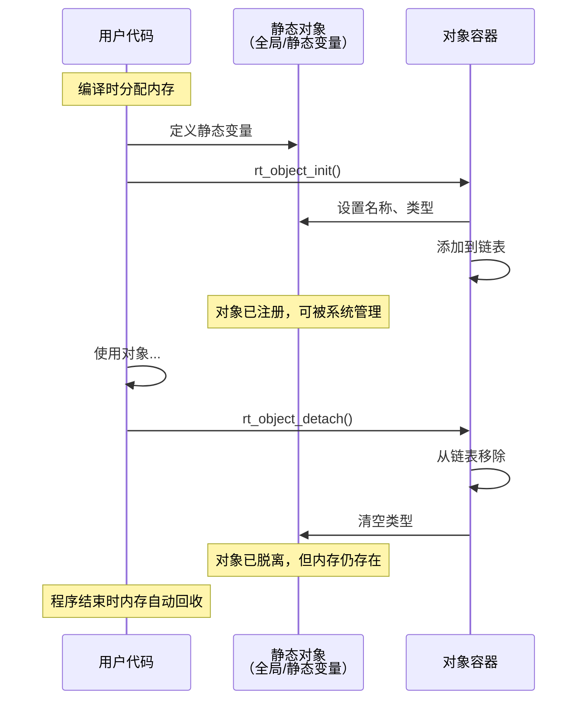
```mermaid
sequenceDiagram
    participant User as 用户代码
    participant Obj as 静态对象<br/>（全局/静态变量）
    participant Container as 对象容器
    
    Note over User: 编译时分配内存
    User->>Obj: 定义静态变量
    
    User->>Container: rt_object_init()
    Container->>Obj: 设置名称、类型
    Container->>Container: 添加到链表
    Note over Obj: 对象已注册，可被系统管理
    
    User->>User: 使用对象...
    
    User->>Container: rt_object_detach()
    Container->>Container: 从链表移除
    Container->>Obj: 清空类型
    Note over Obj: 对象已脱离，但内存仍存在
    
    Note over User: 程序结束时内存自动回收
```

---

### 4.6 动态对象管理

#### 核心原则

- 只要看到函数名是 **`_create`**，它处理的一定是**动态内存**，用完后需要调用 **`_delete`** 来释放。
- 动态对象的生命周期由系统堆管理器管理，内存通过 `rt_malloc` 分配，通过 `rt_free` 释放。

#### 动态对象分配

```c
/**
 * 动态分配并初始化对象
 * 
 * @param type 对象类型
 * @param name 对象名称
 * @return 分配的对象指针，失败返回 RT_NULL
 */
rt_object_t rt_object_allocate(enum rt_object_class_type type,
                               const char               *name)
{
    struct rt_object_information *information;
    struct rt_object *object;
    
    /* 获取对象容器 */
    information = rt_object_get_information(type);
    if (information == RT_NULL)
    {
        return RT_NULL;
    }
    
    /* 从堆中分配内存 */
    object = (struct rt_object *)rt_malloc(information->object_size);
    if (object == RT_NULL)
    {
        return RT_NULL;
    }
    
    /* 清零内存 */
    rt_memset(object, 0, information->object_size);
    
    /* 设置对象名称 */
    rt_strncpy(object->name, name, RT_NAME_MAX);
    
    /* 设置对象类型（动态对象，无静态标志） */
    object->type = type;
    
    /* 初始化链表节点 */
    rt_list_init(&(object->list));
    
    /* 关中断保护 */
    rt_hw_interrupt_disable();
    
    /* 将对象添加到对应类型的链表中 */
    rt_list_insert_after(&(information->object_list), &(object->list));
    
    /* 开中断 */
    rt_hw_interrupt_enable(0);
    
    return object;
}
```

#### 动态对象释放

```c
/**
 * 释放动态对象
 * 
 * @param object 要释放的对象指针
 */
void rt_object_delete(rt_object_t object)
{
    struct rt_object_information *information;
    
    /* 参数检查 */
    RT_ASSERT(object != RT_NULL);
    
    /* 检查是否为静态对象（静态对象不能被 delete） */
    RT_ASSERT(!(object->type & RT_Object_Class_Static));
    
    /* 获取对象容器 */
    information = rt_object_get_information(object->type);
    RT_ASSERT(information != RT_NULL);
    
    /* 关中断保护 */
    rt_hw_interrupt_disable();
    
    /* 从链表中移除对象 */
    rt_list_remove(&(object->list));
    
    /* 开中断 */
    rt_hw_interrupt_enable(0);
    
    /* 清空对象类型 */
    object->type = 0;
    
    /* 释放内存 */
    rt_free(object);
}
```

#### 动态对象生命周期

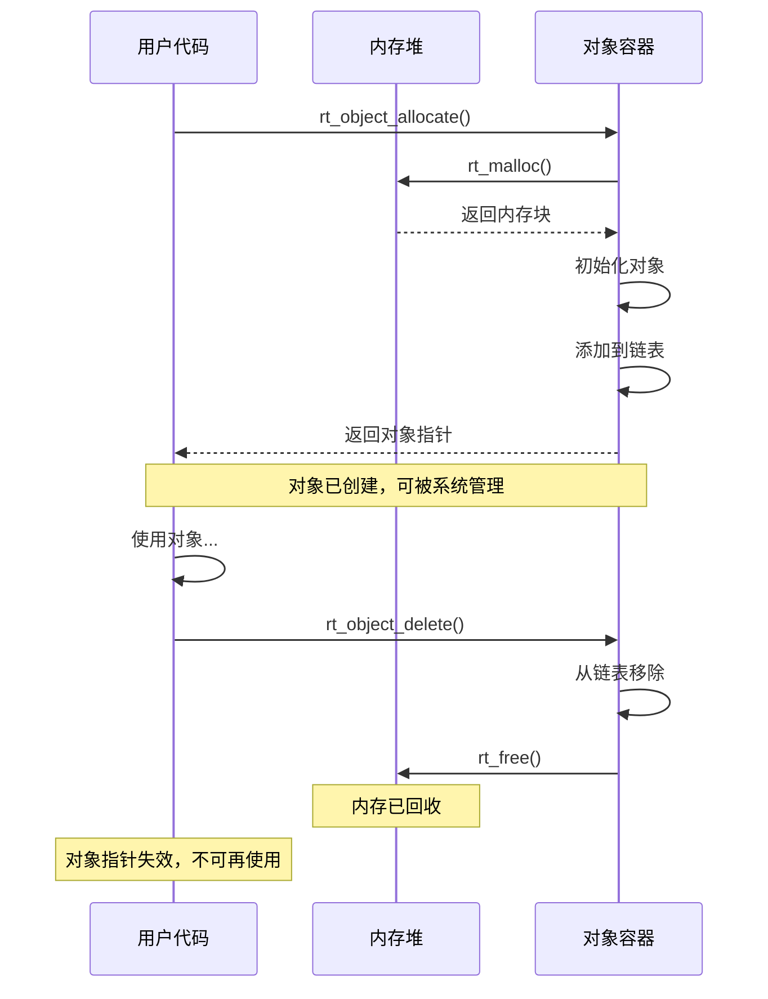
```mermaid
sequenceDiagram
    participant User as 用户代码
    participant Heap as 内存堆
    participant Container as 对象容器
    
    User->>Container: rt_object_allocate()
    Container->>Heap: rt_malloc()
    Heap-->>Container: 返回内存块
    Container->>Container: 初始化对象
    Container->>Container: 添加到链表
    Container-->>User: 返回对象指针
    Note over User,Container: 对象已创建，可被系统管理
    
    User->>User: 使用对象...
    
    User->>Container: rt_object_delete()
    Container->>Container: 从链表移除
    Container->>Heap: rt_free()
    Note over Heap: 内存已回收
    Note over User: 对象指针失效，不可再使用
```

---

### 4.7 静态 vs 动态对象对比

| 特性 | 静态对象 (`_init`/`_detach`) | 动态对象 (`_create`/`_delete`) |
|------|------------------------------|--------------------------------|
| 内存来源 | 编译时分配（全局/静态区） | 运行时分配（堆） |
| 内存分配时机 | 程序启动前 | 调用 `_create` 时 |
| 内存释放时机 | 程序结束时 | 调用 `_delete` 时 |
| 内存碎片 | 无 | 可能产生碎片 |
| 分配速度 | 极快（无分配过程） | 较慢（需要堆管理） |
| 灵活性 | 低（数量固定） | 高（按需创建/销毁） |
| 适用场景 | 系统核心对象、数量确定 | 用户动态需求、数量不确定 |
| 类型标志 | `type \| RT_Object_Class_Static` | `type` |

---

### 4.8 钩子机制

RT-Thread 提供了对象操作的钩子函数，允许用户在对象创建/删除时执行自定义操作：

```c
#ifdef RT_USING_HOOK

/* 对象初始化钩子 */
static void (*rt_object_attach_hook)(struct rt_object *object) = RT_NULL;

/* 对象脱离钩子 */
static void (*rt_object_detach_hook)(struct rt_object *object) = RT_NULL;

/* 对象分配钩子 */
static void (*rt_object_take_hook)(struct rt_object *object) = RT_NULL;

/* 对象释放钩子 */
static void (*rt_object_put_hook)(struct rt_object *object) = RT_NULL;

/**
 * 设置对象初始化钩子
 */
void rt_object_attach_sethook(void (*hook)(struct rt_object *object))
{
    rt_object_attach_hook = hook;
}

/**
 * 设置对象脱离钩子
 */
void rt_object_detach_sethook(void (*hook)(struct rt_object *object))
{
    rt_object_detach_hook = hook;
}

#endif /* RT_USING_HOOK */
```

#### 钩子调用位置

```c
void rt_object_init(struct rt_object *object,
                    enum rt_object_class_type type,
                    const char *name)
{
    /* ... 初始化代码 ... */
    
#ifdef RT_USING_HOOK
    /* 调用初始化钩子 */
    if (rt_object_attach_hook != RT_NULL)
    {
        rt_object_attach_hook(object);
    }
#endif
}
```

---

### 4.9 对象遍历工具函数

#### 遍历宏定义

```c
/**
 * 遍历指定类型的所有对象
 * 
 * @param object  对象指针变量
 * @param type    对象类型
 */
#define rt_list_for_each(pos, head) \
    for (pos = (head)->next; pos != (head); pos = pos->next)

/**
 * 从链表节点获取包含它的结构体指针
 * 
 * @param node    链表节点指针
 * @param type    结构体类型
 * @param member  链表节点在结构体中的成员名
 */
#define rt_list_entry(node, type, member) \
    ((type *)((char *)(node) - (unsigned long)(&((type *)0)->member)))
```

#### 遍历所有线程示例

```c
/**
 * 打印系统中所有线程信息
 */
void list_thread(void)
{
    struct rt_object_information *information;
    struct rt_list_node *node;
    struct rt_thread *thread;
    
    /* 获取线程对象容器 */
    information = rt_object_get_information(RT_Object_Class_Thread);
    RT_ASSERT(information != RT_NULL);
    
    rt_kprintf("thread name   priority  status    sp       stack size\n");
    rt_kprintf("------------  --------  --------  -------  ----------\n");
    
    /* 遍历线程链表 */
    rt_list_for_each(node, &(information->object_list))
    {
        thread = rt_list_entry(node, struct rt_thread, list);
        
        rt_kprintf("%-12s  %-8d  %-8s  0x%08x  %d\n",
                   thread->name,
                   thread->current_priority,
                   thread_stat_to_string(thread->stat),
                   thread->sp,
                   thread->stack_size);
    }
}
```

---

### 4.10 对象系统完整架构图

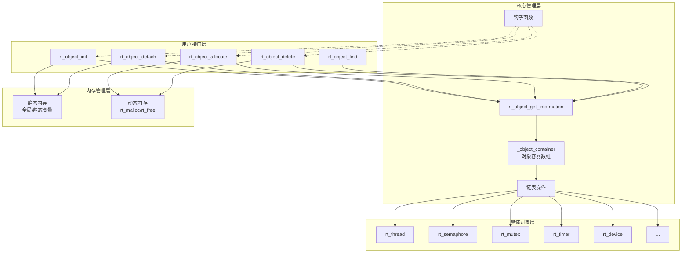
```mermaid
graph TB
    subgraph 用户接口层
        UI1[rt_object_init]
        UI2[rt_object_detach]
        UI3[rt_object_allocate]
        UI4[rt_object_delete]
        UI5[rt_object_find]
    end
    
    subgraph 核心管理层
        CM1[rt_object_get_information]
        CM2[_object_container<br/>对象容器数组]
        CM3[链表操作]
        CM4[钩子函数]
    end
    
    subgraph 内存管理层
        MM1[静态内存<br/>全局/静态变量]
        MM2[动态内存<br/>rt_malloc/rt_free]
    end
    
    subgraph 具体对象层
        OBJ1[rt_thread]
        OBJ2[rt_semaphore]
        OBJ3[rt_mutex]
        OBJ4[rt_timer]
        OBJ5[rt_device]
        OBJ6[...]
    end
    
    UI1 --> CM1
    UI2 --> CM1
    UI3 --> CM1
    UI4 --> CM1
    UI5 --> CM1
    
    CM1 --> CM2
    CM2 --> CM3
    
    UI1 --> MM1
    UI2 --> MM1
    UI3 --> MM2
    UI4 --> MM2
    
    CM3 --> OBJ1
    CM3 --> OBJ2
    CM3 --> OBJ3
    CM3 --> OBJ4
    CM3 --> OBJ5
    CM3 --> OBJ6
    
    CM4 -.-> UI1
    CM4 -.-> UI2
    CM4 -.-> UI3
    CM4 -.-> UI4
```


# 第四部分：工程实践避坑指南 + 第五部分：架构设计思考

---

```markdown
---

## 五、工程实践避坑指南

### 5.1 内存管理铁律

#### 静态 vs 动态对象函数对应关系

| 操作类型 | 静态对象函数 | 动态对象函数 | 内存来源 |
|----------|--------------|--------------|----------|
| 创建/初始化 | `rt_xxx_init()` | `rt_xxx_create()` | 静态：用户分配 / 动态：堆分配 |
| 销毁/脱离 | `rt_xxx_detach()` | `rt_xxx_delete()` | 静态：仅脱离链表 / 动态：释放内存 |

#### 核心记忆口诀

```
_init  → 静态内存 → _detach 脱离
_create → 动态内存 → _delete 释放
```

#### 常见错误示例

```c
/* ❌ 错误：静态对象用 delete 释放 */
struct rt_semaphore static_sem;
rt_sem_init(&static_sem, "sem", 1, RT_IPC_FLAG_PRIO);
/* ... 使用 ... */
rt_sem_delete(&static_sem);  /* 错误！会导致 HardFault 或内存崩溃 */

/* ✅ 正确：静态对象用 detach */
rt_sem_detach(&static_sem);  /* 正确 */

/* ❌ 错误：动态对象用 detach */
rt_sem_t dynamic_sem = rt_sem_create("sem", 1, RT_IPC_FLAG_PRIO);
/* ... 使用 ... */
rt_sem_detach(dynamic_sem);  /* 错误！内存泄漏 */

/* ✅ 正确：动态对象用 delete */
rt_sem_delete(dynamic_sem);  /* 正确 */
```

#### 内存泄漏排查流程

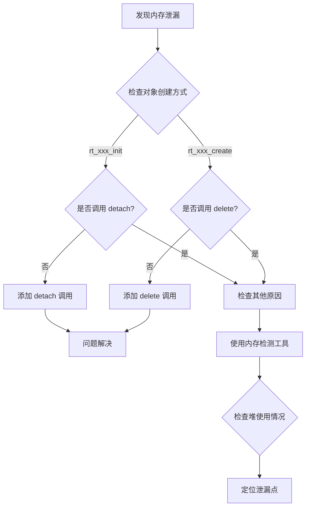
```mermaid
flowchart TD
    A[发现内存泄漏] --> B{检查对象创建方式}
    B -->|rt_xxx_init| C{是否调用 detach?}
    B -->|rt_xxx_create| D{是否调用 delete?}
    
    C -->|否| E[添加 detach 调用]
    C -->|是| F[检查其他原因]
    
    D -->|否| G[添加 delete 调用]
    D -->|是| F
    
    E --> H[问题解决]
    G --> H
    
    F --> I[使用内存检测工具]
    I --> J{检查堆使用情况}
    J --> K[定位泄漏点]
```

---

### 5.2 自旋锁使用禁忌

#### 自旋锁的"双刃剑"特性

自旋锁会让抢不到锁的 CPU 核心陷入死循环白白浪费算力，所以**自旋锁保护的代码块（临界区）必须极其短小、执行极快**。

#### 绝对禁止的操作

```c
/* ❌ 错误：在自旋锁临界区内做延时 */
rt_hw_spin_lock(&_cpus_lock);
rt_thread_delay(10);  /* 致命错误！会导致其他核心死锁 */
rt_hw_spin_unlock(&_cpus_lock);

/* ❌ 错误：在自旋锁临界区内打印日志 */
rt_hw_spin_lock(&_cpus_lock);
rt_kprintf("This is a log message...\n");  /* 错误！打印可能阻塞 */
rt_hw_spin_unlock(&_cpus_lock);

/* ❌ 错误：在自旋锁临界区内调用可能阻塞的函数 */
rt_hw_spin_lock(&_cpus_lock);
rt_sem_take(sem, RT_WAITING_FOREVER);  /* 错误！信号量可能阻塞 */
rt_hw_spin_unlock(&_cpus_lock);

/* ✅ 正确：临界区内只做极快的操作 */
rt_hw_spin_lock(&_cpus_lock);
ready_priority_group |= (1 << priority);  /* 仅做位操作 */
rt_hw_spin_unlock(&_cpus_lock);
```

#### 自旋锁适用场景判断

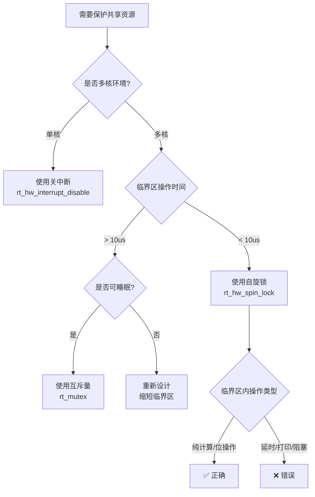
```mermaid
flowchart TD
    A[需要保护共享资源] --> B{是否多核环境?}
    B -->|单核| C[使用关中断<br/>rt_hw_interrupt_disable]
    B -->|多核| D{临界区操作时间}
    
    D -->|< 10us| E[使用自旋锁<br/>rt_hw_spin_lock]
    D -->|> 10us| F{是否可睡眠?}
    
    F -->|是| G[使用互斥量<br/>rt_mutex]
    F -->|否| H[重新设计<br/>缩短临界区]
    
    E --> I{临界区内操作类型}
    I -->|纯计算/位操作| J[✅ 正确]
    I -->|延时/打印/阻塞| K[❌ 错误]
```

---

### 5.3 空闲线程陷阱

#### 空闲线程不可被删除

```c
/* ❌ 错误：尝试删除空闲线程 */
rt_thread_t idle = rt_thread_find("tidle");
rt_thread_delete(idle);  /* 致命错误！系统将崩溃 */
```

#### 空闲线程的职责

空闲线程承担了以下重要职责：

1. **CPU 兜底运行**：保证调度器永远有可运行线程
2. **资源回收**：清理已删除线程的内存（`rt_thread_defunct` 链表）
3. **低功耗管理**：可配置进入低功耗模式

#### 空闲线程钩子使用

```c
/* 定义空闲线程钩子函数 */
static void idle_hook(void)
{
    /* 可以在这里做低功耗处理 */
    __WFI();  /* 等待中断，降低功耗 */
}

/* 注册空闲线程钩子 */
rt_thread_idle_sethook(idle_hook);

/* 注意：钩子函数中不能做阻塞操作！ */
static void bad_idle_hook(void)
{
    rt_thread_delay(10);  /* ❌ 错误！空闲线程不能阻塞 */
}
```

---

### 5.4 对象命名规范

#### 命名的重要性

在资源受限的嵌入式系统中，使用字符串来注册和查找设备（`"uart1"`、`"i2c1"`、`"spi2"`）是一种非常经典且易于维护的设计模式。它使得系统的硬件资源变得像文件系统里的文件一样清晰可查。

#### 推荐命名规范

| 对象类型 | 命名前缀 | 示例 |
|----------|----------|------|
| 线程 | `t` | `"tshell"`、`"tled"`、`"tsensor"` |
| 信号量 | `sem` | `"sem_tx"`、`"sem_rx"` |
| 互斥量 | `mtx` | `"mtx_flash"`、`"mtx_i2c"` |
| 邮箱 | `mb` | `"mb_cmd"`、`"mb_data"` |
| 消息队列 | `mq` | `"mq_log"`、`"mq_event"` |
| 定时器 | `tmr` | `"tmr_heartbeat"`、`"tmr_wdt"` |
| 设备 | 功能名 | `"uart1"`、`"spi2"`、`"i2c1"` |

#### 命名长度限制

```c
/* RT-Thread 默认对象名称长度 */
#define RT_NAME_MAX 8  /* 包含结束符 '\0'，实际可用 7 字符 */

/* ✅ 正确：名称长度合适 */
rt_sem_create("sem_tx", 1, RT_IPC_FLAG_PRIO);

/* ❌ 错误：名称过长，会被截断 */
rt_sem_create("sem_transmit_complete", 1, RT_IPC_FLAG_PRIO);
/* 实际存储为 "sem_tra" + '\0' */
```

---

### 5.5 中断保护陷阱

#### 关中断的正确姿势

```c
/* ❌ 错误：关中断后忘记开中断 */
rt_hw_interrupt_disable();
/* ... 操作 ... */
/* 忘记开中断！系统将无法响应任何中断 */

/* ✅ 正确：保存中断状态，恢复状态 */
rt_base_t level;
level = rt_hw_interrupt_disable();
/* ... 临界区操作 ... */
rt_hw_interrupt_enable(level);  /* 恢复之前的状态 */

/* ✅ 正确：使用 RT-Thread 提供的锁机制 */
rt_enter_critical();
/* ... 临界区操作 ... */
rt_exit_critical();
```

#### 中断嵌套问题

```c
/* 在中断服务函数中 */
void UART_IRQHandler(void)
{
    /* ❌ 错误：在中断中调用可能阻塞的函数 */
    rt_sem_take(sem, RT_WAITING_FOREVER);  /* 死锁！ */
    
    /* ✅ 正确：使用非阻塞方式 */
    if (rt_sem_take(sem, 0) == RT_EOK)
    {
        /* 获取成功 */
    }
    
    /* ✅ 正确：使用 ISR 专用 API */
    rt_sem_release(sem);  /* 释放信号量是允许的 */
}
```

---

### 5.6 调试技巧：对象状态检查

#### 检查对象是否有效

```c
/**
 * 检查对象是否有效
 * 
 * @param object 对象指针
 * @return RT_TRUE 有效，RT_FALSE 无效
 */
rt_bool_t rt_object_is_valid(rt_object_t object)
{
    struct rt_object_information *information;
    
    /* 空指针检查 */
    if (object == RT_NULL)
    {
        return RT_FALSE;
    }
    
    /* 类型检查 */
    if (object->type == 0 || object->type >= RT_Object_Class_Unknown)
    {
        return RT_FALSE;
    }
    
    /* 检查对象是否在容器中注册 */
    information = rt_object_get_information(
        object->type & ~RT_Object_Class_Static
    );
    
    if (information == RT_NULL)
    {
        return RT_FALSE;
    }
    
    return RT_TRUE;
}
```

#### 使用 FinSH 命令调试

```bash
/* 列出所有线程 */
msh /> list_thread

/* 列出所有信号量 */
msh /> list_sem

/* 列出所有定时器 */
msh /> list_timer

/* 列出所有设备 */
msh /> list_device

/* 查看内存使用情况 */
msh /> free
```

---

## 六、架构设计思考

### 6.1 多核编程的思维转换

从单核开发过渡到多核开发，最大的改变就是必须具备"真·并发"意识。

#### 单核 vs 多核并发对比

| 特性 | 单核并发 | 多核并发 |
|------|----------|----------|
| 并发本质 | 时间片交替的伪并发 | 物理层面同一纳秒发生的真并发 |
| 关中断效果 | 完全保护临界区 | 仅保护当前核心，其他核心仍可访问 |
| 同步机制 | 关中断/信号量 | 自旋锁/原子操作 |
| 调试难度 | 较低 | 极高（时序难以复现） |

#### 思维转换图解

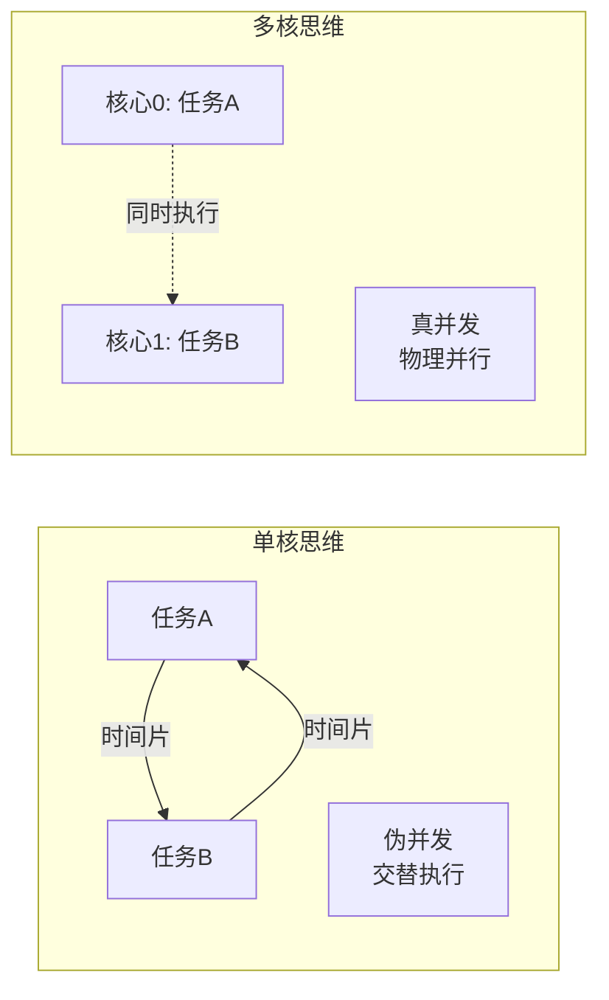
```mermaid
graph LR
    subgraph 单核思维
        A1[任务A] --> |时间片| A2[任务B]
        A2 --> |时间片| A1
        Note1[伪并发<br/>交替执行]
    end
    
    subgraph 多核思维
        B1[核心0: 任务A]
        B2[核心1: 任务B]
        B1 -.-> |同时执行| B2
        Note2[真并发<br/>物理并行]
    end
```

---

### 6.2 锁粒度与性能的无情博弈

自旋锁虽然强大，但它是一把"双刃剑"。因为它会让抢不到锁的 CPU 核心陷入死循环白白浪费算力，所以**自旋锁保护的代码块（临界区）必须极其短小、执行极快**，绝对不能在里面做延时或者打印操作。

这也是为什么优秀的 RTOS 架构师对内核代码的精简度有着近乎变态的追求。

#### 锁粒度设计原则

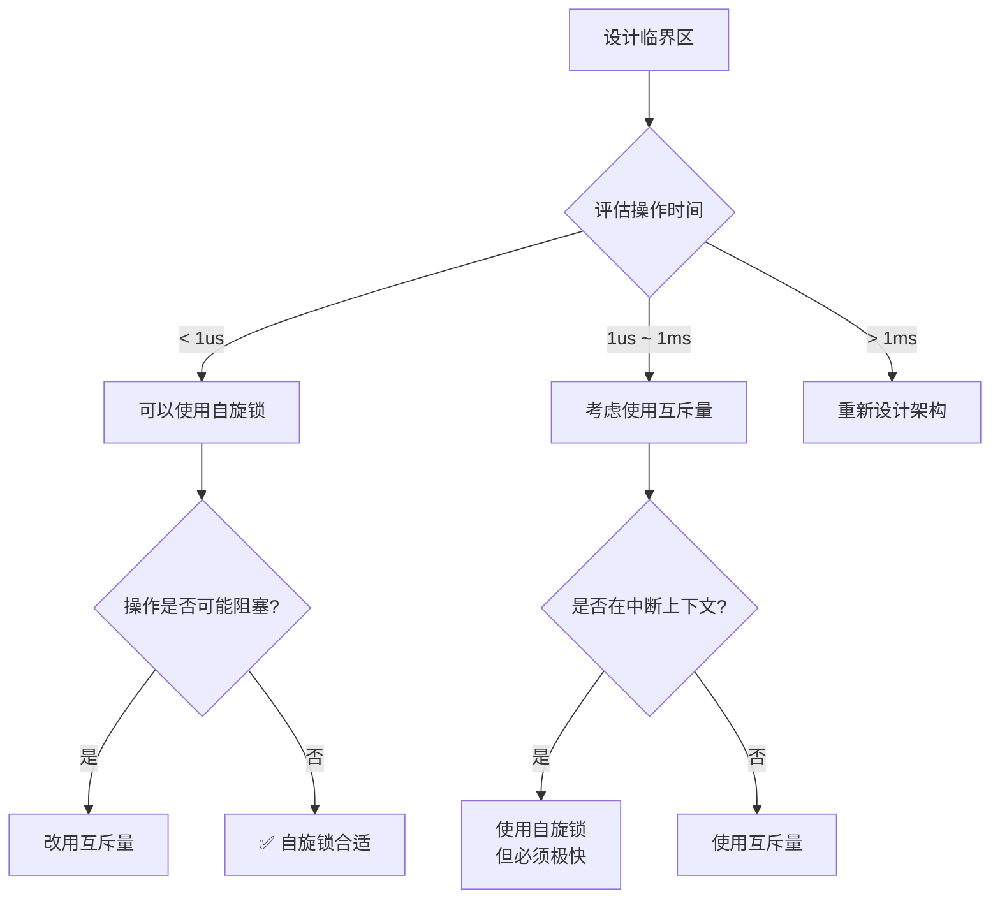
```mermaid
graph TD
    A[设计临界区] --> B{评估操作时间}
    B --> |< 1us| C[可以使用自旋锁]
    B --> |1us ~ 1ms| D[考虑使用互斥量]
    B --> |> 1ms| E[重新设计架构]
    
    C --> F{操作是否可能阻塞?}
    F --> |是| G[改用互斥量]
    F --> |否| H[✅ 自旋锁合适]
    
    D --> I{是否在中断上下文?}
    I --> |是| J[使用自旋锁<br/>但必须极快]
    I --> |否| K[使用互斥量]
```

#### 性能影响对比

| 锁类型 | 等待方式 | 上下文切换 | 适用场景 | CPU 开销 |
|--------|----------|------------|----------|----------|
| 自旋锁 | 忙等待（空转） | 无 | 极短临界区 | 高（等待时） |
| 互斥量 | 睡眠等待 | 有 | 较长临界区 | 低（等待时） |
| 信号量 | 睡眠等待 | 有 | 同步/资源计数 | 低（等待时） |

---

### 6.3 字符串作为系统级标识符

在资源受限的嵌入式系统中，使用字符串来注册和查找设备（`"uart1"`、`"i2c1"`、`"spi2"`）是一种非常经典且易于维护的设计模式。

#### 设计优势

1. **可读性强**：`rt_device_find("uart1")` 比 `rt_device_find(0x01)` 更直观
2. **解耦合**：驱动层与应用层通过名称关联，而非硬编码地址
3. **可扩展**：新增设备只需注册新名称，无需修改框架代码
4. **调试友好**：FinSH 命令可直接显示设备名称

#### 实现机制

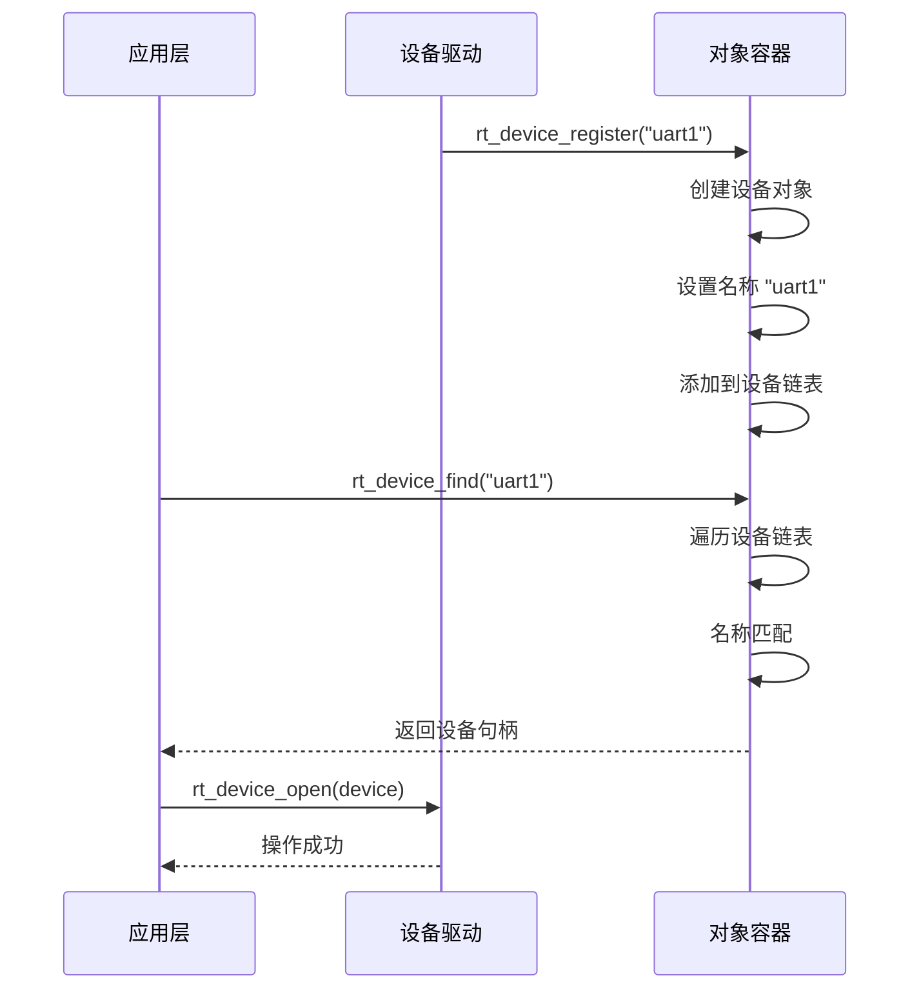
```mermaid
sequenceDiagram
    participant App as 应用层
    participant Dev as 设备驱动
    participant Container as 对象容器
    
    Dev->>Container: rt_device_register("uart1")
    Container->>Container: 创建设备对象
    Container->>Container: 设置名称 "uart1"
    Container->>Container: 添加到设备链表
    
    App->>Container: rt_device_find("uart1")
    Container->>Container: 遍历设备链表
    Container->>Container: 名称匹配
    Container-->>App: 返回设备句柄
    
    App->>Dev: rt_device_open(device)
    Dev-->>App: 操作成功
```

#### 性能权衡

```c
/* 字符串比较的开销 */
rt_strncmp(object->name, name, RT_NAME_MAX)  /* 最多比较 8 字节 */

/* 对于嵌入式系统，这个开销是可接受的 */
/* 原因：设备查找通常只在初始化时进行，不在关键路径上 */
```

---

### 6.4 面向对象思想在 C 语言中的实现

RT-Thread 的对象系统是 C 语言实现面向对象编程的经典案例。

#### 核心技术手段

```c
/* 1. 结构体继承：将父结构体作为第一个成员 */
struct rt_object
{
    char name[RT_NAME_MAX];
    rt_uint8_t type;
    rt_uint8_t flag;
    rt_list_t list;
};

struct rt_thread
{
    struct rt_object parent;  /* 继承 rt_object */
    
    /* 线程特有成员 */
    void *sp;
    void *entry;
    void *parameter;
    /* ... */
};

/* 2. 多态：通过函数指针实现 */
struct rt_device
{
    struct rt_object parent;
    
    /* 虚函数表 */
    rt_err_t  (*init)   (rt_device_t dev);
    rt_err_t  (*open)   (rt_device_t dev, rt_uint16_t oflag);
    rt_err_t  (*close)  (rt_device_t dev);
    rt_size_t (*read)   (rt_device_t dev, rt_off_t pos, void *buffer, rt_size_t size);
    rt_size_t (*write)  (rt_device_t dev, rt_off_t pos, const void *buffer, rt_size_t size);
    /* ... */
};

/* 3. 类型识别：通过 type 字段实现 RTTI */
rt_object_t object = (rt_object_t)thread;
if (object->type == RT_Object_Class_Thread)
{
    /* 这是一个线程对象 */
}
```

#### 面向对象设计模式应用

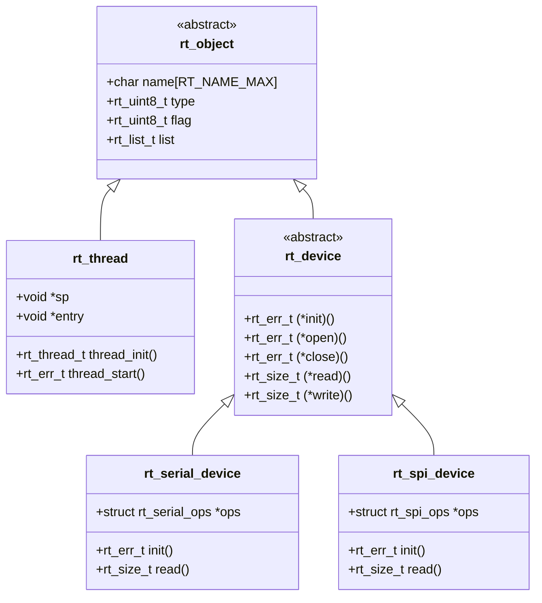
```mermaid
classDiagram
    class rt_object {
        <<abstract>>
        +char name[RT_NAME_MAX]
        +rt_uint8_t type
        +rt_uint8_t flag
        +rt_list_t list
    }
    
    class rt_thread {
        +void *sp
        +void *entry
        +rt_thread_t thread_init()
        +rt_err_t thread_start()
    }
    
    class rt_device {
        <<abstract>>
        +rt_err_t (*init)()
        +rt_err_t (*open)()
        +rt_err_t (*close)()
        +rt_size_t (*read)()
        +rt_size_t (*write)()
    }
    
    class rt_serial_device {
        +struct rt_serial_ops *ops
        +rt_err_t init()
        +rt_size_t read()
    }
    
    class rt_spi_device {
        +struct rt_spi_ops *ops
        +rt_err_t init()
        +rt_size_t read()
    }
    
    rt_object <|-- rt_thread
    rt_object <|-- rt_device
    rt_device <|-- rt_serial_device
    rt_device <|-- rt_spi_device
```

---

### 6.5 自动初始化机制的设计哲学

RT-Thread 的 `INIT_*_EXPORT` 机制体现了"约定优于配置"的设计哲学。

#### 传统方式 vs 自动初始化

```c
/* ❌ 传统方式：main 函数臃肿，耦合严重 */
int main(void)
{
    uart_init();
    gpio_init();
    spi_init();
    i2c_init();
    timer_init();
    ethernet_init();
    file_system_init();
    network_init();
    application_init();
    /* ... 几十个初始化函数 ... */
    
    while (1)
    {
        /* 主循环 */
    }
}

/* ✅ 自动初始化方式：main 函数简洁，解耦合 */
int main(void)
{
    /* 所有初始化已通过 INIT_*_EXPORT 自动完成 */
    
    while (1)
    {
        /* 主循环 */
    }
}

/* 各驱动文件中 */
INIT_BOARD_EXPORT(uart_init);    /* 在 uart.c 中 */
INIT_BOARD_EXPORT(gpio_init);    /* 在 gpio.c 中 */
INIT_DEVICE_EXPORT(spi_init);    /* 在 spi.c 中 */
INIT_COMPONENT_EXPORT(net_init); /* 在 net.c 中 */
INIT_APP_EXPORT(app_init);       /* 在 app.c 中 */
```

#### 设计优势

| 特性 | 传统方式 | 自动初始化 |
|------|----------|------------|
| 代码耦合 | 高（main 需要知道所有初始化函数） | 低（各模块独立注册） |
| 可维护性 | 差（新增模块需修改 main） | 好（新增模块只需添加一行宏） |
| 初始化顺序 | 手动控制，易出错 | 自动排序，有保障 |
| 代码复用 | 差（不同项目 main 不同） | 好（模块可直接移植） |

---

### 6.6 RT-Thread 架构全景图

```mermaid
graph TB
    subgraph 应用层
        APP[用户应用程序]
    end
    
    subgraph 组件层
        COMP1[FinSH Shell]
        COMP2[文件系统 DFS]
        COMP3[网络协议栈 LwIP]
        COMP4[图形界面 GUI]
        COMP5[其他组件]
    end
    
    subgraph 设备驱动框架层
        DRV1[串口驱动框架]
        DRV2[SPI 驱动框架]
        DRV3[I2C 驱动框架]
        DRV4[网络驱动框架]
        DRV5[其他驱动框架]
    end
    
    subgraph 内核层
        KERNEL[RT-Thread 内核]
        OBJ[对象系统<br/>object.c]
        SCHED[调度器<br/>scheduler.c]
        IPC[进程间通信<br/>ipc.c]
        TIMER[定时器<br/>timer.c]
        MEM[内存管理<br/>mem.c]
    end
    
    subgraph 硬件抽象层
        HAL[CPU 抽象]
        BSP[板级支持包<br/>BSP]
    end
    
    subgraph 硬件层
        HW[CPU / 外设 / 存储]
    end
    
    APP --> COMP1
    APP --> COMP2
    APP --> COMP3
    APP --> COMP4
    APP --> COMP5
    
    COMP1 --> DRV1
    COMP2 --> DRV2
    COMP3 --> DRV4
    
    DRV1 --> KERNEL
    DRV2 --> KERNEL
    DRV3 --> KERNEL
    DRV4 --> KERNEL
    DRV5 --> KERNEL
    
    KERNEL --> OBJ
    KERNEL --> SCHED
    KERNEL --> IPC
    KERNEL --> TIMER
    KERNEL --> MEM
    
    OBJ --> HAL
    SCHED --> HAL
    MEM --> HAL
    
    HAL --> BSP
    BSP --> HW
```

---

## 七、总结

### 7.1 核心知识点速查表

| 主题 | 核心要点 |
|------|----------|
| 对象系统 | 万物皆对象，统一管理，静态 `_init`/`_detach`，动态 `_create`/`_delete` |
| 自动初始化 | `INIT_*_EXPORT` 宏 + 链接器脚本，按优先级自动执行 |
| 多核同步 | 自旋锁保护极短临界区，禁止阻塞操作 |
| 空闲线程 | CPU 兜底，资源回收，不可删除 |
| 调度器架构 | 位图 + 链表数组，O(1) 时间复杂度 |
| 核间中断 | IPI 实现微秒级任务抢占，保证硬实时性 |

### 7.2 学习路径建议

```mermaid
graph LR
    A[对象系统<br/>object.c] --> B[调度器<br/>scheduler.c]
    B --> C[进程间通信<br/>ipc.c]
    C --> D[定时器<br/>timer.c]
    D --> E[内存管理<br/>mem.c]
    E --> F[设备驱动框架]
    F --> G[组件与中间件]
```

---

> **文档信息**
> - 整理日期：2026-04-16
> - 基于 RT-Thread 源码学习笔记
> - 涵盖启动流程、对象系统、多核编程等核心主题
