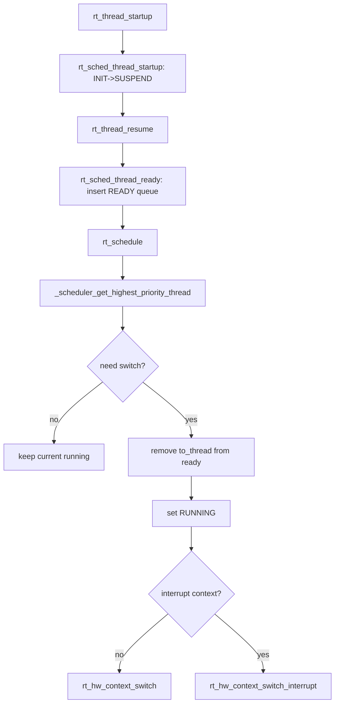

### 日记
- 看一个完整的代码，不要从静态函数开始看，直接从调用函数开始看，不然只看静态函数，还是看不懂，等到被函数别调用，再看
- 可以好好研究一下到底如何进行栈的进出的
- 获取自身指针的最好办法
- RT_USING_MODULE这个模块可以好好研究一下


#### 解决问题：

**问题：纯软件结构的初始化（如虚拟文件系统 VFS 的基础数据结构）：虚拟文件核基础的数据结构分别是什么


👉 **1. 一句话总结 (Core Purpose)** VFS 的基础数据结构充当了**“万能翻译官”**和**“黑盒适配器”**：它们使用 C 语言的结构体和函数指针，将上层统一的 POSIX 接口（如打开、读写）动态映射到了底层成百上千种截然不同的真实文件系统（如 FAT32, RomFS, LittleFS）上，实现了极其优雅的解耦。

🔍 **2. 逐层代码剖析 (Code Breakdown)**

VFS 能够运转，全靠两对“黄金搭档”结构体。我为你提取了核心字段进行拆解：

**黄金搭档 一：管“地盘”的 `struct dfs_filesystem`** 它代表了一个被挂载（Mount）到系统中的具体文件系统（比如你的 SD 卡被挂载为 FATFS）。

C

```
/* RT-Thread DFS 文件系统控制块 (提取核心字段) */
struct dfs_filesystem
{
    rt_device_t dev_id;                   /* 底层挂载的物理存储设备（如 spi_flash） */
    char *path;                           /* 挂载点路径，比如 "/" 或 "/sdcard" */
    const struct dfs_filesystem_ops *ops; /* 【核心1】该类文件系统的操作方法表 */
    void *data;                           /* 【核心2】私有数据指针 (非常精妙) */
};
```

- **`path` (挂载点)：** VFS 通过这个字段进行路径路由。如果用户打开 `/sdcard/test.txt`，VFS 会遍历所有的 `dfs_filesystem`，发现前缀 `/sdcard` 匹配，就把任务派发给这个文件系统。
    
- **`ops` (操作表)：** 里面全是指针，比如 `ops->mount`、`ops->statfs`。这是针对“整个文件系统”的操作。
    
- **`data` (私有指针)：** 极其重要！VFS 不关心 FATFS 或 LittleFS 内部长什么样，VFS 给它们各留了一个 `void *data` 抽屉。底层文件系统可以把自己的核心结构体地址塞进去，VFS 只负责帮你保管，不问内容。
    

**黄金搭档 二：管“房间”的 `struct dfs_fd` (File Descriptor)** 它代表了一个被应用层打开的具体“文件”。

C

```
/* RT-Thread DFS 文件描述符控制块 (提取核心字段) */
struct dfs_fd
{
    uint16_t type;                   /* 节点类型（是普通文件、目录、还是 IPC 管道？） */
    char *path;                      /* 文件的完整绝对路径 */
    int ref_count;                   /* 引用计数（防止文件正在读写时被别人强行关闭） */
    
    struct dfs_filesystem *fs;       /* 记录这个文件属于哪个具体的 dfs_filesystem */
    const struct dfs_file_ops *fops; /* 【核心1】具体文件的操作方法表（read/write/lseek） */
    
    size_t size;                     /* 文件总大小 */
    off_t pos;                       /* 文件当前读写到的位置偏移量 */
    void *data;                      /* 【核心2】底层具体文件的私有句柄 */
};
```

- **`fops` (文件操作表)：** 当你调用 `read(fd, buf, len)` 时，VFS 底层其实就是执行了 `fd->fops->read(fd, buf, len)`。
    
- **`data` (文件私有句柄)：** 当你用 FATFS 打开一个文件时，FATFS 会在底层创建一个 `FIL` 类型的结构体来管理扇区映射。FATFS 会悄悄把这个 `FIL` 结构体的地址赋给 `dfs_fd->data`。下次你要读文件时，FATFS 从 `dfs_fd->data` 里抽出 `FIL`，立刻就知道该读 SD 卡的哪一个物理扇区了。
    

🧠 **3. RTOS 原理深度解析 (OS Principles)**

- **为什么叫“虚拟 (Virtual)”文件系统？** 因为它**“不生产数据，只是数据的搬运工”**。 `dfs_filesystem` 和 `dfs_fd` 里只有元数据（路径、大小、读写指针位置）和函数指针，没有任何具体的磁盘读写逻辑。它的存在，让操作系统拥有了一套“路由系统”。
    
- **面向对象的多态 (Polymorphism) 在底层的运用：** 这也是我们前几次讨论 `object.c` 时提到的思想的延续。 上层应用永远只管调用 `read()`。VFS 内部查找到对应的 `dfs_fd`，直接无脑调用 `fd->fops->read()`。
    
    - 如果这个文件在 SD 卡上（FATFS），这个指针就指向 `fatfs_read`。
        
    - 如果这个文件在芯片内部的只读区（RomFS），这个指针就指向 `romfs_read`。
        
    - 如果这个文件是个网络套接字（Socket），它甚至能指向 `lwip_recv`！ 这就是 Linux 名言 **“万物皆文件 (Everything is a file)”** 的底层实现秘密。


#### 问题：回调设计不理解

**回调函数**就像是你留给操作系统的“私人电话号码”；而**钩子函数**则是操作系统在关键路口设置的“安检监控”。它们的核心作用是实现**“控制反转（IoC）”**：让底层操作系统在发生特定事件时，能够主动“打电话”通知并执行你（上层用户）写的代码，且**完全不需要修改内核源码**。

---

🔍 **2. 逐层代码剖析 (Code Breakdown)**

虽然你没有贴具体的代码，但为了让你深刻理解，我们用 C 语言底层逻辑来拆解一个典型的“调度器钩子（Scheduler Hook）”的实现过程：

- **第一步：内核预留“空抽屉”（定义函数指针）** 在内核源码里，架构师会提前定义一个全局的函数指针变量，初始值为空。
    
    C
    
    ```
    /* 内核里的全局变量：用来存放用户的“电话号码” */
    void (*rt_scheduler_hook)(struct rt_thread *from, struct rt_thread *to) = RT_NULL;
    ```
    
- **第二步：你在应用层“留电话”（注册回调/挂载钩子）** 你写了一个自己的函数，然后把它传给内核。这就叫**注册回调（Register Callback）**或**设置钩子（Set Hook）**。
    
    C
    
    ```
    /* 你自己写的应用层函数（这就是回调函数/钩子函数） */
    void my_trace_hook(struct rt_thread *from, struct rt_thread *to) {
        rt_kprintf("线程切换啦！从 %s 换到了 %s\n", from->name, to->name);
    }
    
    /* 把你的函数地址（电话号码）告诉内核 */
    rt_scheduler_sethook(my_trace_hook); 
    ```
    
- **第三步：内核在关键节点“拨打电话”（触发回调）** 在 RT-Thread 最核心的汇编调度上下文切换代码附近，会有这样一段逻辑：
    
    C
    
    ```
    /* 内核正在执行线程切换... */
    if (rt_scheduler_hook != RT_NULL) 
    {
        // 只要抽屉里有电话号码，内核就在这里主动拨打它！
        rt_scheduler_hook(from_thread, to_thread); 
    }
    /* 继续完成汇编级别的寄存器切换... */
    ```
    

---

🧠 **3. RTOS 原理深度解析 (OS Principles)**

- **什么是控制反转（Inversion of Control）？**
    
    - **正常逻辑：** 是你（App）主动调用操作系统（OS）的 API，比如 `rt_thread_sleep()`。控制权在你手里。
        
    - **回调/钩子逻辑：** 是操作系统（OS）在运行到某一步时，反过来调用你（App）写的函数。控制权在 OS 手里。
        
- **为什么一定要用钩子？（解耦的艺术）** 假设你想统计系统中每个线程的 CPU 占用率。如果没有钩子，你就必须去修改极其神圣且危险的内核文件 `scheduler.c`，在里面加上你的统计代码。一旦 RT-Thread 官方升级了版本，你的修改就全被覆盖了！ **钩子完美解决了这个问题：对扩展开放，对修改封闭。** 内核只负责在切换时触发钩子，至于钩子里是打印日志、翻转 LED、还是计算 CPU 负载，内核一概不关心。
    
- **RT-Thread 中最常用的三大神级钩子：**
    
    1. **空闲线程钩子 (`rt_thread_idle_sethook`)：** 当系统无事可做时触发。通常在这里写代码让 CPU 进入低功耗睡眠模式（Sleep/Stop）。
        
    2. **调度器钩子 (`rt_scheduler_sethook`)：** 发生线程上下文切换时触发。通常用于系统性能调优（Trace）或计算线程执行时间。
        
    3. **对象钩子 (`rt_object_attach_sethook`等)：** 我们前面见过的，用于监控系统中线程、信号量等对象的创建与销毁，排查内存泄漏。
        

---

💡 **4. 思考与启发 (Takeaway)**

- **设计模式：** 钩子机制本质上就是软件工程中大名鼎鼎的**观察者模式（Observer Pattern）**在 C 语言中的极简实现。
    
- **⚠️ 架构师的终极避坑警告（千万牢记）：** 钩子函数是在**内核上下文**甚至**中断上下文**中被调用的！
    
    - 当调度器钩子被触发时，系统的调度器是**被锁死**的。
        
    - 如果你在自己写的钩子函数里调用了 `rt_thread_delay()`，或者尝试获取一个已经被占用的 `rt_sem_take()`，系统会**瞬间死锁崩溃**！
        
    - **铁律：回调/钩子函数必须极其短小精悍，绝对不能包含任何会引起阻塞（Block）或睡眠（Sleep）的代码！**


**我认为还是要想看一下thread的结构体是怎么样的**


`struct rt_thread`（线程控制块）是 RT-Thread 中描述和管理一个线程的“身份证”与“记账本”，它记录了线程的运行状态、优先级、栈地址、CPU 上下文等所有底层信息，是操作系统调度器管理线程的唯一依据。


- **`sp` (Stack Pointer):** 这是底层最硬核的指针。当线程被中断打断或主动让出 CPU 时，当前 CPU 的所有寄存器（如 R0-R15, PC, xPSR 等）都会被“压入”这个线程的独立栈中，最后更新 `sp` 指向当前栈顶。恢复线程时，就是从 `sp` 指向的地址把数据“弹回” CPU 寄存器。
    
- **`rt_list_t tlist`:** 这是一个双向链表节点。RTOS 调度的本质，就是把包含这个节点的 `rt_thread` 结构体，在“就绪队列”（Ready List）、“阻塞队列”（Suspend List）之间来回搬运。
    
- **`number_mask`:** 这是一个针对 ARM 等处理器的优化机制。RT-Thread 使用“位图+硬件前导零指令”来寻找就绪的最高优先级线程，`number_mask` 提前计算好了该线程优先级对应的掩码，大大降低了调度时的运算时间（保证了调度的确定性，即实时性）。

**RTOS 原理深度解析 (OS Principles)**

- **为什么线程需要独立栈（`stack_addr`）？** 在裸机编程（前后台系统）中，整个系统共用一个栈。但在 RTOS 中，每个线程看似都在“独占” CPU。为了让线程在被打断后，还能完美恢复当时的局部变量和函数调用关系，每个线程必须有自己私有的堆栈空间。这也是为什么创建线程时必须分配栈大小。
    
- **面向对象的设计思想 (`rt_object` 思想)：** 注意到结构体最开始的 `name`, `type`, `flags`, `list` 了吗？在 RT-Thread 中，线程、定时器、信号量、互斥量等，在底层都被抽象为“内核对象”。这四个字段其实构成了 `struct rt_object` 的实质。这种设计让操作系统可以用统一的 API 去管理所有资源的创建、删除和查找。
    
- **双优先级的意义 (`current` vs `init`)：** 为什么需要保存两个优先级？这是为了解决 RTOS 中经典的[优先级问题](../../嵌入式/操作系统与内核/优先级问题.md)。当低优先级线程拿着互斥锁，高优先级线程想要这把锁时，系统会临时把低优先级线程的 `current_priority` 提拔到最高，等它释放锁后，再用 `init_priority` 恢复它的本来面目。

```c
struct rt_thread
{
    /* 1. 对象基础属性 (面向对象思想) */
    char        name[RT_NAME_MAX];     // 线程的名字
    rt_uint8_t  type;                  // 对象类型（如 RT_Object_Class_Thread）
    rt_uint8_t  flags;                 // 标志位
    rt_list_t   list;                  // 对象链表节点，用于将线程挂载到对象容器中

    /* 2. 调度与状态核心 */
    rt_list_t   tlist;                 // 线程链表节点（极其重要！用于挂载到就绪队列、阻塞队列等）
    void       *sp;                    // 线程的栈指针 (Stack Pointer)，保存上下文的关键
    void       *entry;                 // 线程入口函数的指针
    void       *parameter;             // 传递给入口函数的参数

    /* 3. 内存与栈 */
    void       *stack_addr;            // 线程栈的起始地址
    rt_uint32_t stack_size;            // 线程栈的大小

    /* 4. 运行状态与错误码 */
    rt_err_t    error;                 // 线程的错误码（如等待超时、正常等）
    rt_uint8_t  stat;                  // 线程的当前状态（就绪、挂起、运行、关闭等）

    /* 5. 优先级调度 */
    rt_uint8_t  current_priority;      // 当前优先级
    rt_uint8_t  init_priority;         // 初始优先级（用于防止优先级反转后的恢复）
    rt_uint32_t number_mask;           // 优先级掩码（配合位图调度算法，加速寻找最高优先级线程）
    ...
};
```


## 我理解的架构:Thread.c





#### 线程的超时设置：` _thread_timeout`
- 没啥好说的，直接跳过


#### ` _thread_init`非常重要看一看如何初始化的

- **静态 (Static) vs 动态 (Dynamic) 分配：** 在 RTOS 中创建线程通常有两种方式：`rt_thread_init`（静态）和 `rt_thread_create`（动态）。 这段代码是**静态**初始化。所谓静态，就是 `struct rt_thread` 和 `stack_start` 这两块内存是用户在定义全局变量（或者静态局部变量）时就已经在 RAM 中划拨好的，不需要系统在堆（Heap）里用 `malloc` 去分配。 **为什么需要静态初始化？** 在极其严苛的航空航天或医疗级嵌入式系统中，为了绝对的确定性和避免“内存碎片”导致的内存分配失败，通常强制要求使用静态内存分配。
    
- **关于 `tick`（时间片）的调度原理：** RT-Thread 是一个“抢占式”的实时操作系统，高优先级永远优先运行。但是，如果两个线程优先级一样高（比如都是优先级 15）怎么办？这时候就依靠 `tick` 参数了。系统采用**时间片轮转（Round-Robin）**策略。比如线程 A 和 B 的 tick 都是 10，那么 A 执行 10 个系统时钟节拍后，系统会强制剥夺 A 的 CPU 使用权，切换给 B 执行 10 个节拍，如此往复。
    
- **基类指针强转 `(rt_object_t)thread`：** 正如我们之前聊过的结构体，`rt_thread` 的第一个成员就是类似 `rt_object` 的基础属性。在 C 语言中，结构体的首地址就是第一个成员的首地址。因此，将其强转为 `rt_object_t` 是完全安全的，这是一种非常经典的 C 语言实现“继承”的方式。


- 问题：RT_ASSERT的代码问题

```c

/**
 * @brief 静态初始化线程函数
 * * @param thread      用户提供的线程控制块(TCB)的指针（内存已由用户分配）
 * @param name        线程名称（用于调试和对象管理）
 * @param entry       线程的入口函数指针（线程启动后执行的代码）
 * @param parameter   传递给入口函数的参数
 * @param stack_start 用户提供的线程独立栈的起始地址
 * @param stack_size  栈的大小（字节）
 * @param priority    线程优先级（数字越小，优先级越高）
 * @param tick        时间片大小（相同优先级的线程轮流执行的时间配额）
 * * @return rt_err_t   返回 RT_EOK 表示成功
 */
rt_err_t rt_thread_init(struct rt_thread *thread,
                        const char       *name,
                        void (*entry)(void *parameter),
                        void             *parameter,
                        void             *stack_start,
                        rt_uint32_t       stack_size,
                        rt_uint8_t        priority,
                        rt_uint32_t       tick)
{
    /* 第 1 步：防御性校验 (Parameter Check) */
    // 断言：确保传入的 TCB 指针不为空、栈起始地址不为空、时间片不能为0
    // 在 RT-Thread 中，如果断言失败，系统通常会直接卡死并打印错误位置，防止带病运行
    RT_ASSERT(thread != RT_NULL);
    RT_ASSERT(stack_start != RT_NULL);
    RT_ASSERT(tick != 0);

    /* 第 2 步：内存格式化 (Clean memory) */
    // 将整个 TCB 结构体所在的内存空间全部清零。
    // 这一步极其重要！它可以清除内存中残留的垃圾数据，防止随机的标志位(flags)或野指针导致内核崩溃。
    rt_memset(thread, 0x0, sizeof(struct rt_thread));

    /* 第 3 步：面向对象初始化 (Initialize thread object) */
    // 将 rt_thread 指针强转为基类 rt_object_t 指针。
    // 这行代码把该线程注册到了操作系统的“对象容器”中，标记它的类型为 RT_Object_Class_Thread，
    // 并把 name 赋给它。这样后续我们就可以通过命令（如 list_thread）在终端里看到这个线程了。
    rt_object_init((rt_object_t)thread, RT_Object_Class_Thread, name);

    /* 第 4 步：调用内核级初始化 (Internal Init) */
    // rt_thread_init 本质上是一个“壳”函数，真正硬核的 CPU 栈帧构造、
    // 链表节点初始化、优先级设置等工作，都交给了 _thread_init 这个内部函数。
    return _thread_init(thread,
                        name,
                        entry,
                        parameter,
                        stack_start,
                        stack_size,
                        priority,
                        tick);
}
/* 导出该函数给 RT-Thread 模块使用（类似于动态链接库的符号导出） */
RTM_EXPORT(rt_thread_init);
```


**内核级初始化代码**

- **为什么要伪造栈帧 (`rt_hw_stack_init`)？** 在操作系统眼里，创建一个新线程，本质上就是制造一个“假象”：让 CPU 以为这个线程以前运行过，只是被中断打断了，它的寄存器状态都保存在了堆栈里。 `rt_hw_stack_init` 的工作就是在栈顶开辟一块空间，按照 CPU 硬件上下文（比如 ARM 的 R0-R15, xPSR）的格式塞入数据。其中，`PC`（程序计数器）被塞入入口函数 `entry` 的地址，`R0` 被塞入 `parameter`。当调度器第一次切换到这个线程时，执行出栈指令（`POP`），CPU 就会自动跳转到 `entry` 去执行你的代码！
    
- **为什么要传入 `_thread_exit`？** 如果你写的线程函数 `entry` 里面没有写死循环 `while(1)`，而是执行完就 `return` 了，会发生什么？ 在裸机 C 语言中，`main` 函数 return 是未定义行为（通常会跑飞）。而在 RT-Thread 中，`rt_hw_stack_init` 巧妙地将 `LR`（链接寄存器，记录函数返回地址）设置为了内部函数 `_thread_exit` 的地址。这样一来，即使你的线程函数结束了，它也会自动跳转到 `_thread_exit` 中，去优雅地回收线程资源、从调度器中把自己删除。
    
- **为什么每个线程要自带一个 `thread_timer`？** 在多任务系统中，线程常常需要“休眠”（`rt_thread_mdelay(1000)`）或者“带超时时间的死等”（`rt_sem_take(sem, 100)`）。为了实现这种带超时机制的阻塞，RTOS 设计者直接把一个定时器结构体嵌在了 TCB 里面。当你 sleep 时，系统会启动这个定时器并把线程挂起；如果超时时间到了还没被别人唤醒，硬件定时器中断就会调用 `_thread_timeout` 函数，强行把这个线程塞回就绪队列。

问题：伪造 CPU 上下文栈帧的作用

```c
static rt_err_t _thread_init(struct rt_thread *thread,
                             const char       *name,
                             void (*entry)(void *parameter),
                             void             *parameter,
                             void             *stack_start,
                             rt_uint32_t       stack_size,
                             rt_uint8_t        priority,
                             rt_uint32_t       tick)
{
    // 标记 name 未被此函数直接使用（防止编译器报 unused variable 警告）
    RT_UNUSED(name);

    // 1. 调度器上下文初始化（记录优先级、时间片 tick 等核心调度参数）
    rt_sched_thread_init_ctx(thread, tick, priority);

#ifdef RT_USING_MEM_PROTECTION
    thread->mem_regions = RT_NULL; // 内存保护区域初始化
#endif

#ifdef RT_USING_SMART
    thread->wakeup_handle.func = RT_NULL; // 混合微内核模式下的唤醒句柄初始化
#endif

    // 2. 绑定入口函数与入参
    thread->entry = (void *)entry;
    thread->parameter = parameter;

    /* 3. 栈的核心初始化 (极其关键！) */
    thread->stack_addr = stack_start;
    thread->stack_size = stack_size;

    // 用字符 '#' (ASCII 码 0x23) 填满整个栈空间。
    // 这是嵌入式里经典的“水位线”检查法，用于后续测算栈的最高使用率和溢出检测。
    rt_memset(thread->stack_addr, '#', thread->stack_size);

#ifdef RT_USING_HW_STACK_GUARD
    rt_hw_stack_guard_init(thread); // 硬件级栈保护（如 MPU/MMU 设置）
#endif

    // 4. 伪造 CPU 上下文栈帧 (与架构强相关)
#ifdef ARCH_CPU_STACK_GROWS_UPWARD
    // 栈向上生长（如 DSP 架构）：传入栈底地址
    thread->sp = (void *)rt_hw_stack_init(thread->entry, thread->parameter,
                                          (void *)((char *)thread->stack_addr),
                                          (void *)_thread_exit);
#else
    // 栈向下生长（如最常见的 ARM Cortex-M, RISC-V）：传入栈顶计算后的地址
    // rt_hw_stack_init 是用汇编或底层 C 写的，它会在栈顶按照 CPU 中断压栈的顺序，
    // 填入 R0(parameter), PC(entry), LR(_thread_exit) 等寄存器的初始值，并返回最后的栈指针。
    thread->sp = (void *)rt_hw_stack_init(thread->entry, thread->parameter,
                                          (rt_uint8_t *)((char *)thread->stack_addr + thread->stack_size - sizeof(rt_ubase_t)),
                                          (void *)_thread_exit);
#endif /* ARCH_CPU_STACK_GROWS_UPWARD */

    // 5. IPC (进程间通信) 机制初始化
#ifdef RT_USING_MUTEX
    rt_list_init(&thread->taken_object_list); // 初始化该线程持有的互斥量链表
    thread->pending_object = RT_NULL;         // 当前因为等待哪个对象而阻塞
#endif

#ifdef RT_USING_EVENT
    thread->event_set = 0;
    thread->event_info = 0;
#endif /* RT_USING_EVENT */

    thread->error = RT_EOK; // 初始化错误码为正常

    // 6. 多核 SMP 同步锁初始化
#ifdef RT_USING_SMP
    rt_atomic_store(&thread->cpus_lock_nest, 0); 
#endif

    thread->cleanup   = 0; // 线程退出时的清理回调函数
    thread->user_data = 0; // 留给用户的自定义数据区

    // 7. 初始化线程的私有定时器
    // 每个线程都有一个内置的单次触发定时器，当线程执行 rt_thread_sleep 或等待信号量超时时，就是靠它唤醒的。
    rt_timer_init(&(thread->thread_timer),
                  thread->parent.name,
                  _thread_timeout, // 定时器超时回调函数（用于强制唤醒线程）
                  thread,
                  0,
                  RT_TIMER_FLAG_ONE_SHOT | RT_TIMER_FLAG_THREAD_TIMER);

    /* 后续为 POSIX 信号、RT-Thread Smart(微内核)、CPU 占用率统计等高级特性的初始化，
       将对应的指针和时间戳清零，此处不一一赘述 */
    // ... [省略部分高级宏定义的解析] ...

    rt_spin_lock_init(&thread->spinlock); // 初始化线程自身的自旋锁，保护 TCB 成员被并发访问

    // 8. 触发内核钩子函数（供开发者在线程创建时进行回调打桩）
    RT_OBJECT_HOOKLIST_CALL(rt_thread_inited, (thread));

    return RT_EOK;
}
}
```


#### ` rt_thread_self`
- 返回自我线程数据


#### `rt_thread_startup`
- 线程的启动
- 参数的检验：线程，栈的上下文，对象类型
- 和调度器里面的函数有关
- 日记记录

#### `rt_thread_close`

👉 **1. 一句话总结 (Core Purpose)** `rt_thread_close` 的核心作用是**在系统调度层面强行终止（掐死）一个线程**。它将线程从一切调度队列（就绪、挂起等）中无情拔出，并废除它的私有定时器，但**绝不负责清理和释放该线程的内存资源**。


- **`close` vs `delete` / `detach` 的底层差异：** 这段代码顶部的英文注释透露了一个天机：“_It's different from rt_thread_delete... this will not enqueue the closing thread to cleanup queue._” 在 RT-Thread 中，如果你调用 `rt_thread_delete` 去删除一个动态创建的线程，系统会先调用 `rt_thread_close` 停止它运行，然后把它挂载到**僵尸队列（Defunct Queue）**中。随后，系统最低优先级的 **Idle 线程（空闲线程）**会在后台慢慢去 `free` 它的栈内存。 但 `rt_thread_close` 是最底层的原子操作，它**只管杀，不管埋**。它通常只作为内部组件被其他高级 API 调用，业务代码严禁直接使用它去结束线程，否则会导致严重的内存泄漏！
    
- **临界区管理（Scheduler Lock）：** 看到 `rt_sched_lock(&slvl)` 了吗？在多核 SMP 架构或者单核抢占式系统中，操作“就绪链表”和“定时器链表”是极度危险的。如果在修改链表指针 `next/prev` 的时候发生中断，中断服务函数又触发了调度，会导致整个操作系统的链表彻底变成死循环或野指针。因此，凡是涉及修改 TCB 节点挂载状态的操作，必须上锁。
- 

- 问题：调度器临界区是怎么回事
- 问题：线程的状态机是怎么回事
- 问题：极为硬核的“自杀”防御性校验，为什么要进入关中断

```c
rt_err_t rt_thread_close(rt_thread_t thread)
{
    rt_sched_lock_level_t slvl;
    rt_uint8_t thread_status;

    /* * 第 1 步：极为硬核的“自杀”防御性校验 
     * 如果是线程想要关闭“自己”（thread == rt_thread_self()），
     * 那么当前系统必须处于“临界区”（rt_critical_level() > 0，即调度器被锁或关中断状态）。
     * 为什么？因为如果线程在普通状态下关闭自己，它一旦从调度队列中消失，
     * 下一次发生系统滴答中断（Tick）时就会触发上下文切换，导致该线程再也无法执行后续的清理代码，直接跑飞。
     */
    RT_ASSERT(thread != rt_thread_self() || rt_critical_level());

    /* 第 2 步：进入调度器临界区 (Lock) */
    // 保护即将操作的全局调度链表（如就绪队列、定时器队列），防止被硬件中断打断造成指针断裂。
    rt_sched_lock(&slvl);

    /* 第 3 步：获取并判断线程当前状态 */
    thread_status = rt_sched_thread_get_stat(thread);
    if (thread_status != RT_THREAD_CLOSE) // 如果还没被关闭，才往下执行
    {
        // 如果状态不是 INIT（意味着它可能在 Ready 就绪、Suspend 挂起等活动状态）
        if (thread_status != RT_THREAD_INIT)
        {
            /* 第 4 步：从调度队列中强行拔出 */
            // 无论它在等信号量还是在就绪队列排队，统统从双向链表中删除。
            rt_sched_remove_thread(thread);
        }

        /* 第 5 步：废除内嵌定时器 */
        // 比如该线程正在执行 rt_thread_sleep(1000)，把它强行叫醒并取消倒计时。
        rt_timer_detach(&(thread->thread_timer));

        /* 第 6 步：改变状态机 */
        // 正式将 TCB 的状态标记为 RT_THREAD_CLOSE。
        rt_sched_thread_close(thread);
    }

    /* 第 7 步：退出调度器临界区 (Unlock) */
    rt_sched_unlock(slvl);

    return RT_EOK;
}
// 导出符号
RTM_EXPORT(rt_thread_close);
```


##### `_thread_detach`

`rt_thread_detach` 的核心作用是**优雅地注销并移除一个“静态初始化”的线程**。它不仅会调用底层的 `close` 强行停止线程，还会妥善处理该线程持有的互斥量（防止死锁），最后将其放入“僵尸队列（Defunct Queue）”交由空闲线程进行最终的无害化清理。


- 如何收回互斥锁核资源

```c
rt_err_t rt_thread_detach(rt_thread_t thread)
{
    /* 第 1 步：严格的面向对象校验 */
    RT_ASSERT(thread != RT_NULL);
    // 确保传入的指针确实是一个“线程”对象，而不是乱指的内存
    RT_ASSERT(rt_object_get_type((rt_object_t)thread) == RT_Object_Class_Thread);
    // 极其关键的一句！确保该对象是“系统对象（System Object）”，即静态分配的。
    // 如果是动态 malloc 出来的线程，必须用 rt_thread_delete，绝不能用 detach！
    RT_ASSERT(rt_object_is_systemobject((rt_object_t)thread));

    return _thread_detach(thread);
}
RTM_EXPORT(rt_thread_detach);

static rt_err_t _thread_detach(rt_thread_t thread)
{
    rt_err_t error;
    rt_base_t critical_level;

    /* 第 2 步：进入全局临界区 (Disable Interrupts) */
    // rt_enter_critical() 比之前的 rt_sched_lock() 更暴力。
    // 因为接下来的操作极其底层，甚至可能影响到中断里的逻辑，所以直接屏蔽 CPU 中断。
    critical_level = rt_enter_critical();

    /* 第 3 步：拔出调度器 (调用上一节讲的 close) */
    // 把线程从就绪、挂起队列中强行拔出，停掉定时器，状态改为 CLOSE
    error = rt_thread_close(thread);

    /* 第 4 步：剥离互斥量 (IPC 安全清理) */
    // 这是一个非常严谨的操作。如果这个线程临死前还握着某把互斥锁（Mutex），
    // 甚至因为优先级继承机制被临时提拔了优先级，这个函数会强制收回它的锁，
    // 并恢复受影响的其他线程的优先级，防止系统彻底死锁。
    _thread_detach_from_mutex(thread);

    /* 第 5 步：移交“停尸房” (Defunct Queue) */
    // 将这个彻底失去生命特征的线程，挂入系统的僵尸队列。
    rt_thread_defunct_enqueue(thread);

    /* 第 6 步：退出临界区，恢复中断状态 */
    rt_exit_critical_safe(critical_level);
    
    return error;
}
```


##### `rt_thread_create`and `rt_threed_delte`

`rt_thread_create` 和 `rt_thread_delete` 是一对用于**动态管理**线程的 API。系统会自动从堆区（Heap）为线程控制块（TCB）和堆栈分配内存，并在线程被删除后，安全地将这些内存回收以供重复利用。

- **动态分配的代价与优势：** 与静态初始化相比，动态创建的优势在于**方便**，你不需要在全局定义一堆 `static struct rt_thread` 和数组作为栈，一切都在运行时按需分配。但这会引入两个致命风险：第一，**内存碎片**（反复 create 和 delete 可能导致即使总内存够，也分不出一块连续的大栈）；第二，**内存分配失败**（必须严谨地处理 `RT_NULL`）。
    
- **为什么 `delete` 函数里不直接 `free()` 内存？（异步回收机制）** 这是操作系统设计中极具智慧的一点。试想一下，如果一个线程正在执行，突然有人调用 `rt_thread_delete` 把它删了，如果底层直接 `free` 掉了它的栈内存，而此时该线程刚好发生了哪怕一次函数调用，它的栈顶指针就会指向一个非法的野指针区域，引发 HardFault（段错误）。 **正确的做法是异步回收：** `rt_thread_delete` 调用 `_thread_detach`，仅仅是把线程从调度器里摘除，剥离它的 IPC 锁，然后扔进**僵尸队列（Defunct Queue）**。至于 `free` 动作，是由系统内部最低优先级的 **Idle（空闲）线程**在后台安安静静地执行。这就是为什么 `delete` 绝不会导致正在运行的代码瞬间崩溃。
- 
```c
rt_thread_t rt_thread_create(const char *name, void (*entry)(void *parameter),
                             void *parameter, rt_uint32_t stack_size,
                             rt_uint8_t priority, rt_uint32_t tick)
{
    /* 第 1 步：校验时间片参数 */
    RT_ASSERT(tick != 0);

    struct rt_thread *thread;
    void *stack_start;

    /* 第 2 步：动态分配线程控制块 (TCB) */
    // rt_object_allocate 内部会调用 malloc，申请一块 sizeof(struct rt_thread) 大小的内存。
    // 同时，它会在底层的对象管理器中，将这个对象标记为“动态对象”（非系统对象）。
    thread = (struct rt_thread *)rt_object_allocate(RT_Object_Class_Thread, name);
    if (thread == RT_NULL) return RT_NULL; // 内存不足，直接返回失败

    /* 第 3 步：动态分配线程独立栈 */
    // 再次调用底层的 malloc，申请用户指定大小的栈空间
    stack_start = (void *)RT_KERNEL_MALLOC(stack_size);
    if (stack_start == RT_NULL)
    {
        /* 极其关键的异常回滚逻辑 */
        // 如果栈内存申请失败了，必须把刚才成功申请的 TCB 内存也释放掉，否则就会产生内存泄漏！
        rt_object_delete((rt_object_t)thread);
        return RT_NULL;
    }

    /* 第 4 步：调用底层初始化引擎 */
    // 内存都准备好后，剩下的构造栈帧、定时器等工作，
    // 全部复用了我们之前讲过的内部核心函数 _thread_init。
    _thread_init(thread, name, entry, parameter, stack_start, stack_size, priority, tick);

    return thread; // 返回创建好的线程句柄
}

rt_err_t rt_thread_delete(rt_thread_t thread)
{
    /* 第 1 步：防御性检查 */
    RT_ASSERT(thread != RT_NULL);
    RT_ASSERT(rt_object_get_type((rt_object_t)thread) == RT_Object_Class_Thread);
    
    // 【核心断言】确保传入的对象【不是】系统对象（即必须是动态创建的）。
    // 如果误把静态 init 的线程传进这里，断言会立刻报错卡死，防止误释放静态内存导致系统崩溃。
    RT_ASSERT(rt_object_is_systemobject((rt_object_t)thread) == RT_FALSE);

    /* 第 2 步：复用脱离逻辑 */
    // 等等！为什么 delete 里面没有 free() 释放内存的代码？
    // 因为它直接调用了我们上节讲过的 _thread_detach！
    return _thread_detach(thread);
}
```


##### `rt_thread_yield`和`_thread_sleep`,`rt_thread_delay`,`rt_thread_delay_until`,`rt_thread_mdelay`

- 这些都属于线程的调度层面，更加的符合调度器这个层面
- 大体作用都是推迟运作吧

`rt_thread_yield` 的核心作用是**“主动让贤”**。它让当前正在运行的线程自愿放弃剩下的 CPU 时间片，把自己挪到同优先级就绪队列的**末尾**，从而让同等优先级的其他线程有机会立刻执行。但注意，它**并没有被挂起**，依然保持在“就绪态（READY）”。

- **Yield (让出) vs Sleep/Delay (休眠) 的本质区别：**
    
    - **通俗比喻**：假设你们在一群人排队玩同一台游戏机。
        
    - `rt_thread_sleep` 就像是你说：“我去睡 10 分钟，你们先玩，10 分钟后我再回来排队。” 这时你处于**阻塞态（Blocked/Suspend）**，哪怕比你弱小的人（低优先级线程）也可以趁机玩一会。
        
    - `rt_thread_yield` 就像是你说：“我这局玩腻了，但我还想玩。我不退出房间，我直接排到队伍的最末尾去。” 这时你依然处于**就绪态（Ready）**。
        
- **它对低优先级线程有帮助吗？** **完全没有！** 这是一个极其常见的误区。如果线程 A（优先级 10）调用了 `yield`，系统只会去同为优先级 10 的队列里找下一个线程 B。如果根本没有其他优先级 10 的线程，或者只有优先级 15（更低优先级）的线程，那么系统环顾四周，发现 A 依然是全场最高优先级，于是**紧接着又会继续执行 A**。低优先级的线程依然会被饿死（Starvation）。
    
- **与时间片轮转（Round-Robin）的配合：** 我们之前在讲 `rt_thread_init` 时提到过 `tick` 参数。正常情况下，同优先级线程是靠耗尽自己的时间片（tick）来被动切换的。而 `yield` 提供了一种**主动交接棒**的机制。如果一个线程的任务提前做完了，不需要傻等时间片耗尽，主动调用 `yield` 可以大幅提高系统的实时性和响应度。


```c
rt_err_t rt_thread_yield(void)
{
    rt_sched_lock_level_t slvl;
    
    /* 第 1 步：进入调度器临界区 (Lock) */
    // 获取当前调度器锁的状态，并锁定调度器。
    // 为什么要锁？因为接下来我们要操作全局的“就绪链表(Ready Queue)”，
    // 必须防止在这个过程中发生硬件中断从而破坏链表结构。
    rt_sched_lock(&slvl);

    /* 第 2 步：执行核心的 Yield 逻辑 */
    // rt_thread_self()：获取当前正在运行的线程的 TCB（线程控制块）指针。
    // rt_sched_thread_yield()：这是底层的队列操作函数。
    // 它会将当前线程从它所在的优先级链表的“头部”拔下来，直接插到同一个链表的“尾部”。
    rt_sched_thread_yield(rt_thread_self());

    /* 第 3 步：解锁并触发上下文切换 (Unlock & Reschedule) */
    // rt_sched_unlock_n_resched 是一个复合动作：
    // 1. 解开第一步加的调度器锁。
    // 2. 检查系统的“就绪队列”是否有变动（当然有变动，因为当前线程刚排到最后面去了）。
    // 3. 触发一次真正的 CPU 上下文切换（PendSV 异常），把 CPU 交给现在排在链表头部的新线程。
    rt_sched_unlock_n_resched(slvl);

    return RT_EOK;
}
RTM_EXPORT(rt_thread_yield);
```


`_thread_sleep` 的核心作用是**让当前正在运行的线程进入阻塞态（休眠）**。它会启动线程自带的私有定时器（充当闹钟），并主动触发调度器把 CPU 交给其他线程；等时间一到，定时器中断会自动把它叫醒并重新塞回就绪队列。


- **阻塞延时 vs 死循环延时 (Sleep vs Delay)：** 在单片机裸机编程中，延时通常是 `while(count--)` 或者 `HAL_Delay()`，这种叫“忙等（Busy Wait）”，CPU 在原地空转，白白耗电且什么都做不了。 而在 RTOS 中，`_thread_sleep` 是一种**“非阻塞延时”**。调用它后，当前线程会被摘除出就绪队列，CPU 马上被移交给排在后面的线程；如果别人都没事干，就会切给优先级最低的 `Idle` 空闲线程（空闲线程里通常会执行 WFI 汇编指令，让 CPU 真正进入低功耗休眠）。这就是 RTOS 能大幅提高 CPU 利用率的根本原因。
    
- **执行流的“断层”现象 (`rt_schedule`)：** 这是学习 RTOS 最难转过弯来的地方。C 语言看起来是从上往下顺序执行的，但在 `rt_schedule()` 这一行，当前的函数其实被“冻结”了。它的 CPU 寄存器（包括 PC 指针）全部被压入了自己的栈里。直到滴答定时器（SysTick）中断发现“时间到了”，把它重新放回就绪队列，并在某一次调度时把它弹回 CPU，它才会接着执行下面那句 `rt_exit_critical_safe`。
    
- **为什么要预设 `-RT_EINTR` 错误码？** 如果线程睡了 1000 毫秒，但在第 500 毫秒时，另一个线程调用了 `rt_thread_resume(thread)` 强行把它摇醒了怎么办？ RT-Thread 的处理方式是：在睡觉前，先在床头留个纸条（`thread->error = -RT_EINTR`）。如果是被正常定时器叫醒的，定时器 ISR 会把纸条改成 `-RT_ETIMEOUT`，醒来一看是 Timeout，说明睡够了，改回 OK；如果醒来一看纸条还是 `-RT_EINTR`，说明是中途被人踹醒的，函数最终就会把这个异常码返回给上层调用者。

```c
static rt_err_t _thread_sleep(rt_tick_t tick)
{
    /* --- 睡前准备阶段 --- */
    // 1. 校验时间不能为0。如果要睡 0 个 tick，那还不如去调用 yield。
    if (tick == 0) return -RT_EINVAL; 

    // 2. 获取当前正在运行的线程（也就是调用这个函数的线程自身）
    struct rt_thread *thread = rt_thread_self();
    RT_ASSERT(thread != RT_NULL);

    // 3. 检查当前上下文环境：绝对不能在中断服务函数(ISR)里调用 sleep！
    // 因为中断没有独立的栈，且要求快进快出，如果在中断里挂起，整个系统就死机了。
    RT_DEBUG_SCHEDULER_AVAILABLE(RT_TRUE);

    thread->error = RT_EOK;

    // 4. 进入临界区，关中断/锁调度器。因为马上要操作就绪链表了。
    rt_base_t critical_level = rt_enter_critical();

    /* --- 陷入沉睡阶段 --- */
    // 5. 将线程从“就绪队列”中拔出，状态改为“挂起(Suspend)”。
    // RT_INTERRUPTIBLE 表示这个休眠是可以被其他信号“提前打断”的。
    int err = rt_thread_suspend_with_flag(thread, RT_INTERRUPTIBLE);

    if (err == RT_EOK)
    {
        // 6. 给自带的私有定时器“上发条”：设置超时时间 tick，并启动它。
        rt_timer_control(&(thread->thread_timer), RT_TIMER_CTRL_SET_TIME, &tick);
        rt_timer_start(&(thread->thread_timer));

        // 7. 预设一个错误码：-RT_EINTR（被中断打断）。
        // 这是一个非常巧妙的设计，后文详述。
        thread->error = -RT_EINTR;

        // 8. 核心爆破点：触发系统调度！
        // 这一步执行后，CPU 会立刻去执行其他高优先级线程。
        // 对于当前线程来说，时间在这里“静止”了！
        rt_schedule();

    /* --- 醒来之后阶段 (可能已经是几百毫秒之后了) --- */
        // 当定时器时间到了，或者被其他线程强制唤醒后，调度器会让该线程从上面那行代码恢复执行。

        // 9. 退出临界区，恢复系统的中断响应。
        rt_exit_critical_safe(critical_level);

        // 10. 判断是怎么醒的：如果是定时器正常到期叫醒的，底层定时器回调会把 error 改为 -RT_ETIMEOUT。
        // 这属于正常睡醒，所以把状态码洗白为 RT_EOK。
        // 如果是因为收到了某些 IPC 信号提前醒来，那 error 就会保留之前的异常码。
        if (thread->error == -RT_ETIMEOUT)
            thread->error = RT_EOK;
    }
    else
    {
        // 如果挂起失败（极少发生），直接解锁退出
        rt_exit_critical_safe(critical_level);
    }

    return err;
}
```


- 后面几个函数和他大差不差就没记录了


#### `rt_thread_control`


`rt_thread_control` 是一个**“瑞士军刀”式的统一控制接口**。它允许开发者在线程的生命周期内，通过传入不同的命令码（`cmd`），对线程进行动态的属性修改和状态控制（如修改优先级、启动、强杀、绑定多核 CPU 等）。


- **为什么要有这种 `control` 接口？(`ioctl` 思想)** 这是一种典型的 UNIX `ioctl` (Input/Output Control) 设计模式。对于操作系统来说，与其暴露十几个类似 `rt_thread_set_priority()`、`rt_thread_bind_cpu()` 这样零碎的 API，不如暴露一个统一的 `control` 接口。 这样做的好处是**极强的可扩展性**：未来如果 RT-Thread 需要增加新的功能（比如设置线程的安全属性、绑定 MPU 区域等），只需要在宏定义里加一个新 `cmd` 即可，**完全不需要修改对外的 API 函数签名**，保持了接口的向后兼容。
    
- **门面模式（Facade Pattern）的完美体现：** 看看 `RT_THREAD_CTRL_CLOSE` 分支，它体现了极高的代码素养。对应用层开发者来说，有时候我拿到了一个别人的线程句柄，我想关掉它，但我不知道这个线程当初是用 `init` 静态初始化的，还是 `create` 动态创建的。 没关系！你只需调用 `rt_thread_control(th, RT_THREAD_CTRL_CLOSE, NULL)`，RTOS 会像一个聪明的管家一样，通过 `rt_object_is_systemobject` 自己去查“户口本”，然后替你决定是调 `detach` 还是 `delete`。这极大降低了应用层出错的概率。


```c
rt_err_t rt_thread_control(rt_thread_t thread, int cmd, void *arg)
{
    /* 第 1 步：防御性校验 */
    RT_ASSERT(thread != RT_NULL);
    RT_ASSERT(rt_object_get_type((rt_object_t)thread) == RT_Object_Class_Thread);

    /* 第 2 步：命令路由与处理 */
    switch (cmd)
    {
        /* --- 修改与重置优先级 --- */
        case RT_THREAD_CTRL_CHANGE_PRIORITY:
        case RT_THREAD_CTRL_RESET_PRIORITY:
        {
            rt_err_t error;
            rt_sched_lock_level_t slvl;
            // 必须锁调度器！因为修改优先级涉及将线程从现有的“就绪链表”拔出，
            // 并插入到另一个优先级的链表中。中途若被打断会导致链表断裂。
            rt_sched_lock(&slvl);
            
            if (cmd == RT_THREAD_CTRL_CHANGE_PRIORITY)
                // 注意这里晦涩的指针操作：将万能指针 arg 强转为 8 位无符号整型指针，并解引用取值
                error = rt_sched_thread_change_priority(thread, *(rt_uint8_t *)arg);
            else
                error = rt_sched_thread_reset_priority(thread, *(rt_uint8_t *)arg);
                
            rt_sched_unlock(slvl);
            return error;
        }

        /* --- 启动线程 --- */
        case RT_THREAD_CTRL_STARTUP:
        {
            // 直接透传给底层 startup 函数，将 Init 状态的线程挂入就绪队列
            return rt_thread_startup(thread);
        }

        /* --- 关闭（结束）线程 --- */
        case RT_THREAD_CTRL_CLOSE:
        {
            rt_err_t rt_err = -RT_EINVAL;

            // 极其智能的设计：由系统自己判断该线程是静态的还是动态的！
            if (rt_object_is_systemobject((rt_object_t)thread) == RT_TRUE)
            {
                // 如果是静态对象（init 创建的），调用 detach 剥离
                rt_err = rt_thread_detach(thread);
            }
    #ifdef RT_USING_HEAP
            else
            {
                // 如果是动态对象（create 创建的），调用 delete 准备释放内存
                rt_err = rt_thread_delete(thread);
            }
    #endif 
            // 线程已经被杀，立刻触发一次调度，让出 CPU
            rt_schedule();
            return rt_err;
        }

        /* --- 绑定 CPU (针对 SMP 多核架构) --- */
        case RT_THREAD_CTRL_BIND_CPU:
        {
            rt_uint8_t cpu;
            // 另一种晦涩的转换：arg 这里实际上不是地址，而是一个直接传进来的数值。
            // 先转为机器字长 rt_size_t 防警告，再截断为 8 位 CPU 核心 ID。
            cpu = (rt_uint8_t)(rt_size_t)arg;
            return rt_sched_thread_bind_cpu(thread, cpu);
        }

    default:
        break;
    }

    return RT_EOK;
}
```


##### `_thread_get_suspend_state`, ` _thread_set_suspend_state`和`rt_thread_suspend_to_list`


- 问题：我感觉我还是对列表，优先级，线程的关系还是不够清楚，就是一个完整的线程要在哪被挂起，在哪被调用，优先级在哪里

👉 **1. 一句话总结 (Core Purpose)** `rt_thread_suspend_to_list` 的核心作用是**将一个活跃的线程“冻结”（移出调度器），并有选择地将其挂载到某个 IPC 资源的等待队列中**，同时设置它的阻塞深度（可中断或不可中断）。


- **为什么作者警告“绝对不要去挂起别的线程”？** 初学者常犯的致命错误：看到某个线程跑飞了，从外部调用 `rt_thread_suspend(other_thread)` 把它强制按住。 假设 `other_thread` 此时正好调用了 `malloc()` 并拿到了全局内存池的互斥锁。你把它强制挂起了，它永远无法释放这把锁。随后，系统中其他所有试图调用 `malloc()` 的高优先级线程全部会被死锁饿死。 **操作系统铁律**：阻塞（Suspend）应该是一个线程在等待资源时**自愿**发生的行为，而不是外部强加的制裁。
    
- **`ipc_flags`：排队买票的两种规则 (FIFO vs PRIO)：** 当多个线程在抢同一个信号量时，它们都会被送到 `susp_list` 链表里挂起。
    
    - **FIFO (先进先出)**：谁先来，谁排在链表前面。这很公平，但在实时操作系统中是**极其危险**的。它会导致高优先级线程排在低优先级线程后面，破坏系统的实时性保证。
        
    - **PRIO (优先级排队)**：高级长官来了直接插队到最前面。RT-Thread 强烈建议默认使用 PRIO 模式，以保证高优先级任务的绝对响应时间。
        
- **挂起深度 (`RT_INTERRUPTIBLE` 等)：** 这是吸收了 Linux 内核的思想。
    
    - **可中断挂起 (Interruptible)**：线程在等信号量，但如果此时收到软件信号（Signal），它可以被提前摇醒。
        
    - **不可中断挂起 (Killable/Uninterruptible)**：线程在等待极其底层的硬件 IO（如磁盘 DMA 写入），此时就算天塌下来（收到杀线程信号），也必须等硬件操作完，否则会导致硬件状态机彻底错乱。

```c
rt_err_t rt_thread_suspend_to_list(rt_thread_t thread, rt_list_t *susp_list, int ipc_flags, int suspend_flag)
{
    /* 第 1 步：防御性校验 */
    // 绝对不允许挂起空闲线程 (Idle Thread)！否则 CPU 没事干的时候将无代码可执行，导致系统崩溃。
    RT_ASSERT(!rt_thread_is_idle_thread(thread));

    rt_sched_lock(&slvl); // 进入调度临界区

    /* 第 2 步：处理“已经被挂起”的特殊情况 */
    stat = rt_sched_thread_get_stat(thread);
    if (stat & RT_THREAD_SUSPEND_MASK)
    {
        // 如果线程本来就在挂起状态（比如它正在 sleep），现在又想把它挂载到某个等待列表上。
        // 此时必须停掉它原有的 sleep 定时器，并按需“升级”它的挂起深度（比如从可中断升级为不可中断）。
        if (RT_SCHED_CTX(thread).sched_flag_ttmr_set == 1)
            rt_sched_thread_timer_stop(thread);
        if (stat < _thread_get_suspend_state(suspend_flag))
            _thread_set_suspend_state(thread, suspend_flag);
            
        rt_sched_unlock(slvl);
        return RT_EOK;
    }
    // 确保只能挂起 运行中(RUNNING) 或 就绪态(READY) 的线程
    else if ((stat != RT_THREAD_READY) && (stat != RT_THREAD_RUNNING))
    {
        rt_sched_unlock(slvl);
        return -RT_ERROR; 
    }

    /* 第 3 步：贯彻“只能挂起自己”的设计哲学 */
    // 如果线程在 RUNNING 状态，那它必须是当前正在执行的线程自身。
    if (stat == RT_THREAD_RUNNING)
    {
        RT_ASSERT(thread == rt_thread_self());
    }

    /* 省略 RT_USING_SMART 微内核信号处理部分... */

    /* 第 4 步：执行核心物理摘除与状态变更 */
    rt_sched_remove_thread(thread); // 从就绪链表中拔出
    _thread_set_suspend_state(thread, suspend_flag); // 修改状态机为 Suspend

    /* 第 5 步：挂载到 IPC 等待队列 (核心精髓!) */
    if (susp_list)
    {
        // 将这个线程节点，塞进 IPC 资源（比如互斥锁）的排队链表中。
        // ipc_flags 决定了你是去队尾排队(FIFO)，还是仗着优先级高插队(PRIO)。
        rt_susp_list_enqueue(susp_list, thread, ipc_flags);
    }

    /* 第 6 步：清理与解锁 */
    rt_sched_thread_timer_stop(thread); // 停掉一切闲杂定时器
    rt_sched_unlock(slvl);

    return RT_EOK;
}
```


##### `rt_thread_suspend_with_flag`和`rt_thread_suspend`

这两段代码是提供给应用层开发者的**高层挂起 API**。它们通过给底层的“全能挂起函数”赋予默认参数，实现了将线程单纯“冻结”在虚空中（而不加入任何资源等待队列）的功能。


- **为什么原作者要在注释里写下如此长篇大论的警告（Warning）？** 您看这段长长的英文注释：_“Do not use the rt_thread_suspend to suspend other threads...”_ 这是无数前辈用血泪踩出来的坑！在 RTOS 中，挂起**当前自己所在的线程**（`rt_thread_suspend(rt_thread_self())`）是安全的，因为你清楚自己现在没拿任何锁。 但是，如果你去挂起**别的线程**，你根本不知道那个线程此时此刻运行到了哪一行代码！如果它刚好调用了 `rt_mutex_take` 拿到了一把保护 I2C 串口的互斥锁，你在这个瞬间把它 `suspend` 了，那么整个系统中其他所有想打印日志的高优先级线程，全部都会卡死，引发**系统级死锁 (Deadlock)**。
    
- **为什么默认是 `RT_UNINTERRUPTIBLE`（不可中断）？** 在嵌入式实时系统中，**确定性（Determinism）**压倒一切。如果一个线程被单纯地 `suspend`，说明开发者希望它必须老老实实呆着，直到被明确地 `resume`。如果不设为不可中断，中途一些杂乱的 POSIX 软件信号（Signals）可能会意外把它唤醒，导致不可预期的状态机混乱。

```c
rt_err_t rt_thread_suspend_with_flag(rt_thread_t thread, int suspend_flag)
{
    // 核心亮点在这里：传入了 RT_NULL 和 0
    return rt_thread_suspend_to_list(thread, RT_NULL, 0, suspend_flag);
}
```


##### `rt_thread_resume`和 `rt_thread_wakeup`,`rt_thread_wakeup_set`


`rt_thread_resume` 的核心作用是**将处于挂起（阻塞）状态的线程重新移入“就绪队列（Ready Queue）”**，使其重新获得竞争 CPU 的资格；而 `wakeup` 系列函数则是为微内核架构提供的一种带有**自定义回调机制**的高级唤醒方式。


- **Resume (恢复) 的本质是什么？** 初学者常有一个错觉：以为调用了 `rt_thread_resume(B)`，CPU 就会立刻去执行线程 B。 **这其实是错的！** `resume` 的本质只是帮 B 重新“排进队伍（就绪队列）”。至于 CPU 要不要立刻执行 B，完全取决于 B 的优先级是否高于当前正在执行的线程 A。如果 B 的优先级低于 A，那么 `resume` 执行完后，CPU 依然会继续执行 A，B 只能在就绪队列里干瞪眼，直到 A 再次挂起或时间片耗尽。
    
- **容忍 `-RT_ESCHEDLOCKED` (异步调度的优雅)：** 在 RTOS 中，我们经常会在中断（比如串口接收中断）里去唤醒一个处理数据的线程。在中断里，调度器是处于“被锁定”状态的。 这段代码完美地处理了这种异步场景：你在中断里调 `resume`，它乖乖把线程塞进就绪队列，但由于有锁，它不会立刻打断中断的执行。当所有中断处理完毕，系统准备返回线程模式时，底层的汇编代码会统一进行一次调度。这种“推迟调度”的设计，保证了中断的极速响应。
    
- **为什么要引入 `wakeup` 回调 (RT-Thread Smart)？** 传统的 RT-Thread 是单地址空间（所有线程都在一个大池子里）。但 RT-Thread Smart 是微内核，支持像 Linux 一样的**独立进程（LWP, Light-Weight Process）**和用户态。 当一个用户态进程的线程被唤醒时，可能不能简单粗暴地把它塞回就绪队列，它可能需要恢复某些用户态虚拟内存（MMU）映射，或者处理 POSIX 信号（Signals）。这就是为什么要在 TCB 里埋一个 `wakeup_handle` 钩子，让微内核模块可以“劫持”并定制唤醒流程。

- 问题：PendSV 切换是什么东西

```c
rt_err_t rt_thread_resume(rt_thread_t thread)
{
    rt_sched_lock_level_t slvl;
    rt_err_t error;

    /* 第 1 步：防御性检查 */
    RT_ASSERT(thread != RT_NULL);
    RT_ASSERT(rt_object_get_type((rt_object_t)thread) == RT_Object_Class_Thread);

    LOG_D("thread resume: %s", thread->parent.name);

    /* 第 2 步：进入调度器临界区 */
    rt_sched_lock(&slvl);

    /* 第 3 步：核心状态转换 */
    // rt_sched_thread_ready 会将线程从挂起链表(如果有的话)中拔出，
    // 清除其 Suspend 状态，并将其插入到对应优先级的就绪链表中。
    error = rt_sched_thread_ready(thread);

    if (!error) // 如果成功加入就绪队列
    {
        /* 第 4 步：解锁并尝试触发上下文切换 */
        // rt_sched_unlock_n_resched 会解开调度器锁，并检查刚才被唤醒的线程
        // 优先级是否比当前正在运行的线程还要高。如果是，则立刻触发一次 PendSV 切换。
        error = rt_sched_unlock_n_resched(slvl);

        /**
         * 第 5 步：极其巧妙的错误码过滤
         * 为什么遇到 -RT_ESCHEDLOCKED 反而要强行改成 RT_EOK (成功)？
         * 因为如果当前系统恰好处于中断服务函数(ISR)中，或者别人已经锁了调度器，
         * rt_sched_unlock_n_resched 是无法立即进行上下文切换的，会返回 -RT_ESCHEDLOCKED。
         * 但对于 resume 操作本身来说，把线程塞进就绪队列的目的【已经达成】了！
         * 只是切换动作被推迟到了调度器解锁的那一刻而已。因此对外不应报 Error。
         */
        if (error == -RT_ESCHEDLOCKED)
        {
            error = RT_EOK;
        }
    }
    else
    {
        // 如果加入就绪队列失败（比如线程根本就不在挂起状态），直接解锁
        rt_sched_unlock(slvl);
    }

    /* 第 6 步：触发内核追踪回调钩子 */
    RT_OBJECT_HOOK_CALL(rt_thread_resume_hook, (thread));

    return error;
}
```


```c
#ifdef RT_USING_SMART
rt_err_t rt_thread_wakeup(rt_thread_t thread)
{
    rt_sched_lock_level_t slvl;
    rt_err_t ret;
    rt_wakeup_func_t func = RT_NULL; // 准备一个函数指针

    // ... 校验略 ...

    rt_sched_lock(&slvl);
    // 取出用户预设的自定义唤醒回调函数，并将其清空（一次性消耗）
    func = thread->wakeup_handle.func;
    thread->wakeup_handle.func = RT_NULL;
    rt_sched_unlock(slvl);

    // 如果用户设置了特殊的唤醒动作，就执行用户的动作
    if (func)
    {
        // 比如在用户态微内核中，唤醒可能意味着给进程发个 Signal 或处理某些 IPC 消息
        ret = func(thread->wakeup_handle.user_data, thread);
    }
    else
    {
        // 如果没有特殊动作，退化为标准的 rt_thread_resume
        ret = rt_thread_resume(thread);
    }
    return ret;
}

// 供用户设置自定义唤醒回调的接口
void rt_thread_wakeup_set(struct rt_thread *thread, rt_wakeup_func_t func, void* user_data)
{
    rt_sched_lock_level_t slvl;
    // 典型的加锁修改 TCB 成员变量
    rt_sched_lock(&slvl);
    thread->wakeup_handle.func = func;
    thread->wakeup_handle.user_data = user_data;
    rt_sched_unlock(slvl);
}
#endif
```
#### 思考


**内存水印涂装（Memory Watermarking）：** 使用 `rt_memset(addr, '#', size)` 是嵌入式开发极为实用的 Debug 技巧。`#` 的十六进制是 `0x23`。系统运行一段时间后，如果你去查看这块内存，发现从栈顶往下数，还有很大一片区域保持着 `0x23232323`，就说明栈给大了，可以缩小以节省 RAM；如果全是杂乱的数据，说明栈可能溢出了，需要调大。

**无侵入式的调试技巧：** 在嵌入式开发中，尽量不要用断点调试（因为一旦 CPU 停下，外部的电机、通信总线可能就报错崩溃了）。多用类似 `LOG_D` 的格式化输出，让代码“跑着说出自己的状态”，才是实时系统最高效的 Debug 手法


**强行杀线程是万恶之源：** 这段代码给我们上了一堂生动的软件架构课。虽然系统提供了 `close` 或 `delete` 强杀线程的手段，但在嵌入式开发中，**尽量不要从外部强行终止一个运行中的线程**。 假设该线程正持有一个互斥量（Mutex）操作 Flash，或者正用 `malloc` 申请到一半内存。此时你调用 `close` 把它杀了，它拿的锁永远不会释放，申请的内存永远成了碎片，系统很快就会死锁或崩溃。 **正确的嵌入式设计模式**是：向该线程发送一个“退出信号（Event/Flag）”，让该线程在自己 `while(1)` 循环里检测到信号后，主动释放资源，然后自己优雅地 `return`（从而进入 `_thread_exit` 进行安全回收）。


- **异常回滚模式（Rollback on Error）：** 看 `rt_thread_create` 中申请栈失败时的那行 `rt_object_delete((rt_object_t)thread);`。在 C 语言中，资源分配必须遵循“谁后分配，谁先释放”的原则。如果你一次性要获取 A、B 两个资源，拿到 A 去拿 B 时如果失败，绝对不能直接 `return`，必须先把 A 还回去。这是写出工业级稳定 C 代码的基础素养。
    
- **代码复用原则（DRY - Don't Repeat Yourself）：** 仔细观察 RT-Thread 的架构。无论是静态的 `init` 还是动态的 `create`，最终都殊途同归汇聚到了 `_thread_init`；无论是静态的 `detach` 还是动态的 `delete`，最终也都汇聚到了 `_thread_detach`。通过区分“资源分配层”和“核心逻辑层”，系统用最少的代码实现了最大的功能。

**万能指针 `void *arg` 的 C 语言艺术：** 在这段代码中，`void *` 被玩出了花。 在修改优先级时，`arg` 被当作**指针**使用：`*(rt_uint8_t *)arg`（你传一个变量的地址进来，我解引用拿数据）。 在绑定 CPU 时，`arg` 被当作**值**使用：`(rt_uint8_t)(rt_size_t)arg`（你直接把常数当成指针地址传进来，我再把它强转回数值）。 这是 C 语言底层库中非常经典的多态传参手段，虽然缺乏类型安全，但在嵌入式开发中是最灵活、最省内存的做法。


- **C 语言的函数重载（Function Overloading）替代方案：** 在 C++ 或 Java 中，我们可以定义同名函数，给它们设置不同的默认参数。但 C 语言不支持重载和默认参数。RT-Thread 这里展示了 C 语言最经典的**“级联封装（Cascading Wrappers）”模式**： 底层写一个大而全的函数（`...to_list`），上层一层层封装（`...with_flag` -> `suspend`），屏蔽掉不需要的参数（填入 `RT_NULL`）。这种做法既保持了底层代码的复用性（DRY 原则），又极大降低了上层开发者的心智负担。
    
- **防御性注释就是极好的文档：** 好的源码不仅要告诉你可以做什么，更要大声警告你**绝对不能做什么**。这段注释清楚地列出了滥用该 API 会导致的四大灾难（死锁、饥饿、不稳定、不可预测），这是非常值得我们在编写团队公共组件时学习的职业素养。


- **面向切面编程 (AOP) 在 C 语言中的实现：** 看到代码倒数第二行的 `RT_OBJECT_HOOK_CALL` 了吗？RT-Thread 提供了一整套 Hook（钩子）机制。如果你想统计系统中每个线程被唤醒了多少次、计算唤醒延迟，你不需要改动 `thread.c` 的源码。你只需要在外面注册一个 Hook 函数，系统在每次唤醒时都会自动回调你的代码。这是极度解耦的优秀设计模式。
    
- **状态机转换的原子性保障：** 所有针对状态（Suspend -> Ready）的修改，全部都被 `rt_sched_lock` 严严实实地包裹着。在嵌入式并发编程中，**只要涉及共享链表的写入，必须上锁**，这是一条铁律。


- **`void *data` 的黑盒艺术：** 这是你在阅读 C 语言大型中间件（不仅仅是 RT-Thread，包括 Linux 内核栈、网络协议栈）时最值得学习的设计模式。框架层用一套统一的结构体“框”住所有的底层设备，但又极其包容地留出一个 `void *data` 给底层放自己的私有数据。这种**“强定义外壳 + 弱定义内核”**的接口设计，是做到高内聚、低耦合的绝佳手段。
    
- **分治思想的体现：** 细心的你会发现，VFS 把操作分成了两类：`dfs_filesystem_ops` (针对整体，如格式化、挂载) 和 `dfs_file_ops` (针对局部，如读、写单文件)。这种职责的精细划分，让文件系统的移植变得极其清晰。